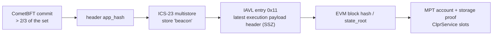

# 0G → Hiero

Status: in progress (blocked). No `CometBftVerifier` profile fits 0G, and no public CometBFT RPC or
node source was available on 2026-10-01.

## Quick facts

| Item | Value |
|---|---|
| Chain id / CAIP-2 | EVM chain id 16661 / `eip155:16661` (Aristotle mainnet). The CometBFT chain id was not readable |
| Chain type | L1. Consensus node `0gchaind` (CometBFT, 0G fork) drives an execution client (Reth or Geth) over the Engine API, in the style of beacon-kit |
| Finality source | CometBFT commit: > 2/3 of voting power (0G docs); not checked live |
| Verifier | none yet. `CometBftVerifier` ([family README](../../src/verifiers/evm/cometbft/README.md)) does not apply: EVM state is in an MPT, not in an IAVL store |
| Trust tier | Would be the family baseline plus the consensus-to-execution link |
| Typical bundle | not measured |
| Rotation | not measured |

## Why the family profile does not fit

The family proves EVM storage as IAVL entries under `app_hash`. On 0G the EVM state lives in Reth's
Merkle-Patricia trie. Evidence, read 2026-10-01:

- `web3_clientVersion` on `evmrpc.0g.ai` is `reth/v1.8.1`.
- Blocks carry `parentBeaconBlockRoot`, withdrawals with index `2^64-1` and a Prague
  `requestsHash`: the execution payload comes from a consensus client over the Engine API.
- 0G's node docs (0gfoundation/0g-doc `run-a-node/*`) start `0gchaind` with `--chaincfg.chain-spec`,
  `--chaincfg.kzg.*`, `--chaincfg.engine.jwt-secret-path` and a node API on port 3500, the
  beacon-kit command-line layout.

In upstream beacon-kit (berachain/beacon-kit `storage/kv_store_service.go`,
`storage/beacondb/keys/keys.go`) the consensus state is one IAVL store `beacon`, and the latest
execution payload header is under key prefix `LatestExecutionPayloadHeaderPrefix` (0x11). If 0G
kept that layout, the proof path would be:

This needs a new adapter (like `PolygonPosVerifier`, which goes from a CometBFT store entry to a
Bor header and an MPT proof), not a profile. The `0gchaind` source is not public
(`0gfoundation/0gchain-Aristotle` and `0gchain-NG` hold release notes only), so the store name,
key and SSZ layout cannot be confirmed from source.

Upstream beacon-kit also uses BLS12-381 CometBFT consensus keys (`primitives/crypto/bls.go`,
`bls12_381`). 0G's key type was not readable. If it is BLS12-381, the commit check needs a BLS key
scheme, which `CometBftLightClient` does not have.

## Deployment profile

Not defined. The values to read first, from a node the relay operates:

| Parameter | Where to read it |
|---|---|
| CometBFT chain id | `/status` |
| Consensus key type | `/validators` |
| Store name and payload-header key | `abci_query` on candidate keys, checked against `eth_getBlockByNumber` |
| Header hash and vote sign bytes | `/commit`, checked against the validator signatures |

## Relayer requirements

- A `0gchaind` node the relay operates. `0g-rpc.publicnode.com` answers `/status` with only a
  network name and returns "Resource not found" for `/commit`, `/validators` and `/abci_info`; the
  ITRocket endpoint `og-mainnet-rpc.itrocket.net` returned empty responses on 2026-10-01.
- An execution client with `eth_getProof` (Reth serves it on `evmrpc.0g.ai`).

## Chain-specific trust and caveats

Not assessed. The adapter would add one link to the family baseline: the execution payload header
stored by the consensus layer must be the one Reth executed.

## Live verification

None. No public data source for the commit.

## Hiero → 0G

Not built. It waits on the Hiero proof source, like every Hiero → chain direction. 0G's EVM has the
EIP-2537 precompiles: on 2026-10-01 an `eth_call` to `0x0b` (BLS12_G1ADD) with two points at
infinity returned 128 zero bytes.
