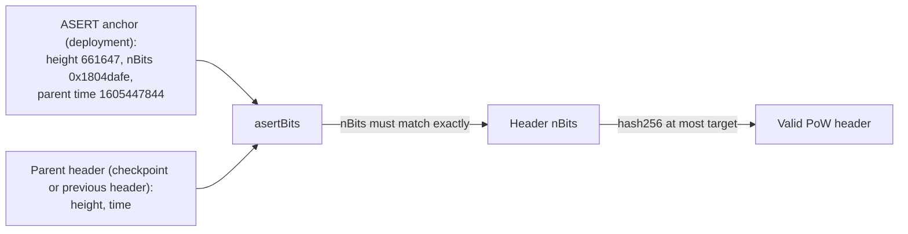

# Bitcoin Cash → Hiero

Status: in progress (prototype). Header chains (ASERT difficulty, proof of work, linkage) and a real transaction's
Merkle branch are verified on real Bitcoin Cash mainnet data (fixtures captured 2026-10-01), on Foundry and replayed
on anvil. No CLPR message has been sent on Bitcoin Cash yet. Production needs the receive-only peer channel mode
in the CLPR spec, as for Bitcoin.

## Quick facts

| Item | Value |
|---|---|
| Chain id / CAIP-2 | `bip122:000000000000000000651ef99cb9fcbe` (hash prefix of block 478,559, the first Bitcoin Cash block; the genesis is shared with Bitcoin) |
| Chain type | L1, SHA-256d proof of work, no smart contracts (Bitcoin fork, August 2017) |
| Finality source | `k` confirmations of valid proof of work (constructor parameter) |
| Verifier | `BitcoinCashVerifier`, the Bitcoin Cash profile of `BitcoinVerifier` ([family README](../../src/verifiers/bitcoin/README.md)) |
| Trust tier | SPV: no reorg deeper than `k`; deployment checkpoint canonical. Bitcoin Cash has about 0.4% of Bitcoin's hashrate, so forging `k` blocks is cheap (about $1,000 per block on 2026-10-01, see below) |
| Typical bundle | 6 real mainnet headers, no messages: 105,368 gas (`eth_estimateGas`), 1,284 B calldata (83,000 execution gas) |
| One day of lag | 144 real mainnet headers: 1,711,498 gas (`eth_estimateGas`), 12,324 B calldata |
| Rotation | None (no validator set); the checkpoint advances with each bundle |

## What differs from Bitcoin

Checked against Bitcoin Cash Node (BCHN) at commit `7b53312` (2026-09-30).

| Rule | Bitcoin Cash | Verifier |
|---|---|---|
| Header | 80 bytes, same fields as Bitcoin (`primitives/block.h`) | Unchanged base code |
| Proof of work | double-SHA256 of the header at most the target; mainnet `powLimit` = 2^224 − 1 (`0x1d00ffff`), same as Bitcoin | Unchanged base code |
| Difficulty | ASERT (aserti3-2d) since the November 2020 upgrade: every block's target is `anchorTarget x 2^((t_parent − t_anchorParent − 600 x (h_parent − h_anchor + 1)) / 172800)`, in 16.16 fixed point with a cubic approximation of 2^x, clamped to `[1, powLimit]` (`pow.cpp` `GetNextASERTWorkRequired`, `CalculateASERT`) | `BitcoinCashVerifier._checkWork`, `BitcoinLib.asertTarget`/`asertBits` |
| Transactions | Legacy serialization only (no segwit); txid = double-SHA256 of the full transaction; CashTokens data sits inside the output script field | Base parser (legacy path); a token prefix on the cursor output makes it a different sender script |
| Merkle tree | Same algorithm; canonical transaction ordering (since 2018) does not change the branch format | Unchanged base code |
| Block size | 32 MB default, adaptive (ABLA) since 2024 | Only the branch length grows: about 19 siblings (608 B) at 32 MB |

The existing retarget check must change: Bitcoin allows a new nBits only at a 2016-block boundary, while Bitcoin Cash
changes it at every block. `BitcoinVerifier` with Bitcoin's rule rejects real Bitcoin Cash headers
(`test_bitcoinRetargetRuleRejectsBitcoinCash`), and `BitcoinCashVerifier` rejects real Bitcoin headers
(`test_asertRuleRejectsBitcoinHeaders`). The ASERT check needs no extra state in the trust anchor: the parent's
height and time are already in the checkpoint, and the anchor block is fixed at deployment.

## Deployment profile

| Parameter | Mainnet value | Source |
|---|---|---|
| `powLimit` | `2^224 − 1` | BCHN `chainparams.cpp` (`consensus.powLimit`) |
| ASERT anchor `{height, bits, prevBlockTime}` | `{661647, 0x1804dafe, 1605447844}` | BCHN `chainparams.cpp` (`asertAnchorParams`); checked against real blocks 661,646 and 661,647 in the fixture |
| Half-life | 172,800 s (2 days) | BCHN `chainparams.cpp` (`nASERTHalfLife`) |
| `confirmations` (`k`) | Chosen by the value at risk; 6 in the tests. BCHN parks reorgs deeper than 10 blocks by default (`DEFAULT_MAX_REORG_DEPTH`), so `k ≥ 10` matches the node's own finality | Deployment decision |
| `maxPayloadBytes` | At most the local `maxMessagePayloadBytes` throttle; 4096 in the tests | `BitcoinCashMainnet.t.sol` |
| `caip2ChainId` | `bip122:000000000000000000651ef99cb9fcbe` | CAIP-2 `bip122` namespace |
| Deployment checkpoint | A deep mainnet block at or above height 661,647: hash, height, chainwork, bits, time; `periodStartTime = 0` | BCHN `getblockheader`, or Electrum `blockchain.block.header` |
| Channel sender | vout 1 output script of the channel's genesis cursor transaction | Genesis transaction |

## Relayer requirements

- Headers: BCHN RPC (`getblockheader`) or an Electrum Cash server (`blockchain.block.headers`, up to 2016 per call).
- Transactions and Merkle branches: BCHN `getrawtransaction` and `getblock`, or Electrum
  `blockchain.transaction.get` and `blockchain.transaction.get_merkle`.
- The payload preimages, from the sender.
- Wait for `k` confirmations (10 minutes per block on average).
- A bundle can carry about 1,500 headers of lag in 128 KB calldata (80 B each). Gas is the tighter bound: 144 real
  headers cost 1,530,371 execution gas (about 10,600 gas per header, against about 6,400 on Bitcoin, because ASERT
  runs at every header), so about 1,300 headers (about 9 days) fit in 15M gas by linear extrapolation.

## Chain-specific trust and caveats

- **Low hashrate.** The latest fixture header (969,838, nBits `0x180217c3`) needs about 2.26 x 10^21 hashes, about
  3.8 EH/s at 600 s per block, or about 0.4% of a Bitcoin block's work on the same day. At the hash price implied by
  the Bitcoin page (about $264k per 5.7 x 10^23 hashes, 2026-10-01), one Bitcoin Cash block costs about $1,000 of
  hashing; this matches the block reward (3.125 BCH at $305.6 on CoinGecko, 2026-10-01, about $955 plus fees).
  Forging 6 blocks costs about $6,000, and an attacker with 1% of Bitcoin's hashrate (about 9.8 EH/s) mines them
  in about 23 minutes. SHA-256 hashrate can be rented or moved from Bitcoin, so the value a bundle can move must stay
  far below `k` x $1,000, and a larger `k` raises the cost only linearly.
- Same as the family: no transaction script or signature checks, no fork choice; a forger needs `k` valid blocks on
  top of the anchor checkpoint, not the heaviest chain.
- Median-time-past and the 2-hour future rule are not checked. Under ASERT a parent timestamp feeds the next
  block's target directly; a forger who sets timestamps still pays for the work the resulting targets demand.
- BCHN has no 25-transaction unconfirmed-chain limit, so a channel can chain more than 25 messages per block.
  The `OP_RETURN` relay limit is 223 bytes (`MAX_OP_RETURN_RELAY`); the 55-byte commitment fits.
- The testnet minimum-difficulty rule is not supported, so only mainnet works.

## Live verification

| Item | Value |
|---|---|
| Fixtures | `test/e2e/fixtures/bitcoin-cash-live/asert-activation.json` (headers 661,646 to 661,670), `mainnet-recent.json` (headers 969,694 to 969,838, across the Bitcoin 2016 boundary at 969,696), `mainnet-tx.json` (transaction `23912e31…4c54` at position 1 of block 969,696, 5-sibling branch) |
| Captured | 2026-10-01 from Electrum Cash servers `bch.imaginary.cash`, `fulcrum.greyh.at`, `bch.loping.net` (two must agree; tip 970,972) |
| Refresh | `npm run bitcoin-cash-live:refresh` (checks linkage, PoW and ASERT before writing) |
| Replay | `forge test --match-contract BitcoinCashMainnet -vv` (18 tests) and `npm run test:e2e:bitcoin-cash-live` (5 anvil tests) |

Verified: every fixture header hashes to its block hash, links to its parent and meets its target; ASERT reproduces
the real nBits of all 167 headers after the anchor (23 right after activation, 144 recent); the BCHN anchor
parameters match the real chain; `verifyBundle` accepts 6, 23 and 144 real headers and moves the checkpoint to
`tip − k + 1` with the right chainwork; the BCHN `calculate_asert_test` vectors pass. Rejected: a wrong nBits, a bad
nonce, a skipped header, a wrong ASERT anchor, a checkpoint below the anchor, and Bitcoin headers under the Bitcoin
Cash rule (and the reverse).

Not verified live: message delivery (no CLPR transaction exists on Bitcoin Cash). The message path is the same code
as Bitcoin's, covered by the regtest tests in the family README.

## Hiero → Bitcoin Cash

Not built. Bitcoin Cash script (with native introspection since 2022, CashTokens since 2023 and the 2025 VM limits) is more expressive than
Bitcoin's, but no Hiero state-proof verifier in Bitcoin Cash script exists or was evaluated. A Bitcoin Cash channel is
receive-only on the Hiero side, which needs the spec change described in the family README.
