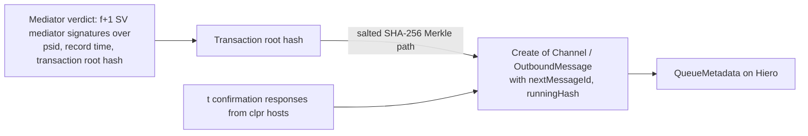

# Canton → Hiero

Status: in progress. End to end on a local Canton sandbox with anvil (2026-10-01); no public Canton network used.
Hiero → Canton proof checking is a stub.

## Quick facts

| Item | Value |
|---|---|
| Chain id / CAIP-2 | No fixed CAIP-2 namespace yet; the deployment pins an id (`canton:sandbox` in the e2e test, `canton:localnet` in the Foundry helpers) |
| Chain type | Canton synchronizer (Daml ledger); the CLPR app is a Daml package, not a smart contract on a public chain |
| Finality source | Not proven. t CLPR operators attest the queue head they read; Canton's own confirmation by the `clpr` hosts orders and commits the queue |
| Verifier | `CantonAttestedVerifier` ([family README](../../src/verifiers/canton/README.md)) and the Daml app in `daml/clpr/` |
| Trust tier | **t-of-n CLPR operators, strict majority (`n/2 < t ≤ n`), in both directions** |
| Typical bundle | 2-of-3, 3 messages: 66,260 gas (`eth_estimateGas`, e2e). n = 10, t = 7, 10 payloads of 256 B: 71,532 execution gas, 4,544 B (synthetic) |
| Rotation | 2-of-3 + one rotation, 1 message: 75,128 gas (e2e). Rotation-only 7-of-10: 84,199 execution gas, 2,016 B (synthetic) |

## Deployment profile

| Parameter | Value | Source |
|---|---|---|
| Daml SDK / LF | 3.5.12 / Daml-LF 2.2, runs on Canton 3.5.19 | `daml/clpr/main/daml.yaml`; `start-canton.sh` |
| `clpr` party | Decentralized party hosted by the n operators' participants with confirmation threshold t | Operator setup (Splice DSO pattern) |
| `cantonParty` | `keccak256` of the `clpr` party id (UTF-8); the channel `serviceAddress` is the party id | `CantonAttestedVerifier` constructor, genesis anchor |
| Genesis operator set | `operators` (secp256k1 attestation addresses, ascending), `threshold` t, `epoch` | Must equal `ClprRules.attestationKeys`, `threshold`, `epoch` on Canton |
| Canton chain id | Pinned at deployment | Constructor `chainId` |
| Running-hash scheme | `PayloadDigest` for channels to today's Hiero `ClprService` | `Channel.hashScheme`; `IntegrationCanton.t.sol` |
| Hiero chain id, verifier address | Part of the EIP-712 domain | Deployment |

## Relayer requirements

- Canton JSON Ledger API v2 (`/v2/state/active-contracts`, `/v2/state/ledger-end`, `/v2/commands/submit-and-wait-for-transaction`,
  `/v2/parties`, `/v2/dars`) on a participant that hosts `clpr` or an operator party.
- t operators online to sign each queue head and to confirm each inbound delivery.
- Each operator should read Canton through its own participant; the multi-host DSO setup was not run locally.
- Rotation only when operators change, mirrored on both ledgers.

## Chain-specific trust and caveats

- Canton is private by design: the queue contracts are visible only to the `clpr` hosts and the observers named in
  each contract. Operators can read the queue; outside parties cannot audit it.
- Endpoint manifests are attested by the operators, not proven.
- The e2e test runs on a single-participant sandbox, so the operators act as `clpr` directly.

## Live verification

- No public network fixture. The e2e test starts a sandbox: `test/e2e/backend/canton/start-canton.sh`, then
  `npm run test:e2e:canton` (5 tests: on-ledger enqueue and running hash, Canton → Hiero attest and verify on anvil,
  negative cases, rotation on both ledgers, quorum-gated inbound delivery with the stubbed Hiero check).
- Daml Script tests: 6 (`dpm test` in the container).

## Hiero → Canton

Operators confirm `DeliverInbound` on Canton, which fires at t confirmations. The Hiero proof check is a stub:
`UnverifiedHieroProofChecker` recomputes the running hash only and always reports `proofVerified: false`. Hiero state
proofs need SHA-384, BLS12-381 and WRAPS/BN254, which Daml lacks, and there is no Hiero proof source yet. A real check
needs either an off-ledger checker run by each operator once a Hiero proof source exists, or Daml-LF 2.4 with
`EXTERNAL_CALL` so that every confirming participant runs a Hiero verifier.

## Path differences from the family diagram

The Canton → Hiero path today has no consensus proof step. The planned mediator-verdict upgrade adds one:

