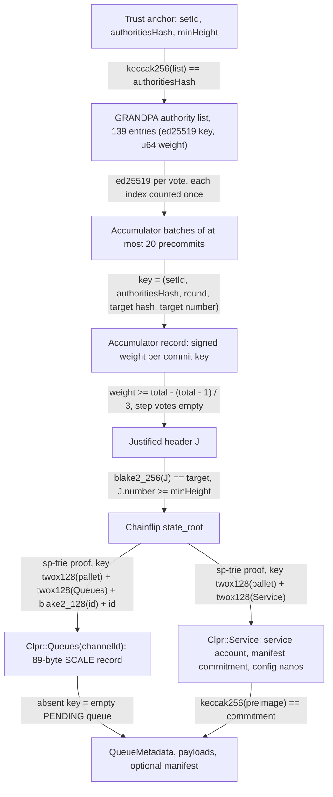

# Chainflip

Chainflip → Hiero · status: live-verified on Chainflip mainnet (2026-10-01) for finality and storage proofs; no CLPR
pallet exists on Chainflip, so no real queue has been proven

The date is the fixture capture timestamp (`recordedAt` 2026-10-01T08:08:09Z in
`test/e2e/fixtures/grandpa-live/chainflip.json`). "Live-verified" means real mainnet justifications and storage proofs
were replayed through the unmodified contracts on anvil. Chainflip has no EVM and no CLPR pallet: the queue and
service keys of the proposed pallet are proven absent from the real state, and real storage items of other pallets
are proven present under the same finality. A CLPR channel needs that pallet first (see
[Chain-specific trust and caveats](#chain-specific-trust-and-caveats)).

Family README: [Substrate verifiers: GRANDPA and BEEFY](../../src/verifiers/evm/grandpa/README.md). Chainflip uses
[`GrandpaPalletVerifier`](../../src/verifiers/evm/grandpa/GrandpaPalletVerifier.sol), which shares the GRANDPA light
client ([`GrandpaLightClient`](../../src/verifiers/evm/grandpa/GrandpaLightClient.sol)) with `GrandpaVerifier` but
reads native pallet storage instead of Frontier EVM storage, and
[`GrandpaCommitAccumulator`](../../src/verifiers/evm/grandpa/GrandpaCommitAccumulator.sol), because one commit of
Chainflip's set does not fit in one Hedera transaction.

## Quick facts

| | |
|---|---|
| Chain id / CAIP-2 | `polkadot:8b8c140b0af9db70686583e3f6bf2a59` (CAIP-2 `polkadot` namespace: the first 16 bytes of the genesis hash `0x8b8c140b…6eb9`) |
| Chain type | L1, Substrate solo chain (runtime `chainflip-node`, spec 20215: Aura + GRANDPA). No EVM, no `ParachainSystem` |
| Finality source | Its own GRANDPA, ed25519. Set 482: 139 authorities, one of weight 4 and 138 of weight 1, total 142, threshold 95. Set 481: 140 authorities, total 143, threshold 96 |
| Contracts | `GrandpaPalletVerifier` (17,272 B), `GrandpaCommitAccumulator` (6,126 B), `Ed25519Verifier` (12,206 B) |
| Trust tier | > 2/3 of the GRANDPA set's weight is honest; weak-subjectivity bootstrap checkpoint. The accumulator adds no trust: it verifies every signature |
| Typical bundle | 5 accumulator transactions (20, 20, 20, 20 and 12 signatures; largest 12,232,209 gas, 7,972 B; total 56,318,367 gas), then `verifyBundle` at 559,394 gas, 10,404 B (block #15,055,725, 92 precommits) |
| Rotation bundle | 5 accumulator transactions for 93 precommits of set 481 (largest 12,224,602 gas, 8,004 B; total 56,917,055 gas), then `verifyBundle` at 701,762 gas, 17,764 B (set 481 → 482 at block #15,016,243) |
| One commit inline | 54,573,537 gas for 92 signatures in one `verifyBundle`: does not fit 15M |

Gas is `eth_estimateGas` of the full transaction on anvil (Prague rules), from
`test/e2e/tests/verifiers/grandpa-live.spec.ts`. Every accumulator transaction and every bundle stays under Hedera's
15M gas and 128 KB.

## How the proof differs from the family path

1. The relayer splits the re-packed precommits into batches and calls
   `GrandpaCommitAccumulator.sol:accumulate` once per batch. Each call verifies its votes with
   `GrandpaLib.sol:verifyVotes` against the supplied authority list, refuses an index already counted for the same
   commit (`AlreadyCounted`), and adds the batch's weight to `signedWeight[commitKey]`.
2. `GrandpaPalletVerifier.sol:verifyBundle` runs `GrandpaLightClient.sol:_applySteps`. The step's authority list
   must hash to the anchor, and the header chain and set-change rules are the same as for Bittensor.
3. `GrandpaPalletVerifier.sol:_checkCommit` sees an empty `votes` field and reads the accumulator record for
   `(anchor setId, keccak256(list), round, blake2_256(J), J.number)`. The weight must reach the threshold
   (`GrandpaThresholdNotMet` otherwise). A step with non-empty votes is verified inline, as in `GrandpaVerifier`.
4. `SubstrateTrie.sol:get` reads `Clpr::Queues(channelId)` at J's state root. `_decodeQueueRecord` decodes the
   record. An absent key reads as an empty queue. With a manifest preimage, `_readService` and `_bindManifest` bind it
   to the `Service` record.

## Deployment profile

| Contract | Parameter | Value in the live spec | Read from |
|---|---|---|---|
| `GrandpaCommitAccumulator` | `ed25519Verifier` | Address of the deployed `Ed25519Verifier` | `grandpa-live.spec.ts` |
| `GrandpaPalletVerifier` | `ed25519Verifier` | Same `Ed25519Verifier` | `grandpa-live.spec.ts` |
| | `accumulator` | The accumulator above (`address(0)` disables empty-vote steps) | `grandpa-live.spec.ts` |
| | `palletPrefix` | `0x4d9bf76bff04c57065ce79a2c97923fb` (`twox128("Clpr")`, a placeholder: no such pallet exists) | `test/e2e/relay/buildGrandpaLiveFixture.ts` (`CHAINFLIP_PALLET`); fixture `pallet` |
| | `chainId` | `polkadot:8b8c140b0af9db70686583e3f6bf2a59` | fixture `chainId`, from `chain_getBlockHash(0)` |
| | `bootstrapSetId` | `481` | fixture `rotation.setIdBefore` |
| | `bootstrapAuthoritiesHash` | `keccak256` of the packed set-481 list (140 entries) | fixture `rotation.authoritiesBefore`, packed by `packGrandpaAuthorities` |
| | `bootstrapMinHeight` | `15016243` (the set-change block) | fixture `rotation.block.header.number` |

Pallet storage layout the verifier expects (proposed `pallet-clpr`, fixed in `GrandpaPalletVerifier.sol`):

| Item | Key | Value (SCALE) |
|---|---|---|
| `Queues` (`StorageMap`, `Blake2_128Concat` `H256`) | `twox128(pallet) ‖ twox128("Queues") ‖ blake2_128(channelId) ‖ channelId` (80 B) | 89 B: `status u8 ‖ next_message_id u64 ‖ received_message_id u64 ‖ endpoint_manifest_version u64 ‖ sent_running_hash [u8;32] ‖ received_running_hash [u8;32]`, integers little-endian |
| `Service` (`StorageValue`) | `twox128(pallet) ‖ twox128("Service")` (32 B) | 80 B: `service_address AccountId32 ‖ manifest_commitment [u8;32] ‖ config_nanos u128` |

The service address is the pallet's 32-byte account. `manifest_commitment` is
`keccak256(ClprProtobuf.encodeEndpointManifest(manifest))`, zero when unset. The running hash must follow BundleLib's
form, `h' = sha256(h ‖ sha256(payload))`, so the Hiero ClprService can recompute it from the payloads.

## Relayer requirements

- RPC methods: `chain_getFinalizedHead`, `chain_getHeader`, `chain_getBlockHash`, `grandpa_proveFinality` (the
  newest justification), `chain_getBlock` (stored `FRNK` justifications at set-change blocks), `state_getStorage`
  (`Grandpa::CurrentSetId`, `Grandpa::Authorities`), `state_getReadProof`. The public archive endpoint
  `https://mainnet-archive.chainflip.io` exposes all of them and answered state queries 1,000,000 blocks back
  (checked 2026-10-01).
- Transactions per bundle: 5 accumulator transactions plus the bundle, for about 57M gas in total. Batches of 20
  signatures leave about 2.8M gas of headroom under 15M; the accumulator itself has no batch limit.
- Ordering: batches of one commit may arrive in any order and from any sender. A batch that repeats a counted
  authority reverts, so a relayer retrying after a partial failure must drop the votes that landed
  (`isCounted(key, index)` tells which).
- Rotation cadence: the set changes once per Chainflip epoch. The live set 481 lasted 43,528 blocks; at the measured
  6 s block time that is about 72.5 hours. Each change needs one rotation bundle (5 accumulator transactions plus
  the bundle) justified by the old set.

## Chain-specific trust and caveats

- **No CLPR pallet on Chainflip.** This is the main gap. Chainflip has no smart-contract runtime, so its CLPR
  Service would have to be a native pallet with the layout above, added by a Chainflip runtime upgrade. That pallet
  does not exist and is not proposed. Until then the verifier can only prove that the queue is empty, plus any raw
  key through `verifyStorageEntry`.
- **Accumulator.** Permissionless and trust-free: anyone may submit batches, every signature is verified, and a
  record only counts for a verifier whose anchor names the same authority-list hash and set id. It does add state
  and transactions: about 57M gas per finalized block over 6 transactions, versus one transaction for Bifrost or
  Bittensor.
- **Weighted set.** One authority has weight 4. The threshold counts weight, not signers
  (`GrandpaLib.sol:threshold` over `totalWeight`), so 92 signatures including that authority reach 95.
- **ForcedChange** reverts with `ForcedChangeUnsupported`, as for the other GRANDPA chains, and needs a new
  bootstrap.
- **No inline path.** 92 ed25519 checks inline cost 54.6M gas. A SNARK of the commit (documented in the family
  README's limits) would remove the accumulator; it is not built.

## Live verification

- Fixture: `test/e2e/fixtures/grandpa-live/chainflip.json`. It holds raw public-RPC responses: the newest
  justification at #15,055,725 (set 482, 92 precommits) with a read proof for the two `Clpr` keys (absent),
  `Grandpa::CurrentSetId` and the first `System::Account` entry; and the set-change block #15,016,243
  (481 → 482, `ScheduledChange` with delay 0, 93 precommits of set 481) with a read proof of the `Clpr` keys. The
  recorder checks every precommit off-chain and checks that no `Clpr` record exists before writing.
- Refresh: `npm run grandpa-live:refresh -- chainflip` (override the RPC with `CHAINFLIP_RPC`).
- Replay: `forge build && npm run test:e2e:grandpa-live` (the "Chainflip" block, 11 cases).
- What is verified: the on-chain `queueKey` equals the relay's derivation; the full commit inline exceeds 15M gas;
  one accumulated batch is below threshold and the bundle reverts, and the same batch cannot be counted twice; the
  remaining batches bring the record to the threshold and the bundle verifies with zero metadata;
  `verifyStorageEntry` returns `Grandpa::CurrentSetId` = 482 and the `System::Account` value byte for byte, and the
  `Service` key as absent; the real 481 → 482 rotation, accumulated from set 481's precommits, returns the new
  anchor; rejection of a tampered signature in a batch, the record used under another set id, a wrong authority
  list, a stale block, and a proof with the root node missing.

## Hiero → Chainflip direction

Not started. Chainflip has no contract runtime, so a Hiero verifier would also have to be native runtime code (a
pallet that checks Hiero state proofs), added by a Chainflip runtime upgrade. Not measured.
