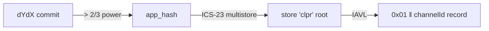

# dYdX → Hiero

Status: in progress. The verifier and the `x/clpr` module work end to end on a local chain built on
dYdX's forks, and dYdX mainnet's commit and IAVL proofs are verified live (2026-10-01). `x/clpr` is
not on dYdX mainnet, so no mainnet bundle exists.

## Quick facts

| Item | Value |
|---|---|
| Chain id / CAIP-2 | `dydx-mainnet-1` / `cosmos:dydx-mainnet-1` |
| Chain type | L1 appchain, dYdX v4 (Cosmos SDK v0.50 fork + CometBFT 0.38.5 fork), no contract runtime |
| Finality source | CometBFT commit: > 2/3 of voting power; 10 of 21 validators by power |
| Verifier | `CosmosModuleVerifier` + `CometBftCommitAccumulator` ([README](../../src/verifiers/evm/dydx/README.md)); CLPR Service = native module [`x/clpr`](../../modules/x-clpr/README.md) |
| Trust tier | Honest 2/3 of each dYdX set the anchor reaches; bootstrap checkpoint; anchor kept inside the 21-day unbonding period; module code changes only by governance upgrade |
| Typical bundle | Localnet 1,051,913 gas, 2.0 KB (measured). Mainnet estimate 7.1–7.2M (7,033,228 gas, 3.8 KB measured for commit + one store entry) |
| Rotation | Same as a bundle at the rotation header (estimate 7.1–7.2M). Catch-up across a rotation about 14M (estimate): use the accumulator |

## Deployment profile

| Parameter | Value | Source |
|---|---|---|
| Accumulator `chainId` | `dydx-mainnet-1` | fixture `test/e2e/fixtures/dydx-xclpr/mainnet.json` `chainId` |
| Accumulator `keyScheme` | `ED25519` | `/validators` key type |
| Accumulator `ed25519Verifier` | the deployed `Ed25519Verifier` | `src/verifiers/evm/sei/Ed25519Verifier.sol` |
| Verifier `storeKey` | `clpr` | `modules/x-clpr/x/clpr/types/keys.go` `StoreKey` |
| `bootstrapValidatorsHash`, `bootstrapHeight` | a recent set hash and height | `/commit?height=…` at deployment |
| Service address | `a88f550db4433c59b3322bca3a2c233cfdd69adc` (`sha256("clpr")[:20]`) | `authtypes.NewModuleAddress` |
| Store layout | `0x01‖channel` record, `0x02‖channel‖id` message, `0x03` service item | `keys.go` |

## Relayer requirements

- RPC methods: `/block_results` (or the `clpr_message_queued` events), `/commit?height=H`,
  `/validators?height=H`, `abci_query /store/clpr/key?prove=true` at `H-1`. The live fixture used
  `dydx-rpc.publicnode.com`.
- Rotations: none in 1,000 sampled mainnet blocks (about 10 min). Bundle at every rotation header.
- Signatures: the 10 highest-power signers fit one transaction; a catch-up across a rotation
  should accumulate the hop's commit first.

## Chain-specific trust and caveats

- **Governance path to mainnet**: a dYdX protocol release, then a `MsgSoftwareUpgrade` with a
  2,000 DYDX minimum deposit (1-day deposit period) and a 3-day vote (quorum 50%, threshold 50%,
  veto 33.4%); about 4 days on chain, or 2.5 days expedited (2,100 DYDX, 75% threshold). Details and
  code changes: [module README §4](../../modules/x-clpr/README.md).
- No admin key: the module and its store layout change only by chain upgrade.
- Prototype gaps: no commit-reveal channel registration, connectors, fees, slashing or inbound
  bundles yet.

## Live verification

- Fixtures: `test/e2e/fixtures/dydx-xclpr/localnet.json` (chain `dydx-clpr-local-1`, height 158, a
  channel, three messages and a manifest update) and `mainnet.json` (`dydx-mainnet-1` height
  107,588,323, bank supply of `adydx` in store `bank`); both captured 2026-10-01.
- Refresh: start the `modules/x-clpr` localnet and run `scripts/send-demo.sh`, then
  `npm run dydx-xclpr:refresh [localnet|mainnet]`.
- Replay: `forge build && npm run test:e2e:dydx-xclpr` (7 tests); `go test ./x/...` in
  `modules/x-clpr`.
- Verified: full `verifyBundle` on the localnet with the running hash recomputed from the delivered
  payloads, `verifyQueueMessage`, the live mainnet 10-of-21 commit and IAVL proof through
  `verifyModuleEntry`, and negatives (another channel, tampered record, tampered IAVL proof, wrong
  manifest, 32-byte address, bad signature, wrong set, stale header, wrong store key).

## Hiero → dYdX

Not built. It needs `MsgSubmitBundle` in `x/clpr` with a Go verifier of Hiero state proofs in the
keeper, delivery to native modules (there are no contracts on dYdX), and the Hiero proof source that
every Hiero → chain direction waits on.

## Path

The proof path is the CometBFT family's, ending in the module's own store instead of an EVM or wasm
store:

