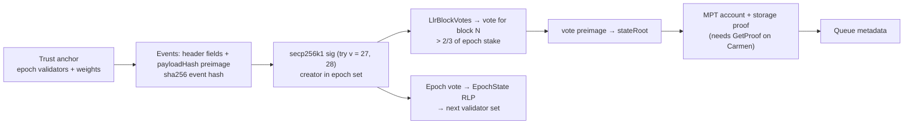

# Fantom Opera (legacy) → Hiero

Status: blocked. Opera has a signed artefact that commits to the state root (LLR block votes inside
secp256k1-signed DAG events), but no public RPC serves those votes, and the running client cannot
produce storage proofs at all (`eth_getProof` panics in its Carmen backend).

Sonic (chain 146) is covered at the end of this page because the two are often confused.

## Quick facts

| Item | Value |
|---|---|
| Chain id / CAIP-2 | 250 / `eip155:250` |
| Chain type | L1, Lachesis aBFT (leaderless DAG). Client: `Sonic/v1.2.1-j-155799a5` (Opera now runs the Sonic code base, `Fantom-foundation/sonic` tag v1.2.1-j) |
| Finality source | Lachesis DAG election (Atropos). Compact form: LLR block votes, decided at `TotalWeight/3 + 1` of stake |
| Signature scheme | secp256k1, 64 B `R‖S` without recovery byte, over the event hash `sha256(baseHash ‖ netForkID ‖ epoch ‖ seq ‖ lamport ‖ creator ‖ payloadHash)` |
| Validator set | 4 validators (`abft_getValidators latest`); largest 62.9% of stake, then 23.0% and 13.8%. One validator alone holds > 1/3; two hold > 2/3 |
| State commitment | `stateRoot` in the block record (LLR vote preimage). Storage backend Carmen S5 archive |
| Verifier | none |
| Trust tier | — (a native verifier would trust > 2/3 of 4 validators, which is 2 operators) |
| Typical bundle / rotation | — |

## Classification

**(c) Blocked.** A small new verifier is easy to sketch (below), but it has no data source:

1. **No storage proofs.** `eth_getProof` returns "method handler crashed" on `rpcapi.fantom.network`
   and `fantom.drpc.org` for an account and for a storage key. The cause is in the client:
   `gossip/evmstore/carmen.go` (sonic v1.2.1-j) panics "not supported" in `GetProof`,
   `GetStorageProof` and `StorageTrie`. A self-hosted node fails the same way.
2. **No vote export.** `dag_getEvent` / `dag_getEventPayload` return flags (`anyBlockVotes`) and
   `payloadHash` only, without the signature or the vote contents (`inter/event_serializer.go`).
   A relay would need a patched node that reads LLR votes from its database or from p2p.

What would unblock it: a client build that implements `GetProof` over Carmen S5 (whether S5 roots
are MPT-compatible was not verified) and an RPC that returns events with their signatures and LLR
votes. Given the 4-validator set (two operators clear 2/3), the attestor ("signer") family is the
cheaper honest option if a channel to Opera is needed at all.

## Evidence (live, 2026-10-01)

| Check | Result | How |
|---|---|---|
| Liveness | Block 123,505,828 at 08:15:55 UTC, epoch 0x570b8; ~5.6 s blocks, ~93 min epochs | `eth_getBlockByNumber latest` on `rpcapi.fantom.network`, `fantom.drpc.org` |
| Client | `Sonic/v1.2.1-j-155799a5-…/go1.22.12` | `web3_clientVersion` |
| Rules | `{Berlin, London, Llr: true}` | `ftm_getRules` |
| Validators | 4, weights as above | `abft_getValidators latest` |
| `eth_getProof` | error -32000 "method handler crashed" | both RPCs |
| `eth_getStorageAt` | works | both RPCs |
| `rpc.ftm.tools`, Ankr | require an API key | — |

## LLR votes (the artefact that exists)

Source: `Fantom-foundation/go-opera` release/1.1.3-rc.5 (`ace95a8`): `inter/inter_llr.go`,
`inter/event.go`, `inter/ibr/inter_block_records.go`, `inter/ier/inter_epoch_records.go`,
`gossip/c_llr_callbacks.go`, `eventcheck/heavycheck/heavy_check.go`; `lachesis-base` `hash/event_hash.go`.

- An event may carry `LlrBlockVotes{Start, Epoch, Votes[]}`. Each vote is
  `sha256(Atropos ‖ Root ‖ TxHash ‖ ReceiptsHash ‖ Time ‖ GasUsed)`, with `Root` the state root.
- The event signature covers the votes: `payloadHash = sha256(sha256(txs ‖ mps) ‖ sha256(epochVoteHash ‖ blockVotes.Hash()))`.
- Epoch votes are `sha256(BlockState.Hash ‖ EpochState.Hash)`, and `EpochState` (RLP) contains the
  validators and their public keys. So **a validator-set change is provable from signed data**.
- The protocol decides a block record at more than 1/3 of stake. A CLPR verifier should require
  more than 2/3.

## Verifier sketch (`OperaLlrVerifier`, not built)

Gas estimate (not measured): per signer two `ecrecover` (~6k) plus ~4 `sha256` (~2k) plus ~250 B
calldata (~4k) ≈ 12k; two signers for > 2/3 ≈ 25k. MPT account + storage proof 200–300k and 6–8 KB.
Total under 400k gas and 10 KB.

## Deployment profile

Not defined.

## Relayer requirements

A patched Opera node (LLR vote export, `GetProof` on Carmen). Not available.

## Chain-specific trust and caveats

- Stake is concentrated: two of four validators hold more than 2/3, one holds 62.9%.
- Opera's activity has moved to Sonic; the TVL that remains on Opera is legacy.

## Live verification

RPC probes only (table above). No fixture.

## Sonic (chain 146), for reference

- Separate chain and genesis. `rpc.soniclabs.com`: client Sonic/v2.2.2, 37 validators (top 4
  > 1/3, top 10 > 2/3), `Llr: false`.
- **No finality certificate** in `0xsoniclabs/sonic` main (`c593e51`, 2026-09-30): no certificate or
  BLS committee package; `opera/hardforks.go` sets `Llr: false` for Sonic, Allegro, Brio and Canto;
  proposals (`inter/proposal.go`) carry one proposer signature over parent hash, randao and tx hashes.
  Finality exists only as the DAG election, which has no compact proof (replaying it on Hedera would
  need every event of ~3 frames from 37 validators; not estimated precisely).
- **Storage proofs work**: `eth_getProof` on the SFC at block 80,180,000 returned 8 account + 8
  storage nodes (~6.3 KB); `keccak(accountProof[0])` equals `stateRoot` and `keccak(RLP(header))`
  equals the block hash.
- Classification: (c) for native finality; buildable now as the attestor ("signer") family plus the
  existing MPT storage proof (`ClprEvmBundleVerifier`). Native verification needs Sonic to ship a
  certificate (LLR again, or BLS block votes).

## Hiero → Opera

Opera is EVM (Berlin/London rules). No EIP-2537 was observed in its rules, so a Hiero proof would
have to be checked with BN254 precompiles. Not built; it waits on the Hiero proof source.
