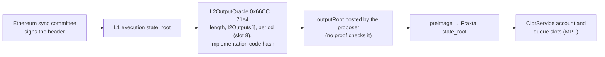

# Fraxtal → Hiero

Fraxtal → Hiero · status: live-verified on Ethereum mainnet, full FINALIZED bundle (2026-10-01)

Fraxtal (chain 252) is an OP Stack L2 that settles on Ethereum through an `L2OutputOracle`.
**There is no state validation on L1:** one proposer posts output roots, and no fault proof or
validity proof checks them. A challenger can only delete outputs within a 7-day window. This is a
weaker trust tier than the dispute-game chains: FINALIZED trusts the proposer unless the challenger
acts, and PROPOSED trusts the proposer alone.

`OpOutputOracleVerifier` (FINALIZED) and `OpOutputOracleProposedVerifier` (PROPOSED) prove, from a
header the Ethereum sync committee signs, that the oracle holds the output root at an index (past
the 7-day period for FINALIZED), then walk the Fraxtal state to the ClprService queue slots. Full
design: [output-oracle verifiers README](../../src/verifiers/evm/opstack/oracle/README.md).

## Quick facts

| Item | Value |
|---|---|
| Chain id / CAIP-2 | 252 / `eip155:252` |
| Chain type | L2, OP Stack (alt-DA), settles on Ethereum mainnet |
| Finality source | Ethereum sync committee → `L2OutputOracle` 1.8.0 `l2Outputs[i]`, past `finalizationPeriodSeconds` (604,800 s, storage slot 8) |
| Verifier contract | `OpOutputOracleVerifier` / `OpOutputOracleProposedVerifier` with [`FraxtalProfile`](../../src/verifiers/evm/opstack/oracle/profiles/FraxtalProfile.sol) · [family README](../../src/verifiers/evm/opstack/oracle/README.md) |
| Trust tier | **Weaker: no state validation.** Trusts the proposer; FINALIZED adds the challenger's 7-day veto |
| Typical bundle | FINALIZED `verifyBundle`: 3,031,541 gas, 30,564 B (anvil `eth_estimateGas`, 508/512 signers) |
| Rotation | Adds the next sync committee: 66,902 B and about 4.84M gas (EthMainnetVerifier README, real Fulu rotation), about 7.9M gas and 97 KB in total; not measured on this fixture |

## Deployment profile

Constructor: `new OpOutputOracleVerifier(l1StateVerifier, 1606824023, 12, FraxtalProfile.profile(), FraxtalProfile.accountFormat())`.

| Parameter | Value | Read from |
|---|---|---|
| `oracle` | `0x66CC916Ed5C6C2FA97014f7D1cD141528Ae171e4` | OptimismPortal `0x36cb…6f6D` (2.8.1-beta.4) `l2Oracle()`, checked at every capture; Superchain registry `fraxtal.toml` |
| `oracleImplCodeHash` | `0x530ddbfd353de0a3d5a4f4c8a69bf1e1208fe92783ef6b13d30d7aea6ff3ed2f` (implementation `0x6f3c…2b65`, L2OutputOracle 1.8.0) | `eth_getProof` at the captured L1 block |
| `outputsSlot` | 3 | storage layout; the builder checks it against `nextOutputIndex()` |
| `periodSource`, slot | `STORAGE`, slot 8 (604,800 s) | builder checks it against `finalizationPeriodSeconds()` |
| optimistic flag | none | — |
| `accountFormat` | `(4, 2, 3)`: Ethereum account leaf | `eth_getProof` on Fraxtal |
| Output root | v0, `withdrawalsRoot` of the header is the L2ToL1MessagePasser storage root (checked against `eth_getProof`) | Fraxtal headers |

## Relayer requirements

- L1: a beacon API and an execution RPC with `eth_getProof` at the signed block (oracle slots and
  implementation account).
- L2: `rpc.frax.com` serves `eth_getProof` about 400,000 blocks (about 9 days at 2 s) back, enough
  for an output past its 7-day period. Full FINALIZED bundles come from public data.
- Outputs are posted every 1,800 L2 blocks (about 1 h). FINALIZED delivers about 7 days after an
  output is posted; PROPOSED about one output interval after the L2 block.
- Rotations follow the Ethereum sync committee (about every 27 h).

## Chain-specific trust and caveats

- **No state validation on L1.** The proposer, EOA `0xFb90…bc50`, posts every output root. Nothing
  proves it. An output is "final" only because 7 days passed without a deletion.
- The challenger, a 3-of-5 Safe `0xe0d7…0508`, can delete outputs within the period. The same Safe
  owns the ProxyAdmin (no timelock): it can upgrade the oracle, change the period in slot 8, or
  write any output root. A new implementation fails closed (`OracleImplMismatch`); a changed period
  is read from storage, as the portal does.
- FINALIZED is sound if the proposer is honest, or if the Safe is honest and watches every output
  for 7 days. PROPOSED is sound only if the proposer is honest.

## Live verification

| Item | Value |
|---|---|
| Fixture | `test/e2e/fixtures/fraxtal-live/capture.json` (+ `pending/`); Foundry `test/verifiers/evm/opstack/oracle/fixtures/fraxtal-live.json` (real light-client proof) |
| Captured | 2026-10-01T07:56:00Z, Ethereum slot 15,334,776 (508/512) |
| Refresh | `npm run opadapters-live:refresh:fraxtal` |
| Replay | `forge test --match-contract OpOutputOracleFraxtalLive`; `npm run test:e2e:opstack-live:sweep51` |
| Verified | Full FINALIZED `verifyBundle` on output #23172 (L2 block 41,711,400, posted more than 7 days earlier) down to Fraxtal storage (L2ToL1MessagePasser as ClprService stand-in, channel slots absent); full PROPOSED `verifyBundle` on the newest output #23340, which FINALIZED rejects (`OutputNotFinalized`); `verifyOutput` on the proven L1 state root; unposted index, wrong root at an index, other implementation, 7-field account format, wrong pinned code hash and wrong fork version rejected |

## Hiero → Fraxtal direction

Not started on this branch. Fraxtal is EVM, so a Hiero verifier deployed on Fraxtal is the expected path.
