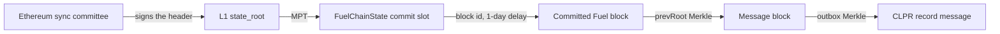

# Fuel Ignition → Hiero

Fuel Ignition → Hiero · status: live-verified on Fuel Ignition + Ethereum mainnet (2026-10-01)

"Live-verified" means the production `EthL1StateVerifier` and `FuelVerifier` proved a real Fuel message (from Fuel's
bridge contract) from the Ethereum sync committee down to the Fuel block's message outbox. No CLPR Sway contract
exists, so the CLPR record path runs on synthetic data in the Foundry tests.

**Trust tier: weaker than a light client.** Ethereum does not check Fuel's state transition; `FuelChainState` stores
whatever block id the committer posts. This verifier trusts the Ethereum sync committee **and the Fuel committer key**.

Family README: [New-runtime verifiers, batch 3](../../src/verifiers/evm/runtimes3/README.md).

## Quick facts

| | |
|---|---|
| Chain id / CAIP-2 | Fuel chain id 9889 (GraphQL `consensusParameters.chainId`); the tests use `fuel:9889`, `verifyConfig` requires `fuel:` |
| Chain type | L2 on Ethereum, FuelVM; block ids committed to Ethereum with no state validation |
| Finality source | the Ethereum sync committee signs the header; `FuelChainState` commit + 1-day delay (`TIME_TO_FINALIZE`) |
| Verifier | [`FuelVerifier`](../../src/verifiers/evm/runtimes3/FuelVerifier.sol) + [`EthL1StateVerifier`](../../src/verifiers/evm/ethereum/EthL1StateVerifier.sol) |
| Trust tier | Ethereum sync committee and the Fuel committer key; `FuelChainState` admins can pause or upgrade (the verifier stops) |
| Typical bundle | 1,425,174 gas, 12,932 B (live, full chain) |
| Rotation | sync-committee rotation adds 4,777,762 gas and 66,080 B (live); about 6.2 M gas and 79 KB with a bundle (estimate) |

## Deployment profile

| Parameter | Value | Read from |
|---|---|---|
| `l1StateVerifier` | `EthL1StateVerifier(802, 9, 87, 6, 8192)` | Electra/Fulu beacon layout (`fuel-live.spec.ts`) |
| `l1GenesisTime`, `l1SecondsPerSlot` | 1606824023, 12 | Ethereum mainnet beacon genesis |
| `chainState` | `0xf3D20Db1D16A4D0ad2f280A5e594FF3c7790f130` | fuel-bridge `deployments/mainnet/FuelChainState.json` |
| `chainStateCodeHash` | `0xee8a105971995661291a9f284262a87abf2381b3cdc93b2c8fbeffe4cd636dd9` | `eth_getProof` (fixture `l1ChainState.codeHash`) |
| `chainStateImplementation` | `0x621850dbb9160b54002b4a25b9fc9b2f26315f7e` | ERC-1967 slot (fixture); the repo's deployment file still lists an older implementation |
| `commitSlotsBase` | 301 (`_commitSlots[0].blockHash`; each commit takes 2 slots) | OZ v4 upgradeable gaps; matched against live `CommitSubmitted` |
| `pausedSlot` | 51 (`PausableUpgradeable._paused`) | same layout |
| `numCommitSlots`, `blocksPerCommitInterval`, `timeToFinalize` | 240, 10,800, 86,400 s | `eth_call` on the proxy, 2026-10-01 (the deployment file's 604,800 s is out of date) |
| `messageRecipient` | the deployment's marker recipient for record messages | chosen per deployment |
| Service address | the CLPR Sway contract id (32 bytes) | ledger configuration |

## Relayer requirements

* Ethereum: a beacon API with the light-client endpoints (`finality_update`, `bootstrap`, `updates`) and an execution
  RPC with `eth_getProof` at the signed block (taken within seconds of the update, while a non-archive node still
  has that state).
* Ethereum: `eth_getStorageAt` on the commit ring to find the newest commit past the delay.
* Fuel GraphQL: `messageProof(transactionId, nonce, commitBlockHeight)`, block headers (`version` must be `V1`).
* Cadence: commits every 10,800 Fuel blocks (about 3 hours); a commit is provable from one day after it lands until
  it is overwritten 240 commits later (about 30 days). Sync-committee rotations every about 27 hours.

## Chain-specific trust and caveats

* The committer key can make the verifier accept a forged block once the delay passes, unless `FuelChainState` is
  paused or the slot re-committed in time. This is the tier Fuel's own Ethereum bridge has.
* An upgrade or pause of `FuelChainState` stops the verifier (pinned implementation, `_paused` checked).
* Latency for a record: up to 3 hours to the next commit plus the 1-day delay.
* The record travels as a Fuel message (`std::message::send_message`), one per record change; it is never relayed on
  Ethereum, only proven here.

## Live verification

* Fixture: `test/e2e/fixtures/fuel-live/fuel.json` (captured 2026-10-01): commit 6068 (Fuel height 65534400,
  committed at Unix time 1790749427), message block 65533538 (block-history proof of 24 siblings), Ethereum mainnet
  slot 15335046 with 508/512 signers.
* Refresh: `npm run fuel-live:refresh`. Replay: `forge build && npm run test:e2e:fuel-live`.
* Verified on-chain: sync committee → state root → `FuelChainState` account and the four slots → delay → commit header
  → block history → outbox → message; a real sync-committee rotation through `verifyL1State`; rejection of a tampered
  message, a wrong history proof, a wrong commit header, a longer delay, another implementation and another committee.

## Hiero → Fuel direction

Not started. It needs a Hiero state-proof verifier in Sway (or a predicate) on Fuel.

## Path

