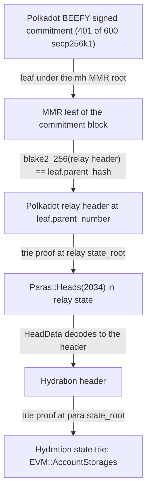

# Hydration

Hydration → Hiero · status: live-verified on Polkadot + Hydration mainnet (2026-10-01)

The date is the fixture capture timestamp (`recordedAt` 2026-10-01T04:06:48Z in
`test/e2e/fixtures/grandpa-live/hydration.json`). "Live-verified" means real Polkadot BEEFY commitments, relay state
and Hydration storage proofs were replayed through the unmodified verifier on anvil. No ClprService is deployed on
Hydration yet.

Family README: [Substrate verifiers: GRANDPA and BEEFY](../../src/verifiers/evm/grandpa/README.md).

## Quick facts

| | |
|---|---|
| Chain id / CAIP-2 | `eip155:222222` (the Frontier EVM chain id; checked by `verifyConfig`) |
| Chain type | Polkadot parachain, para id 2034, lifecycle `Parathread` under agile coretime (Frontier EVM) |
| Finality source | Polkadot relay chain BEEFY, secp256k1, 600 authorities, threshold 401 |
| Verifier contract | [`BeefyParachainVerifier`](../../src/verifiers/evm/grandpa/BeefyParachainVerifier.sol) |
| Trust tier | > 2/3 of the Polkadot BEEFY set is honest; weak-subjectivity bootstrap checkpoint |
| Typical bundle | 4.22M gas, 52.5 KB (relay #33,235,730 → Hydration #15,244,831, 401 signatures) |
| Rotation bundle | 4.16M gas, 50.9 KB (BEEFY set 5728 → 5729 at relay #33,235,434) |
| Catch-up (hop + newer commitment) | 7.39M gas, 91.7 KB |

Gas is `eth_estimateGas` of the full transaction on anvil (Prague rules), from
`test/e2e/tests/verifiers/grandpa-live.spec.ts`. Hedera's limits are 15M gas and 128 KB.

## Path

Hydration's path differs from a solo chain: finality comes from the relay chain, and the Hydration header is read
from relay state.

The BEEFY leaf's para-heads root (`leaf_extra`) does not include Hydration, because Polkadot merkelizes only
lifecycle-`Parachain` paras plus a whitelist. That is why the head comes from `Paras::Heads`.

## Deployment profile

Constructor of `BeefyParachainVerifier`. The values below are the ones the live spec deploys with. A production
deployment takes its bootstrap checkpoint from the relay chain at deploy time.

| Parameter | Value | Read from |
|---|---|---|
| `evmPalletPrefix` | `0x1da53b775b270400e7e61ed5cbc5a146` (`twox128("EVM")`) | `test/e2e/relay/substrate.ts` (`EVM_PALLET_PREFIX`); hex in `test/helpers/SubstrateSyntheticProofs.sol` |
| `chainId` | `eip155:222222` | `test/e2e/fixtures/grandpa-live/hydration.json` (`evmChainId`) |
| `paraId` | `2034` | `test/e2e/fixtures/grandpa-live/hydration.json` (`paraId`) |
| `paraHeadKey` | `0xcd710b30bd2eab0352ddcc26417aa1941b3c252fcb29d88eff4f3de5de4476c3c77a93d174890f1ff2070000` | `test/helpers/SubstrateSyntheticProofs.sol` (`PARA_HEAD_KEY_2034`); built by `paraHeadKey` in `test/e2e/relay/substrate.ts` |
| `bootstrap.current` | id 5728, len 600, root `0x574ae122d496f15159decfd50adbb8ed818ef4be9fc8af57cff0f67b90008195` | `test/e2e/fixtures/grandpa-live/hydration.json` (`rotation.anchorBefore.current`, SCALE `BeefyAuthoritySet`) |
| `bootstrap.next` | id 5729, len 600, same root | `test/e2e/fixtures/grandpa-live/hydration.json` (`rotation.anchorBefore.next`) |
| `bootstrap.minRelayBlock` | `33235433` | `test/e2e/fixtures/grandpa-live/hydration.json` (`rotation.anchorBefore.block`) |

Bootstrap source: `BeefyMmrLeaf::BeefyAuthorities` and `BeefyMmrLeaf::BeefyNextAuthorities` read with
`state_getStorage` at a trusted relay block (`test/e2e/relay/buildGrandpaLiveFixture.ts:recordHydration`).

## Relayer requirements

- Polkadot RPC methods: `beefy_getFinalizedHead`, `chain_getHeader`, `chain_getBlockHash`, `chain_getBlock` (for
  `justifications`, engine `BEEF`), `state_getStorage` (`Beefy::Authorities`, `Beefy::ValidatorSetId`,
  `BeefyMmrLeaf::BeefyAuthorities`, `BeefyMmrLeaf::BeefyNextAuthorities`, `Paras::Heads`), `state_getReadProof`
  (`Paras::Heads(2034)`).
- MMR: `mmr_generateProof` needs a Polkadot node with offchain indexing. `https://rpc.polkadot.io` answers
  `LeafNotFound`; `https://dot-rpc.stakeworld.io` works. Production needs an own indexing node or a provider that
  offers it.
- Hydration RPC methods: `state_getReadProof` (the `EVM::AccountStorages` keys) at the para block named by the
  relay head. The recorder also uses `state_getKeysPaged` to pick real slots for the test.
- Archive depth: read proofs are taken at a recent finalized relay block and its para head; archive depth for older
  blocks is not measured.
- Signature aggregation: none. The relayer packs the signers bitfield and the 65-byte signatures from the stored
  `CompactSignedCommitment`. `BEEF` justifications are stored about every 8 blocks.
- Rotation cadence: every session. The fixture measures a session of 2,396 relay blocks (about 4 h). The relayer
  must submit at least one bundle per session, or use a one-hop catch-up bundle; two hops do not fit in 128 KB.

## Chain-specific trust and caveats

- Finality is the Polkadot BEEFY set, not a Hydration validator set. BEEFY follows GRANDPA and has the same
  2/3-honest assumption, enforced by BEEFY equivocation slashing.
- A para head included in a finalized relay block is final. The verifier takes the head that relay state holds at
  `leaf.parent_number`, one block before the commitment block.
- The BEEFY set id rotates every session even when the keys stay the same (current and next roots are equal in the
  fixture).
- Polkadot relay GRANDPA (600 ed25519 voters, about 235M gas) is not usable on Hedera; BEEFY is.

## Live verification

- Fixture: `test/e2e/fixtures/grandpa-live/hydration.json`. It holds the BEEFY commitment at relay #33,235,730
  (relay header #33,235,729, Hydration #15,244,831) and the BEEFY rotation 5728 → 5729 at relay #33,235,434
  (Hydration #15,243,965), each with authorities, MMR proof, relay header, relay read proof and Hydration read proof.
- Refresh: `npm run grandpa-live:refresh -- hydration` (override with `POLKADOT_RPC`, `POLKADOT_MMR_RPC`,
  `HYDRATION_RPC`).
- Replay: `forge build && npm run test:e2e:grandpa-live` (the "Hydration (Polkadot BEEFY, secp256k1)" block, 11
  cases).
- What is verified: a typical bundle (401 of 600 real signatures → MMR leaf → relay header → `Paras::Heads(2034)` →
  Hydration header → absent channel slots, zero metadata); the real rotation; the one-hop catch-up; three real non-zero
  Hydration EVM slots through the trie harness; rejection of a tampered signature, 400 signatures (below threshold),
  an anchor two sessions behind, a wrong authority list, a stale commitment, a relay header that is not the leaf's
  parent, and a para proof from a different para block.
- The "service" is the live contract `0xc91808c129c9766b13d22c9f0cd53db459c0bc48`, not a ClprService.

## Hiero → Hydration direction

Not started on this branch. It needs a ClprService and a Hiero verifier deployed on Hydration's Frontier EVM, and a
check of which precompiles the Hydration runtime exposes. Not measured.
