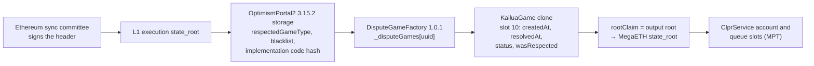

# MegaETH → Hiero

MegaETH → Hiero · status: live-verified on Ethereum mainnet to the MegaETH state root (2026-10-01)

MegaETH (chain 4326) is an OP Stack L2 that settles on Ethereum through Kailua games (RISC Zero
fault proofs). Its OptimismPortal2 3.15.2 has no AnchorStateRegistry: the portal itself holds the
respected game type, the blacklist and the finality delay. `OpStackVerifier` /
`OpStackProposedVerifier` read the portal as the registry (same library, a different layout), prove
that a Kailua game's output root is accepted, and walk the MegaETH state to the ClprService queue
slots. Full design: [OP Stack verifiers README](../../src/verifiers/evm/opstack/README.md).

## Quick facts

| Item | Value |
|---|---|
| Chain id / CAIP-2 | 4326 / `eip155:4326` |
| Chain type | L2, OP Stack, settles on Ethereum mainnet |
| Finality source | Ethereum sync committee → OptimismPortal2 3.15.2 (registry) → KailuaGame 0.1.0 (game type 1337) |
| Verifier contract | `OpStackVerifier` / `OpStackProposedVerifier` with [`MegaEthProfile`](../../src/verifiers/evm/opstack/profiles/MegaEthProfile.sol) · [family README](../../src/verifiers/evm/opstack/README.md) |
| Trust tier | Weaker: one proposer in practice (the Kailua vanguard); 1-of-1 guardian; 6-of-10 upgrade Safe, no timelock |
| Typical bundle | FINALIZED `verifyL2StateRoot`, GAME mode: 2,835,004 gas, 33,860 B (anvil `eth_estimateGas`, 509/512 signers). No full bundle: no public `eth_getProof` |
| Rotation | Adds the next sync committee: 66,902 B and about 4.84M gas (EthMainnetVerifier README, real Fulu rotation); not measured on this fixture |

## Deployment profile

Constructor: `new OpStackVerifier(l1StateVerifier, 1606824023, 12, MegaEthProfile.profile())`.

| Parameter | Value | Read from |
|---|---|---|
| `rootFormat` | `OUTPUT_ROOT` | game `rootClaim` = `keccak256(0 ‖ stateRoot ‖ withdrawalsRoot ‖ blockHash)` of the L2 header (builder cross-check) |
| `l2ChainId` | 4326 | chain id |
| `anchorStateRegistry` | `0x7f82f57F0Dd546519324392e408b01fcC7D709e8` (the OptimismPortal) | portal `disputeGameFactory()` / `respectedGameType()`; the portal has no `anchorStateRegistry()` |
| `anchorStateRegistryImplCodeHash` | `0xb6f8eea7ffbe1cf300214a7aec117095296e02ce4dbe88d7f25866205f511b7e` (implementation `0x5540…9fd9`, OptimismPortal2 3.15.2) | `eth_getProof` at the captured L1 block |
| `disputeGameFinalityDelaySeconds` | 302,400 (3.5 days) | portal implementation immutable (`disputeGameFinalityDelaySeconds()`) |
| `gameImplementation` | `0x8c0Ed8Dd0CcF6d596e321d81eD895ad51fE30B84` (KailuaGame 0.1.0) | DGF `0x8546…D563` (1.0.1) `gameImpls(1337)` |
| `gameArgsHash` | 0 (DGF 1.0.1) | DGF |
| `layout` | `MegaEthProfile.layout()`: registry slots DGF 56, blacklist 58, respected type 59 (offset 0) with `respectedGameTypeUpdatedAt` (offset 4) as the retirement timestamp, both anchor slots 2; DGF games 103; game state and wasRespected slot 10 (offsets 0, 8, 16, 17) | Sourcify layouts of the portal, DGF and KailuaGame implementations, checked against live storage |

## Relayer requirements

- L1: as for every profile of the family. Use GAME mode only: the portal has no anchor root.
- L2: `mainnet.megaeth.com/rpc` answers "eth_getProof is not supported" and `megaeth.drpc.org`
  (mega-reth) "not currently supported". Headers are served. Full bundles need a MegaETH node that
  serves `eth_getProof`; whether mega-reth's state trie supports Ethereum-style account proofs was
  not checked.
- Latency: a game resolves after a 7-day challenge clock, then is final 3.5 days later, so
  FINALIZED delivers about 10.5 days after the L2 block. Proposals come about once per hour (3,600
  one-second blocks per proposal).
- Rotations follow the Ethereum sync committee (about every 27 h).

## Chain-specific trust and caveats

- **No anchor root.** The layout points both anchor slots at slot 2 (ResourceMetering `__gap`,
  always zero), so ANCHOR mode always reverts `OutputRootNotAnchor` (tested on live data).
- The verifier rejects games created at or before `respectedGameTypeUpdatedAt`; the portal accepts
  a game created in that same second, so the verifier is one second stricter.
- Proposals: the Kailua treasury `0x0185…75f3` gives its vanguard `0x6644…8EC5` an advantage of
  2^60 − 1 s, so in practice only the vanguard proposes. Disputes are settled by RISC Zero proofs
  (verifier `0x910b…C057`) within a 7-day clock.
- The guardian is a 1-of-1 Safe `0xB2A9…E67F` (pause, blacklist, respected type). Pause is not
  proven (family README §2).
- A 6-of-10 Safe `0x92e0…b7d6` owns the ProxyAdmin and the DGF, with no timelock. Through the
  upgrade-and-restore path (family README §3) it can make both tiers accept any root.
- PROPOSED trusts the vanguard outright.

## Live verification

| Item | Value |
|---|---|
| Fixture | `test/e2e/fixtures/megaeth-live/capture.json`; Foundry `test/verifiers/evm/opstack/fixtures/megaeth-live.json` |
| Captured | 2026-10-01T07:52:43Z, Ethereum slot 15,334,739 (509/512) |
| Refresh | `npx tsx test/e2e/relay/buildOpStackLiveProof.ts --chain megaeth --refresh` |
| Replay | `forge test --match-contract OpStackMegaEthLive`; `npm run test:e2e:opstack-live:sweep51` |
| Verified | FINALIZED GAME mode on the final game `0xaA92…3598` (L2 block 27,133,200) to the MegaETH state root; the newest game `0xA659…CbE4` accepted by PROPOSED and rejected by FINALIZED; the resolved game `0x19E3…5bF8` rejected by FINALIZED inside the delay; ANCHOR mode rejected; other game implementation, other portal implementation, any game args and fork-version negatives |

## Hiero → MegaETH direction

Not started on this branch. MegaETH is EVM, so a Hiero verifier deployed on MegaETH is the expected path.
