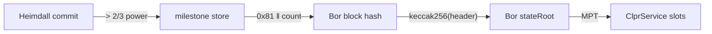

# Polygon PoS → Hiero

Status: live-verified on Polygon PoS mainnet, Heimdall v2 + Bor (2026-10-01).

## Quick facts

| Item | Value |
|---|---|
| Chain id / CAIP-2 | Bor `137` / `eip155:137`; Heimdall `heimdallv2-137` / `cosmos:heimdallv2-137` |
| Chain type | L1 with two layers: Bor (EVM, MPT) finalized by Heimdall v2 (CometBFT 0.38.22, Polygon fork) |
| Finality source | Heimdall milestone: > 2/3 of Heimdall power voted the Bor block hash; the Heimdall header storing it has a > 2/3 secp256k1eth commit (10 of 104 signers) |
| Verifier | `PolygonPosVerifier` + `CometBftCommitAccumulator` ([README](../../src/verifiers/evm/polygon/README.md)) |
| Trust tier | Honest 2/3 of Heimdall stake for each set the anchor reaches; bootstrap checkpoint; Bor producers not trusted |
| Typical bundle | 3,450,850 gas, 29.6 KB (live) |
| Rotation | 3,445,272 gas, 29.5 KB (live). Missed rotation: 5,001,483 gas, 38.7 KB with one inline hop |

## Deployment profile

| Parameter | Value | Source |
|---|---|---|
| Accumulator `chainId` | `heimdallv2-137` | fixture `chainId` |
| Accumulator `keyScheme` | `SECP256K1_ETH` | 0xPolygon/cometbft v0.3.8-polygon (`cometbft/PubKeySecp256k1eth`) |
| Verifier `storeKey` | `milestone` | heimdall-v2 `x/milestone/types/keys.go` |
| Verifier `borChainId` | `137` | fixture `borChainId`; milestone `bor_chain_id` |
| `bootstrapValidatorsHash`, `bootstrapHeight` | a recent Heimdall header's set hash and height | `/commit?height=…` at deployment |
| Milestone key | `0x81 ‖ count (u64 BE)`; latest count at `0x83` | heimdall-v2 `keys.go` |
| Live probe contract | WPOL `0x0d500b1d8e8ef31e21c99d1db9a6444d3adf1270` | fixture `service` |

## Relayer requirements

- Heimdall RPC: `/commit?height=H`, `/validators?height=H`,
  `abci_query /store/milestone/key?prove=true` at `H-1` (count and milestone).
- Bor RPC: `eth_getBlockByNumber(end_block)`, `eth_getProof(service, slots, end_block)`.
- **Speed or archive node.** Public Bor nodes serve `eth_getProof` only about 128 blocks back
  (1,000 back fails on publicnode, drpc and 1rpc). The relay must fetch the Bor proofs as soon as a
  milestone lands, or run a Bor archive node.
- Rotations: 2 Heimdall set changes in about 2,000 blocks (about 40 min). Each is one ordinary
  bundle.
- Signatures: 10 secp256k1eth signatures (about 32k gas each); no accumulator split needed.

## Chain-specific trust and caveats

- Bor's own block seal is ignored; only Heimdall milestones count.
- Heimdall stake lives in StakeManager on Ethereum; the anchor must stay within the stake-withdrawal
  delay.
- About 30 KB of calldata per bundle; the receiving ClprService's `maxSyncBytes` must allow it.
- No ClprService is deployed on Polygon yet; the live bundle proves exclusion of the channel slots
  on WPOL.

## Live verification

- Fixture: `test/e2e/fixtures/polygon-live/polygon.json`: typical header 54,594,513 (milestone
  14,893,911 → Bor 94,750,873), rotation `R = 54,595,178` (milestone 14,894,242 → Bor 94,751,421),
  `B = R + 2` (milestone 14,894,243 → Bor 94,751,423); captured 2026-10-01.
- Refresh: `npm run polygon-live:refresh` (waits up to 90 min for a live rotation), or
  `POLYGON_ROTATION_WAIT_MIN=0 npm run polygon-live:refresh` for a typical bundle only.
- Replay: `forge build && npm run test:e2e:polygon-live` (9 tests).
- Verified: typical bundle, rotation bundle and the bundle after it, inline catch-up, WPOL slots 0–2
  by existence, and negatives (flipped signature, below threshold, wrong set, stale anchor, foreign
  Bor header, tampered milestone proof, another service, another channel).

## Hiero → Polygon PoS

Not built. Bor runs an EVM, so the direction would deploy a Hiero verifier contract on Bor. It waits
on the Hiero proof source, like every Hiero → chain direction.

## Path

The path differs from the CometBFT family diagram by the Bor hop:

