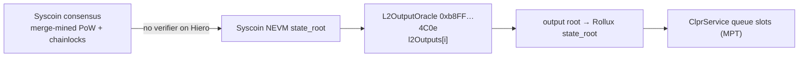

# Rollux → Hiero

Rollux → Hiero · status: blocked (2026-10-01)

Rollux (chain 570) is an OP Stack (Bedrock) L2 that settles on **Syscoin NEVM** (chain 57), not on
Ethereum. Its output roots sit in an `L2OutputOracle` on Syscoin NEVM. The output-oracle verifier
could read that oracle, but only from a Syscoin NEVM state root that Hiero can trust, and this
repository has no verifier for Syscoin's consensus. Rollux is therefore not covered.

## Quick facts

| Item | Value |
|---|---|
| Chain id / CAIP-2 | 570 / `eip155:570` (L1: Syscoin NEVM, 57 / `eip155:57`) |
| Chain type | L2, OP Stack Bedrock, settles on Syscoin NEVM |
| Finality source | Syscoin NEVM → `L2OutputOracle` 1.3.1 `0xb8FFE6015e1c00CFA620F884f25f21f001744C0e`, 3,600 s finalization period |
| Verifier contract | none. The L2 half would be `OpOutputOracleVerifier` ([family README](../../src/verifiers/evm/opstack/oracle/README.md)); its L1 half (`EthL1StateVerifier`) proves Ethereum state only |
| Trust tier | — (blocked) |
| Typical bundle | — |
| Rotation | — |

## What was checked (2026-10-01)

| Item | Value | Source |
|---|---|---|
| OptimismPortal | `0xfE43B2C8A481c412481BC5A36261380eDc417266`, version 1.7.0, `L2_ORACLE()` = the oracle | `rpc.syscoin.org`; `SYS-Labs/rollux` `packages/contracts-bedrock/deployments/mainnet` |
| L2OutputOracle | `0xb8FFE6015e1c00CFA620F884f25f21f001744C0e`, version 1.3.1, 34,491 outputs, latest L2 block 51,736,500 | `rpc.syscoin.org` |
| Period | `FINALIZATION_PERIOD_SECONDS` = 3,600 | `rpc.syscoin.org` |
| Proposer / challenger | `0x2182…C95F` / `0xEF64…c189` | `rpc.syscoin.org` |
| L2 proofs | `rpc.rollux.com` serves `eth_getProof` at the head and 100,000 blocks back | `rpc.rollux.com` |
| L1 consensus | NEVM blocks carry difficulty 0 in the EVM header; Syscoin is merge-mined with Bitcoin, and finality comes from chainlocks: 3 of 4 quorums of 400 masternodes agree on a block, about every 5 blocks (about 12.5 min) | `rpc.syscoin.org`; docs.syscoin.org |

## Blocker

The Ethereum-anchored verifiers start from a header the Ethereum sync committee signs. Syscoin NEVM
has no sync committee. Proving a Rollux output root on Hiero needs, first, a verifier of Syscoin
NEVM state on Hiero:

1. A chainlock verifier: the BLS threshold signatures of Syscoin's long-living masternode quorums
   over the Syscoin block, plus a way to track quorum membership as it rotates every few hours.
2. The binding from a chainlocked Syscoin block to the NEVM block and its `stateRoot`.
3. A fallback rule for blocks without a chainlock (Nakamoto longest chain over merge-mined PoW),
   which a contract cannot check without a header chain and a work threshold.

None of this exists in the repository, and step 1 needs the quorum BLS scheme, keys and message
format to be checked against Syscoin's source before any design. With a trusted Syscoin NEVM state
root, the existing `OpOutputOracleVerifier.verifyOutput` and bundle path would apply unchanged
(oracle 1.3.1 keeps `l2Outputs.length` at slot 3, like Blast's and Fraxtal's: slot 3 reads 34,491 =
`nextOutputIndex()`).

## Relayer requirements

Not applicable until the blocker is resolved. The L2 side is ready: `rpc.rollux.com` serves headers
and `eth_getProof`.

## Live verification

None. No fixture is committed for Rollux.

## Hiero → Rollux direction

Not started. Rollux is EVM, so a Hiero verifier deployed on Rollux is the expected path; it does not
depend on the Syscoin blocker.
