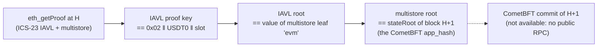

# Stable → Hiero

Status: in progress. The profile and the state layout are confirmed on Stable mainnet
(2026-10-01); the commit is not, because no public CometBFT RPC serves it.

## Quick facts

| Item | Value |
|---|---|
| Chain id / CAIP-2 | `stable_988-1` / `cosmos:stable_988-1` (EVM chain id 988) |
| Chain type | L1, Cosmos SDK + StableBFT (Stable's CometBFT-based consensus) + Cosmos EVM; node `stabled` v1.8.0, source not public |
| Finality source | CometBFT commit: > 2/3 of voting power (per Stable's consensus docs); not checked live |
| Verifier | `CometBftVerifier` ([family README](../../src/verifiers/evm/cometbft/README.md)) |
| Trust tier | Family baseline: honest 2/3 of each validator set the anchor reaches; bootstrap checkpoint; anchor kept inside the unbonding period |
| Typical bundle | not measured (no commit available) |
| Rotation | not measured |

## Deployment profile

| Parameter | Value | Source |
|---|---|---|
| `chainId` | `stable_988-1` | stablelabs/dev-docs `install-node.mdx` and `node-configuration.mdx` (`stabled init … --chain-id stable_988-1`) |
| `storeKey` | `evm` | live: the multistore proof returned by `eth_getProof` has leaf key `evm` |
| `evmStateKeyPrefix` | `0x02` | live: the IAVL proofs returned by `eth_getProof` carry the key `0x02‖address‖slot`; the existence value is a 32-byte word equal to `eth_getStorageAt` |
| `keyScheme` | not confirmed | needs `/validators`; Cosmos SDK defaults to Ed25519 consensus keys |
| `ed25519Verifier` | the deployed `Ed25519Verifier` if the key scheme is Ed25519 | `src/verifiers/evm/sei/Ed25519Verifier.sol` |
| `bootstrapValidatorsHash`, `bootstrapHeight` | chosen at deployment | `/commit?height=…` on a node the relay runs |
| Live probe contract | USDT0 `0x779ded0c9e1022225f8e0630b35a9b54be713736`, EIP-1967 implementation slot | stablelabs/stable-tokenlist; fixture `target` |

Stable v1.8.0 stores state in MemIAVL (live since height 36,976,000). MemIAVL computes the same
IAVL root hashes, and the live proofs below verify with the IAVL ICS-23 spec.

## How the live check works

Cosmos EVM's `eth_getProof` returns, per storage slot, the two ICS-23 proofs that `abci_query
/store/evm/key?prove=true` would return. The builder records them for the five channel slots and
one non-zero slot at height `H`, plus blocks `H` and `H+1`, and checks:

The dashed step is what is missing for a full `verifyBundle`.

## Relayer requirements

- A Stable node the relay operates (or a provider that exposes CometBFT RPC). Stable's docs list
  only the EVM endpoint `rpc.stable.xyz`; the published mainnet `config.toml` binds the CometBFT
  RPC to `127.0.0.1:26657`, and no third-party CometBFT endpoint was found on 2026-10-01.
- RPC methods: `/status`, `/commit?height=H`, `/validators?height=H`,
  `abci_query /store/evm/key?prove=true` at `H-1` (or `eth_getProof` at `H-1`), `/blockchain` to
  find rotation headers.
- History: the published `app.toml` uses `pruning = "default"` (the last 362,880 states); MemIAVL
  serves recent versions and a RocksDB VersionDB serves older ones on archive nodes.
- Not measured: validator count, signatures needed for > 2/3, rotation rate.

## Chain-specific trust and caveats

- Same trust as the family baseline once the commit format is confirmed.
- StableBFT is described as a customised CometBFT. The header hash and vote sign bytes are not
  confirmed, because no commit was available. A full live bundle is the test.
- Stable plans to move consensus to Autobahn (DAG-based BFT). That would change the commit format
  and need a new adapter (family README; fork-aware verifier ADR).

## Live verification

- Fixture: `test/e2e/fixtures/cometbft-live/stable.json` (state at height 41,404,183, app hash from
  block 41,404,184; captured 2026-10-01 from `rpc.stable.xyz`).
- Refresh: `npm run cometbft-live:refresh stable`.
- Replay: `npm run test:e2e:cometbft-live` (the `stable (state only)` test).
- Verified off-chain: the five channel slots are non-existence proofs; the EIP-1967 slot is an
  existence proof with a 32-byte value equal to `eth_getStorageAt`; every proof roots at block
  `H+1`'s `stateRoot`. A flipped proof byte and a `0x03` prefix are rejected.
- Not verified: the CometBFT commit and validator set, so no on-chain `verifyBundle` and no gas.

## Hiero → Stable

Not built. It waits on the Hiero proof source, like every Hiero → chain direction. Stable's EVM has
the EIP-2537 precompiles: on 2026-10-01 an `eth_call` to `0x0b` (BLS12_G1ADD) with two points at
infinity returned 128 zero bytes.
