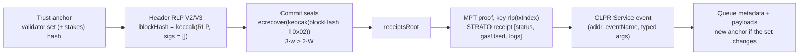

# STRATO → Hiero

Status: in progress (new verifier needed; mainnet blocked until block 1,000,000). Finality is a
public, checkable commit certificate (Blockstanbul PBFT, secp256k1 seals), but STRATO serves no
storage proofs, and mainnet commits no receipts before its block-1,000,000 fork. The verifier
has to prove the CLPR queue through receipt (event) proofs, which work on the "helium" testnet today.

## Quick facts

| Item | Value |
|---|---|
| Chain id / CAIP-2 | `0x7030addddcf2` (123354377739506) / `eip155:123354377739506` (mainnet "upquark"; `net_version` 33056204878082667) |
| Chain type | L1, permissioned PBFT ("Blockstanbul", an Istanbul BFT variant in Haskell); client `STRATO/v19.3`; contracts on SolidVM (not the EVM) |
| Finality source | Commit seals in the header: `3·w > 2·W` (by headcount before staking, by stake after). Instant finality |
| Signature scheme | secp256k1, 65 B `r‖s‖v` with `v ∈ {0,1}`, over `keccak256(blockHash ‖ 0x02)`; `blockHash = keccak256(RLP(header with signatures = []))` |
| Validator set | 17 validators on mainnet (block 473,164, 12 seals present); 4 on testnet "helium" (stake-weighted V3 headers) |
| State commitment | MPT `stateRoot`, `receiptsRoot` (Ethereum-style MPT keyed by `rlp(txIndex)`) |
| Verifier | none yet. Sketch below: `StratoVerifier` (QBFT-family style, new header codec, receipt proofs) |
| Trust tier | > 2/3 of the permissioned validator set (headcount, later stake); no slashing; governance at `0x100` controls set changes |
| Typical bundle | Not measured. Estimate 200–350k gas, 2–4 KB |
| Rotation | Not measured. Same as a bundle: a header with non-empty `newValidators`/`removedValidators` (V3: `stakeUpdates`) |

## Classification

**(b) Buildable with a new verifier.** The existing `QBFTVerifier` does not fit as a profile:

- Besu QBFT seals sign `keccak256(RLP(header with empty seals))` inside `extraData`
  (`src/libraries/proof/qbft/ClprQbftSeal.sol`). STRATO puts the validator lists and seals in their own
  top-level RLP fields, and its seal signs `keccak256(blockHash ‖ 0x02)`.
- `QBFTVerifier` proves `ClprService` storage with `eth_getProof`. STRATO has no storage proof:
  `eth_getProof` returns "Method not found" and `eth_getStorageAt` "not yet implemented".
- Contracts run on SolidVM (`eth_getCode` returns `0x01`), so the CLPR Service would be a SolidVM
  contract; a Solidity `ClprService` cannot be deployed unchanged.

## Evidence (live, 2026-10-01)

| Check | Result | How |
|---|---|---|
| Header hash | Rebuilt V2 header (869 B RLP) hashes to the API `blockHash` | `script/hard51/strato_header_check.py` on block 473,164 (and 472,938 earlier) |
| Commit seals | 12 of 12 seals recover to members of the 17-validator `currentValidators`; proposer seal also valid | same script |
| Testnet V3 | Block 687,995 (helium): hash matches, 3 of 3 seals recover (stake-weighted) | research probe (not committed) |
| Storage proofs | `eth_getProof`: "Method not found"; `eth_getStorageAt`: "not yet implemented" | `noderpc.strato.nexus/rpc` |
| Receipt proofs | `GET /strato-api/eth/v1.2/receipts/number/N/proof/i` returns an MPT proof; verified to `receiptsRoot` and the sealed header on testnet. Mainnet returns 400 "no receipt"; mainnet `receiptsRoot` is the empty-trie root | REST API |
| Height | `eth_blockNumber` 0x7383f (473,151); latest REST block 473,164 minutes later; ~3.9 s blocks | `noderpc.strato.nexus/rpc` |

Source: `strato-net/strato-platform` (Apache-2.0, HEAD `d9701c3`, 2026-09-30):
`strato/core/blockapps-data/.../BlockHeader.hs` (V2/V3 header fields),
`strato-model/.../Blockstanbul/Model/Authentication.hs` (seal digest), `.../Model/Class.hs`
(quorum), `ethereum-jsonrpc/src/Commands.hs` (RPC methods), `api/core/src/Handlers/Receipts.hs`
(receipt proof route), `techdocs/platform/consensus.md`, `techdocs/platform/networks.md`.
Receipts become part of the mainnet header commitment at the fork at block 1,000,000 (also the
staking activation height). At ~3.9 s per block that is about 24 days after 2026-10-01
(extrapolation).

## Verifier sketch (`StratoVerifier`, not built)

1. Decode the V2 or V3 header; recompute `blockHash` with `signatures = []`.
2. Check that the header's `currentValidators` (V3: plus `currentStakes`) hash to the anchor.
3. `ecrecover` each seal over `keccak256(blockHash ‖ 0x02)` (`v + 27`), reject duplicates and
   non-members, require `3·w > 2·W`.
4. If `newValidators`, `removedValidators` or `stakeUpdates` are non-empty, return the next anchor.
5. Verify a receipt MPT proof against `receiptsRoot` with `MerklePatriciaProof` (reused) and decode
   the STRATO receipt's log list to find the CLPR Service event that carries the queue state
   (running hash, message ids, payloads).

Gas estimate (not measured): RLP walk 30–40k; 12–17 `ecrecover` with loop 60–85k; set check <10k;
receipt MPT proof (1–3 nodes) 30–60k; receipt/log decoding 20–50k; calldata 2–4 KB at 16 gas/B
32–64k. Total about 200–350k gas, far below 15M and 128 KB.

The queue has to be event-based (one event per state change, as for Stellar and Hyperliquid in other
families), because storage is not provable.

## Deployment profile

Not defined. Values to fix at deployment:

| Parameter | Value | Source |
|---|---|---|
| Chain id | `0x7030addddcf2` | `eth_chainId` |
| Header version | V2 now; V3 (stake-weighted) after the fork | `BlockHeader.hs` |
| Bootstrap set | `currentValidators` of a recent header (17 addresses) | REST `/strato-api/eth/v1.2/block/last/1` |
| Quorum mode | headcount (V2) / stake (V3) | `Class.hs` |
| CLPR Service | none deployed; SolidVM contract emitting queue events | — |

## Relayer requirements

- REST: `/strato-api/eth/v1.2/block/...` (headers with seals) and `/receipts/number/N/proof/i`. The
  JSON-RPC methods `strato_getFinalizedHeader` and `strato_getReceiptProof` exist in source for
  this purpose but return 403 on the public RPC.
- Submit every header that changes the set or the stakes. How often stakes change after block
  1,000,000 is not known yet.

## Chain-specific trust and caveats

- Permissioned network with known validators and no slashing. Trust is "more than 2/3 of the
  permissioned validators (by headcount, later by stake)"; a set change is decided by an admin vote
  in `MercataGovernance` (`0x100`, through `AdminRegistry` `0x100c`) or by `StratoStaking`.
- On mainnet nothing provable carries CLPR data until receipts are committed (block 1,000,000).
- A SolidVM CLPR Service is a port, not the reference Solidity contract.

## Live verification

- `python3 script/hard51/strato_header_check.py https://noderpc.strato.nexus/strato-api/eth/v1.2/block/last/1`
  (MATCH and 12/12 seals at block 473,164, 2026-10-01). No fixture, no on-chain verifier yet.

## Hiero → STRATO

Not built. A SolidVM contract would have to verify Hiero proofs; whether SolidVM exposes the needed
precompiles (BLS12-381 or BN254 pairing) was not checked. It also waits on the Hiero proof source.
