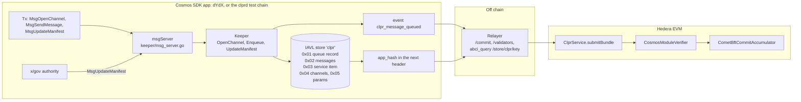
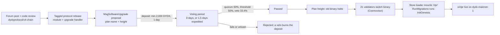

# x/clpr: a native Cosmos SDK CLPR Service (prototype)

dYdX v4 has no contract runtime, so a CLPR Service there has to be a native module. This directory
holds that module. It is a minimal outbound queue with a running hash per channel, kept in the
module's own IAVL store and laid out for ICS-23 proofs. It also holds a one-validator chain that
runs the module. The Hiero half is
[`CosmosModuleVerifier`](../../src/verifiers/evm/dydx/README.md), which verifies this chain's
commits and store proofs end to end (results in that README §1).

| | |
|---|---|
| SDK | **Pinned to dYdX v4 `protocol/v9.7.1`**, the version live on dydx-mainnet-1 (9.7.x on 2026-10-01). Same forks as dYdX's `go.mod`: `dydxprotocol/cosmos-sdk v0.50.6-0.20260428191449-a212821dc2c3`, `dydxprotocol/cosmos-sdk/store v1.0.3-…dd116391188d`, `dydxprotocol/iavl v1.1.1-…1c8b8e787e85`, `dydxprotocol/cometbft v0.38.6-…904204b11c9e`, `cosmossdk.io/core v0.11.0` |
| Go | 1.24 (dYdX's `go.mod` says 1.23.1) |
| Module | `x/clpr`: keeper, msg server, genesis, CLI, protos in `proto/clpr/v1` (generated with `ghcr.io/cosmos/proto-builder:0.14.0`, `scripts/protocgen.sh`) |
| Test chain | `app/` + `cmd/clprd`: auth, bank, staking, genutil, consensus, clpr. Bech32 prefix `dydx`. It is not dYdX's app; it reuses dYdX's SDK, store and consensus code, which is what produces the proofs |

## Architecture



The keeper is the only writer of the `clpr` store. Every change to a channel's queue rewrites its
90-byte record at `0x01 ‖ channel_id`, which is the one entry a bundle proves; message values at
`0x02` are proven only on demand (`verifyQueueMessage`). The module has no Begin/EndBlocker.

## 1. State and keys

Store key `clpr`. Every key has a fixed length within its prefix, so absence of any channel or
message is provable with an ICS-23 non-existence proof.

| Key | Value |
|---|---|
| `0x01 ‖ channel_id(32)` | **Queue record**, 90 B: `0x01 ‖ status ‖ next_message_id ‖ received_message_id ‖ endpoint_manifest_version ‖ sent_running_hash ‖ received_running_hash` (u64 big-endian). It is rewritten on every change and is the only entry a bundle proves. |
| `0x02 ‖ channel_id ‖ message_id u64 BE` | `ClprMessageValue{payload, running_hash_after_processing}` (spec §1.4). `payload` is the serialized `ClprMessagePayload` exactly as it entered the hash |
| `0x03` | Service item: module address `sha256("clpr")[:20]` ‖ `keccak256(manifest)` |
| `0x04 ‖ channel_id` | `Channel` bookkeeping (owner, `acked_message_id`, …), not proven |
| `0x05` | `Params` (`admin`, `max_message_payload_bytes`) |

The queue record uses the same 90-byte encoding as the CosmWasm CLPR Service design
(Provenance README §4). Both chain families therefore share one record codec on the Hiero side.

Running hash: `h' = SHA-256(h ‖ SHA-256(payload))`, starting from 32 zero bytes. This is the
Solidity reference's form (`BundleLib`), which the Hiero receiver recomputes. The spec's §4.1 text
omits the inner hash.

## 2. Messages

| Msg | Signer | Effect |
|---|---|---|
| `MsgOpenChannel{owner, channel_id}` | anyone | Channel ACTIVE, record `{next: 1, hashes: 0}` (spec §2.1 initial values). **Prototype stand-in** for `registerChannel`/`completeChannel` (§5.1) |
| `MsgSendMessage{sender, channel_id, connector_id, target_application, message_data}` | anyone | Spec §4.3 steps 1, 4 (local cap), 6–9: builds `ClprMessage` with `sender` = signer bytes, stores the value, advances `next_message_id` and the running hash, rewrites the record, and emits `clpr_message_queued{channel_id, message_id, running_hash}` |
| `MsgUpdateManifest{authority, manifest}` | keeper authority (x/gov on a real chain) or `params.admin` | Stores `keccak256(manifest)` in the service item and sets every record's `endpoint_manifest_version` to the manifest's `version` |

## 3. Run it

```bash
cd modules/x-clpr
go build -p 2 -o build/clprd ./cmd/clprd      # ~85 MB binary
scripts/localnet.sh init                        # build/home, chain id dydx-clpr-local-1, test keyring
scripts/localnet.sh start &                     # RPC 127.0.0.1:36657, 1 s blocks
scripts/send-demo.sh                            # open channel, 3 messages, manifest
go test ./x/...                                 # keeper tests incl. the cross-language golden vector
# Hiero side, from the repo root:
npm run dydx-xclpr:refresh localnet && forge build && npm run test:e2e:dydx-xclpr
```

The fixture in `test/e2e/fixtures/dydx-xclpr/localnet.json` holds the real commit, the validator
set and the ABCI proofs (`abci_query /store/clpr/key?prove=true` at `H-1`) from that run.

## 4. Getting x/clpr into dYdX mainnet

### 4.1 Governance path (checked live on 2026-10-01)

dYdX ships protocol changes as a coordinated **software upgrade** through `x/gov` +
`x/upgrade`. There is no permissionless code path, because the chain has no contract runtime.

| Step | What | Reference |
|---|---|---|
| 1. Discussion | Forum post and a code review with the protocol maintainers (dydxprotocol/v4-chain). The module and its upgrade handler land in a tagged `protocol/vX.Y` release | Every recent release, e.g. `protocol/v9.7.1` |
| 2. Proposal | `MsgSoftwareUpgrade{plan: {name, height}}` signed by the gov module account, submitted with a deposit | Proposal **395** "dYdX Chain Software Upgrade v9.7", plan `v9.7` at height 105,002,000, passed 2026-09-10 |
| 3. Deposit | min **2,000 DYDX** (`2000000000000000000000adydx`), initial ≥ 20%, max deposit period **1 day** | `/cosmos/gov/v1/params/deposit` |
| 4. Vote | **3-day** voting period. Quorum **50%**, threshold **50%**, veto **33.4%** (veto burns the deposit). Expedited: 1.5 days, 75% threshold, 2,100 DYDX | `/cosmos/gov/v1/params/voting`, `…/tallying` |
| 5. Upgrade | At the plan height the old binary halts; validators (21 active, per proposal 396) switch to the new binary (Cosmovisor). The upgrade handler runs the module's `InitGenesis` through `RunMigrations`, and the store loader mounts the new store | `app/upgrades.go` `setupUpgradeStoreLoaders` |

So the shortest on-chain path is about 4 days (1 day deposit + 3 days voting), or about 2.5 days
expedited. The real lead time is the code review and release cycle before that.



### 4.2 Code changes in dydxprotocol/v4-chain (protocol/)

| File | Change |
|---|---|
| `app/app.go` | Add `clprtypes.StoreKey` to `NewKVStoreKeys`; build `ClprKeeper` with `runtime.NewKVStoreService(keys[clpr])` and authority = gov module address; add `clpr.NewAppModule` to the module manager and to `SetOrderInitGenesis` / export order (no Begin/EndBlocker needed) |
| `app/upgrades/v10.0/constants.go` (next version) | `StoreUpgrades{Added: []string{clprtypes.StoreKey}}`. Precedent: v7.0 added `affiliates` and v6.0.0 added `listing`, `revshare`, `marketmap` and `accountplus` the same way |
| `app/upgrades/v10.0/upgrade.go` | `RunMigrations` (calls `InitGenesis` for the new module with default params, which writes the service item) plus any CLPR params |
| `app/msgs/normal_msgs.go`, `all_msgs.go` (+ their tests) | List `/clpr.v1.MsgOpenChannel`, `/clpr.v1.MsgSendMessage` (+ responses) as **normal** (user-submittable) msgs. `MsgUpdateManifest` goes in `internal_msgs.go` (gov-only). dYdX's tests fail on any registered msg not listed |
| `app/basic_manager`, `app/module_accounts.go` | Register the module basic; add the `clpr` module account (no mint/burn permissions) |
| `app/process` / `lib/ante` | No change expected. `x/clpr` txs are ordinary "other" txs (`DecodeOtherMsgsTx` rejects only app-injected, internal, unsupported and CLOB msgs) |
| Indexer (`indexer/`) | Optional: decode `clpr_message_queued` events for the off-chain stack; the relayer can read them from `/block_results` instead |

### 4.3 What the prototype still needs before a proposal

1. **Inbound direction (Hiero → dYdX)**: `MsgSubmitBundle` with a Go verifier of Hiero state proofs
   inside the keeper. Delivery to native handlers (there are no contracts on dYdX; targets would be
   modules such as `x/sending` for USDC transfers) and replies. The record's `received_*` fields are
   already in place.
2. **Spec features**: commit-reveal channel registration and `verifyConfig`, connectors with bonds,
   fees and slashing, queue-depth limits, lazy config propagation (Control Messages), acks and
   message pruning (§4.4), and full genesis import/export (`ExportGenesis` only exports params today).
3. **dYdX economics**: fee denomination and gas costs for the new msgs; rate limits in line with dYdX's
   mempool rules; spam protection, since every `SendMessage` writes two IAVL keys on a chain
   tuned for order throughput.
4. Audits of the module and the verifier, and a testnet run (`dydx-testnet-4`) before mainnet.

## 5. Reuse on other Cosmos chains

The module only depends on standard SDK interfaces (`core/store.KVStoreService`, `x/auth` module
address, msg service). The Hiero side is the same `CosmosModuleVerifier` with a per-chain profile
(chain id, store key `clpr`, bootstrap set). Versions below were checked on 2026-10-01 from each
chain's latest release `go.mod` and live endpoints.

| Chain | SDK / CometBFT | Contract runtime today | Best CLPR Service | How a native module gets in |
|---|---|---|---|---|
| **dYdX** | v0.50 (dYdX fork) / 0.38 fork | none | **x/clpr** (this) | x/gov software upgrade (§4) |
| **THORChain** | v0.53.0 / 0.38.21, wasmd v0.54.10 (`thornode` develop) | CosmWasm (App Layer; uploads whitelisted) | **CosmWasm** service (`CosmWasmVerifier`, Provenance README §8). A native module is possible, but THORChain is one monolithic `x/thorchain` handler set | No x/gov. Node operators run `MsgProposeUpgrade` / `MsgApproveUpgrade`, and the upgrade is scheduled when **≥ 2/3 of active nodes** approve (`keeper/v1/keeper_upgrade.go` `UpgradeApprovedByMajority`). The core dev team has to accept the module first. Also: 67 equal-power signers mean a 4-tx accumulator per header (CometBFT README §6.4) |
| **Osmosis** | v0.50.14 (osmosis-labs fork) / 0.38.23, wasmd v0.53.3 (v31.0.3) | CosmWasm; `code_upload_access = AnyOfAddresses` (53 addresses), instantiate = Everybody | CosmWasm via a gov proposal adding the uploader to the allowlist, which is cheaper than a software upgrade. **x/clpr ports unchanged** (same v0.50 API) if a native module is preferred | x/gov `MsgSoftwareUpgrade`: 30,000 OSMO deposit, 5-day vote (1-day expedited), quorum 30%, threshold 50% |
| **Regen** | v0.53.4 / 0.38.21, wasmd v0.60.1 (v7.3.0) | CosmWasm module present; **upload and instantiate restricted to one address** (`AnyOfAddresses`, live params) | Either. A native `x/clpr` fits Regen's module-first style (ecocredit, data); the port from core v0.11 to v0.53's `core` store service is mechanical | x/gov `MsgSoftwareUpgrade`: 2,000 REGEN deposit, **7-day** vote, quorum 40%, threshold 50% |

Porting notes:
- v0.50 → v0.53: `cosmossdk.io/core` moves to the 1.x store service and `x/auth` keeps
  `NewModuleAddress`. The keeper code and key layout do not change, so the Hiero verifier does not
  change either.
- The verifier needs a commit that fits Hedera's 15M gas. dYdX needs 10 Ed25519 signatures
  (~7.1M per bundle). Chains with more signers use the accumulator split (Provenance README §3).
- The store name `clpr` and the layout must be identical on every chain. A chain that renames the
  store only changes the profile's `storeKey`.
