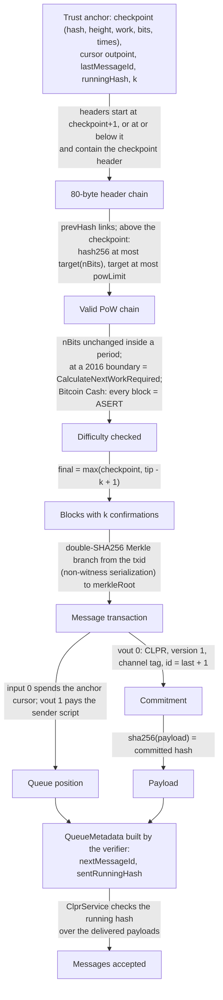
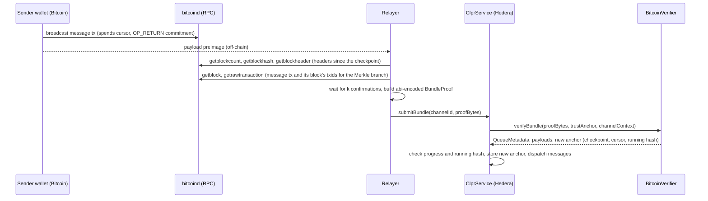

# BitcoinVerifier: Bitcoin → Hiero (prototype)

`BitcoinVerifier` is an `IClprVerifier` that runs on Hedera's EVM (or any EVM) and verifies CLPR messages sent on
Bitcoin L1 (direction `Bitcoin → Hiero`, one way only). It is a stateless proof-of-work (SPV) light client: every
piece of state it needs lives in the channel's trust anchor. Bitcoin has no smart contracts and so no ClprService.
A message is a Bitcoin transaction with a 55-byte `OP_RETURN` commitment to the payload hash, and the queue is a
chain of UTXO "cursor" spends. The verifier proves that each message transaction is in a block with at least `k`
confirmations of valid proof of work, and builds the queue metadata itself.

## At a glance

| Item | Value |
|---|---|
| Chains covered | Bitcoin mainnet (`bip122:000000000019d6689c085ae165831e93`), Bitcoin Core regtest; Bitcoin Cash mainnet (`bip122:000000000000000000651ef99cb9fcbe`) through the `BitcoinCashVerifier` profile (ASERT difficulty). Per-chain pages: [`docs/chains/bitcoin.md`](../../../docs/chains/bitcoin.md), [`docs/chains/bitcoin-cash.md`](../../../docs/chains/bitcoin-cash.md) |
| Direction | Bitcoin → Hiero only. Needs the receive-only peer channel mode (see below) before production |
| Finality source | Proof of work: the message block has at least `k` confirmations (constructor parameter, e.g. 6) |
| Trust (one line) | No reorg deeper than `k` (SPV assumption); the deployment checkpoint is canonical |
| Typical bundle | 6 headers + 3 segwit messages: 192,050 gas (`eth_estimateGas`, real regtest), 3,972 B calldata |
| Rotation | None: there is no validator set. The checkpoint advances with each bundle at no extra cost |
| Contract size | `BitcoinVerifier` runtime 13,471 B (11,105 B under EIP-170); `BitcoinCashVerifier` 14,097 B (10,479 B under) |
| Status | Prototype. Header, retarget and transaction rules verified on real mainnet data (fixtures fetched 2026-10-01); end to end on a real `bitcoind -regtest` chain on anvil. Bitcoin Cash: headers (ASERT, PoW) and a transaction verified on real mainnet data (2026-10-01), replayed on anvil |

## How it works



1. `BitcoinVerifier.sol:_decodeTrustAnchor` reads the ABI-encoded anchor (352 bytes).
2. `BitcoinVerifier.sol:_verifyChain` checks the header chain against the checkpoint: parent links, and for headers
   above the checkpoint `_checkWork` checks the proof of work and the difficulty bits with `BitcoinLib` (compact
   targets, `CalculateNextWorkRequired`, chainwork). `BitcoinCashVerifier.sol:_checkWork` overrides it for Bitcoin
   Cash: every header's nBits must equal `BitcoinLib.asertBits` (BCHN `GetNextASERTWorkRequired`). It returns the Merkle roots and the final height.
3. `BitcoinVerifier.sol:_verifyClprTx` checks each message: the Merkle branch, that the transaction is not the
   coinbase and not 64 bytes long, that input 0 spends the cursor, and that vout 1 still pays the sender script.
4. `BitcoinVerifier.sol:_parseCommitment` reads the `OP_RETURN` commitment, the channel tag and the message id.
   `verifyBundle` checks the id sequence and that `sha256(payload)` equals the commitment.
5. `BitcoinVerifier.sol:_deliverable` checks that the payload is a DATA message the service accepts. An
   undeliverable payload is passed on as a `ClprRedactedMessage` with the payload hash, so a bad commitment cannot
   halt the channel. A wrong preimage still reverts (`PayloadHashMismatch`).
6. `verifyBundle` builds `QueueMetadata` (`nextMessageId = lastId + 1`, `sentRunningHash` folded as
   `sha256(h ‖ sha256(payload))`, `receivedMessageId = 0`, `state = ACTIVE`) and returns a new anchor if the
   checkpoint moved or messages were delivered.

### Messages and queue order

- **Commitment.** vout 0 of every message is exactly
  `OP_RETURN PUSH53 "CLPR"(4) ‖ version(1)=0x01 ‖ channelTag(8) ‖ sha256(payload)(32) ‖ messageId(8, big-endian)`.
  `channelTag` is the first 8 bytes of the CLPR `channelId`, so one channel cannot replay another's messages.
- **Payload.** A protobuf `ClprMessage` DATA. It is not on Bitcoin: the relayer supplies the preimage.
- **Cursor.** Input 0 of every message spends the previous message's vout 1, and vout 1 of the message is the new
  cursor. Bitcoin forbids double spends, so the cursor chain is linear: total order and exactly-once delivery
  without an on-chain queue. Bitcoin Core's default mempool ancestor limit (25) caps a channel at about 25 messages
  per block.
- **Sender.** The genesis transaction's vout 1 `scriptPubKey` is the channel's sender. Every message's vout 1 must
  pay back to it (`CursorNotHeldBySender`), and a payload whose `sender` field is not that script is not delivered
  as a message.

## Bundle lifecycle



Channel setup uses a genesis cursor transaction (message id 0, zero payload hash) proven by `verifyConfig` against
the deployment checkpoint.

## Trust model

Trusted:
- **No reorg deeper than `k`** (the standard SPV assumption). The verifier sees only the chain the relayer shows it
  and does not compare competing forks. SPV does not check transaction signatures, so a forger does not need the
  sender's key, and the fork never has to be the heaviest chain: `k` valid blocks on top of the anchor checkpoint are
  enough.
- **The deployment checkpoint is on the canonical chain.** It roots every channel's config proof. The config headers
  must connect to it with valid proof of work, so a channel operator cannot choose a fake checkpoint.
- **The sender publishes the payload preimage** (data availability is the sender's job).

Not trusted:
- The relayer. Every byte is checked; a relayer can only delay delivery. It must supply the exact preimage.
- Miners below the `k`-block threshold.

Cost of a forgery: an attacker must mine `k` valid blocks at the current difficulty. With mempool.space data from
2026-10-01 (difficulty about 1.33 x 10^14, about 5.7 x 10^23 hashes per block, network about 982 EH/s, average reward
over the last 144 blocks about 3.15 BTC, BTC about $83,900), one block costs about $264k of hashing at break-even:

| k | Cost to forge | Time for an attacker with 10% of the hashrate |
|---|---|---|
| 6 | about 19 BTC, about $1.6M | about 10 h |
| 12 | about 38 BTC, about $3.2M | about 20 h |

The value a single bundle can move on a channel must stay well below `k x block reward`. After a successful forgery
the channel is also stuck, because the anchor sits on the private fork.

## Proof format

Trust anchor, `abi.encode(TrustAnchor)` (11 static words, 352 bytes):

| Field | Type | Meaning |
|---|---|---|
| `checkpoint.blockHash` | `bytes32` | Deepest verified block with at least `k` confirmations (internal byte order) |
| `checkpoint.height` | `uint32` | Its height |
| `checkpoint.chainWork` | `uint256` | Cumulative work at the checkpoint (reported; no fork choice in v1) |
| `checkpoint.bits`, `time`, `periodStartTime` | `uint32` | nBits, timestamp, and the timestamp of the first block of the current 2016-block period |
| `cursorTxid`, `cursorVout` | `bytes32`, `uint32` | Outpoint the next message must spend |
| `lastMessageId` | `uint64` | Last delivered id (0 = none) |
| `runningHash` | `bytes32` | Running hash after `lastMessageId` |
| `confirmations` | `uint8` | `k`, copied from the constructor at `verifyConfig` |

Trust anchor id: `checkpoint.blockHash ‖ lastMessageId`.

Bundle `proof_bytes`, `abi.encode(BundleProof)`:

| Field | Type | Meaning |
|---|---|---|
| `startHeight` | `uint32` | Height of the first header |
| `headers` | `bytes` | Consecutive 80-byte headers |
| `messages` | `TxProof[]` | In queue order |
| `TxProof.headerIndex` | `uint32` | Index of the message's block in `headers` |
| `TxProof.txIndex` | `uint32` | Position of the transaction in the block |
| `TxProof.merkleBranch` | `bytes32[]` | Siblings, leaf first |
| `TxProof.rawTx` | `bytes` | Legacy or segwit serialization |
| `TxProof.payload` | `bytes` | Payload preimage (empty for the genesis transaction) |

Configuration: `configProof = abi.encode(ConfigProof{startHeight, headers, genesis: TxProof})`. `verifyConfig`
returns the constructor's CAIP-2 id, the genesis block time as `peerConfigNanos`, endpoint manifest version 0
(manifest proofs are rejected) and placeholder peer throttles.

Constructor (per deployment): `powLimit`, `noRetargeting`, `allowMinDifficulty` (only with `noRetargeting`),
`confirmations` (`k`), `maxPayloadBytes` (must not exceed the local `maxMessagePayloadBytes` throttle),
`caip2ChainId`, and the deployment `checkpoint`. `BitcoinCashVerifier` takes `powLimit`, `confirmations`,
`maxPayloadBytes`, `caip2ChainId`, `checkpoint` (at or above the ASERT anchor height), the ASERT anchor
`{height, bits, prevBlockTime}` and the half-life; under ASERT `checkpoint.periodStartTime` is unused (0).

### Rules not checked (by design)

- **Median-time-past and the 2-hour future rule.** MTP needs 11 prior timestamps and the future rule needs a trusted
  clock. They mainly guard the retarget against timestamp games, which the x4 clamp bounds and which still cost
  full-difficulty work. Real mainnet timestamps are not monotonic (967679 < 967678, covered by a test).
- **Transaction validity** (scripts, signatures, amounts): the SPV assumption.
- **testnet3/testnet4/signet difficulty rules.** The constructor rejects `allowMinDifficulty` without `noRetargeting`.

## Validator-set / committee rotation

Bitcoin has no validator set, so there is no rotation. The checkpoint moves to the header at
`final = max(checkpoint.height, tip − k + 1)` on each bundle, never backwards, and only to blocks buried at least `k`
deep. A bundle with headers only (no messages) also advances it.

Catch-up: headers may start at or below the checkpoint, bound to it by hash linkage only, so a message in a block
behind the checkpoint stays provable. Each block of lag costs 80 bytes: about 1,500 blocks (about 10 days) fit in
128 KB, and 1,000 headers cost 6,377,768 execution gas.

## Gas and calldata

Hedera limits: 15M gas and 128 KB calldata. Foundry figures are `verifyBundle` execution gas on synthetic regtest
chains (`BitcoinVerifierRegtest.t.sol`). Anvil figures are `eth_estimateGas` on a real `bitcoind -regtest` chain
(`bitcoin-verifier.spec.ts`, run on 2026-10-01) and include the 21k base and calldata cost. Bitcoin Cash rows come
from `BitcoinCashMainnet.t.sol` and `bitcoin-cash-live.spec.ts` on the 2026-10-01 fixture. They vary by a few hundred
gas between runs, because each run creates new transactions.

| Scenario | Foundry execution gas | Anvil `eth_estimateGas` | Calldata |
|---|---|---|---|
| 6 headers + 3 segwit messages | 125,821 | 192,050 | 3,588 B (Foundry), 3,972 B (anvil) |
| 7 headers + 3 messages (config + bundle test) | – | 191,895 | 4,132 B |
| 12 headers + 3 segwit messages | 162,283 | 235,605 | 4,068 B (Foundry), 4,452 B (anvil) |
| 1,000 headers + 3 messages (synthetic) | 6,377,768 | – | 83,108 B |
| Bitcoin Cash, 6 real mainnet headers, no messages | 83,000 | 105,368 | 672 B proof, 1,284 B calldata |
| Bitcoin Cash, 144 real mainnet headers (one day), no messages | 1,530,371 | 1,711,498 | 11,712 B proof, 12,324 B calldata |

A normal bundle uses about 1.5% of the gas limit and about 3.5% of the calldata limit.

## Limits and known gaps

- **Receive-only peer mode is required before production** (next section).
- **One sender per channel**, the genesis cursor script. More senders need more channels, or a shared multisig or
  taproot script.
- **`OP_RETURN` size.** The 55-byte commitment is inside Bitcoin Core's long-standing standard limit (83 bytes, one
  `OP_RETURN` per transaction). Payloads live off-chain, so payload availability is the sender's responsibility.
- **Throughput and latency.** One message per Bitcoin transaction (about 270 vB with a separate fee input), about 25
  chained messages per channel per block, and `k` blocks of latency (about 1 h at `k = 6`).
- **Reorgs deeper than `k` break safety.** There is no fork choice in v1. Possible later mitigations: a challenge
  window where a heavier competing chain from the same checkpoint replaces the anchor (the chainwork is already
  tracked), several relayers, and a per-channel `k` chosen by value.
- **Header lag** of about 1,500 blocks per bundle (calldata). A later version could keep an MMR of verified header
  hashes in the anchor for O(log n) historical proofs.
- **Sender-side hazards.** A transaction that spends the cursor with a malformed commitment (wrong id, tag or format),
  or a sender who never publishes a preimage, halts the channel; it must then be closed and re-created. Only the
  channel's own sender can cause this, so sender tooling must validate before broadcasting.
- **Networks:** mainnet and regtest only. testnet3, testnet4 and signet are not implemented (signet needs
  block-signature validation). Bitcoin Cash: mainnet only; its testnets (minimum-difficulty rule) are not supported.
  No CLPR message has been sent on Bitcoin Cash; its message path is the same code as Bitcoin's.
- No `IClprVerifier` compliance suite runs against this verifier yet; the integration test runs it against an
  unmodified ClprService.

### Required spec change: receive-only peer channels

Bitcoin script cannot verify a Hiero state proof, so nothing on Bitcoin can accept a CLPR bundle, a reply or an
acknowledgement. Today's ClprService treats every channel as bidirectional. `IntegrationBitcoin.t.sol` shows the
gaps:

1. **Replies pile up.** Every inbound DATA message makes the service enqueue a REPLY for the peer, which can never
   acknowledge it: after 3 messages `nextMessageId` is 4 and `ackedMessageId` stays 0. The storage is never reclaimed,
   and lazy CONTROL config updates add more.
2. **Outbound sends are refused only by accident.** The verifier returns placeholder peer throttles with
   `maxSyncBytes = 1`, so `sendMessage` reverts. That is not a protocol guarantee.
3. **Close never completes**, because DRAINED → CLOSED needs every outbound message acknowledged.
4. **No response semantics.** Bitcoin senders get no REPLY; applications must treat Bitcoin messages as
   fire-and-forget.

Proposed change (not implemented; `ClprService` and `BundleLogic` are untouched):

- A `receiveOnly` channel flag, fixed at `completeChannel` and declared by `verifyConfig` (a new return field or a
  flag in the peer's `ClprThrottles`), since the verifier knows that the peer cannot receive.
- On a `receiveOnly` channel:
  - `sendMessage` reverts (`ClprChannelReceiveOnly`);
  - inbound DATA still calls the application and connector and still charges and slashes, but enqueues no REPLY; the
    result is emitted as an event and the application's return data is dropped;
  - CONTROL config updates are not enqueued;
  - the outbound queue is always empty, so close goes CLOSING → DRAINED → CLOSED locally, without the peer-done
    condition;
  - the peer's `receivedMessageId` must be 0.
- Spec sections affected: §2.1.1 channel lifecycle, §4.2 Step 5b close conditions, §4.3 `sendMessage` guard, §4.5
  response ordering, and `LedgerConfiguration` / `ChannelContext` to carry the flag.
- Fee model: without replies, connectors cannot learn success through `onClprResponse`, so source-side slashing
  never applies.

## Upgrades and forks

- **Soft forks** that keep the 80-byte header, the double-SHA256 proof of work, the 2016-block retarget and the
  txid serialization do not affect the verifier (segwit and taproot are examples; witness data is parsed and
  skipped).
- **Changes to the header, difficulty or Merkle rules** (a hard fork) break verification. Under the fork-aware
  verifier ADR
  ([`ADR/2026-10-01-fork-aware-verifiers.md`](https://github.com/shayansal/clpr-spec/blob/adr/fork-handling/ADR/2026-10-01-fork-aware-verifiers.md),
  draft PR [LFDT-CLPR/clpr-spec#1](https://github.com/LFDT-CLPR/clpr-spec/pull/1)) a difficulty-rule change is
  Class B and a proof-of-work change is Class C. Bitcoin Cash's ASERT rule is handled as a separate profile
  contract (`BitcoinCashVerifier`), deployed with a checkpoint after the ASERT anchor block.
- **Chain splits** are outside the ADR: a split keeps both chains valid under the same rules. The verifier follows
  whatever chain the relayer shows it from the checkpoint, so the deployment checkpoint and `k` decide which chain a
  channel follows.
- The verifier is not fork-aware yet.

## Running it

```sh
# Real mainnet fixtures and synthetic regtest chains, including gas
forge test --match-path 'test/verifiers/bitcoin/*' -vv

# The unmodified ClprService consuming this verifier
forge test --match-path test/integration/IntegrationBitcoin.t.sol

# bitcoind -regtest in Docker (image bitcoin/bitcoin:28.1) → anvil; skips without Docker
npm run test:e2e:bitcoin-verifier

# Re-fetch the mainnet fixtures from the Blockstream Esplora API (optional)
npx tsx test/verifiers/bitcoin/fixtures/fetch-mainnet.ts

# Bitcoin Cash: replay the live mainnet fixture on anvil, and refresh it from Electrum Cash servers
npm run test:e2e:bitcoin-cash-live
npm run bitcoin-cash-live:refresh
```

Test counts on this branch: 20 mainnet-fixture, 35 regtest-chain, 18 Bitcoin Cash and 3 integration tests (Foundry),
2 anvil tests against a real `bitcoind`, 5 anvil tests replaying Bitcoin Cash mainnet headers.

## Files

| File | Purpose |
|---|---|
| `src/verifiers/bitcoin/BitcoinVerifier.sol` | `verifyConfig`, `verifyBundle`, trust anchor, message and cursor rules |
| `src/verifiers/bitcoin/BitcoinLib.sol` | Headers, compact targets, retarget, ASERT, chainwork, Merkle branches, transaction parsing |
| `src/verifiers/bitcoin/BitcoinCashVerifier.sol` | Bitcoin Cash profile: ASERT difficulty check in place of the 2016-block retarget |
| `test/verifiers/bitcoin/BitcoinMainnet.t.sol` | Real mainnet headers around three retargets and real legacy and segwit transactions |
| `test/verifiers/bitcoin/BitcoinVerifierRegtest.t.sol` | Synthetic regtest chains, negative cases and gas |
| `test/verifiers/bitcoin/BitcoinTestBuilder.sol` | Builds synthetic headers, transactions and proofs |
| `test/verifiers/bitcoin/fixtures/mainnet-{2016,32256,967680}.json` | Mainnet headers around each retarget boundary |
| `test/verifiers/bitcoin/fixtures/mainnet-tx-{legacy,segwit}.json` | Real transactions with Merkle branches |
| `test/verifiers/bitcoin/fixtures/fetch-mainnet.ts` | Re-fetches the mainnet fixtures |
| `test/verifiers/bitcoin/BitcoinCashMainnet.t.sol` | Bitcoin Cash: real headers and transaction, BCHN ASERT vectors, negative cases, gas |
| `test/e2e/fixtures/bitcoin-cash-live/*.json` | Bitcoin Cash mainnet headers (ASERT activation, recent) and a real transaction |
| `test/e2e/relay/fetchBitcoinCashLive.ts` | Refreshes the Bitcoin Cash fixtures from Electrum Cash servers |
| `test/e2e/tests/verifiers/bitcoin-cash-live.spec.ts` | Anvil replay of the Bitcoin Cash fixture |
| `test/integration/IntegrationBitcoin.t.sol` | Unmodified ClprService with this verifier; receive-only gaps |
| `test/e2e/relay/buildBitcoinProof.ts` | Relayer: builds config and bundle proofs from Bitcoin Core RPC |
| `test/e2e/tests/verifiers/bitcoin-verifier.spec.ts` | Real `bitcoind -regtest` → anvil |

## References

- Bitcoin Core source (`pow.cpp` `CalculateNextWorkRequired`, `consensus/merkle.cpp`, `validation.cpp`, policy
  `datacarriersize` and ancestor limits): https://github.com/bitcoin/bitcoin
- Bitcoin Cash Node source (`pow.cpp` `GetNextASERTWorkRequired`/`CalculateASERT`, `chainparams.cpp` ASERT
  anchor, `test/pow_tests.cpp`, commit `7b53312`): https://gitlab.com/bitcoin-cash-node/bitcoin-cash-node
- CAIP-2 `bip122` namespace (Bitcoin Cash id): https://github.com/ChainAgnostic/namespaces/blob/main/bip122/caip2.md
- BIP-144 (segwit serialization): https://github.com/bitcoin/bips/blob/master/bip-0144.mediawiki
- BIP-122 (CAIP-2 chain id for Bitcoin): https://github.com/bitcoin/bips/blob/master/bip-0122.mediawiki
- Esplora API used by the fixture fetcher: https://github.com/Blockstream/esplora/blob/master/API.md
- mempool.space (difficulty, hashrate and reward data, 2026-10-01): https://mempool.space
- Fork-aware verifier ADR: https://github.com/shayansal/clpr-spec/blob/adr/fork-handling/ADR/2026-10-01-fork-aware-verifiers.md
