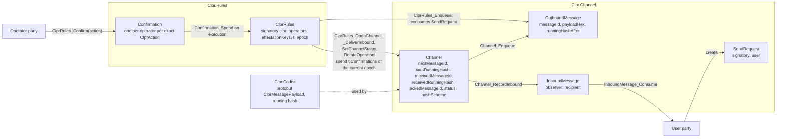
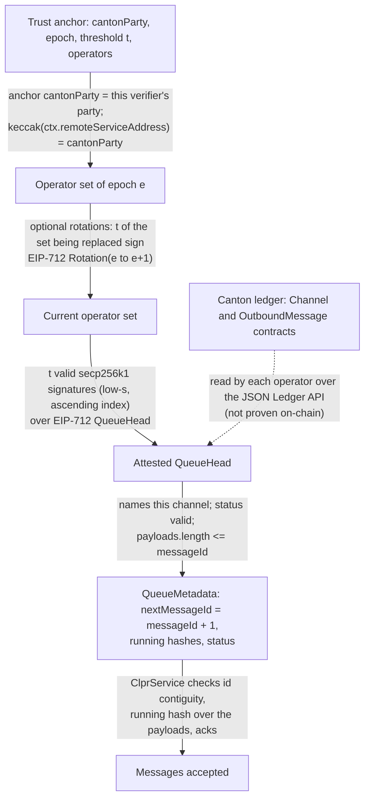
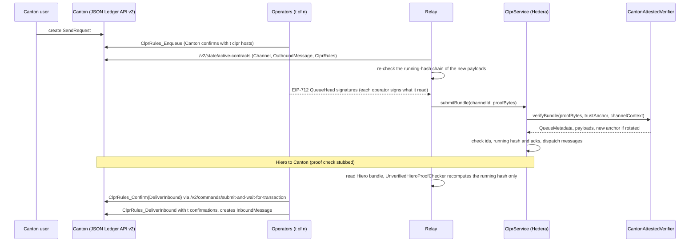

# CantonAttestedVerifier: Canton ↔ Hiero (t-of-n CLPR operators)

This family connects a Canton synchronizer and Hiero in both directions. It has three parts: a Daml CLPR app
(`daml/clpr/`) that holds the CLPR queue on Canton, `CantonAttestedVerifier`, an `IClprVerifier` on Hedera's EVM for
`Canton → Hiero`, and an operator relay. **Trust today is t-of-n CLPR operators, with t a strict majority of n.
Neither direction proves the other ledger's finality or state yet**: a quorum of t colluding operators can forge
messages in either direction. The Hiero → Canton proof check is a stub. The planned upgrade replaces operator trust
for Canton → Hiero with mediator-verdict proofs (see "Upgrades and forks").

## At a glance

| Item | Value |
|---|---|
| Chains covered | Canton (one synchronizer per deployment; the CAIP-2-style id is pinned at deployment, e.g. `canton:sandbox` in the e2e test). Per-chain page: [`docs/chains/canton.md`](../../../docs/chains/canton.md) |
| Finality source | Canton → Hiero: none proven; t operators attest the queue head they read from Canton. Hiero → Canton: none proven (stub) |
| Trust (one line) | **t-of-n CLPR operators (strict majority, `n/2 < t ≤ n`) in both directions**; genesis operator set pinned at deployment |
| Typical bundle | n = 10, t = 7, 10 payloads of 256 B: 71,532 execution gas, 4,544 B proof (synthetic). E2E 2-of-3, 3 messages: 66,260 gas (`eth_estimateGas`) |
| Rotation | Rotation-only bundle 7-of-10 → 7-of-10: 84,199 execution gas, 2,016 B. E2E 2-of-3 + rotation, 1 message: 75,128 gas |
| Contract size | `CantonAttestedVerifier` runtime 11,931 B (12,645 B under EIP-170) |
| Status | In progress. End to end on a local Canton sandbox (Daml SDK 3.5.12) with anvil, 2026-10-01. No public Canton network used |

## How it works

### The Daml app

The app compiles with Daml SDK 3.5.12 to Daml-LF 2.2 and runs on Canton 3.5.19. Every CLPR contract is signed by one
party, `clpr`, a decentralized party hosted by the n operators' participants with confirmation threshold t (the Splice
DSO pattern).



- **Queue (`Clpr.Channel`).** `Channel` holds the channel's state; `OutboundMessage` is one queue entry whose
  `payloadHex` is the canonical protobuf `ClprMessagePayload`, built on-ledger, with `sender` set to the UTF-8 party id
  of the user who signed the `SendRequest`. The running hash is computed on-ledger with `DA.Crypto.Text.sha256`.
- **Operator rules (`Clpr.Rules.ClprRules`).** `OpenChannel`, `DeliverInbound`, `SetChannelStatus` and
  `RotateOperators` need a quorum: each operator creates a `Confirmation` of the exact action, and any operator executes
  it with at least t confirmations from distinct current operators of the current epoch. Execution archives the
  confirmations, so a quorum is spent once; a rotation bumps the epoch, so old confirmations become unusable.
  `ClprRules_Enqueue` needs no app-level quorum, because Canton already requires t of the `clpr` hosts to confirm the
  transaction.
- **`DeliverInbound` (Hiero → Canton)** checks that the message id is `receivedMessageId + 1`, that the running hash
  recomputes from `receivedRunningHash`, and that Hiero's acknowledgement is behind the outbound head.
- **Running-hash scheme per channel.** `SpecDirect` is `SHA-256(prev ‖ payload)`, the rule in the CLPR spec text
  (§4.1). `PayloadDigest` is `SHA-256(prev ‖ SHA-256(payload))`, the rule the reference Solidity `ClprService` uses
  today. A channel to a current Hiero deployment must use `PayloadDigest`;
  `IntegrationCanton.t.sol::test_specDirectRunningHash_rejectedByReferenceService` pins this.

### Canton → Hiero proof chain



1. `CantonAttestedVerifier.sol:_decodeTrustAnchor` decodes the anchor and checks its `cantonParty`;
   `verifyBundle` checks that the channel's `remoteServiceAddress` hashes to the same party.
2. `CantonAttestedVerifier.sol:_decodeBundleProof` decodes the proof and requires it to be ABI-canonical (re-encoding
   reproduces the input).
3. `CantonAttestedVerifier.sol:_applyRotation` checks each rotation with `_checkQuorum` over `_rotationDigest` and
   validates the new set with `_validateSet` (1 ≤ n ≤ 64, `n/2 < t ≤ n`, sorted non-zero addresses).
4. `CantonAttestedVerifier.sol:_checkQuorum` checks t signatures over `_queueHeadDigest`, which EIP-712-hashes the head
   with `bytes[] payloads` and the optional manifest, so the signatures commit to the payloads.
5. `CantonAttestedVerifier.sol:_decodeManifest` checks an optional manifest (version ≥ 1, this service address).
   `verifyBundle` returns `QueueMetadata`, the payloads, and the new anchor if the set rotated.

## Bundle lifecycle



## Trust model

Trusted:
- **t-of-n CLPR operators, t a strict majority of n**, in both directions. t colluding operators can attest a false
  Canton queue head to Hiero, or deliver a false Hiero message on Canton. Any two quorums share at least one operator.
- **The genesis operator set**, pinned at deployment (`GENESIS_ANCHOR_HASH`), and the Canton chain id pinned at
  deployment.
- **Each operator's reading of the Hiero side**: Hiero → Canton has no proof check yet (stub, below).
- The operators keep `ClprRules.attestationKeys` on Canton and the verifier's operator set consistent; the relay
  derives the Hiero set from the on-ledger `ClprRules`.

Not trusted: the relay (it only carries operator signatures), and any minority of operators.

Replay protection: signatures are bound to the epoch, `cantonParty`, the Hiero chain id and the verifier address
(EIP-712 domain), so they cannot be replayed across operator sets, Canton deployments, Hiero networks or verifier
deployments. Within a channel, `ClprService` rejects stale and replayed bundles by message id. Rotation signatures for
e → e+1 cannot authorize e+1 → e+2.

To forge a bundle an attacker must control t operator attestation keys of the current epoch.

### Hiero → Canton is a stub

Operators check the Hiero bundle off-ledger, then confirm `DeliverInbound` on Canton, which fires at t confirmations.
Hiero state proofs need SHA-384, BLS12-381 and WRAPS/BN254; Daml has none of these, and there is no Hiero proof
source to check against off-ledger yet. The relay therefore defines a `HieroProofChecker` interface and ships only
`UnverifiedHieroProofChecker`, which recomputes the running hash from the channel's `receivedRunningHash`, always
reports `proofVerified: false`, and checks neither Hiero finality nor state. Each operator trusts whatever fed it the
message until a real checker replaces the stub.

## Proof format

Trust anchor: `abi.encode(TrustAnchor{cantonParty, epoch, threshold, operators[]})`, operators strictly ascending.

| Field | Type | Meaning |
|---|---|---|
| `cantonParty` | `bytes32` | `keccak256` of the `clpr` party id (the channel's `serviceAddress` is the UTF-8 party id) |
| `epoch` | `uint64` | Operator-set epoch; also the trust anchor id (8 bytes) |
| `threshold` | `uint16` | t |
| `operators` | `address[]` | Operators' secp256k1 attestation addresses |

Bundle: `abi.encode(BundleProof{version = 1, rotations[], head, payloads[], manifest, signatures})`.

| Field | Meaning |
|---|---|
| `rotations` | `Rotation{newThreshold, newOperators, signatures}`, applied in order; each moves the epoch by one |
| `head` | `QueueHead{channelId, messageId, runningHash, receivedMessageId, receivedRunningHash, status, endpointManifestVersion}`; `messageId` is the last message in the bundle |
| `payloads` | The last `payloads.length` messages, ending at `messageId` |
| `manifest` | Optional endpoint manifest, attested by the operators |
| `signatures` | Concatenated 66-byte `index ‖ r ‖ s ‖ v` entries, indexes strictly ascending |

EIP-712 domain `{name: "CLPR Canton Operators", version: "1", chainId, verifyingContract}`. Signed types:

```
QueueHead(bytes32 cantonParty, uint64 epoch, bytes32 channelId, uint64 messageId, bytes32 runningHash,
          uint64 receivedMessageId, bytes32 receivedRunningHash, uint8 status,
          uint64 endpointManifestVersion, bytes[] payloads, bytes manifest)
Rotation(bytes32 cantonParty, uint64 epoch, uint64 newEpoch, uint16 newThreshold, address[] newOperators)
Config(bytes32 cantonParty, uint64 epoch, bytes32 channelId, string chainId, bytes serviceAddress,
       uint96 peerConfigNanos, Throttles throttles)
EndpointManifest(bytes32 cantonParty, uint64 epoch, bytes32 channelId, bytes manifest)
```

Configuration (`verifyConfig`): the proof starts from the genesis set pinned at deployment and applies its rotations;
the Canton chain id must equal the pinned one; the Config message needs a quorum of the resulting set; the manifest
proof is signed by the same set, or empty (an uninitialized version-0 manifest is returned).

Constructor: the genesis `TrustAnchor` and the Canton chain id.

## Validator-set / committee rotation

- The operator set rotates by `ClprRules_RotateOperators` on Canton (t confirmations of the current epoch) and by a
  quorum-signed `Rotation` in a Hiero bundle. Both move the epoch from e to e+1; rotations apply one epoch at a time,
  in order, and several can ride in one bundle.
- Cadence: only when operators change. There is no time-based expiry.
- Cost: a rotation-only bundle 7-of-10 → 7-of-10 costs 84,199 execution gas and 2,016 B. In the e2e test, a 2-of-3
  bundle with one rotation and 1 message costs 75,128 gas (`eth_estimateGas`).

## Gas and calldata

Hedera limits: 15M gas and 128 KB calldata. Foundry figures are execution gas inside `verifyBundle`
(`CantonAttestedVerifier.t.sol`); e2e figures are anvil `eth_estimateGas` (21k base and calldata included) from
`canton-attested.spec.ts` on a local Canton sandbox, recorded on 2026-10-01.

| Case | Gas | Proof bytes |
|---|---|---|
| n = 10, t = 7, 10 payloads x 256 B (synthetic) | 71,532 | 4,544 |
| n = 16, t = 11, 50 payloads x 1 KB (synthetic) | 525,288 | 57,280 |
| n = 64, t = 43, 1 payload x 256 B (synthetic) | 207,224 | 3,744 |
| Rotation-only bundle, 7-of-10 → 7-of-10 (synthetic) | 84,199 | 2,016 |
| E2E, 2-of-3, 3 messages (`eth_estimateGas`) | 66,260 | – |
| E2E, 2-of-3 plus one rotation, 1 message (`eth_estimateGas`) | 75,128 | – |

A secp256k1 operator signature costs 6,569 gas (`CantonSignatureGas.t.sol`, two `ecrecover` tries); payload size
dominates calldata.

## Limits and known gaps

- Trust in both directions is t-of-n operators; Hiero → Canton is additionally a stub.
- Endpoint manifests at bundle time are attested by the operators, not proven from Canton state.
- At most 64 operators; rotations one epoch at a time.
- `SpecDirect` channels are rejected by today's reference `ClprService`; use `PayloadDigest`.
- The e2e test runs on a single-participant sandbox, where the operators act as `clpr` instead of through separate
  hosting participants. The multi-host DSO deployment with confirmation threshold t was not run locally.
- `damlc` ships only for x86_64 on macOS, so the Daml build and Script tests run in a Docker container.

## Upgrades and forks

**Planned upgrade: mediator-verdict proofs (Canton → Hiero).** The Hiero verifier would check what Canton itself
certifies, instead of the operators' reading:

1. **Mediator verdict.** The verdict covers {psid, record time, transaction root hash, verdict} and carries f+1
   mediator signatures (f+1 = ⌊(n−1)/3⌋+1), each over `0x1220 ‖ SHA-256(int32BE(38) ‖ msg)`, with an optional
   session-key delegation.
2. **Salted SHA-256 Merkle path** from the transaction root hash to the create of the `Channel` / `OutboundMessage`
   that holds `(nextMessageId, runningHash)`. Each enqueue is already its own transaction, so a bundle reveals only one
   salted leaf.
3. **t confirmation responses** from the `clpr` hosts.

The trust then becomes: fewer than f+1 SV mediators **and** fewer than t confirmers collude. The anchor becomes
{psid, mediator keys, threshold} and rotates through `MediatorSynchronizerState` signed at the DSO governance
threshold, plus each mediator's `OwnerToKeyMapping`; a synchronizer upgrade (LSU) takes the same path.

What it needs:
- **Digital Asset:** a participant export of the mediator verdict (`ConfirmationResultMessage` with its sequencer
  aggregation), the confirmation responses and the Merkle path for an update (the Ledger API exposes none today);
  format-stability guarantees for those messages and preimages; and stable Daml-LF 2.4 with `EXTERNAL_CALL`, so that
  confirming participants can run a Hiero verifier for Hiero → Canton.
- **The Canton Foundation and SVs:** mediator keys that are cheap on the EVM (secp256k1 measures 6,569 gas per
  signature and P-256 in Solidity 245,118 gas, both in `CantonSignatureGas.t.sol`; Ed25519, the current default, has
  no EVM precompile and is not measured here), and a feed of signed topology transactions for rotation proofs.
- **Hiero:** a P-256 precompile, if the SVs choose P-256.

Path for this code: keep `IClprVerifier` and the queue model; add a `CantonVerdictVerifier` with the same outputs, a
verdict-plus-Merkle bundle and a mediator-set anchor; move channels to it with a trust-anchor change or channel
succession. The Daml app needs no change. During the transition both proofs can be required together.

**Fork-aware ADR.** Under
[`ADR/2026-10-01-fork-aware-verifiers.md`](https://github.com/shayansal/clpr-spec/blob/adr/fork-handling/ADR/2026-10-01-fork-aware-verifiers.md)
(draft PR [LFDT-CLPR/clpr-spec#1](https://github.com/LFDT-CLPR/clpr-spec/pull/1)), the move from operator attestation to
mediator verdicts is Class C (a new verifier and channel succession). The attested verifier itself does not read any
Canton protocol format, so Canton protocol-version upgrades do not break it; a Daml package upgrade of the CLPR app
must keep the contract fields the relay reads.

## Running it

```sh
# Foundry: verifier, compliance, ClprService integration and signature-scheme gas
forge test --match-contract Canton -vv

# Daml build and Daml Script tests (Docker; Daml SDK 3.5.12 via dpm)
test/e2e/backend/canton/start-canton.sh
docker exec -w /work/daml/clpr/test clpr-canton sh -c 'PATH=/root/.dpm/bin:$PATH dpm test'

# End to end: Canton sandbox + anvil (skipped unless CANTON_JSON_API is set; the npm script sets it)
npm run test:e2e:canton
```

Test counts on this branch: 42 verifier, 21 compliance, 5 integration and 2 signature-gas tests (Foundry), 6 Daml
Script tests, 5 e2e tests.

## Files

| File | Purpose |
|---|---|
| `daml/clpr/main/daml/Clpr/Channel.daml` | `Channel`, `OutboundMessage`, `InboundMessage`, `SendRequest` |
| `daml/clpr/main/daml/Clpr/Rules.daml` | `ClprRules` (t-of-n operator actions, rotation) and `Confirmation` |
| `daml/clpr/main/daml/Clpr/Codec.daml` | Protobuf `ClprMessagePayload` encoding and running-hash schemes |
| `daml/clpr/test/daml/Clpr/Tests.daml` | Daml Script tests |
| `src/verifiers/canton/CantonAttestedVerifier.sol` | `IClprVerifier` for Canton → Hiero |
| `test/canton/CantonAttestedVerifier.t.sol` | Verifier tests, negative cases and gas |
| `test/canton/CantonSignatureGas.t.sol` | secp256k1 vs P-256 signature cost |
| `test/helpers/CantonAttestedProofs.sol` | Builds signed anchors, heads and rotations |
| `test/verifiers/compliance/CantonComplianceTest.t.sol` | `IClprVerifier` compliance suite |
| `test/integration/IntegrationCanton.t.sol` | Unmodified ClprService with this verifier |
| `test/e2e/relay/cantonLedger.ts` | JSON Ledger API v2 client |
| `test/e2e/relay/cantonRelay.ts` | Operator relay: read, re-check, sign, build bundles; `HieroProofChecker` stub |
| `test/e2e/tests/verifiers/canton-attested.spec.ts` | Canton sandbox ↔ anvil end to end |
| `test/e2e/backend/canton/start-canton.sh` | Starts the Docker sandbox and builds the Daml app |

## References

- Canton (3.7.0-SNAPSHOT, commit `2fcea1a`): https://github.com/digital-asset/canton
- Splice (DSO, decentralized party hosting; commit `920590b`): https://github.com/hyperledger-labs/splice
- Daml (`DA.Crypto.Text`, Daml-LF; commit `b9c0941`): https://github.com/digital-asset/daml
- Canton and Daml documentation (JSON Ledger API v2, party hosting): https://docs.digitalasset.com
- EIP-712 typed data: https://eips.ethereum.org/EIPS/eip-712
- Fork-aware verifier ADR: https://github.com/shayansal/clpr-spec/blob/adr/fork-handling/ADR/2026-10-01-fork-aware-verifiers.md
