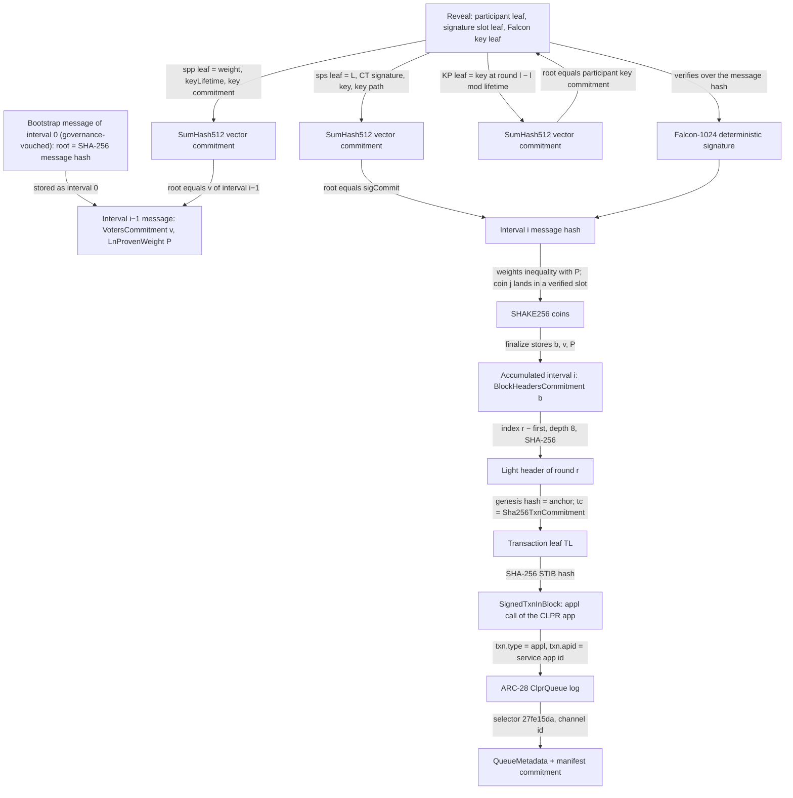
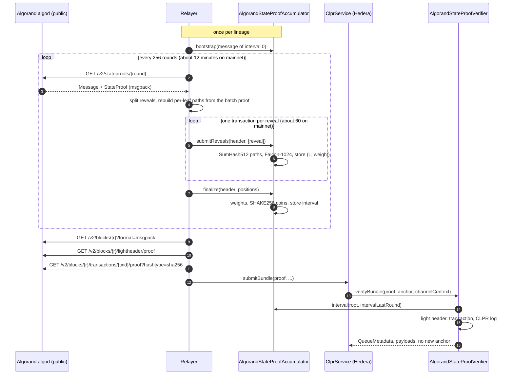

# Algorand verifier (`AlgorandStateProofAccumulator` + `AlgorandStateProofVerifier`)

Algorand → Hiero. `AlgorandStateProofAccumulator` is a light client of Algorand state proofs on Hedera's
EVM. One state proof attests 256 rounds. Voters holding at least 30% of the online stake sign a message
with Falcon-1024 keys. The message commits to the 256 light block headers of the interval and to the voters
of the next interval. A mainnet proof does not fit in one Hedera transaction (about 60 Falcon verifications
and 12,000 SumHash512 compressions), so the accumulator checks it across about 60 transactions and then stores
the interval. `AlgorandStateProofVerifier` is the `IClprVerifier`. For each bundle it proves one transaction
of an accumulated interval: light header, then SHA-256 transaction commitment, then the transaction itself.
It then reads the CLPR application's queue record from that transaction's own log.

Every protocol rule below was checked against `algorand/go-algorand` master @ `18ba96f` (30 Sep 2026),
`algorand/falcon` (deterministic Falcon-1024), `algorand/go-sumhash`, and live mainnet and testnet state
proofs captured on 1 Oct 2026 (consensus `algorandfoundation/specs@268b634`).

## At a glance

| Item | Value |
|---|---|
| Chains covered | Algorand mainnet (`algorand:wGHE2Pwdvd7S12BL5FaOP20EGYesN73k`), Algorand testnet (`algorand:SGO1GKSzyE7IEPItTxCByw9x8FmnrCDe`). Any go-algorand network with state proofs enabled (consensus v34+). |
| Direction | Algorand → Hiero |
| Finality source | Algorand state proofs (`crypto/stateproof`): a compact certificate of Falcon-1024 signatures by the interval's voters, chained interval by interval |
| Trust assumption | Voters holding less than the proven weight (30% of the online weight of the top 1,024 accounts) are malicious, at go-algorand's soundness target (strength target 256). Plus the bootstrap message, and the CLPR application's update authority. |
| Typical bundle | Mainnet, live transaction: 457,701 gas, 2,112 B (`verifyTransaction`, anvil). Synthetic CLPR bundle: 61,798 gas, 1,312 B (Foundry). One transaction. |
| Rotation (one interval) | Mainnet: 61 `submitReveals` transactions (max 11,792,178 gas, max 7,012 B each) + `finalize` (1,991,034 gas, 5,508 B) = 703.1M gas in 62 transactions, every 256 rounds (about 12 minutes). Testnet: 16 transactions, 164.4M gas. |
| Contract sizes | `AlgorandStateProofVerifier` 15,012 B; `AlgorandStateProofAccumulator` 9,893 B; `ClprFalconDet1024Engine` 4,241 B; `ClprShake256Engine` 2,686 B; `ClprSumHash512Engine` 1,704 B; 16 table chunks of 16,385 B |
| Status | Live-verified on mainnet and testnet (fixtures captured 2026-10-01): full state-proof accumulation, then a real application call proven inside the accumulated interval. No CLPR application exists on Algorand yet, so the queue-record step runs on synthetic worlds only. |

**Family coverage.** Algorand mainnet and testnet, and any network that runs go-algorand with state proofs
(betanet, private networks). Configure the genesis hash, CAIP-2 id and bootstrap message.

**Rotation cost.** Following mainnet needs about 86 billion gas and 7,600 transactions per day (see
[Gas and calldata](#gas-and-calldata)). The design is correct and live-verified, but it is not economical on
Hedera today. A SNARK of the state-proof verifier is the practical path, see
[Limits and known gaps](#limits-and-known-gaps).

## How it works

### What an Algorand block commits to

| Question | Finding | Evidence |
|---|---|---|
| Is there a state root? | **No.** Algorand block headers commit to transactions (`TxnCommitments`: SHA-512/256, SHA-256, SHA-512), not to account or application state. Application state cannot be proven by key. | `data/bookkeeping/block.go` |
| What does a state proof sign? | `Message {b BlockHeadersCommitment, v VotersCommitment, P LnProvenWeight, f FirstAttestedRound, l LastAttestedRound}`. Participants sign `SHA-256("spm" ‖ msgpack(Message))`. | `data/stateproofmsg/message.go`; all live signatures verify |
| What do the commitments cover? | `b` is a SHA-256 vector commitment over the interval's light block headers. `v` is a SumHash512 vector commitment over the voters of the **next** interval. `P` is ⌈2¹⁶·ln(provenWeight)⌉ for the next interval. | `stateproof/builder.go`, `crypto/stateproof/weights.go` |
| What is a light block header? | `{0 Seed (omitted), 1 BlockHash, r Round, gh GenesisHash, tc Sha256TxnCommitment}`. Since consensus v39 it carries `BlockHash` instead of the seed. Leaf = `SHA-256("B256" ‖ msgpack)`. | `data/bookkeeping/lightBlockHeader.go`; live `/v2/blocks/{r}/lightheader/proof` |
| What is in the transaction tree? | Leaf = `SHA-256("TL" ‖ SHA-256 txid ‖ SHA-256("STIB" ‖ SignedTxnInBlock))`. The SignedTxnInBlock includes the ApplyData, so application logs (`dt.lg`) are covered. | `data/bookkeeping/txn_merkle.go`; live `/v2/blocks/{r}/transactions/{id}/proof?hashtype=sha256` |
| Are failed transactions in blocks? | **No.** A block holds only transactions that were applied, so a proven application call succeeded. | `ledger/eval` |

So the verifier proves **a log of a successful application call** in a block attested by a state proof.

### Proof chain



1. **Bootstrap**: `AlgorandStateProofAccumulator.sol:bootstrap` stores a message as given. Its hash is the lineage
   `root`. Anyone can bootstrap. A channel trusts only the root its governance picked.
2. **Reveals**: `AlgorandStateProofAccumulator.sol:submitReveals` checks each reveal:
   - The salt version (`SessionHeader.saltVersion`).
   - Three SumHash512 vector-commitment paths in one call to `ClprSumHash512Engine` (built by
     `AlgorandStateProofAccumulator.sol:_jobs`): the Falcon key leaf to the participant's key commitment, the
     signature-slot leaf to `sigCommit`, and the participant leaf to the previous interval's voters commitment.
   - The Falcon signature over the message hash (`ClprFalconDet1024Engine.sol:verify`).

   A verified reveal stores `(L, weight)` under the session id.
3. **Coins**: `AlgorandStateProofAccumulator.sol:finalize` checks the weight inequality
   (`ClprAlgorandStateProof.sol:weightsOk`) and derives the coins with SHAKE256
   (`AlgorandStateProofAccumulator.sol:_coins` via `ClprShake256Engine`). Every coin must fall in
   `[L, L + weight)` of a verified reveal at `positions[j]`. The interval is then stored.
4. **Light header**: `AlgorandStateProofVerifier.sol:_provenTransaction` rebuilds the header leaf
   (`ClprAlgorandStateProof.sol:lightHeaderLeaf`) with the anchor's genesis hash. It folds the 8-level path at
   index `round − firstAttestedRound` (`sha256Root`) to the interval's `BlockHeadersCommitment`.
5. **Transaction**: the same function hashes the SignedTxnInBlock (`txnLeaf`) and folds its path to the
   header's `Sha256TxnCommitment`.
6. **Queue record**: `AlgorandStateProofVerifier.sol:_provenQueue` parses the SignedTxnInBlock with
   `ClprMsgpack`. It requires `txn.type = "appl"` and `txn.apid` = the channel's service app id, then decodes
   the top-level log `dt.lg[logIndex]` with `decodeQueueEvent`.

### The cryptographic engines

| Engine | What it computes | Why it is a separate contract |
|---|---|---|
| `ClprShake256Engine` | SHAKE256 (Keccak-f[1600], rate 136, padding `0x1F…0x80`) and Falcon hash-to-point (`w < 61445 → w mod 12289`, 16-bit big-endian samples) | The `KECCAK256` opcode fixes the padding and output length. Unrolled rounds use their own memory map. |
| `ClprSumHash512Engine` | SumHash512 (subset-sum `A·x mod 2⁶⁴`, 8 × 1,024 matrix from SHAKE256(`40 00 08 00 00 04 ‖ "Algorand"`)), and vector-commitment path folding with `"MA"` nodes | Uses a 256 KiB nibble table held in 16 data contracts. Their code hashes are pinned in the source and checked by the constructor. The Foundry kit derives the table again on chain from SHAKE256 and must match. |
| `ClprFalconDet1024Engine` | Deterministic Falcon-1024 (`algorand/falcon`): salt `version ‖ 0x0A ‖ "FALCON_DET" ‖ 0²⁸`, `s1 = c − s2·h mod (q, x¹⁰²⁴+1)` with a negacyclic NTT, accept iff ‖s1‖² + ‖s2‖² ≤ 70,265,242 | Keeps the accumulator under EIP-170 |

The signature is taken in Falcon's fixed-length CT form (`0xDA ‖ version ‖ 1,024 × 12-bit`). go-algorand
hashes that form into the signature commitment (`GetFixedLengthHashableRepresentation`). It maps one-to-one
to the compressed form the network verifies.

## Bundle lifecycle



## Trust model

What is trusted:

- **The state-proof threshold.** A message is accepted only if, except with negligible probability, voters
  holding at least the proven weight signed it. The proven weight is `StateProofWeightThreshold` =
  30% of the online weight of the interval's top 1,024 accounts (`StateProofTopVoters`). Soundness comes from
  strength target 256, which is `k + q` pre-quantum or `k + 2q` post-quantum (`config/consensus.go`). An
  attacker who holds participation keys for 30% of that weight can forge any message. This bar is lower
  than Algorand's own agreement, which assumes more than 2/3 honest stake. The state proof is Algorand's own
  light-client mechanism, and this verifier inherits its threshold unchanged.
- **The bootstrap message.** The first message of a lineage is taken as given. Governance that completes
  the channel picks it (`verifyConfig` requires it to be bootstrapped). This is the same waypoint model as the
  other committee verifiers. Every later interval is proven.
- **The CLPR application.** Only logs of top-level calls to the configured app id count. If the application
  can be updated (`UpdateApplication`), its update authority can make it log anything. A production CLPR
  application must be immutable, or its updater is part of the trust base.
- **Cryptographic assumptions.** Falcon-1024 (post-quantum signatures), SumHash512 (subset-sum hash; Algorand
  chose it to be SNARK-friendly, so it is a newer assumption than SHA-2), SHA-256 and SHAKE256.

What is not trusted:

- The relayer, the algod API and the indexer. They can delay but not forge: every byte is hashed or
  signature-checked.
- Accumulator callers. `submitReveals` and `finalize` are permissionless. A wrong reveal reverts, and a
  session commits to its whole header (`sessionId = keccak256(abi.encode(header))`).
- Admin keys. There are none. Engines, accumulator and verifier are immutable, and the SumHash table is
  pinned by code hash.

To forge a bundle, an attacker must do one of these:

- Control 30% of the online voting weight of an interval.
- Get a channel's governance to bootstrap a false message.
- Control the CLPR application's code.
- Break Falcon-1024, SumHash512 or SHA-256.

## Proof format

**Trust anchor** (64 bytes): `root ‖ genesisHash`. `root` is the SHA-256 message hash of the lineage's
bootstrap message. `initialTrustAnchorId` = `root`. Bundles never return a new anchor.

**Accumulator** (`abi.encode`):

| Struct | Field | Type | Meaning |
|---|---|---|---|
| `SessionHeader` | `root` | bytes32 | lineage |
| | `prevLastRound` | uint64 | interval whose voters sign `message` |
| | `message` | `Message` | `{blockHeadersCommitment, votersCommitment (64 B), lnProvenWeight, firstAttestedRound, lastAttestedRound}` |
| | `sigCommit` | bytes (64) | SumHash512 root of the signature slots |
| | `signedWeight` | uint64 | claimed signed weight `W` |
| | `saltVersion` | uint8 | `MerkleSignatureSaltVersion` |
| | `treeDepth` | uint8 | depth of the signature and participant trees (10 on mainnet and testnet), ≤ 20 |
| `Reveal` | `pos` | uint64 | participant index |
| | `l`, `weight` | uint64 | `SigSlot.L`, participant weight |
| | `keyLifetime`, `commitment` | uint64, bytes (64) | Merkle-signature key lifetime (256), key commitment |
| | `sigCT`, `vkey` | bytes (1,538), bytes (1,793) | Falcon signature (CT form), ephemeral public key |
| | `vcIdx`, `keyPath` | uint64, bytes | key index, key path (≤ 16 × 64 B) |
| | `sigPath`, `partPath` | bytes | single-leaf paths (`treeDepth` × 64 B), rebuilt by the relayer from the batch proof |
| `finalize` | `positions` | uint64[] | `PositionsToReveal`, one per coin (≤ 640) |

**Bundle** (`abi.encode(BundleProof)`):

| Field | Type | Meaning |
|---|---|---|
| `txn.intervalLastRound` | uint64 | accumulated interval |
| `txn.blockHash`, `txn.round`, `txn.txnCommitment` | bytes32, uint64, bytes32 | light-header fields (genesis hash comes from the anchor) |
| `txn.headerPath` | bytes (8 × 32) | light-header path |
| `txn.txIndex`, `txn.txPath` | uint64, bytes (≤ 20 × 32) | transaction index and SHA-256 path |
| `txn.txid` | bytes32 | SHA-256 transaction id |
| `txn.stib` | bytes | SignedTxnInBlock, as encoded in the block |
| `logIndex` | uint256 | index in `dt.lg` |
| `bundleContent` | bytes | protobuf `ClprBundleContent` |
| `hasManifest`, `manifest` | bool, bytes | optional endpoint manifest. Its keccak256 must equal the record's commitment. |

**Queue record**: ARC-28 event `ClprQueue(byte[32],uint8,uint64,uint64,byte[32],byte[32],uint64,byte[32])`,
selector `27fe15da`, then ARC-4 static encoding (157 bytes):
`channelId ‖ status ‖ nextMessageId ‖ receivedMessageId ‖ sentRunningHash ‖ receivedRunningHash ‖
endpointManifestVersion ‖ endpointManifestCommitment (zero = none)`.

**Config** (`abi.encode(ConfigProof)`): `{bootstrap Message, genesisHash, ledgerConfiguration}`. The chain id
must equal `algorand:` + the first 32 characters of the URL-safe base64 genesis hash
(`AlgorandStateProofVerifier.sol:caip2`). The service address is the 8-byte big-endian app id.

**Deployment profile**: SHAKE256 engine, 16 SumHash table chunks + engine, Falcon engine (SHAKE address),
accumulator (three engine addresses), verifier (accumulator address). Consensus constants are compiled in:
interval 256, strength target 256, MaxReveals 640, MaxTreeDepth 20, MaxEncodedTreeDepth 16, coin version 0.

## Validator-set / committee rotation

The voters change every interval. The message of interval i carries the SumHash512 commitment to the top
1,024 online accounts that sign interval i + 1, with their weights and Falcon key commitments. It also carries
`LnProvenWeight`. Each accumulated interval is therefore a rotation, and intervals cannot be skipped: interval
i + 1 is only verifiable under interval i's voters.

- **Cadence**: one interval per 256 rounds. Mainnet rounds 65,560,020 → 65,562,880 took 7,877 s (block
  timestamps 1,790,832,766 and 1,790,840,643, read from algod on 2026-10-01), 2.75 s per round. An interval
  therefore lasts about 705 s, about 122.6 intervals per day.
- **Cost**: one transaction per reveal plus `finalize`. Mainnet: 62 transactions, 703.1M gas per interval.
  Testnet: 16 transactions, 164.4M gas.
- **Catch-up**: the accumulator has no time limit and can catch up from any accumulated interval. It needs
  the state proofs of all missed intervals. Public algod nodes are non-archival and keep about 1,000 rounds
  (the fixture capture targets the newest proof). Older proofs need an archival node or an indexer, since
  state proofs are stored on chain as state-proof transactions.
- **Bundles** are not tied to the newest interval. Any accumulated interval of the lineage serves.

## Gas and calldata

Measured on anvil (receipts, or `eth_estimateGas` for views) from `npm run test:e2e:algorand-live`, and in
Foundry, on fixtures captured 2026-10-01. Hedera limits: 15,000,000 gas and 128 KB calldata per transaction.

| Case (network, fixture) | Gas | Calldata | Fits |
|---|---|---|---|
| `submitReveals`, 1 reveal, mainnet (61 transactions, interval 65,562,625–65,562,880) | max 11,792,178, total 701,110,511 | max 7,012 B | yes |
| `finalize`, mainnet (151 coins) | 1,991,034 | 5,508 B | yes |
| `submitReveals`, 1 reveal, testnet (15 transactions, interval 67,835,649–67,835,904) | max 10,832,688, total 162,475,170 | max 6,372 B | yes |
| `finalize`, testnet (148 coins) | 1,886,478 | 5,412 B | yes |
| `submitReveals`, 2 reveals, mainnet (Foundry) | 22,530,811 | — | **no**, so one reveal per transaction |
| `verifyTransaction`, live mainnet block 65,562,880 | 457,701 | 2,112 B | yes |
| `verifyTransaction`, live testnet block 67,835,664 | 248,390 | 1,472 B | yes |
| `verifyBundle`, synthetic CLPR bundle (Foundry) | 61,798 | 1,312 B | yes |

Where one reveal's ~11M gas goes (Foundry, `AlgorandPrimitives.t.sol`):

| Item | Gas |
|---|---|
| Falcon-1024 verification | 4,819,508 |
| ↳ of which hash-to-point (17 Keccak-f permutations) | 1,832,589 |
| SumHash512, per 64-byte block | 26,486 |
| SumHash512, table load per engine call (256 KiB into memory) | about 246,000 |
| SumHash512 blocks per reveal: signature leaf 69, key leaf 29, participant leaf 2, paths 3 per level (10 + 10 + 10–16 levels) | about 200 |

Per day on mainnet: 122.6 intervals × 703.1M gas = about 86 billion gas in about 7,600 transactions. That is
the cost of following Algorand natively on an EVM, and the main limit of this design.

## Limits and known gaps

- **Cost.** About 86 billion gas per day to follow mainnet, and every interval must be accumulated. The
  multi-transaction accumulator makes verification possible within Hedera's limits but not cheap.
  The practical route is a SNARK of `Verifier.Verify` checked on BN254 in one transaction. SumHash512 and
  Falcon were chosen by Algorand for SNARK-friendliness. Gas savings still open here: a hand-scheduled
  SumHash compression (about 25% per block) and a radix-4 NTT.
- **No CLPR application on Algorand.** The ARC-28 `ClprQueue` log is this verifier's proposal for the
  application's record. The live tests prove real application calls of other applications. The CLPR record
  path is tested on synthetic worlds.
- **Top-level calls only.** Logs of inner transactions (`dt.itx[*].dt.lg`) are not accepted. The CLPR
  application must be called directly.
- **The application must be immutable**, or its update authority is trusted (see [Trust model](#trust-model)).
- **Archive needs.** Catch-up beyond about 1,000 rounds needs an archival algod or indexer.
- **Equal tree depths.** The accumulator requires the signature and participant trees to have the same depth.
  go-algorand builds both over the same participant array, so this holds in every live proof. A different
  shape would stall the lineage (liveness, not safety).
- **Hiero → Algorand** is not covered (see the chain page).

## Upgrades and forks

Algorand upgrades by consensus version (`proto` in each block header, with an upgrade vote and delay). The
verifier compiles in the current state-proof rules:

- Interval 256, strength target 256, MaxReveals 640, the coin-generator version byte 0.
- The `"spm"`, `"spc"`, `"sps"`, `"spp"`, `"KP"`, `"MA"`, `"B256"`, `"TL"` and `"STIB"` hash prefixes.
- SumHash512 and SHA-256, and deterministic Falcon-1024 with its salt.
- The v39 light-header layout (`BlockHash` instead of `Seed`).

A consensus upgrade that changes any of these makes proofs fail to verify. The verifier fails closed and does
not misread. Under the fork-aware verifier ADR (`ADR/2026-10-01-fork-aware-verifiers.md`, draft
LFDT-CLPR/clpr-spec#1), such an upgrade is a layout or semantic change. It needs a new verifier and a channel
succession, not a parameter update.

The accumulator is independent of bundle delivery. Rotation keeps going while a channel is stalled, which
covers the ADR's concern about rotating signers (§1.3). Parameter-only upgrades, such as a new
`StateProofWeightThreshold`, are carried by the proven messages (`LnProvenWeight`) and need no change.

## Running it

```bash
forge build
# unit, live (Foundry) and compliance tests
forge test --match-path 'test/verifiers/*/algorand/*'
forge test --match-path test/verifiers/compliance/AlgorandComplianceTest.t.sol
# anvil replay of the mainnet and testnet fixtures (one anvil, port CLPR_ANVIL_PORT_A, default 8643)
npm run test:e2e:algorand-live
# re-capture from the public algod (non-archival: picks the newest state proof) and rebuild vectors
npm run algorand-live:refresh
ALGORAND_NETWORK=testnet npm run algorand-live:refresh
# regenerate the engines (writes and formats the .sol files)
npx tsx test/e2e/relay/algorand/codegen/keccak.ts
npx tsx test/e2e/relay/algorand/codegen/sumhash.ts
npx tsx test/e2e/relay/algorand/codegen/falcon.ts
```

## Files

| File | Purpose |
|---|---|
| `src/verifiers/evm/algorand/AlgorandStateProofAccumulator.sol` | Multi-transaction state-proof light client (bootstrap, reveals, coins) |
| `src/verifiers/evm/algorand/AlgorandStateProofVerifier.sol` | `IClprVerifier`: light header, transaction, CLPR log; `verifyTransaction` |
| `src/libraries/proof/algorand/ClprAlgorandStateProof.sol` | Message encoding and hash, weights, coin seed, light-header and transaction leaves, SHA-256 paths |
| `src/libraries/proof/algorand/ClprMsgpack.sol` | Bounds-checked msgpack reader |
| `src/libraries/proof/algorand/ClprShake256Engine.sol` | SHAKE256 and Falcon hash-to-point (generated) |
| `src/libraries/proof/algorand/ClprSumHash512Engine.sol` | SumHash512 and vector-commitment paths (generated, pinned table hashes) |
| `src/libraries/proof/algorand/ClprSumHashTableChunk.sol` | Data contract for a table chunk |
| `src/libraries/proof/algorand/ClprFalconDet1024Engine.sol` | Deterministic Falcon-1024 verification (generated twiddles) |
| `test/verifiers/evm/algorand/AlgorandPrimitives.t.sol` | SHAKE256 vectors, SumHash512 and Falcon on live reveals, engine gas |
| `test/verifiers/evm/algorand/AlgorandStateProofLive.t.sol` | Full live mainnet accumulation and negative cases |
| `test/verifiers/evm/algorand/AlgorandStateProofVerifier.t.sol` | Bundle and config tests on synthetic worlds |
| `test/verifiers/evm/algorand/AlgorandEngines.sol`, `AlgorandLiveKit.sol`, `AlgorandTestKit.sol` | Engine deployment (table derived on chain), live and synthetic kits |
| `test/verifiers/compliance/AlgorandComplianceTest.t.sol` | Shared `IClprVerifier` compliance suite |
| `test/e2e/fixtures/algorand-live/{mainnet,testnet}.json` | Captured state proofs, block, header and transaction proofs |
| `test/e2e/fixtures/algorand-live/{vectors,testnet-vectors}.json` | Derived verifier inputs |
| `test/e2e/relay/buildAlgorandLiveProof.ts` | Capture and build, re-verified with the TypeScript model |
| `test/e2e/relay/algorand/{stateproof,falcon,sumhash,msgpack,sumhashTable}.ts` | TypeScript reference model of go-algorand verification |
| `test/e2e/relay/algorand/codegen/{keccak,sumhash,falcon}.ts` | Engine generators |
| `test/e2e/tests/verifiers/algorand-live.spec.ts` | Anvil replay with receipt gas |

## References

- go-algorand @ `18ba96f`: `crypto/stateproof/{verifier,weights,coinGenerator,committableSignatureSlot,const}.go`,
  `crypto/merklearray/{merkle,partial,layer,proof,vectorCommitmentArray}.go`,
  `crypto/merklesignature/merkleSignatureScheme.go`, `crypto/falconWrapper.go`,
  `data/stateproofmsg/message.go`, `data/bookkeeping/{lightBlockHeader,txn_merkle,block}.go`,
  `stateproof/verify/stateproof.go`, `config/consensus.go` — https://github.com/algorand/go-algorand
- Deterministic Falcon: https://github.com/algorand/falcon (`deterministic.c`, `falcon.h`)
- SumHash: https://github.com/algorand/go-sumhash
- Algorand specifications (state proofs, light block header): https://github.com/algorandfoundation/specs
- algod REST API (`/v2/stateproofs`, `/v2/blocks/{round}/lightheader/proof`, transaction proofs):
  https://developer.algorand.org/docs/rest-apis/algod/
- CAIP-2 Algorand namespace: https://github.com/ChainAgnostic/namespaces/blob/main/algorand/caip2.md
- ARC-28 (event logs) and ARC-4 (ABI encoding): https://github.com/algorandfoundation/ARCs
- FIPS 202 (SHA-3 / SHAKE): https://csrc.nist.gov/pubs/fips/202/final
