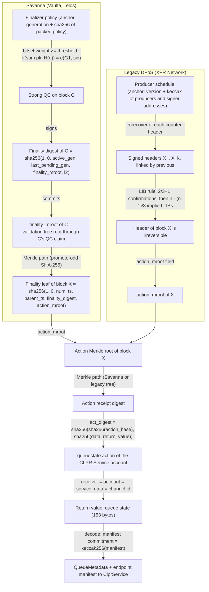
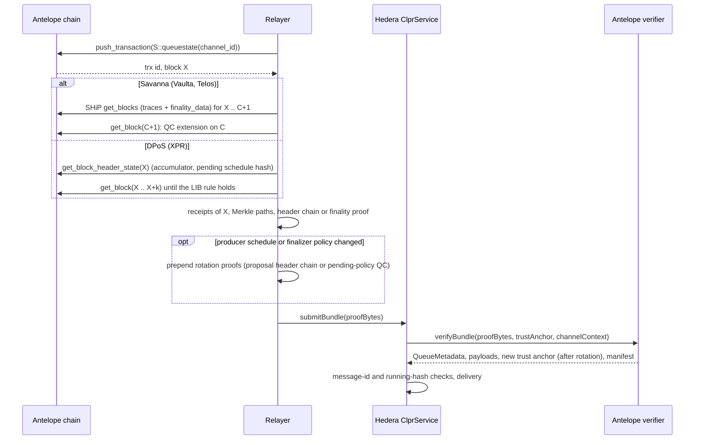

# Antelope verifiers (Vaulta, Telos, XPR Network → Hiero)

Two `IClprVerifier` contracts let a Hiero ledger accept CLPR bundles from Antelope chains. `SavannaVerifier`
serves chains that run Savanna finality (Spring 1.x): Vaulta (formerly EOS) and Telos. It checks a strong BLS
quorum certificate (QC) of the chain's finalizer policy. `AntelopeDposVerifier` serves chains that still run
legacy DPoS (Leap): XPR Network. It replays producer signatures and the DPoS last-irreversible-block rule.
Antelope has no global state root, so both prove CLPR state the same way: the CLPR Service contract on the
Antelope chain returns its queue state from an action, every validating node re-executes that action, and its
action receipt (which commits to the return value) is Merkle-proven into a final block.

## At a glance

| | `SavannaVerifier` | `AntelopeDposVerifier` |
|---|---|---|
| Chains | Vaulta `antelope:aca376f206b8fc25a6ed44dbdc66547c`, Jungle4 testnet `antelope:73e4385a2708e6d7048834fbc1079f2f`, Telos `antelope:4667b205c6838ef70ff7988f6e8257e8`, Telos testnet `antelope:1eaa0824707c8c16bd25145493bf062a` | XPR Network `antelope:384da888112027f0321850a169f737c3`, XPR testnet `antelope:71ee83bcf52142d61019d95f9cc5427b` |
| Finality source | Strong QC of the active finalizer policy (BLS12-381, 21 finalizers, threshold 15) | DPoS LIB rule over signed headers (21 producers, K1 signatures) |
| Trust (one line) | More than 2/3 of finalizer weight is honest; initial policy is trusted at channel setup | More than 2/3 of producers are honest; initial producer schedule is trusted at channel setup |
| Typical bundle | 437,329 gas, 3,812 B calldata (synthetic, 21 finalizers) | 3,901,700 gas, 45,924 B calldata (synthetic, 337 headers); live XPR mainnet finality + inclusion 3,733,705 gas, 45,636 B `verifyBundle` calldata |
| Rotation bundle | 978,807 gas, 6,628 B calldata (synthetic, 3 QCs) | 8,672,871 gas, 92,868 B calldata (synthetic, 21 producers) |
| Runtime size | 18,312 B | 15,808 B |
| Status | Live QCs and policy verified on Jungle4 (2026-10-01); full live bundle blocked (see Limits) | Live-verified on XPR mainnet and testnet (2026-10-01), finality and inclusion of real actions |

Gas figures are execution gas measured inside Foundry tests (no 21,000 base, no calldata gas). All are far
below Hedera's 15,000,000 gas and 131,072 B calldata limits.

## How it works



Savanna path (`SavannaVerifier.sol`):

1. `_loadAnchor` parses the packed active (and pending) finalizer policies carried in the proof and checks their
   generation and `sha256` digest against the trust anchor. `_parsePolicy` requires `threshold * 3 > 2 * total`.
2. `_verifyFinality` rebuilds the finality digest of block C (`block_header_state::compute_finality_digest`):
   `l2 = sha256(last_pending_policy_digest, last_pending_start_timestamp, l3_digest)` and
   `digest = sha256(1, 0, active_gen, last_pending_gen, finality_mroot, l2)`. When no policy is pending,
   `last_pending_policy_digest` is the active policy's digest, so the digest binds the policy the verifier holds.
3. `_verifyStrongQc` sums the G1 keys of the finalizers marked in the strong-vote bitset (EIP-2537 G1ADD),
   checks their weight against the threshold, and runs one pairing check against the aggregate G2 signature
   (`AntelopeBls.verify`, hash-to-G2 with DST `BLS_SIG_BLS12381G2_XMD:SHA-256_SSWU_RO_NUL_`).
4. `_verifyActionInFinalBlock` builds the receipt digest (`AntelopeLib.savannaReceiptDigest`,
   `action_trace::digest_savanna`), folds it into the block's action Merkle root, builds the finality leaf of
   block X and folds it into C's `finality_mroot` (`AntelopeLib.savannaMerkleRoot`). C's `finality_mroot` is the
   validation-tree root through C's latest QC claim Q; a strong QC on C makes Q final (Spring's two-chain rule,
   `finality_core.cpp:get_new_block_numbers`), so every leaf in that tree is a final block.
5. `AntelopeClprBase._queueState` checks the action and decodes the queue state.

DPoS path (`AntelopeDposVerifier.sol`):

1. `_decodeSchedule` checks the producer schedule (names and signer addresses) against the anchor.
2. `_parseChain` parses each packed header, derives its block id (`sha256(header)` with the block number in the
   first 4 bytes), checks the `previous` links and recovers the signer of each signed header over
   `sha256(sha256(sha256(header) || blockroot_merkle_root) || pending_schedule_hash)`.
3. `_requireIrreversible` replays the Leap rule for the first header X: R1 = n·2/3+1 distinct producers whose
   confirmation range `[num - confirmed, num]` covers X, then R2 = n - (n-1)/3 distinct producers producing after
   that point (`block_header_state::next` and `calc_dpos_last_irreversible`).
4. `_proveAction` builds the legacy receipt digest (`action_receipt::digest`) and folds it into X's
   `action_mroot` with the legacy tree (`AntelopeLib.legacyMerkleRoot`: canonical left/right flags, odd node
   paired with itself).
5. `AntelopeClprBase._queueState` checks the action and decodes the queue state.

### How a CLPR queue is proven without a state root

An Antelope block header commits to transactions and action receipts, not to contract tables. The CLPR Service
on an Antelope chain is an account `S` that exposes three actions anyone may push in a normal transaction:

| Action | Data | Return value |
|---|---|---|
| `queuestate` | `checksum256 channel_id` | `clpr_queue_state`, 153 bytes: `channel_id`, `status` u8, `next_message_id` u64, `sent_running_hash`, `received_message_id` u64, `received_running_hash`, `endpoint_manifest_version` u64, `manifest_commitment` (keccak256 of the manifest protobuf) |
| `ledgerconfig` | none | `ClprControlMessage` protobuf (the `LedgerConfiguration`) |
| `manifest` | none | `ClprEndpointManifest` protobuf |

With `ACTION_RETURN_VALUE` active (Vaulta, Telos, XPR, Jungle4), `act_digest` commits to the return value, and
every validating node re-executes the action, so a receipt in a final block shows that the contract returned
exactly those bytes at that point of the chain. The verifier accepts a receipt only if `receiver == account == S`
(not a notification copy) and the action name and channel id match. What this means for trust:

- The proof covers what `S`'s code returned, not a table row. Whoever controls `S`'s `owner`/`active` permission
  can change that code. A channel should only be opened to a service account whose code is frozen (permissions
  set to `eosio.null` or a multisig the counterparty accepts). The receipt's `code_sequence` (inside the witness
  hash or legacy receipt tail) changes with every `setcode`, but the verifier does not pin it yet.
- The state is as of the proven block. The relayer chooses which `queuestate` receipt to submit. Replays of older
  states are rejected by `ClprService`'s message-id and running-hash checks, not by the verifier.
- Each bundle costs one Antelope transaction (CPU/NET resources) to produce a fresh receipt.

## Bundle lifecycle



## Trust model

Trusted:

- Savanna: finalizers holding more than 2/3 of the active policy's weight do not sign conflicting strong votes.
  The verifier refuses policies whose threshold is at or below 2/3 of total weight (Spring itself only needs more
  than 1/2). Vaulta, Telos and Jungle4 run 21 finalizers of weight 1 with threshold 15.
- DPoS: more than 2/3 of the scheduled producers follow the protocol (the Leap LIB rule's own assumption).
- The initial finalizer policy or producer schedule given to `verifyConfig` (weak subjectivity, like every
  verifier's bootstrap). The verifier checks that `ledgerconfig` was returned in a final block under it.
- The CLPR Service account's code on the Antelope chain (see above).

Not trusted: the relayer, RPC and SHiP providers, Hyperion, and every field of the proof. All are checked against
signatures and hashes.

To forge a bundle an attacker must control at least the threshold weight of the current finalizer policy (Savanna),
or produce signed headers from at least R1 + R2 - overlap distinct scheduled producers (DPoS), or control the
CLPR Service account's code.

## Proof format

`SavannaVerifier`, trust anchor `abi.encode(uint32 activeGen, bytes32 activeDigest, uint32 pendingGen, bytes32 pendingDigest)`
(policy digest = `sha256(packed finalizer_policy)`; `pendingGen = 0` when none). Bundle proof, RLP list:

| # | Field | Type | Meaning |
|---|---|---|---|
| 0 | activePolicy | bytes | packed `finalizer_policy` matching the anchor |
| 1 | pendingPolicy | bytes | packed pending policy, or empty |
| 2 | rotations | list | FinalityProofs applied in order (policy changes) |
| 3 | finality | FinalityProof | QC on block C whose `finality_mroot` holds block X |
| 4 | block | BlockProof | `[blockNum, timestamp, parentTimestamp, finalityDigest, index, count, siblings]` |
| 5 | action | ActionProof | `[actionBase, data, returnValue, receiver, recvSequence, witnessHash, index, count, siblings]` |
| 6 | bundleContent | bytes | `ClprBundleContent` protobuf (message payloads) |
| 7 | manifest | bytes | `ClprEndpointManifest` preimage, or empty |

FinalityProof = `[activeGen, lastPendingGen, finalityMroot, lastPendingStartTimestamp, l3Digest, activeQc, pendingPolicy | "", pendingQc | []]`,
Qc = `[bitset, sig192]` (bit i, LSB first, = finalizer i voted strong; signature in Spring's 192-byte affine
little-endian form). Keys are taken from the packed policy (Spring stores them uncompressed, 96 bytes), so the
verifier never decompresses a point.

`AntelopeDposVerifier`, trust anchor `abi.encode(uint32 version, bytes32 scheduleHash)`,
`scheduleHash = keccak256(abi.encode(version, uint64[] producers, address[] signers))`. Bundle proof, RLP list:

| # | Field | Type | Meaning |
|---|---|---|---|
| 0 | schedule | list | `[[producer, signerAddress], ...]` matching the anchor |
| 1 | rotations | list | `[[HeaderChain, keys], ...]`, keys per producer `[]` or `[keyIndex, x‖y]` |
| 2 | finality | HeaderChain | headers from block X until X is irreversible |
| 3 | action | ActionProof | `[actionBase, data, returnValue, receiver, receiptTail, index, count, siblings]` |
| 4 | bundleContent | bytes | `ClprBundleContent` protobuf |
| 5 | manifest | bytes | `ClprEndpointManifest` preimage, or empty |

HeaderChain = `[[header] | [header, sig65, blockrootMerkleRoot, pendingScheduleHash], ...]`, sig65 = the
`SIG_K1_` payload (recovery byte 27 + 4 + recid, r, s).

Per-deployment parameter (both contracts): the CAIP-2 chain id string, `antelope:` + the first 32 hex characters of
the chain id (CAIP-2 `antelope` namespace). `verifyConfig` rejects a `LedgerConfiguration` for any other chain.

## Validator-set / committee rotation

Savanna: a new finalizer policy is proposed by `eosio::setfinalizer`, becomes pending once the proposing block is
final, and becomes active once the block where it became pending is final. A proof whose `last_pending_gen` is
above the active generation carries the pending policy and needs strong QCs under both policies
(`qc_t::verify_basic`); the verifier records it as pending. A later proof with `active_gen` equal to the pending
generation promotes it. Vaulta was at generation 321 and Telos at 154 on 2026-10-01; policies change when the
elected producer set changes. Cost: one extra FinalityProof with two QCs, 978,807 gas for a bundle with one
rotation (synthetic). There is no catch-up window: any QC under the held policy that carries the next policy
advances it, so a channel can catch up over several bundles.

DPoS: a schedule change is proposed in a header extension (`producer_schedule_change_extension`, id 1). The
rotation proves that header irreversible under the old schedule; the proposed schedule (version + 1) then
activates, and later headers carry its version. The relayer supplies each producer's signing key uncompressed;
the verifier checks it lies on secp256k1 and compresses to the key in the header. Producers whose block-signing
authority needs more than one key, or uses R1/WebAuthn keys, are never counted. Cost: 8,672,871 gas and 92,868 B
calldata for one rotation (synthetic, 21 producers). Rotations must be applied one version at a time.

## Gas and calldata

Measured in Foundry (`forge test --match-path 'test/verifiers/evm/antelope/*' -vv`) and on anvil
(`npm run test:e2e:antelope-live`), 2026-10-01:

| Case | Data | Execution gas | Calldata |
|---|---|---|---|
| Savanna `verifyBundle`, 21 finalizers, 20 votes, 28-level finality path | synthetic | 437,329 | 3,812 B |
| Savanna `verifyBundle` with one policy rotation (3 QCs) | synthetic | 978,807 | 6,628 B |
| Savanna strong QC check, Jungle4 blocks 289703165 / 289703166 | live | 282,347 / 279,848 (anvil `eth_estimateGas` 340,579) | 2,884 B (`verifyStrongQc`) |
| DPoS `verifyBundle`, 21 producers, 337 headers | synthetic | 3,901,700 | 45,924 B |
| DPoS `verifyBundle` with one schedule rotation | synthetic | 8,672,871 | 92,868 B |
| DPoS finality + inclusion, XPR mainnet block 406287064, 334 headers, 30 signed | live | 3,733,705 (anvil `eth_estimateGas` 4,394,593) | 45,636 B (`verifyBundle`) |
| DPoS finality + inclusion, XPR testnet block 408676493, 333 headers, 30 signed | live | 3,706,696 (anvil `eth_estimateGas` 4,388,451) | 45,124 B (`verifyBundle`) |

Limits: 15,000,000 gas and 131,072 B calldata per Hedera transaction. The DPoS cost is dominated by hashing about
one round and a half of headers (the LIB lag is about 333 blocks for 21 producers with 12-block rounds).

## Limits and known gaps

- **No CLPR Service contract exists on any Antelope chain yet.** The `queuestate`/`ledgerconfig`/`manifest`
  interface is defined here; the live fixtures prove ordinary actions and the verifiers then reject them as not
  CLPR actions (`NotServiceAction`), after finality and inclusion pass.
- **Savanna full live bundle is blocked on a data source.** The finality digest needs the level-3 commitments
  (`base_digest` and friends) and the action receipts of the block, which public HTTP RPC does not serve
  (`get_block_header_state` returns a legacy-shaped struct on Spring). They are served by SHiP with
  `finality-data-history = true` (`finality_data` in `get_blocks_result_v1`). No public SHiP endpoint was found in
  the producers' `bp.json` files for Vaulta, Jungle4 or Telos, and a Spring 1.2.2 node (x86-64 only) did not start
  under emulation on the arm64 build machine within 35 minutes. What is live-verified instead: the live policy
  packs to the snapshot's `last_pending_finalizer_policy_digest`; two real QCs verify (contract and noble) against
  the finality digests recorded in a public snapshot's finality core; the snapshot's validation tree folds to the
  `finality_mroot` in the next block header. A production relayer needs its own Spring node with SHiP.
- **Validation-tree proofs need the tree.** The finality tree grows by one leaf per block since Savanna genesis
  (132,793,544 leaves on Jungle4 at the snapshot). A relayer must keep the tree's subtree roots (from a snapshot,
  then appended from SHiP `finality_data`) to build Merkle paths.
- QCs with weak votes are not accepted (the aggregate would cover two messages); the relayer must use a QC with
  strong votes only, which is the normal case. Weights are summed as listed; policies with non-unit weights work
  but none were seen live.
- The QC bitset order follows `fc::dynamic_bitset` (`to_string`: character i is bit size-1-i); all live QCs seen
  had full participation, so the order is taken from source, not from data.
- DPoS: producers with multi-key or non-K1 signing authorities never count; the rule is conservative (a producer
  confirming the same block twice counts once), so a proof may need a few more headers than nodeos.
- The service account's `code_sequence` is not pinned (see "How a CLPR queue is proven").
- XPR proofs use Hyperion (`/v2/history/get_transaction`) to rebuild a block's receipts; any XPR full node with the
  trace API can replace it.

## Upgrades and forks

Fork handling follows the fork-aware verifier ADR (`ADR/2026-10-01-fork-aware-verifiers.md`, draft
LFDT-CLPR/clpr-spec#1):

- Parameter changes learned from proofs: finalizer policy generations (Savanna) and producer schedule versions
  (DPoS) rotate inside the verifier; no administrator input.
- Layout changes: the light-header protocol version is fixed at 1.0 (`LIGHT_HEADER_MAJOR/MINOR`); a Spring release
  that changes `finality_digest_data_v1`, `finality_leaf_node_t` or `digest_savanna` needs a new profile. A
  protocol feature that changes action receipt digests would do the same.
- Semantic change: XPR activating Savanna (`SAVANNA` protocol feature) ends legacy DPoS headers. Its channels must
  move from `AntelopeDposVerifier` to `SavannaVerifier` through a channel succession, with the first finalizer
  policy proven from the transition.

## Running it

```bash
forge build
forge test --match-path 'test/verifiers/evm/antelope/*' -vv     # 55 unit, negative, live and gas tests
forge test --match-contract '(Savanna|AntelopeDpos)ComplianceTest'   # shared verifier compliance suite, 21 + 21
npm run test:e2e:antelope-live                                  # anvil replay of the live fixtures (8 tests)
npm run antelope:xpr:refresh -- mainnet                         # re-record XPR (public RPC + Hyperion), ~3 min
npm run antelope:xpr:refresh -- testnet
npm run antelope:jungle4:refresh -- --snapshot <spring-v8-snapshot.bin>   # Jungle4 from a public snapshot
```

The XPR refresh picks a block about 40 blocks above the LIB and waits up to 2 minutes for the headers that make it
irreversible. The Jungle4 refresh needs an uncompressed Spring v8 snapshot whose finalizer policy is still active.
Both refreshes also rewrite the Foundry fixtures in `test/verifiers/evm/antelope/fixtures/`.

## Files

| File | Purpose |
|---|---|
| `src/verifiers/evm/antelope/SavannaVerifier.sol` | Savanna finalizer-policy light client and `IClprVerifier` |
| `src/verifiers/evm/antelope/AntelopeDposVerifier.sol` | Legacy DPoS producer-schedule light client and `IClprVerifier` |
| `src/verifiers/evm/antelope/AntelopeClprBase.sol` | CLPR action rules: service account, `queuestate`, `ledgerconfig`, `manifest` |
| `src/verifiers/evm/antelope/AntelopeLib.sol` | Antelope encodings, names, action and receipt digests, Savanna and legacy Merkle trees, block ids |
| `src/verifiers/evm/antelope/AntelopeBls.sol` | Spring BLS encodings to EIP-2537, hash-to-G2 (NUL ciphersuite), pairing check |
| `test/verifiers/evm/antelope/SavannaVerifier.t.sol` | Synthetic Savanna bundles, rotations, negatives, live Jungle4 QCs, gas |
| `test/verifiers/evm/antelope/AntelopeDposVerifier.t.sol` | Synthetic DPoS chains, rotations, negatives, live XPR proofs, gas |
| `test/verifiers/evm/antelope/AntelopeTestBase.sol` | Shared helpers: actions, Merkle trees, BLS and K1 keys |
| `test/verifiers/evm/antelope/SavannaBuilders.sol`, `AntelopeDposBuilders.sol` | Synthetic proof builders (policies and QCs; schedules and header chains) |
| `test/verifiers/compliance/SavannaComplianceTest.t.sol`, `AntelopeDposComplianceTest.t.sol` | Compliance-suite adapters |
| `test/verifiers/evm/antelope/fixtures/*.json` | Encoded live inputs for Foundry |
| `test/e2e/fixtures/xpr-live/{mainnet,testnet}.json` | Recorded XPR headers, signatures, schedule and receipts |
| `test/e2e/fixtures/vaulta-live/jungle4.json` | Recorded Jungle4 policy, QCs, finality refs and validation tree |
| `test/e2e/relay/buildAntelopeDposLiveProof.ts` | XPR capture and proof builder |
| `test/e2e/relay/buildSavannaLiveProof.ts` | Snapshot parser, Jungle4 capture and checks |
| `test/e2e/lib/antelope.ts` | TypeScript mirror of the encodings, digests, trees and BLS checks |
| `test/e2e/tests/verifiers/antelope-live.spec.ts` | Anvil replay of the live fixtures |

## References

- AntelopeIO/spring v1.2.2: `libraries/chain/block_header_state.cpp` (finality digest, base digest),
  `block_state.cpp` (`new_valid`, `get_finality_mroot_claim`, `get_finality_data`),
  `include/eosio/chain/block_state.hpp` (`finality_leaf_node_t`), `finality_core.cpp`
  (`get_new_block_numbers`), `qc.cpp` (`verify_signatures`, `verify_basic`), `include/eosio/chain/trace.hpp`
  (`digest_savanna`, `digest_legacy`), `include/eosio/chain/action.hpp` (`generate_action_digest`),
  `include/eosio/chain/merkle.hpp` (`calculate_merkle`), `include/eosio/chain/incremental_merkle.hpp`,
  `include/eosio/chain/snapshot_detail.hpp` (`snapshot_block_state_v8`), `plugins/chain_plugin/chain_plugin.cpp`
  (`get_block_header_state`, `get_finalizer_info`), `libraries/state_history/abi.cpp` (`finality_data`),
  `libraries/libfc/include/fc/variant_dynamic_bitset.hpp`. Also checked against v1.0.5.
- AntelopeIO/leap v5.0.3 and v3.1.2: `libraries/chain/block_header_state.cpp` (`next`,
  `calc_dpos_last_irreversible`, `sig_digest`), `block_header.cpp`, `merkle.cpp`, `incremental_merkle.hpp`.
- AntelopeIO/bls12-381: `src/signatures.cpp` (`CIPHERSUITE_ID`), `src/g.cpp` (`toAffineBytesLE`).
- CAIP-2 `antelope` namespace: https://github.com/ChainAgnostic/namespaces/blob/main/antelope/caip2.md
- EIP-2537 (BLS12-381 precompiles): https://eips.ethereum.org/EIPS/eip-2537
- Live data: `get_info`, `get_block`, `get_finalizer_info`, `get_activated_protocol_features` on
  eos.greymass.com, jungle4.greymass.com, telos.greymass.com, testnet.telos.net, proton.eosusa.io,
  test.proton.eosusa.io (2026-10-01).
