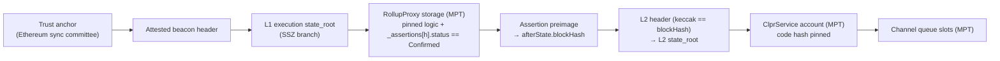

# Arbitrum Nitro (BoLD) verifier

> **Sources**: [ArbitrumNitroVerifier.sol](./ArbitrumNitroVerifier.sol), [ArbitrumAssertionProof.sol](../../../libraries/proof/arbitrum/ArbitrumAssertionProof.sol), [EthL1StateVerifier.sol](../ethereum/EthL1StateVerifier.sol), [EthBeaconLightClient.sol](../../../libraries/proof/beacon/EthBeaconLightClient.sol), [ClprEvmBundleVerifier.sol](../common/ClprEvmBundleVerifier.sol)
> **Interface**: [IClprVerifier.sol](../../../interfaces/IClprVerifier.sol)

---

## 1. The big picture

`ArbitrumNitroVerifier` lets a Hiero CLPR Service accept bundles from a CLPR Service on an **Arbitrum Nitro chain that settles on Ethereum with BoLD rollup contracts**. It trusts neither the sequencer, nor the chain's validators, nor the relayer. Trust comes from Ethereum: its sync committee signs the L1 state, and in that L1 state the chain's rollup contract says which assertions are **confirmed**.



Every arrow is checked on-chain; any failure reverts.

| Step | Where | Reused from |
|---|---|---|
| Sync-committee BLS → L1 `state_root`, committee rotation | [EthL1StateVerifier](../ethereum/EthL1StateVerifier.sol), a deployed stateless helper | [EthBeaconLightClient](../../../libraries/proof/beacon/EthBeaconLightClient.sol) (the code of `EthMainnetVerifier`, shared with the OP Stack verifiers) |
| L1 `state_root` → confirmed assertion → L2 `state_root` | [ArbitrumAssertionProof](../../../libraries/proof/arbitrum/ArbitrumAssertionProof.sol) | MPT proofs from [ClprEvmStateProof](../../../libraries/proof/evm/ClprEvmStateProof.sol) |
| L2 `state_root` → channel metadata, messages, endpoint manifest | [ClprEvmBundleVerifier](../common/ClprEvmBundleVerifier.sol) | Same as QBFT, Sei, Ethereum, OP Stack |

## 2. What the assertion proof checks

Source of truth: OffchainLabs/nitro-contracts v3.x (BoLD) — `RollupCore.sol`, `Assertion.sol`, `AssertionState.sol`, `RollupLib.sol`, `GlobalState.sol`, `AdminFallbackProxy.sol`.

| # | Check | Mirrors | Revert |
|---|---|---|---|
| 1 | Account proof of the profile's rollup proxy against the L1 `state_root` | — | MPT errors |
| 2 | Proxy slot `eip1967.proxy.implementation` (RollupAdminLogic) and `eip1967.proxy.implementation.secondary` (RollupUserLogic) equal the pinned logic contracts | `DoubleLogicERC1967Upgrade` | `RollupLogicMismatch` |
| 3 | `assertionHash = keccak256(parent ‖ keccak256(abi.encode(afterState)) ‖ inboxAcc)` over the 256-byte preimage | `RollupLib.assertionHash` | `InvalidAssertionPreimage` |
| 4 | `afterState.machineStatus == FINISHED` (an ERRORED assertion has no meaningful block) | `RollupCore.createNewAssertion` | `MachineNotFinished` |
| 5 | `_assertions[assertionHash]` slot 0, byte 25 (`status`) `== Confirmed (2)`; an absent slot (never created) reads 0 | `AssertionStatus` | `AssertionNotConfirmed(hash, status)` |
| 6 | `keccak256(l2Header) == afterState.globalState.bytes32Vals[0]`; item 3 is the L2 `stateRoot`, item 8 its number | Nitro headers are geth headers | `L2HeaderHashMismatch`, `InvalidL2Header` |

Slots are derived by the verifier from the preimage and the profile layout, never taken from the proof. `Confirmed` is terminal: only `confirmAssertionInternal` (from `Pending`), the genesis initialisation and the owner's `forceConfirmAssertion` set it, and nothing clears it. So **any** confirmed assertion is a final statement about the L2 chain: the relayer may use the newest one or an older one whose L2 state its RPC still serves. Older state cannot be replayed into a channel: the CLPR Service's own checks (`BundleLib` replay and ack monotonicity) reject queue metadata older than what the channel has seen.

Why `_assertions[h].status` and not `_latestConfirmed`: both are proven against the same storage root, but the mapping lets the relayer choose among confirmed assertions (liveness when an L2 RPC's proof window is short), at no cost to safety.

### Storage layout (profile data)

`RollupCore` behind the `RollupProxy`: `Initializable` + `ContextUpgradeable.__gap` + `PausableUpgradeable` occupy slots 0–100, then `chainId` (101) … `validators` (114–115), `_latestConfirmed` (116), `_assertions` (117). `AssertionNode` slot 0 packs `firstChildBlock(8) | secondChildBlock(8) | createdAtBlock(8) | isFirstChild(1) | status(1)`, so `status` is byte 25.

Cross-checked on live storage (2026-10-01): on Arbitrum Sepolia, Arbitrum One, Nova, Robinhood Chain and Reya, slot 116 equals `latestConfirmed()` and `_assertions[latestConfirmed]` (base 117) has status byte 25 = `0x02`. The layout is constructor data (`Profile.layout`), so an upgrade that moves a field needs a new deployment with new data only.

## 3. Trust and limits

| | |
|---|---|
| Trusted | Ethereum's sync committee (2/3, like `EthMainnetVerifier`); the chain's BoLD fault proofs; **the rollup owner** (on Arbitrum One the Security Council), who can upgrade the rollup or `forceConfirmAssertion`. |
| Not trusted | Sequencer, validators/asserters, relayer. A pending assertion is never accepted, so an invalid assertion must survive the challenge period unchallenged to matter. |
| AnyTrust chains | DA does not affect validity: confirmation is the same BoLD process. An `anyTrustFastConfirmer` (if a chain sets one) can confirm without the challenge period — an extra trusted party. It is `0x0` on every chain checked. |
| Upgrades | Fail closed: a new RollupAdminLogic / RollupUserLogic → `RollupLogicMismatch` until a verifier with the new profile is deployed. |
| Not checked | `paused()` of the rollup (a paused rollup confirms nothing new, so this only matters for already-confirmed assertions, which stay valid). |
| Latency | Assertion interval + `confirmPeriodBlocks`: Arbitrum Sepolia 20 L1 blocks (~4 min) plus the asserter's cadence (~30–60 min); Arbitrum One, Nova, Robinhood, Reya 45,818 blocks (~6.4 days); Plume, Corn 40,320 (~5.6 days); Plume asserts about every 12 h (3,579 L1 blocks between the live confirmed assertion and its child), so Plume state reaches Hiero ~5.6–6.1 days after it is produced. |
| L2 proofs | The relayer needs `eth_getProof` at the confirmed L2 block. Free Arbitrum One RPCs keep under 1 h of state (`arb1.arbitrum.io` < 14,400 blocks), so production relayers need an archive node or a full node keeping ≥ 7 days of state. For Arbitrum Sepolia the public dRPC endpoint served the needed history intermittently (the refresh script retries). A later extension could prove the CLPR storage at any recent block through the L2's EIP-2935 block-hash history from the confirmed state (not implemented; Arbitrum's history-contract parameters would need verifying first). |

### Trust anchor
The 260-byte Ethereum anchor (`gvr ‖ forkVersion ‖ channelId ‖ aggregate ‖ committeeMerkleRoot ‖ codeHash`), whose `codeHash` pins the **L2** ClprService's code hash. It rotates with the L1 sync committee exactly like `EthMainnetVerifier`'s (`newTrustAnchorId` = next sync period).

## 4. Wire format

Bundle (`verifyBundle` `proofBytes`), RLP list of 7 items (9 with an endpoint-manifest update):

```
[ 0 lightClientProof    RLP string: EthL1StateVerifier.verifyL1State proof
                        [attestedHeader, syncAggregate, executionStateRoot, executionBranch,
                         nextCommittee, nextCommitteeBranch, nonSignerProofs]
  1 assertionProof      [rollupAccountProof, rollupStorageProof]
                        storage entries [slot, nodes] for: impl slot, secondary impl slot, _assertions[h]
  2 assertionPreimage   256 B: parentAssertionHash ‖ abi.encode(AssertionState) ‖ inboxAcc
  3 l2Header            consensus RLP of the L2 block header
  4 l2AccountProof      ClprService account against the L2 stateRoot
  5 l2StorageProof      5 or 6 × [slot, nodes] (channelId-derived)
  6 bundleContent       protobuf ClprBundleContent
 (7 manifestStorageProof, 8 manifestPreimage) ]
```

The preimage comes from the rollup's `AssertionCreated(assertionHash, parentAssertionHash, assertion, afterInboxBatchAcc, …)` event: `assertion.afterState` and `afterInboxBatchAcc`. The relay tooling finds it at the node's `createdAtBlock`.

`verifyConfig` takes `EthMainnetVerifier`'s config RLP `[slot, syncCommittee, gvr, forkVersion, ledgerConfiguration, codeHash]` (with the L2 ClprService's code hash); a non-empty endpoint-manifest proof is items 0–4 above plus `[manifestStorageProof, manifestPreimage]`. `verifyL2State(proof, anchor)` runs items 0–3 only and returns the confirmed assertion hash, L2 block hash/number, L2 state root and send root (for relayers and monitoring).

## 5. Deployment profile

| Field | Arbitrum Sepolia (live fixture) | Plume mainnet (live fixture) |
|---|---|---|
| `L1_STATE_VERIFIER` | `EthL1StateVerifier(802, 9, 87, 6, 8192)` (Electra/Fulu beacon layout) | same constructor; the trust anchor carries Ethereum mainnet's `genesis_validators_root` and fork version |
| `rollup` | `0x042B2E6C5E99d4c521bd49beeD5E99651D9B0Cf4` (`chainId()` = 421614) | `0x4eD3F488a5a4417839BbC39712EB76D8Aaee6eE8` (`chainId()` = 98866) |
| `rollupAdminLogic` / `rollupUserLogic` | `0x3b7aea89…aef8` / `0xdc2f809b…0ba5` (read from the proxy slots) | `0x16ad566aaa05fe6977a033de2472c05c84cab724` / `0xa4892ffe3deab25337d7d1a5b94b35daba255451` |
| `layout` | `{assertionsSlot: 117, assertionStatusOffset: 25}` | same |

### Plume profile (checked 2026-10-01)

Plume is an Arbitrum Orbit chain (AnyTrust, custom gas token PLUME) that settles **directly on
Ethereum** with BoLD rollup contracts, so the same bytecode serves it with the profile above.

| Check | Result | Source |
|---|---|---|
| Rollup address | `0x4eD3…6eE8`; `chainId()` 98866; `bridge()` = documented Bridge `0x3538…EF83`; sequencer inbox `0x85eC…0b59` | docs.plume.org contract list + on-chain getters |
| BoLD, not legacy | `latestConfirmed()` returns a bytes32 assertion hash; slot 116 equals it; `_assertions[h]` (base 117) slot 0 = `…0201…`, status byte 25 = Confirmed, as `getAssertion(h).status` | live storage vs. getters |
| Logic contracts | EIP-1967 primary `0x16ad…b724` (RollupAdminLogic), secondary `0xa489…5451` (RollupUserLogic): the same BoLD logic Reya uses, so §2's layout applies | live proxy slots |
| Assertion event | `AssertionCreated` decodes with the nitro-contracts v3 ABI; the preimage re-hashes to the assertion hash | live logs |
| L2 headers | Standard Nitro (geth) header RLP: the L2 block hash re-hashes | live `eth_getBlockByHash` |
| `confirmPeriodBlocks` | 40,320 L1 blocks (~5.6 days) | `confirmPeriodBlocks()` |
| `anyTrustFastConfirmer` | `0x0` | getter |
| Validators | **whitelisted**: `validatorWhitelistDisabled()` = false, `getValidators()` = one address (`0x11f5…b1d5`, an EOA) | getters |
| Owner | `0xd688…8C04`, an upgradeable proxy contract (Orbit UpgradeExecutor pattern; its executors are not enumerable on-chain) | `owner()`, EIP-1967 slots |

What differs from the Arbitrum One / Sepolia base:

- **Permissioned challenges.** Only the whitelisted validator can create or challenge assertions, so
  BoLD's "anyone can challenge" does not hold. The verifier still accepts only `Confirmed`
  assertions, but safety rests on that one validator (and the owner) being honest, not on an open
  fault-proof game. This is a trust assumption of the chain, not something the verifier can check;
  a deployment should state it.
- **AnyTrust DA.** If the data-availability committee certifies data it withholds, an honest
  challenger could not rebuild the state. With a whitelisted validator this adds no new party, but
  it remains part of the trust set.
- **Archive L2 RPC available.** `rpc.plume.org` served `eth_getProof` at a confirmed block ~1.3M L2
  blocks (~6 days) old, so full bundles work from a public RPC (unlike Arbitrum One).
- Nothing in the verifier changes: same bytecode, profile data only.

## 6. Which chains this serves

The same bytecode serves every Nitro chain that settles **directly on Ethereum** with BoLD rollup contracts; only the profile differs (live-checked 2026-10-01: `latestConfirmed()` returns a bytes32 hash, slot 116 matches it, status byte 25 = Confirmed).

| Chain | Rollup (Ethereum) | chainId | DA | Profile logic (admin / user) |
|---|---|---|---|---|
| Arbitrum One | `0x4DCeB440657f21083db8aDd07665f8ddBe1DCfc0` | 42161 | Rollup | `0x7fc126ff…df17` / `0x6490ba0a…a60d` |
| Arbitrum Nova | `0xE7E8cCC7c381809BDC4b213CE44016300707B7Bd` | 42170 | blobs (formerly AnyTrust) | same as Arbitrum One |
| Robinhood Chain | `0x23A19d23e89166adedbDcB432518AB01e4272D94` | 4663 | Rollup (blobs) | `0xab7a44ce…6c82` / `0xedc23dfc…ed2c` |
| Reya | `0xB55002d2795217Fd3B91EcBb3385ba9A231E5327` | 1729 | AnyTrust (1-of-1 DAC) | `0x16ad566a…b724` / `0xa4892ffe…5451` |
| Plume | `0x4eD3F488a5a4417839BbC39712EB76D8Aaee6eE8` | 98866 | AnyTrust | `0x16ad566a…b724` / `0xa4892ffe…5451` (profiled, live fixture; whitelisted validator, §5) |
| Corn | `0x09eD…D61b` | 21000000 | AnyTrust | BoLD (not profiled here) |
| Arbitrum Sepolia | `0x042B…0Cf4` (Sepolia) | 421614 | Rollup | see §5 |

**Not covered:**
- **L3s** that settle on Arbitrum One (ApeChain, Xai, …): they need one more hop (prove Arbitrum One's state with this verifier, then the L3 rollup's storage in it). ApeChain and Xai also still run the legacy pre-BoLD rollup.
- **Pre-BoLD (legacy) rollups**: `_latestConfirmed` is a `uint64` node number and `_nodes[n]` stores `confirmData = keccak256(blockHash ‖ sendRoot)`; that needs a second assertion-proof variant.

## 7. Gas and calldata (live data, `eth_estimateGas` on anvil)

### Plume mainnet over Ethereum mainnet

Fixture: Ethereum slot 15333774 (508/512 signers), Plume L2 block 95,299,114 (assertion
`0x7b8a…6984`), plus a real sync-committee rotation (next period 1872) whose attested block proves an
older confirmed assertion (L2 block 95,158,333). Both full bundles were built from public RPCs.

| Call | `eth_estimateGas` | Calldata |
|---|---|---|
| `verifyBundle`, typical (no rotation; 5 L2 exclusion proofs in WPLUME's storage trie) | **2,459,563** | **24,996 B** |
| `verifyL2State` | 1,267,184 | 11,460 B |
| `verifyBundle` + sync-committee rotation | **7,408,325** | **91,268 B** |
| `verifyL2State` + rotation | 6,221,430 | 77,732 B |

Foundry split of the typical bundle: light client ~0.38 M (4 non-signers), rollup storage + preimage +
L2 header ~0.70 M, L2 account + storage ~0.97 M. Rotation uses 49% of Hedera's gas limit and 70% of
its calldata limit, the same as Arbitrum Sepolia.

### Arbitrum Sepolia over Sepolia

Fixture: Sepolia attested slot 11257426 (487/512 signers → 25 non-signer Merkle proofs), Arbitrum Sepolia L2 block 314,480,866.

| Call | `eth_estimateGas` | Execution | Calldata |
|---|---|---|---|
| `verifyBundle`, typical (no rotation; 3 rollup slots, 5 L2 exclusion proofs in WETH's storage trie) | **2,928,765** | ~2.37 M | **34,564 B** |
| `verifyL2State` (to the confirmed L2 state root) | 1,880,162 | ~1.52 M | 22,372 B |
| `verifyBundle` + sync-committee rotation (512 next-committee keys + branch) | **7,357,552** | ~6.09 M | **91,236 B** |
| `verifyL2State` + rotation | 6,317,221 | ~5.24 M | 79,044 B |

Split of the typical bundle's execution (Foundry `vm.lastCallGas`): light client ~0.66 M, rollup account + 3 slots + preimage + L2 header ~0.87 M, L2 account + 5 storage proofs ~0.84 M. All four fit Hedera with margin (rotation: 49% of the gas limit, 70% of the calldata limit).

Hedera limits: 15 M gas, 128 KB calldata (jumbo EthereumTransaction), EIP-170 24,576 B. `ArbitrumNitroVerifier` runtime is ~13.9 KB; `EthL1StateVerifier` ~11.6 KB.

## 8. Tests and data

- Foundry: `test/verifiers/evm/arbitrum/ArbitrumNitroVerifier.t.sol` — the live fixture with the real BLS light client, and negative cases on tampered real proofs (bad signature, below threshold, flipped participation bit, wrong validator set, stale fork version / rotated anchor, forged L1 state root, pending assertion, never-created assertion, ERRORED machine status, unpinned rollup logic, other rollup, wrong L2 header, wrong L2 code hash, other channel, tampered MPT nodes, shapes, constructor).
- Live data: `test/e2e/fixtures/arbitrum-live/capture.json`, refreshed with `npm run arbitrum-live:refresh` (`test/e2e/relay/buildArbitrumLiveProof.ts`, which also regenerates the Foundry fixture `test/verifiers/evm/arbitrum/fixtures/live.json`).
- Plume: `test/e2e/fixtures/plume-live/capture.json`, refreshed with `npm run plume-live:refresh` (same builder, `--network plume`; Foundry fixture `fixtures/plume-live.json`). `ArbitrumNitroVerifierPlume.t.sol` runs the whole Foundry suite above on it.
- vitest on anvil: `npm run test:e2e:arbitrum-live` and `npm run test:e2e:plume-live` (both use the shared `test/e2e/tests/verifiers/arbitrumLiveSuite.ts`).
- There is no ClprService on Arbitrum Sepolia or Plume: the L2 account is WETH9 (`0x980B…7c73`), or WPLUME (`0xEa23…4bd1`) on Plume, with its real code hash pinned, and the channel slots are genuine MPT exclusion proofs (zeroed metadata). A populated channel exercises only the shared `ClprEvmBundleVerifier` code, covered by the QBFT/Ethereum suites.
