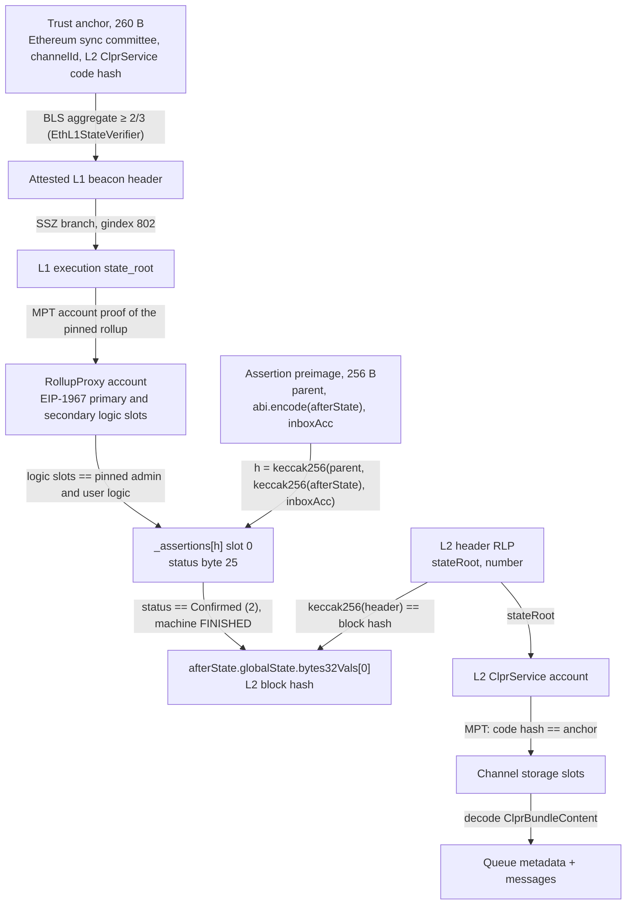
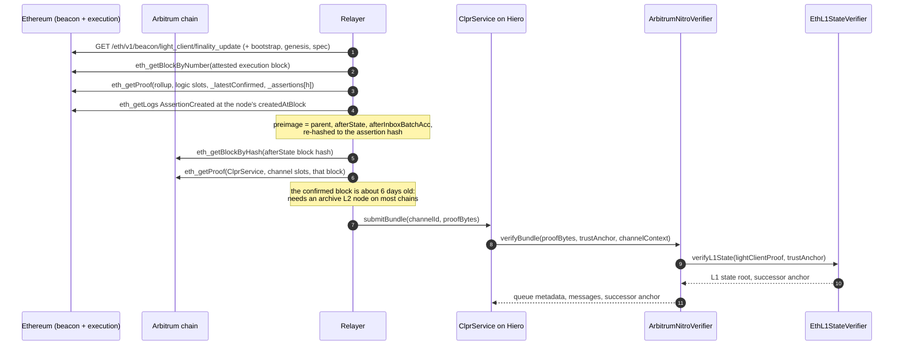

# Arbitrum Nitro (BoLD) verifier (`ArbitrumNitroVerifier`)

`ArbitrumNitroVerifier` lets a CLPR Service on Hiero accept bundles from a CLPR Service on an Arbitrum
Nitro chain that settles directly on Ethereum with BoLD rollup contracts (`<chain> → Hiero`). It trusts
neither the sequencer, nor the chain's validators, nor the relayer. Trust comes from Ethereum: the sync
committee signs the L1 state, and in that L1 state the chain's rollup contract marks assertions as
**Confirmed**. From a confirmed assertion the verifier opens the L2 block hash, checks the L2 header
against it, and proves the peer `ClprService` channel storage under the header's state root. One bytecode
serves Arbitrum One, Arbitrum Nova, Robinhood Chain, Reya and Plume; only the profile (rollup address,
pinned logic contracts, storage layout) differs.

> **Sources**: [ArbitrumNitroVerifier.sol](./ArbitrumNitroVerifier.sol), [ArbitrumAssertionProof.sol](../../../libraries/proof/arbitrum/ArbitrumAssertionProof.sol), [EthL1StateVerifier.sol](../ethereum/EthL1StateVerifier.sol), [EthBeaconLightClient.sol](../../../libraries/proof/beacon/EthBeaconLightClient.sol), [ClprEvmBundleVerifier.sol](../common/ClprEvmBundleVerifier.sol) ·
> **Interface**: [IClprVerifier.sol](../../../interfaces/IClprVerifier.sol) ·
> **Chain pages**: [docs/chains/README.md](../../../../docs/chains/README.md)

---

## 1. At a glance

| | |
|---|---|
| Chains covered | Arbitrum One `eip155:42161`, Arbitrum Nova `eip155:42170`, Robinhood Chain `eip155:4663`, Reya `eip155:1729`, Plume `eip155:98866`; live data also from Arbitrum Sepolia `eip155:421614` |
| Finality source | Ethereum sync committee (≥ 342 of 512) over the attested L1 header, then `_assertions[h].status == Confirmed` in the rollup's storage at that L1 state |
| Trust assumptions | The sync committee; the chain's BoLD fault proofs; the rollup owner (upgrades, `forceConfirmAssertion`). Plume also trusts its single whitelisted validator; AnyTrust chains (Reya, Plume) their DA committee. |
| Typical bundle | Plume 2,459,563 gas, 24,996 B; Arbitrum Sepolia 2,928,765 gas, 34,564 B |
| Rotation bundle | Plume 7,408,325 gas, 91,268 B; Arbitrum Sepolia 7,357,552 gas, 91,236 B (49% of Hedera's gas limit, 70% of its calldata limit) |
| Contract size | `ArbitrumNitroVerifier` 13,948 B runtime, 14,520 B init code; `EthL1StateVerifier` 11,593 B (EIP-170: 24,576 B) |
| Status | Plume mainnet: full bundles, typical and rotation, on live data (anvil, captured 2026-10-01). Arbitrum Sepolia: the same (captured 2026-10-01). Arbitrum One, Nova, Robinhood, Reya: layout checked on live L1 storage on 2026-10-01, no capture. Not yet run on Hedera. |

## 2. How it works



Walk-through of `ArbitrumNitroVerifier.sol:verifyBundle(proofBytes, trustAnchor, channelContext)`:

1. **L1 light client.** `_verifyL2State` calls `EthL1StateVerifier.sol:verifyL1State` (a separate deployed
   contract), which checks the sync-committee signature, the SSZ branch to the L1 `state_root` and the
   optional rotation, and returns the successor anchor.
2. **Assertion.** `ArbitrumAssertionProof.sol:verify` proves the rollup proxy account, checks both EIP-1967
   logic slots against the pinned `RollupAdminLogic` and `RollupUserLogic` (`RollupLogicMismatch`),
   hashes the preimage to `assertionHash` (`decodeAssertion`, mirroring `RollupLib.assertionHash`),
   requires `machineStatus == FINISHED` (`MachineNotFinished`), and proves
   `_assertions[assertionHash]` at the slot from `assertionSlot` with status byte 25 equal to Confirmed
   (`AssertionNotConfirmed`). A slot that was never written reads 0 and fails.
3. **L2 header.** `ArbitrumAssertionProof.sol:verifyL2Header` checks
   `keccak256(l2Header) == afterState.globalState.bytes32Vals[0]` and reads the header's `stateRoot`
   (item 3) and number (item 8).
4. **L2 state.** `ClprEvmBundleVerifier.sol:_verifyServiceStorageRoot` proves the `ClprService` account
   (address from `channelContext`, code hash from the anchor), and `_verifyChannelStorage` proves the
   five or six channel slots derived from `channelId`.
5. **Messages.** `_decodeBundleContent` reads `ClprBundleContent`; an optional manifest proof is checked.

`verifyL2State(proof, trustAnchor)` runs steps 1 to 3 and returns the confirmed assertion hash, the L2
block hash and number, the L2 state root and the send root, for relayers and monitoring.

`Confirmed` is terminal: only `confirmAssertionInternal` (from `Pending`), genesis initialisation and the
owner's `forceConfirmAssertion` set it, and nothing clears it. Any confirmed assertion is therefore a final
statement, and the relayer may use an older one whose L2 state its RPC still serves. Older queue metadata
cannot be replayed into a Channel: the CLPR Service's replay and ack-monotonicity checks reject it. The
verifier proves `_assertions[h].status` rather than `_latestConfirmed` for that reason: both come from the
same storage root, and the mapping lets the relayer choose.

## 3. Bundle lifecycle



## 4. Trust model

Trusted:

- **Ethereum's sync committee** (2/3 of 512), on the L1 header it signs.
- **BoLD fault proofs.** A pending assertion is never accepted, so an invalid assertion must survive the
  challenge period unchallenged.
- **The rollup owner** (on Arbitrum One, the Security Council), who can upgrade the rollup or call
  `forceConfirmAssertion`.
- **Whitelisted validators** where the chain has them. On Plume `validatorWhitelistDisabled()` is false and
  `getValidators()` returns one EOA (`0x11f5…b1d5`), so BoLD's open challenge does not hold: safety rests on
  that validator and the owner.
- **AnyTrust DA committees** (Reya, Plume): a committee that certifies data it withholds can stop honest
  challengers from rebuilding state. Data availability does not change what "Confirmed" means.
- **`anyTrustFastConfirmer`**, if set, can confirm without the challenge period. It is `0x0` on every chain
  checked.

Not trusted: the sequencer, asserters, the relayer and the RPC providers. Slots are derived from the
preimage and the profile, never from the proof.

Not checked: the rollup's `paused()` (a paused rollup confirms nothing new; already-confirmed assertions
stay valid).

To forge a bundle an attacker must control 2/3 of an Ethereum sync committee, or the rollup owner, or get
an invalid assertion confirmed (on permissioned chains: control the whitelisted validator).

## 5. Proof format

The trust anchor is the 260-byte Ethereum anchor of `EthMainnetVerifier`; `codeHash` pins the **L2**
`ClprService`.

### `proofBytes` (RLP list of 7, or 9 with a manifest update)

| # | Field | Type | Meaning |
|---|---|---|---|
| 0 | `lightClientProof` | bytes (RLP string) | `EthL1StateVerifier.verifyL1State` proof: `[attestedHeader, syncAggregate, executionStateRoot, executionBranch, nextCommittee, nextCommitteeBranch, nonSignerProofs]` |
| 1 | `assertionProof` | list | `[rollupAccountProof, rollupStorageProof]`; storage entries for the primary and secondary implementation slots and `_assertions[h]` |
| 2 | `assertionPreimage` | 256 B | `parentAssertionHash ‖ abi.encode(AssertionState) ‖ inboxAcc`, from the `AssertionCreated` event |
| 3 | `l2Header` | bytes | Consensus RLP of the L2 block header |
| 4 | `l2AccountProof` | list | `ClprService` account against the L2 `stateRoot` |
| 5 | `l2StorageProof` | 5 or 6 × `[slot, nodes]` | Channel slots derived from `channelId` |
| 6 | `bundleContent` | bytes | Protobuf `ClprBundleContent` |
| 7, 8 | manifest | optional | Commitment-slot proof and preimage |

`verifyConfig` takes `EthMainnetVerifier`'s config RLP `[slot, syncCommittee, gvr, forkVersion,
ledgerConfiguration, codeHash]` with the L2 `ClprService` code hash.

### Profile (constructor data)

Constructor: `(IEthL1StateVerifier l1StateVerifier, ArbitrumAssertionProof.Profile profile)` with
`Profile = {rollup, rollupAdminLogic, rollupUserLogic, layout: {assertionsSlot, assertionStatusOffset}}`.
`EthL1StateVerifier` takes `(802, 9, 87, 6, 8192)`. The constructor rejects zero addresses and an offset
above 31.

Storage layout (nitro-contracts v3.x `RollupCore` behind `RollupProxy`): `Initializable`,
`ContextUpgradeable.__gap` and `PausableUpgradeable` take slots 0–100, then `chainId` (101) …
`validators` (114–115), `_latestConfirmed` (116), `_assertions` (117). `AssertionNode` slot 0 packs
`firstChildBlock(8) | secondChildBlock(8) | createdAtBlock(8) | isFirstChild(1) | status(1)`, so status is
byte 25. On live storage (2026-10-01) slot 116 equals `latestConfirmed()` and `_assertions[latestConfirmed]`
has status byte `0x02` on Arbitrum Sepolia, Arbitrum One, Nova, Robinhood Chain, Reya and Plume.

| Chain | Rollup (Ethereum) | Admin / user logic | DA | `confirmPeriodBlocks` |
|---|---|---|---|---|
| Arbitrum One | `0x4DCeB440657f21083db8aDd07665f8ddBe1DCfc0` | `0x7fc126ff…df17` / `0x6490ba0a…a60d` | Rollup | 45,818 (about 6.4 days) |
| Arbitrum Nova | `0xE7E8cCC7c381809BDC4b213CE44016300707B7Bd` | same as Arbitrum One | blobs (formerly AnyTrust) | 45,818 |
| Robinhood Chain | `0x23A19d23e89166adedbDcB432518AB01e4272D94` | `0xab7a44ce…6c82` / `0xedc23dfc…ed2c` | Rollup (blobs) | 45,818 |
| Reya | `0xB55002d2795217Fd3B91EcBb3385ba9A231E5327` | `0x16ad566a…b724` / `0xa4892ffe…5451` | AnyTrust (1-of-1 DAC) | 45,818 |
| Plume | `0x4eD3F488a5a4417839BbC39712EB76D8Aaee6eE8` | `0x16ad566aaa05fe6977a033de2472c05c84cab724` / `0xa4892ffe3deab25337d7d1a5b94b35daba255451` | AnyTrust | 40,320 (about 5.6 days) |
| Arbitrum Sepolia | `0x042B2E6C5E99d4c521bd49beeD5E99651D9B0Cf4` (Sepolia) | `0x3b7aea898c7f51551daaff4dae8ab0f553f2aef8` / `0xdc2f809bba33cbb96a5ea8e9ee2dd4cb104e0ba5` | Rollup | 20 (about 4 min) |

`layout` is `{assertionsSlot: 117, assertionStatusOffset: 25}` for all of them. Full logic addresses for
Arbitrum One, Nova, Robinhood and Reya are not recorded in this repo; read the two EIP-1967 slots of the
rollup proxy at deployment.

## 6. Sync-committee rotation

The trusted set is Ethereum's sync committee, as in `EthMainnetVerifier`: it rotates every 8,192 L1 slots
(about 27 h), the rotation items ride inside `lightClientProof`, and the successor anchor id is the next
period. The live fixtures carry a real rotation proven through the confirmed L2 state root:

| | Gas | Calldata |
|---|---|---|
| Plume `verifyBundle` + rotation (next period 1872) | 7,408,325 | 91,268 B |
| Arbitrum Sepolia `verifyBundle` + rotation | 7,357,552 | 91,236 B |

A Channel that misses a full period cannot catch up and needs a new anchor. The rollup itself has no
validator set the verifier follows.

## 7. Gas and calldata

`eth_estimateGas` on anvil, live captures from 2026-10-01, re-run 2026-10-01. Hedera limits: 15M gas and
128 KB calldata.

Plume over Ethereum mainnet (slot 15333774, 508/512 signers, Plume L2 block 95,299,114, assertion
`0x7b8a…6984`; the rotation's attested block proves an older confirmed assertion at L2 block 95,158,333):

| Call | Gas | Calldata |
|---|---|---|
| `verifyBundle`, typical (5 L2 exclusion proofs in WPLUME's storage) | 2,459,563 | 24,996 B |
| `verifyL2State` | 1,267,184 | 11,460 B |
| `verifyBundle` + rotation | 7,408,325 | 91,268 B |
| `verifyL2State` + rotation | 6,221,430 | 77,732 B |

Arbitrum Sepolia over Sepolia (slot 11257426, 487/512 signers, 25 non-signer proofs, L2 block 314,480,866):

| Call | Gas | Calldata |
|---|---|---|
| `verifyBundle`, typical (3 rollup slots, 5 L2 exclusion proofs in WETH's storage) | 2,928,765 | 34,564 B |
| `verifyL2State` | 1,880,162 | 22,372 B |
| `verifyBundle` + rotation | 7,357,552 | 91,236 B |
| `verifyL2State` + rotation | 6,317,221 | 79,044 B |

Execution split from the existing Foundry measurements (`vm.lastCallGas`): Plume light client about 0.38M
(4 non-signers), rollup storage, preimage and L2 header about 0.70M, L2 account and storage about 0.97M;
Arbitrum Sepolia about 0.66M, 0.87M and 0.84M.

## 8. Limits and known gaps

- **Archive L2 proofs.** The relayer needs `eth_getProof` at the confirmed L2 block, about 6 days old.
  Free Arbitrum One RPCs keep under 1 h of state (`arb1.arbitrum.io` < 14,400 blocks), so production
  relayers need an archive node or a full node keeping at least 7 days. `rpc.plume.org` served a block
  about 1.3M L2 blocks (about 6 days) old. The public Arbitrum Sepolia dRPC endpoint served it
  intermittently (the refresh script retries). Proving CLPR storage at a recent block through the L2's
  EIP-2935 history is not implemented.
- **No ClprService on Arbitrum Sepolia or Plume.** The L2 account is WETH9 (`0x980B…7c73`) or WPLUME
  (`0xEa23…4bd1`) with its real code hash pinned; the channel slots are MPT exclusion proofs. A populated
  channel exercises only the shared `ClprEvmBundleVerifier` code.
- **Not covered:** L3s settling on Arbitrum One (ApeChain, Xai) need another hop, and ApeChain and Xai still
  run the legacy rollup; pre-BoLD rollups store `_latestConfirmed` as a `uint64` node number with
  `confirmData = keccak256(blockHash ‖ sendRoot)` and need a second proof variant; Corn (BoLD, AnyTrust,
  `confirmPeriodBlocks` 40,320) is not profiled.
- **Latency.** Assertion interval plus `confirmPeriodBlocks`: about 6.4 days on Arbitrum One, Nova,
  Robinhood and Reya; about 5.6 days on Plume, which asserts about every 12 h (3,579 L1 blocks between the
  live confirmed assertion and its child), so Plume state reaches Hiero 5.6 to 6.1 days after it is
  produced; about 4 min plus a 30–60 min asserter cadence on Arbitrum Sepolia.
- **Not run on Hedera yet.**
- **Hiero → Arbitrum** is not built; whether each chain's ArbOS provides EIP-2537 was not checked.

## 9. Upgrades and forks

- **Fail closed.** A new `RollupAdminLogic` or `RollupUserLogic` reverts with `RollupLogicMismatch` until a
  verifier with the new profile is deployed. A layout change needs new profile data only.
- **Fork-aware verifiers ADR.** `ADR/2026-10-01-fork-aware-verifiers.md` in the spec fork (draft PR
  LFDT-CLPR/clpr-spec#1) names the Arbitrum fork identity as the ArbOS version in L2 state, with assertion or
  state layout changes as Class B and proof-system changes as Class C. Its fork profiles would replace the
  redeployment for Class B; not implemented here. A move away from BoLD (or back to a legacy rollup) is
  Class C.
- **ArbOS upgrades** that keep the geth header format and the `AssertionState` encoding need no change; a
  header format change breaks `verifyL2Header`.
- **L1 forks** affect the light client as in `EthMainnetVerifier`.

## 10. Running it

```sh
# Foundry: live fixtures with the real BLS light client and the negative matrix (Arbitrum Sepolia and Plume)
forge test --match-path 'test/verifiers/evm/arbitrum/*'

# Live replay on anvil
forge build
npm run test:e2e:arbitrum-live
npm run test:e2e:plume-live

# Re-capture (public RPCs; also regenerates the Foundry fixtures)
npm run arbitrum-live:refresh
npm run plume-live:refresh
```

Results on this branch (2026-10-01): Foundry 64 passed (32 per network); Arbitrum Sepolia replay 12 of 12;
Plume replay 12 of 12.

The Foundry suites cover bad signature, below threshold, a flipped participation bit, wrong validator set,
stale fork version and rotated anchor, a forged L1 state root, a pending assertion, a never-created
assertion, ERRORED machine status, unpinned rollup logic, another rollup, a wrong L2 header, a wrong L2 code
hash, another channel, tampered MPT nodes, shapes and the constructor guards.

## 11. Files

| File | Purpose |
|---|---|
| `src/verifiers/evm/arbitrum/ArbitrumNitroVerifier.sol` | The verifier: `verifyBundle`, `verifyConfig`, `verifyL2State` |
| `src/libraries/proof/arbitrum/ArbitrumAssertionProof.sol` | Rollup logic pin, assertion hash and status, L2 header |
| `src/verifiers/evm/ethereum/EthL1StateVerifier.sol` | Deployed L1 light-client helper |
| `src/libraries/proof/beacon/EthBeaconLightClient.sol` | Sync-committee light client as a library |
| `src/verifiers/evm/common/ClprEvmBundleVerifier.sol` | Shared L2 account and channel storage |
| `test/verifiers/evm/arbitrum/ArbitrumNitroVerifier.t.sol` | Arbitrum Sepolia live Foundry suite |
| `test/verifiers/evm/arbitrum/ArbitrumNitroVerifierPlume.t.sol` | The same suite on the Plume fixture |
| `test/verifiers/evm/arbitrum/fixtures/{live,plume-live}.json` | Foundry fixtures |
| `test/e2e/fixtures/arbitrum-live/capture.json`, `test/e2e/fixtures/plume-live/capture.json` | Live captures |
| `test/e2e/relay/buildArbitrumLiveProof.ts` | Capture and refresh (`--network plume` for Plume) |
| `test/e2e/tests/verifiers/arbitrumLiveSuite.ts` | Shared vitest suite |
| `test/e2e/tests/verifiers/arbitrum-live-sepolia.spec.ts`, `plume-live.spec.ts` | Live replay specs |

## 12. References

- OffchainLabs nitro-contracts v3.x (BoLD): `RollupCore.sol`, `Assertion.sol`, `AssertionState.sol`,
  `RollupLib.sol`, `GlobalState.sol`, `AdminFallbackProxy.sol`: <https://github.com/OffchainLabs/nitro-contracts>
- BoLD overview: <https://docs.arbitrum.io/how-arbitrum-works/bold/gentle-introduction>
- Plume contract list: <https://docs.plume.org>
- CLPR spec and fork-aware verifiers ADR (draft PR LFDT-CLPR/clpr-spec#1): <https://github.com/LFDT-CLPR/clpr-spec>
