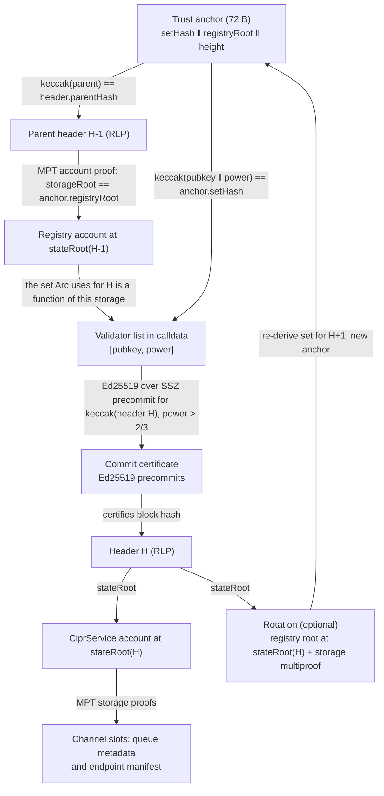
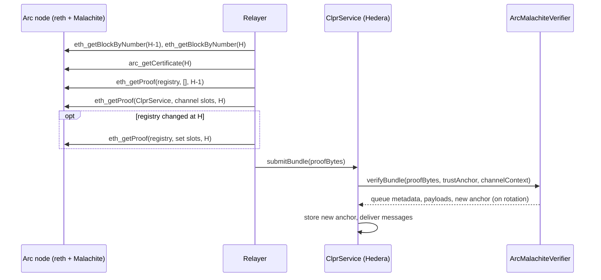

# Arc verifier (Malachite)

`ArcMalachiteVerifier` is an **Arc → Hiero** verifier. Arc is Circle's EVM L1. It runs
**Malachite**, a Rust BFT engine that implements the Tendermint algorithm, over a reth execution
layer. The verifier checks a Malachite commit certificate (Ed25519 precommits from more than 2/3 of
the voting power) for an Arc block, proves that the signing set is the one Arc's own nodes use for
that height (the `ValidatorRegistry` storage at the parent block), and then proves the ClprService
queue values with Merkle-Patricia proofs against the certified block's `stateRoot`. Arc is not
CometBFT: votes are SSZ, not protobuf, there is no header-level validator hash, and the validator
set is ordinary EVM storage. So it has its own adapter instead of a
[CometBftVerifier](../cometbft/README.md) profile.

All protocol facts were checked against `circlefin/arc-node` (`main`, commit `6e764023`,
2026-09-25, still the head on 2026-10-01), its Malachite fork `circlefin/malachite` tag `v0.8.0`,
and the live Arc testnet on 2026-10-01.

## 2. At a glance

| | |
|---|---|
| Chains | Arc testnet, chain id 5042002 (`eip155:5042002`). Arc mainnet: same code path, no public mainnet RPC answered on 2026-10-01 |
| Direction | Arc → Hiero |
| Finality source | Malachite commit certificate: Ed25519 precommits, strictly more than 2/3 of voting power, one height and round. Final on commit |
| Trust (one line) | Honest 2/3+ of the registry's validator set; the set is pinned by the registry storage root at H-1; bootstrap checkpoint at deploy |
| Typical bundle | **7,862,185 gas**, **12,036 B** calldata (11 signatures, 21 validators) |
| Bundle + rotation | **11,973,337 gas**, **28,804 B** calldata |
| Contract size | 17,155 B runtime (EIP-170 margin 7,421 B) |
| Status | Live-verified on Arc testnet, heights 64,897,127 and 64,897,201 (2026-10-01) |

## 3. How it works



1. Decode the anchor `(setHash, registryRoot, height)` (`ArcMalachiteVerifier.sol:_decodeAnchor`); apply
   any rotation hops first (`_applyHops`).
2. Hash header H with keccak; its number must be at least the anchor height (`_step`, `_headerFields`).
3. `keccak256(parentHeader) == header.parentHash`, and its number is H-1 (`_step`).
4. Set pinning: the registry account proof at `stateRoot(H-1)` must give `storageRoot ==
   registryRoot`. Arc computes the signing set for H from exactly this storage (`_verifyRegistryRoot`).
5. The validator list in calldata hashes to `setHash` = `keccak256(‖ pubkey ‖ power (u64 BE))`
   (`_parseValidators`).
6. Signatures with strictly increasing indices are checked with Ed25519 over the 75-byte SSZ
   precommit (`precommitSignBytes`) until the power is strictly above 2/3 (`_verifyCertificate`).
7. Optional rotation: the registry root at `stateRoot(H)` and a storage multiproof re-derive the
   set for H+1, as Arc's `abi_decode_validator_set` does (`_deriveSetHash`,
   `MptMultiProof.sol`). The anchor becomes `(set', root', H+1)`.
8. ClprService: account proof, channel slots and the optional endpoint manifest against
   `stateRoot(H)` (`ClprEvmBundleVerifier.sol:_verifyServiceStorageRoot`, `_verifyChannelStorage`,
   `_verifyEndpointManifest`).

Protocol facts used (all from `arc-node` unless noted):

| Item | Value | Source |
|---|---|---|
| Quorum | `signed * 3 > total * 2`, weighted by voting power | Malachite `core-types/src/threshold.rs` |
| Signature | Ed25519 over the raw sign bytes, no prehash | `crates/signer/src/local.rs` |
| Sign bytes (75 B) | `type u8 (Precommit = 1)` ‖ `height u64 LE` ‖ `offset(round) u32 = 37` ‖ `offset(value) u32 = 42` ‖ `address [20]` ‖ `01 ‖ round u32 LE` ‖ `01 ‖ block hash` | `crates/types/src/vote.rs`, `ssz/v1/*` |
| Value | The EVM block hash | `crates/types/src/value.rs` |
| Validator address | `keccak256(pubkey)[0..20]` (first 20 bytes) | `crates/types/src/address.rs` |
| Signing set for H | `ValidatorRegistry.getActiveValidatorSet()` at block H-1 | `eth-engine/src/rpc/ethereum_rpc.rs` |
| Set filtering | `status == Active`, `votingPower > 0`, 32-byte key | `eth-engine/src/abi_utils.rs` |
| Registry | ERC-1967 proxy `0x3600…0002`, ERC-7201 base `0xb58da0dc…c9d200` | `contracts/src/validator-manager/ValidatorRegistry.sol` |
| Certificate RPC | `arc_getCertificate(H)` | `crates/evm-node/src/rpc/get_certificate.rs` |

Registry layout read by `_deriveSetHash` (base `B`): `_values.length` at `B+1`; `id = _values[i]`
at `keccak(B+1)+i`; struct `s = keccak(id ‖ B)` with `status` at `s`, key length word at `s+1`
(must be 65, a 32-byte long-form `bytes`), `votingPower` at `s+2`, key at `keccak(s+1)`. Entries
Arc would skip are skipped before their key is read.

## 4. Bundle lifecycle



## 5. Trust model

Trusted:
- An honest supermajority (more than 2/3 of voting power) of each validator set the verifier
  accepts. A set is used only for heights whose parent state holds that exact registry storage.
- The registry owner. `ValidatorRegistry` is `onlyOwner` (Circle, permissioned set). The verifier
  follows what the owner writes, as Arc's nodes do.
- The bootstrap checkpoint `(BOOTSTRAP_SET_HASH, BOOTSTRAP_REGISTRY_ROOT, BOOTSTRAP_HEIGHT)` fixed
  at deployment and used by `verifyConfig`.
- The Hedera-side upgrade keys of the deployed contracts, as for every CLPR verifier.

Not trusted: the relayer, the RPC providers, and the validator list and proofs in calldata. All of
them are checked against hashes.

To forge a bundle an attacker must control more than 2/3 of the voting power of a set the verifier
accepts, or the registry owner.

## 6. Proof format

Trust anchor (72 B): `setHash (32) ‖ registryRoot (32) ‖ height (u64 BE)`.

`verifyBundle` proof bytes: `RLP([step, hops[], serviceAccountProof, storageProof, bundleContent
(, manifestStorageProof, manifestPreimage)])`.

| Field | Type | Meaning |
|---|---|---|
| `step` | RLP list | `[header, parentHeader, round, sigs, validators, parentRegistryAccountProof, rotation]` |
| `header`, `parentHeader` | bytes | RLP Arc headers H and H-1 |
| `round` | uint | Certificate round |
| `sigs` | list of `[index, sig(64)]` | Strictly increasing indices into `validators` |
| `validators` | list of `[pubkey(32), power]` | Must hash to the anchor's `setHash` |
| `parentRegistryAccountProof` | list of bytes | Registry account at `stateRoot(H-1)` |
| `rotation` | `[]` or `[registryAccountProof, multiproof]` | Registry at `stateRoot(H)` and the set storage |
| `hops` | list of steps | Rotation steps applied before `step` |
| `serviceAccountProof`, `storageProof` | MPT proofs | ClprService account and channel slots at `stateRoot(H)` |
| `bundleContent` | bytes | Protobuf with the message payloads |

`verifyConfig`: `RLP([step, hops[], serviceAccountProof, slot25Proof, ledgerConfiguration])` from
the bootstrap checkpoint. It proves ClprService `_config.serviceAddress` at slot 25 and checks the
chain id.

Profile (constructor): `chainId`, `ed25519Verifier`, `registry`, `bootstrapSetHash`,
`bootstrapRegistryRoot`, `bootstrapHeight`. See [docs/chains/arc.md](../../../../docs/chains/arc.md).

## 7. Validator-set rotation

Any write to the registry storage (register, activate, remove, power change, proxy upgrade) changes
its storage root. After such a change at block R, no bundle verifies until the anchor crosses R
(step 4). The relayer watches registry events and submits a bundle with `rotation` for block R.
The verifier re-derives the set from storage, so no signature over the set is needed.

- Cost on live data: 11,973,337 gas and 28,804 B for bundle + rotation. Set derivation alone is
  3,825,658 gas and 13,412 B (21 validators, 106 slot lookups).
- `MptMultiProof` sends each distinct trie node once: 162 nodes, 13,309 B on live data, where
  separate `eth_getProof` paths would be about 95 KB.
- Catch-up: one rotation per transaction. A rotation hop plus a bundle in one transaction measured
  19,154,725 gas, which does not fit; submit each rotation as its own bundle.
- Rotation is a liveness duty for the relayer. A missed rotation stops the channel; it does not
  let a wrong set sign.

## 8. Gas and calldata

Anvil `eth_estimateGas` of the full transaction, live Arc testnet fixture
`test/e2e/fixtures/arc-live/testnet.json` (2026-10-01, 21 validators, total power 30,002),
`npm run test:e2e:arc-live`. Hedera limits: 15,000,000 gas, 131,072 B calldata.

| Case | Signatures | Gas | Calldata | Fits |
|---|---|---|---|---|
| `verifyBundle` | 11 | 7,862,185 | 12,036 B | yes |
| `verifyBundle` + rotation | 11 | 11,973,337 | 28,804 B | yes |
| Set derivation alone (harness) | 0 | 3,825,658 | 13,412 B | n/a |
| Rotation hop + bundle | 22 | 19,154,725 | 35,044 B | **no** |

Ed25519 is pure Solidity (Hedera has no Ed25519 precompile) at roughly 0.64M gas per signature,
derived from these rows. Estimate, not measured: the testnet powers are 11 × 2,000, 8 × 1,000 and
2 × 1, so a certificate holding mostly low-power signers can need 16 signatures, about 11.1M gas
for a bundle and about 15.2M for a bundle + rotation, which would not fit.

## 9. Limits and known gaps

- **Proof window.** Public Arc RPCs (Blockdaemon, PublicNode) serve `eth_getProof` only at the
  head block. `rpc.testnet.arc.network` serves `arc_getCertificate` but not `eth_getProof`. The
  fixture builder races the head; a production relayer needs its own reth node with a proof window.
- **Worst-case rotation.** A rotation at a block whose certificate needs 16 signatures is estimated
  just above 15M gas (section 8). Splitting it into "certify R" and "derive the set from
  stateRoot(R)" needs a small checkpoint contract, because the verifier holds no state.
- **No ClprService on Arc.** The fixture proves the channel slots of the `0x3600…0001` system proxy
  as a stand-in (absent slots, MPT exclusion proofs, zeroed metadata). `verifyConfig` runs end to
  end and stops at slot 25 with `ServiceAddressSlotMismatch`, as expected.
- **Mainnet.** Not live-verified: no public Arc mainnet RPC answered on 2026-10-01.
- **Hiero → Arc** is not part of this verifier.

## 10. Upgrades and forks

- A proxy upgrade of the registry changes its storage root and is handled as a rotation.
- A change to the vote encoding, the address derivation, the set selection rule (H-1) or the
  header RLP breaks verification: bundles fail closed and a new verifier is needed.
- Relation to the fork-aware verifier ADR (`ADR/2026-10-01-fork-aware-verifiers.md` in the spec
  fork, draft PR LFDT-CLPR/clpr-spec#1): this verifier does not implement fork profiles or the ADR's
  typed upgrade reverts yet. A layout change (header fields, SSZ vote layout, registry slots) would
  need a fork profile; a semantic change (quorum rule, set selection) needs a new verifier and a
  `ClprChannelSuccession` to it. Until then an unhandled upgrade stalls the channel; it does not
  accept a wrong proof.

## 11. Running it

```bash
forge test --match-path 'test/verifiers/evm/arc/*'          # 30 Foundry tests
forge test --match-contract ArcComplianceTest             # 28 compliance tests
forge build && npm run test:e2e:arc-live                     # 15 anvil replay tests + gas table
npm run arc-live:refresh                                     # re-record the live fixture
npx tsx test/e2e/relay/exportArcForgeFixture.ts              # re-export the Foundry fixture
```

Coverage. Foundry (30): live bundle, rotation, hop, set derivation; rejects a flipped signature byte, a
certificate replayed onto another header, a wrong round, power below or exactly 2/3, a duplicate or
out-of-range signer, a wrong set, a stale height, a tampered header, a wrong parent header, a parent
registry proof from another block, a registry-root mismatch, a malformed rotation, multiproof
tampering (trailing path, wrong root, swapped node), a storage proof from another block or channel,
a wrong chain id and a slot 25 mismatch. The anvil spec repeats the main cases through the
production contract.

## 12. Files

| File | What |
|---|---|
| `src/verifiers/evm/arc/ArcMalachiteVerifier.sol` | The verifier |
| `src/libraries/proof/evm/MptMultiProof.sol` | Deduplicated storage multiproof walker |
| `src/verifiers/evm/sei/Ed25519Verifier.sol` | Pure-Solidity Ed25519 (shared) |
| `test/verifiers/evm/arc/ArcMalachiteVerifier.t.sol` | 30 Foundry tests on live data, with negative cases |
| `test/verifiers/evm/arc/ArcMalachiteVerifierHarness.sol` | Harness: set derivation, Ed25519 stub for threshold cases |
| `test/verifiers/evm/arc/fixtures/arc-testnet.json` | Foundry export of the live fixture |
| `test/e2e/fixtures/arc-live/testnet.json` | Raw live RPC responses, two snapshots |
| `test/e2e/relay/arc.ts` | Relay encoding (steps, multiproof, signature selection) |
| `test/e2e/relay/buildArcLiveFixture.ts` | Live capture with off-chain checks |
| `test/e2e/relay/exportArcForgeFixture.ts` | Foundry fixture export |
| `test/verifiers/compliance/ArcComplianceTest.t.sol` | Shared `IClprVerifier` compliance suite (28 cases) on synthetic chain data, Ed25519 stubbed by the harness |
| `test/verifiers/compliance/EvmCertifiedStateCompliance.sol` | Compliance-adapter body shared by the Arc and Plasma adapters |
| `test/e2e/tests/verifiers/arc-live.spec.ts` | Anvil replay spec with gas and calldata |

## 13. References

- circlefin/arc-node: `crates/types/src/{vote.rs,value.rs,address.rs,ssz/v1}`,
  `crates/signer/src/local.rs`, `crates/evm-node/src/rpc/get_certificate.rs`,
  `eth-engine/src/{rpc/ethereum_rpc.rs,abi_utils.rs}`,
  `contracts/src/validator-manager/ValidatorRegistry.sol` — https://github.com/circlefin/arc-node
- circlefin/malachite `v0.8.0`: `core-types/src/threshold.rs` — https://github.com/circlefin/malachite
- Arc testnet RPCs: `https://rpc.testnet.arc.network`, `https://rpc.blockdaemon.testnet.arc.network`,
  `https://arc-testnet-rpc.publicnode.com`
- Hedera limits: 15M gas per transaction, 128 KB jumbo EthereumTransaction calldata
