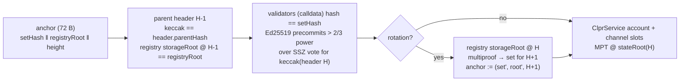

# Arc verifier (Malachite)

> **Source**: [ArcMalachiteVerifier.sol](./ArcMalachiteVerifier.sol) ·
> storage multiproof [MptMultiProof](../../../libraries/proof/evm/MptMultiProof.sol) ·
> Ed25519: [Ed25519Verifier](../sei/Ed25519Verifier.sol) ·
> MPT helpers inherited from [ClprEvmBundleVerifier](../common/ClprEvmBundleVerifier.sol)
> **Interface**: [IClprVerifier.sol](../../../interfaces/IClprVerifier.sol)

An "Arc → Hiero" verifier. Arc is Circle's EVM L1 (#15). It runs **Malachite**, a BFT engine that
implements the Tendermint algorithm, over a reth execution layer. It is not CometBFT: votes are
SSZ, not protobuf, there is no header-level validator hash, and the validator set is ordinary EVM
storage. So it needs its own adapter rather than a [CometBftVerifier](../cometbft/README.md)
profile.

Everything below was checked against `circlefin/arc-node` (main, 2026-09-25, commit `6e764023`),
its Malachite fork `circlefin/malachite` tag `v0.8.0`, and the live Arc testnet (chain id 5042002)
on 2026-10-01. No public Arc mainnet RPC answered on that date.

## 1. Protocol facts (with sources)

| Item | Value | Source |
|---|---|---|
| Finality | Instant: a block is final once a commit certificate exists (>2/3 precommits, one height, one round) | Malachite `verify_commit_certificate` |
| Quorum | `signed * 3 > total * 2` (strict), voting-power weighted | `core-types/src/threshold.rs` `TWO_F_PLUS_ONE.is_met` |
| Signature | Ed25519 (32 B key, 64 B sig) over the raw sign bytes, no prehash | `crates/signer/src/local.rs` `sign_vote` → `vote.to_sign_bytes()` |
| Sign bytes | `SSZ(Vote{typ, height, round, value, validator_address})`, extension excluded | `crates/types/src/vote.rs` `to_sign_bytes` |
| SSZ layout (75 B) | `type u8 (Precommit = 1)` ‖ `height u64 LE` ‖ `offset(round) u32 = 37` ‖ `offset(value) u32 = 42` ‖ `address [20]` ‖ round `Option<u32>` = `01 ‖ u32 LE` ‖ value `Option<B256>` = `01 ‖ block hash` | `ssz/v1/{vote,round,nil_or_val}.rs` (`enum_behaviour = "tag"`, `Option` = union selector) |
| Value | The EVM block hash (`ValueId(BlockHash)`) | `crates/types/src/value.rs` |
| Validator address | `keccak256(pubkey)[0..20]` (first 20 bytes, not the Ethereum last 20) | `crates/types/src/address.rs` |
| Signing set for height H | `ValidatorRegistry.getActiveValidatorSet()` evaluated at block **H-1** | `eth-engine/src/rpc/ethereum_rpc.rs` `get_signing_validator_set`: `block_height = consensus_height - 1` |
| Set filtering | keep `status == Active`, `votingPower > 0`, 32-byte key | `eth-engine/src/abi_utils.rs` `abi_decode_validator_set` |
| Registry | ERC-1967 proxy at `0x3600…0002`; ERC-7201 storage at `0xb58da0dc…c9d200` | `contracts/src/validator-manager/ValidatorRegistry.sol` |
| Certificate RPC | `arc_getCertificate(H)` → `{height, round, block_hash, signatures[{address, signature (base64)}]}` | `crates/evm-node/src/rpc/get_certificate.rs` |

Live check (every capture): all certificate signatures verify with these sign bytes, the
certificate's `block_hash` equals `eth_getBlockByNumber(H).hash`, and the set derived from the
registry **storage proof** at H-1 equals `getActiveValidatorSet()` at H-1. Testnet today: 22
registry entries, 21 effective (one has power 0), total power 30,002; certificates carry 13–14
signatures and the power-ordered minimal subset is 11–13.

## 2. Verification chain



A **step** is `RLP([header, parentHeader, round, sigs[[index, sig]], validators[[pubkey, power]],
parentRegistryAccountProof, rotation])`, `rotation = [] | [registryAccountProof, multiproof]`.

1. `keccak256(header)` is the certified block hash, and the header's number is H ≥ anchor height.
2. `keccak256(parentHeader) == header.parentHash` and its number is H-1.
3. **Set pinning.** The registry account's `storageRoot` at `stateRoot(H-1)` must equal the anchor's
   `registryRoot`. Arc's signing set for H is a pure function of that storage (the proxy's
   implementation slot is in the same storage, so an upgrade changes the root too). So the
   supplied set *is* the set that signed H. No "trusting the old set until told otherwise"
   window exists.
4. The supplied `[pubkey, power]` list hashes to `setHash` = `keccak256(‖ pubkey ‖ power(u64 BE))`.
5. Signatures, strictly increasing indices, Ed25519 over the 75-byte SSZ precommit, until the
   strict 2/3 power quorum holds.
6. Rotation (optional): the registry root at `stateRoot(H)` and a storage multiproof re-derive the
   set exactly as `abi_decode_validator_set` does. The anchor becomes `(set', root', H+1)`.

`verifyBundle` = `RLP([step, hops[], serviceAccountProof, storageProof, bundleContent
(, manifestStorageProof, manifestPreimage)])`. Hops are rotation steps. The account proof, channel
slots (+1, +2, +4, +5, +16, plus the last-message running hash) and manifest come from
`ClprEvmBundleVerifier` against `stateRoot(H)`.

`verifyConfig` = `RLP([step, hops[], serviceAccountProof, slot25Proof, ledgerConfiguration])`,
starting from the deploy-time checkpoint `(BOOTSTRAP_SET_HASH, BOOTSTRAP_REGISTRY_ROOT,
BOOTSTRAP_HEIGHT)`. It proves ClprService `_config.serviceAddress` (slot 25, short-bytes layout) by
slot and value, and the ledger configuration's chain id must match the profile.

### Registry → set derivation (`_deriveSetHash`)

Storage base `B = 0xb58da0dc…c9d200`. Per active entry `i`, it reads:
`_values.length` at `B+1` → `id = _values[i]` at `keccak(B+1)+i` → struct `s = keccak(id ‖ B)`:
`status` at `s` (uint8), `votingPower` at `s+2` (uint64), the key-length word at `s+1` (must be
`65` = 32-byte long-form `bytes`), and the key at `keccak(s+1)`. Entries that Arc's decoder would
skip are skipped here too, before their key is read.

**MptMultiProof.** 21 validators need 106 slot lookups. Independent `eth_getProof` paths are
95 KB, but they share most nodes. The multiproof sends each distinct node once (162 nodes,
13.3 KB live), hashes it once, and gives per-lookup paths as 2-byte pool indices. Each node is
still checked against its parent's hash reference. Paths must be fully consumed and cannot run
past the node that ends a lookup. The walker scans RLP in place. It costs 3.83M gas for the
live set, where an `OZ RLP.decodeList`-based walk cost ~12M.

## 3. Gas and calldata on Hedera terms

Anvil `eth_estimateGas` for the whole transaction, on the live testnet fixture
(`npm run test:e2e:arc-live`). Hedera's limits are 15,000,000 gas and 131,072 B of calldata.

| Live (testnet, 21 validators) | Sigs | Gas | Calldata | Fits |
|---|---|---|---|---|
| `verifyBundle`, typical | 11–13 | **7.86M – 9.07M** | 12.0 KB | yes |
| `verifyBundle` + rotation (re-derive set from registry multiproof) | 11–13 | **11.97M – 13.18M** | 28.8 KB | yes |
| Set derivation alone | — | 3.83M | 13.4 KB | — |
| Rotation hop + bundle in one transaction | 22–26 | 19.2M – 21.6M | 35 KB | **no** → submit the rotation as its own bundle |

Ed25519 costs about 640k gas per signature (pure Solidity; Hedera has no Ed25519 precompile).
The fixed part is about 1.1M: header, parent header, two account proofs and five storage proofs.

- **Worst case.** The fixed part is about 0.82M (7.86M − 11 × 0.64M). The relay sends the
  power-ordered minimal subset of the signatures in the stored certificate. If that certificate
  happens to hold mostly low-power signers, today's testnet set (11 × 2000, 8 × 1000, 2 × 1) can
  need up to **16** signatures. That gives ≈ 11.1M for a typical bundle (fits) and ≈ 15.2M for a
  rotation bundle, which is **just over 15M**. A rotation must use block R's certificate (the
  first block whose state holds the new registry), so the relay cannot pick a "better" block.
  Mitigations: (a) split a rotation into two transactions, "certify R" and then "derive the set
  from stateRoot(R)", which needs a small checkpoint contract because the verifier is stateless;
  (b) cheaper Ed25519 (CometBFT README §6.4: SNARK or a precompile). Limits as the set grows:
  ~22 signatures per typical bundle and ~16 per rotation bundle.
- **Rotation cadence.** A relay must submit a rotation bundle at **every** block R where the
  registry storage changes (any owner call: register, activate, remove, power change, proxy
  upgrade). After such a change, no later bundle verifies until the anchor crosses it (step 3).
  That is a liveness duty, not a safety risk. The relay finds R by watching registry events.

## 4. Trust assumptions and limits

- **Honest supermajority** of each set the verifier trusts. A set is used only for heights whose
  parent state still holds that exact registry storage.
- **Permissioned set.** `ValidatorRegistry` is `onlyOwner` (Circle). The verifier follows whatever
  the owner writes, as Arc's own nodes do.
- **Bootstrap.** `verifyConfig` trusts the deploy-time checkpoint.
- **Proof availability.** Public Arc RPCs (Blockdaemon, PublicNode, dRPC) serve `eth_getProof`
  only at the head block ("distance to target block exceeds maximum proof window"). A relay
  therefore needs its own reth with a proof window, or it must race the head as the fixture
  builder does (staggered `latest` batches until two land on consecutive blocks H-1, H). This is
  practical for a fixture but fragile for production. The official RPC `rpc.testnet.arc.network`
  does not serve `eth_getProof` at all. It does serve `arc_getCertificate`.
- **Stand-in service.** No ClprService is deployed on Arc, so the fixtures prove the channel slots
  of the `0x3600…0001` system proxy (absent slots → MPT exclusion proofs → zeroed metadata).
  `verifyConfig` is exercised end to end on live data and correctly rejects at slot 25.
- **Replay.** The verifier has no state. Old heights fail the anchor height check, and stale queue
  metadata is rejected by ClprService's progress checks, as for the other EVM verifiers.
- **Size.** 17,155 B (7.4 KB under EIP-170).

## 5. Tests

| | What |
|---|---|
| `test/verifiers/evm/arc/ArcMalachiteVerifier.t.sol` | 30 Foundry tests on the live fixture: real-Ed25519 bundle, rotation, hop, set derivation; rejects flipped signature, replayed certificate, wrong round, below / exactly 2/3, duplicate or out-of-range signer, wrong set, stale height, tampered header, wrong parent header, parent registry proof from another block, registry-root mismatch, malformed rotation, multiproof tampering (trailing path, wrong root, swapped node), ClprService storage proof from another block or channel, wrong chain id, slot 25 mismatch, SSZ sign-bytes layout |
| `test/e2e/tests/verifiers/arc-live.spec.ts` | Same fixture on anvil through the production contract, with gas and calldata measured per transaction |
| `test/e2e/relay/{arc,evmHeader,buildArcLiveFixture,exportArcForgeFixture}.ts` | Relay encoding, the live capture (with off-chain checks), and the Foundry export |

```bash
forge test --match-path 'test/verifiers/evm/arc/*'
forge build && npm run test:e2e:arc-live
npm run arc-live:refresh && npx tsx test/e2e/relay/exportArcForgeFixture.ts
```
