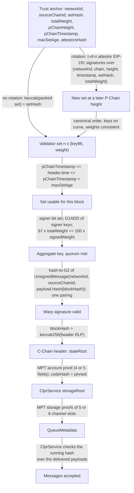
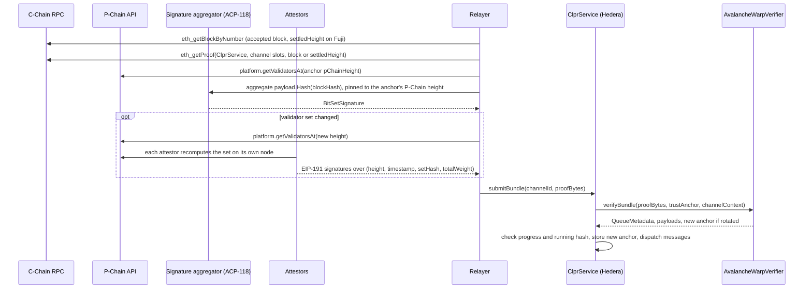

# AvalancheWarpVerifier: Avalanche C-Chain and Flare → Hiero

`AvalancheWarpVerifier` is an `IClprVerifier` that runs on Hedera's EVM and verifies CLPR bundles from the Avalanche
C-Chain and from chains that run the same Warp stack, including Flare (direction `<chain> → Hiero`). It accepts a
C-Chain block when an Avalanche Warp `BitSetSignature` from validators holding at least 67% of the tracked Primary
Network stake signs the block hash. It then proves the ClprService queue storage against that header's state root
with the shared `ClprEvmBundleVerifier` MPT code. The Primary Network validator set cannot be proven from either
chain, so **changes to that set are trusted to a t-of-n group of attestors** chosen at configuration.

## At a glance

| Item | Value |
|---|---|
| Chains covered | Avalanche C-Chain mainnet (`eip155:43114`), Fuji (`eip155:43113`), Flare mainnet (`eip155:14`), Coston2 (`eip155:114`); same contract by configuration: Avalanche L1s on subnet-evm. Per-chain pages: [`docs/chains/`](../../../../docs/chains/README.md) |
| Finality source | Snowman acceptance, attested by a Warp BLS aggregate of at least 67% of the validator stake over `payload.Hash(blockHash)` |
| Trust (one line) | Fewer than 1/3 of the tracked stake malicious; **the validator set and every change to it are trusted to t-of-n attestors** (bootstrap set trusted) |
| Typical bundle | Flare mainnet, live: 2,307,686 gas (`eth_estimateGas`), 38,660 B calldata. Fuji, live: 1,738,297 gas, 23,172 B |
| Bundle with rotation | Flare mainnet, live: 2,548,571 gas, 38,884 B. Fuji, live: 1,861,747 gas, 23,396 B |
| Contract size | `AvalancheWarpVerifier` runtime 19,473 B (5,103 B under EIP-170) |
| Status | Live-verified on Fuji (2026-10-01), Coston2 and Flare mainnet (2026-10-01, with a self-run signature aggregator). Avalanche mainnet: set size and signer count measured live, no full bundle |

## How it works



1. `AvalancheWarpVerifier.sol:_decodeAnchor` reads the 220-byte anchor. Without a rotation, `verifyBundle` requires
   `keccak256(validatorSet)` to equal `setHash`.
2. With a rotation, `AvalancheWarpVerifier.sol:_applyRotation` checks that the new P-Chain height is higher and the
   timestamp not lower, `ClprAvalancheWarp.sol:validate` checks the set (canonical order, curve points, non-zero
   weights, keyed weight ≤ `totalWeight`), and `_requireAttestations` checks `threshold` distinct attestor
   signatures, in ascending signer order, against the policy hash from `_attestorPolicyHash`.
3. `AvalancheWarpVerifier.sol:_verifyWarpBlock` hashes the header, checks the set's time window,
   `ClprAvalancheWarp.sol:aggregateSigners` decodes the minimal big-endian bit set and adds the signer keys with
   `BLS12_G1ADD`, `ClprAvalancheWarp.sol:requireQuorum` checks the 67% weight, and `ClprBeaconBls.sol:verifyMessage`
   hashes `ClprAvalancheWarp.sol:blockHashMessage` to G2 and runs one pairing.
4. `AvalancheWarpVerifier.sol:_serviceStorageRoot` checks the account proof against the state root (coreth's 5-field
   account with `isMultiCoin` is accepted) and the pinned code hash. `ClprEvmBundleVerifier.sol:_verifyChannelStorage`
   proves the channel slots and `_decodeBundleContent` returns the payloads.
5. After a rotation, `verifyBundle` returns the new anchor and its id (the new P-Chain height).

### Protocol rules the verifier mirrors

Checked against `ava-labs/avalanchego` master (commit `3b99241`, 2026-10-01; coreth and subnet-evm are grafted into
it), the v1.15.0 nodes that serve Fuji, and go-flare v1.14.x.

| Rule | Source | Verifier |
|---|---|---|
| `UnsignedMessage = u16(0) ‖ u32(networkID) ‖ sourceChainID ‖ u32(len) ‖ payload` (linear codec v0) | `vms/platformvm/warp/unsigned_message.go`, `codec.go` | `blockHashMessage` |
| Block-hash payload `payload.Hash = u16(0) ‖ u32(typeID 0) ‖ hash32` | `warp/payload/{codec,hash}.go` | same |
| Validators sign `payload.Hash(h)` only if `h` is an accepted block's EVM hash; Snowman acceptance is final | `graft/coreth/warp/verifier_backend.go`, `plugin/evm/vm.go#GetAcceptedBlock` | `blockHash = keccak256(header RLP)` |
| Canonical set: keyless validators dropped (their weight still counts in `TotalWeight`), equal keys merged with summed weights, sorted by the 96-byte uncompressed key | `snow/validators/warp.go#FlattenValidatorSet` | `validate` rejects anything else |
| `Signers` is a minimal big-endian integer whose bit i is canonical validator i, with no index ≥ n | `warp/signature.go`, `utils/set/bits.go` | `aggregateSigners` |
| Quorum `67 x TotalWeight ≤ 100 x signedWeight` | `warp/signature.go#VerifyWeight`, coreth `WarpDefaultQuorumNumerator = 67` | `requireQuorum` |
| BLS: G1 keys, G2 signatures, DST `BLS_SIG_BLS12381G2_XMD:SHA-256_SSWU_RO_POP_`, signed message = raw UnsignedMessage bytes | `utils/crypto/bls` | `ClprBeaconBls.verifyMessage` |
| Coreth account `[nonce, balance, root, codeHash, isMultiCoin]` | `customtypes/state_account_ext.go`, live `eth_getProof` | `_serviceStorageRoot` accepts 4 or 5 fields |
| ACP-194 (SAE, live on Fuji): a header's `stateRoot` is the post-execution root of the last settled block (`settledHeight`), not of the block itself | `vms/saevm/sae/blocks.go`, `blocks/export.go#SettledStateRoot` | Verifier unchanged; the relayer calls `eth_getProof` at `settledHeight` |

## Bundle lifecycle



## Trust model

Trusted:
- **Fewer than 1/3 of any tracked set's stake is malicious.** This is Avalanche's own Warp assumption. Validators
  who left the set keep their keys; `maxSetAge` bounds how long their signatures count.
- **The P-Chain validator set, at bootstrap and at every change, is trusted to the attestors.** Neither chain offers
  a proof of the Primary Network set: the P-Chain has no state commitment and no finality signatures (its blocks
  carry only the proposer's staking-key signature), the P-Chain's ACP-118 handler signs only ACP-77 L1-validator
  messages, and C-Chain state does not contain the set. So:
  - `verifyConfig` takes the set at a P-Chain height as a trusted input (weak subjectivity).
  - A rotation is accepted when `threshold` distinct attestors from the anchor's policy (t-of-n, fixed at
    configuration) sign the new set. Each attestor is expected to recompute the set from
    `platform.getValidatorsAt` on its own node. `threshold = 0` disables rotation; a re-config is then needed.
  - **`threshold` colluding attestors can install any set**, including one whose keys they hold, and then sign
    any block. This is the weakest point of the family. The live fixtures use 2-of-3 test attestors.
- **BLS keys are valid subgroup points.** The P-Chain enforces a proof of possession at registration. `G1ADD`
  checks that every signer key is on the curve, and the pairing precompile subgroup-checks the aggregate.
- **The ClprService code hash** pinned at configuration.

What the chain still checks on an attested set: canonical order (which also rules out duplicates), non-zero weights,
keyed weight ≤ `totalWeight`, every key on the curve, strictly increasing P-Chain height and non-decreasing
timestamp (no replay of an old rotation), and that the bundle is signed by at least 67% of the new set.

Considered and rejected: a rule that the old set must also sign a rotation. One aggregate signature binds only the
sum of the signers' keys; without a per-key proof of possession an attestor could add cancelling rogue keys, and the
weights stay unauthenticated in any case.

Not trusted: the relayer and the signature aggregator (every signature is checked on-chain).

To forge a bundle an attacker must control 67% of a tracked set's stake within its `maxSetAge` window, or
`threshold` attestors, or the bootstrap input.

## Proof format

Trust anchor, 220 bytes, flat:

| Field | Type | Meaning |
|---|---|---|
| `networkId` | `uint32` | Avalanche network id (1 mainnet, 5 Fuji, 14 Flare, 114 Coston2) |
| `sourceChainId` | `bytes32` | Blockchain id of the C-Chain; part of the signed message |
| `channelId` | `bytes32` | Binds the storage proof to one channel |
| `codeHash` | `bytes32` | Pinned ClprService code hash |
| `setHash` | `bytes32` | keccak256 of the packed set `n x (x48 ‖ y48 ‖ weight8)` in canonical order |
| `totalWeight` | `uint256` | Total stake, including keyless validators; uint256 because Flare's total exceeds uint64 |
| `pChainHeight` | `uint64` | P-Chain height of the set; also the trust anchor id |
| `pChainTimestamp` | `uint64` | Timestamp of that height |
| `maxSetAge` | `uint64` | Seconds after `pChainTimestamp` during which the set may sign |
| `attestorsHash` | `bytes32` | Hash of the attestor policy (threshold and addresses) |

Bundle `proof_bytes`, RLP, 7 items (9 with a manifest update):

| # | Field | Type | Meaning |
|---|---|---|---|
| 0 | `header` | bytes | RLP C-Chain header; `blockHash = keccak256(header)` |
| 1 | `warpSignature` | `[signers, signature]` | Bit set and 256-byte uncompressed G2 signature (the relayer decompresses the 96-byte form) |
| 2 | `validatorSet` | bytes | Packed set the signature is checked against (104 bytes per key) |
| 3 | `rotation` | `0x80` or `[pChainHeight, pChainTimestamp, totalWeight, threshold, attestors[], sigs[]]` | Optional attested set change |
| 4 | `accountProof` | list | MPT account proof |
| 5 | `storageProof` | 5 or 6 x `[slot, proofNodes]` | Channel slots |
| 6 | `bundleContent` | bytes | Protobuf `ClprBundleContent` |
| 7, 8 | `manifestStorageProof`, `manifestPreimage` | optional | Endpoint-manifest update |

Configuration (`verifyConfig`, RLP): `[ledgerConfiguration, evmChainId, networkId, sourceChainId, pChainHeight,
pChainTimestamp, validatorSet, totalWeight, maxSetAge, attestorThreshold, attestors[], codeHash]`. For the four known
C-Chains it binds the CAIP-2 id `eip155:<evmChainId>` to the (networkId, blockchain id) pair that the Warp message
commits to; for other chains it checks only that the config is self-consistent.

Per-deployment parameters: the bootstrap set and height, `maxSetAge` (keep it at or below the network's minimum
stake duration), the attestor addresses and threshold, and the code hash. Values per chain are on the chain pages.

## Validator-set / committee rotation

- The Primary Network set changes whenever stake changes. On Fuji the fixture rotation went from 70 keys at
  P-Chain height 298,945 to 71 keys at 298,993. On Flare the set differs at almost every P-Chain height, because
  delegations change weights (heights 2,105,647 and 2,105,648 differ only in weights).
- A set change does not force a rotation: an anchor's set stays usable for `maxSetAge` as long as its signers still
  hold 67% of the anchor's weights. The relayer must pin the aggregator to the anchor's P-Chain height, and rotate
  when the old set can no longer reach 67% or the window is about to end.
- Rotation is one step per bundle, to any newer height, so catching up is a single step.
- Cost (live, rotation bundle minus plain bundle): Fuji +123,450 gas and +224 B; Coston2 +55,080 gas and +224 B;
  Flare mainnet +240,885 gas and +224 B. The set itself is sent with every bundle either way.

## Gas and calldata

Hedera limits: 15M gas and 128 KB calldata. Live figures are anvil `eth_estimateGas` (including the 21k base and
calldata) from the replay specs, with Foundry execution gas alongside; synthetic figures are Foundry execution gas
and execution plus 21k plus calldata gas (`AvalancheWarpGas.t.sol`). Live fixtures were captured on 2026-10-01.

| Case | Execution gas | Total gas | Calldata |
|---|---|---|---|
| Fuji live (71 keys, 12 signers, 67.03%), no rotation | 1,360,947 | 1,738,297 | 23,172 B |
| Fuji live, rotation P-Chain 298,945 (70 keys) → 298,993 (71 keys) | 1,480,909 | 1,861,747 | 23,396 B |
| Coston2 live (8 keys, 5 signers, 67.05%), no rotation | 1,278,368 | 1,541,142 | 15,780 B |
| Coston2 live, rotation 13,559 → 13,603 | 1,329,924 | 1,596,222 | 16,004 B |
| Flare mainnet live (180 keys, 91 signers, 67.08%), no rotation | 1,681,328 | 2,307,686 | 38,660 B |
| Flare mainnet live, rotation 2,105,647 → 2,105,648 | 1,918,677 | 2,548,571 | 38,884 B |
| Synthetic Fuji scale (71 keys, 12 signers), 1-leaf MPT | 622,895 | 780,123 | 9,412 B |
| Synthetic Avalanche mainnet scale (588 keys, 170 signers) | 1,054,882 | 2,040,114 | 63,236 B |
| Synthetic mainnet worst case (588 equal keys, 394 signers) | 1,147,436 | 2,130,064 | 63,236 B |
| Synthetic mainnet rotation (588 → 588 keys, 2-of-3 attestors) | 1,735,512 | 2,723,824 | 63,460 B |

- The mainnet-scale inputs were measured on 2026-10-01: 588 unique Primary Network keys, and 170 signers returned
  by the public aggregator for a real C-Chain block.
- The packed set costs 104 bytes per key and rides in every bundle: about 7.4 KB on Fuji, 18.7 KB on Flare and
  61 KB on Avalanche mainnet.
- The live probe accounts (WAVAX, WC2FLR, WFLR) have large storage tries; on Fuji the MPT part costs about 0.6M gas
  and 12 KB. A ClprService trie is smaller.

## Limits and known gaps

- **The validator set is trusted input** (attestors and bootstrap). This is the main limit.
- **No ClprService on these chains yet.** The live storage proofs are exclusion proofs of the channel slots in
  WAVAX (Fuji), WC2FLR (Coston2) and WFLR (Flare).
- **Avalanche mainnet calldata.** The full set rides along with every bundle: fine at 588 keys (61 KB), but above
  about 1,100 keys it would pass 128 KB with the proofs. A Merkle-committed set with per-signer proofs would then be
  needed (about 170 x 456 B, about 77 KB today, so not smaller yet).
- **Signature aggregation.** Fuji uses Ava Labs' hosted aggregator. No public aggregator serves Flare, so the relayer
  runs Ava Labs' `signature-aggregator` itself (`tools/flare-signature-aggregator/`). On Flare mainnet it needs a
  weight proxy, because avalanchego v1.15 decodes P-Chain weights as uint64 and Flare's total stake overflows it.
- **ACP-194 (SAE) on Fuji.** The proven state lags the signed block by a few blocks. Public RPCs keep only a few
  recent states, so the relayer must call `eth_getProof` right after choosing the block. Public Flare RPCs also serve
  `eth_getProof` only for recent state.
- **Firewood.** If a chain's state moves to a non-MPT commitment, the storage proof format changes. Live Fuji proofs
  are still MPT.

## Upgrades and forks

- Avalanche and Flare upgrade by coordinated network upgrades (named activations in avalanchego and go-flare). An
  upgrade that changes the Warp message codec, the signature scheme, the header RLP, the account encoding or the state
  commitment (Firewood) breaks this verifier.
- Under the fork-aware verifier ADR
  ([`ADR/2026-10-01-fork-aware-verifiers.md`](https://github.com/shayansal/clpr-spec/blob/adr/fork-handling/ADR/2026-10-01-fork-aware-verifiers.md),
  draft PR [LFDT-CLPR/clpr-spec#1](https://github.com/LFDT-CLPR/clpr-spec/pull/1)): new header fields or ACP-194-style
  state-root semantics are Class B; a new state commitment or signature scheme is Class C. Validator-set changes are
  not consensus-proven here, so they stay with the attestors rather than becoming Class A.
- The verifier is not fork-aware yet.

## Running it

```sh
# Unit, compliance, live-vector (Fuji, Coston2, Flare) and gas tests
forge test --match-contract '(AvalancheWarp|FlareWarp)' -vv

# Anvil replays
npm run test:e2e:avalanche-live   # Fuji
npm run test:e2e:flare-live       # Coston2 and Flare mainnet

# Refresh fixtures
npm run avalanche-live:refresh    # Fuji, via the hosted aggregator
tools/flare-signature-aggregator/run.sh coston2   # or: flare (starts the weight proxy too)
npm run flare-live:refresh        # Coston2 and Flare, via the local aggregator
```

Test counts on this branch: 46 unit, 28 compliance, 15 live-vector and 4 gas tests (Foundry), 14 Fuji and 28 Flare
anvil tests. `MockAvalancheVerifier` is unchanged and still backs the Docker e2e harness (`CLPR_BACKEND=avalanche`).

## Files

| File | Purpose |
|---|---|
| `src/verifiers/evm/avalanche/AvalancheWarpVerifier.sol` | Trust anchor, `verifyBundle`, `verifyConfig`, attested rotation, chain binding |
| `src/libraries/proof/avalanche/ClprAvalancheWarp.sol` | Warp `UnsignedMessage` for a block hash, canonical set checks, signer aggregation, quorum |
| `src/libraries/proof/beacon/ClprBeaconBls.sol` | Gains `hashToG2Message` and `verifyMessage` for raw messages; existing functions unchanged |
| `test/verifiers/evm/avalanche/AvalancheWarpVerifier.t.sol` | Synthetic unit tests, including negative cases |
| `test/verifiers/evm/avalanche/AvalancheWarpFixtures.sol` | Synthetic sets, headers and signatures |
| `test/verifiers/evm/avalanche/AvalancheWarpGas.t.sol` | Fuji-scale and mainnet-scale gas |
| `test/verifiers/evm/avalanche/AvalancheWarpLive.t.sol` | Live Fuji vectors |
| `test/verifiers/evm/avalanche/FlareWarpLive.t.sol` | Live Coston2 and Flare vectors |
| `test/verifiers/compliance/AvalancheWarpComplianceTest.t.sol` | `IClprVerifier` compliance suite |
| `test/e2e/fixtures/avalanche-live/{capture,vectors}.json` | Fuji capture and encoded vectors |
| `test/e2e/fixtures/flare-live/{coston2,flare}/{capture,vectors}.json` | Coston2 and Flare captures and vectors |
| `test/e2e/relay/buildAvalancheLiveProof.ts` | Capture and bundle builder for all four networks |
| `test/e2e/tests/verifiers/avalancheLiveSuite.ts` | Shared anvil replay suite |
| `test/e2e/tests/verifiers/avalanche-live-fuji.spec.ts`, `flare-live.spec.ts` | Anvil replay entry points |
| `tools/flare-signature-aggregator/run.sh`, `weight-proxy.mjs` | Runs Ava Labs' signature aggregator against Flare |

## References

- avalanchego (`vms/platformvm/warp`, `snow/validators/warp.go`, `graft/coreth`, `vms/saevm`): https://github.com/ava-labs/avalanchego (commit `3b99241`)
- ICM services, `signature-aggregator`: https://github.com/ava-labs/icm-services (commit `bd47aec`)
- ACP-118 (Warp signature request handler): https://github.com/avalanche-foundation/ACPs/tree/main/ACPs/118-warp-signature-request
- ACP-77 (L1 validators): https://github.com/avalanche-foundation/ACPs/tree/main/ACPs/77-reinventing-subnets
- ACP-194 (Continuous Execution; `saevm` in avalanchego): https://github.com/avalanche-foundation/ACPs/tree/main/ACPs/194-continuous-execution
- go-flare: https://github.com/flare-foundation/go-flare
- EIP-2537 BLS12-381 precompiles: https://eips.ethereum.org/EIPS/eip-2537
- Fork-aware verifier ADR: https://github.com/shayansal/clpr-spec/blob/adr/fork-handling/ADR/2026-10-01-fork-aware-verifiers.md
