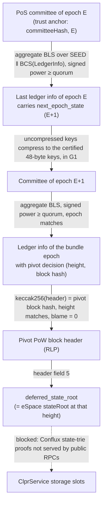
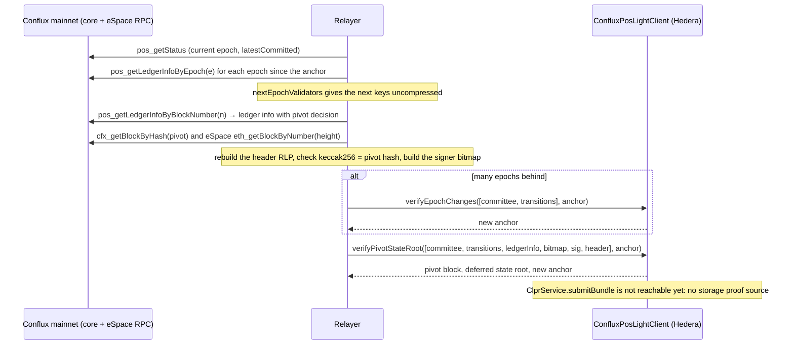

# BLS committee chains → Hiero (Conflux, Sonic, Flow)

This family covers three chains (ranks 51–100 by TVL) whose finality was expected to come from a
BLS12-381 committee certificate. Only one of them has a provable path today.
`ConfluxPosLightClient` verifies the Conflux PoS chain (`Conflux → Hiero`). It checks the PoS
committee's aggregated BLS signature on a ledger info and follows committee rotations from epoch
to epoch. It then authenticates the PoW pivot block that the ledger info finalizes and returns that
block's deferred state root, which is the eSpace (EVM) state root. It does not prove ClprService
storage: Conflux storage proofs need the Conflux state trie, and no public RPC serves them.
Sonic has no BLS finality source on mainnet: its certification chain was removed from the client
before it signed anything. Flow quorum certificates could be checked, but Flow EVM storage cannot be
proven from public data. Neither has code on this branch. Both blockers are described below.

## At a glance

| Item | Conflux (eSpace) | Sonic | Flow (Flow EVM) |
|---|---|---|---|
| Chain id / CAIP-2 | eSpace 1030 / `eip155:1030`; core space 1029 | 146 / `eip155:146` | Flow EVM 747 / `eip155:747` |
| Finality source | PoS committee ledger info (BLS12-381 min-pk aggregate, ≥ `quorum_voting_power`) finalizing a PoW pivot block | None usable (see Limits) | HotStuff quorum certificates (BLS min-sig) + execution seals |
| Trust (one line) | > 2/3 of PoS voting power of each epoch's committee; deploy-time committee checkpoint | — | — |
| Typical proof gas / calldata | 446,398 gas / 4,356 B (finality + pivot header, no storage) | — | — |
| Rotation gas / calldata | 1,000,171 gas / 10,180 B per PoS epoch (25 validators) | — | — |
| Contract size | `ConfluxPosLightClient` 10,200 B runtime | — | — |
| Status | Finality half live-verified on Conflux mainnet (2026-10-01); storage half blocked | Blocked (no finality certificate) | Blocked (no storage proof source) |

Gas figures are anvil `eth_estimateGas` for a top-level call (21k base + calldata + execution),
from `npm run test:e2e:conflux-live` on `test/e2e/fixtures/conflux-live/vectors.json`.

## How it works



1. Committee check. The relayer passes the committee as `[keys, weights, quorum]`. Its hash must
   equal the anchor's `committeeHash` (`ConfluxPosLightClient.sol:committeeHash`).
2. Rotations. Each transition is the last ledger info of epoch `e`, signed by `e`'s committee
   (`ConfluxPosLightClient.sol:_applyTransitions` → `_verifyLedgerInfo`). Its `next_epoch_state`
   is decoded from BCS (`ClprConfluxPos.sol:decodeLedgerInfo`). The relayer passes the next keys
   uncompressed. Each one must lie in G1 (`ClprBlsCommittee.sol:requireSubgroup`) and compress to
   the certified key (`ClprBls12381.sol:compressG1`, unchanged). The weights and quorum come from
   the certified epoch state.
3. Signature. The signers come from a bitmap over the committee in BTreeMap (address) order. Their
   keys are summed and their voting power is compared with `quorum_voting_power`
   (`ClprBlsCommittee.sol:aggregateByBitmap`). The message `SEED ‖ BCS(LedgerInfo)` is hashed to
   G2 with DST `BLS_SIG_BLS12381G2_XMD:SHA-256_SSWU_RO_NUL_` (`ClprBlsCommittee.sol:hashToG2`). The
   pairing check is `e(aggPk, H(m)) = e(G1, sig)` (`ClprBlsCommittee.sol:verifyMinPk`).
4. Pivot. The ledger info must carry a pivot decision with a height above the anchor's. The
   keccak256 of the supplied header must equal the pivot block hash. Header field 1 must be the
   height and field 8 (blame) must be 0. Field 5 is returned
   (`ConfluxPosLightClient.sol:_pivotStateRoot`).
5. Output: `(epoch, round, pivotHeight, pivotBlockHash, deferredStateRoot)` and the new anchor
   (`ConfluxPosLightClient.sol:verifyPivotStateRoot`).

`SEED` is `SHA3-256("DIEM::LedgerInfo")` =
`0xcd510d1ab583c33b54fa949014601df0664857c18c4cfb228c862dd869df1b62`. It is a constant, so the
contract needs no SHA3-256 code. With blame 0, `deferred_state_root` is
`keccak256(snapshot_root ‖ intermediate_delta_root ‖ delta_root)` for the state after epoch
`height − 5` (`DEFERRED_STATE_EPOCH_COUNT = 5`). The live fixture checks that it equals the
`stateRoot` that eSpace `eth_getBlockByNumber(height)` returns.

## Bundle lifecycle



## Trust model

- Trusted: more than 2/3 of the PoS voting power of each epoch's committee. A ledger info needs
  signed power ≥ `quorum_voting_power`, which conflux-rust sets to `total × 2 / 3 + 1`
  (`validator_verifier.rs`). On mainnet in the fixture that is 201 of 300, over 24–25 validators.
- Trusted: the bootstrap committee hash and epoch fixed at deployment (a weak-subjectivity
  checkpoint). Anyone can recompute it from `pos_getLedgerInfoByEpoch(E − 1)`.
- Trusted: Conflux's own rule that the PoS chain finalizes the PoW pivot chain up to the pivot
  decision.
- Not trusted: the relayer. Keys, weights and quorum must hash to the anchor or come from a
  certified epoch state. The header must hash to the signed pivot hash.
- Rogue keys: Conflux registers PoS keys with a proof of possession, so the verifier aggregates
  keys without extra checks.
- To forge a result, an attacker must control signatures worth ≥ `quorum_voting_power` in some
  epoch reachable from the anchor.
- This contract has no owner and no upgrade path. It holds no state; the caller stores the anchor.

## Proof format

`verifyPivotStateRoot(proof, trustAnchor)`: `proof` is an RLP list.

| Field | Type | Meaning |
|---|---|---|
| `committee` | list `[bytes keys, uint[] weights, uint quorum]` | Committee of the anchor epoch: `n × 128`-byte EIP-2537 G1 keys in address order, voting powers, quorum voting power |
| `transitions` | list of `[bytes ledgerInfo, bytes bitmap, bytes sig, bytes nextKeys]` | One per epoch change: the BCS ledger info carrying `next_epoch_state`, signer bitmap (bit `i` = byte `i/8`, LSB first), 256-byte EIP-2537 G2 aggregate signature, next keys uncompressed |
| `ledgerInfo` | bytes | BCS `LedgerInfo` of the target epoch with a pivot decision |
| `bitmap` | bytes | Signers of `ledgerInfo` |
| `sig` | bytes (256) | Aggregate signature, EIP-2537 G2 encoding |
| `pivotHeader` | bytes | Conflux block header RLP (`primitives/src/block_header.rs`, `stream_rlp`) |

`verifyEpochChanges(proof, trustAnchor)` takes `[committee, transitions]` with at least one
transition.

Trust anchor (96 bytes): `abi.encode(bytes32 committeeHash, uint64 epoch, uint64 pivotHeight)`.
`committeeHash = keccak256(epoch(8) ‖ quorum(8) ‖ keys ‖ weight₀(8) ‖ … )`, big-endian integers.

Deployment parameters: `bootstrapCommitteeHash`, `bootstrapEpoch`. See
[docs/chains/conflux.md](../../../../docs/chains/conflux.md) for the mainnet values.

## Validator-set / committee rotation

- The committee changes every PoS epoch. In the fixture, epoch 46113 took 1.03 h (120 rounds) and
  the committee went from 24 to 25 validators.
- The last ledger info of each epoch carries the next `EpochState`. The relayer forwards it with the
  next keys uncompressed (`nextEpochValidators` in the RPC response).
- Cost per epoch with 25 validators: 1,000,171 gas and 10,180 B calldata (live, rotation only).
- Catch-up: each transition carries its own committee keys, so one transaction fits about 12
  epochs before calldata reaches 128 KB (estimate from the per-rotation size, not measured). The
  anchor must be advanced at least that often, about every 12 hours.

## Gas and calldata

Measured on 2026-10-01 against Conflux mainnet data (fixture `test/e2e/fixtures/conflux-live`,
epochs 46113 → 46114, pivot block 158,034,960). Anvil `eth_estimateGas` (Prague):

| Call | Gas | Calldata | Hedera limits |
|---|---|---|---|
| `verifyPivotStateRoot`, same epoch, 25 of 25 signers | 446,398 | 4,356 B | 15M gas / 128 KB: fits |
| `verifyPivotStateRoot` with one rotation (24 → 25 validators) | 1,316,424 | 11,076 B | fits |
| `verifyEpochChanges`, one rotation | 1,000,171 | 10,180 B | fits |

Foundry execution gas for the same inputs (no base or calldata cost): 381,410; 1,159,027; 853,722
(`test/verifiers/evm/blscommittees/ConfluxPosLightClient.t.sol`). A full CLPR bundle would add the
storage proof, which does not exist yet.

## Limits and known gaps

- Conflux storage (blocker). The eSpace state is in Conflux's own trie (snapshot, intermediate and
  delta roots), not an Ethereum MPT. Neither `eth_getProof` on eSpace nor a `cfx_` storage proof
  method is served by the public RPCs. A full bundle verifier needs (a) a Solidity verifier for
  Conflux state-trie proofs and (b) an own conflux-rust node that can produce them. Until then this
  contract stops at the state root and does not implement the CLPR verifier interface.
- Conflux pivot blocks with blame ≠ 0 are rejected. Their `deferred_state_root` field commits to a
  blame vector, not to the block's own state root. The relayer picks another ledger info.
- Sonic (blocker). Sonic's certification chain (`scc`: committees with BLS certificates) was a
  prototype whose certificates were never signed. It was removed in commit `2f9a629b` ("Remove
  deprecated SCC component", #1057). Mainnet runs `Sonic/v2.2.2` and answers
  `sonic_getBlockCertificates` with "method does not exist". `eth_getProof` works and returns
  Ethereum MPT proofs, so storage is provable. The only finality evidence left is the validators'
  secp256k1 signatures on Lachesis events, which this branch did not research. No Sonic code is on
  this branch.
- Flow (blocker). Flow EVM blocks report `stateRoot = 0x00…00`, and the Flow EVM gateway answers
  `eth_getProof` with "endpoint is not supported". EVM storage lives in Flow registers as atree
  slabs under the execution state trie, and no public access-node API returns register proofs
  against a sealed state commitment. A quorum-certificate checker alone would prove nothing about
  ClprService storage, so none is committed. It would also need KMAC128-based hash-to-G1 (Flow's
  `NewExpandMsgXOFKMAC128`, onflow/crypto `bls.go`) and G2 keys passed uncompressed.
- The relayer must reach each epoch's last ledger info. `pos_getLedgerInfoByEpoch` and
  `pos_getEpochState` are marked "debug rpc" in conflux-rust (`rpc-cfx-api/src/pos.rs`). They
  answer on the public mainnet RPC today, but that is not guaranteed.

## Upgrades and forks

- A conflux-rust change to the BCS layout of `LedgerInfo`, `BlockInfo` or `EpochState`, to the
  signing seed, the BLS DST or the quorum rule needs a new deployment.
- A change to the PoW header RLP (new optional fields after `custom`) is tolerated: the verifier
  reads fields 1, 5 and 8 and needs at least 14 items. A change to the meaning of
  `deferred_state_root` or of blame needs a new deployment.
- The fork-aware verifier ADR (`ADR/2026-10-01-fork-aware-verifiers.md`, draft PR
  LFDT-CLPR/clpr-spec#1) would let a channel move to a new deployment at a stated pivot height.
  Until then, migration means a new channel.

## Running it

```sh
forge build
forge test --match-path test/verifiers/evm/blscommittees/ConfluxPosLightClient.t.sol -vv   # live data + negatives
forge test --match-path test/libraries/proof/blscommittee/ClprBlsCommittee.t.sol           # BLS helpers
npm run test:e2e:conflux-live      # anvil replay of the live fixture, prints gas/calldata
npm run conflux-live:refresh       # re-capture from Conflux mainnet and rebuild vectors.json
npx tsx test/e2e/relay/buildConfluxLiveProof.ts --vectors   # rebuild vectors.json from capture.json only
```

The anvil spec uses port `CLPR_ANVIL_PORT_A` (default 8671).

## Files

| File | Purpose |
|---|---|
| `src/verifiers/evm/blscommittees/ConfluxPosLightClient.sol` | Conflux PoS ledger info, rotation and pivot-header verification |
| `src/libraries/proof/conflux/ClprConfluxPos.sol` | BCS decoders for `LedgerInfo` and `EpochState` |
| `src/libraries/proof/blscommittee/ClprBlsCommittee.sol` | Hash-to-G1/G2 with any DST, aggregation, subgroup and pairing checks (EIP-2537) |
| `test/verifiers/evm/blscommittees/ConfluxPosLightClient.t.sol` | Live-fixture tests and negative cases |
| `test/libraries/proof/blscommittee/ClprBlsCommittee.t.sol` | RFC 9380 vectors, sign/verify, aggregation |
| `test/e2e/relay/buildConfluxLiveProof.ts` | Capture from public RPCs, BCS/RLP encoders, offline BLS and header cross-checks |
| `test/e2e/fixtures/conflux-live/capture.json` | Raw RPC responses (Conflux mainnet, 2026-10-01) |
| `test/e2e/fixtures/conflux-live/vectors.json` | Committees, encoded proofs and expected results |
| `test/e2e/tests/verifiers/conflux-live.spec.ts` | Anvil replay with gas and calldata measurement |
| `test/e2e/tests/verifiers/blscommittees/anvil.ts` | Anvil harness |

## References

- conflux-rust: `crates/pos/types/types/src/{ledger_info.rs,block_info.rs,epoch_state.rs,validator_verifier.rs}`,
  `crates/pos/crypto/crypto/src/hash.rs`, `crates/primitives/src/{block_header.rs,state_root.rs}`,
  `crates/parameters/src/lib.rs`, `crates/rpc/rpc-cfx-api/src/pos.rs`,
  `crates/rpc/rpc-cfx-types/src/pos/ledger_info.rs` — https://github.com/Conflux-Chain/conflux-rust
- Conflux public RPCs: https://main.confluxrpc.com, https://evm.confluxrpc.com
- RFC 9380, Hashing to Elliptic Curves — https://www.rfc-editor.org/rfc/rfc9380
- EIP-2537, BLS12-381 precompiles — https://eips.ethereum.org/EIPS/eip-2537
- Sonic client, SCC removal commit `2f9a629b` — https://github.com/0xsoniclabs/sonic
- Flow: onflow/crypto `bls.go`; flow-go `consensus/hotstuff/verification/common.go`; flow-evm-gateway —
  https://github.com/onflow/crypto, https://github.com/onflow/flow-go, https://github.com/onflow/flow-evm-gateway
