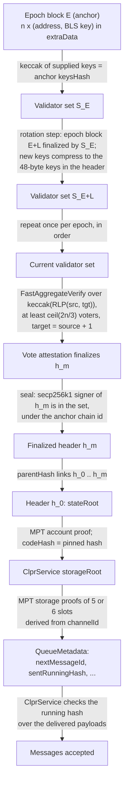
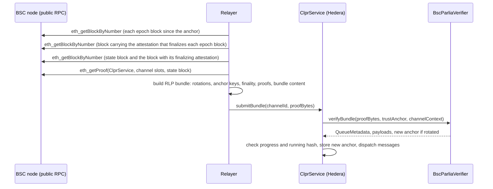

# BscParliaVerifier: BNB Smart Chain (Parlia) → Hiero

`BscParliaVerifier` is an `IClprVerifier` that runs on Hedera's EVM and verifies CLPR bundles from BNB Smart Chain
and other Parlia chains (direction `BSC → Hiero`). It accepts a ClprService state root only from a block that a
BEP-126 fast-finality vote attestation has finalized: an aggregate BLS12-381 signature from at least 2/3 of the
active validator set. It follows the validator set epoch by epoch from the BLS keys that each epoch block publishes.
It then proves the ClprService queue storage against that state root with the shared Merkle-Patricia code in
`ClprEvmBundleVerifier`.

## At a glance

| Item | Value |
|---|---|
| Chains covered | BNB Smart Chain mainnet (`eip155:56`), BSC testnet Chapel (`eip155:97`); same contract, other config: Core (`eip155:1116`), Anubis (`eip155:6714`), BOT Chain (`eip155:677`). Per-chain pages: [`docs/chains/`](../../../../docs/chains/README.md) |
| Finality source | BEP-126 fast finality: a vote attestation with `target = source + 1` finalizes the source block |
| Trust (one line) | Fewer than 1/3 of each validator set is malicious, plus a correct bootstrap epoch block (weak subjectivity) |
| Typical bundle | Mainnet, live, no rotation: 1,953,408 gas (`eth_estimateGas`), 23,684 B calldata |
| Bundle with rotation | Mainnet, live, 1 rotation: 2,439,616 gas, 29,060 B calldata; each further rotation about 0.41-0.52M gas and 5.2 KB |
| Contract size | `BscParliaVerifier` runtime 22,127 B (2,449 B under EIP-170); deploy 4,817,405 gas |
| Status | Live-verified on BSC mainnet and Chapel, fixtures captured 2026-10-01. Core, Anubis and BOT Chain: headers and attestations checked, no full bundle run |

## How it works



1. `BscParliaVerifier.sol:_decodeAnchor` reads the 162-byte trust anchor. `ClprParlia.sol:decodeValidatorEntries`
   hashes the supplied anchor keys; `verifyBundle` requires the hash to equal `keysHash` and the count to match.
2. For each rotation step, `BscParliaVerifier.sol:_rotate` calls `_verifyFinalizedChain` to check that the next epoch
   block (exactly `epochBlock + epochLength`) is finalized by the outgoing set. `ClprParlia.sol:parseEpoch` reads the
   new set from `extraData` and `ClprParlia.sol:bindEpochKeys` checks that every supplied uncompressed key compresses
   to the 48-byte key in the header.
3. `BscParliaVerifier.sol:_verifyFinality` checks the state header chain. `ClprParlia.sol:decodeHeaderChain` checks
   parent-hash links, `_verifyFinalizedChain` checks the tenure window, `ClprParlia.sol:verifyFinalizing` checks
   `target = source + 1` and that the source is `h_m`, and `ClprParlia.sol:verifyVotes` checks the quorum and the
   aggregate BLS signature through `ClprBeaconBls` (EIP-2537 precompiles).
4. `ClprParlia.sol:requireSealedBy` recovers the secp256k1 seal of `h_m` with `ClprParlia.sol:sealSigner` under the
   anchor's chain id and requires the signer to be in the set.
5. `ClprEvmBundleVerifier.sol:_verifyServiceStorageRoot` checks the account proof against `h_0.stateRoot` and the
   pinned code hash. `ClprEvmBundleVerifier.sol:_verifyChannelStorage` proves the channel slots and builds
   `QueueMetadata`. `ClprEvmBundleVerifier.sol:_decodeBundleContent` returns the message payloads.
6. If at least one rotation ran, `verifyBundle` returns the new anchor and its id (the new epoch block number).

## Bundle lifecycle



Rotations travel in the same transaction as the state proof. A rotation-only bundle also counts as progress, so a
relayer that has fallen behind can send several rotation-only bundles before a normal one.

## Trust model

Trusted:
- **Fewer than 1/3 of each validator set is malicious.** This is BSC's own fast-finality assumption. Two-thirds of a
  set signing `(S, S+1)` is enough because honest validators vote only with their highest justified block as the
  source, so the verifier does not prove separately that `S` was justified. BSC's own `GetFinalizedHeader` uses the
  same rule.
- **The bootstrap epoch block and `activeFrom`** passed to `verifyConfig`. This is weak subjectivity, as in every
  light client: `verifyConfig` checks only that the inputs are consistent with each other.
- **Validator BLS keys are valid G1 subgroup points.** BSC StakeHub requires a proof of possession and every node
  rejects bad keys. On-chain, `BLS12_G1ADD` checks that each key is on the curve and the pairing precompile checks the
  aggregate; per-key subgroup checks (about 12k gas per key) are left out on purpose.
- **The ClprService code hash** pinned in the anchor at configuration time.

Not trusted:
- The relayer. It can only delay bundles; every header, signature and storage slot is checked.
- Any single validator, including the block proposer.

To forge a bundle an attacker must control at least 2/3 of one validator set (to sign a false attestation), or
supply a false bootstrap epoch block at configuration time.

## Proof format

Trust anchor, 162 bytes, flat:

| Field | Type | Meaning |
|---|---|---|
| `channelId` | `bytes32` | Binds the storage proof to one CLPR channel |
| `codeHash` | `bytes32` | Pinned ClprService runtime code hash |
| `validatorsHash` | `bytes32` | keccak256 of the epoch block's raw validator section (compressed keys); detects an epoch block that republishes the set |
| `keysHash` | `bytes32` | keccak256 of `n x (address20 ‖ uncompressedKey128)`; every bundle supplies this string, so no key is decompressed on-chain |
| `chainId` | `uint64` | EIP-155 chain id that header seals are bound to |
| `epochLength` | `uint64` | Blocks per epoch |
| `epochBlock` | `uint64` | Epoch block that published the current set; also the trust anchor id |
| `activeFrom` | `uint64` | First block produced and voted on by the current set |
| `turnLength` | `uint8` | Consecutive blocks per proposer turn (BEP-341) |
| `validatorCount` | `uint8` | Size of the current set |

Bundle `proof_bytes`, an RLP list of 6 items (8 with an endpoint-manifest update):

| # | Field | Type | Meaning |
|---|---|---|---|
| 0 | `rotations` | list of `[epochHeaderChain, attestation, newKeys]` | One step per epoch, in order; `newKeys` is empty when the set is unchanged |
| 1 | `validators` | bytes | Anchor set, `n x (address20 ‖ uncompressedKey128)`; must hash to `keysHash` |
| 2 | `finality` | `[headerChain, attestation]` | `headerChain = [h_0 .. h_m]`; `h_0` carries the state root, the attestation finalizes `h_m` |
| 3 | `accountProof` | list of bytes | MPT account proof of the ClprService |
| 4 | `storageProof` | 5 or 6 x `[slot, proofNodes]` | Channel slots derived from `channelId` |
| 5 | `bundleContent` | bytes | Protobuf `ClprBundleContent` |
| 6, 7 | `manifestStorageProof`, `manifestPreimage` | optional | Endpoint-manifest update |

`attestation = [voteAddressSet (uint64 bitset), signature (256-byte uncompressed G2), srcNum, srcHash, tgtNum, tgtHash]`.
The verifier rebuilds the signed message itself, so the 96-byte compressed signature in the carrying header is not
needed.

Configuration (`verifyConfig` payload, RLP):
`[ledgerConfiguration, chainId, epochLength, epochHeader, activeFrom, packedKeys, codeHash]`. It checks that the
CAIP-2 id equals `eip155:<chainId>`, that the epoch header lies on an epoch boundary, that
`E < activeFrom ≤ E + epochLength`, and that every key matches the header. An optional endpoint-manifest proof is
checked against a state finalized by the configured set.

Per-deployment parameters: `chainId`, `epochLength`, the bootstrap epoch header and its keys, `activeFrom`, and the
ClprService code hash. The values per chain are on the chain pages.

### Protocol rules the verifier mirrors

All rules were checked against `bnb-chain/bsc` `consensus/parlia` and `core/types` (commit `c5533ab`, Aug 2026) and
against live Chapel and mainnet headers.

| Rule | Source | Verifier |
|---|---|---|
| Seal = secp256k1 over `keccak(RLP([chainId, parentHash … time, extra[:-65], mixDigest, nonce] ++ Cancun fields if parentBeaconRoot ++ requestsHash if present))`; balHash and slotNumber are not sealed; v in {0,1} | `types.EncodeSigHeader` | `ClprParlia.sealSigner` |
| Epoch extra (post-Bohr): `vanity32 ‖ n ‖ n x (addr20 ‖ blsPubkey48) ‖ turnLength ‖ [attestation] ‖ seal65`, validators sorted ascending | `getValidatorBytesFromHeader`, `prepareValidators`, `parseTurnLength` | `ClprParlia.parseEpoch` (rejects unsorted sets) |
| Vote: `FastAggregateVerify(voters, keccak(RLP([srcNum, srcHash, tgtNum, tgtHash])))`, DST `BLS_SIG_BLS12381G2_XMD:SHA-256_SSWU_RO_POP_`, bitset over the ascending set, quorum `≥ ceil(2n/3)` | `verifyVoteAttestation`, `types.VoteData.Hash` | `ClprParlia.verifyVotes` |
| Finality: an attestation with `target = source + 1` finalizes the source | `Snapshot.updateAttestation`, `GetFinalizedHeader` | `ClprParlia.verifyFinalizing` |
| The set from epoch block E takes over after block `E + checkLen`, `checkLen = (n_old/2 + 1) x turnLength_old − 1`; votes on target T use the snapshot at T−1 | `Snapshot.apply`, `minerHistoryCheckLen` | `ClprParlia.checkLen`, tenure window |

## Validator-set rotation

- The set from epoch block `E` may finalize a source `S` only when `activeFrom ≤ S` and
  `S + 1 ≤ E + epochLength + checkLen(n, turnLength)`. Earlier sources revert with `StaleAttestation`; later targets
  revert with `AttestationBeyondTenure`, because the next set signs those blocks and the relayer must rotate first.
- A rotation step presents exactly `epochBlock + epochLength`, finalized by the outgoing set. The new `activeFrom` is
  `E_new + checkLen(n_old, turnLength_old) + 1`.
- Cadence: an epoch is 1000 blocks. In both live fixtures consecutive epoch blocks are 450 s apart (450 ms blocks),
  so one rotation is needed every 7.5 minutes of absence. On mainnet, BEP-131 candidate rotation changes the set in
  almost every epoch; the mainnet fixture's rotation is a real set change.
- Cost: on live mainnet one rotation adds 412,079 execution gas and 5,376 B calldata (1,986,422 − 1,574,343 gas;
  29,060 − 23,684 B). In the synthetic 21-validator test the average is 519,919 gas and 5,172 B per rotation at 16
  rotations, higher because of memory expansion.
- Catch-up limit: with the live mainnet sizes, calldata allows about 19 rotations in one transaction
  (23,684 B + 19 x 5,376 B = 125,828 B), which covers about 2.4 hours of absence. Longer gaps need several
  rotation-only bundles; each needs `eth_getProof` at a historical block, so a node with history is required.

## Gas and calldata

Hedera limits: 15M gas and 128 KB (131,072 B) calldata per transaction. Execution gas is from Foundry
(`BscParliaLive.t.sol`, `BscParliaGas.t.sol`); `eth_estimateGas` and calldata are from anvil (`bsc-live.spec.ts`)
and include the 21k base cost and calldata cost. Live fixtures were captured on 2026-10-01.

| Case | Execution gas | `eth_estimateGas` | Calldata |
|---|---|---|---|
| Chapel (9 validators, 9/9 votes), no rotation, live | 1,469,522 | 1,772,152 | 18,724 B |
| Chapel, 1 rotation, live | 1,835,993 | 2,177,714 | 21,732 B |
| Mainnet (21 validators, 20/21 votes), no rotation, live | 1,574,343 | 1,953,408 | 23,684 B |
| Mainnet, 1 rotation (set changed), live | 1,986,422 | 2,439,616 | 29,060 B |
| Synthetic, 21 validators, 0 rotations, 1-node MPT | 662,322 | – | 5,348 B |
| Synthetic, 21 validators, 4 rotations | 2,407,870 | – | 26,020 B |
| Synthetic, 21 validators, 16 rotations | 8,981,035 | – | 88,100 B |

- About 0.9M gas of each live bundle is the MPT storage proofs against WBNB's large storage trie (the live probe
  account, see below). A ClprService trie is far smaller; the synthetic 1-node case shows the floor.
- Deploy: 4,817,405 gas. Runtime 22,127 B, 2,449 B under EIP-170.

## Limits and known gaps

- **No ClprService on BSC yet.** The live fixtures prove the channel slots of WBNB (Chapel `0xae13…a7cd`, mainnet
  `0xbb4c…095c`), where they are absent, so the storage proofs are MPT exclusion proofs. Header, attestation, rotation
  and account-proof paths are fully live; message-bearing storage is covered by the synthetic tests.
- **Rotation is sequential**, one epoch per step, and the relayer must rotate before the current set's tenure ends
  (about 7.5 minutes after the next epoch block on BSC).
- **Post-Bohr and post-Maxwell layout only.** The verifier assumes a turnLength byte and a fixed `epochLength`. A
  change to the epoch length needs a new anchor.
- An epoch block whose validator has no BLS key (pre-Luban layout) blocks rotation. This does not happen today.
- At most 64 validators (the `uint64` vote bitset).
- Public RPCs serve `eth_getProof` only for recent blocks and are flaky. The refresh script uses a state block
  120 blocks behind the head and retries across endpoints. Production relayers need their own node or an archive
  RPC for catch-up.

## Upgrades and forks

- The chain id is sealed into every header, so the verifier cannot be replayed across chains.
- A hard fork that changes the header RLP (new optional fields), the seal hash, the epoch `extraData` layout, the
  vote message or the epoch length breaks verification. Under the fork-aware verifier ADR
  ([`ADR/2026-10-01-fork-aware-verifiers.md`](https://github.com/shayansal/clpr-spec/blob/adr/fork-handling/ADR/2026-10-01-fork-aware-verifiers.md),
  draft PR [LFDT-CLPR/clpr-spec#1](https://github.com/LFDT-CLPR/clpr-spec/pull/1)) a header-field or layout change is
  Class B (a LAYOUT fork profile) and a new vote scheme is Class C (channel succession).
- Validator-set changes are Class A: they are signed by the source consensus and followed by rotation, without a
  profile.
- This verifier is **not fork-aware yet**: it has no fork profile and no typed fork reverts. A hard fork that keeps
  the same validator keys and the same chain id is not told apart.

## Running it

```sh
# Unit, compliance, live-vector and gas tests (Foundry)
forge test --match-contract BscParlia -vv

# Live fixture replay on anvil (deploys the verifier, verifyConfig + verifyBundle on real data)
npm run test:e2e:bsc-live

# Refresh the live fixtures from public Chapel and mainnet RPCs, then rebuild the Foundry vectors
npm run bsc-live:refresh
npx tsx test/e2e/relay/buildBscLiveProof.ts --vectors
```

Test counts on this branch: 40 unit, 28 compliance, 6 live-vector and 1 gas test (Foundry), 18 anvil tests.

## Files

| File | Purpose |
|---|---|
| `src/verifiers/evm/bsc/BscParliaVerifier.sol` | Trust anchor, `verifyBundle`, `verifyConfig`, rotation and tenure checks |
| `src/libraries/proof/parlia/ClprParlia.sol` | Header decoding and hashing, chain-id seal, epoch parsing, vote attestations, `checkLen` |
| `src/verifiers/evm/common/ClprEvmBundleVerifier.sol` | Shared MPT account and channel-storage proofs, bundle content decoding |
| `test/verifiers/evm/bsc/BscParliaVerifier.t.sol` | Synthetic-chain unit tests, including negative cases |
| `test/verifiers/evm/bsc/BscParliaFixtures.sol` | Synthetic validator sets, headers and attestations |
| `test/verifiers/evm/bsc/BscParliaLive.t.sol` | Live Chapel and mainnet vectors |
| `test/verifiers/evm/bsc/BscParliaGas.t.sol` | Gas and calldata for 0, 1, 4 and 16 rotations |
| `test/verifiers/compliance/BscParliaComplianceTest.t.sol` | `IClprVerifier` compliance suite |
| `test/e2e/fixtures/bsc-live/{chapel,mainnet}.json` | Raw RPC captures (headers and `eth_getProof`) |
| `test/e2e/fixtures/bsc-live/{chapel,mainnet}-vectors.json` | Encoded config, anchors and bundles built from the captures |
| `test/e2e/relay/buildBscLiveProof.ts` | Capture (`--refresh`) and bundle builder (`--vectors`) |
| `test/e2e/tests/verifiers/bsc-live.spec.ts` | Anvil replay of the live fixtures |

## References

- BSC client, `consensus/parlia` and `core/types`: https://github.com/bnb-chain/bsc (commit `c5533ab`)
- BEP-126 fast finality: https://github.com/bnb-chain/BEPs/blob/master/BEPs/BEP126.md
- BEP-131 validator set expansion: https://github.com/bnb-chain/BEPs/blob/master/BEPs/BEP131.md
- BEP-341 consecutive block production: https://github.com/bnb-chain/BEPs/blob/master/BEPs/BEP-341.md
- BEP-524 (Maxwell epoch length): https://github.com/bnb-chain/BEPs/blob/master/BEPs/BEP-524.md
- Core chain client, `consensus/satoshi`: https://github.com/coredao-org/core-chain (commit `06a3e0a`)
- EIP-2537 BLS12-381 precompiles: https://eips.ethereum.org/EIPS/eip-2537
- Fork-aware verifier ADR: https://github.com/shayansal/clpr-spec/blob/adr/fork-handling/ADR/2026-10-01-fork-aware-verifiers.md
