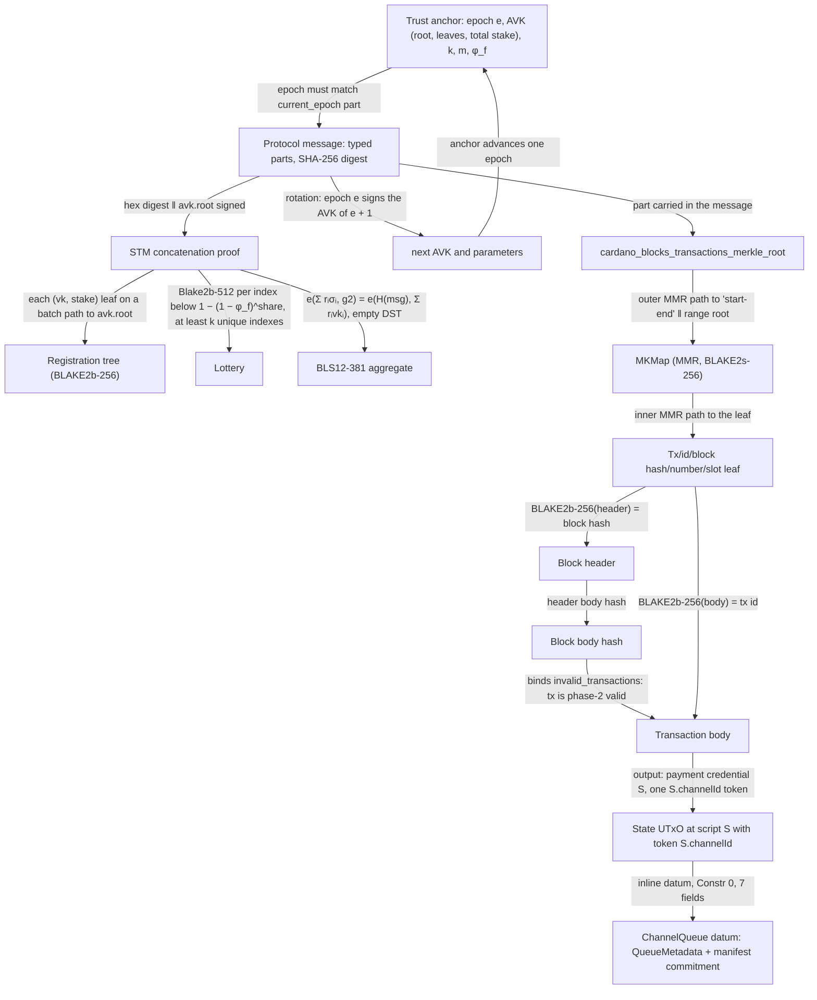
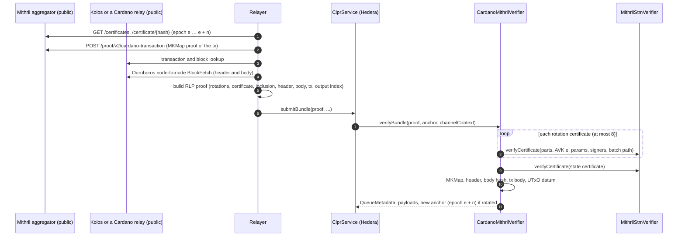

# Cardano verifier (`CardanoMithrilVerifier`)

Cardano → Hiero. Cardano has no compact BFT finality certificate. Mithril gives one: a stake-based threshold
multi-signature (STM) by Cardano stake pools over chain data they see as immutable. `CardanoMithrilVerifier`
is a Mithril light client on Hedera's EVM. It verifies a Mithril certificate of the channel's epoch, following
epoch rotations. It then proves that a transaction sits in a certified block and is phase-2 valid. Last, it
reads the CLPR queue record from the inline datum of the channel's state UTxO at the CLPR Plutus script.

Every protocol rule below was checked against:

- `IntersectMBO/mithril` @ `321f8d8` (30 Sep 2026)
- `ckb-merkle-mountain-range` 0.6.1
- the Cardano ledger CDDL
- live preprod and mainnet Mithril and Cardano data captured on 1 Oct 2026

## At a glance

| Item | Value |
|---|---|
| Chains covered | Cardano mainnet (`cip34:1-764824073`), preprod (`cip34:0-1`), preview (`cip34:0-2`). Any Cardano network with a Mithril aggregator. |
| Direction | Cardano → Hiero |
| Finality source | Mithril certificates: STM concatenation proof (BLS12-381, lottery over stake) of the protocol message, under the epoch's aggregate verification key (AVK) |
| Trust assumption | The Mithril honest-stake assumption for parameters (k, m, φ_f), over the stake of the pools registered with Mithril in that epoch. Plus the bootstrap AVK, and the key-encoding gap in [Limits](#limits-and-known-gaps). |
| Typical bundle | Preprod, live: epoch rotation + CardanoBlocksTransactions certificate + MKMap + block + transaction output, 2,153,379 gas, 5,092 B (anvil) |
| Rotation | Mainnet, live: epoch rotation + next-epoch certificate, 11,218,993 gas, 79,204 B (anvil). One rotation per 5-day epoch, at most one per mainnet bundle. |
| Contract sizes | `CardanoMithrilVerifier` 21,278 B; `MithrilStmVerifier` 13,586 B; `ClprBlake2sHasher` 2,108 B |
| Status | Live-verified on preprod (certificates, rotation, full transaction-output path) and mainnet (certificates, rotation), fixtures captured 2026-10-01. Mainnet bundles are blocked: mainnet does not sign `CardanoBlocksTransactions` yet. |

**Family coverage.** Mithril is Cardano-specific. The verifier serves every Cardano network whose Mithril
aggregator certifies `CardanoBlocksTransactions`: preprod and preview today, mainnet once enabled. Cardano
partner chains (Midnight and others) run their own consensus and are not covered.

## How it works

### Proof chain



1. **Anchor**: `CardanoMithrilVerifier.sol:decodeAnchor` reads the 86-byte anchor.
2. **Rotations**: `CardanoMithrilVerifier.sol:_applyRotations` verifies up to 8 certificates, epoch e, e + 1, ….
   Each one must carry `next_aggregate_verification_key` and `next_protocol_parameters`. A change of φ_f reverts.
3. **Certificate**: `CardanoMithrilVerifier.sol:_verifyCertificate` checks the epoch and calls
   `MithrilStmVerifier.sol:verifyCertificate`. That rebuilds the protocol message from typed parts
   (`ClprMithrilMessage.sol:build`, hashes as in `ProtocolMessage::compute_legacy_digest_bytes`) and verifies
   the STM proof (`ClprMithrilStm.sol:verify`):
   - registration batch path (`_verifyBatchPath`, heap layout, padding `BLAKE2b-256(0x00)`)
   - lottery with exact f64 arithmetic for `ln(1 − φ_f)` (`_checkLottery`, `lotteryThreshold`)
   - unique indexes ≤ m, at least k of them
   - aggregate BLS min_sig with Fiat–Shamir scalars `BLAKE2b-128(σ₁…σₙ ‖ i)` and hash-to-G1 with an empty DST
     (`hashToG1`), on the EIP-2537 precompiles
4. **Inclusion**: `CardanoMithrilVerifier.sol:_checkInclusion` rebuilds the leaf `Tx/<id>/<block hash>/<n>/<slot>`.
   It folds the inner range MMR and the outer MKMap MMR with BLAKE2s-256 (`ClprMithrilMmr.sol:root`,
   `ClprBlake2sHasher`) to the certified `cardano_blocks_transactions_merkle_root`.
5. **Block and validity**: `CardanoMithrilVerifier.sol:_provenTransaction` hashes the header to the block hash.
   `ClprCardanoLedger.sol:checkValidInBlock` rebuilds `block_body_hash = H(H(bodies) ‖ H(witnesses) ‖ H(aux) ‖
   H(invalid_txs))` (Alonzo `hashTxSeq`) and checks that the transaction's index is not listed as invalid.
6. **State**: `CardanoMithrilVerifier.sol:_provenQueue` reads the output (`ClprCardanoLedger.sol:outputAt`,
   `scriptOutputDatum`): payment credential = script S, exactly one `S.<channelId>` token, inline datum. It
   decodes the datum with `decodeChannelQueue`.

**Why the validity step matters.** Mithril's transaction sets include phase-2-invalid transactions. An
invalid transaction's body can claim any outputs, so an attacker who pays collateral could include a "state
UTxO" with a forged datum. The block-body hash binds the `invalid_transactions` list, and the verifier
checks it. That needs the block hash, which only the newer `CardanoBlocksTransactions` entity certifies.

### CLPR Service on Cardano (the expected layout)

One Plutus script S is both the spending validator and the minting policy. Its 28-byte hash is the channel's
remote service address. Each channel's state UTxO sits at an address with payment credential S, holds one
thread token `S.<channelId>`, and carries an inline datum:

```
ChannelQueue = Constr 0 [status, next_message_id, received_message_id,
                         sent_running_hash (32), received_running_hash (32),
                         peer_endpoint_manifest_version, endpoint_manifest_commitment (0 or 32 bytes)]
```

Every queue update spends and recreates the UTxO. The relayer proves the output that carries the state it
delivers.

## Bundle lifecycle



## Trust model

What is trusted:

- **Mithril's honest-stake assumption.** A certificate shows that registered signers won at least k of m
  lotteries for the message. Each signer wins an index with probability `1 − (1 − φ_f)^(stake/total)`. The
  parameters (mainnet: k = 1,944, m = 16,948, φ_f = 0.2; preprod: k = 5, m = 100, φ_f = 0.7) are chosen by
  the Mithril protocol so that signers below its honest-stake bound cannot reach k.
- **Who signs.** `total` is the stake of the pools registered with Mithril in that epoch, not all Cardano
  stake. Mithril is a separate signer network run by stake pool operators, not Ouroboros consensus.
- **What signers attest.** Signers attest only data they see as immutable. `CardanoBlocksTransactions` is
  signed a block-number offset behind the tip (100 blocks on preprod, `BlockNumberOffset` in the signed
  entity type).
- **The bootstrap.** `verifyConfig` takes the AVK and parameters of one epoch and a certificate of that epoch
  signed under them. Governance that completes the channel vouches for this waypoint, as for the other
  committee verifiers. Mithril's own genesis-key certificate chain is not used.
- **φ_f is fixed at bootstrap.** A rotation that changes it reverts (`PhiFChanged`) and the channel must be
  bootstrapped again. k and m may change.
- **The key-encoding gap.** See [Limits and known gaps](#limits-and-known-gaps).

What is not trusted:

- The aggregator, Koios and the relay node. Everything they return is hashed or signature-checked.
- Admin keys. There are none. The contracts are immutable.

To forge a bundle, an attacker must do one of these:

- Control enough Mithril-registered stake to win k lotteries for a false message.
- Get a channel's governance to bootstrap a false AVK.
- Change the CLPR Plutus script. Script hashes are immutable, so a different script is a different service
  address.

## Proof format

**Trust anchor** (86 bytes): `epoch u64 ‖ avkRoot 32 ‖ nrLeaves u64 ‖ totalStake u64 ‖ k u64 ‖ m u64 ‖
φ_f U8F24 u32 ‖ lnMant u64 ‖ lnExpNeg u16`. `|ln(1 − φ_f)| = lnMant·2^-lnExpNeg` is the exact f64 Mithril
uses. `initialTrustAnchorId` / `newTrustAnchorId` = the epoch (8 bytes).

**Bundle** (RLP list, 8 items, or 9 with a manifest):

| # | Item | Meaning |
|---|---|---|
| 0 | rotations | `[cert, …]` certificates of the anchor epoch, then the next, … (≤ 8, may be empty) |
| 1 | stateCert | certificate carrying `cardano_blocks_transactions_merkle_root`, of the (rotated) anchor epoch |
| 2 | inclusion | `[blockNumber, slot, innerPos, innerMmrSize, innerItems[], rangeStart, rangeEnd, outerPos, outerMmrSize, outerItems[]]` |
| 3 | header | block header CBOR |
| 4 | body | `[bodies (32-byte hash, or the full CBOR array), witnessesHash, auxHash, invalidTxs CBOR, txIndex]` |
| 5 | txBody | transaction body CBOR |
| 6 | outputIndex | index of the state UTxO in the outputs |
| 7 | bundleContent | protobuf `ClprBundleContent` |
| 8 | manifest | optional protobuf `ClprEndpointManifest`, keccak256 = the datum's commitment |

`cert` = `[keyIds[], values[], signers[], batchValues]`. Each signer entry is
`σ (G1, 128) ‖ vk (G2, 256) ‖ σ compressed (48) ‖ vk compressed (96) ‖ stake u64 ‖ leafIndex u32 ‖ indexes u32…`.
The uncompressed points go to the EIP-2537 precompiles, which check curve and subgroup membership. The
compressed bytes are what Mithril hashes. `ClprMithrilStm.sol:bindsG1` recomputes σ's encoding with the
existing `ClprBls12381.compressG1` and requires it byte for byte, all three flag bits included.
`bindsG2` binds vk's encoding by x-coordinate and the compression and infinity flags.

**Config** (RLP, 11 items): `[epoch, avkRoot, nrLeaves, totalStake, k, m, phiU8F24, lnMant, lnExpNeg, cert,
ledgerConfiguration]`. The chain id must start with `cip34:`. The service address is the 28-byte script hash.

**Deployment profile**: `ClprBlake2sHasher`, then `MithrilStmVerifier`, then
`CardanoMithrilVerifier(stm, blake2s)`. No per-network constants. The network is fixed by the bootstrap AVK.

## Validator-set / committee rotation

The Mithril signer set and stake distribution change every Cardano epoch (5 days). A certificate of epoch e
signs `next_aggregate_verification_key` and `next_protocol_parameters` for e + 1
(`verify_*_chaining`). The verifier accepts up to 8 rotation certificates per bundle. On mainnet one certificate
costs about 5.5M gas (5,585,779 measured), so a bundle fits one rotation plus its state certificate
(11,218,993 gas, 79,204 B). Catching up n epochs on mainnet therefore takes n bundles. On preprod a bundle can
carry all 8. The aggregator serves the whole certificate chain, so old certificates stay available and
catch-up has no time limit.

## Gas and calldata

Measured with `eth_estimateGas` on anvil (`npm run test:e2e:cardano-live`), live fixtures captured
2026-10-01. Hedera limits: 15,000,000 gas and 128 KB calldata.

| Case | Gas | Calldata | Fits |
|---|---|---|---|
| Preprod: rotation (epoch 315 → 316) + CardanoBlocksTransactions certificate + MKMap + block + transaction output | 2,153,379 | 5,092 B | yes |
| Mainnet: one certificate (epoch 658; 57 signatures, 1,946 lottery indexes) | 5,585,779 | 38,724 B | yes |
| Mainnet: rotation (657 → 658) + certificate | 11,218,993 | 79,204 B | yes |

On mainnet, the certificate dominates: the lottery (two BLAKE2F calls per index, about 1.6k gas) and the G2
MSM over the signatures. BLAKE2s-256 has no precompile and costs about 36k gas per 64-byte block. The CLPR
datum checks of `verifyBundle` are not measured on live data, because no CLPR script exists on Cardano. They
run in the synthetic Foundry tests.

## Limits and known gaps

- **Mainnet bundles are blocked.** The mainnet aggregator signs `MithrilStakeDistribution`,
  `CardanoStakeDistribution`, `CardanoDatabase` and `CardanoTransactions`, but not `CardanoBlocksTransactions`
  (checked on the aggregator's capabilities, 2026-10-01). `CardanoTransactions` leaves are bare transaction
  ids, without the block hash needed to prove phase-2 validity. Mainnet certificates and rotations verify
  today. Bundles need Mithril to enable `CardanoBlocksTransactions` on mainnet. Preprod and preview have it.
- **Key-encoding gap.** Each signature's compressed bytes must equal the on-chain encoding of its point,
  so one signature point has one lottery encoding (`test_rejects_sameSignatureOtherFlagEncoding`). The
  key's compressed bytes are fixed by the registration leaf, but the relayer-supplied key point is bound
  only by x-coordinate and flags, because the repository has no G2 encoder. A relayer can therefore supply
  the negated key together with the negated signature. That pair passes the BLS check, and the negated
  signature has its own encoding, so each real signature can still reach the lottery twice. This at most
  doubles one signature's lottery wins. Real signatures are still required. Closing it needs a G2 encoder
  that the repository's BLS rules allow.
- **No CLPR Plutus script exists yet.** The datum layout above is this verifier's proposal. The live tests
  prove real outputs of other scripts with the generic entry points (`verifyTransactionOutput`,
  `verifyCertificate`).
- **Fails closed on newer Mithril formats**: the "rigid" (SNARK) message hash scheme, unknown message keys,
  an AVK encoding other than the current JSON, and SNARK/IVC aggregate signatures (not enabled on any network
  today).
- **Lottery edge band.** Lottery arithmetic is exact except in a ±2^-104 band, where the verifier reverts
  (`LotteryAmbiguous`) instead of guessing. An honest index lands there with probability about 2^-100.
- **Hiero → Cardano** is not covered (see the chain page).

## Upgrades and forks

Two things can change: Cardano hard forks (eras) and Mithril releases.

- **Cardano eras** change the header, body and transaction CDDL. `ClprCardanoLedger` parses the current
  layouts (live preprod data, 2026-10-01), and an unknown layout fails closed.
- **Mithril changes** fail closed too: a new message part, a new AVK encoding, or the SNARK aggregate type.

Neither is a parameter the source chain signs. Under the fork-aware verifier ADR
(`ADR/2026-10-01-fork-aware-verifiers.md`, draft LFDT-CLPR/clpr-spec#1) they are layout or semantic changes.
They need a new verifier and a channel succession.

Epoch rotation is carried in bundles. A stalled channel can catch up from the aggregator's certificate chain
at any later time (one epoch per mainnet bundle), so rotating signers do not strand it (the ADR's §1.3).

## Running it

```bash
forge build
forge test --match-path 'test/verifiers/*/cardano/*'
forge test --match-path test/verifiers/compliance/CardanoComplianceTest.t.sol
npm run test:e2e:cardano-live          # anvil replay (one anvil, port CLPR_ANVIL_PORT_A, default 8641)
npm run cardano-live:refresh           # re-capture from the public aggregators, Koios and a preprod relay
npx tsx test/e2e/relay/buildCardanoLiveProof.ts   # rebuild vectors.json from the captured fixtures
```

## Files

| File | Purpose |
|---|---|
| `src/verifiers/evm/cardano/CardanoMithrilVerifier.sol` | `IClprVerifier`: rotations, certificate, inclusion, block validity, datum |
| `src/verifiers/evm/cardano/MithrilStmVerifier.sol` | Stateless certificate engine (message rebuild + STM) |
| `src/libraries/proof/cardano/ClprMithrilStm.sol` | STM concatenation proof: batch path, lottery, BLS aggregate, hash-to-G1 |
| `src/libraries/proof/cardano/ClprMithrilMessage.sol` | Protocol message from typed parts |
| `src/libraries/proof/cardano/ClprMithrilMmr.sol` | MKMap / MMR roots (BLAKE2s) |
| `src/libraries/proof/cardano/ClprCardanoLedger.sol` | Header, body hash, outputs and inline datum |
| `src/libraries/proof/cardano/{ClprBlake2,ClprBlake2sHasher,ClprCbor}.sol` | BLAKE2b (precompile), BLAKE2s engine, CBOR reader |
| `test/verifiers/evm/cardano/CardanoMithrilVerifier.t.sol` | Synthetic worlds and negative cases |
| `test/verifiers/evm/cardano/CardanoLive.t.sol` | Live preprod and mainnet replay |
| `test/verifiers/evm/cardano/CardanoTestKit.sol` | Synthetic Mithril networks and Cardano encodings |
| `test/verifiers/compliance/CardanoComplianceTest.t.sol` | Shared `IClprVerifier` compliance suite |
| `test/e2e/fixtures/cardano-live/{preprod,mainnet,vectors}.json` | Captured certificates, MKMap proof, block; derived vectors |
| `test/e2e/relay/buildCardanoLiveProof.ts`, `test/e2e/relay/cardano/*.ts` | Capture, build and TypeScript reference model |
| `test/e2e/tests/verifiers/cardano-live.spec.ts` | Anvil replay |

## References

- Mithril @ `321f8d8`: `mithril-stm` (`ConcatenationProof::verify`, `is_lottery_won`, `BlsSignature::aggregate`,
  `verify_leaves_membership_from_batch_path`), `mithril-common` (`ProtocolMessage`, `ProtocolParameters`,
  `SignedEntityType`, `MKTree`, `MKMapProof`), `certificate_verifier.rs` — https://github.com/input-output-hk/mithril
- Mithril aggregator API: https://mithril.network/doc/aggregator-api
- ckb-merkle-mountain-range 0.6.1: https://github.com/nervosnetwork/merkle-mountain-range
- Cardano ledger CDDL (Babbage, Conway) and Alonzo `hashTxSeq`: https://github.com/IntersectMBO/cardano-ledger
- CIP-34 (chain ids): https://cips.cardano.org/cip/CIP-0034
- EIP-2537 (BLS12-381 precompiles), EIP-152 (BLAKE2F)
