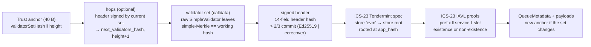

# CometBFT verifier family

> **Source**: [CometBftVerifier.sol](./CometBftVerifier.sol) ·
> shared libraries [CometBftLib](../../../libraries/proof/cometbft/CometBftLib.sol),
> [CometBftProofCodec](../../../libraries/proof/cometbft/CometBftProofCodec.sol),
> [Ics23Lib](../../../libraries/proof/cometbft/Ics23Lib.sol) ·
> Ed25519: [Ed25519Verifier](../sei/Ed25519Verifier.sol)
> **Interface**: [IClprVerifier.sol](../../../interfaces/IClprVerifier.sol)

A "CometBFT chain → Hiero" verifier: it runs on Hedera's EVM and checks (1) CometBFT finality,
meaning more than 2/3 of the validator set's voting power signed the header, and (2) the peer CLPR
Service's queue storage in that header's `app_hash`.

One contract, `CometBftVerifier`, serves every CometBFT chain whose CLPR Service is an **EVM
contract kept in a Cosmos SDK IAVL store**. The chain is a deploy-time `Profile`, not a subclass.
`SeiCometBftVerifier` (../sei) is the older Sei-only member and now shares its protobuf decoders
with this one through `CometBftProofCodec`. It keeps its own anchor format (the full validator
list) so the Sei relay stays compatible.

## 1. Chains

Every row below comes from that chain's live public RPC on 2026-10-01. The fixtures are in
`test/e2e/fixtures/cometbft-live/`. Protocol details were checked against the source named in §8.

| Chain | Consensus | Key scheme | Validators | Min. signers for >2/3 | App state / how proven | Status |
|---|---|---|---|---|---|---|
| **Cronos** | CometBFT 0.38.13 | Ed25519 | 10 | **7** | EVM in IAVL store `evm`, key `0x02‖addr‖slot` (Ethermint) → ICS-23 | **Covered.** Live `verifyBundle` 7.84M gas |
| **Mezo** | CometBFT 0.38.19 | Ed25519 | 21 (all power 1) | **15** | EVM in IAVL store `evm`, key `0x02‖addr‖slot` (Evmos fork) → ICS-23 | **Covered.** Live `verifyBundle` 12.84M gas |
| Sei | CometBFT (sei-tendermint) | Ed25519 | — | — | EVM in IAVL store `evm`, key `0x03‖addr‖slot` | Covered by profile (`0x03`); production path is `SeiCometBftVerifier` |
| **Polygon PoS** (Heimdall v2) | CometBFT 0.38.22, Polygon fork | **secp256k1eth**: 65 B key, r‖s‖v over keccak256 | 104 | **10** | Heimdall app state is not EVM. Bor (EVM, MPT) block hashes are in the `milestone` store, key `0x81‖count` | **Light client covered** (live commit 1.54M gas). Milestone → Bor header → MPT adapter not built (§7) |
| **dYdX v4** | CometBFT 0.38.5 | Ed25519 | 21 | 10 | Native Cosmos modules only. No `wasm` store, no EVM (checked: `no such store: wasm`) | Light client fits (6.75M). No place for a CLPR Service contract |
| **Provenance** | CometBFT 0.38.22 | Ed25519 | 100 | 18 | CosmWasm: `wasm` store, key `0x03‖contract(32 B)‖key` | Light client fits alone (12.6M). Needs a CosmWasm profile (§7); with a state proof it is ~15–16M |
| **THORChain** | CometBFT 0.38.19 | Ed25519 | 99 (all power 100) | **67** | CosmWasm `wasm` store (App Layer) | **Does not fit**: commit alone is 43.6M gas (§6) |
| **Arc** (Circle) | **Malachite** (Tendermint algorithm, not CometBFT) | Ed25519 over **SSZ** votes | 22 (testnet) | 11 | EVM (reth), **MPT**. Validator set is EVM storage of `ValidatorRegistry` at `0x3600…0002` | **Separate adapter:** [`../arc`](../arc/README.md) (`ArcMalachiteVerifier`, live bundle 7.9–9.1M gas) |

"Min. signers" uses the live validator set sorted by power. The relay sends exactly that many
signatures (§3.4).

## 2. Verification chain



`verifyBundle(proof, anchor, channelContext)`:

1. Decode the anchor: `validatorSetHash(32) ‖ height(8, big-endian)`. It means "this set signs every
   header at or above `height`".
2. Apply hops. Each hop is a header signed by more than 2/3 of the current set at or above the
   current height. The working anchor then becomes `(next_validators_hash, height + 1)`.
3. Hash the supplied validator set and require it to equal the working hash and the header's
   `validators_hash`.
4. Rebuild the header hash on-chain. Verify commit signatures over the canonical precommit
   (`CanonicalVote{PRECOMMIT, height, round, BlockID{hash, parts}, timestamp, chain_id}`,
   length-delimited) until more than 2/3 of the set's total power has signed. The chain id must
   match the profile.
5. Check the multistore proof: store key → store root, verified against `app_hash` with the ICS-23
   Tendermint spec.
6. Check one IAVL proof per slot, for key `prefix ‖ serviceAddress(20) ‖ slot(32)`. The slots must
   be the channel's real `Channel` slots (+1, +2, +4, +5, +16), plus the last-message running hash
   when messages are present. Absent slots need a non-existence proof and read as zero.
7. If `next_validators_hash` differs from the anchor's hash, return the new anchor
   `(next_validators_hash, height + 1)`.

`verifyConfig` runs the same chain, starting from the deploy-time checkpoint
`(BOOTSTRAP_VALIDATORS_HASH, BOOTSTRAP_HEIGHT)`. It proves ClprService's `_config.serviceAddress`
(slot 25, short-bytes layout `addr ‖ 0…0 ‖ 0x28`) by **both slot number and value**.

## 3. Design choices

### 3.1 Compact anchor, keys in calldata

`SeiCometBftVerifier` stores `abi.encode(chainId, validators[])` as the anchor, which is about 64 B
per validator. ClprService keeps the anchor in channel storage. Each bundle then pays an SLOAD per
32 B (2,100 gas cold), and each rotation pays an SSTORE per 32 B. At 100 validators that is about
200 slots: ~0.4M gas on every bundle and ~4M gas on each rotation.

Here the anchor is two slots. The keys arrive in calldata as the exact `SimpleValidator` bytes that
CometBFT hashes (`{1: PublicKey{oneof}, 2: voting_power}`). The verifier hashes those bytes and
decodes them strictly, with nothing re-encoded. 100 Ed25519 leaves are about 4 KB of calldata
(~65k gas).

### 3.2 Profiles

```solidity
struct Profile {
    string  chainId;                 // "cronosmainnet_25-1", "mezo_31612-1", …
    bytes   storeKey;                // "evm"
    uint8   evmStateKeyPrefix;       // 0x02 Ethermint (Cronos, Mezo) · 0x03 Sei
    KeyScheme keyScheme;             // ED25519 | SECP256K1_ETH
    address ed25519Verifier;         // required for ED25519
    bytes32 bootstrapValidatorsHash; // weak-subjectivity checkpoint for verifyConfig
    uint64  bootstrapHeight;
}
```

### 3.3 Key schemes

| Scheme | Leaf | Signature | Check | Gas per signature (live) |
|---|---|---|---|---|
| `ED25519` | oneof field 1, 32 B | 64 B over sign bytes | external `IEd25519Verifier` (pure Solidity; Hedera has no Ed25519 precompile) | **~638–640k** |
| `SECP256K1_ETH` (Polygon fork) | oneof field 3, 65 B `0x04‖X‖Y` | 65 B `r‖s‖v` over `keccak256(signBytes)` | `ecrecover` == `keccak(X‖Y)[12:]`, low-s | **~32k** (mostly sign-bytes building) |

### 3.4 Fewer signatures by voting-power ordering

CometBFT sorts a validator set by voting power, descending. The verifier walks validators in index
order and **stops as soon as more than 2/3 is reached**. It never checks or counts signatures past
that point. The relay (`encodeSignedHeader` in `test/e2e/relay/cometbft.ts`) sends the first
committed signers in index order, which is the smallest subset that clears 2/3. Live effect:

| Chain | Committed signatures | Sent and verified | Commit gas: minimal | If every committed signature were checked (est.) |
|---|---|---|---|---|
| Provenance | 99 | 18 | 12.6M | ~64M |
| Heimdall | 100 | 10 | 1.5M | ~4.4M |
| dYdX | 17 | 10 | 6.75M | ~11M |
| Cronos | 10 | 7 | — (bundle 7.84M) | bundle ~9.8M |

Ordering does nothing for **equal-power** sets: THORChain (67 of 99) and Mezo (15 of 21).

## 4. Wire formats (protobuf)

```
CometBftBundlePayload { 1 state_proof: StateProof; 2 bundle_content: ClprBundleContent;
                        3 validator_set: ValidatorSet; 4 manifest_storage_proof: StorageProofEntry;
                        5 manifest_preimage: bytes; repeated 6 hops: ValidatorSetHop }
CometBftConfigPayload { 1 validator_set; 2 ledger_configuration; 3 state_proof; repeated 4 hops }
ValidatorSetHop       { 1 validator_set: ValidatorSet; 2 signed_header: SignedHeader }
ValidatorSet          { repeated bytes 1 leaf }          // CometBFT SimpleValidator bytes
StateProof            { 1 signed_header; 2 store_key; 3 multistore_proof (ICS-23 CommitmentProof);
                        repeated 4 StorageProofEntry{1 key, 2 value, 3 iavl_proof} }
SignedHeader          { 1 header (relay layout, as Sei: flat last_block_id); 2 commit {1 round,
                        2 part_set_total, 3 part_set_hash, 4 signers_bits (MSB-first),
                        repeated 5 {1 timestamp, 2 signature}} }
```

The ICS-23 proofs are the `ics23:iavl` and `ics23:simple` ops that `abci_query
/store/<store>/key?prove=true` returns at height `H-1`; they verify against header `H`'s
`app_hash`. `relay/cometbft.ts` builds every message from public RPC JSON.

## 5. Trust assumptions and limits

- **Honest supermajority.** No set the verifier trusts ever had more than 2/3 of its power sign
  two conflicting headers.
- **Unbonding period.** This is a sequential light client with no trusting period. A set that has
  fully unbonded could sign a forged hop at no cost. Relays must keep each channel's anchor within
  the chain's unbonding period, so they have to submit a bundle at every rotation (§6.3). The
  verifier does not compare header time to `block.timestamp`. Adding that check would need a
  profile parameter.
- **Bootstrap.** `verifyConfig` trusts the deploy-time checkpoint, so the deployer chooses it. A
  checkpoint older than the unbonding period has the same exposure as above. Unlike
  `SeiCometBftVerifier`, a config proof **cannot** supply its own validator set.
- **Peer identity.** The service address is bound by channel context and proven storage, as in
  the other EVM verifiers. Peer authenticity comes from ClprService's commitment/reveal.
- **ICS-23 checks** come from `Ics23Lib`, shared with Sei: leaf and inner-op spec checks, plus
  neighbour checks for non-existence. Batch and compressed proofs are rejected.
- **No verifier state.** Replay protection is ClprService's message-id logic. Old headers are
  rejected below the anchor height, and headers from a replaced set fail the set-hash check. An
  older header at or above the anchor height still verifies; ClprService rejects its stale
  metadata through its progress and replay checks (`BundleLib._checkBundleProgress`). A
  rotation-only bundle counts as progress (Condition 2), so §6.3 works with ClprService unchanged.
- **Bundle size throttle.** A bundle is ~16–19 KB, so the receiving ClprService needs
  `maxSyncBytes` at or above that (BundleLib Step 2).
- **Size.** 24,152 B, which is 424 B under EIP-170.

## 6. Gas on Hedera terms

These are anvil `eth_estimateGas` figures for the whole transaction: intrinsic gas, calldata and
execution. Hedera uses the same gas schedule. Its limits are **15,000,000 gas** and **131,072 B of
calldata** (jumbo EthereumTransaction). Source: `npm run test:e2e:cometbft-live`, data from
2026-10-01.

### 6.1 Per signature and per commit

| | Ed25519 | secp256k1eth |
|---|---|---|
| One signature (marginal, live) | ~638–640k (≈604k curve + SHA-512, ≈37k sign bytes) | ~32k |
| Signatures per 15M (commit only, 0.4–1.1M fixed by set size) | **~21–22** | ~400 |
| Signatures per 15M (full bundle, ~3.4M fixed) | **~18** | — |

| Live commit (`applyHops` = light client = rotation hop) | Validators | Sigs | Gas | Calldata | Fits 15M |
|---|---|---|---|---|---|
| Heimdall v2 | 104 | 10 | 1,540,382 | 9.3 KB | yes |
| dYdX | 21 | 10 | 6,750,034 | 2.4 KB | yes |
| Provenance | 100 | 18 | 12,615,327 | 6.6 KB | yes (light client only) |
| THORChain | 99 | 67 | 43,615,384 | 10.1 KB | **no** |

### 6.2 Typical bundle

The "service" is a real contract with absent channel slots, so it has **five IAVL non-existence
proofs**. A live channel's slots exist, and existence proofs are cheaper (one path instead of two
neighbours).

| Live `verifyBundle` | Sigs | Gas | Calldata | Fits |
|---|---|---|---|---|
| Cronos | 7 | **7,835,474** | 15.9 KB | yes |
| Cronos + one hop | 7 + 7 | 12,606,533 | 17.3 KB | yes |
| Mezo | 15 | **12,844,528** | 16.3 KB | yes |
| Mezo + one hop | 15 + 15 | 22,792,729 | 18.9 KB | **no** (use §6.3) |

The fixed part of a bundle is ~3.4M gas. Most of it is the ICS-23 decoding of five two-neighbour
non-existence proofs plus ~16 KB of calldata.

### 6.3 Validator-set rotation

A rotation is **one ordinary bundle at the last header the old set signs**, header `R` with
`next_validators_hash ≠ validators_hash`. The verifier returns the new 40-byte anchor. ClprService
then stores the 40-byte anchor and its id (3 slots each), about 20–130k gas. Rotation therefore costs the same
as a normal bundle: 7.8M on Cronos and 12.8M on Mezo, both within 15M.

Hops exist for a relay that missed `R`. One hop costs about one commit (Cronos +4.8M). If a bundle
plus its hops exceeds 15M (Mezo), the relay instead submits **one bundle per rotation header
`R₁, R₂, …`**, each in its own transaction and each signed by the set of its time. This is
batching across transactions with no new contract. It needs ABCI proofs at `Rᵢ-1`, so the node
must still have those versions. Cosmos SDK's default pruning keeps the last 362,880; the public
Cronos node served about 500k blocks of history.

### 6.4 When a commit does not fit (THORChain, and Ed25519 sets above ~18–22 signers)

| Option | How | Cost on Hedera | Trust | Notes |
|---|---|---|---|---|
| **a. Voting-power ordering** (implemented) | Send only the smallest power-ordered subset (§3.4) | — | unchanged | Solves Provenance (99 → 18) and dYdX. Useless for equal power (THORChain 67, Mezo 15) |
| **b. Signature accumulator across transactions** | A companion contract verifies `k` signatures per tx for `(headerHash, setHash)` and records signed power plus a used-signer bitmap. The bundle then checks `accumulated > 2/3` | THORChain: 67 sigs ≈ 4 tx × ~17 sigs ≈ 11M each, plus ~25k SSTORE per tx | unchanged | Needs per-channel state outside the stateless verifier, and verifyBundle must read it. ~45M gas per THORChain header in total |
| **c. SNARK of the commit** | Off-chain prover shows "signers of power > 2/3 of the set with hash S signed header hash h" (Ed25519 inside the circuit). On-chain, verify a Groth16 proof with BN254 precompiles (0x06–0x08, available on Hedera) | ~0.3–0.4M gas per proof, independent of set size | adds circuit/prover soundness. A trusted setup for Groth16 | Ed25519 is costly in-circuit (non-native field arithmetic), so proving cost and latency move off-chain. The best option for THORChain |
| d. Cheaper Ed25519 in Solidity | Optimise field arithmetic or SHA-512 | unmeasured | unchanged | At most a constant factor; 67 signatures stay far above 15M |
| e. Ed25519 precompile on Hedera | A HIP for EIP-665 or RIP-7696-style precompiles | EIP-665 proposed 2,000 gas per signature | unchanged | Would make every Ed25519 chain trivial. Not available today |

## 7. Not covered yet (family members to add)

- **Polygon PoS (Bor).** The light client is done: secp256k1eth, verified on a live commit (1.54M
  gas). Still needed: an ICS-23 proof of a Heimdall milestone in store `milestone`, key
  `0x81‖count(u64 BE)`, whose `Milestone.hash` (field 4) is the Bor block hash at `end_block`. Then
  the RLP Bor header (keccak == hash), `stateRoot`, and MPT account and storage proofs, reusing
  `ClprEvmBundleVerifier`. Checked live on 2026-10-01: the latest milestone (count 0xe336f3) has
  `end_block` 94,745,706 and `hash = 0x6e7b08db…`, which is that Bor block's hash. Estimated total ≈ 1.5M + 0.3M + MPT ≈ 2.5–3M gas.
- **Arc (Malachite).** Votes are `SSZ(Vote{type: u8, height: u64, round: Option<u32>, value:
  Option<B256>, address: [u8;20]})` signed with Ed25519 (`arc-node` `crates/types/src/vote.rs`).
  The address is `keccak256(pubkey)[..20]`, the first 20 bytes. The value is the EVM block hash.
  `arc_getCertificate` serves `{height, round, block_hash, signatures[{address, signature}]}`. The
  validator set is `ValidatorRegistry.getActiveValidatorSet()` at the parent state. The live fixture
  checks all signatures off-chain against the registry at `H-1`. An adapter needs a set-hash
  anchor, SSZ sign bytes, then RLP header → MPT. Testnet needs 11 signatures ≈ 7M gas plus MPT, so
  it fits.
- **CosmWasm chains** (Provenance, THORChain). These need a CosmWasm CLPR Service and a profile
  for the `wasm` store with 32-byte contract addresses (`0x03‖contract(32)‖key`). The storage
  layout would be the CosmWasm contract's own, not ClprService's Solidity slots.
- **dYdX.** No contract runtime, so a CLPR Service would have to be a native module. The light
  client is ready.
- **Sei** can move to this contract with a `0x03` profile once its relay emits the compact anchor.

## 8. Sources checked

- CometBFT v0.38: `types/block.go` (`Header.Hash`), `types/canonical.go`, `types/vote.go`
  (`VoteSignBytes`), `types/validator.go` (`SimpleValidator`), `crypto/merkle` (RFC 6962 tree).
- Polygon fork `github.com/0xPolygon/cometbft v0.3.8-polygon`, as pinned in heimdall-v2 `go.mod`:
  `crypto/secp256k1/secp256k1.go` (`PubKeyName = "cometbft/PubKeySecp256k1eth"`, `Sign =
  crypto.Sign(Keccak256(msg))`, 65 B key and signature) and `crypto/encoding/codec.go` (oneof
  field 3).
- heimdall-v2 `x/milestone/types/keys.go`, `proto/heimdallv2/milestone/milestone.proto`.
- crypto-org-chain/ethermint and mezo-org/mezod `x/evm/types/key.go`: `StoreKey = "evm"` and
  `KeyPrefixStorage = 0x02`. Mezo stores every written word as 32 B (`value.Bytes()`), deleting
  only on empty input.
- sei-chain `x/evm/types/keys.go`: `StateKeyPrefix = 0x03`.
- CosmWasm wasmd `x/wasm/types/keys.go`: `ContractStorePrefix = 0x03`.
- circlefin/arc-node `crates/types/src/{vote.rs,address.rs,ssz/v1}`, `crates/signer/src/local.rs`,
  `contracts/src/validator-manager/ValidatorRegistry.sol`, `crates/eth-engine/src/constants.rs`.
- Live: every RPC listed in `test/e2e/relay/buildCometBftLiveFixture.ts`. Cronos's `0x02` layout
  was also confirmed by query: `0x02‖WCRO‖slot0` returns "Wrapped CRO" and `0x03` returns nothing.

## 9. Running

```bash
forge test --match-path 'test/verifiers/evm/cometbft/*'   # 35 synthetic tests, real secp256k1 signatures
forge build && npm run test:e2e:cometbft-live             # live fixtures on anvil (CLPR_ANVIL_PORT_A, default 8597)
npm run cometbft-live:refresh [cronos mezo …]             # re-record from public RPCs
```
