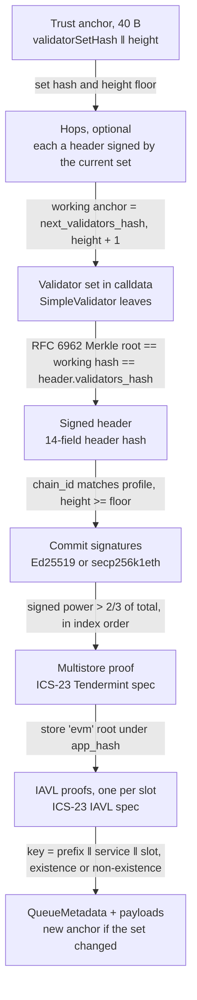
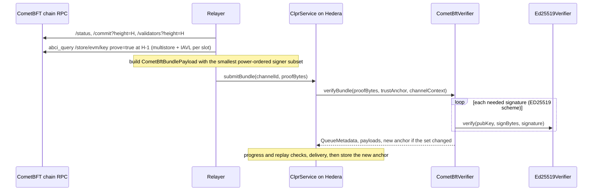

# CometBFT verifier family (EVM store)

A "CometBFT chain → Hiero" verifier. `CometBftVerifier` runs on Hedera's EVM and proves two
things: (1) CometBFT finality, meaning validators holding more than 2/3 of the validator set's
voting power signed the header, and (2) the peer CLPR Service's queue storage under that header's
`app_hash`. It serves every CometBFT chain whose CLPR Service is an **EVM contract kept in a Cosmos
SDK IAVL store** (Cronos, Mezo, MANTRA, Injective, Sei, and the Stable, Kava and 0G profiles in
progress). The chain is a deploy-time `Profile`, not a subclass.

The same light client (`CometBftLightClient`) and commit accumulator (`CometBftCommitAccumulator`)
also serve the CometBFT chains whose state is not an EVM store. Each has its own README:
[Provenance](../provenance/README.md) and [THORChain](../thorchain/README.md) (`CosmWasmVerifier`),
[Polygon PoS](../polygon/README.md) (`PolygonPosVerifier`) and dYdX (`CosmosModuleVerifier`, on
branch `feat/dydx-xclpr`). One page per chain is in [docs/chains](../../../../docs/chains/README.md).

## 1. At a glance

| | |
|---|---|
| Direction | `<CometBFT chain> → Hiero` |
| Chains, live-verified | Cronos `cosmos:cronosmainnet_25-1`, Mezo `cosmos:mezo_31612-1`, MANTRA `cosmos:mantra-1`, Injective `cosmos:injective-1` (mainnet, 2026-10-01) |
| Chains, family-covered | Sei (store prefix `0x03`; production path today is `SeiCometBftVerifier`) |
| Chains, in progress | Stable, Kava, 0G (profiles not yet recorded) |
| Finality source | CometBFT commit: signatures of more than 2/3 of the voting power over the canonical precommit |
| Trust (one line) | Honest 2/3 of each validator set the anchor reaches, a deploy-time bootstrap checkpoint, and an anchor kept inside the unbonding period |
| Typical bundle | 7.76M–12.84M gas, 12.7–16.3 KB calldata (live, §7) |
| Rotation | Same transaction as a typical bundle at the rotation header (MANTRA 7.76M, Injective 12.60M, live). A missed rotation adds one hop: 4.8M (Cronos) to 10.1M (Injective) |
| Contract sizes | `CometBftVerifier` 24,126 B (450 B under EIP-170); `Ed25519Verifier` 12,206 B |
| Status | Live `verifyBundle` on Cronos and Mezo mainnet data (this branch) and MANTRA and Injective mainnet data (branch `feat/rwaprofiles-verifier`), all recorded 2026-10-01 |

| Chain | CometBFT | Keys | Validators | Signers for > 2/3 | EVM state | Status |
|---|---|---|---|---|---|---|
| Cronos | 0.38.13 | Ed25519 | 10 | 7 | store `evm`, key `0x02‖addr‖slot` (Ethermint) | live-verified |
| Mezo | 0.38.19 | Ed25519 | 21 (all power 1) | 15 | store `evm`, key `0x02‖addr‖slot` (Evmos fork) | live-verified |
| MANTRA | 0.38.22 (node) | Ed25519 | 38 | 8 | store `evm`, key `0x02‖addr‖slot` (cosmos/evm v0.6, MANTRA fork) | live-verified |
| Injective | v1.0.1 (InjectiveLabs fork, source private) | Ed25519 | 45 | 15 | store `evm`, key `0x02‖addr‖slot` (Injective `x/evm`) | live-verified |
| Sei | sei-tendermint | Ed25519 | not recorded | not recorded | store `evm`, key `0x03‖addr‖slot` | family-covered |
| Kava | 0.37.16 | Ed25519 | 50 | 7 | store `evm`, key `0x02‖addr‖slot` (Ethermint) | live-verified |
| Stable | StableBFT (CometBFT-based) | not checked | not checked | not checked | store `evm`, key `0x02‖addr‖slot`, confirmed via `eth_getProof` | in progress: no public CometBFT RPC |
| 0G | CometBFT + Reth | not checked | not checked | not checked | EVM state in Reth's MPT, not IAVL: no profile fits | blocked: needs a new adapter |

"Signers for > 2/3" uses the live validator set sorted by power. The relay sends exactly that many
signatures (§2, step 4).

## 2. How it works



`verifyBundle(proofBytes, trustAnchor, channelContext)`:

1. Decode the anchor `validatorSetHash(32) ‖ height(8, big-endian)`: "this set signs every header
   at or above `height`" (`CometBftVerifier.sol:_decodeAnchor`).
2. Apply hops. Each hop is a validator set and a header signed by more than 2/3 of it, at or above
   the working height. The working anchor becomes `(next_validators_hash, height + 1)`
   (`CometBftLightClient.sol:_applyHops`).
3. Hash the supplied validator set as CometBFT does (simple Merkle over the raw `SimpleValidator`
   bytes) and require it to equal the working hash (`CometBftLightClient.sol:_parseValidatorSet`,
   `_decodeValidatorSet`).
4. Rebuild the header hash on-chain, check `chain_id`, `validators_hash` and the height floor, and
   verify commit signatures over the canonical precommit
   (`CanonicalVote{PRECOMMIT, height, round, BlockID, timestamp, chain_id}`, length-delimited). The
   loop walks validators in index order and stops once more than 2/3 of the total power has signed
   (`CometBftLightClient.sol:_verifySignedHeader`, `_checkHeaderBinding`, `_verifyCommit`,
   `_verifyVote`). CometBFT sorts sets by power, so the first signers are the largest.
5. Verify the multistore proof: store key `evm` → store root, against `app_hash`, with the ICS-23
   Tendermint spec (`CometBftVerifier.sol:_verifyStateProof`, `Ics23Lib.verifyMembershipTendermint`).
6. Verify one IAVL proof per slot, for key `prefix ‖ serviceAddress(20) ‖ slot(32)`. Absent slots
   need a non-existence proof and read as zero (`CometBftVerifier.sol:_verifyStateProof`,
   `_checkStorageKey`).
7. Bind the proven slots to the channel's real `Channel` slots (+1, +2, +4, +5, +16) and, with
   messages, the last message's running hash (`CometBftVerifier.sol:_bindChannelSlots`). Decode the
   payloads (`ClprEvmBundleVerifier._decodeBundleContent`) and the optional manifest
   (`_verifyManifest`).
8. If `next_validators_hash` differs from the anchor's hash, return the new anchor
   `(next_validators_hash, height + 1)` (`CometBftVerifier.sol:verifyBundle`).

`verifyConfig` runs the same chain from the deploy-time checkpoint
`(BOOTSTRAP_VALIDATORS_HASH, BOOTSTRAP_HEIGHT)`. It proves ClprService's `_config.serviceAddress`
(slot 25, short-bytes layout `addr ‖ 0…0 ‖ 0x28`) by slot number and value.

## 3. Bundle lifecycle



A rotation is the same transaction at the last header the old set signs (§6). A relay that missed
it adds hops to the payload, or sends one bundle per rotation header in its own transaction.

## 4. Trust model

Trusted:
- **Honest supermajority.** No validator set the anchor reaches ever had more than 2/3 of its power
  sign two conflicting headers.
- **Bootstrap checkpoint.** `verifyConfig` starts from `(bootstrapValidatorsHash, bootstrapHeight)`,
  chosen by the deployer. A config proof cannot supply its own validator set.
- **Unbonding period.** This is a sequential light client with no trusting period and no check of
  header time against `block.timestamp`. A set that has fully unbonded could sign a forged hop at no
  cost, so relays must keep each channel's anchor within the chain's unbonding period by bundling at
  every rotation.
- **Ed25519 verifier contract.** `Ed25519Verifier` is the pure-Solidity verifier pinned in the
  profile (Hedera has no Ed25519 precompile).

Not trusted:
- The relayer. Every header, set, key and value is checked on-chain.
- Block proposers. Only the commit counts.

To forge a bundle an attacker must control more than 2/3 of the voting power of a set the anchor
reaches, or a set older than the unbonding period that a stale anchor still names.

Other properties:
- **Peer identity** comes from channel context and proven storage, as in the other EVM verifiers.
- **No verifier state.** Headers below the anchor height are rejected; headers from a replaced set
  fail the set-hash check. An older header at or above the anchor height still verifies, and
  ClprService rejects its stale metadata through its progress and replay checks
  (`BundleLib._checkBundleProgress`).
- **ICS-23** checks come from `Ics23Lib`, shared with Sei: leaf and inner-op spec checks, neighbour
  checks for non-existence. Batch and compressed proofs are rejected.

## 5. Proof format

Trust anchor: `validatorSetHash(32) ‖ height(8, big-endian)`, 40 bytes. The anchor id equals the
anchor.

`proofBytes` is a protobuf `CometBftBundlePayload`:

| Field | Type | Meaning |
|---|---|---|
| 1 `state_proof` | `StateProof` | Signed header, store key, ICS-23 multistore proof, repeated `StorageProofEntry{key, value, iavl_proof}` |
| 2 `bundle_content` | `ClprBundleContent` | Message payloads |
| 3 `validator_set` | `ValidatorSet{repeated bytes leaf}` | Raw CometBFT `SimpleValidator` bytes `{1 PublicKey{oneof}, 2 voting_power}` |
| 4 `manifest_storage_proof` | `StorageProofEntry` | Optional: manifest commitment slot |
| 5 `manifest_preimage` | bytes | Optional: manifest protobuf |
| 6 `hops` (repeated) | `ValidatorSetHop{validator_set, signed_header}` | Optional catch-up across rotations |

`SignedHeader` is `{1 header (flat last_block_id, as Sei), 2 commit {1 round, 2 part_set_total,
3 part_set_hash, 4 signers_bits (MSB-first), repeated 5 {1 timestamp, 2 signature}}}`.
`CometBftConfigPayload` is `{1 validator_set, 2 ledger_configuration, 3 state_proof, repeated 4
hops}`. The ICS-23 proofs are the `ics23:iavl` and `ics23:simple` ops that `abci_query
/store/<store>/key?prove=true` returns at height `H-1`; they verify against header `H`'s
`app_hash`. `test/e2e/relay/cometbft.ts` builds every message from public RPC JSON.

Deployment profile (`CometBftVerifier.Profile`, immutable):

| Parameter | Meaning | Values used |
|---|---|---|
| `chainId` | CometBFT chain id the commits must carry | `cronosmainnet_25-1`, `mezo_31612-1`, `mantra-1`, `injective-1` |
| `storeKey` | IAVL store holding EVM storage | `evm` |
| `evmStateKeyPrefix` | Storage key prefix in that store | `0x02` (Ethermint, Evmos fork, cosmos/evm, Injective), `0x03` (Sei) |
| `keyScheme` | Validator key type | `ED25519` (all chains above); `SECP256K1_ETH` (Heimdall, used by `PolygonPosVerifier`) |
| `ed25519Verifier` | `IEd25519Verifier` address | required for `ED25519` |
| `bootstrapValidatorsHash`, `bootstrapHeight` | Checkpoint for `verifyConfig` | a recent set hash and height, chosen at deployment |

Key schemes:

| Scheme | Leaf | Signature | Check | Gas per signature (live) |
|---|---|---|---|---|
| `ED25519` | oneof field 1, 32 B | 64 B over sign bytes | external `IEd25519Verifier` (pure Solidity) | ~638–640k |
| `SECP256K1_ETH` (Polygon fork) | oneof field 3, 65 B `0x04‖X‖Y` | 65 B `r‖s‖v` over `keccak256(signBytes)` | `ecrecover` == `keccak(X‖Y)[12:]`, low-s | ~32k |

Why the anchor is compact: `SeiCometBftVerifier` stores the full validator list as its anchor
(about 64 B per validator), so each bundle pays one cold SLOAD (2,100 gas) per 32 B and each
rotation one SSTORE per 32 B. Here the anchor is two slots and the keys arrive in calldata, hashed
exactly as CometBFT hashes them. 100 Ed25519 leaves are about 4 KB of calldata.

## 6. Validator-set rotation

`validators_hash` covers keys and voting power, so **any change in any validator's power is a
rotation**. A rotation is one ordinary bundle at the last header the old set signs, header `R`
with `next_validators_hash ≠ validators_hash`. The verifier returns the new anchor, which
ClprService stores (3 slots for the anchor and 3 for its id).

| Chain | Measured set changes (scan of `/blockchain` headers, 2026-10-01) | Rotation cost |
|---|---|---|
| MANTRA | 13 in 2,000 blocks (1.85 h): ~7/h, ~170/day | 7.76M per rotation bundle |
| Injective | 4 in 2,000 blocks (20 min): ~12/h, ~290/day | 12.60M per rotation bundle |
| Mezo | rare: all validators have power 1 | 12.84M per rotation bundle |

Catch-up limits:
- One hop costs about one commit: Cronos +4.8M, MANTRA 5.61M, Injective 10.11M. Cronos and MANTRA
  fit a bundle plus one hop in 15M; Mezo (22.79M) and Injective (22.78M) do not.
- When a bundle plus hops exceeds 15M, the relay sends **one bundle per rotation header
  `R₁, R₂, …`**, each in its own transaction and each signed by the set of its time. This needs
  ABCI proofs at `Rᵢ-1`, so the node must still hold those versions. Cosmos SDK's default pruning
  keeps the last 362,880; the public Cronos node served about 500k blocks of history.
- Because the client is sequential, the relay must step through every change whether or not
  messages flow: about 170 transactions a day on MANTRA and 290 on Injective. CometBFT skipping
  verification (accept a header whose new set is signed by more than 1/3 of the trusted set's power,
  within a trusting period) would cover many delegation-only changes per transaction. It is not
  implemented; it needs a second commit check and a trusting-period profile parameter.

## 7. Gas and calldata

All figures are anvil `eth_estimateGas` of the whole transaction (intrinsic, calldata and
execution) on live mainnet data recorded 2026-10-01. Hedera uses the same gas schedule; its limits
are **15,000,000 gas** and **131,072 B** of calldata. Sources: `npm run test:e2e:cometbft-live` and
the fixtures in `test/e2e/fixtures/cometbft-live/`, replayed on this branch on 2026-10-01. MANTRA
and Injective rows were measured on branch `feat/rwaprofiles-verifier` (same spec, fixtures
`mantra.json` and `injective.json`), before the light-client refactor on this branch; expect
differences of a few hundred gas when they are replayed here.

Typical bundle (`verifyBundle`). No ClprService is deployed on these chains, so the "service" is a
real contract with absent channel slots: five IAVL non-existence proofs. Existence proofs of a live
channel are cheaper (one path instead of two neighbours).

| Live `verifyBundle` | Signatures | Gas | Calldata | Fits 15M |
|---|---|---|---|---|
| Cronos | 7 | **7,835,260** | 15.9 KB | yes |
| Cronos + one hop | 7 + 7 | 12,606,099 | 17.3 KB | yes |
| Mezo | 15 | **12,844,413** | 16.3 KB | yes |
| Mezo + one hop | 15 + 15 | 22,792,493 | 18.9 KB | **no** (§6) |
| MANTRA, at a rotation header | 8 | **7,764,628** | 12.7 KB | yes |
| MANTRA + one hop | 8 + 8 | 13,410,752 | 15.4 KB | yes |
| Injective, at a rotation header | 15 | **12,598,455** | 15.0 KB | yes |
| Injective + one hop | 15 + 15 | 22,784,596 | 18.6 KB | **no** (§6) |

The fixed part of a bundle is about 3.4M gas, mostly the ICS-23 decoding of five two-neighbour
non-existence proofs plus about 16 KB of calldata.

Commit alone (`applyHops` through the test harness = light client = one rotation hop):

| Live commit | Validators | Signatures | Gas | Calldata | Fits 15M |
|---|---|---|---|---|---|
| Heimdall v2 (secp256k1eth) | 104 | 10 | 1,540,363 | 9.3 KB | yes |
| MANTRA | 38 | 8 | 5.61M | — | yes |
| dYdX | 21 | 10 | 6,749,913 | 2.4 KB | yes |
| Injective | 45 | 15 | 10.11M | — | yes |
| Provenance | 100 | 18 | 12,615,173 | 6.6 KB | yes |
| THORChain | 99 | 67 | 43,615,197 | 10.1 KB | **no** |

Per signature (marginal, live): Ed25519 638,210 (dYdX) and 639,803 (Provenance), of which ≈604k is
curve and SHA-512 and ≈37k sign bytes; secp256k1eth 32,182 (Heimdall). That allows about 21–22 Ed25519 signatures per 15M for a commit alone (0.4–1.1M fixed by set
size), or about 18 inside a full bundle (~3.4M fixed).

Effect of voting-power ordering (send only the smallest power-ordered subset):

| Chain | Committed signatures | Sent and verified | Commit gas | If every committed signature were checked (estimate) |
|---|---|---|---|---|
| Provenance | 99 | 18 | 12.6M | ~64M |
| Heimdall | 100 | 10 | 1.5M | ~4.4M |
| dYdX | 17 | 10 | 6.75M | ~11M |
| Cronos | 10 | 7 | bundle 7.84M | bundle ~9.8M |
| MANTRA | 38 | 8 | 5.61M | ~25M |
| Injective | 45 | 15 | 10.11M | ~29M |

Ordering does nothing for equal-power sets: THORChain (67 of 99) and Mezo (15 of 21).

## 8. Limits and known gaps

- **Ed25519 cost.** About 640k gas per signature. A bundle fits one transaction while the smallest
  power-ordered signer subset is about 18 or fewer. Larger commits need the accumulator:

| Option | How | Cost on Hedera | Trust | Status |
|---|---|---|---|---|
| a. Voting-power ordering | Smallest power-ordered subset | — | unchanged | implemented |
| b. Signature accumulator | `CometBftCommitAccumulator`: any subset per transaction, signed power recorded per header hash | THORChain live: 4 txs of 11.1–11.9M (46.6M) | unchanged | implemented, used by `CosmWasmVerifier` and `PolygonPosVerifier`; `CometBftVerifier` verifies inline only |
| c. SNARK of the commit | Groth16 proof of "> 2/3 of set S signed h", verified with BN254 precompiles | ~0.3–0.4M gas per proof (estimate) | adds circuit and prover soundness, trusted setup | documented, not built |
| d. Cheaper Ed25519 in Solidity | Optimise field arithmetic or SHA-512 | unmeasured | unchanged | not built |
| e. Ed25519 precompile on Hedera | EIP-665 or RIP-7696 style | EIP-665 proposed 2,000 gas per signature | unchanged | not available |

- **Frequent rotations** on MANTRA and Injective (§6): one transaction per set change.
- **Injective is tight.** A rotation bundle needs 12.60M gas, 84% of Hedera's limit, and bundle plus
  hop does not fit.
- **ABCI proof history.** The relay needs a node that serves `abci_query` proofs at `H-1` for every
  rotation header. Injective's official sentry serves about 100 blocks back (the fixture uses
  Polkachu's RPC, which served 5,000+); MANTRA's public RPC kept about 300k blocks.
- **Bundle size.** 12.7–19 KB, so the receiving ClprService needs `maxSyncBytes` at or above that
  (BundleLib Step 2).
- **No trusting period** in the contract (§4).
- **Stable, Kava, 0G**: profiles, fixtures and source checks are not recorded yet.
- **Sei** is served in production by `SeiCometBftVerifier`, which keeps its full-list anchor. It can
  move to this contract with a `0x03` profile once its relay emits the compact anchor; there is no
  live Sei fixture for `CometBftVerifier`.
- **Arc** (Circle) runs Malachite: Ed25519 over SSZ votes and an EVM (MPT) state. Its live
  certificate is checked off-chain only in `cometbft-live.spec.ts` (14 signatures from 22
  validators at testnet height 64,879,061). It needs a separate adapter.
- **Compliance suite.** `CometBftVerifier` has no compliance adapter of its own. The coverage test
  is satisfied because the Sei adapter's contract name contains `CometBftVerifier`.
- **Size.** 24,126 B leaves 450 B under EIP-170; new features need a split.

## 9. Upgrades and forks

CometBFT chains upgrade through `x/upgrade` plans voted in `x/gov`. The fork-aware verifier ADR
(`ADR/2026-10-01-fork-aware-verifiers.md` in the spec fork, draft PR LFDT-CLPR/clpr-spec#1, Appendix
B.1) classes them for this family:

| ADR class | CometBFT example | Effect on `CometBftVerifier` today |
|---|---|---|
| A. Parameter | `header.version` block or app version changes; validator sets | The header hash covers `version.block` and `version.app`, and the verifier hashes whatever the header carries. It does not pin a version, so a version bump alone neither breaks nor is detected. Validator sets move through rotation (§6) |
| B. Layout | EVM module moves its store key or slot prefix (e.g. `0x02` → another prefix) | Every IAVL proof fails (`StorageKeyMismatch` or proof failure). Needs a new profile, which today means a new deployment |
| C. Semantic | New signature scheme, a header-hash or vote-encoding change, a CometBFT major version that changes `Header.Hash` or `VoteSignBytes` | Commit check fails closed. Needs new verifier code and channel succession |

Injective already runs a CometBFT v1.0.1 fork. Upstream v1.0.1 `Header.Hash`, `CanonicalizeVote`,
`VoteSignBytes` and `Validator.Bytes` are identical to v0.38 (diffed), and the live commit verifying
on-chain confirms the fork kept them. `fork_id`, profile arming and `verifyForkProfile` from the ADR
are not implemented in this family yet.

## 10. Running it

```bash
forge test --match-path 'test/verifiers/evm/cometbft/*'                     # 35 tests, synthetic chain, real signatures
forge test --match-path 'test/verifiers/compliance/SeiComplianceTest.t.sol'  # 28 tests, shared suite + Sei
forge build && npm run test:e2e:cometbft-live      # live fixture replay on anvil (CLPR_ANVIL_PORT_A, default 8597)
npm run cometbft-live:refresh [cronos mezo heimdall dydx provenance thorchain arc]   # re-record from public RPCs
```

On `feat/rwaprofiles-verifier`, the same refresh script also takes `mantra injective`.

## 11. Files

| File | What |
|---|---|
| `src/verifiers/evm/cometbft/CometBftVerifier.sol` | The EVM-store verifier and its `Profile` |
| `src/verifiers/evm/cometbft/CometBftLightClient.sol` | Shared light client: set hashing, header binding, commit check, hops |
| `src/verifiers/evm/cometbft/CometBftCommitAccumulator.sol` | Multi-transaction commit accumulation (used by the store-proof verifiers) |
| `src/verifiers/evm/cometbft/CometBftStoreProofBase.sol` | Shared header references and ICS-23 store proofs for `CosmWasmVerifier` and `PolygonPosVerifier` |
| `src/libraries/proof/cometbft/CometBftLib.sol`, `CometBftProofCodec.sol`, `Ics23Lib.sol` | Header hash, canonical vote, protobuf decoders, ICS-23 |
| `src/verifiers/evm/sei/Ed25519Verifier.sol` | Pure-Solidity Ed25519 |
| `test/verifiers/evm/cometbft/CometBftVerifier.t.sol`, `CometBftVerifierHarness.sol` | 35 Foundry tests; harness exposing `applyHops` |
| `test/helpers/CometBftSyntheticChain.sol` | Synthetic chain with real signatures and IAVL trees |
| `test/e2e/fixtures/cometbft-live/*.json` | Live captures: Cronos, Mezo, Heimdall, dYdX, Provenance, THORChain, Arc (MANTRA, Injective on `feat/rwaprofiles-verifier`) |
| `test/e2e/relay/cometbft.ts` | Builds every protobuf message from public RPC JSON |
| `test/e2e/relay/buildCometBftLiveFixture.ts` | Fixture refresh script |
| `test/e2e/tests/verifiers/cometbft-live.spec.ts` | Live replay on anvil, with negatives |
| `docs/chains/*.md` | One page per chain |

## 12. References

- CometBFT v0.38: `types/block.go` (`Header.Hash`), `types/canonical.go`, `types/vote.go`
  (`VoteSignBytes`), `types/validator.go` (`SimpleValidator`), `crypto/merkle` (RFC 6962 tree).
- crypto-org-chain/ethermint and mezo-org/mezod `x/evm/types/key.go`: `StoreKey = "evm"`,
  `KeyPrefixStorage = 0x02`. Mezo stores every written word as 32 B, deleting only on empty input.
  Cronos's `0x02` layout was also confirmed by query: `0x02‖WCRO‖slot0` returns "Wrapped CRO".
- MANTRA-Chain/mantrachain `main` (`cosmos/evm => MANTRA-Chain/evm v0.6.3-v8-mantra-1`) and
  MANTRA-Chain/evm `x/vm/types/key.go`, `x/vm/keeper/statedb.go`, `x/vm/statedb/statedb.go`.
  Confirmed live: the IAVL value of `0x02‖wMANTRA‖slot 0` equals `eth_getStorageAt` (0x01) at the
  same height.
- InjectiveFoundation/injective-core `v1.20.3-safeharbor.2` (last public source; the live node runs
  v1.20.4): `injective-chain/modules/evm/types/key.go`, `keeper/statedb.go`; `go.mod` pins
  `InjectiveLabs/cometbft v1.0.1-inj.9`. Upstream cometbft v1.0.1 diffed against v0.38.22.
  Confirmed live: `0x02‖wINJ‖slot 5` equals `eth_getStorageAt` (0x64).
- sei-chain `x/evm/types/keys.go`: `StateKeyPrefix = 0x03`.
- Polygon fork `github.com/0xPolygon/cometbft v0.3.8-polygon`: `crypto/secp256k1/secp256k1.go`,
  `crypto/encoding/codec.go` (secp256k1eth, oneof field 3).
- circlefin/arc-node `crates/types/src/{vote.rs,address.rs,ssz/v1}`,
  `contracts/src/validator-manager/ValidatorRegistry.sol` (Arc certificate check).
- Fork-aware verifiers ADR, `ADR/2026-10-01-fork-aware-verifiers.md` (spec fork, draft PR
  LFDT-CLPR/clpr-spec#1), Appendix B.1.
- Live RPCs: every endpoint listed in `test/e2e/relay/buildCometBftLiveFixture.ts`.
