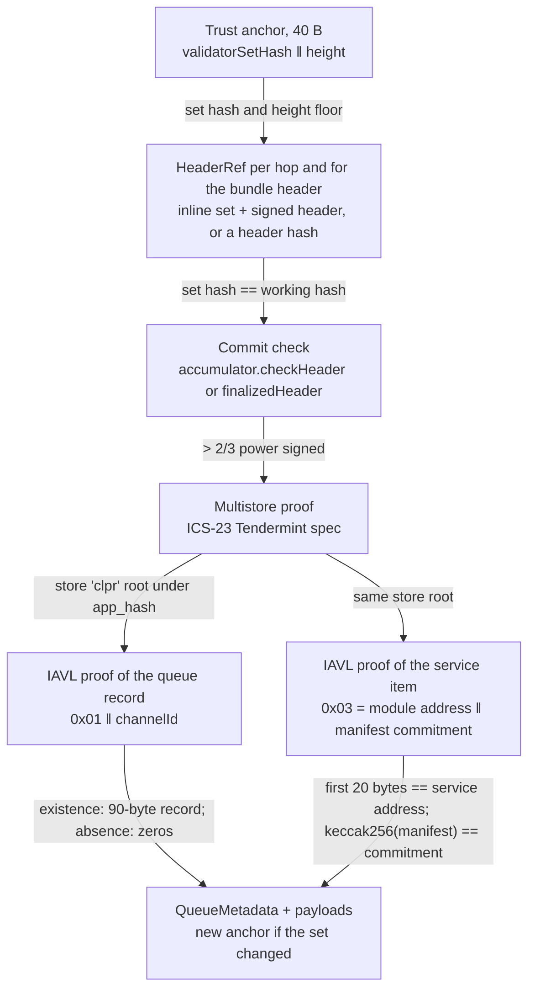
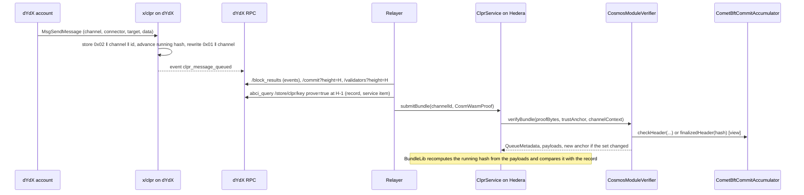

# dYdX verifier (native `x/clpr` module on CometBFT)

A "dYdX → Hiero" verifier. dYdX v4 has no contract runtime (no `wasm` store, no EVM), so its CLPR
Service has to be a **native Cosmos SDK module**. `CosmosModuleVerifier` is the Hiero half of that
prototype and [`modules/x-clpr`](../../../../modules/x-clpr/README.md) is the Go half. The verifier
runs on Hedera's EVM and proves (1) CometBFT finality of a header, meaning validators holding more
than 2/3 of the set's voting power signed it, and (2) the module's queue record in its own IAVL
store `clpr`, under that header's `app_hash`. It is `CosmWasmVerifier` with a different key
layout, so any CometBFT + Cosmos SDK chain that adds `x/clpr` uses the same contract with its own
profile.

## 1. At a glance

| | |
|---|---|
| Direction | `dYdX → Hiero` (and any Cosmos SDK chain with `x/clpr`) |
| Chains | dYdX mainnet `cosmos:dydx-mainnet-1` (CometBFT 0.38.5 fork, 21 validators); test chain `dydx-clpr-local-1` (one validator, same forks) |
| Finality source | CometBFT commit, > 2/3 of voting power: 10 of 21 dYdX validators by power |
| Trust (one line) | Honest 2/3 of each dYdX set the anchor reaches, a bootstrap checkpoint, anchor kept inside the 21-day unbonding period; module code changes only by chain upgrade |
| Typical bundle | Localnet: 1,051,913 gas, 2.0 KB (1 signature). dYdX mainnet: no `x/clpr` yet; commit + one store entry measured live at 7,033,228 gas, 3.8 KB; a bundle is estimated at 7.1–7.2M |
| Rotation | Same as a bundle at the rotation header (estimate 7.1–7.2M on mainnet). Catch-up across a rotation: two commits, about 14M (estimate), so use the accumulator split |
| Contract sizes | `CosmosModuleVerifier` 16,163 B; `CometBftCommitAccumulator` 13,104 B; `Ed25519Verifier` 12,206 B |
| Status | Prototype. Full bundle verified on a real `x/clpr` localnet; dYdX mainnet commit and IAVL proof verified live (2026-10-01) through the same pipeline with store `bank`. `x/clpr` is not on dYdX mainnet |

## 2. How it works



`verifyBundle(proofBytes, trustAnchor, channelContext)` is inherited from `CosmWasmVerifier`:

1. Decode the 40-byte anchor (`CosmWasmVerifier.sol:_decodeAnchor`).
2. Resolve hops and the header as `HeaderRef`s: inline through
   `CometBftCommitAccumulator.sol:checkHeader`, or by hash through `finalizedHeader`
   (`CosmWasmVerifier.sol:_verifiedStoreRoot`, `_resolveHeader`).
3. Verify the multistore proof for store `clpr` (profile) against `app_hash`.
4. Prove the queue record at `0x01 ‖ ctx.channelId` (`CosmosModuleVerifier.sol:_queueKey`,
   `CosmWasmVerifier.sol:_proveEntry`, `_decodeQueueRecord`). The service address is not in the key,
   because the store holds one service.
5. Prove the service item at `0x03` (`CosmosModuleVerifier.sol:_serviceKey`), whose first 20 bytes
   must equal the channel's service address (the module account, `sha256("clpr")[:20]`), and bind
   the manifest (`_proveServiceEntry`, `_bindManifest`). Addresses must be 20 bytes
   (`CosmosModuleVerifier.sol:_checkAddress`).
6. Return the new anchor when `next_validators_hash` changes.

Two entry points are added:
- `verifyQueueMessage(proof, anchor, channelId, messageId) → (payload, runningHashAfter, height)`
  proves one queued message at `0x02 ‖ channelId ‖ messageId` and requires existence
  (`CosmosModuleVerifier.sol:verifyQueueMessage`, `_decodeMessageValue`).
- `verifyModuleEntry(proof, anchor, key) → (exists, value, height)` proves any raw key of the
  profile's store. The inherited `verifyContractEntry` assumes wasmd's `0x03 ‖ contract ‖ key`
  prefix and does not apply.

## 3. Bundle lifecycle



## 4. Trust model

Trusted:
- **Honest supermajority** of every dYdX validator set the anchor reaches.
- **Bootstrap checkpoint** for `verifyConfig`, chosen by the deployer.
- **Unbonding period.** dYdX's unbonding time is 21 days (`1814400s`, live staking params). The
  light client is sequential with no trusting period, so relays must bundle at every rotation.
- **dYdX governance for module code.** The module changes only through a chain software upgrade
  (`x/gov`); there is no admin key to migrate it. Its storage layout is consensus code.

Not trusted: the relayer and callers of `accumulate`, exactly as for `CosmWasmVerifier`
([Provenance README §4](../provenance/README.md)).

To forge a bundle an attacker must control more than 2/3 of the voting power of a dYdX set the
anchor reaches, or a set older than the unbonding period that a stale anchor still names.

## 5. Proof format

The proof is `CosmWasmProof` ([Provenance README §5](../provenance/README.md)): `{1 bundle_content,
2 header, repeated 3 hop, 4 multistore_proof, 5 entry, 6 service_entry, 7 manifest_preimage,
8 ledger_configuration}`. Field 5 is the queue record for `verifyBundle`, the message entry for
`verifyQueueMessage`, and any key for `verifyModuleEntry`.

Store layout fixed by this verifier (source: `modules/x-clpr/x/clpr/types/keys.go`, store `clpr`):

| Key | Value | Proven by |
|---|---|---|
| `0x01 ‖ channel_id(32)` | Queue record, 90 B: `0x01 ‖ status u8 ‖ next_message_id u64 ‖ received_message_id u64 ‖ endpoint_manifest_version u64 ‖ sent_running_hash ‖ received_running_hash` (big-endian). Byte-identical to the CosmWasm record | `verifyBundle` |
| `0x02 ‖ channel_id(32) ‖ message_id u64 BE` | `ClprMessageValue{1 payload, 2 running_hash_after_processing}`; `payload` is the exact serialized `ClprMessagePayload` that entered the running hash | `verifyQueueMessage` |
| `0x03` | Service item: module address(20) ‖ `keccak256(ClprEndpointManifest)` (zero if unset) | `verifyBundle` (manifest), `verifyConfig` |
| `0x04 ‖ channel_id`, `0x05` | Channel bookkeeping and params | not proven |

- Every key has a fixed length within its prefix, so ICS-23 non-existence proofs work for any absent
  channel or message id.
- Running hash: `h' = sha256(h ‖ sha256(payload))`, BundleLib's form, which the Hiero-side
  ClprService recomputes. The spec's §4.1 text omits the inner hash; the module follows the
  Solidity reference.
- Payload encoding: gogoproto's encoding of the spec messages equals
  `ClprProtobuf.encodeDataMessage`. A golden vector from the localnet is checked in Go
  (`keeper_test.go`) and Solidity (`test_golden_payloadEncodingAndRunningHash`).

Deployment profile:

| Contract | Parameter | dYdX value |
|---|---|---|
| `CometBftCommitAccumulator` | `chainId`, `keyScheme`, `ed25519Verifier` | `dydx-mainnet-1`, `ED25519`, the `Ed25519Verifier` address |
| `CosmosModuleVerifier.Profile` | `accumulator` | the accumulator above |
| | `storeKey` | `clpr` |
| | `bootstrapValidatorsHash`, `bootstrapHeight` | a recent set hash and height, chosen at deployment |
| Channel config | service address | `a88f550db4433c59b3322bca3a2c233cfdd69adc` (`authtypes.NewModuleAddress("clpr")`) |

## 6. Validator-set rotation

As in the CometBFT family: any power change rotates the set, and a rotation is an ordinary bundle at
the rotation header that returns the new anchor. No rotation appeared in 1,000 sampled mainnet
blocks (about 10 min). dYdX runs 21 validators (governance proposal 396). A catch-up across one
rotation needs two 10-signature commits, about 14M gas (estimate from the measured commit), which
is near the limit, so the relay should accumulate the hop's commit first
([Provenance README §3](../provenance/README.md)).

## 7. Gas and calldata

`npm run test:e2e:dydx-xclpr` replays `test/e2e/fixtures/dydx-xclpr/` (recorded 2026-10-01;
replayed on this branch 2026-10-01). Gas is anvil `eth_estimateGas` of the whole transaction.
Hedera limits: 15,000,000 gas, 131,072 B.

| What | Data | Sigs | Gas | Calldata | ≤ 15M |
|---|---|---|---|---|---|
| `verifyBundle`: commit + `clpr` multistore + queue record + service item + manifest, 3 messages | real `x/clpr` localnet, height 158 | 1 | **1,051,913** | 2.0 KB | yes |
| `verifyQueueMessage`: one queued entry `0x02‖channel‖id` | real `x/clpr` localnet | 1 | 970,308 | 1.5 KB | yes |
| `verifyModuleEntry`: bank supply `0x00‖"adydx"` in store `bank` | live `dydx-mainnet-1`, height 107,588,323 | 10 | **7,033,228** | 3.8 KB | yes |

The mainnet row uses store `bank` because dYdX has no `clpr` store yet. It shows that dYdX's live
multistore and IAVL proofs (its IAVL v1.1.1 fork) and its 10-of-21 Ed25519 commit pass the pipeline
the module relies on. **Estimated dYdX mainnet bundle once `x/clpr` exists:** 7.03M (measured
commit + one entry) plus about 0.1M for the service item and payloads (the localnet difference)
gives about 7.1–7.2M gas, with about 7.8M to spare.

## 8. Limits and known gaps

- **Not on dYdX mainnet.** Getting `x/clpr` there needs a protocol release and a governance software
  upgrade ([module README §4](../../../../modules/x-clpr/README.md)).
- **Prototype scope on the Go side**: channels open ACTIVE without commit-reveal and `verifyConfig`;
  no connectors, fees or slashing; no inbound `submit_bundle`, so `received_message_id` and
  `received_running_hash` stay 0 (the verifier already decodes them).
- **Ed25519 cost**: about 640k gas per signature ([CometBFT README §7](../cometbft/README.md)).
- **Localnet only for the full bundle.** The full bundle was verified on a one-validator chain that
  reuses dYdX's SDK, store, IAVL and CometBFT forks, not dYdX's app.
- **Branch base.** This branch is cut from `feat/provenance-verifier`, before the
  `CometBftStoreProofBase` refactor on `feat/polythor-verifier`. It makes `_queueKey`, `_serviceKey`
  and `_checkAddress` virtual in `CosmWasmVerifier`; a rebase onto the refactor must carry that.

## 9. Upgrades and forks

dYdX ships every protocol change as a software upgrade through `x/gov` and `x/upgrade`. Under the
fork-aware verifier ADR (`ADR/2026-10-01-fork-aware-verifiers.md` in the spec fork, draft PR
LFDT-CLPR/clpr-spec#1, CometBFT row of Appendix B.1):

- **Class A** (header version, validator sets): hashed as signed, not pinned; sets follow rotation.
- **Class B** (layout): an `x/clpr` store migration that changes a key prefix or the record
  encoding breaks every proof. The record starts with a version byte (`0x01`) and the verifier
  rejects any other. A new layout needs a redeploy (ClprService pins verifiers per channel).
- **Class C** (semantic): a consensus key or header-hash change in dYdX's CometBFT fork fails closed.

Because the module and its layout are consensus code, a layout change can only arrive with a
governance-approved upgrade, so it is announced at least one voting period ahead.

## 10. Running it

```bash
forge test --match-path 'test/verifiers/evm/dydx/*'                                  # 16 tests
forge test --match-path 'test/verifiers/compliance/CosmosModuleComplianceTest.t.sol'  # 21 tests, shared suite
forge build && npm run test:e2e:dydx-xclpr      # 7 tests on the fixtures (CLPR_ANVIL_PORT_A, default 8601)
# re-record: start the modules/x-clpr localnet and run scripts/send-demo.sh, then
npm run dydx-xclpr:refresh [localnet|mainnet]
(cd modules/x-clpr && go test ./x/...)          # keeper tests, including the cross-language golden vector
```

## 11. Files

| File | What |
|---|---|
| `src/verifiers/evm/dydx/CosmosModuleVerifier.sol` | The verifier: `x/clpr` key layout, `verifyQueueMessage`, `verifyModuleEntry` |
| `src/verifiers/evm/provenance/CosmWasmVerifier.sol` | Parent: header refs, store proofs, record codec, manifest binding |
| `src/verifiers/evm/cometbft/CometBftCommitAccumulator.sol` | Commit check, inline or accumulated |
| `modules/x-clpr/` | The Go module, test chain and scripts ([README](../../../../modules/x-clpr/README.md)) |
| `test/verifiers/evm/dydx/CosmosModuleVerifier.t.sol` | 16 tests: golden vectors from Go, layout, rotation, negatives |
| `test/verifiers/compliance/CosmosModuleComplianceTest.t.sol` | Shared `IClprVerifier` compliance suite, 21 cases |
| `test/e2e/fixtures/dydx-xclpr/localnet.json`, `mainnet.json` | Recorded localnet bundle and live dYdX mainnet commit + proof |
| `test/e2e/relay/buildDydxClprFixture.ts` | Fixture refresh script |
| `test/e2e/tests/verifiers/dydx-xclpr.spec.ts` | Replay, 7 tests with negatives |
| `docs/chains/dydx.md` | Chain page |

Negative cases: bad signature, below threshold, wrong set, stale header, CosmWasm-layout keys,
another channel, 32-byte address, another service address, malformed or absent message, wrong
message id, wrong store key (Foundry); another channel, tampered record, tampered IAVL proof, wrong
manifest, 32-byte address, bad signature, wrong set, stale header, wrong store key (live spec).

## 12. References

- dydxprotocol/v4-chain `protocol/v9.7.1` `go.mod` (cosmos-sdk, store, IAVL and CometBFT forks) and
  `app/upgrades.go`, as pinned in `modules/x-clpr/go.mod`.
- `modules/x-clpr/x/clpr/types/keys.go`, `record.go`, `keeper/keeper.go`.
- Cosmos SDK `x/auth` `NewModuleAddress`; `x/gov` and `x/upgrade`.
- Fork-aware verifiers ADR, `ADR/2026-10-01-fork-aware-verifiers.md` (spec fork, draft PR
  LFDT-CLPR/clpr-spec#1).
- Live: `https://dydx-rpc.publicnode.com` (commit, validators, abci_query); dYdX REST
  (`/cosmos/gov/v1/params/*`, staking params, proposals 395 and 396).
