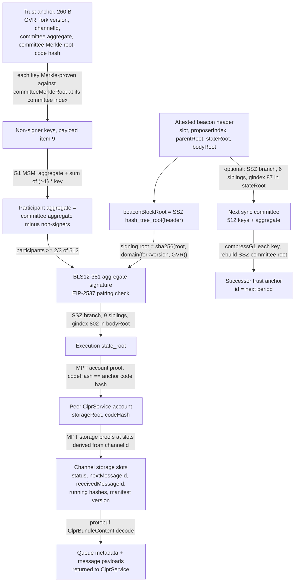
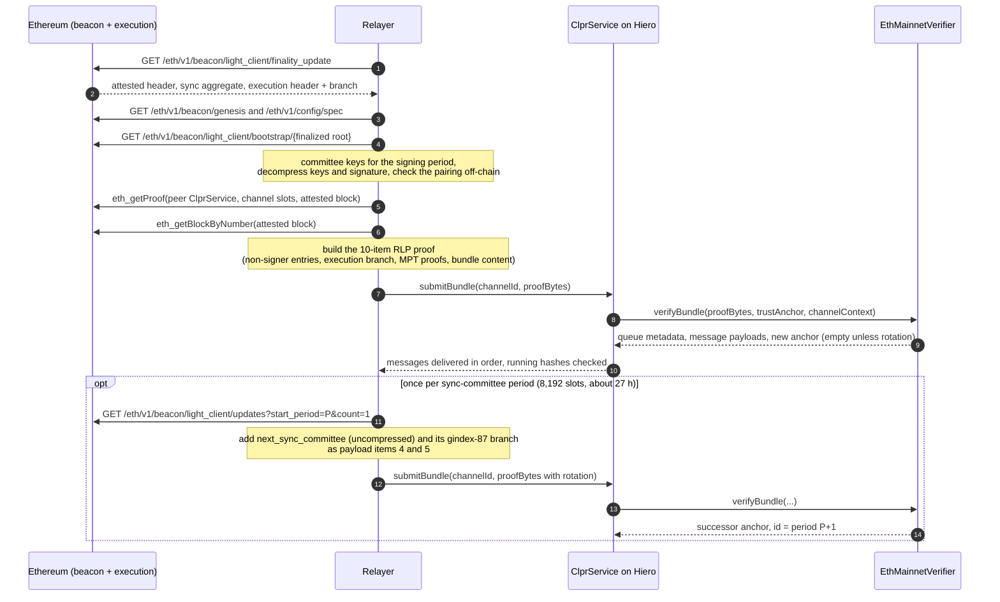

# Ethereum sync-committee verifier (`EthMainnetVerifier`)

`EthMainnetVerifier` lets a CLPR Service on Hiero accept bundles from a CLPR Service on Ethereum
(`Ethereum → Hiero`). It is an on-chain consensus-layer light client. It checks a BLS12-381 aggregate
signature from the Ethereum sync committee (512 validators) over a beacon block header, follows SSZ
Merkle branches from that header to the execution-layer state root, and then follows Merkle-Patricia
proofs to the peer `ClprService` account and its channel storage. The result is the peer's proven queue
metadata and the bundle's messages. Every 8,192 slots (about 27 hours) a bundle can also carry the next
sync committee, proven from the attested beacon state, which moves the trust anchor forward.

> **Source**: [EthMainnetVerifier.sol](./EthMainnetVerifier.sol) ·
> **Interface**: [IClprVerifier.sol](../../../interfaces/IClprVerifier.sol) ·
> **Per-chain page**: [docs/chains/ethereum.md](../../../../docs/chains/ethereum.md)

---

## 1. At a glance

| | |
|---|---|
| Chains covered | Ethereum mainnet (`eip155:1`). Live data verified from Sepolia (`eip155:11155111`). Gnosis and PulseChain reuse this verifier through `EthBeaconTwinVerifier` on a separate branch. |
| Finality source | Sync-committee BLS aggregate over the **attested** beacon header, at least 342 of 512 signers (2/3). |
| Trust assumptions | 2/3 of the current sync committee is honest; the bootstrap committee in the initial trust anchor is correct; the code hash pinned in the anchor is the peer `ClprService`. |
| Typical bundle | 1,645,052 gas, 19,140 B calldata (18,587 B `proofBytes`); Sepolia slot 11254195, 486/512 signers, ACK-only, measured on anvil and on Hedera testnet |
| Rotation | 4,836,081 gas, 66,902 B of rotation items (harness call `verifyRotationExt`, includes base and calldata; Sepolia period 1374) |
| Contract size | 19,338 B runtime, 19,364 B init code (EIP-170 margin 5,238 B) |
| Hedera limits | 15,000,000 gas and 128 KB (131,072 B) calldata per transaction: a typical bundle uses 11% of the gas and 15% of the calldata |
| Status | Live Sepolia data verified on anvil (captured 2026-09-30). `verifyBundle` executed on Hedera testnet (chain 296) on 2026-09-30: 1,645,052 gas, same as anvil. |

## 2. How it works

The proof chain, from Ethereum consensus to the values `ClprService.submitBundle` stores:



Walk-through of `verifyBundle(proofBytes, trustAnchor, channelContext)`:

1. **Decode the anchor and payload.** The anchor must be 260 bytes. The payload is an RLP list of 10 items
   (12 with the optional endpoint-manifest update). `EthMainnetVerifier.sol:verifyBundle`.
2. **Hash the attested header.** `ClprBeaconSsz.sol:beaconBlockHeaderRoot` computes the SSZ
   `hash_tree_root` of the five header fields.
3. **Check participation and the BLS signature.** `EthMainnetVerifier.sol:_verifyBlsCore` reads the 64-byte participation bitvector, requires `3 × participants ≥ 2 × 512`,
   and `_collectNonSigners` checks one Merkle entry per clear bit against the anchor's committee root
   (`ClprCommitteeMerkle.sol:verifyAndExtractKey`). `ClprBeaconSsz.sol:computeSyncCommitteeDomain` builds the
   domain from the anchor's fork version and GVR. `ClprBeaconBls.sol:aggregateVerifyComplement` subtracts
   the non-signers from the stored aggregate (one `G1MSM`), hashes the signing root to G2 (RFC 9380) and
   runs the pairing check.
4. **Prove the execution state root.** `ClprBeaconSsz.sol:verifyProof` checks a 9-sibling branch from the
   execution `state_root` to the header's `bodyRoot` at generalized index 802.
5. **Prove the peer account.** `ClprEvmBundleVerifier.sol:_verifyServiceStorageRoot` walks the account
   trie to `keccak256(remoteServiceAddress)` (address from `channelContext`) and checks `codeHash`
   against the anchor.
6. **Prove the channel storage.** `ClprEvmBundleVerifier.sol:_verifyChannelStorage` derives the five
   `Channel` slots from `channelId` (never from the proof), proves them with `ClprEvmStateProof`, and,
   when messages are carried, proves a sixth slot: the last message's running hash.
7. **Decode the messages.** `ClprEvmBundleVerifier.sol:_decodeBundleContent` reads the protobuf
   `ClprBundleContent`.
8. **Optional rotation.** `EthMainnetVerifier.sol:_verifyRotation` checks the next committee's keys are on
   the curve, recomputes the beacon SSZ committee root from them
   (`ClprBeaconSsz.sol:syncCommitteeRootFromUncompressed`), checks it against the attested `stateRoot` at
   generalized index 87, and returns the successor anchor. `newTrustAnchorId` is the next period
   (`slot / 8192 + 1`) as 8 bytes, big-endian.

All BLS points are EIP-2537 **uncompressed**. On-chain decompression is not affordable, so the relayer
sends uncompressed keys and signatures; the contract only compresses keys (the cheap direction) to rebuild
the beacon committee root at rotation.

## 3. Bundle lifecycle



## 4. Trust model

Trusted:

- **Sync-committee honesty.** At least 2/3 of the 512-member sync committee signs only canonical headers. The verifier authenticates the header the committee signed.
- **Bootstrap committee.** `verifyConfig` takes the first committee, GVR and fork version from the config
  payload. Whoever sets up the Channel must supply the real committee for that period.
- **Pinned code hash.** The anchor pins the peer `ClprService` runtime code hash. A zero code hash turns the
  check off, so deployments must pin a real one.
- **Liveness of rotation.** Someone must submit at least one rotation bundle per period. A Channel that
  misses a full period cannot catch up (section 6).

Not trusted:

- The relayer. It cannot choose the storage slots (they are derived from `channelId`), cannot pass an
  arbitrary key as a non-signer (each key is Merkle-proven at its committee index), and cannot forge the
  signing domain (the anchor fixes GVR and fork version).
- Beacon API and execution RPC providers. Every value they return is checked against the signature.

To forge a bundle an attacker must control 2/3 of one sync committee (342 validators sampled from the
whole validator set), or break BLS12-381, SHA-256 or Keccak-256.

## 5. Proof format

### Trust anchor (260 bytes, flat)

| Offset | Field | Bytes | Meaning |
|---|---|---|---|
| 0 | `genesisValidatorsRoot` | 32 | Chain-pinning root, part of the signing domain |
| 32 | `forkVersion` | 4 | Fork version of the signing domain; carried unchanged through rotations |
| 36 | `channelId` | 32 | The CLPR Channel; all storage slots are derived from it |
| 68 | `aggregatePubkey` | 128 | Uncompressed G1 sum of the 512 committee keys |
| 196 | `committeeMerkleRoot` | 32 | Keccak Merkle root over the 512 uncompressed keys (`ClprCommitteeMerkle`) |
| 228 | `codeHash` | 32 | Expected runtime code hash of the peer `ClprService` |

The 512 keys are not stored. Per bundle, the relayer supplies only the non-signers' keys.

### `proofBytes` (RLP list of 10 or 12 items)

| # | Field | Type | Meaning |
|---|---|---|---|
| 0 | `attestedHeader` | list of 5 | `[slot, proposerIndex, parentRoot, stateRoot, bodyRoot]` |
| 1 | `syncAggregate` | list of 2 | participation bits (64 B), signature (256 B uncompressed G2) |
| 2 | `executionStateRoot` | bytes32 | Execution-layer state root |
| 3 | `executionBranch` | 9 × bytes32 | SSZ siblings, gindex 802 in `bodyRoot` |
| 4 | `nextCommittee` | list or empty string | `[512 × 128 B keys, 128 B aggregate]` at rotation, else `0x80` |
| 5 | `nextCommitteeBranch` | 6 × bytes32 or empty list | SSZ siblings, gindex 87 in `stateRoot`, else `0xc0`; present only with item 4 |
| 6 | `accountProof` | list of bytes | MPT proof of the peer `ClprService` account |
| 7 | `storageProof` | 5 or 6 × `[slot, nodes]` | Five `Channel` slots; a sixth (last message running hash) when messages are carried |
| 8 | `bundleContent` | bytes | Protobuf `ClprBundleContent` |
| 9 | `nonSignerProofs` | list of 416 B | `key (128 B) ‖ 9 Merkle siblings (288 B)` per clear bit, ascending; empty at 512/512 |
| 10, 11 | manifest proof, preimage | optional | Endpoint-manifest storage proof and preimage (ADR 2026-07-03) |

Proven `Channel` slots (base `keccak256(channelId, 15)`): `+1` verifier, status, `nextMessageId`;
`+2` acked, received and next-expected-reply ids; `+4` `sentRunningHash`; `+5` `receivedRunningHash`;
`+16` `endpointManifestVersion`. The sixth slot is
`_messageQueues[channelId][nextMessageId − 1].runningHashAfterProcessing`.

### Configuration (`verifyConfig`)

`configProofBytes` is RLP `[slot, [512 keys, aggregate], gvr, forkVersion, ledgerConfiguration, codeHash]`.
It returns the 260-byte anchor and an anchor id equal to `slot / 8192`. The peer service address comes
from the proven ledger configuration and is passed to every later call in `channelContext`.

Per-deployment values: GVR, fork version, bootstrap committee and slot, peer `ClprService` code hash.
The contract itself has no constructor parameters.

## 6. Sync-committee rotation

- **What moves.** The committee changes every 256 epochs = 8,192 slots, about 27.3 hours.
- **How.** A bundle whose attested header is in period P carries `next_sync_committee` (the committee of
  P+1) and its branch. The verifier checks the branch against the attested `stateRoot` and returns a new
  anchor. The id is P+1.
- **Cost.** 4,836,081 gas and 66,902 B for the rotation items alone (Sepolia period 1374, measured through
  the harness on anvil). A bundle that also carries messages adds the normal bundle cost.
- **Catch-up limit.** Only the current committee can sign a rotation. If no rotation lands during
  period P, the period-P anchor cannot verify anything signed in P+1 or later, and the Channel needs a new
  trust anchor. The relayer must submit one rotation per period.
- **Archive depth.** The rotation update's attested block is older than a non-archive node's
  `eth_getProof` window, so in the live fixture the rotation is verified on its own, not inside a full
  bundle. A relayer that wants one transaction per rotation needs an archive execution node, or submits the
  rotation with a fresh block from the same period.

## 7. Gas and calldata

Measured on real Sepolia (Fulu) data from `test/e2e/fixtures/sepolia-live/capture.json` (captured
2026-09-30, slot 11254195, 486/512 signers, 26 non-signers, 9-node account proof, ACK-only bundle).

| Measurement | Network | Gas | Calldata | Source |
|---|---|---|---|---|
| `verifyBundle` | anvil | 1,645,052 (21,000 base + 291,516 calldata + ~1,332,536 execution) | 19,140 B (18,587 B proof) | `eth-live-sepolia.spec.ts` |
| `verifyBundle` | Hedera testnet, HAPI 0.77.2 | 1,645,052 (receipt), 1.5792 HBAR | 19,140 B, one jumbo `EthereumTransaction` | `hiero-gas-hedera-testnet.json`, 2026-09-30 |
| deploy `EthMainnetVerifier` | Hedera testnet | 4,213,415, 4.0449 HBAR | 19,364 B | `hiero-gas-hedera-testnet.json` |
| rotation (`verifyRotationExt`) | anvil | 4,836,081 (incl. base and calldata) | 66,902 B rotation items | `eth-live-sepolia.spec.ts`, period 1374 |

Hedera testnet transactions (public): verify
`0xaf0b0238d6a430d2750e60648d5b2d7af92990e948303dd662e0b1ee38b71d91` (repeated as
`0xaafc66c2…6af75` with identical gas), deploy `0xed82231d…c6e3a694`, verifier
`0x92646d66a66e93411d6f679f4b4befebdb3371bd`. Testnet charged 96 tinybar per gas.

Synthetic hot-path benchmarks (generator committee, `test/verifiers/evm/ethereum/GasUsage.t.sol`,
tracked in `script/gas/baselines.yml`):

| Step | Gas |
|---|---|
| hash-to-G2 | 113,934 |
| BLS `aggregateVerifyComplement`, 342 signers (170 non-signers) | 1,348,432 |
| BLS `aggregateVerifyComplement`, 512 signers | 218,662 |
| SSZ `syncCommitteeRootFromUncompressed`, 512 keys | 1,187,812 |

Cost grows with the number of non-signers: each adds one 419-byte RLP entry (at most 6,704 calldata gas)
and one MSM term. At the 342-signer minimum the BLS step alone is 1.35M gas. Both a typical bundle and a
rotation fit Hedera's 15M gas and 128 KB calldata limits.

## 8. Limits and known gaps

- **No ClprService on Sepolia yet.** The live bundle targets the Sepolia deposit contract with its real
  code hash; the channel slots are empty there, so the storage step checks real MPT **exclusion** proofs
  and returns zeroed metadata. A non-empty queue on a live chain has not been proven yet.
- **Rotation inside a full bundle** needs `eth_getProof` at the rotation update's block, which public
  non-archive nodes no longer serve (section 6).
- **Fork version is fixed per anchor.** A fork that changes the fork version stops the Channel until the
  anchor is updated (section 9).
- **Solo cannot run it.** Local Solo (consensus v0.74, EVM v0.67) has no EIP-2537 precompiles and reverts
  with `BlsPrecompileCallFailed`. Hedera testnet has them.
- **Light-client forks.** The proof builder accepts only `electra` and `fulu` light-client data.

## 9. Upgrades and forks

- **Fork version (Class A in the ADR).** The signing domain uses the anchor's 4-byte fork version, which
  rotation carries forward unchanged. When Ethereum activates a fork with a new version, every later
  signature fails (`BlsSignatureInvalid`) until the anchor carries the new version. The live spec checks
  that the real Fulu signature fails under the Electra version. BPO forks do not change the fork version.
- **Layout (Class B).** The generalized indices 802 (execution `state_root` in the body) and 87
  (`next_sync_committee` in the state) match the live Electra/Fulu layouts. A fork that deepens
  `BeaconBlockBody` or `BeaconState` moves them and needs new constants.
- **Semantic (Class C).** Gloas (EIP-7732) moves the execution payload out of `BeaconBlockBody`; this
  verifier cannot prove the execution state root after it without new code.
- **Fork-aware verifiers ADR.** `ADR/2026-10-01-fork-aware-verifiers.md` in the spec fork (draft PR
  LFDT-CLPR/clpr-spec#1) uses this verifier as its reference: fork evidence from `BeaconState.fork`
  (generalized index 67), fork profiles armed by dual control, and typed reverts
  (`ClprForkUnsupported`, `ClprForkBoundary`). None of this is implemented here yet; today a fork-version
  change needs a new Channel or anchor.

## 10. Running it

```sh
# Unit, gas and compliance tests (Foundry)
forge test --match-path 'test/verifiers/{evm/ethereum/*,compliance/EthMainnetComplianceTest.t.sol}'

# Live Sepolia fixture replay on anvil (needs anvil on PATH; builds artifacts first)
forge build
npm run test:e2e:eth-live

# Re-capture the live fixture (public Sepolia beacon API + execution RPC;
# waits up to 10 minutes for an aggregate with non-signers)
npm run eth-live:refresh

# Synthetic end-to-end spec on anvil
npm run test:e2e:eth-verifier

# Measure verifyBundle on Hiero (testnet spends testnet HBAR; reads the key from --env <file>)
npm run gas:eth-verifier:testnet
npm run gas:eth-verifier:testnet -- --verifier 0x92646d66a66e93411d6f679f4b4befebdb3371bd   # verify only
npm run gas:eth-verifier:solo
```

Results on this branch (2026-10-01): Foundry 62 passed, 1 skipped (4 suites); live replay 8 of 8 passed.

## 11. Files

| File | Purpose |
|---|---|
| `src/verifiers/evm/ethereum/EthMainnetVerifier.sol` | The verifier: anchor, BLS, SSZ, rotation, config |
| `src/verifiers/evm/common/ClprEvmBundleVerifier.sol` | Shared EVM account/storage proof, slot derivation, bundle decode |
| `src/libraries/proof/beacon/ClprBeaconSsz.sol` | SSZ branches, header and committee roots, signing domain |
| `src/libraries/proof/beacon/ClprBeaconBls.sol` | EIP-2537 aggregate verification, hash-to-G2, pairing, curve checks |
| `src/libraries/proof/beacon/ClprBls12381.sol` | BLS12-381 point compression (`compressG1`) |
| `src/libraries/proof/beacon/ClprCommitteeMerkle.sol` | Keccak Merkle commitment over the 512 committee keys |
| `src/libraries/proof/evm/ClprEvmStateProof.sol` | MPT account and storage proofs |
| `test/verifiers/evm/ethereum/EthMainnetVerifier.t.sol` | Unit and negative tests; `EthMainnetVerifierProofHarness` |
| `test/verifiers/evm/ethereum/EthCommitteeFixtures.sol` | Generator committee fixtures |
| `test/verifiers/evm/ethereum/GasUsage.t.sol` | BLS and SSZ hot-path gas benchmarks |
| `test/verifiers/evm/ethereum/RotationGas.t.sol` | Rotation sub-step gas breakdown |
| `test/verifiers/compliance/EthMainnetComplianceTest.t.sol` | Shared `IClprVerifier` compliance suite |
| `test/e2e/relay/buildEthLiveProof.ts` | Live proof builder and fixture refresh |
| `test/e2e/relay/buildEthMainnetProof.ts` | Synthetic proof builder for the anvil spec |
| `test/e2e/tests/verifiers/eth-live-sepolia.spec.ts` | Live fixture replay on anvil |
| `test/e2e/tests/verifiers/eth-verifier.spec.ts` | Synthetic end-to-end spec |
| `test/e2e/fixtures/sepolia-live/capture.json` | Captured Sepolia beacon and execution responses |
| `test/e2e/fixtures/sepolia-live/hiero-gas-hedera-testnet.json` | Hedera testnet deploy and verify measurement |
| `test/e2e/lib/ethVerifierOnHiero.ts`, `script/gas/eth-verifier-hiero.ts` | Hiero gas measurement |
| `script/gas/baselines.yml` | Gas regression baselines |

## 12. References

- Ethereum consensus specs, Altair light client sync protocol:
  <https://github.com/ethereum/consensus-specs/blob/dev/specs/altair/light-client/sync-protocol.md>
- Beacon API light-client endpoints: <https://ethereum.github.io/beacon-APIs/>
- EIP-2537, BLS12-381 precompiles: <https://eips.ethereum.org/EIPS/eip-2537>
- RFC 9380, hashing to elliptic curves: <https://www.rfc-editor.org/rfc/rfc9380>
- EIP-7732, enshrined proposer-builder separation (Gloas): <https://eips.ethereum.org/EIPS/eip-7732>
- HIP-1086, jumbo Ethereum transactions: <https://hips.hedera.com/hip/hip-1086>
- CLPR spec and fork-aware verifiers ADR (draft PR LFDT-CLPR/clpr-spec#1):
  <https://github.com/LFDT-CLPR/clpr-spec>
