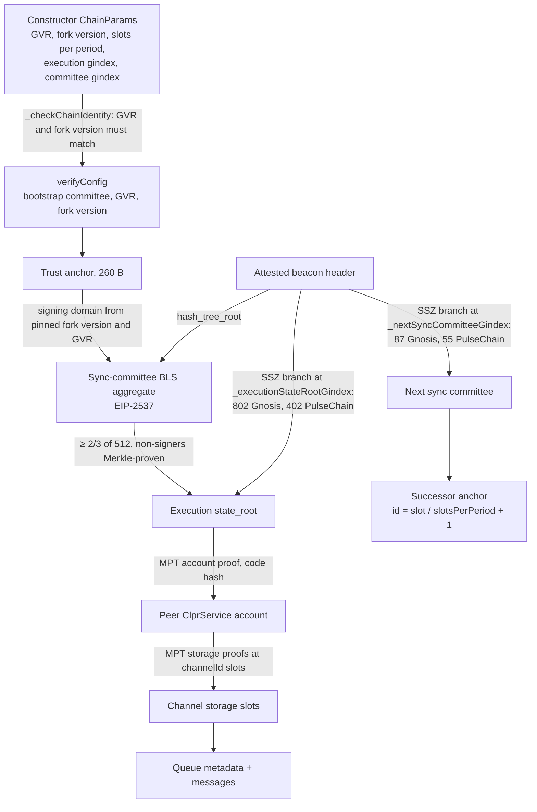
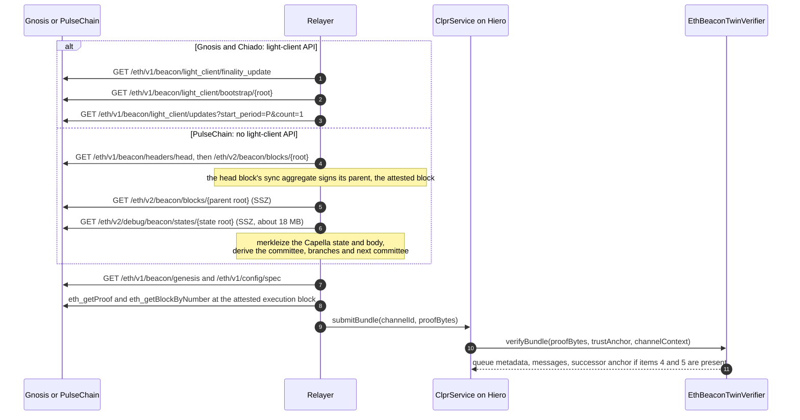

# Ethereum twins: Gnosis Chain and PulseChain (`EthBeaconTwinVerifier`)

`EthBeaconTwinVerifier` lets a CLPR Service on Hiero accept bundles from beacon chains built from
Ethereum's consensus specs: Gnosis Chain and PulseChain, plus their testnets Chiado and PulseChain
testnet v4 (`<chain> → Hiero`). It is `EthMainnetVerifier` with the chain parameters fixed per
deployment. The light client is the same: a BLS12-381 sync-committee signature over the attested beacon
header, SSZ branches to the execution state root, and MPT proofs of the peer `ClprService` channel
storage. Only five values differ per chain: the genesis validators root (GVR), the fork version, the
period length, and two SSZ generalized indices that depend on the chain's active fork.

> **Source**: [EthBeaconTwinVerifier.sol](./EthBeaconTwinVerifier.sol), [EthTwinPresets.sol](./EthTwinPresets.sol) ·
> **Base verifier**: [../ethereum/README.md](../ethereum/README.md) ·
> **Per-chain pages**: [gnosis.md](../../../../docs/chains/gnosis.md), [pulsechain.md](../../../../docs/chains/pulsechain.md)

---

## 1. At a glance

| | Gnosis Chain | PulseChain |
|---|---|---|
| Chains (CAIP-2) | Gnosis `eip155:100`, Chiado `eip155:10200` | PulseChain `eip155:369`, testnet v4 `eip155:943` |
| Active fork | Fulu | Capella (no Deneb scheduled) |
| Finality source | Sync-committee BLS aggregate (≥ 342 of 512) over the attested header | same |
| Trust assumptions | 2/3 of the current sync committee; the bootstrap committee; GVR and fork version pinned at deployment | same; the validator set is smaller and PLS-staked |
| Typical bundle | 1,934,671 gas, 23,108 B calldata (494/512) | 1,320,015 gas, 12,452 B calldata (502/512) |
| Rotation | 4,836,051 gas, 66,902 B rotation items (harness, alone) | 6,195,813 gas, 79,300 B calldata (rotation bundle) |
| Period | 16 × 512 = 8,192 slots of 5 s, about 11.4 h | 32 × 256 = 8,192 slots of 10 s, about 22.8 h |
| Contract size | `EthBeaconTwinVerifier` 20,182 B runtime, 20,809 B init code (EIP-170 margin 4,394 B) | same contract |
| Status | Live Gnosis and Chiado data verified on anvil (captured 2026-10-01) | Live PulseChain and testnet v4 data verified on anvil (captured 2026-10-01) |

All cases fit Hedera's 15,000,000 gas and 128 KB calldata limits. None has been run on Hedera testnet
yet; the same code path on an Ethereum bundle used the same gas on Hedera testnet as on anvil
(1,645,052, see the base README).

## 2. How it works

The proof chain is the base verifier's. The twin changes only the parameters shown on the edges.



Walk-through (the base README section 2 has every step in detail):

1. `EthBeaconTwinVerifier.sol:constructor` stores the five chain parameters as immutables and derives the
   branch depths (`floor(log2(gindex))`). It rejects a zero GVR, a zero period or a gindex below 2.
2. `EthMainnetVerifier.sol:verifyConfig` calls the hook `_checkChainIdentity`. The twin reverts with
   `ChainIdentityMismatch` unless the config's GVR and fork version equal the pinned ones.
3. `EthMainnetVerifier.sol:verifyBundle` runs the base steps: header root, `_verifyBlsCore` (2/3 check,
   non-signer Merkle proofs, pairing), execution branch, account proof, channel storage, bundle content.
4. The execution branch uses `_executionStateRootGindex()`: 802 (depth 9) on Fulu, 402 (depth 8) on
   Capella.
5. `_verifyRotation` uses `_nextSyncCommitteeGindex()`: 87 (depth 6) on Fulu, 55 (depth 5) on Capella.
6. `newTrustAnchorId` uses `_slotsPerSyncCommitteePeriod()` (8,192 on all four networks).

`EthMainnetVerifier` gained these four `internal virtual` hooks with Ethereum defaults; its runtime size
went from 19,338 B to 19,216 B.

## 3. Bundle lifecycle



On PulseChain every bundle's state already contains `next_sync_committee`, so any bundle can rotate. On
Gnosis the rotation comes from `light_client/updates`.

## 4. Trust model

Trusted:

- **2/3 of the current sync committee** signs only canonical headers. The verifier checks the attested
  header, not finality.
- **The bootstrap committee** passed to `verifyConfig` (trust on first use). The twin pins the GVR and
  fork version, so a Channel cannot be configured with another chain's identity, but the committee
  itself is taken from the config payload.
- **The pinned peer code hash** in the anchor.
- **PulseChain's validator set.** Its sync committee is drawn from a smaller, PLS-staked set, so the
  economic cost of corrupting 2/3 of a committee is lower than on Ethereum.

Not trusted: the relayer and the RPC or beacon API providers. Storage slots come from `channelId`,
non-signer keys are Merkle-proven at their committee index, and the signing domain comes from the anchor.

To forge a bundle an attacker must control 342 of the 512 members of one sync committee of that chain,
or break BLS12-381, SHA-256 or Keccak-256.

## 5. Proof format

The trust anchor (260 bytes) and `proofBytes` (RLP list of 10 or 12 items) are exactly the base
verifier's; see [../ethereum/README.md](../ethereum/README.md) section 5. Only the branch lengths
change with the gindex: item 3 has 9 siblings (Gnosis) or 8 (PulseChain), item 5 has 6 or 5.

Constructor `ChainParams`:

| Field | Type | Meaning | Gnosis | Chiado | PulseChain | PulseChain testnet v4 |
|---|---|---|---|---|---|---|
| `genesisValidatorsRoot` | bytes32 | Signing-domain chain root | `0xf5dc…9d47` | `0x9d64…4c1e` | `0x3357…0c90` | `0xd816…4e64` |
| `forkVersion` | bytes4 | Signing-domain fork version | `0x06000064` (Fulu) | `0x0600006f` (Fulu) | `0x0000036c` (Capella) | `0x00000946` (Capella) |
| `slotsPerSyncCommitteePeriod` | uint64 | Period length, for the anchor id | 16 × 512 | 16 × 512 | 32 × 256 | 32 × 256 |
| `executionStateRootGindex` | uint64 | `execution_payload.state_root` in `BeaconBlockBody` | 802 | 802 | 402 | 402 |
| `nextSyncCommitteeGindex` | uint64 | `next_sync_committee` in `BeaconState` | 87 | 87 | 55 | 55 |

Full values are in `EthTwinPresets.{gnosis,chiado,pulsechain,pulsechainTestnetV4}()`. They were read from
each chain's public beacon API on 2026-10-01 (`/eth/v1/beacon/genesis`, `/eth/v1/config/spec`,
`/eth/v1/config/fork_schedule`) and checked against live data:

- **Gnosis and Chiado (Fulu).** The light-client `execution_branch` (gindex 25) composed with the
  17-field `ExecutionPayloadHeader` folds to `body_root` at 802. `next_sync_committee_branch` folds to the
  attested `state_root` at 87.
- **PulseChain (Capella).** The full SSZ `BeaconState` re-merkleized with the Capella schema (28 fields)
  hashes to the header's `state_root`; `next_sync_committee` is field 23 of 32 leaves, so gindex 55.
  The 11-field `BeaconBlockBody` hashes to `body_root`; `execution_payload` (gindex 25) times the
  15-field payload (`state_root` at gindex 18) gives 402.

## 6. Sync-committee rotation

- **Cadence.** 8,192 slots on every network: about 11.4 h on Gnosis and Chiado (5 s slots), about 22.8 h
  on PulseChain (10 s slots). One rotation must land per period.
- **Cost.**
  - Gnosis: `_verifyRotation` alone is 4,836,051 gas for 66,902 B of rotation items (Chiado 4,836,099).
    A Gnosis bundle carrying a rotation is not measured as one transaction; adding the typical bundle
    gives about 6.8M gas and 90,010 B.
  - PulseChain: a full rotation bundle is 6,195,813 gas and 79,300 B calldata (testnet v4: 6,202,941
    gas, 79,972 B).
- **Archive depth.**
  - Gnosis: the light-client update for a period is usually older than the public RPCs' `eth_getProof`
    window (about 128 blocks on publicnode, under 40 on others). Without an archive RPC the relayer
    proves the rotation from a recent attested header.
  - PulseChain: `next_sync_committee` comes from the same recent state as the bundle, so no archive
    node is needed.
- **Catch-up.** As in the base verifier, a missed period cannot be recovered; the Channel needs a new
  anchor.

## 7. Gas and calldata

Measured with `eth_estimateGas` on anvil, on live captures from 2026-10-01
(`test/e2e/fixtures/ethtwins-live/*.json`, `npm run test:e2e:ethtwins-live`, re-run 2026-10-01).

| Bundle | Participation | proofBytes | Calldata | Gas |
|---|---|---|---|---|
| Gnosis, typical (slot 30365892) | 494/512 | 22.5 KB | 23,108 B | 1,934,671 |
| Chiado, typical (slot 25085300) | 452/512 | 43.6 KB | 44,196 B | 2,926,126 |
| PulseChain, typical (slot 10703719) | 502/512 | 11.9 KB | 12,452 B | 1,320,015 |
| PulseChain testnet v4, typical (slot 10946641) | 500/512 | 12.5 KB | 13,092 B | 1,326,191 |
| PulseChain, rotation bundle (period 1307) | 502/512 | 78.7 KB | 79,300 B | 6,195,813 |
| PulseChain testnet v4, rotation bundle (period 1337) | 500/512 | 79.4 KB | 79,972 B | 6,202,941 |
| Gnosis `_verifyRotation` alone, harness (period 3707) | n/a | 66,902 B rotation items | n/a | 4,836,051 |
| Chiado `_verifyRotation` alone, harness (period 3063) | n/a | 66,902 B rotation items | n/a | 4,836,099 |

Every case is inside Hedera's limits (15M gas, 128 KB calldata). Calldata grows by 416 B per
non-signer (one key and its Merkle proof). At the 2/3 threshold there can be 170 non-signers, about
71 KB extra, which a rotation bundle cannot also carry within 128 KB; the relayer should rotate with a
well-signed header.

## 8. Limits and known gaps

- **No ClprService on these chains yet.** The bundles prove each chain's beacon deposit contract (real
  code and storage). The channel slots are empty there, so the storage step checks real MPT exclusion
  proofs.
- **Not run on Hedera yet.** Only the Ethereum bundle has been executed on Hedera testnet.
- **PulseChain has no light-client API.** Lighthouse-Pulse v2.5.1 answers 404 on every
  `/eth/v1/beacon/light_client/*` route. The relayer downloads the full state (about 18 MB, about 1.4 s
  to merkleize) for every bundle. Whether a self-hosted node can enable a light-client server was not
  checked.
- **Replay** is handled by `ClprService` (message ids and running hashes); the verifier is stateless.
  After a rotation, the old committee's bundles fail (`test_rejectsStaleCommitteeAfterRotation`).

### Hiero → Gnosis and Hiero → PulseChain

- **Gnosis and Chiado** run an Osaka-level EVM: EIP-2537 is present (G1ADD on two points at infinity
  returns 128 zero bytes) and MCOPY, TSTORE and CLZ work. The Hiero verifier contracts can be deployed
  there; no deployment or test exists yet.
- **PulseChain** runs erigon 2.4.1 at Shanghai level. Checked with `eth_call` against
  `rpc.pulsechain.com` and `rpc.v4.testnet.pulsechain.com`: no EIP-2537 (`0x0b` returns empty output,
  `eth_getCode(0x0d)` is empty), no Cancun opcodes (MCOPY, TSTORE and BLOBHASH are invalid), no Osaka
  (CLZ undefined, no KZG precompile `0x0a`). PUSH0, the BN254 precompiles `0x06`–`0x08` and
  `eth_getProof` are present. A Hiero → PulseChain verifier would need BLS12-381 in plain EVM code
  (gas-prohibitive) or a SNARK wrapper over BN254, and contracts rebuilt for Shanghai.

## 9. Upgrades and forks

- **Fork version (Class A in the ADR).** It is an immutable and also sits in the anchor. A fork that
  changes it needs a new deployment and a reconfigured Channel.
- **Layout (Class B).** The gindices depend on the fork: Capella 402/55, Deneb 802/55, Electra and Fulu
  802/87. Gnosis Electra → Fulu kept 802/87. PulseChain moving to Deneb would give 802/55, and to
  Electra 802/87; either needs a new deployment today. The tests check that each chain's bundle fails
  under the other layout (`test_pulsechainBundle_rejectedUnderElectraLayout`,
  `test_gnosisBundle_rejectedUnderCapellaLayout`).
- **Semantic (Class C).** Gloas (EIP-7732) moves the execution payload out of the block body and breaks
  the execution branch for every member of this family.
- **Fork-aware verifiers ADR.** `ADR/2026-10-01-fork-aware-verifiers.md` in the spec fork (draft PR
  LFDT-CLPR/clpr-spec#1) lists Gnosis in the Ethereum beacon family (fork evidence: the signing domain and
  `BeaconState.fork`). Its fork profiles would replace redeployment for Class A and B changes. It is not
  implemented here.

## 10. Running it

```sh
# Foundry: 23 twin tests on the real Gnosis and PulseChain fixtures, plus the base verifier's tests
forge test --match-path 'test/verifiers/evm/{ethtwins,ethereum}/*'
forge test --match-path 'test/verifiers/compliance/EthMainnetComplianceTest.t.sol'

# Live replay of all four captures on anvil (port CLPR_ANVIL_PORT_A, default 8611)
forge build
npm run test:e2e:ethtwins-live

# Re-capture all four networks and the Foundry fixtures (public endpoints)
npm run ethtwins-live:refresh
```

Results on this branch (2026-10-01): Foundry 58 passed (twins 23, ethereum 35), compliance 27 passed and
1 skipped, live replay 17 of 17 passed.

The Foundry tests cover: both live bundles, a PulseChain rotation bundle, a Gnosis rotation,
`verifyConfig` with the live committee, and the negative cases (bad signature, wrong fork version,
341/512 participation, wrong validator set, stale committee after rotation, cross-chain replay, foreign
chain identity in config, swapped layouts, wrong execution root, wrong account and storage proofs,
another channel, wrong code hash).

## 11. Files

| File | Purpose |
|---|---|
| `src/verifiers/evm/ethtwins/EthBeaconTwinVerifier.sol` | The verifier: immutables and hook overrides |
| `src/verifiers/evm/ethtwins/EthTwinPresets.sol` | Recorded parameters for the four networks |
| `src/verifiers/evm/ethereum/EthMainnetVerifier.sol` | Base verifier with the four `internal virtual` hooks |
| `test/verifiers/evm/ethtwins/EthBeaconTwinVerifier.t.sol` | 23 Foundry tests on live fixtures |
| `test/verifiers/evm/ethtwins/fixtures/{gnosis,pulsechain}.json` | Foundry fixtures built from the captures |
| `test/e2e/fixtures/ethtwins-live/{gnosis,chiado,pulsechain,pulsechain-testnet}.json` | Raw live captures |
| `test/e2e/relay/buildEthTwinsLiveProof.ts` | Capture and refresh, light-client or SSZ-state path |
| `test/e2e/relay/ssz.ts` | Capella `BeaconState` and `BeaconBlockBody` merkleization |
| `test/e2e/relay/buildEthLiveProof.ts` | Shared proof builder (chain layout parameters) |
| `test/e2e/tests/verifiers/ethtwins-live.spec.ts` | Live replay on anvil, one verifier per network |

## 12. References

- Gnosis beacon API (public): <https://gnosis-beacon-api.publicnode.com>, Chiado <https://rpc-gbc.chiadochain.net>
- PulseChain beacon API (public): <https://rpc-pulsechain.g4mm4.io/beacon-api>, testnet
  <https://rpc-testnet-pulsechain.g4mm4.io/beacon-api>
- Ethereum consensus specs (Capella, Deneb, Electra, Fulu containers; light client):
  <https://github.com/ethereum/consensus-specs>
- EIP-2537: <https://eips.ethereum.org/EIPS/eip-2537>; EIP-7732: <https://eips.ethereum.org/EIPS/eip-7732>
- CLPR spec and fork-aware verifiers ADR (draft PR LFDT-CLPR/clpr-spec#1): <https://github.com/LFDT-CLPR/clpr-spec>
