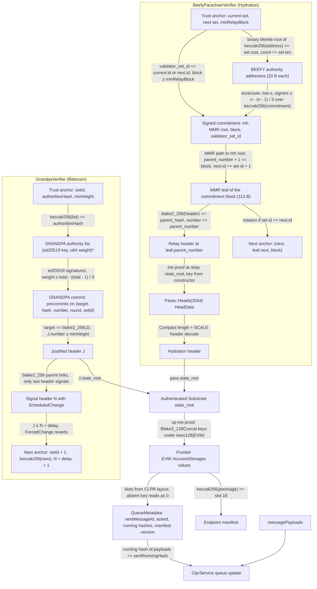
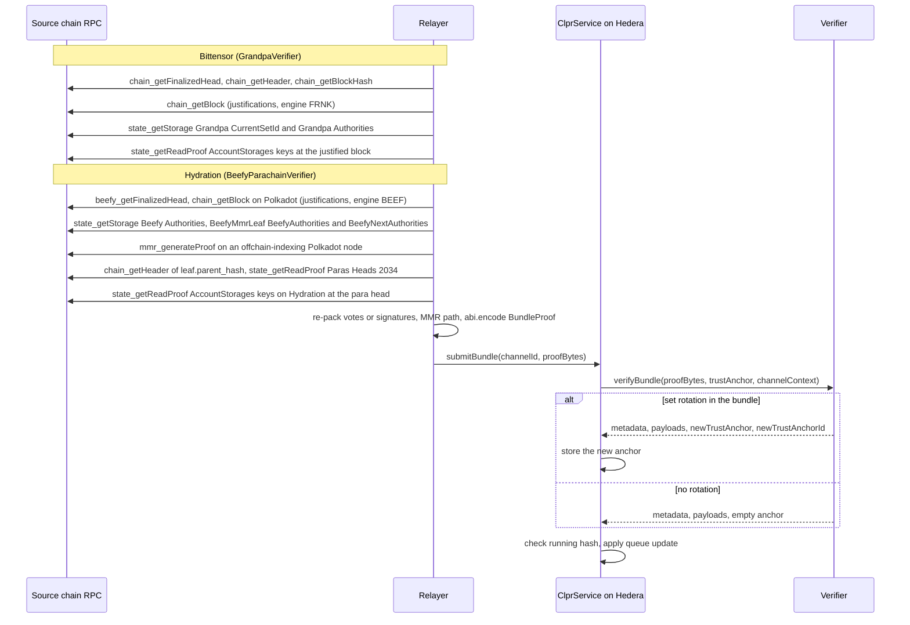

# Substrate verifiers: GRANDPA and BEEFY

This family holds two "Substrate chain → Hiero" verifiers that run on Hedera's EVM.
[`GrandpaVerifier`](./GrandpaVerifier.sol) covers a Substrate solo chain that finalizes with its own GRANDPA
(Bittensor). [`BeefyParachainVerifier`](./BeefyParachainVerifier.sol) covers a Polkadot parachain that is finalized
through the relay chain's BEEFY gadget (Hydration). Each verifier proves two things: that a block is final, and the
values of the CLPR Service's queue storage in that block. The CLPR Service on these chains is a Solidity contract on
the chain's Frontier EVM (`pallet_evm`). Its storage sits in the Substrate state trie, not in an Ethereum MPT, so the
existing MPT-based EVM verifiers do not apply. Both verifiers share the state layer in
[`SubstrateEvmVerifierBase`](./SubstrateEvmVerifierBase.sol) and the libraries in
[`libraries/proof/substrate`](../../../libraries/proof/substrate) (`Blake2b`, `ScaleCodec`, `SubstrateHeader`,
`SubstrateTrie`, `GrandpaLib`, `BeefyLib`). Ed25519 goes through the pure-Solidity
[`Ed25519Verifier`](../sei/Ed25519Verifier.sol). Interface: [`IClprVerifier`](../../../interfaces/IClprVerifier.sol).

Per-chain pages: [Bittensor](../../../../docs/chains/bittensor.md) ·
[Hydration](../../../../docs/chains/hydration.md) · [index](../../../../docs/chains/README.md).

## At a glance

| | Bittensor | Hydration |
|---|---|---|
| Verifier | `GrandpaVerifier` | `BeefyParachainVerifier` |
| Direction | Bittensor → Hiero | Hydration → Hiero |
| Chain id checked by `verifyConfig` (CAIP-2) | `eip155:964` | `eip155:222222` |
| Kind | Solo chain (Aura + GRANDPA + Frontier) | Polkadot parachain 2034 (Frontier) |
| Finality source | Its own GRANDPA, ed25519 | Polkadot relay chain BEEFY, secp256k1 |
| Signers per live proof | 14 of 20 authorities | 401 of 600 relay validators |
| Head of the chain | Justified header | `Paras::Heads(2034)` in relay state |
| EVM storage | `EVM::AccountStorages` (Frontier) | `EVM::AccountStorages` (Frontier) |
| Trust (one line) | > 2/3 of the GRANDPA set's weight is honest; weak-subjectivity bootstrap | > 2/3 of the Polkadot BEEFY set is honest; weak-subjectivity bootstrap |
| Typical bundle (live) | 9.36M gas, 14.3 KB | 4.22M gas, 52.5 KB |
| Bundle with set rotation (live) | 9.34M gas, 14.1 KB | 4.16M gas, 50.9 KB; 7.39M gas, 91.7 KB with a catch-up hop |
| Contract size | `GrandpaVerifier`: 17,750 B | `BeefyParachainVerifier`: 19,361 B |
| Extra deployment | `Ed25519Verifier`: 12,206 B | none |
| Status | Live mainnet data (finney) replayed on anvil, recorded 2026-10-01 | Live Polkadot + Hydration mainnet data replayed on anvil, recorded 2026-10-01 |
| Same verifier, another profile | Bifrost Network (`eip155:3068`, 19 authorities, threshold 13): 8.44M gas, 8.1 KB typical; 8.43M gas, 8.4 KB rotation; live mainnet, recorded 2026-10-01 ([page](../../../../docs/chains/bifrost-network.md)) | none |
| Native-pallet variant | Chainflip (`polkadot:8b8c140b0af9db70686583e3f6bf2a59`, 139 authorities, threshold 95): [`GrandpaPalletVerifier`](./GrandpaPalletVerifier.sol) (17,272 B) reads a `pallet-clpr` record; [`GrandpaCommitAccumulator`](./GrandpaCommitAccumulator.sol) (6,126 B) checks the 92 signatures over 5 transactions (≤ 12.23M gas each), then the bundle costs 0.56M gas, 10.4 KB; live mainnet, recorded 2026-10-01; no CLPR pallet exists ([page](../../../../docs/chains/chainflip.md)) | none |

The gas and calldata figures are `eth_estimateGas` of the full transaction on anvil (Prague rules, so EIP-7623
calldata pricing applies). They come from the live fixtures recorded on 2026-10-01 (see
[Gas and calldata](#gas-and-calldata)). Hedera's limits are 15M gas and 128 KB of calldata. No ClprService is
deployed on either chain yet (see [Limits and known gaps](#limits-and-known-gaps)).

## How it works

Both verifiers end in the same state layer. Only the way they authenticate a `state_root` differs.



Walk-through, `GrandpaVerifier`:

1. `GrandpaVerifier.sol:verifyBundle` decodes the 44-byte anchor (`_decodeAnchor`) and the `BundleProof`, then calls
   `GrandpaVerifier.sol:_applySteps` for each step.
2. The step's authority list must hash to the anchor: `GrandpaLib.sol:authoritiesHash`. The list is the packed
   GRANDPA list `(ed25519 key ‖ weight u64 LE)*`. Those are exactly the bytes inside a `ScheduledChange` digest, so a
   rotation needs no re-encoding.
3. `headers[0]` is the justified block J. `SubstrateHeader.sol:decode` parses it, and J.number must be at least
   `minHeight`. Each `headers[k+1]` must be the parent of `headers[k]` (`SubstrateHeader.sol:hash`, which is
   `Blake2b.sol:hash256`). `SubstrateHeader.sol:grandpaChange` reads the GRANDPA log in each digest. Only the last
   header may carry a signal.
4. `GrandpaLib.sol:verifyCommit` checks the commit for `(blake2_256(J), J.number)`. Each precommit signs
   `0x01 ‖ target_hash ‖ target_number(u32 LE) ‖ round(u64 LE) ‖ set_id(u64 LE)` (53 bytes;
   `sp_consensus_grandpa::localized_payload`, `Message::Precommit` = variant 1). Votes are re-packed by the relayer
   as `index(u16) ‖ target_hash ‖ target_number ‖ sig(64)`, sorted, with no duplicates. A precommit for a descendant
   of J is linked back to J through `votes_ancestries` headers. Every supplied vote is verified, and the signed weight
   must reach `total − (total − 1) / 3` (`GrandpaLib.sol:threshold`, as finality-grandpa `VoterSet::threshold`).
5. If the last header (block N) carries `ScheduledChange{next, delay}`, then J must satisfy `J ≤ N + delay`, and the
   working anchor becomes `(setId + 1, keccak256(next), N + delay + 1)`. A `ForcedChange` reverts with
   `ForcedChangeUnsupported`. Every step except the last must perform a change.
6. The last J's `state_root` goes to the shared state layer (steps S1 to S4 below). A new anchor is returned only if
   the set changed.

Walk-through, `BeefyParachainVerifier`:

1. `BeefyParachainVerifier.sol:verifyBundle` decodes the 92-byte anchor (`_decodeAnchor`) and the `BundleProof`, then
   calls `BeefyParachainVerifier.sol:_verifyRelay`, which runs `BeefyParachainVerifier.sol:_applyCommit` per commit.
2. `BeefyLib.sol:decodeCommitment` decodes the SCALE commitment (`payload ‖ u32 block ‖ u64 set id`). It must carry
   exactly one 32-byte `"mh"` entry. The block must be at least `minRelayBlock`.
3. The set id must equal `current.id`, or `next.id`, which means a rotation. Any other id reverts with
   `UnknownValidatorSet`.
4. `BeefyLib.sol:verifySignatures` re-merkelizes all authority addresses (`BeefyLib.sol:keysetRoot`:
   `binary_merkle_tree::merkle_root::<Keccak256>`, leaves `keccak256(address)`, an odd node promoted) and compares
   the root and count with the set. Then at least `n − (n − 1) / 3` signatures are checked with `ecrecover` over
   `keccak256(commitment)`, low-s enforced, in bitfield order (MSB first, as in `CompactSignedCommitment`).
5. `BeefyLib.sol:verifyMmrLeaf` checks that the 113-byte MMR leaf
   (`version ‖ parent_number ‖ parent_hash ‖ next set ‖ leaf_extra`) sits under the commitment's MMR root. The path
   rules were checked against the live root: mountain siblings hash as `keccak(left ‖ right)`, the bag of right peaks
   as `keccak(bag ‖ acc)`, and each left peak as `keccak(acc ‖ peak)`. pallet-mmr bags peaks right to left as
   `keccak(right ‖ left)`. `BeefyLib.sol:decodeLeaf` decodes it. The leaf must be the commitment block's own leaf
   (`parent_number + 1 == block`), and its `next.id` must equal the set id plus 1.
6. On rotation the anchor becomes `(next, leaf.next, block)`. Every commit except the last must rotate.
7. From the last leaf, `_verifyRelay` checks `blake2_256(relayHeader) == leaf.parent_hash` and the header number.
   The relay state root then gives `Paras::Heads(2034)` through `SubstrateTrie.sol:get`. The key is
   `twox128("Paras") ‖ twox128("Heads") ‖ twox64(id) ‖ id`, a constructor parameter. The `HeadData` value is
   `Compact(len) ‖ SCALE(Hydration header)`, which `SubstrateHeader.sol:decode` turns into the Hydration
   `state_root`.

Shared state layer (`SubstrateEvmVerifierBase`):

- S1. `SubstrateEvmVerifierBase.sol:_verifyChannelState` loads the unordered node set
  (`SubstrateTrie.sol:load`). Every node is looked up by its `blake2_256`.
- S2. `SubstrateEvmVerifierBase.sol:accountStorageKey` builds the 116-byte key
  `twox128("EVM") ‖ twox128("AccountStorages") ‖ blake2_128(address) ‖ address ‖ blake2_128(slot) ‖ slot`
  (Frontier `frame/evm`, `StorageDoubleMap<_, Blake2_128Concat, H160, Blake2_128Concat, H256, H256, ValueQuery>`).
  `twox128(pallet)` is the constructor parameter `EVM_PALLET_PREFIX`. The `blake2_128` parts are computed on-chain
  with the BLAKE2F precompile (0x09) in `Blake2b.sol:hash128Address` and `Blake2b.sol:hash128Word`.
- S3. `SubstrateEvmVerifierBase.sol:_readEvmSlots` walks the trie for each slot. The value is the raw 32-byte word.
  Frontier removes a slot when zero is written to it (`runner/stack.rs::set_storage`), so a key that is proven
  absent reads as zero, the same as an EVM `SLOAD`. If the walk needs a node the proof lacks, the call reverts with
  `MissingProofNode`. A key is only reported absent when a node actually rules it out.
- S4. The slots come from the CLPR storage layout, never from the proof, through `ClprEvmBundleVerifier`
  (`_channelMetadataSlots`: Channel `+1, +2, +4, +5, +16`; optional last-message running hash through
  `_lastMessageRunningHashSlot`; manifest commitment slot 18 through
  `SubstrateEvmVerifierBase.sol:_verifyManifestPreimage`). `_buildQueueMetadata` decodes them and
  `_decodeBundleContent` decodes the payloads. `BundleLib.sol:_validateAndPrepare` in the ClprService then checks
  that the payloads' running hash equals the proven `sentRunningHash`.

`verifyConfig` runs the same finality steps, starting from the deploy-time checkpoint
(`BOOTSTRAP_SET_ID`, `BOOTSTRAP_AUTHORITIES_HASH`, `BOOTSTRAP_MIN_HEIGHT` for GRANDPA;
`BeefyParachainVerifier.sol:bootstrapAnchor` for BEEFY). `SubstrateEvmVerifierBase.sol:_verifyConfigState` then
proves `_config.serviceAddress` (slot 25) and `_config.nanosSinceEpoch` (slot 26) against the claimed
LedgerConfiguration. It also requires the configuration's chain id to equal the profile's CAIP-2 id.

Trie details (`SubstrateTrie`, sp-trie `node_header.rs` / `node_codec.rs`): base-16, `BlakeTwo256` node hashes,
LayoutV0 and LayoutV1 (in V1, values of 33 bytes or more live in separate hashed value nodes), all five node kinds,
inline children (under 32 bytes), branch values, and padded odd partial keys.

Header details (`SubstrateHeader`): a header is `parent ‖ Compact<u32> number ‖ state_root ‖ extrinsics_root ‖
Vec<DigestItem>`, and its hash is `blake2_256` of the SCALE encoding, seal included. The digest is decoded strictly:
item kinds 0, 4, 5, 6 and 8 are accepted, and trailing bytes are rejected.

Why BEEFY rather than relay GRANDPA for Hydration: Polkadot GRANDPA has 600 voters, so a proof needs 401 ed25519
signatures. At about 585k gas each in pure Solidity, that is roughly 235M gas, far over 15M. BEEFY is run by the same
validator set, signs with secp256k1 (so `ecrecover` costs about 3k gas each), and commits to an MMR whose leaves name
the parent block hash.

Why `Paras::Heads` and not the BEEFY leaf's para-heads root: the Polkadot runtime's `ParaHeadsRootProvider`
merkelizes only lifecycle-`Parachain` paras plus a whitelist (3367). The live set is `[1002, 1004, 1005]`.
Hydration's lifecycle is `Parathread` (`0x01`, under agile coretime), so its head is not in `leaf_extra`. It is
proven from relay state instead.

## Bundle lifecycle



There are no separate rotation or accumulator transactions. A rotation rides inside a normal bundle: a GRANDPA step
whose last header carries `ScheduledChange`, or a BEEFY commitment signed by `next`. The public Bittensor RPCs do not
expose `grandpa_*` methods, so the relayer reads stored justifications from `chain_getBlock(...).justifications`.

## Trust model

Trusted:

- **Bootstrap checkpoint.** Each deployment pins a weak-subjectivity checkpoint: a GRANDPA set id, authorities hash
  and minimum height, or the BEEFY current and next sets plus a minimum relay block. `verifyConfig` never accepts a
  validator set that the proof itself supplies. The deployer must take the checkpoint from a source it trusts.
- **Honest supermajority.** No set the verifier trusts ever has more than 1/3 of its weight sign two conflicting
  blocks. As with every sequential light client, a retired set could later sign a fork. GRANDPA signatures bind
  `set_id`, so such a fork can only extend that set's own epoch. The relayer must keep the anchor current. On
  Polkadot that means at least one bundle per session, or a catch-up hop.
- **BEEFY** is a separate gadget that follows GRANDPA. Its security is the same 2/3-honest validator assumption,
  enforced by BEEFY equivocation slashing.
- **Parachain finality.** A para head included in a finalized relay block is final. The verifier takes the head
  that relay state holds at `leaf.parent_number`.
- **BLAKE2F (0x09).** The verifier needs the precompile. Hedera registers the full Prague precompile set
  (hiero-consensus-node `V070Module` → Besu `populateForPrague`). `Blake2b` reverts with `Blake2fFailed` if it is
  missing.
- **`Ed25519Verifier`.** The pure-Solidity contract that the Sei and CometBFT verifiers also use. Hedera has no
  ed25519 precompile.

Not trusted:

- The relayer. Every header, signature, MMR node and trie node is checked. Slots come from the CLPR layout and
  `channelId`, not from the proof.
- Validator sets supplied in a proof. They must hash to the anchor.

Not pinned:

- **Code hash.** Neither verifier pins the service contract's code hash. `AccountCodesMetadata` exists in Frontier,
  but it is only written for contracts created after its introduction. A ClprService that is not upgradeable cannot
  change its code on Frontier.

To forge a bundle an attacker must control more than 1/3 of the trusted GRANDPA set's weight (Bittensor), or more
than 1/3 of the trusted Polkadot BEEFY set (Hydration), or the deployment's bootstrap checkpoint.

## Proof format

`GrandpaVerifier` trust anchor (44 bytes, big-endian):

| Field | Type | Meaning |
|---|---|---|
| `setId` | `u64` | GRANDPA set id that signs |
| `authoritiesHash` | `bytes32` | `keccak256` of the packed list `(ed25519 key(32) ‖ weight u64 LE)*` |
| `minHeight` | `u32` | Lowest block number this set may justify |

`GrandpaVerifier` `proofBytes` = `abi.encode(BundleProof)`:

| Field | Type | Meaning |
|---|---|---|
| `steps` | `Step[]` | Finality steps; every step except the last must change the set |
| `steps[].headers` | `bytes[]` | SCALE headers: J first, then parents down to the signal header |
| `steps[].round` | `uint64` | GRANDPA round of the commit |
| `steps[].votes` | `bytes` | 102-byte entries `index(u16 BE) ‖ target_hash ‖ target_number(u32 BE) ‖ sig(64)`, sorted by index |
| `steps[].ancestry` | `bytes[]` | `votes_ancestries` headers for precommits on descendants of J |
| `steps[].authorities` | `bytes` | Packed authority list of the working set |
| `stateProof` | `bytes[]` | `state_getReadProof` node set at J |
| `lastMessageSlot` | `bool` | Also prove the last sent message's running-hash slot |
| `bundleContent` | `bytes` | Message payloads |
| `manifestPreimage` | `bytes` | Endpoint manifest preimage, or empty |
| `GrandpaPalletVerifier` `BundleProof` | `(Step[], bytes[], bytes, bytes)` | `steps`, `stateProof`, `bundleContent`, `manifestPreimage`; no `lastMessageSlot`. Empty `steps[].votes` means the commit was accumulated |
| `GrandpaCommitAccumulator.accumulate` | `(GrandpaLib.Commit, bytes)` | One batch of votes (same 102-byte format) for `(round, setId, target hash, target number)`, plus the packed authority list |

`BeefyParachainVerifier` trust anchor (92 bytes, big-endian):

| Field | Type | Meaning |
|---|---|---|
| `current.id`, `current.len`, `current.root` | `u64`, `u32`, `bytes32` | Current BEEFY set (`BeefyAuthoritySet`) |
| `next.id`, `next.len`, `next.root` | `u64`, `u32`, `bytes32` | Next BEEFY set; `next.id` must be `current.id + 1` |
| `minRelayBlock` | `u32` | Lowest relay block a commitment may be for |

These are the `BeefyAuthoritySet` values that `pallet_beefy_mmr` stores (`BeefyAuthorities` and
`BeefyNextAuthorities`).

`BeefyParachainVerifier` `proofBytes` = `abi.encode(BundleProof)`:

| Field | Type | Meaning |
|---|---|---|
| `commits` | `Commit[]` | BEEFY commitments; every commit except the last must rotate |
| `commits[].commitment` | `bytes` | SCALE `Commitment<u32>` |
| `commits[].signers` | `bytes` | Bitfield, `ceil(len / 8)` bytes, MSB first |
| `commits[].signatures` | `bytes` | 65-byte `r ‖ s ‖ v`, one per set bit, in index order |
| `commits[].authorities` | `bytes` | All 20-byte authority addresses of the set |
| `commits[].mmrLeaf` | `bytes` | 113-byte SCALE `MmrLeaf` |
| `commits[].mmrPath`, `mmrPathSides` | `bytes32[]`, `uint256` | Inclusion path and side bits (max 256 entries) |
| `relayHeader` | `bytes` | SCALE relay header at `leaf.parent_number` |
| `relayStateProof` | `bytes[]` | Relay `state_getReadProof` for `Paras::Heads(paraId)` |
| `paraStateProof` | `bytes[]` | Parachain `state_getReadProof` for the service slots |
| `lastMessageSlot`, `bundleContent`, `manifestPreimage` | | As for `GrandpaVerifier` |

`verifyConfig` takes `abi.encode(ConfigProof)`, which has the same finality fields, the state proof(s), and
`ledgerConfig` (`ClprMessagePayload{control{config_update}}` bytes).

Per-deployment profile (constructor):

| Verifier | Parameter | Meaning |
|---|---|---|
| both | `evmPalletPrefix` | `twox128` of the Frontier pallet name (`EVM` on both chains) |
| both | `chainId` | CAIP-2 id the peer ClprService must report |
| `GrandpaVerifier` | `ed25519Verifier` | Address of the deployed `Ed25519Verifier` |
| `GrandpaVerifier` | `bootstrapSetId`, `bootstrapAuthoritiesHash`, `bootstrapMinHeight` | Weak-subjectivity checkpoint |
| `BeefyParachainVerifier` | `paraId` | Parachain id |
| `BeefyParachainVerifier` | `paraHeadKey` | 44-byte relay key of `Paras::Heads(paraId)`; its last 4 bytes must be `paraId` LE |
| `BeefyParachainVerifier` | `bootstrap` | Anchor struct: current set, next set, `minRelayBlock` |
| `GrandpaPalletVerifier` | `ed25519Verifier`, `bootstrapSetId`, `bootstrapAuthoritiesHash`, `bootstrapMinHeight` | As for `GrandpaVerifier` (same 44-byte anchor and `Step` format, from `GrandpaLightClient`) |
| `GrandpaPalletVerifier` | `accumulator` | `GrandpaCommitAccumulator` address; a step with empty `votes` needs its recorded weight. `address(0)` disables that |
| `GrandpaPalletVerifier` | `palletPrefix`, `chainId` | `twox128` of the CLPR pallet name; CAIP-2 id. Record layout (`Queues`, `Service`) on the [Chainflip page](../../../../docs/chains/chainflip.md) |
| `GrandpaCommitAccumulator` | `ed25519Verifier` | Address of the deployed `Ed25519Verifier` |

The exact values used for each chain are on the per-chain pages.

## Validator-set rotation

**GRANDPA (Bittensor).** The set changes when a block carries a `ScheduledChange` digest. The verifier follows it in
the same bundle: the step's last header (block N) is the signal, J is justified by the old set with `J ≤ N + delay`,
and the anchor moves to `(setId + 1, keccak256(next), N + delay + 1)`. Delay 0 and delayed changes are supported (the
forge tests use delay 2). Live facts (finney, spec 470, per the original README): 20 authorities, all with weight 1,
so the threshold is 14. `CurrentSetId` is 6. The 5 → 6 change at #8,867,448 was a `ScheduledChange` with delay 0. It
was scheduled through `AdminUtils` (subtensor `GrandpaInterfaceImpl`, which bumps `CurrentSetId` itself and can also
issue forced or delayed changes). Nodes store a justification for every set-change block and periodically for others
(the refresh script steps back in 512-block strides; the newest one found was #9,183,744). How often the set changes
is not measured. Cost: 9.34M gas, 14.1 KB for the live 5 → 6 rotation bundle. A rotation step plus a later final step
in one transaction is about 18M gas and does not fit (see [Limits](#limits-and-known-gaps)), so the relayer proves
state at the change block and sends one step per bundle.

**BEEFY (Hydration).** The BEEFY set id rotates every session, even when the keys stay the same. The live fixture
measures a session of 2,396 relay blocks (about 4 h). Polkadot has 600 BEEFY authorities, threshold 401. A commitment
signed by `next.id` rotates the anchor to `(next, leaf.next, block)`. Cost: 4.16M gas, 50.9 KB for the live
5728 → 5729 rotation. Catch-up: a relayer that missed one session can send a rotation commitment plus a newer
commitment in one transaction (7.39M gas, 91.7 KB). Two hops (about 131 KB) exceed 128 KB. A relayer that is further
behind sends one hop per bundle, in order. An anchor two sessions behind rejects a current commitment with
`UnknownValidatorSet`. `BEEF` justifications are stored about every 8 blocks.

## Gas and calldata

Measured on anvil with `eth_estimateGas` of the full transaction (intrinsic + calldata + execution, Prague rules,
EIP-7623 calldata pricing). Source: `test/e2e/tests/verifiers/grandpa-live.spec.ts` (it prints a table on exit),
fixtures recorded from mainnet on 2026-10-01; figures as recorded in the original README of commit `7b7fff6`.

| Case | Fixture block | Gas | Calldata | Hedera limit |
|---|---|---|---|---|
| Bittensor typical (14 of 20 ed25519) | #9,183,744, set 6 | 9.36M | 14.3 KB | fits |
| Bittensor rotation, set 5 → 6 | #8,867,448 | 9.34M | 14.1 KB | fits |
| Hydration typical (401 of 600 secp256k1) | relay #33,235,730 → para #15,244,831 | 4.22M | 52.5 KB | fits |
| Hydration BEEFY rotation 5728 → 5729 | relay #33,235,434 | 4.16M | 50.9 KB | fits |
| Hydration catch-up hop + newer commitment | relay #33,235,434 + #33,235,730 | 7.39M | 91.7 KB | fits |
| Bifrost Network typical (13 of 19 ed25519) | #39,008,064, set 130,025 | 8,439,093 | 8,100 B | fits |
| Bifrost Network rotation, set 130,024 → 130,025 | #39,007,800 | 8,430,845 | 8,388 B | fits |
| Chainflip commit inline (92 ed25519, one tx) | #15,055,725, set 482 | 54,573,537 | 19,812 B | **does not fit** |
| Chainflip accumulator batch (20 ed25519), largest of 5 | #15,055,725, set 482 | 12,232,209 | 7,972 B | fits (5 txs, 56,318,367 gas in total) |
| Chainflip typical `verifyBundle` after accumulation | #15,055,725 | 559,394 | 10,404 B | fits |
| Chainflip rotation: accumulator batch, largest of 5 (93 ed25519 of set 481) | #15,016,243 | 12,224,602 | 8,004 B | fits (56,917,055 gas in total) |
| Chainflip rotation `verifyBundle`, set 481 → 482 | #15,016,243 | 701,762 | 17,764 B | fits |

Hedera limits: 15,000,000 gas and 131,072 B (128 KB). The spec asserts both limits for every case above.

Cost breakdown: ed25519 costs about 585k gas per signature (53-byte message), so 14 signatures are about 8.2M of the
9.36M Bittensor bundle. `ecrecover` costs about 3k gas per signature.

Synthetic numbers: `GrandpaVerifier.t.sol:test_typicalBundle` (3 ed25519 precommits) and
`BeefyParachainVerifier.t.sol:test_typicalBundle` (3 BEEFY signatures) log their `verifyBundle` gas with
`forge test -vv`. These are synthetic, are not recorded in the repo, and are not quoted here.

Not measured: gas on a real Hedera network (only anvil was used), and `verifyConfig` gas.

## Limits and known gaps

| Item | Value | Note |
|---|---|---|
| ed25519 per signature | ~585k gas (53-byte message) | Bittensor: 14 × 585k ≈ 8.2M of the 9.36M |
| Largest GRANDPA set that fits | ~34 equal-weight authorities (23 signatures) | Estimate from the per-signature cost; Bittensor has 20 today |
| GRANDPA hop + final step in one tx | ~18M: **does not fit** | Prove state at the change block instead (the rotation bundle above). One step per bundle. |
| BEEFY bundle with one catch-up hop | 7.39M / 91.7 KB | Two hops (≈ 131 KB) exceed 128 KB |
| ForcedChange | reverts | Needs a new bootstrap (see [Upgrades and forks](#upgrades-and-forks)) |
| ScheduledChange with delay > 0 | supported | Header chain from N to the justified block (tested with delay 2) |
| Chainflip commit (92 signatures) | 54.6M inline: **does not fit** | `GrandpaCommitAccumulator`: 5 transactions of ≤ 20 signatures, then a 0.56M-gas bundle |
| Bifrost Network set rotation | every 300 blocks (15 min), same keys | One 8.43M-gas rotation bundle per session; two steps in one tx do not fit |
| Chainflip CLPR pallet | does not exist | Queue and service keys proven absent on live data; needs a runtime upgrade ([page](../../../../docs/chains/chainflip.md)) |

Other gaps:

- **No ClprService on either chain.** The "service" in the live fixtures is a live contract with storage (Bittensor
  `0x6647…7e3c`, Hydration `0xc918…bc48`). Its channel slots are proven absent, which yields zero metadata. Real
  non-zero slots of the same contracts are read through the trie harness. A real channel with messages is not yet
  verified on live data.
- **Justification availability.** Public Bittensor RPCs do not expose `grandpa_*`. A relayer that wants to prove an
  arbitrary block needs its own node; otherwise it can only use blocks with a stored justification.
- **MMR proofs need offchain indexing.** `mmr_generateProof` on `rpc.polkadot.io` answers `LeafNotFound`;
  `dot-rpc.stakeworld.io` works. Production needs a Polkadot node with offchain indexing.
- **Archive state.** `state_getReadProof` at older blocks needs an archive node; the Bittensor default RPC is the
  public archive endpoint.
- **Larger GRANDPA sets.** If Bittensor's set grows past about 34 authorities, two options are documented. Neither
  is built.
  1. Multi-transaction accumulation. A small stateful `GrandpaCommitAccumulator` receives signature batches over
     several transactions, each under 15M. It records the verified weight per `(setId, round, target)`.
     `verifyBundle`, which is `view`, then reads that record instead of re-verifying. The trust model is unchanged.
     The cost is about 585k gas per signature spread over ⌈t/23⌉ transactions, plus storage.
  2. SNARK. Prove "≥ threshold ed25519 signatures over the GRANDPA payload by keys hashing to `authoritiesHash`" in a
     circuit (for example gnark's emulated ed25519, wrapped to Groth16 on BN254). Verify it with the BN254
     precompiles for about 300k gas (estimate), independent of set size. This adds a circuit and a trusted setup to
     the trust base.

  Bittensor has no BEEFY, so the secp256k1 route that Hydration uses is not available there.
- **Family coverage not run end to end.** `GrandpaVerifier` fits any Substrate solo chain with GRANDPA, ed25519
  authorities, a `u32` block number, and Frontier under a pallet whose name is a profile parameter.
  `BeefyParachainVerifier` fits any Frontier parachain of a BEEFY relay chain whose head is in `Paras::Heads`, whether
  the para is a Parachain or a Parathread. Astar (para 2006) and peaq both expose `EVM::AccountStorages` (checked
  live), but neither was run end to end. Kusama also runs BEEFY, with 1,400 authorities. That is estimated (not
  measured) to fit at about 934 signatures, around 100 KB and about 6M gas.
- **Compliance adapter stub.** `GrandpaComplianceTest` replaces only the ed25519 curve operation with a
  message-binding stub, because forge 1.5 cannot sign ed25519. The real curve is covered by `GrandpaVerifier.t.sol`
  (synthetic ed25519 signatures) and the live spec.
- **No typed fork reverts.** See below.

## Upgrades and forks

This section maps Substrate runtime upgrades onto the upgrade classes of `ADR/2026-10-01-fork-aware-verifiers.md` in
the spec fork (draft PR LFDT-CLPR/clpr-spec#1). Today neither verifier implements fork profiles or the ADR's typed
reverts. Every pinned value is a constant or an immutable, so any change to it means a new deployment and a new
channel.

**What the verifiers pin.**

| Pinned item | Where | Source of the value |
|---|---|---|
| Header format: `u32` number, `BlakeTwo256`, digest kinds 0, 4, 5, 6, 8 | `SubstrateHeader.sol` | Library code |
| GRANDPA engine id `FRNK`, `ConsensusLog` variants (1 ScheduledChange, 2 ForcedChange) | `SubstrateHeader.sol` | Library code |
| GRANDPA precommit payload (53 bytes) and threshold | `GrandpaLib.sol` | Library code |
| BEEFY commitment layout, `"mh"` payload id, keccak256 signing, low-s | `BeefyLib.sol` | Library code |
| MMR leaf: 113 bytes, field offsets, keccak MMR; the `version` byte is read but not checked | `BeefyLib.sol:decodeLeaf` | Library code |
| Trie: sp-trie LayoutV0 and LayoutV1, base-16, `BlakeTwo256` | `SubstrateTrie.sol` | Library code |
| `twox128("AccountStorages")`, `Blake2_128Concat` for both map keys | `SubstrateEvmVerifierBase.sol` | Constant |
| `twox128(EVM pallet name)` | `EVM_PALLET_PREFIX` | Constructor |
| `Paras::Heads(paraId)` key (`Twox64Concat`) and `HeadData` = `Compact(len) ‖ header` | `PARA_HEAD_KEY_HI/LO` | Constructor |
| CLPR slots (channel `+1, +2, +4, +5, +16`, 18, 25, 26) | `ClprEvmBundleVerifier`, `SubstrateEvmVerifierBase` | CLPR storage layout |

Not pinned: `spec_version`, `transaction_version`, and the runtime code. The verifiers never decode extrinsics or
runtime metadata, and they skip the `RuntimeEnvironmentUpdated` digest item (kind 8).

**Class A (parameter, authenticated by the source consensus).**

- **GRANDPA `set_id` change by `ScheduledChange`.** Followed in the proof; no action needed. This is the normal
  rotation above.
- **BEEFY validator set id.** Rotates every session and is followed in the proof. The set size `len` is part of the
  anchor, so a change in validator count is followed too, as long as the bundle stays under 128 KB.
- **Runtime upgrades that bump `spec_version` or `transaction_version` but keep the pinned items.** Most Substrate
  runtime upgrades are of this kind. They are invisible to the verifiers and need nothing.

**Class B (layout).**

- A rename of the Frontier pallet (a new `twox128` prefix), a change of the `AccountStorages` hashers, or a move of
  `Paras::Heads` or its `Twox64Concat` hasher on the relay chain.
- A new `MmrLeaf` version whose encoding is not 113 bytes, or a new field order. The verifier would revert with
  `InvalidMmrLeaf`. A new version with the same 113-byte layout would be accepted, since `version` is not checked.
- A new digest item kind in headers (reverts with `InvalidDigestItem`).
- A new sp-trie layout beyond V0/V1.

The ADR handles these with a LAYOUT fork profile under dual control. These verifiers have no profile format, so
today each Class B change is handled like Class C: a new deployment and channel succession (ADR §3.7).

**Class C (semantic).**

- A change of finality gadget, key type or signature scheme: GRANDPA off ed25519, BEEFY off secp256k1 ECDSA (for
  example a BLS-based BEEFY), or Polkadot dropping the BEEFY MMR.
- A change of the state hasher or the trie (for example away from `BlakeTwo256`), or a block number wider than `u32`
  (reverts with `BlockNumberTooLarge`).
- The CLPR Service moving off Frontier `pallet_evm` storage.
- Hydration moving to a different relay chain.

These need new verifier code and channel succession (ADR §3.7).

**Re-bootstrap without new code.** A GRANDPA `ForcedChange` reverts with `ForcedChangeUnsupported`. Subtensor's
`AdminUtils` can issue one. It does not need new code, but it does need a fresh trust anchor, so the recovery is the
ADR's channel succession with a new checkpoint (§3.6, §3.7).

**Fork identity and evidence (proposal).** ADR Appendix B.1 has no Substrate row yet. A natural `fork_id` is the
runtime `spec_version` (`u32`). The evidence would be `System::LastRuntimeUpgrade` proven from the authenticated
`state_root` with the same trie code, or the `RuntimeEnvironmentUpdated` digest that marks the upgrade block. The
published schedule is on-chain governance (referenda and scheduler) rather than a fixed calendar. This needs
confirmation by the verifier's authors before any profile is built (ADR B.1).

**Deadlines (ADR §3.6).** The BEEFY set rotates every session (2,396 blocks, about 4 h, in the fixture), so a
Hydration channel whose relayer stops for more than one session must replay rotations in order. A layout change on
Polkadot or Hydration must be handled before activation, or the channel stalls and recovers by succession.

**Typed reverts (ADR §3.9).** Not implemented. Upgrade conditions show up as library errors
(`ForcedChangeUnsupported`, `InvalidDigestItem`, `InvalidMmrLeaf`, `MissingProofNode`, `UnknownValidatorSet`), which
an endpoint cannot tell apart from a bad bundle. `ForcedChangeUnsupported` and `InvalidDigestItem` are raised while
parsing headers, before the GRANDPA commit is checked, so they do not meet the ADR's rule that typed reverts come
only after the consensus proof verified. Mapping them to `ClprForkUnsupported`, `ClprForkBoundary` and
`ClprForkLayoutUnsupported` is future work.

## Running it

Forge (unit, synthetic chain, compliance):

```bash
forge test --match-path 'test/verifiers/evm/grandpa/*.t.sol'
forge test --match-contract GrandpaComplianceTest
forge test --match-contract BeefyParachainComplianceTest
forge test --match-path test/verifiers/evm/grandpa/GrandpaVerifier.t.sol -vv   # logs synthetic gas
```

Live fixture replay on anvil (44 cases: typical bundles, rotations, the catch-up hop, real non-zero storage slots, and
negative cases for tampered signature, below threshold, wrong or old set, set id replay, stale block, missing trie
node, relay header mismatch, wrong para block):

```bash
forge build && npm run test:e2e:grandpa-live
```

The spec uses anvil on `CLPR_ANVIL_PORT_A` (default 8611).

Refresh the live fixtures from public RPCs (every signature, root and link is checked off-chain before writing):

```bash
npm run grandpa-live:refresh                 # both chains
npm run grandpa-live:refresh -- bittensor
npm run grandpa-live:refresh -- hydration
```

RPCs can be overridden with `BITTENSOR_RPC`, `POLKADOT_RPC`, `POLKADOT_MMR_RPC` and `HYDRATION_RPC`.

Regenerate the synthetic forge fixture:

```bash
npx tsx test/e2e/relay/buildSubstrateSyntheticFixture.ts
```

## Files

| File | Purpose |
|---|---|
| `src/verifiers/evm/grandpa/GrandpaVerifier.sol` | GRANDPA solo-chain verifier (Bittensor) |
| `src/verifiers/evm/grandpa/BeefyParachainVerifier.sol` | BEEFY + relay-state parachain verifier (Hydration) |
| `src/verifiers/evm/grandpa/SubstrateEvmVerifierBase.sol` | Shared Frontier `AccountStorages` state layer and config binding |
| `src/verifiers/evm/grandpa/GrandpaLightClient.sol` | GRANDPA light client shared by `GrandpaVerifier` and `GrandpaPalletVerifier` (anchor, steps, rotation) |
| `src/verifiers/evm/grandpa/GrandpaPalletVerifier.sol` | GRANDPA solo-chain verifier over native pallet storage (Chainflip) |
| `src/verifiers/evm/grandpa/GrandpaCommitAccumulator.sol` | Multi-transaction GRANDPA signature accumulator for large sets |
| `src/verifiers/evm/grandpa/SubstrateVerifierErrors.sol` | Errors shared by the finality and state layers |
| `src/libraries/proof/substrate/Blake2b.sol` | BLAKE2b-256/128 on the BLAKE2F precompile (0x09) |
| `src/libraries/proof/substrate/ScaleCodec.sol` | SCALE compact integers, little-endian reads, bounded slices |
| `src/libraries/proof/substrate/SubstrateHeader.sol` | Header decode, block hash, GRANDPA digest signals |
| `src/libraries/proof/substrate/SubstrateTrie.sol` | sp-trie LayoutV0/V1 read-proof verification |
| `src/libraries/proof/substrate/GrandpaLib.sol` | GRANDPA commit check |
| `src/libraries/proof/substrate/BeefyLib.sol` | BEEFY commitment, keyset root, signatures, MMR leaf and path |
| `test/verifiers/evm/grandpa/GrandpaVerifier.t.sol` | `GrandpaVerifier` tests on a synthetic chain |
| `test/verifiers/evm/grandpa/BeefyParachainVerifier.t.sol` | `BeefyParachainVerifier` tests on a synthetic chain |
| `test/verifiers/evm/grandpa/GrandpaPalletVerifier.t.sol` | `GrandpaPalletVerifier` and `GrandpaCommitAccumulator` tests on a synthetic pallet chain and a weighted set |
| `test/verifiers/compliance/GrandpaPalletComplianceTest.t.sol` | Compliance adapter for `GrandpaPalletVerifier` (ed25519 stub) |
| `test/verifiers/evm/grandpa/SubstrateLibs.t.sol` | Library tests: BLAKE2b vectors, compact, trie node kinds, digests, BEEFY Merkle/MMR |
| `test/verifiers/evm/grandpa/SubstrateTrieHarness.sol` | Exposes `SubstrateTrie.get` for the live spec |
| `test/verifiers/evm/grandpa/fixtures/synthetic.json` | Synthetic GRANDPA, BEEFY and trie data |
| `test/helpers/SubstrateSyntheticProofs.sol` | Builds synthetic Frontier tries and proofs in forge |
| `test/verifiers/compliance/SubstrateEvmComplianceBase.sol` | Shared compliance vectors for both verifiers |
| `test/verifiers/compliance/GrandpaComplianceTest.t.sol` | Compliance adapter for `GrandpaVerifier` (ed25519 stub) |
| `test/verifiers/compliance/BeefyParachainComplianceTest.t.sol` | Compliance adapter for `BeefyParachainVerifier` |
| `test/e2e/fixtures/grandpa-live/bittensor.json` | Live Bittensor justifications, authorities and read proofs |
| `test/e2e/fixtures/grandpa-live/hydration.json` | Live Polkadot BEEFY, MMR, relay and Hydration proofs |
| `test/e2e/fixtures/grandpa-live/bifrost.json` | Live Bifrost Network justifications, authorities and read proofs |
| `test/e2e/fixtures/grandpa-live/chainflip.json` | Live Chainflip justifications, authorities and read proofs (absent `Clpr` keys, real items) |
| `test/e2e/tests/verifiers/grandpa-live.spec.ts` | Anvil replay of the live fixtures with gas and calldata checks |
| `test/e2e/relay/buildGrandpaLiveFixture.ts` | Live fixture recorder (`npm run grandpa-live:refresh`) |
| `test/e2e/relay/buildSubstrateSyntheticFixture.ts` | Synthetic fixture generator |
| `test/e2e/relay/substrate.ts` | Relay helpers: SCALE, xxhash/twox, justification and commitment re-packing, MMR path, ABI payloads, LayoutV1 trie builder |

## References

Upstream sources read (names and paths as cited in the code; no URLs are recorded in the repo):

- polkadot-sdk `sp-trie` (`node_header.rs`, `node_codec.rs`): trie node encoding, LayoutV0/V1.
- polkadot-sdk `sp-runtime` `generic::Header` and `generic::digest`: header and digest item encoding.
- polkadot-sdk `sp-consensus-grandpa` (`localized_payload`, `ConsensusLog`) and `finality-grandpa`
  (`VoterSet::threshold`, `validate_commit`, `Message::Precommit`).
- polkadot-sdk `sp-consensus-beefy` (`Commitment`, `CompactSignedCommitment`, `known_payloads::MMR_ROOT_ID`,
  `mmr::MmrLeaf`), `pallet-beefy-mmr` (`compute_authority_set`, `BeefyAuthorities`, `BeefyNextAuthorities`),
  `binary-merkle-tree`, `pallet-mmr`.
- Polkadot runtime `ParaHeadsRootProvider`; `Paras::Heads` storage.
- Frontier `frame/evm` (`AccountStorages`, `AccountCodesMetadata`) and `runner/stack.rs::set_storage`.
- subtensor `AdminUtils` / `GrandpaInterfaceImpl`.
- hiero-consensus-node `V070Module` and Besu `populateForPrague` (BLAKE2F availability on Hedera).
- `ADR/2026-10-01-fork-aware-verifiers.md` in the spec fork, draft PR LFDT-CLPR/clpr-spec#1.

Public RPC endpoints used by the fixture recorder: `https://archive.chain.opentensor.ai` (Bittensor),
`https://rpc.polkadot.io` (Polkadot), `https://dot-rpc.stakeworld.io` (Polkadot, `mmr_generateProof`),
`https://rpc.hydradx.cloud` (Hydration).
