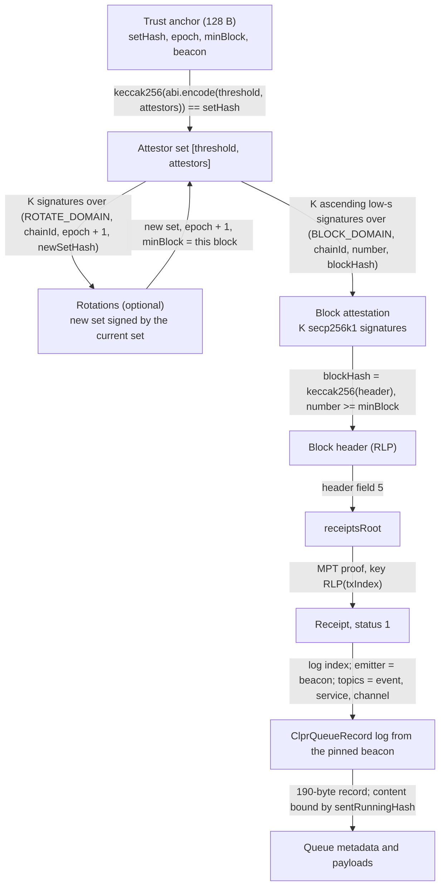
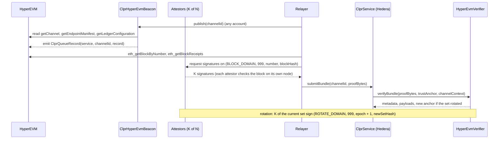

# Hyperliquid HyperEVM verifier (`HyperEvmVerifier`)

`HyperEvmVerifier` is a **Hyperliquid HyperEVM → Hiero** `IClprVerifier`.

> **Trust tier: ATTESTOR-TRUSTED (t-of-n attestors).** HyperEVM finality is not proven. A K-of-N set
> of CLPR attestors signs `(chainId, blockNumber, blockHash)`, and the verifier accepts any block that
> K of them sign. If K attestors collude, they can forge any queue state. Everything from the block
> hash down is proven: header → `receiptsRoot` → receipt → log.

HyperEVM headers carry `stateRoot = 0x0`, so ClprService storage cannot be proven the way
`ClprEvmBundleVerifier` does it. Receipts are committed: the header's `receiptsRoot` matches the trie
of the block's receipts. So the queue state travels as an event. `ClprHyperEvmBeacon`, deployed on
HyperEVM next to the ClprService, reads the live service state and emits it as a `ClprQueueRecord`
log in the same transaction. The verifier proves that log out of an attested block.

## 2. At a glance

| | |
|---|---|
| Chains | Hyperliquid HyperEVM mainnet, chain id 999 (`eip155:999`). Testnet (998) uses the same code with `hyperEvmChainId = 998`; not live-checked |
| Direction | HyperEVM → Hiero |
| Finality source | **None proven.** K-of-N CLPR attestor signatures over the block hash |
| Trust (one line) | t-of-n attestors (K > N/2) vouch for the block; HyperEVM execution makes the beacon's record match the service's storage |
| Typical bundle | **556,441 gas**, **3,332 B** (live block, receipt and log, 13-of-19 test attestors) |
| Bundle + rotation | **734,875 gas**, **4,612 B** (13-of-19 → 13-of-19) |
| Contract sizes | `HyperEvmVerifier` 13,140 B, `ClprHyperEvmBeacon` 5,446 B (runtime) |
| Status | Live-verified on HyperEVM mainnet block 47,353,393 (2026-10-01): real header, receipts trie and log; **test attestor keys** (no attestor set exists yet) |

## 3. How it works



1. Decode the anchor; the attestor set in field [0] must hash to `setHash`
   (`HyperEvmVerifier.sol:_decodeAnchor`, `ClprAttestorQuorum.sol:decode`).
2. Apply rotations: each new set must be signed by K of the current set over its epoch
   (`HyperEvmVerifier.sol:_rotate`, `rotationDigest`).
3. Hash the header with keccak256; read the number (field 8) and `receiptsRoot` (field 5); the number
   must be at least `minBlock` (`HyperEvmVerifier.sol:_provenLog`).
4. Require K distinct, ascending, low-s attestor signatures over `blockDigest(number, blockHash)`
   (`ClprAttestorQuorum.sol:requireQuorum`).
5. Prove the receipt in the receipts trie and require status 1 (`ClprReceiptProof.sol:verifyReceipt`).
6. Take the log at the given index; its emitter must be the anchored beacon, `topic0` the
   `ClprQueueRecord(address,bytes32,bytes)` event, and the indexed service and channel must match the
   channel context (`ClprReceiptProof.sol:successfulLog`, `HyperEvmVerifier.sol:_recordFromLog`).
7. Decode the record into queue metadata, decode the bundle content, and bind the optional manifest
   preimage to the record's commitment (`ClprRecordVerifierBase.sol`).

Probed facts (HyperEVM mainnet, 2026-10-01):
- headers carry `stateRoot = 0x0` (re-checked on block 47,353,393) and `eth_getProof` is not served;
- the block hash is keccak256 of a Cancun RLP header (20 fields, no `requestsHash`), and its
  `receiptsRoot` equals the trie rebuilt from `eth_getBlockReceipts`; the refresh script checks both;
- nothing Hyperliquid's validators sign covers HyperEVM blocks (Bridge2 validators sign bridge
  actions only); hence the attestors;
- HyperEVM has no EIP-2537 precompiles; attestors use secp256k1, so this does not matter.

## 4. Bundle lifecycle



## 5. Trust model

Trusted:
- **K of N attestors** (K > N/2) sign only blocks that are final on HyperEVM. This is the weak point:
  K colluding attestors can make the verifier accept any block, and so any record. Label: **trusts
  t-of-n attestors**.
- **The beacon address** pinned in the anchor at channel setup, and the ClprService it reads.
- **The attestor set at setup** (from `verifyConfig`); later sets come only through signed rotations.

Not trusted: the relayer, the RPC, the caller of `publish`. Everything below the block hash is
proven, so with an honest attestor quorum a relayer cannot change the record, the receipt or the
messages.

## 6. Proof format

`verifyBundle` proof, RLP list:

| Field | Type | Meaning |
|---|---|---|
| [0] attestor set | `[threshold, [attestor(20)...]]` | Must hash to `setHash`; attestors strictly ascending |
| [1] rotations | `[[newSet, [sig(65)...]], ...]` | Epoch e+1 signed by the epoch-e set |
| [2] header | bytes (RLP) | Block header as hashed into `blockHash` |
| [3] attestation | `[sig(65)...]` | Over `keccak256(abi.encode(BLOCK_DOMAIN, chainId, number, blockHash))`, ascending signers |
| [4] receipt | `[transactionIndex, [trie node...]]` | Receipts-trie proof; status 1 |
| [5] log index | uint | Index of the beacon log within the receipt |
| [6] content | bytes | `ClprBundleContent` protobuf, bound by the record's `sentRunningHash` |
| [7] manifest | bytes, optional | Endpoint manifest preimage, bound by `manifestCommitment` |

Trust anchor: `abi.encode(bytes32 setHash, uint256 epoch, uint256 minBlock, address beacon)`,
`setHash = keccak256(abi.encode(threshold, attestors))`.

`verifyConfig` proof, RLP: `[set, header, attestation, receipt, logIndex, controlMessage, beacon]`.
The record (channel 0 or this channel) must commit to the control message, and the event must name
the service that the LedgerConfiguration declares.

Record (`ClprQueueRecord.sol`, 190 bytes): channel id, state, next and received message ids, sent and
received running hashes, endpoint-manifest version and commitment, config hash.

Deployment parameters: the CAIP-2 string (`eip155:999`) and `hyperEvmChainId` (999), which is bound
into every signature.

## 7. Attestor-set rotation

A rotation bundle carries `[newSet, sigs]` signed by K of the current set over
`(ROTATE_DOMAIN, chainId, epoch + 1, newSetHash)`. The new anchor holds the new set, `epoch + 1` and
`minBlock` = the attested block, so blocks from before the handover cannot be replayed under it.
Replaying an old rotation fails because each rotation signs its epoch. Sets must have
`threshold > N/2`. Rotations are as frequent as the attestor operators decide; each costs about
180k gas for 13-of-19 (734,875 − 556,441, live measurement). Several rotations can be chained in one
bundle.

## 8. Gas and calldata

Measured with `eth_estimateGas` on anvil by `test/e2e/tests/verifiers/hyperevm-live.spec.ts` on
HyperEVM mainnet block 47,353,393 (captured 2026-10-01): the header is re-encoded, the receipts trie
is rebuilt from all 7 receipts and the real log of transaction 2 is proven. The attestations use
**test attestor keys**.

| Case | Gas | Calldata |
|---|---|---|
| block + receipt + log, 3-of-5 | 432,534 | 2,372 B |
| block + receipt + log, 13-of-19 | 556,441 | 3,332 B |
| + one attestor-set rotation (13-of-19 → 13-of-19) | 734,875 | 4,612 B |
| synthetic full `verifyBundle`, 3-of-5, 2 messages (unit test, no base cost) | 303,254 | n/a |
| synthetic full `verifyBundle` + 1 rotation, 3-of-5 (unit test, no base cost) | 347,866 | n/a |

All are far inside Hedera's limits (15M gas, 128 KB).

## 9. Limits and known gaps

- **Attestor trust.** Hyperliquid itself attests nothing about HyperEVM. Upgrade paths: validator-
  signed HyperEVM block hashes from Hyperliquid (Bridge2-style), or a real state root. The Bridge2 hot
  validator set lives in Arbitrum storage and could be proven with an Arbitrum verifier, which would
  make the trust validator-based (more than 2/3) once those validators sign HyperEVM blocks.
- **No beacon or attestor set exists yet.** The live log is not a `ClprQueueRecord`, so the live
  replay uses `HyperEvmLiveHarness` and stops at the event check; the full record path is covered by
  the synthetic and compliance tests.
- **Someone must call `publish`** for each bundle; any account can.
- **Testnet (998)** was not live-checked.

## 10. Upgrades and forks

A HyperEVM upgrade that changes the header layout (for example adding `requestsHash`) or the receipt
encoding breaks steps 3 and 5. Because the attestors sign the block hash, a header change also
needs the relayer to re-encode headers the new way. A change that adds a real state root would allow
moving to storage proofs (`ClprEvmBundleVerifier`) and dropping the beacon. Under the fork-aware
verifier ADR (`ADR/2026-10-01-fork-aware-verifiers.md` in the spec fork, draft PR
LFDT-CLPR/clpr-spec#1), such an upgrade is a new verifier version that the channel moves to at the
upgrade block.

## 11. Running it

```bash
# unit, beacon and compliance tests
forge test --match-path 'test/verifiers/evm/hyperliquid/*'
forge test --match-path 'test/verifiers/compliance/HyperEvmComplianceTest.t.sol'

# live fixture replay on anvil (CLPR_ANVIL_PORT_A selects the port)
forge build && npm run test:e2e:hyperevm-live

# refresh the fixture from https://rpc.hyperliquid.xyz/evm
npm run hyperevm-live:refresh
```

## 12. Files

| File | Role |
|---|---|
| `src/verifiers/evm/hyperliquid/HyperEvmVerifier.sol` | `IClprVerifier`: attestor set and rotation, attested block, receipt proof, beacon record |
| `src/verifiers/evm/hyperliquid/ClprHyperEvmBeacon.sol` | HyperEVM-side contract: `publish(channelId)` emits the service's queue state |
| `src/libraries/proof/attestor/ClprAttestorQuorum.sol` | K-of-N secp256k1 set, ascending signers, low-s |
| `src/libraries/proof/evm/ClprReceiptProof.sol` | Receipts-trie inclusion, typed receipts, status, log extraction |
| `src/libraries/codec/ClprQueueRecord.sol` | The 190-byte queue record (shared with Mixin) |
| `src/verifiers/evm/common/ClprRecordVerifierBase.sol` | Record → metadata, config and manifest checks (shared with XRPL and Mixin) |
| `test/verifiers/evm/hyperliquid/*` | Unit tests, beacon test, builder, live harness |
| `test/verifiers/compliance/HyperEvmComplianceTest.t.sol` | Shared `IClprVerifier` compliance suite |
| `test/e2e/fixtures/hyperevm-live/mainnet.json` | Live capture of block 47,353,393 |
| `test/e2e/relay/buildHyperEvmLiveProof.ts` | Capture and receipts-trie builder |
| `test/e2e/tests/verifiers/hyperevm-live.spec.ts` | Anvil replay |

## 13. References

- HyperEVM JSON-RPC (`https://rpc.hyperliquid.xyz/evm`): `eth_getBlockByNumber`,
  `eth_getBlockReceipts`, `eth_getProof` (not served)
- Hyperliquid docs, HyperEVM and Bridge2: https://hyperliquid.gitbook.io/hyperliquid-docs
- Bridge2 contract: https://github.com/hyperliquid-dex/contracts
- Ethereum receipts trie and typed receipts: EIP-2718, the Yellow Paper (receipt trie)
