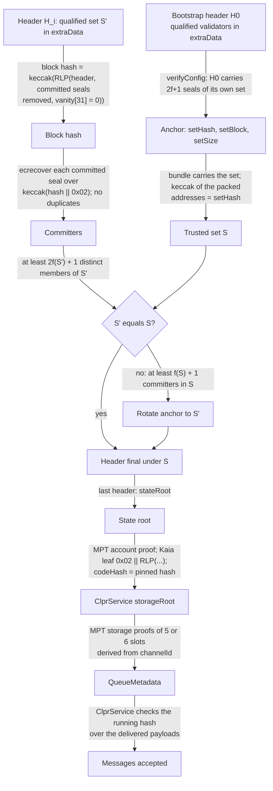
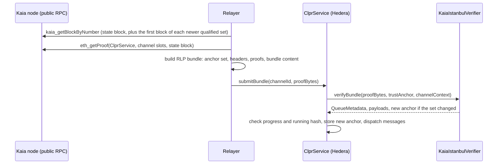

# KaiaIstanbulVerifier: Kaia (Istanbul BFT) → Hiero

`KaiaIstanbulVerifier` is an `IClprVerifier` that runs on Hedera's EVM and verifies CLPR bundles from Kaia (formerly
Klaytn) mainnet and the Kairos testnet (direction `Kaia → Hiero`). Kaia finalizes each block with Istanbul BFT
committed seals. The verifier rebuilds Kaia's block hash, recovers the committed seals and requires 2f + 1 distinct
members of the header's qualified validator set, the same commit rule Kaia's nodes apply. It follows the qualified
set, which every header carries, and moves to a new set only when f + 1 members of the trusted set have sealed the
header that introduces it. It then proves the ClprService queue storage against the header's state root, decoding
Kaia's own account encoding in the state trie, with the shared Merkle-Patricia code in `ClprEvmBundleVerifier`.

## At a glance

| Item | Value |
|---|---|
| Chains covered | Kaia mainnet (`eip155:8217`), Kairos testnet (`eip155:1001`). Per-chain page: [`docs/chains/kaia.md`](../../../../docs/chains/kaia.md) |
| Finality source | Istanbul BFT: committed seals from 2f + 1 of the qualified validators (f = ⌈N/3⌉ − 1); a committed block is final |
| Trust (one line) | At most f of each qualified set is malicious, and more than a third of the trusted set vouches for each set change; bootstrap header trusted |
| Typical bundle | Mainnet, live, no rotation: 1,501,674 gas (`eth_estimateGas`), 14,500 B calldata (31 validators, 21 seals) |
| Bundle with rotation | Mainnet, live, set change 30 → 31 validators: 1,609,912 gas, 14,468 B calldata |
| Contract size | `KaiaIstanbulVerifier` runtime 15,899 B (8,677 B under EIP-170) |
| Status | Live-verified on Kaia mainnet (with a real set rotation) and Kairos; fixtures captured 2026-10-01 |

### Why not `QBFTVerifier`

`QBFTVerifier` (Besu QBFT) is the closest existing verifier, and this contract follows the same structure (header,
committed seals, then `ClprEvmBundleVerifier` for the state). It cannot be reused as a profile because Kaia differs
in every consensus-facing detail:

| Detail | Besu QBFT (`QBFTVerifier`) | Kaia Istanbul (`KaiaIstanbulVerifier`) |
|---|---|---|
| Header fields | Ethereum order, stateRoot at 3, number at 8, extra at 12 | Kaia order (`rewardbase`, `blockScore`, `timeFoS`, `governance`, `vote`, …), stateRoot at 2, number at 7, extra at 11 |
| extraData | `RLP([vanity, validators, vote, round, seals])` | `vanity32 ‖ RLP([validators, proposerSeal, committedSeals])`, round in `vanity[31]` |
| Block hash | header with empty seals | header with empty committed seals **and** `vanity[31] = 0` |
| Seal preimage | header hash | `keccak256(blockHash ‖ 0x02)` |
| Quorum | `MIN_COMMITTED_SEALS` and one tracked validator | 2f + 1 distinct members of the header's own qualified set |
| Account leaf | `[nonce, balance, storageRoot, codeHash]` | `0x02 ‖ RLP([common, storageRoot, codeHash, codeInfo])` |

## How it works



1. `KaiaIstanbulVerifier.sol:_decodeAnchor` reads the 74-byte trust anchor; `KaiaIstanbulVerifier.sol:_decodeAnchorSet`
   binds the supplied validator bytes (header order) to `setHash` and `setSize`.
2. For each header, `ClprKaiaIstanbul.sol:decodeHeader` reads the qualified set, rebuilds the block hash with the
   committed seals removed and the round byte zeroed, and recovers every committed seal over
   `keccak256(hash ‖ 0x02)`.
3. `KaiaIstanbulVerifier.sol:_requireQuorum` counts distinct committers in the header's set
   (`ClprKaiaIstanbul.sol:countMembers`, which rejects duplicates) against `ClprKaiaIstanbul.sol:quorum`.
4. `KaiaIstanbulVerifier.sol:_verifyHeaders` checks ordering (first header not older than `setBlock`, then strictly
   increasing). If a header's set differs from the trusted one, it requires `faultBound(n) + 1` committers from the
   trusted set and moves the anchor.
5. `KaiaIstanbulVerifier.sol:_verifyKaiaServiceStorageRoot` walks the account proof with
   `ClprEvmStateProof.sol:verifyAccount`, requires a SmartContractAccount leaf (type 2), and checks the pinned code
   hash. `ClprEvmBundleVerifier.sol:_verifyChannelStorage` proves the channel slots and builds `QueueMetadata`.
6. If the set changed, `verifyBundle` returns the new anchor and its id (the block that introduced the set).

## Bundle lifecycle



`kaia_getBlockByNumber` returns the Kaia-specific header fields (`reward`, `blockScore`, `timestampFoS`,
`governanceData`, `voteData`, `randomReveal`, …) that `eth_getBlockByNumber` omits.

## Trust model

Trusted:
- **At most f of each qualified set is malicious** (f = ⌈N/3⌉ − 1). This is Kaia's own BFT assumption; under it, 2f + 1
  committed seals mean the block is final.
- **More than a third of the trusted set is honest across a set change.** A new set is accepted when f + 1 members of
  the trusted set sealed the header that lists it (the "trust level 1/3" rule of skipping light clients). At least
  one honest member then vouched for the header.
- **The bootstrap header** chosen at `verifyConfig` (weak subjectivity). It must carry 2f + 1 seals of its own set.

Not trusted: the relayer, the RPC, the validator list as supplied (it must hash to the anchor), the round byte.

To forge a bundle an attacker must control 2f + 1 keys of the current qualified set, or f + 1 keys of a trusted set
(to introduce a set of its own), or get a channel bootstrapped from a false header.

Kaia mainnet on 2026-10-01: 31 qualified validators, 21 seals per block (2f + 1 with f = 10), governance parameter
`istanbul.committeesize` = 50.

## Proof format

`proofBytes` is an RLP list:

| # | Field | Type | Meaning |
|---|---|---|---|
| 0 | `validators` | bytes | Anchor set, `n × address20` in header order; keccak256 must equal `setHash` |
| 1 | `headers` | list of headers | `[H_1, …, H_k]`, numbers not below `setBlock` and strictly increasing; full Kaia RLP headers (14-20 fields) with committed seals; `H_k` carries the proven state root |
| 2 | `accountProof` | list of bytes | MPT account proof (Kaia SmartContractAccount leaf) at `H_k.stateRoot` |
| 3 | `storageProof` | list | 5 or 6 × `[slot32, [nodes]]` for the channelId-derived slots |
| 4 | `bundleContent` | bytes | Protobuf `ClprBundleContent` |
| 5, 6 | `manifestStorageProof`, `manifestPreimage` | optional | Endpoint-manifest update proved under the same storage root |

Trust anchor (74 bytes, packed): `codeHash (32) ‖ setHash (32) ‖ setBlock (uint64) ‖ setSize (uint16)`. The trust
anchor id is `setBlock` as 8 big-endian bytes.

`configProofBytes` is `RLP([ledgerConfiguration, header, codeHash])`; the CAIP-2 id must be `eip155:<CHAIN_ID>`. The
config-time manifest proof is `RLP([validators, headers, accountProof, manifestStorageProof, manifestPreimage])`.

Deployment parameter: `CHAIN_ID` (constructor), 8217 for mainnet, 1001 for Kairos.

## Validator-set / committee rotation

- The qualified set is in every header's `extraData`. It changes when staking or governance changes which council
  members qualify (`reward.stakingupdateinterval` is 1 on mainnet). Live: mainnet went from 30 to 31 qualified
  validators at block 227,942,837 and had no further change up to block 228,639,858 (about 8 days at one block per
  second).
- A bundle carries one header per set change since the anchor, then the state header (or the state header alone if
  it introduces the change). Each extra header adds about 2.7 KB of calldata on mainnet (31 addresses, 21 seals; the
  mainnet config proof, one header plus the ledger configuration, is 2,833 B) and 21 more seal recoveries. A
  multi-header run was not measured on live data.
- Catch-up: the headers do not have to be consecutive, only ordered; one header per set change is enough as long as
  f + 1 of each trusted set sealed the next. `MAX_HEADERS` is 32.

## Gas and calldata

Measured on anvil with `eth_estimateGas` from the live fixtures (captured 2026-10-01), by
`test/e2e/tests/verifiers/signer-kaia-live.spec.ts`:

| Network | Bundle | Validators / seals | Gas | Calldata |
|---|---|---|---|---|
| Kaia mainnet | rotation (header 227,942,837: 30 → 31 validators, 21 old-set seals) | 31 / 21 | 1,609,912 | 14,468 B |
| Kaia mainnet | plain (header 228,639,858) | 31 / 21 | 1,501,674 | 14,500 B |
| Kairos | plain (header 229,197,609) | 4 / 3 | 1,012,343 | 10,820 B |

All are far below Hedera's limits (15M gas, 128 KB calldata). Foundry execution gas for the same bundles
(`KaiaIstanbulLive.t.sol`): 1,368,739 (mainnet rotation), 1,260,219 (mainnet plain), 826,523 (Kairos).

## Limits and known gaps

- Kaia counts committed seals against the **council** (qualified validators plus demoted ones) before the
  permissionless fork; this verifier counts only members of the qualified set, the set the header commits to. A block
  whose seals rely on demoted council members is rejected here (the relayer picks another block). This is stricter,
  not weaker.
- The quorum uses N = the qualified count. Kaia uses N = min(qualified, `istanbul.committeesize`); if governance sets
  the committee size below the qualified count, Kaia's quorum drops and some blocks may carry fewer seals than this
  verifier requires (liveness, not safety). On mainnet the committee size (50) is above the qualified count (31).
- The proposer seal is not checked; the committed seals cover the block hash, which includes it.
- Kaia's state trie can store "extended hashes" (hash plus a 7-byte sequence) in nodes when live pruning is on. The
  public mainnet and Kairos RPCs returned plain 32-byte hashes (proofs hash to the state root); a node that returns
  extended hashes would need them stripped by the relayer.
- The Kairos public RPC served `eth_getProof` 100 blocks back but not 1,000 blocks back; the Kaia mainnet public RPC
  served state 1,000,000 blocks back (both checked 2026-10-01).
- No ClprService is deployed on Kaia; the fixtures prove the AddressBook system contract (`0x…0400`) with its code
  hash pinned and empty channel slots (exclusion proofs).

## Upgrades and forks

- Kaia's source (`params/config.go`) already contains a `PermissionlessCompatibleBlock` hard fork, not yet scheduled
  for mainnet or Kairos on 2026-10-01. After it, committed seals sign `keccak256(hash ‖ 0x02 ‖ round)`, the committee
  is selected per round, and quorum is ⌈2N/3⌉ over that committee. This verifier implements the pre-permissionless
  rule and will reject post-fork headers (seals recover to other addresses).
- A fork that adds header fields at the tail (the header struct already has optional `BaseFee`, `RandomReveal`,
  `MixHash`, blob fields and `VRank`) is handled up to 20 fields; more fields revert.
- Under the fork-aware verifier ADR
  ([`ADR/2026-10-01-fork-aware-verifiers.md`](https://github.com/shayansal/clpr-spec/blob/adr/fork-handling/ADR/2026-10-01-fork-aware-verifiers.md),
  draft PR [LFDT-CLPR/clpr-spec#1](https://github.com/LFDT-CLPR/clpr-spec/pull/1)) the permissionless fork is Class
  B (a new seal preimage and quorum, same keys) and needs a fork profile; validator-set changes are Class A.
- This verifier is **not fork-aware yet**: no fork profile, no typed fork reverts.

## Running it

```sh
# Unit, compliance and live-vector tests (Foundry)
forge test --match-contract KaiaIstanbul -vv

# Live fixture replay on anvil (shared spec with the signer-replay verifier)
forge build && npm run test:e2e:signer-kaia-live

# Refresh the live fixtures from the public Kaia and Kairos RPCs, then rebuild the Foundry vectors
npm run kaia-live:refresh
npx tsx test/e2e/relay/buildKaiaLiveProof.ts --vectors
```

Test counts on this branch: 19 unit, 28 compliance and 8 live-vector tests (Foundry); 8 anvil tests for this
verifier in `signer-kaia-live.spec.ts`.

## Files

| File | Purpose |
|---|---|
| `src/verifiers/evm/kaia/KaiaIstanbulVerifier.sol` | Trust anchor, `verifyBundle`, `verifyConfig`, set tracking, Kaia account decoding |
| `src/libraries/proof/kaia/ClprKaiaIstanbul.sol` | Header decoding, block hash, committed-seal recovery, quorum |
| `src/verifiers/evm/common/ClprEvmBundleVerifier.sol` | Shared MPT channel-storage proofs, bundle content decoding |
| `test/verifiers/evm/kaia/KaiaIstanbulVerifier.t.sol` | Synthetic unit tests, including negative cases |
| `test/verifiers/evm/kaia/KaiaIstanbulLive.t.sol` | Live mainnet (rotation) and Kairos vectors, with negative cases |
| `test/verifiers/compliance/KaiaIstanbulComplianceTest.t.sol` | `IClprVerifier` compliance suite |
| `test/helpers/KaiaSynthetic.sol` | Synthetic Kaia headers, committed seals and account leaves |
| `test/e2e/fixtures/kaia-live/{kaia-mainnet,kairos}.json` | Raw RPC captures (headers and `eth_getProof`) |
| `test/e2e/fixtures/kaia-live/{kaia-mainnet,kairos}-vectors.json` | Encoded config, anchors and bundles |
| `test/e2e/relay/buildKaiaLiveProof.ts` | Capture (`--refresh`, bisects for the newest set change) and builder (`--vectors`) |
| `test/e2e/tests/verifiers/signer-kaia-live.spec.ts` | Anvil replay of the live fixtures |

## References

- Kaia node source (kaiachain/kaia, commit `2fbaab6`): `consensus/istanbul/sealer.go` (extra layout, block hash,
  committed-seal preimage, quorum), `blockchain/block_validator.go` (`verifySeals`, `countValidCommittedSeals`),
  `blockchain/types/block.go` (header fields), `blockchain/types/account/smart_contract_account.go` (account
  encoding), `params/config.go` (hard-fork blocks): https://github.com/kaiachain/kaia
- Kaia governance parameters, read live with `kaia_getParams` on https://public-en.node.kaia.io (2026-10-01)
- Besu QBFT verifier in this repository: `src/verifiers/evm/qbft/QBFTVerifier.sol`, `docs/qbft-verifier.md`
- Fork-aware verifier ADR: https://github.com/shayansal/clpr-spec/blob/adr/fork-handling/ADR/2026-10-01-fork-aware-verifiers.md
