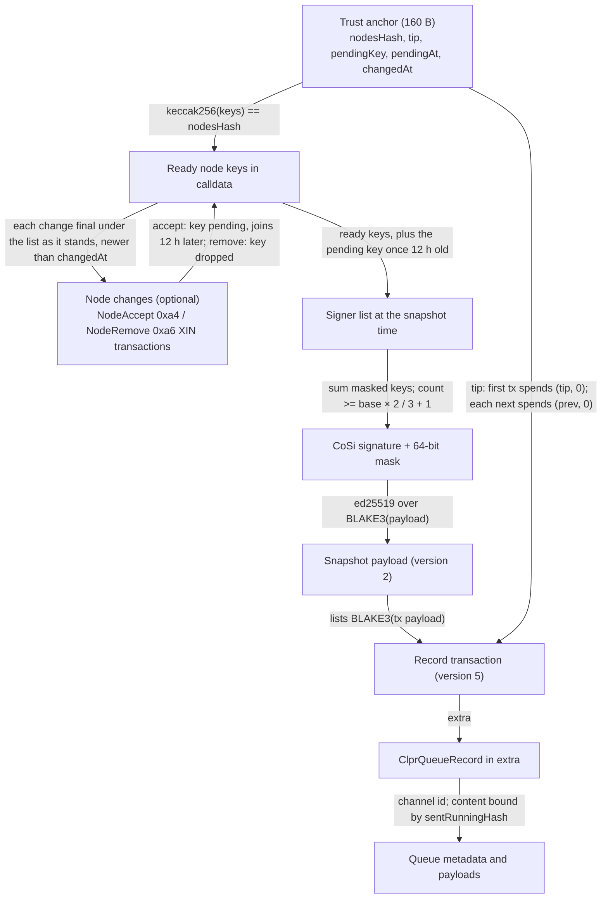
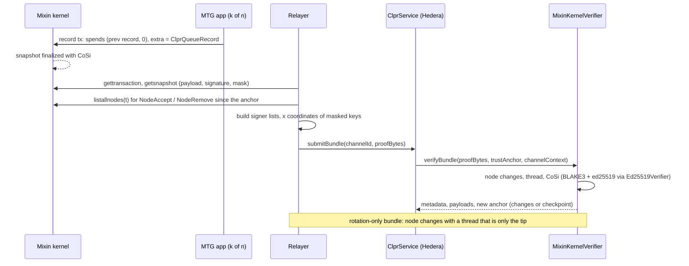

# Mixin kernel verifier (`MixinKernelVerifier`)

`MixinKernelVerifier` is a **Mixin Network → Hiero** `IClprVerifier`. It checks Mixin kernel
finality on-chain. A kernel snapshot is final when it carries a CoSi signature from at least
`base × 2 / 3 + 1` consensus nodes. That collective signature is one standard ed25519 signature over
the snapshot hash (BLAKE3 of the snapshot payload), under the plain sum of the signers' public spend
keys. The verifier recomputes the hash with BLAKE3, sums the masked keys and checks the signature
with an ed25519 verifier contract. It tracks the kernel's node set by applying the kernel's own
NodeAccept and NodeRemove transactions. Mixin has no smart contracts, so the CLPR endpoint is a
Mixin **MTG app** (a k-of-n group of signers) that publishes its queue state as a 190-byte
`ClprQueueRecord` in a transaction's `extra`. The records form a thread of transactions that each
spend output 0 of the previous one, which gives order and exactly-once.

All kernel facts were checked against `MixinNetwork/mixin` @ `1cd2882` and live mainnet data from
`kernel.mixin.dev` (kernel `v0.19.9-512c1fe4`) on 2026-10-01.

## 2. At a glance

| | |
|---|---|
| Chains | Mixin Network mainnet (kernel). No CAIP-2 namespace is registered; the tests use `mixin:mainnet` |
| Direction | Mixin → Hiero |
| Finality source | Kernel CoSi: one ed25519 signature under the sum of at least `base × 2 / 3 + 1` node keys |
| Trust (one line) | More than 2/3 of kernel nodes are honest; the node set at channel setup is correct; the MTG's k-of-n members decide record content |
| Typical bundle | **1,208,229 gas**, **3,364 B** (live snapshot, 29 of 43 signers, one thread link) |
| Bundle + rotation | **3,248,524 gas**, **6,308 B** (live NodeAccept + NodeRemove, then the record snapshot) |
| Contract sizes | `MixinKernelVerifier` 22,553 B; `Ed25519Verifier` 12,206 B (runtime) |
| Status | Live-verified on Mixin mainnet (2026-10-01): real CoSi signatures, node changes and transactions. No MTG app publishes CLPR records yet |

## 3. How it works



1. Decode the anchor; the ready keys in field [0] must hash to `nodesHash`
   (`MixinKernelVerifier.sol:verifyBundle`, `_decodeAnchor`).
2. Apply node changes in order (`_applyChanges`). Each must be a XIN transaction with one input, one
   output of type NodeAccept or NodeRemove and a 64-byte extra `signer ‖ payee`, final in a snapshot
   newer than `changedAt`. An accept is checked with the pledging node's key appended to the signer
   list and must be in a round-0 snapshot (the kernel puts it in the new node's first round, and
   `ConsensusKeys` adds the pledging key there). It makes the key pending. A remove drops the key.
3. Walk the record thread from the anchored tip (`_thread`). The first transaction is the tip itself
   or spends `(tip, 0)`; each next one spends `(prev, 0)`. Hashes are BLAKE3 of the payload without
   signatures (`MixinLib.sol:parseTransaction`).
4. Check the newest transaction's snapshot (`_finalSnapshot`): build the signer list at the snapshot
   time (ready keys, plus the pending key if it was accepted more than 12 h earlier); compute the
   threshold; sum the masked keys (`MixinCosi.sol:aggregate`); verify the ed25519 signature on
   BLAKE3 of the payload; require the transaction hash in the snapshot (`_requireTx`).
5. Decode the record from the transaction's `extra`, require this channel, and return the metadata,
   the bundle content and the optional manifest (`ClprRecordVerifierBase.sol`).
6. Return a new anchor when node changes were applied, the pending node joined, or the bundle asks
   for a checkpoint (then the tip moves to the newest transaction).

Kernel facts used:

| Item | Rule | Source (`MixinNetwork/mixin` @ `1cd2882`) |
|---|---|---|
| Snapshot hash | BLAKE3 of `EncodeSnapshotPayload`: `0x7777 ‖ 0x0002 ‖ nodeId ‖ round ‖ references ‖ n ‖ tx hashes ‖ timestamp ‖ u64 0` | `common/encoding.go`, `common/snapshot.go` |
| Transaction hash | BLAKE3 of the version-5 encoding with an empty signature map | `common/encoding.go`, `common/transaction.go` |
| CoSi | `FullVerify`: count mask bits ≥ threshold, `A = Σ publics[i]` for set bits, then `A.Verify(message, signature)` | `crypto/cosi.go` |
| Signer list | `ConsensusKeys`: nodes in `NodesListWithoutState(t)` that are `ConsensusReady` (ACCEPTED, genesis or accepted more than 12 h before t), ordered by timestamp then id; for a pledging node's round 0, its key is appended | `kernel/graph.go`, `kernel/node.go` |
| Node states | `NodesListWithoutState(t)` uses states recorded strictly before t | `kernel/node.go` |
| Threshold | `ConsensusThreshold(t, final)`: base = accepted nodes older than 30 s (pledging not counted when final); `base × 2 / 3 + 1`; at least 7 nodes | `kernel/node.go`, `config/reader.go` |
| Node changes | NodeAccept (output 0xa4) spends the pledge, extra = pledge extra; NodeRemove (0xa6) spends the accept, extra = accept extra = signer ‖ payee | `common/node.go`, `kernel/election.go` |
| Extra limit | 256 bytes for ordinary transactions (`ExtraSizeGeneralLimit`) | `common/transaction.go`, `common/validation.go` |

Live checks behind the node-set model (mainnet, 2026-10-01): the accept snapshot `fc16a363…`
(2026-09-29 13:11 UTC, round 0) verifies under the 43 ready keys plus the new key (30 of 44 signers);
the remove snapshot `9bc7416e…` (2026-09-30 13:06 UTC) verifies under 44 keys including the node it
removes; the record snapshot `f950e127…` (2026-10-01 07:14 UTC) verifies under the 43 keys the model
produces (29 of 43).

## 4. Bundle lifecycle



## 5. Trust model

Trusted:
- **Kernel consensus:** more than 2/3 of the kernel's consensus nodes are honest. Each node pledges
  XIN (13,439 XIN in the live accept/remove transactions). This is the same rule the kernel uses to
  finalize.
- **Channel setup:** the opener supplies the ready node list, any pending node and the MTG thread's
  first transaction. `verifyConfig` checks that the config transaction is final under that list.
- **The MTG app's members** (k-of-n) decide what the records say. Mixin has no contracts, so nothing
  in the kernel checks that a record matches a real CLPR queue; the kernel proves only that the
  holder of the thread output wrote it, in order, once. This part is **operator trust** ("trusts the
  MTG signers").
- **Timely node changes.** Removed nodes count until their NodeRemove is applied. The relayer must
  keep the anchor current; the kernel removes about one node and accepts about one node per day.

Not trusted: the relayer, the kernel RPC, the x coordinates in the proof (each is checked on the
curve against its key).

To forge a bundle an attacker must control more than 2/3 of the anchored node keys, or the MTG's
k-of-n keys (which can only write records through final transactions in thread order).

## 6. Proof format

`verifyBundle` proof, RLP list:

| Field | Type | Meaning |
|---|---|---|
| [0] ready keys | `[key(32)...]` | Kernel order; must hash to `nodesHash` |
| [1] node changes | `[[signerXs, snapshotPayload, signature(64), mask, txPayload], ...]` | Applied in order; may be empty |
| [2] record finality | `[signerXs, snapshotPayload, signature(64), mask]` or `[]` | Empty only when the thread is only the tip |
| [3] thread | `[txPayload...]` | Optionally the tip first; each next spends `(prev, 0)` |
| [4] checkpoint | 0 or 1 | 1 moves the anchor's tip to the newest transaction |
| [5] content | bytes | `ClprBundleContent` protobuf, bound by the record's `sentRunningHash` |
| [6] manifest | bytes, optional | Endpoint manifest preimage, bound by `manifestCommitment` |

`signerXs` holds the affine x (32 bytes, big-endian) of each masked signer key in mask order. The
verifier checks each against its key's y and sign bit instead of decompressing (a square root per
key would cost far more).

Trust anchor: `abi.encode(bytes32 nodesHash, bytes32 tip, bytes32 pendingKey, uint64 pendingAt,
uint64 changedAt)`, 160 bytes. `nodesHash = keccak256(key ‖ key ‖ …)` over the ready keys;
`pendingKey = 0` when no node is pending; `changedAt` is the snapshot time of the last applied change
(nanoseconds).

`verifyConfig` proof, RLP: `[readyKeys, pending ([] or [key, acceptTimestamp]), [signerXs,
snapshotPayload, signature, mask], configTxPayload, controlMessage]`. The config record (channel 0 or
this channel) must commit to the control message; the config transaction becomes the thread tip.

Deployment parameters: the CAIP-2 string and the address of an `Ed25519Verifier`
(`src/verifiers/evm/sei/Ed25519Verifier.sol`).

## 7. Node-set rotation

The kernel's node set changes through two transaction types, both validated by the kernel before it
finalizes them (`common/node.go`):
- **NodeAccept** (round 0 of the new node): the key becomes pending in the anchor. It joins the end
  of the signer list for snapshots more than 12 hours after the accept (`ConsensusReady`). While
  pending it already counts toward the threshold base, as in the kernel.
- **NodeRemove:** the key leaves the list. The remove snapshot itself is still signed under the old
  list.

At most one node is pending, as the kernel accepts at most one pledging node at a time. Changes must
come in kernel order: each change's snapshot must be newer than `changedAt`, so an old accept cannot
re-add a removed node. A bundle can carry changes without a new record (a thread that is only the
tip).

Cost (live): the accept and the remove together add 2.04M gas and 2.9 KB (3,248,524 vs 1,208,229
gas), about 1M gas per change; about 13 changes fit one 15M-gas transaction. Mainnet changes about
twice a day (one remove, one accept), so the relayer should apply them daily.

## 8. Gas and calldata

Live, measured with `eth_estimateGas` on anvil by `test/e2e/tests/verifiers/mixin-live.spec.ts`
through `MixinLiveHarness` (every `verifyBundle` step except the record decode), fixture captured
2026-10-01T07:30Z:

| Case | Gas | Calldata |
|---|---|---|
| record snapshot `f950e127…`, 29 of 43 signers, one thread link | 1,208,229 | 3,364 B |
| + NodeAccept (30 of 44) + NodeRemove (30 of 44), then the record | 3,248,524 | 6,308 B |

Synthetic (unit tests, `forge test -vv`, no base or calldata cost):

| Case | Gas |
|---|---|
| full `verifyBundle`, 6 of 8 CoSi, thread of 2, 2 messages | 984,538 |
| full `verifyBundle` + accept + remove, 8 nodes | 2,495,058 |

All fit Hedera's limits (15M gas, 128 KB). The cost per snapshot is one ed25519 verification
(SHA-512 in Solidity), BLAKE3 of the payload, and an on-curve check plus a point addition per signer.

## 9. Limits and known gaps

- **No MTG app publishes CLPR records yet.** The live replay proves real kernel data and a real
  thread link; the record path is covered by the synthetic and compliance tests.
- **Node changes must be applied in time.** A stale anchor still trusts removed nodes, and the
  record snapshot will not verify under a list that misses a change (fails closed).
- **Kernel removal fallback.** When a snapshot does not finalize under its own signer list,
  `verifyFinalization` retries it with the list from a few hours earlier during the node-accept
  window ("node removal time fork check"). The verifier does not, so such a snapshot cannot be used;
  the relayer picks another.
- **Rotation-only bundles** re-read the tip's record, so the tip must be a record of this channel
  (not the channel-0 config record) and the newest one the channel has received.
- **Removing the pending node** before it joins is not handled (`UnknownNode`); the kernel's daily
  cycle does not do this.
- **CAIP-2:** no namespace is registered for Mixin; the deployment chooses the string.

## 10. Upgrades and forks

A kernel release that changes the snapshot or transaction encoding (a new version byte), the hash
function, the CoSi aggregation, the 12-hour readiness rule or the threshold breaks the matching step.
The parsers accept only snapshot version 2 and transaction version 5, so a new version fails closed.
Under the fork-aware verifier ADR (`ADR/2026-10-01-fork-aware-verifiers.md` in the spec fork, draft
PR LFDT-CLPR/clpr-spec#1), such a release is a new verifier version that the channel moves to at the
kernel's activation time.

## 11. Running it

```bash
# unit and compliance tests
forge test --match-path 'test/verifiers/evm/mixin/*'
forge test --match-path 'test/verifiers/compliance/MixinComplianceTest.t.sol'

# live fixture replay on anvil (CLPR_ANVIL_PORT_A selects the port)
forge build && npm run test:e2e:mixin-live

# refresh the fixture from https://kernel.mixin.dev (MIXIN_KERNEL overrides the endpoint)
npm run mixin-live:refresh
```

## 12. Files

| File | Role |
|---|---|
| `src/verifiers/evm/mixin/MixinKernelVerifier.sol` | `IClprVerifier`: node set and changes, CoSi finality, record thread, config |
| `src/verifiers/evm/mixin/MixinCosi.sol` | Aggregate key: checked affine points summed in extended coordinates |
| `src/verifiers/evm/mixin/MixinLib.sol` | Kernel snapshot (v2) and transaction (v5) parsers |
| `src/libraries/crypto/ClprBlake3.sol` | BLAKE3 |
| `src/verifiers/evm/sei/Ed25519Verifier.sol` | ed25519 verification contract (shared) |
| `src/libraries/codec/ClprQueueRecord.sol`, `src/verifiers/evm/common/ClprRecordVerifierBase.sol` | Record codec and record → metadata (shared with HyperEVM) |
| `test/verifiers/evm/mixin/MixinKernelVerifier.t.sol`, `MixinTestBuilder.sol`, `Ed25519TestSigner.sol` | Unit tests over synthetic CoSi-signed kernel data |
| `test/verifiers/evm/mixin/MixinLiveHarness.sol` | Live-replay harness |
| `test/verifiers/compliance/MixinComplianceTest.t.sol` | Shared `IClprVerifier` compliance suite |
| `test/e2e/fixtures/mixin-live/mainnet.json` | Live capture |
| `test/e2e/relay/buildMixinLiveProof.ts` | Capture, node-set model and proof builder |
| `test/e2e/tests/verifiers/mixin-live.spec.ts` | Anvil replay |

## 13. References

- Mixin kernel, https://github.com/MixinNetwork/mixin @ `1cd2882`: `crypto/cosi.go`,
  `kernel/graph.go` (`ConsensusKeys`, `verifyFinalization`), `kernel/node.go`
  (`NodesListWithoutState`, `ConsensusReady`, `ConsensusThreshold`), `kernel/election.go`,
  `common/node.go`, `common/encoding.go`, `common/transaction.go`, `common/validation.go`,
  `config/reader.go`, `rpc/internal/server/node.go`
- Kernel RPC used: `https://kernel.mixin.dev` (`getinfo`, `listallnodes`, `listsnapshots`,
  `getsnapshot`, `gettransaction`)
- BLAKE3 specification: https://github.com/BLAKE3-team/BLAKE3-specs
- Ed25519: RFC 8032
