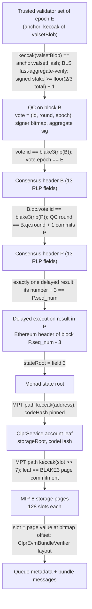
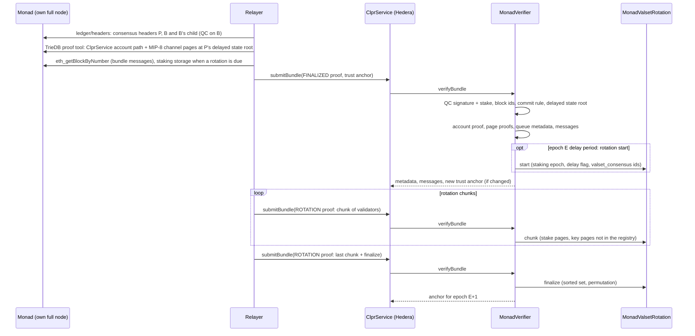

# Monad → Hiero verifier

`MonadVerifier` (an `IClprVerifier`) and its helper `MonadValsetRotation` let a ClprService on Hedera accept
bundles from a ClprService on Monad (mainnet chain id 143, testnet 10143). A bundle proves that a Monad block is
final under MonadBFT (a BLS12-381 quorum certificate of at least 2/3 of the epoch's stake, plus the 2-chain commit
rule), takes the Ethereum state root that Monad's delayed execution attaches to that block, and reads the
ClprService queue metadata from it through MIP-8 page-storage proofs. Validator-set changes are followed epoch by
epoch from the staking precompile's own storage.

**Status: certificates live-verified; full bundle needs own node.**

> **Read this first.** Full live bundles (certificate + storage proof against a real ClprService queue) are **not**
> verified. No public Monad RPC serves `eth_getProof` or consensus headers (29 public endpoints checked on
> 2026-10-01). A relayer needs its own Monad node (x86-64 Linux, bare metal, about 2.5 TB of NVMe). What is verified
> on live data is the quorum certificate; the page proofs are verified only against Monad's C++ reference vectors and
> a synthetic fixture. Details in [Limits and known gaps](#limits-and-known-gaps).

## At a glance

| Item | Value |
|---|---|
| Chains | Monad mainnet `eip155:143`, Monad testnet `eip155:10143` |
| Finality source | MonadBFT quorum certificate (BLS12-381 `min_pk` aggregate, stake ≥ ⌊2·total/3⌋ + 1) on block B whose round is B.qc.round + 1, which commits B's parent P |
| State source | P's delayed execution result: the Ethereum header of block `P.seq_num − 3`, its `stateRoot` |
| Trust | Fewer than 1/3 of each epoch's stake Byzantine; bootstrap validator set in the channel config |
| Typical bundle (synthetic, 196 validators) | 1.43M execution gas, 37.1 KB calldata, 1.89M tx gas |
| Live QC check (mainnet epoch 2190, 196 validators) | about 0.98M gas, 32 KB calldata |
| Rotation (synthetic, 196 validators) | warm: start + 3 chunks, ≤ 10.2M tx gas and ≤ 85 KB each; cold: start + 7 chunks, ≤ 12.2M tx gas and ≤ 72 KB each |
| Contract sizes | `MonadVerifier` 22,511 B, `MonadValsetRotation` 14,507 B (EIP-170 limit 24,576 B) |
| Status | Certificates live-verified on mainnet and testnet (2026-10-01); full bundle needs own node |

## How it works



1. Decode the trust anchor and check `keccak(valsetBlob)` against it — `MonadVerifier.sol:_verifyFinality`.
2. Check the QC's signer bitmap, tally stake, aggregate the signers' G1 keys with `BLS12_G1ADD`, bind the
   uncompressed signature to the compressed one in the QC and run the pairing check over
   `"\x0dmonad/vote/1\n" ‖ rlp(vote)` — `MonadVerifier.sol:_verifyQcSignature`, `MonadBls.sol:verify`,
   `MonadBls.sol:requireCompressedG2`, `MonadBls.sol:hashToG2`.
3. Recompute the block ids of B and P with BLAKE3 and check the 2-chain commit rule and the epoch —
   `MonadVerifier.sol:_verifyFinality`, `MonadBlake3.sol:hash`.
4. Read P's delayed execution result and take its state root — `MonadVerifier.sol:_verifyFinality`.
5. Prove the ClprService account and its code hash — `MonadVerifier.sol:_serviceRoot`, `MonadPageProof.sol:account`.
6. Prove the channel's storage pages and read the queue slots — `MonadVerifier.sol:_readChannel`,
   `MonadPageProof.sol:verifyPages`, `MonadPageProof.sol:verifyPage`, `MonadBlake3.sol:pageCommit`,
   `MonadMpt.sol:getOrEmptyPooled`, `MonadPageProof.sol:slotValue`.
7. Decode the messages and check them against the proven running hash (inherited `ClprEvmBundleVerifier`).
8. Optionally start or continue a validator-set rotation — `MonadValsetRotation.sol:start`, `chunk`, `finalize`.

### Protocol facts and where they come from

Every rule was read from source: `category-labs/monad-bft` @ `ac3ae48` (2026-09-29) and `category-labs/monad` @
`06afa49` (2026-09-30), plus docs.monad.xyz.

| Fact | Source |
|---|---|
| `BlockId = blake3(rlp(ConsensusBlockHeader))`; the header has 13 RLP fields (`block_round, epoch, qc, author, seq_num, timestamp_ns, round_signature, delayed_execution_results, execution_inputs, block_body_id, base_fee, base_fee_trend, base_fee_moment`) | monad-bft `monad-consensus-types/src/block.rs` (`get_id`, `Encodable`), `monad-crypto/src/hasher.rs` (`HasherType = Blake3Hash`) |
| `QuorumCertificate = [Vote{id, round, epoch}, BlsSignatureCollection{SignerMap, sig}]`; `SignerMap = [num_bits, bytes]` with validator 0 as the most significant bit | `quorum_certificate.rs`, `voting.rs`, `monad-bls/src/aggregation_tree.rs` |
| Votes are BLS `min_pk` (G1 keys, G2 signatures), DST `BLS_SIG_BLS12381G2_XMD:SHA-256_SSWU_RO_POP_`, message `"\x0dmonad/vote/1\n" ‖ rlp(vote)`; verification is fast-aggregate-verify | `monad-bls/src/bls.rs`, `monad-crypto/src/signing_domain.rs`, `monad-consensus/src/validation/signing.rs::verify_qc` |
| Signer bitmap index = position in `BTreeMap<NodeId<secp PubKey>>`, i.e. ascending 33-byte compressed secp key | `monad-validator/src/validator_mapping.rs`; rust-secp256k1 0.31 `Ord for PublicKey` |
| Supermajority: signed stake ≥ ⌊2·total/3⌋ + 1 | `monad-validator/src/validator_set.rs::has_super_majority_votes` |
| Commit rule: a QC on B with `round == B.qc.round + 1` commits B's parent P | `QuorumCertificate::get_committable_id` |
| `EXECUTION_DELAY = 3`; a proposal with `seq_num = n` must carry exactly `[EthHeader(n − 3)]`, and validators vote only for coherent blocks | `monad-node/src/main.rs`, `monad-eth-block-policy` (`get_expected_execution_results`, `check_coherency`), `monad-consensus-state`; docs "Asynchronous Execution → Delayed Merkle Root" |
| MIP-8 (testnet 2026-08-12, mainnet 2026-09-02): the storage trie commits to 128-slot pages; trie path `keccak(slot >> 7)`, leaf `RLP(page_commit)`; `page_commit` = BLAKE3 induced-subtree Merkle commitment sealed with the slot bitmap | monad `category/execution/monad/db/storage_page.cpp`, `ethereum/db/util.cpp` (`PagedStorageLeafProcessor`), docs "MonadDb", "MIP-8 activation" |
| Next epoch's set = staking `valset_consensus` (ids), `consensus_view(id).stake`, `val_execution(id).keys` (secp 33 ‖ bls 48, immutable), read when `epoch == E` and `in_epoch_delay_period` | monad `staking/read_valset.cpp`, `staking_contract.hpp`, `syscall_snapshot` / `syscall_on_epoch_change` |
| At most 200 active validators (`MAX_VALIDATORS`) | monad `staking/util/constants.hpp` (`limits::active_valset_size()`) |

## Bundle lifecycle



The first two relayer steps have no public source today; see [Limits and known gaps](#limits-and-known-gaps).

## Trust model

Trusted:

- Fewer than 1/3 of each epoch's stake is Byzantine (MonadBFT's own assumption). Under it a QC implies honest voters
  checked the block, including its parent QC and its delayed execution result (`check_coherency`).
- The bootstrap validator set in the channel config, like any light-client genesis. The config must carry a QC by
  that set over a committed block of the configured epoch, so a stale or wrong set fails at channel setup.
- The ClprService code hash pinned in the trust anchor.
- Staking invariants: validator keys are immutable per id and ids are never reused (`ValExecution::keys`,
  `last_val_id`). The key registry that makes warm rotations cheaper relies on this.

Not trusted: the relayer, the RPC, the forkpoint and validator files used to build fixtures. Every value the
verifier uses is bound by a signature, a hash or a Merkle proof.

To forge a bundle an attacker must control at least 1/3 of an epoch's stake (to sign a conflicting block) or more
than 2/3 (to finalize an invalid execution result).

## Proof format

`proofBytes` is RLP; the first item selects the kind.

| Kind | Layout |
|---|---|
| FINALIZED (0) | `[0, finality, valsetBlob, serviceAccountProof, channelPages, bundleContent, rotationStart, (manifestPages, manifestPreimage)?]` |
| ROTATION (1) | `[1, channelPages, bundleContent, chunk, finalize]`, against the roots pinned at rotation start |

| Field | Type | Meaning |
|---|---|---|
| `finality` | `[headerP, headerB, qcOnB, signature]` | P and B as raw consensus-header RLP; `qcOnB` the QC on B as carried in B's child; `signature` its aggregate in uncompressed EIP-2537 G2 form (256 B), bound byte for byte to the compressed signature in the QC |
| `valsetBlob` | bytes | n × (EIP-2537 G1 key 128 B ‖ stake 32 B) in consensus order; must hash to the anchor |
| `serviceAccountProof` | list of MPT nodes | ClprService account against the state root |
| `channelPages`, `manifestPages` | `[nodePool, [[pageKey, nodeIndices, bitmap, values]…]]` | pooled MIP-8 page proofs against the ClprService storage root |
| `bundleContent` | bytes | the bundle's messages |
| `rotationStart` | `[]` or `[stakingAccountProof, stakingPages]` | begins a rotation |
| `chunk` | `[ids, registry, hints, stakingPages, count]` | next validators of the pending set |
| `finalize` | `[sortedSet, permutation, ids]` | the full new set in consensus order and its permutation to array order |

**Trust anchor** (12 words, `abi.encode`): `epoch, valsetHash, codeHash, pendingEpoch, pendingBlock, stakingRoot,
serviceRoot, pendingLength, pendingProven, pendingAcc, pendingIds, keysHash`.

**Config proof** (`verifyConfig`): `[chainId, serviceAddress, codeHash, peerConfigNanos, throttles, epoch, valsetBlob,
finality, (keyRegistry)?]`. The endpoint manifest proof is empty or `[finality, serviceAccountProof, manifestPages,
preimage]`.

Per-deployment parameters: chain id string, ClprService address and code hash, bootstrap epoch and validator set,
optional key registry. Protocol constants are fixed in code: `EXECUTION_DELAY = 3`, `MAX_VALIDATORS = 200`,
13 header fields, vote prefix `"\x0dmonad/vote/1\n"`.

## Validator-set rotation

Epochs last 50,000 blocks (about 5.5 h on mainnet). Rotating from epoch E to E+1 spans several bundles:

1. **Start** (inside a FINALIZED bundle with an epoch-E QC): prove `epoch == E`, `in_epoch_delay_period == true` and
   the whole `valset_consensus` id array; pin the staking and ClprService storage roots of that state.
   `valset_consensus`, `consensus_view` and the keys are written only by `syscall_snapshot` (guarded by the delay
   flag) and `syscall_on_epoch_change`, so every state in the delay period gives the set consensus reads at the
   boundary. A later restart (newer block) keeps the progress.
2. **Chunks**: per validator, prove its stake page and, only if it was not in the previous set's key registry, its
   keys page; fold `(secp, bls, stake)` into an array-order accumulator.
3. **Finalize**: the set in consensus order with uncompressed keys and a permutation to array order; the verifier
   recomputes the accumulator (compressing every key, on-curve check) and installs `keccak(valsetBlob)` for E+1 and
   the new key registry.

A QC of epoch E+1 is rejected (`EpochMismatch`) until the rotation is installed; a bundle signed by an old epoch's
set is rejected after it (`ValidatorSetMismatch` / `EpochMismatch`). Catch-up: rotation start needs a state inside
epoch E's delay period, so a relayer that misses an epoch needs historical state from its own node to replay it.

## Gas and calldata

Synthetic 196-validator fixture (the mainnet set size), `forge test --match-path test/verifiers/evm/monad/GasUsage.t.sol -vv`;
tx gas = 21,000 + calldata gas + execution gas. Hedera limits: 15M gas, 128 KiB calldata.

| Step | Execution gas | Calldata | Tx gas |
|---|---|---|---|
| Typical bundle (QC + 2 headers + account + channel pages + 2 messages) | 1.43M | 37.1 KB | 1.89M |
| Rotation start (finalized bundle + staking epoch/flag + id array) | 6.40M | 47.4 KB | 6.95M |
| Warm rotation: 3 chunks of 66 (+ finalize in the last) | 7.8M / 8.5M / 9.0M | 45 / 47 / 85 KB | 8.4M / 9.1M / 10.2M |
| Cold rotation (no key registry yet): 7 chunks of 28 (+ finalize) | 9.6M–9.8M, last 11.3M | 31–33 KB, last 72 KB | ≤ 12.2M |

Live (anvil, `npm run test:e2e:monad-live`, capture 2026-10-01): QC verification for mainnet epoch 2190 (196
validators, 116 signers) costs about 0.98M gas with 32 KB calldata.

All steps fit under 15M gas and 128 KiB. A steady-state epoch change costs 4 transactions (about 35M gas); the first
rotation after bootstrap without a key registry costs 8. The synthetic staking trie is shallower than mainnet's
(an estimated 5–6 levels on mainnet), which adds about 1 KB and 10k gas per proven page; chunk sizes are relayer
parameters (`MONAD_CHUNK`, `MONAD_COLD_CHUNK`) and leave room for that.

## Limits and known gaps

**Status: certificates live-verified; full bundle needs own node.**

- **Full live bundles are not verified.** No bundle that combines a live certificate with a storage proof against a
  real ClprService queue has been checked. No public Monad RPC serves `eth_getProof` or consensus headers: all 29
  keyless endpoints listed on chainlist (mainnet and testnet: Monad Foundation, Alchemy, Ankr, dRPC, OnFinality,
  Tatum, Sentio, thirdweb, Huginn and others) were checked on 2026-10-01. A relayer needs its own Monad node: x86-64
  Linux on bare metal, about 2.5 TB of NVMe (2 TB dedicated to TrieDB plus 500 GB).
- **Verified on live data** (mainnet epoch 2190 with 196 validators, testnet epoch 1343 with 199 validators,
  captured 2026-10-01): the quorum certificate — BLS aggregate over the signer bitmap, vote signing domain and
  stake supermajority — through the production code path (`verifyQuorumCertificate` → `_verifyQcSignature`), with
  negative cases (tampered vote, cleared signer bit, wrong stakes, swapped keys, mismatched uncompressed
  signature). Also checked on live data, off-chain: the raw staking-precompile storage at a pinned block decodes to
  the next epoch's published set, and the delayed-result Ethereum header RLP hashes to the block hash.
- **Verified only against vectors or synthetic data**: the MIP-8 page proofs. The BLAKE3 page commitment matches
  Monad's C++ reference vectors (`test_storage_page.cpp`); the MPT path, page leaves, account proof, consensus
  headers P/B, commit rule and rotation chunks are verified only on the synthetic 196-validator fixture built with
  the same encodings. No page proof from live Monad state has been checked.
- **No proof tool upstream.** `monad-rpc` @ `ac3ae48` implements no proof method, and the only upstream proof work
  (category-labs/monad #986/#987, Oct 2024, slot-level and pre-MIP-8) is unmerged. An own node therefore still needs
  a small tool on `category/mpt` that reads `/dev/triedb` and emits the account path plus MIP-8 page leaves in the
  `channelPages` format. This tool does not exist yet.
- **Consensus headers.** No RPC method serves them (`monadNewHeads` carries only the block id). The public forkpoint
  files give a QC and a block id, not header preimages. A full node's `ledger/headers/` holds them; the QC on B is
  the `qc` of B's child. The archive buckets that hold `bft_block/<id>.header` are requester-pays and were not read.
- **State snapshots** (`d3b0ffqjb9bqrg.cloudfront.net/latest.txt`, mainnet, about 8.2 GB) hold account values and
  slot-level storage, not trie nodes. Proofs would need the whole trie with page commitments rebuilt offline, and
  only at the snapshot block: useful for a test, not for relaying.
- **Own-node hardware**: x86-64 with AVX2, Linux with io_uring (Ubuntu 24.04 packages), 16 cores at 4.5 GHz or more,
  32 GB of RAM or more, bare metal. A Mac cannot run it.
- Receipts: the `receiptsRoot` of live blocks is the standard keccak MPT over `debug_getRawReceipts` (checked on
  6 blocks), so event proofs could come from public RPC. The verifier does not use them.
- The synthetic staking trie is shallower than mainnet's; mainnet chunk gas and calldata are estimated from it.
- No ClprService is deployed on Monad.

## Upgrades and forks

- A change to the consensus header layout, the vote signing domain, `EXECUTION_DELAY`, the MIP-8 page layout or the
  staking storage layout breaks verification. Under the fork-aware verifier ADR
  ([`ADR/2026-10-01-fork-aware-verifiers.md`](https://github.com/shayansal/clpr-spec/blob/adr/fork-handling/ADR/2026-10-01-fork-aware-verifiers.md),
  draft PR [LFDT-CLPR/clpr-spec#1](https://github.com/LFDT-CLPR/clpr-spec/pull/1)) a header-field or layout change is
  Class B (a LAYOUT fork profile) and a new signature scheme is Class C (channel succession).
- MIP-8 itself was such a change (slot-level storage proofs before 2026-09-02 on mainnet, 2026-08-12 on testnet).
  This verifier supports only the paged layout, so it cannot prove pre-MIP-8 state.
- Validator-set changes are Class A: signed by the source consensus and followed by rotation, without a profile.
- This verifier is **not fork-aware yet**: it has no fork profile and no typed fork reverts.

## Running it

```sh
# Unit, negative, gas and compliance tests (synthetic fixture + C++ page-commit vectors)
forge test --match-path 'test/verifiers/evm/monad/*' -vv
forge test --match-path test/libraries/proof/monad/MonadBlake3.t.sol
forge test --match-contract MonadComplianceTest

# Live replay on anvil: live QCs (mainnet + testnet) and the synthetic bundle end to end
forge build && npm run test:e2e:monad-live

# Refresh the live capture (forkpoint QC, validators.toml, staking storage, Ethereum header)
npm run monad-live:refresh

# Rebuild the synthetic 196-validator fixture
npm run monad:fixtures
```

## Files

| File | Purpose |
|---|---|
| `src/verifiers/evm/monad/MonadVerifier.sol` | `IClprVerifier`: finality, QC signature, delayed state root, storage reads, config |
| `src/verifiers/evm/monad/MonadValsetRotation.sol` | Rotation start, chunks and finalize from staking storage |
| `src/libraries/proof/monad/MonadBlake3.sol` | BLAKE3 hash and MIP-8 page commitment |
| `src/libraries/proof/monad/MonadBls.sol` | POP hash-to-G2, aggregate verify, compressed/uncompressed signature binding (EIP-2537) |
| `src/libraries/proof/monad/MonadMpt.sol` | Lean MPT walker with a pooled node list |
| `src/libraries/proof/monad/MonadPageProof.sol` | Account proof, page proofs, slot reads |
| `test/verifiers/evm/monad/MonadVerifier.t.sol` | Unit and negative tests on the synthetic fixture |
| `test/verifiers/evm/monad/GasUsage.t.sol` | Gas and calldata for bundle and rotation |
| `test/verifiers/evm/monad/MonadSyntheticProofs.sol` | Fixture loader |
| `test/verifiers/evm/monad/fixtures/synthetic/` | Synthetic 196-validator fixture (positive and negative cases) |
| `test/verifiers/compliance/MonadComplianceTest.t.sol` | Shared `IClprVerifier` compliance suite |
| `test/libraries/proof/monad/MonadBlake3.t.sol` | BLAKE3 hash vectors and C++ page-commit reference vectors |
| `test/e2e/fixtures/monad-live/capture.json` | Live capture: mainnet and testnet QC, validator sets, staking storage, Ethereum header |
| `test/e2e/tests/verifiers/monad-live.spec.ts` | Anvil replay of the live capture and the synthetic bundle |
| `test/e2e/relay/monad/refreshMonadLive.ts` | Live capture refresh |
| `test/e2e/relay/monad/buildMonadFixtures.ts`, `monad.ts`, `blake3.ts`, `mpt.ts` | Synthetic fixture builder and encoders |

## References

- category-labs/monad-bft @ `ac3ae48`: `monad-consensus-types/src/block.rs`, `quorum_certificate.rs`, `voting.rs`,
  `monad-bls/src/bls.rs`, `monad-bls/src/aggregation_tree.rs`, `monad-crypto/src/signing_domain.rs`,
  `monad-crypto/src/hasher.rs`, `monad-validator/src/validator_mapping.rs`, `validator_set.rs`,
  `monad-consensus/src/validation/signing.rs`, `monad-eth-block-policy`, `monad-node/src/main.rs`, `monad-rpc`
  (https://github.com/category-labs/monad-bft)
- category-labs/monad @ `06afa49`: `category/execution/monad/db/storage_page.cpp`, `test_storage_page.cpp`,
  `ethereum/db/util.cpp`, `staking/read_valset.cpp`, `staking_contract.hpp`, `staking/util/constants.hpp`
  (https://github.com/category-labs/monad); unmerged proof PRs #986, #987
- Monad docs: Asynchronous Execution, MonadDb, MIP-8 activation, node hardware requirements (https://docs.monad.xyz)
- Monad Foundation forkpoints and validator sets: `https://bucket.monadinfra.com/forkpoint/<net>/`,
  `validators/<net>/validators.toml`
- EIP-2537 (BLS12-381 precompiles); BLS signature draft (POP ciphersuite)
- Fork-aware verifier ADR: LFDT-CLPR/clpr-spec#1
