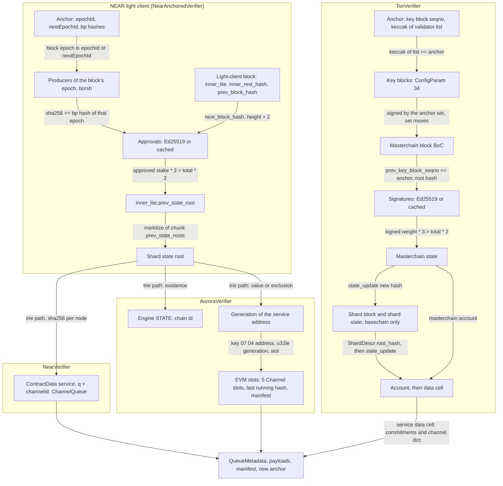
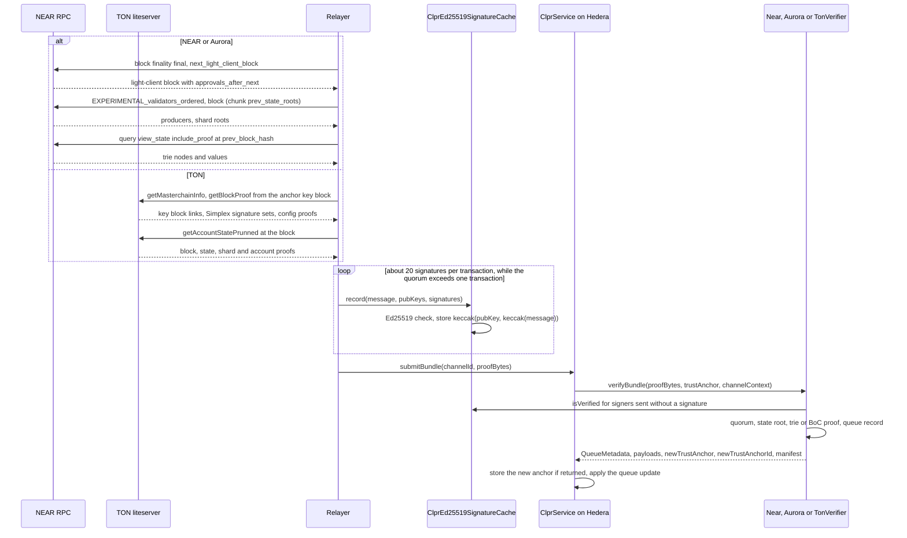

# NEAR, TON and Aurora verifiers

> **Source**: [NearVerifier.sol](./NearVerifier.sol) · [AuroraVerifier.sol](./AuroraVerifier.sol) ·
> [TonVerifier.sol](./TonVerifier.sol) · shared NEAR half [NearAnchoredVerifier.sol](./NearAnchoredVerifier.sol) ·
> signature accumulator [ClprEd25519SignatureCache.sol](./ClprEd25519SignatureCache.sol) · libraries
> [NearLightClient](../../../libraries/proof/near/NearLightClient.sol),
> [TonCells](../../../libraries/proof/ton/TonCells.sol), [TonBlocks](../../../libraries/proof/ton/TonBlocks.sol)
> **Interface**: [IClprVerifier.sol](../../../interfaces/IClprVerifier.sol)
> **Chain pages**: [NEAR](../../../../docs/chains/near.md) · [Aurora](../../../../docs/chains/aurora.md) ·
> [TON](../../../../docs/chains/ton.md)

Three "chain → Hiero" verifiers for chains whose consensus signs with Ed25519. Each runs on Hedera's
EVM and proves two things: that a block is signed by more than 2/3 of the stake (NEAR) or weight
(TON) of the source chain's current validator set, and that the peer CLPR Service's queue state is in
that block's state. `NearVerifier` is a NEAR light client plus a NEAR state-trie proof of a NEAR-native
CLPR Service. `AuroraVerifier` uses the same NEAR light client and proves the EVM storage slots of the
Solidity ClprService inside the aurora-engine contract. `TonVerifier` is a TON masterchain light client
plus BoC (bag-of-cells) Merkle proofs from the signed masterchain block to a contract's data cell.

Ed25519 has no precompile on Hedera. The pure-Solidity `Ed25519Verifier` costs about 445k–622k gas
per signature (measured below), so a full NEAR mainnet (31–49 signers) or TON mainnet (68–69 signers)
quorum does not fit one 15M-gas transaction. `ClprEd25519SignatureCache` is the multi-transaction
accumulator: a relayer records the signatures in several transactions, then the verifier accepts
cached signers.

Checked against nearcore `bb04d86` (NEAR protocol 86 on mainnet, 87 on testnet), ton-blockchain/ton
master (`crypto/block/check-proof.cpp`, `validator/impl/signature-set.cpp`, `crypto/block/block.tlb`,
`tl/generate/scheme/ton_api.tl`), and aurora-engine master (`engine-types/src/storage.rs`,
`engine/src/engine.rs`, `engine/src/state.rs`), and live on 2026-10-01.

## At a glance

| Item | Value |
|---|---|
| Chains covered | NEAR mainnet `near:mainnet`, NEAR testnet `near:testnet`; TON mainnet `ton:mainnet` (global id −239), TON testnet `ton:testnet` (global id −3); Aurora mainnet `eip155:1313161554` (engine `aurora`), Aurora testnet `eip155:1313161555`, and any aurora-engine silo (live: `eip155:1313161564`, engine `0x4e45415c.c.aurora`) |
| Direction | NEAR / TON / Aurora → Hiero |
| Finality source | NEAR: Doomslug approvals of the epoch's block producers (> 2/3 stake) on a light-client block (NEP-25). TON: masterchain block signatures of the masterchain validators (> 2/3 weight), Simplex finalize votes or catchain `ton.blockId`. Aurora: the NEAR block that executed it |
| Trust assumptions | > 2/3 of the followed NEAR producer stake or TON validator weight is honest; deploy-time checkpoint (NEAR epoch window, TON key block); Aurora also trusts the configured engine account |
| Typical bundle (live, cached signatures) | NEAR mainnet 1.26M gas, 18.1 KB; TON mainnet 1.90M gas, 15.8 KB; Aurora (6 EVM slots) 2.80M gas, 64.7 KB. Plus the signature pre-recording below |
| Typical bundle (live, inline signatures) | NEAR testnet (6 signers) 2.94M gas, 9.8 KB; TON testnet (10 signers) 7.61M gas, 7.7 KB |
| Signature pre-recording | 20 signatures per transaction: 8.90M gas (NEAR approvals), 12.44M gas (TON Simplex votes). NEAR mainnet 2–3 transactions per block, TON mainnet 4 per block |
| Rotation | NEAR: an epoch change inside the bundle, +600 gas, no extra calldata. TON: one key block inside the bundle, 5.88M gas, 32.6 KB (mainnet, cached) |
| Contract sizes | `NearVerifier` 15,341 B, `AuroraVerifier` 16,949 B, `TonVerifier` 21,357 B, `ClprEd25519SignatureCache` 1,326 B (plus the shared `Ed25519Verifier`, 12,206 B) |
| Status | live-verified: NEAR mainnet and testnet, TON mainnet and testnet, Aurora engine on a NEAR mainnet silo (fixtures captured 2026-10-01). Aurora mainnet `aurora`: family-covered (public RPCs refuse its state) |

## How it works



NEAR (`NearVerifier`, `AuroraVerifier`):

1. **Anchor.** `NearAnchoredVerifier.sol:decodeAnchor` reads the 128-byte epoch window
   `epochId ‖ nextEpochId ‖ sha256(producers(epochId)) ‖ sha256(producers(nextEpochId))`, the state a
   NEP-25 light client keeps.
2. **Block.** `NearLightClient.sol:verifyBlock` parses the 208-byte borsh `BlockHeaderInnerLite`. The
   block's `epoch_id` must be the anchor's `epochId` or `nextEpochId` (`EpochNotTrusted`). The relayed
   borsh producer list must hash to that epoch's bp hash (`ProducersHashMismatch`).
3. **Approvals.** `NearLightClient.sol:approvalMessage` rebuilds
   `0x00 ‖ next_block_hash ‖ u64le(height + 2)` with
   `block_hash = sha256(sha256(sha256(inner_lite) ‖ inner_rest_hash) ‖ prev_block_hash)` and
   `next_block_hash = sha256(next_block_inner_hash ‖ block_hash)`. `_checkApprovals` requires strictly
   increasing signer indices, Ed25519 keys, and approved stake × 3 > total × 2; each signer goes
   through `ClprEd25519Check.sol:check` (inline signature, or a cache entry for this exact message).
4. **Rotation.** A block in `nextEpochId` moves the window to
   `(nextEpochId, block.next_epoch_id, old nextBpHash, block.next_bp_hash)`.
5. **State root.** `NearLightClient.sol:shardStateRoot` checks that the relayed chunk
   `prev_state_root`s merklize (nearcore `merklize`) to `inner_lite.prev_state_root` and picks one
   shard root. This is the state after the light-client block's parent.
6. **Trie.** `NearLightClient.sol:verifyValue` / `verifyAbsent` walk `RawTrieNodeWithSize` nodes from
   the shard root (each node hash = sha256 of its borsh bytes) along the nibbles of
   `0x09 ‖ account_id ‖ ',' ‖ data_key`, and end at the value's `ValueRef` (length and sha256) or at
   the node where the key leaves the trie.
7. **NearVerifier.** Proves the 89-byte borsh `ChannelQueue` under `"q" ‖ channelId`
   (`NearVerifier.sol:verifyBundle`) and the manifest commitment under `"m"`.
8. **AuroraVerifier.** `AuroraVerifier.sol:_verifyEngine` proves the engine state `07 00 "STATE"`
   exists in the chosen shard (this binds the shard to the engine account) and carries the configured
   EIP-155 chain id, then proves the service address's generation `07 07 ‖ address` (value `u32be`,
   or absent = 0). `_verifySlot` proves each ClprService slot under
   `07 04 ‖ address ‖ [u32le(generation) if > 0] ‖ slot`; a zero word is never stored by the engine, so
   zero is proven by absence. Slots and decoding are those of `ClprEvmBundleVerifier`.

TON (`TonVerifier`):

1. **Anchor.** `TonVerifier.sol:decodeAnchor` reads `keyBlockSeqno (u32) ‖ keccak256(validators)`,
   validators packed as `pubkey(32) ‖ uint64 weight` in ConfigParam 34 order, first `main` entries.
2. **Key blocks.** `_verifyToData` checks the relayed list against the anchor (`ValidatorsMismatch`).
   Each key block must be signed by that set and be a key block (`NotKeyBlock`); its ConfigParam 34
   (`TonBlocks.sol:keyBlockValidators`) becomes the set.
3. **Block.** `_verifyMcBlock` parses the BoC (`TonCells.sol:parse`, level-aware cell hashes, pruned
   and Merkle-proof cells), requires a masterchain block whose `prev_key_block_seqno` is the anchor's
   key block (`WrongKeyBlock`), and checks signatures over `_signedMessage`: Simplex
   `consensus.dataToSign(session_id, finalizeVote(candidateId(slot, sha256(candidate))))` where the
   candidate names this block's seqno and root hash, or catchain `ton.blockId(root_hash, file_hash)`.
   Signed weight × 3 must exceed total × 2 (`InsufficientWeight`).
4. **State.** The block's `state_update` new hash roots the masterchain state proof. For a basechain
   service, `TonBlocks.sol:shardBlockRoot` follows `McStateExtra.shard_hashes` to the shard holding the
   address, then the shard block's `state_update` to the shard state. `accountHash` and `accountData`
   reach the account's data cell.
5. **Service data.** `_serviceData` reads `config_commitment`, `manifest_commitment` and the channels
   dictionary; `_channelQueue` looks up the 712-bit `ChannelQueue` cell for the channel.

All three return `ClprTypes.QueueMetadata`, the `ClprBundleContent` payloads, an optional manifest
bound to its proven commitment (`ClprNearTonBundleVerifier.sol:_bindManifest`) and, when the epoch or
key block moved, the new anchor.

## Bundle lifecycle



Rotation needs no separate transaction: the NEAR block of the next epoch, or the TON key block,
travels inside the bundle. The cache transactions are permissionless and can be sent by anyone.

## Trust model

- **NEAR: honest producer stake.** More than 2/3 of the stake of every block-producer set the
  verifier follows does not approve conflicting blocks. The verifier checks Doomslug approvals of
  block producers only; chunk validity (stateless validation endorsements) is trusted to the
  producers that included the chunks, as in any NEP-25 light client.
- **TON: honest masterchain weight.** More than 2/3 of the weight of every masterchain validator set
  the verifier follows does not sign conflicting blocks. Shard blocks are trusted through the
  masterchain state that references them.
- **Aurora: NEAR plus the engine account.** Everything NEAR trusts, plus the deployment's engine
  account (e.g. `aurora`) running aurora-engine with the storage layout above. The engine state's
  chain id must match `EVM_CHAIN_ID`. The aurora-engine owner can upgrade the engine; a layout change
  breaks proofs (see "Upgrades and forks").
- **Bootstrap.** NEAR: the deploy-time epoch window (`CHECKPOINT_*`); TON: the deploy-time key block
  seqno and validator-list hash. `verifyConfig` starts every Channel from it.
- **Sequential light clients.** NEAR blocks must be delivered at least once per epoch (43,200
  blocks); TON key blocks must be delivered in order. Neither has a trusting period: an anchor left
  far behind still trusts a set that may have unstaked.
- **Signature cache.** The cache only stores signatures it checked itself, keyed by public key and
  message hash. It has no owner and no delete. The verifier still enforces the set, the threshold and
  the exact message, so a cached entry for any other key or message is never used.
- **Configuration.** `NearVerifier` and `TonVerifier` prove the ControlMessage: its keccak256 is the
  service's stored configuration commitment. `AuroraVerifier`, like the other EVM-peer verifiers,
  takes the configuration from the registration's ControlMessage, checks its chain id and a 20-byte
  service address, and proves the engine and the optional manifest commitment.
- **Not trusted:** the relayer, the RPC and the liteserver. Every byte is hash-linked to the signed
  block.
- **To forge a bundle** an attacker needs more than 2/3 of a followed NEAR producer stake or TON
  masterchain weight, or a break of Ed25519, SHA-256 or keccak256.

## Proof format

All three use `abi.encode` of a struct. `NearLightClient.Block`:

| Field | Type | Meaning |
|---|---|---|
| `prevBlockHash` | `bytes32` | Light-client block `prev_block_hash` |
| `nextBlockInnerHash` | `bytes32` | `next_block_inner_hash` |
| `innerLite` | `bytes` | borsh `BlockHeaderInnerLite` V1, 208 B |
| `innerRestHash` | `bytes32` | `inner_rest_hash` |
| `producers` | `bytes` | borsh `Vec<ValidatorStake>` of the block's epoch |
| `signers` | `uint256[]` | Strictly increasing producer indices |
| `signatures` | `bytes[]` | 64 B each, or empty = recorded in the cache |

| Verifier | Trust anchor | `verifyBundle` proof | `verifyConfig` proof |
|---|---|---|---|
| `NearVerifier` | 128 B epoch window; id `epochId` | `BundleProof{blocks, shards{roots, index}, queueNodes, queueRecord, bundleContent, manifestNodes, manifestPreimage}` | `ConfigProof{blocks, shards, configNodes, controlMessage}`; manifest `ManifestProof{manifestNodes, manifestPreimage}` |
| `AuroraVerifier` | 128 B epoch window; id `epochId` | `BundleProof{blocks, shards, engine{stateNodes, state, generationNodes, generation}, slots[5 or 6]{nodes, value}, bundleContent, manifestSlot, manifestPreimage}` | `ConfigProof{blocks, shards, engine, controlMessage}`; manifest `ManifestProof{manifestSlot, manifestPreimage}` |
| `TonVerifier` | 36 B `seqno ‖ keccak(validators)`; id `seqno` | `BundleProof{validators, keyBlocks[], block{boc, sigs}, state{mcState, shardBlock, shardState, account}, bundleContent, manifestPreimage}` | `ConfigProof{validators, keyBlocks, block, state, controlMessage}`; manifest = the preimage |

`TonVerifier.BlockSignatures`: `mode` (0 catchain, 1 Simplex), `fileHash` (mode 0), `sessionId`,
`slot`, `candidate` (boxed `consensus.CandidateHashData`, mode 1), `signers`, `signatures`.
In `AuroraVerifier`, a slot `value` of zero means `nodes` is an exclusion proof.

Peer service layouts:

| Fact | NEAR service storage | TON service data cell | Aurora (Solidity ClprService) |
|---|---|---|---|
| Queue state | `"q" ‖ channelId` → borsh `ChannelQueue` (89 B: status u8, next_message_id u64, received_message_id u64, sent hash, received hash, endpoint_manifest_version u64) | `channels: HashmapE 256 ^ChannelQueue`, 712-bit cell, same fields | `Channel` slots +1, +2, +4, +5, +16 of `keccak(channelId, 15)` |
| Manifest commitment | `"m"` → 32 B | `manifest_commitment` (2nd 256 bits) | slot 18 |
| Configuration commitment | `"c"` → keccak256(ControlMessage) | `config_commitment` (1st 256 bits) | not proven (registration input) |

Constructor parameters:

| Verifier | Parameters |
|---|---|
| `NearVerifier` | `chainId` (CAIP-2), checkpoint `EpochState`, `Ed25519Verifier`, `ClprEd25519SignatureCache` (zero disables it) |
| `AuroraVerifier` | as `NearVerifier` (with the Aurora CAIP-2 id), plus `engineAccount` and `evmChainId` |
| `TonVerifier` | `chainId`, `checkpointKeyBlock`, `checkpointSetHash`, `Ed25519Verifier`, `ClprEd25519SignatureCache` |

## Validator-set / committee rotation

- **NEAR.** The producer set changes every epoch (43,200 blocks on mainnet and testnet). A
  light-client block of epoch E+1 is approved by the producers whose hash the anchor already holds as
  `nextBpHash`; it moves the window. The live mainnet and testnet fixtures verify the same block from
  the epoch-E and epoch-(E−1) anchors: the rotation costs about +600 gas and no extra calldata. To
  catch up k epochs, the relayer sends one block per epoch, each with its own quorum (inline, or 2–3
  cache transactions on mainnet).
- **TON.** The validator set changes at key blocks that carry a new ConfigParam 34. Each key block in
  a bundle is signed by the previous set. On TON mainnet the recorded key block kept the same set (only
  the anchor seqno moved); on testnet it changed the set. Cost: TON mainnet bundle with one key block
  and cached signatures 5.88M gas, 32.6 KB; TON testnet with both blocks' 10 signatures inline 14.50M
  gas (close to 15M), or 8.57M after recording the key block's signatures (6.24M gas).
- **Aurora** follows NEAR.

## Gas and calldata

Measured with `eth_estimateGas` (intrinsic + calldata + execution) on anvil by
`test/e2e/tests/verifiers/neartons-live.spec.ts`, from the fixtures captured on 2026-10-01. The
measured calls are the generic entry points (`verifyStateValue`, `verifyEvmStorage`,
`verifyAccountData`) because no CLPR Service runs on these chains; `verifyBundle` runs the same
light-client and proof path plus the CLPR record decode. Hedera limits: 15M gas, 128 KB calldata.

| Case | Signers | Gas | Calldata | Fits one tx |
|---|---|---|---|---|
| NEAR testnet, block + trie proof (`hello.near-examples.testnet` STATE) | 6 of 20, inline | 2,941,364 | 9,764 B | yes |
| NEAR testnet, same + epoch rotation | 6 of 20, inline | 2,941,939 | 9,764 B | yes |
| NEAR mainnet, block + trie proof (`lockup.near` STATE) | 49 of 100, inline | 21,641,437 | 21,252 B | **no** |
| NEAR mainnet, pre-record 49 approvals | — | 8,904,828 / 8,904,070 / 4,018,126 (3 tx) | — | yes, each |
| NEAR mainnet, block + trie proof | 49 of 100, cached | 1,260,873 | 18,116 B | yes |
| NEAR mainnet, same + epoch rotation | 49 of 100, cached | 1,261,475 | 18,116 B | yes |
| Aurora silo, block + engine state + generation + 6 EVM slots (2 absent) | 31 of 100, inline | 15,702,082 | 66,724 B | **no** |
| Aurora silo, pre-record 31 approvals | — | 8,903,630 / 4,915,033 (2 tx) | — | yes, each |
| Aurora silo, same proof | 31 of 100, cached | 2,800,812 | 64,740 B | yes |
| Aurora silo, same + epoch rotation | 31 of 100, cached | 2,801,491 | 64,740 B | yes |
| TON testnet, block + basechain account proof | 10 of 15, inline | 7,612,797 | 7,748 B | yes |
| TON testnet, key block + block + account | 10 + 10, inline | 14,497,261 | 12,196 B | yes, 3% margin |
| TON testnet, pre-record the key block's 10 signatures | — | 6,237,687 | — | yes |
| TON testnet, key block (cached) + block (inline) + account | 10 + 10 | 8,567,786 | 11,556 B | yes |
| TON mainnet, pre-record 68 + 69 signatures | — | 8 tx: 6 × ~12.44M, 4,988,598, 5,610,767 | — | yes, each |
| TON mainnet, block + basechain account proof | 69 of 100, cached | 1,895,231 | 15,844 B | yes |
| TON mainnet, key block + block + account | 68 + 69, cached | 5,877,955 | 32,580 B | yes |

Per signature (from the cache transactions): about 445k gas for a NEAR approval (41-byte message)
and about 622k gas for a TON Simplex vote. The Aurora proof is large because each of its 8 trie
paths (engine state, generation, 6 slots) is sent in full (engine state 23 nodes, each slot 27–28
nodes, in a 10-shard mainnet trie); a CLPR bundle adds one more path for the manifest slot. Measured through
`ClprService.submitBundle`: not measured (the spec calls the verifiers directly).

## Limits and known gaps

- **No CLPR Service on NEAR, TON or Aurora.** The live fixtures prove real contracts (`lockup.near`
  and `hello.near-examples.testnet` STATE, the USDT jetton master and a testnet basechain contract,
  wNEAR inside an Aurora silo). `verifyBundle` / `verifyConfig` with real queue records are covered
  by the synthetic suites and the compliance adapters.
- **Aurora mainnet state is not readable on public RPCs.** Every public NEAR RPC tried
  (rpc.mainnet.near.org, FastNEAR, dRPC and others) answers `TOO_LARGE_CONTRACT_STATE` for
  `view_state` on `aurora`, mainnet and testnet. A relayer for Aurora mainnet needs its own NEAR RPC
  node with a raised `trie_viewer_state_size_limit`. The live fixture uses the silo
  `0x4e45415c.c.aurora`, which runs the same engine (global contract `global.c.aurora`).
- **Aurora calldata.** 64.7 KB for 8 trie paths; trie nodes shared by the paths are not
  deduplicated. A bundle with manifest is about 9 paths, still below 128 KB at the measured depth.
- **Signature cache.** Mainnet NEAR and TON blocks need 2–4 extra transactions per block before the
  bundle. Cache entries are never deleted (storage grows by one slot per signature).
- **NEAR.** Only `BlockHeaderInnerLite` V1 (208 B) and `ValidatorStake::V1` producers are decoded;
  secp256k1 producer keys cannot approve. The exclusion proof (`verifyAbsent`) is used by Aurora; the
  NEAR-native service only uses existence proofs.
- **TON.** The relayer must use an ADNL liteserver: public HTTP gateways do not decode the Simplex
  signature sets. Only workchains 0 and −1 are accepted. TON mainnet's recorded key block did not
  change the validator set, so a set-changing key block is live-verified on testnet only.
- **Gas numbers come from anvil.** Hedera's EVM gas schedule matches for these opcodes; Hedera
  intrinsic and calldata charges were not measured on a Hedera network.
- No fork profiles or typed fork reverts yet.

## Upgrades and forks

What each verifier pins, and how ADR `ADR/2026-10-01-fork-aware-verifiers.md` (spec fork, draft PR
LFDT-CLPR/clpr-spec#1, §3.1) classifies changes:

| Source-chain change | Class | Today |
|---|---|---|
| NEAR producer set change (every epoch) | A, signed by the outgoing producers | Handled: epoch rotation |
| NEAR protocol upgrade that keeps `BlockHeaderInnerLite` V1, the approval message and the trie format | A | Accepted unchanged (the protocol version is not in the light-client block) |
| NEAR resharding (shard count or boundaries change) | A | Handled: the relayer sends the new chunk roots; the engine-state / service-key proof picks the shard |
| NEAR new `BlockHeaderInnerLite` or `ValidatorStake` version, or a new trie node encoding | B | `InnerLiteLength`, `BadProducers` or trie errors; needs a new deployment |
| NEAR approval message or signature scheme change | C | Signature checks fail; new verifier and Channel succession (§3.7) |
| TON validator set change (key block, ConfigParam 34) | A, signed by the outgoing set | Handled: key-block rotation |
| TON consensus switch between catchain and Simplex signing | A | Both message forms are accepted |
| TON block or state TL-B layout change (BlockInfo, McStateExtra, ShardDescr, ShardAccounts, Account) | B | BoC decode errors (`BadTag`, `KeyNotFound`); needs a new deployment |
| TON new signed-message format or signature scheme | C | Signature checks fail; new verifier |
| aurora-engine upgrade that keeps the storage-key layout and `BorshableEngineState` tags 0–2 | A | Accepted unchanged |
| aurora-engine storage-key change (version prefix, key prefixes, generation encoding) or a new engine-state tag | B | `TrieKeyNotFound` or `BadEngineState`; needs a new deployment |
| ClprService storage-layout change on Aurora | B | Same as for any EVM peer |

`fork_id` and evidence (§3.2) are not yet defined for these families (ADR Appendix B.1 has no NEAR
or TON row). Candidates: NEAR `protocol_version` (in the full header, not in the light-client block),
TON `global_version` (ConfigParam 8, provable from a key block). The typed reverts of §3.9 are not
implemented; an unsupported change shows up as a decoding or proof revert, which leaves the queue
unchanged.

## Running it

```sh
# Synthetic suites (Foundry; Ed25519 replaced by a message-binding stub)
forge test --match-path 'test/verifiers/evm/neartons/*Verifier.t.sol'

# Live fixtures through the real Ed25519Verifier (prints gas with -vv)
forge test --match-path 'test/verifiers/evm/neartons/*Live.t.sol' -vv

# Shared compliance suite
forge test --match-path 'test/verifiers/compliance/{Near,Ton,Aurora}ComplianceTest.t.sol'

# Live fixture replay on anvil, gas and calldata per transaction (needs a prior forge build)
forge build && npm run test:e2e:neartons-live

# Re-capture all three from public endpoints, then rebuild offline
npm run neartons-live:refresh
npx tsx test/e2e/relay/buildNearLiveFixture.ts
npx tsx test/e2e/relay/buildTonLiveFixture.ts
npx tsx test/e2e/relay/buildAuroraLiveFixture.ts
```

The replay spec starts one anvil on `CLPR_ANVIL_PORT_A` (default 8653).

## Files

| File | Purpose |
|---|---|
| `src/verifiers/evm/neartons/NearAnchoredVerifier.sol` | NEAR epoch-window anchor, checkpoint, light-client block chain, shard root |
| `src/verifiers/evm/neartons/NearVerifier.sol` | NEAR-native CLPR Service verifier, generic `verifyStateValue` |
| `src/verifiers/evm/neartons/AuroraVerifier.sol` | Aurora verifier: engine state, generation, EVM slots, generic `verifyEvmStorage` |
| `src/verifiers/evm/neartons/TonVerifier.sol` | TON verifier: key blocks, signed block, state chain, generic `verifyAccountData` |
| `src/verifiers/evm/neartons/ClprNearTonBundleVerifier.sol` | Shared manifest/config binding and queue-record checks |
| `src/verifiers/evm/neartons/ClprEd25519SignatureCache.sol` | Multi-transaction Ed25519 accumulator |
| `src/verifiers/evm/neartons/ClprEd25519Check.sol` | One signer check: inline or cached |
| `src/libraries/proof/near/NearLightClient.sol` | NEP-25 block checks, merklize, NEAR trie existence and exclusion proofs |
| `src/libraries/proof/ton/TonCells.sol` | BoC parser, cell hashes and levels, slices, hashmap lookup |
| `src/libraries/proof/ton/TonBlocks.sol` | TL-B readers: BlockInfo, state_update, ConfigParam 34, shard hashes, accounts |
| `test/verifiers/evm/neartons/NearVerifier.t.sol`, `TonVerifier.t.sol`, `AuroraVerifier.t.sol` | Synthetic suites with negative cases |
| `test/verifiers/evm/neartons/NearLive.t.sol`, `TonLive.t.sol`, `AuroraLive.t.sol` | Live fixtures through the real Ed25519 code |
| `test/verifiers/evm/neartons/NearTonTestKit.sol`, `TonCellBuilder.sol` | Ed25519 stub, NEAR trie builder, TON cell/BoC builder |
| `test/verifiers/compliance/NearComplianceTest.t.sol`, `TonComplianceTest.t.sol`, `AuroraComplianceTest.t.sol` | Compliance adapters |
| `test/e2e/fixtures/near-live/`, `ton-live/`, `aurora-live/` | Raw captures plus derived proofs |
| `test/e2e/relay/buildNearLiveFixture.ts`, `buildTonLiveFixture.ts`, `buildAuroraLiveFixture.ts` | Capture (`--refresh`) and proof builders |
| `test/e2e/relay/tonLiteClient.ts`, `tonCells.ts` | Minimal ADNL liteserver client and TS cell tools |
| `test/e2e/tests/verifiers/neartons-live.spec.ts` | Vitest replay on anvil with gas and calldata per transaction |

## References

- nearcore (`bb04d86`): `core/primitives/src/views.rs` (`LightClientBlockLiteView::hash`),
  `Approval::get_data_for_sig`, `compute_bp_hash_from_validator_stakes`, `core/primitives/src/trie_key.rs`,
  `core/store/src/trie/raw_node.rs`, `merkle::merklize`, `test-loop-tests/src/tests/light_client.rs`
  — https://github.com/near/nearcore
- NEAR light client spec (NEP-25) — https://nomicon.io/ChainSpec/LightClient
- NEAR RPC: `next_light_client_block`, `EXPERIMENTAL_validators_ordered`, `EXPERIMENTAL_protocol_config`,
  `query view_state include_proof` — https://rpc.mainnet.near.org, https://rpc.testnet.near.org
- ton-blockchain/ton: `crypto/block/check-proof.cpp` (`BlockProofLink::validate`),
  `validator/impl/signature-set.cpp`, `crypto/block/block.tlb`, `tl/generate/scheme/ton_api.tl`,
  `tl/generate/scheme/lite_api.tl` — https://github.com/ton-blockchain/ton
- TON liteserver list — https://ton.org/global.config.json, https://ton.org/testnet-global.config.json
- aurora-engine: `engine-types/src/storage.rs` (`storage_to_key`, `address_to_key`, `KeyPrefix`),
  `engine/src/engine.rs` (`set_storage`, `get_generation`, `Engine::apply`), `engine/src/state.rs`
  (`BorshableEngineState`) — https://github.com/aurora-is-near/aurora-engine
- Aurora chain ids: `eth_chainId` of https://mainnet.aurora.dev and https://testnet.aurora.dev
- Fork-aware verifiers: `ADR/2026-10-01-fork-aware-verifiers.md`, draft PR LFDT-CLPR/clpr-spec#1
