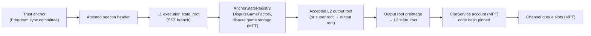

# OP Stack verifiers

> **Sources**: [OpStackVerifier.sol](./OpStackVerifier.sol) (FINALIZED), [OpStackProposedVerifier.sol](./OpStackProposedVerifier.sol) (PROPOSED), [OpStackVerifierBase.sol](./OpStackVerifierBase.sol), [OpStackOutputRootProof.sol](../../../libraries/proof/opstack/OpStackOutputRootProof.sol), [EthL1StateVerifier.sol](../ethereum/EthL1StateVerifier.sol), [EthBeaconLightClient.sol](../../../libraries/proof/beacon/EthBeaconLightClient.sol)
> **Interface**: [IClprVerifier.sol](../../../interfaces/IClprVerifier.sol)

---

## 1. The big picture

These verifiers let a Hiero CLPR Service accept bundles from a CLPR Service on an **OP Stack L2 that settles on Ethereum**. They do not trust the L2's sequencer or any relayer. Trust comes from Ethereum: its sync committee signs the L1 state, and in that L1 state the L2's own fault-proof contracts say which L2 output roots are valid.



Every arrow is checked on-chain. If one link fails, the call reverts.

| Step | Where | Reused from |
|---|---|---|
| Sync-committee BLS → L1 `state_root`, committee rotation | [EthL1StateVerifier](../ethereum/EthL1StateVerifier.sol), a deployed stateless helper | [EthBeaconLightClient](../../../libraries/proof/beacon/EthBeaconLightClient.sol). This is the code of [EthMainnetVerifier](../ethereum/EthMainnetVerifier.sol), moved into a library. |
| L1 `state_root` → accepted output root | [OpStackOutputRootProof](../../../libraries/proof/opstack/OpStackOutputRootProof.sol) | MPT account and storage proofs from [ClprEvmStateProof](../../../libraries/proof/evm/ClprEvmStateProof.sol) |
| Output root → L2 `state_root` | `OpStackOutputRootProof.outputRoot` | — |
| L2 `state_root` → channel metadata, messages, endpoint manifest | [ClprEvmBundleVerifier](../common/ClprEvmBundleVerifier.sol) | Same as QBFT, Sei and Ethereum |

The L1 half lives in its own contract so that both verifiers stay under EIP-170 (§9).

Steps 1, 3 and 4 live in [OpStackBundleVerifierBase](./OpStackBundleVerifierBase.sol). Step 2 is the only per-family part: dispute games here, and an output-oracle array for Blast, Mantle and Katana in [oracle/](./oracle/README.md).

---

## 2. Tiers and trust

The tier is fixed per deployed contract, so a Channel's pinned verifier code hash also fixes its trust model. `FINALITY()` returns the tier.

| | **FINALIZED**: `OpStackVerifier` | **PROPOSED**: `OpStackProposedVerifier` |
|---|---|---|
| Accepts an output root that is… | (a) the AnchorStateRegistry anchor root, or (b) the root claim of a game for which `AnchorStateRegistry.isGameClaimValid` holds at the proven L1 state | Everything FINALIZED accepts, plus the root claim of any registered game of the respected type that its proposer has not lost (`IN_PROGRESS` or `DEFENDER_WINS`) |
| Trusts | Ethereum's sync committee (2/3) and the L2's fault-proof system (its game implementation and the guardian's blacklist and retirement powers) | All of the FINALIZED trust, **plus the proposer.** An invalid proposal is accepted until someone wins a challenge against it, and CLPR cannot undo a delivered message. |
| Latency (L2 block → deliverable) | The chain's withdrawal finality: game resolution plus `DISPUTE_GAME_FINALITY_DELAY_SECONDS`. That is about 3.5 days plus the clock on OP Mainnet, and 5 days on Base Sepolia. | One proposal interval, plus L1 finality of the proposal |
| Use for | Default | Only for channels whose applications bound the value at risk and accept proposer trust |

Both tiers reject a game that is `CHALLENGER_WINS`, blacklisted, retired (`createdAt <= retirementTimestamp`), of a type other than the respected one, not respected when it was created, or not a clone of the pinned game implementation.

### Checks in GAME mode, and the AnchorStateRegistry functions they mirror

| Verifier check | Mirrors | Revert |
|---|---|---|
| The claimed `gameType` equals ASR `respectedGameType` | respected type | `GameTypeNotRespected` |
| DGF `_disputeGames[keccak256(abi.encode(gameType, root, extraData))]` is non-zero, which gives the game proxy | `isGameRegistered` | `GameNotRegistered` |
| ASR `disputeGameBlacklist[game] == false` | `isGameBlacklisted` | `GameBlacklisted` |
| `keccak256(gameCode) == codeHash` of the game account, and the code is the DGF clone of the pinned implementation | `isGameRegistered`: the game's `anchorStateRegistry()` is an immutable of the implementation | `GameCodeMismatch`, `GameImplementationMismatch` |
| `createdAt > retirementTimestamp` | `isGameRetired` | `GameRetired` |
| `wasRespectedGameTypeWhenCreated` | `isGameRespected` | `GameNotRespectedWhenCreated` |
| `status != CHALLENGER_WINS` | — | `GameChallengerWins` |
| FINALIZED only: `status == DEFENDER_WINS`, `resolvedAt != 0`, and `l1Time − resolvedAt > DISPUTE_GAME_FINALITY_DELAY_SECONDS` | `isGameResolved`, `isGameFinalized` | `GameNotResolved`, `GameNotFinalized` |

`l1Time` is the proven L1 time: `L1_GENESIS_TIME + attestedSlot × L1_SECONDS_PER_SLOT`. The slot is authenticated by the sync-committee signature. `block.timestamp` on Hiero is never used.

In ANCHOR mode the root must be the ASR anchor root:
- If an anchor game is set, the root must be that game's root claim. The verifier proves this with the DGF registration `(respectedGameType, root, extraData) → anchorGame`, and also requires that the anchor game is not blacklisted. The ASR itself does not check this.
- If no anchor game is set, the root must be the stored `startingAnchorRoot`.

### What is not checked

- **`AnchorStateRegistry.paused()`**, the Superchain guardian pause. The pause is kept on SystemConfig/SuperchainConfig and is not proven. A paused chain's games still pass here. The guardian can also blacklist games or retire them all.
- **DisputeGameFactory and ASR proxy code.** Their addresses are fixed: the ASR address is pinned, and the DGF address is read from ASR storage. Their storage is interpreted through the pinned layout. The ASR **implementation** code hash is pinned, which fixes the finality-delay immutable.

---

## 3. Upgrades fail closed

Anything held in an immutable is bound by code hash, never trusted by value:
- The pinned `ANCHOR_STATE_REGISTRY_IMPL_CODE_HASH` fixes `DISPUTE_GAME_FINALITY_DELAY_SECONDS`. If the implementation is upgraded, verification reverts with `AnchorStateRegistryImplMismatch`.
- The pinned `GAME_IMPLEMENTATION` fixes the game's semantics, its storage layout and its ASR/DGF references. Games created by a new implementation revert with `GameImplementationMismatch`.

A contracts upgrade on the L2 therefore stalls the Channel safely instead of mis-reading state. Recovery means redeploying with the new profile, which is pure data (§6). This is the "Class B" path of the fork-aware-verifier ADR (`clpr-spec/ADR/2026-10-01-fork-aware-verifiers.md`). A new proof system (a new root format, or a portal without an ASR) is Class C.

---

## 4. Trust anchor and config

The trust anchor is the same **260-byte Ethereum anchor** that `EthMainnetVerifier` uses: `gvr ‖ forkVersion ‖ channelId ‖ aggregatePubkey ‖ committeeMerkleRoot ‖ codeHash`. Here `codeHash` pins the **L2** ClprService. The anchor rotates with the L1 sync committee in exactly the same way. The rotation items travel inside the light-client proof, and the successor anchor id is the next period.

`verifyConfig` accepts `EthMainnetVerifier`'s config RLP `[slot, syncCommittee, gvr, forkVersion, ledgerConfiguration, codeHash]`. An optional endpoint-manifest proof `[lightClientProof, disputeProof, outputRootPreimage, l2AccountProof, manifestStorageProof, manifestPreimage]` is verified under the genesis anchor.

---

## 5. Proof layout

**Bundle.** A top-level RLP list with 6 items, or 8 when it carries a manifest update:

| # | Item | Contents |
|---|---|---|
| 0 | `lightClientProof` | An RLP **string** that wraps `[attestedHeader, syncAggregate, executionStateRoot, executionBranch, nextCommittee, nextCommitteeBranch, nonSignerProofs]`. The items are as in `EthMainnetVerifier`. |
| 1 | `disputeProof` | See below |
| 2 | `outputRootPreimage` | 128 bytes: `version(0) ‖ stateRoot ‖ messagePasserStorageRoot ‖ blockHash`. Since Isthmus the L2 header's `withdrawalsRoot` is the message-passer storage root, so the relayer takes all of this from the L2 header. |
| 3 | `l2AccountProof` | MPT account proof of the ClprService against the L2 `stateRoot` |
| 4 | `l2StorageProof` | 5 or 6 `[slot, proofNodes]` entries for the slots derived from `channelId` |
| 5 | `bundleContent` | protobuf `ClprBundleContent` |
| 6, 7 | manifest | Optional commitment-slot proof and preimage |

**Dispute proof.** An RLP list with 12 items. Items a mode does not use are empty:

`[mode (0 ANCHOR, 1 GAME), gameType, extraData, asrAccountProof, asrStorageProof, asrImplAccountProof, dgfAccountProof, dgfStorageProof, gameAccountProof, gameCode, gameStorageProof, superRootPreimage]`

Every slot is derived by the verifier from the profile. None is taken from the proof. ASR storage proofs carry `disputeGameFactory`, `respectedGameType|retirementTimestamp`, the EIP-1967 implementation slot, `anchorGame` (and the starting root) or `disputeGameBlacklist[game]`. One proof list may carry more entries than a case needs.

**Super roots.** On chains whose games claim interop super roots, set `ROOT_FORMAT = SUPER_ROOT_V1`. The format is `0x01 ‖ timestamp(8) ‖ (chainId(32) ‖ outputRoot(32))*`, and games such as `SuperFaultDisputeGame` claim `keccak256` of it. The dispute proof then carries the super-root preimage. The verifier requires the entry for `L2_CHAIN_ID` to equal the output root, and uses `keccak256(preimage)` as the claimed root. `OutputRootNotInSuperRoot` reverts if the chain is missing or its entry is a different root.

---

## 6. Profile (constructor data)

Constructor: `(IEthL1StateVerifier l1StateVerifier, uint64 l1GenesisTime, uint64 l1SecondsPerSlot, Profile profile)`. Here `Profile = {rootFormat, l2ChainId, anchorStateRegistry, anchorStateRegistryImplCodeHash, disputeGameFinalityDelaySeconds, gameImplementation, layout}`. `EthL1StateVerifier` takes the beacon layout `(802, 9, 87, 6, 8192)` for Electra and Fulu.

All values below were read from verified sources (Sourcify, Blockscout) and live L1 storage on 2026-10-01. Re-read them at deployment.

| `layout` field | ASR 3.x / DGF 1.x (all chains below) |
|---|---|
| `asrDisputeGameFactorySlot` | 1 |
| `asrAnchorGameSlot` | 2 |
| `asrStartingAnchorRootSlot` | 3 |
| `asrBlacklistSlot` | 5 |
| `asrRespectedGameTypeSlot` | 6 |
| `asrRespectedGameTypeOffset` | 0 |
| `asrRetirementTimestampOffset` | 4 |
| `dgfGamesSlot` | 103 |
| `gameStateSlot`, `gameCreatedAtOffset`, `gameResolvedAtOffset`, `gameStatusOffset` | 0, 0, 8, 16 |

| Game implementation (respected type) | `gameWasRespectedSlot`, `gameWasRespectedOffset` |
|---|---|
| Base `AggregateVerifier` 0.2.0 (621) | 0, 18 |
| `SuperFaultDisputeGame` 0.8.0 (9) | 9, 0 |
| `PermissionedDisputeGame` 2.4.0 (1) | 10, 0 |
| `OPSuccinctFaultDisputeGame` 2.0.0 (42) | 9, 0 |
| `SuperPermissionedDisputeGame` 1.1.0 (5) | 0, 17 |

---

## 7. Chain coverage

Coverage depends on the settlement contracts, not on the brand. A chain is covered when its portal uses an AnchorStateRegistry 3.x with a DisputeGameFactory 1.x, and its respected game type is a DGF clone whose root claim is an output root or a v1 super root. The status below was probed on Ethereum mainnet on 2026-10-01, with the respected game type in parentheses.

| Chain | Settlement | Covered | Profile / notes |
|---|---|---|---|
| **Base Sepolia** | AggregateVerifier, TEE+ZK (621). Finality delay 0. | ✅ **live-verified** (§8) | `OUTPUT_ROOT`, chain id 84532 |
| **Base** | AggregateVerifier 0.2.0 (621). ASR 3.7.0, delay 0. | ✅ | Same layout as Base Sepolia. Trust includes Base's TEE/ZK provers. |
| **OP Mainnet** | SuperFaultDisputeGame (9). Permissionless, super roots, delay 3.5 d. | ✅ | `SUPER_ROOT_V1`, chain id 10. The layout, the clone format and `keccak256(0x01 ‖ ts ‖ 10 ‖ outputRoot) == rootClaim` were checked on live mainnet games. |
| **Ink** | SuperFaultDisputeGame (9) | ✅ | `SUPER_ROOT_V1`, chain id 57073 |
| **Unichain** | SuperFaultDisputeGame (9) | ✅ | `SUPER_ROOT_V1`, chain id 130 |
| **World Chain** | PermissionedDisputeGame (1) | ✅ (weaker) | `OUTPUT_ROOT`, chain id 480. Proposer and challenger are **permissioned**, so FINALIZED also trusts them. |
| **Soneium** | SuperPermissionedDisputeGame (5) | ✅ (weaker) | `SUPER_ROOT_V1`, chain id 1868. Permissioned. |
| **Celo** | OPSuccinctFaultDisputeGame, OP Succinct Lite (42) | ✅ | `OUTPUT_ROOT`, chain id 42220. Trust includes the SP1 verifier. |
| **Blast** | `L2OutputOracle` 1.6.0 (portal 1.10.0, no ASR) | ✅ by the output-oracle verifier | See [oracle/README.md](./oracle/README.md). Live-verified on mainnet; 7-field L2 accounts. |
| **Mantle** | `OPSuccinctL2OutputOracle` 2.0.1 (portal 1.7.0, no ASR) | ✅ by the output-oracle verifier | See [oracle/README.md](./oracle/README.md). Live-verified on mainnet. |
| **Katana** | Polygon AggLayer, `AggchainFEP` 3.0.0 | ✅ by the output-oracle verifier | See [oracle/README.md](./oracle/README.md). Live-verified on mainnet. |
| **X Layer** | Polygon AggLayer, `AggchainECDSAMultisig` (1-of-1 signer) | ❌ | No L2 state commitment reaches L1. See [oracle/README.md §9](./oracle/README.md#9-x-layer-chain-196-no-verifiable-path-from-l1-storage-to-its-l2-state-root). |

Only Base Sepolia was exercised end to end in this work. For every other ✅ row, confirm the profile against the chain at deploy time with the same probe (`respectedGameType`, `gameImpls`, and Sourcify layouts). The live builder checks it off-chain against the chain.

---

## 8. Live data: Base Sepolia on Ethereum Sepolia

[`buildOpStackLiveProof.ts`](../../../../test/e2e/relay/buildOpStackLiveProof.ts) records a capture in [`test/e2e/fixtures/base-sepolia-live/`](../../../../test/e2e/fixtures/base-sepolia-live/). The capture holds:
- the Sepolia `finality_update` and the committee it needs;
- `eth_getProof`, at the attested L1 block, of the ASR `0x2fF5…5355` (v3.7.0) and its implementation, of the DGF `_disputeGames` entries, and of each game's slot 0 and code;
- the L2 header of each game's block;
- `eth_getProof` on Base Sepolia at that block.

The builder checks every link off-chain:
- the L1 block binding;
- `genesis_time + slot·12` equals the execution timestamp;
- each game's `rootClaim` equals `keccak(0 ‖ stateRoot ‖ withdrawalsRoot ‖ hash)`;
- the message-passer `storageHash` equals `withdrawalsRoot`.

The spec deploys the unmodified verifiers:

```sh
forge build
npm run test:e2e:opstack-live       # replay the fixture on anvil
npm run opstack-live:refresh        # re-capture (and stage the newest game, see below)
```

What runs on real data:
- **FINALIZED, ANCHOR and GAME mode.** The current anchor game is resolved `DEFENDER_WINS`. The path verifies on-chain up to the L2 `state_root`, through `verifyL2StateRoot`, which runs the same code as `verifyBundle` steps 1–3. That game's L2 block is about 5 days old, outside every public RPC's `eth_getProof` window, so its L2 account proof cannot be fetched without an archive node.
- **PROPOSED, full `verifyBundle`**, on the newest `IN_PROGRESS` game, down to the L2 storage proofs. There is no ClprService on Base Sepolia, so the L2 account is the `L2ToL1MessagePasser` predeploy with its real code hash pinned, and the channel slots are genuine exclusion proofs. The FINALIZED tier rejects the same bundle with `GameNotResolved`.
- **Negative cases:** a wrong game type, a wrong preimage, forged game code, an unpinned ASR or game implementation, the wrong fork version, and a pinned L2 code hash that differs.
- **Full FINALIZED `verifyBundle` on live data.** Every refresh stages the newest game's L2 proofs under `pending/` while they are still fetchable. A refresh made after that game finalizes (5 days later on Base Sepolia) carries a full FINALIZED bundle, and the spec then runs it instead of skipping.

---

## 9. Gas and size

Hedera limits are 15M gas and 128 KB per transaction.

| | Gas (`eth_estimateGas`) | Calldata |
|---|---|---|
| Live PROPOSED `verifyBundle`: full L2 proofs, 493/512 participation, 19 non-signers | 3,910,935 | 46,084 B |
| Live FINALIZED `verifyL2StateRoot`, GAME mode | 2,765,246 | 32,676 B |
| Live FINALIZED `verifyL2StateRoot`, ANCHOR mode | 2,473,604 | 27,876 B |

- A full FINALIZED bundle on live data is estimated at about 3.9M gas and 46 KB. It is the GAME-mode run above plus the same L2 proofs as the PROPOSED bundle.
- A bundle that also rotates the committee adds about 67 KB and about 4.8M gas (see the `EthMainnetVerifier` README), giving about 8.7M gas and 113 KB. That is still within Hedera's limits, but relays should not put a manifest update into the same bundle as a rotation.

| Contract | Runtime (EIP-170: 24,576 B) |
|---|---|
| `OpStackVerifier` / `OpStackProposedVerifier` | 17,884 B |
| `EthL1StateVerifier` | 11,593 B |
| `EthMainnetVerifier` (after the refactor) | 19,078 B |

---

## 10. Tests

- [`test/verifiers/evm/opstack/OpStackVerifier.t.sol`](../../../../test/verifiers/evm/opstack/OpStackVerifier.t.sol) runs over synthetic L1 and L2 state. The state is written with the verifier's own layout into two anvils, and every MPT proof comes from `eth_getProof`. To regenerate it, run `npm run opstack:synthetic-fixture`. The tests cover:
  - both tiers against the full rejection matrix: wrong type, `CHALLENGER_WINS`, `IN_PROGRESS`, inside the delay, the delay boundary, blacklisted, retired, not respected, wrong implementation, forged code, wrong preimage and version, unknown mode;
  - the anchor and starting-root paths;
  - super roots;
  - the L2 code-hash and channel binding;
  - an end-to-end run through the real `EthL1StateVerifier` with a generator sync committee.
- [`test/e2e/tests/verifiers/opstack-live-base-sepolia.spec.ts`](../../../../test/e2e/tests/verifiers/opstack-live-base-sepolia.spec.ts) runs the live fixture (§8).
