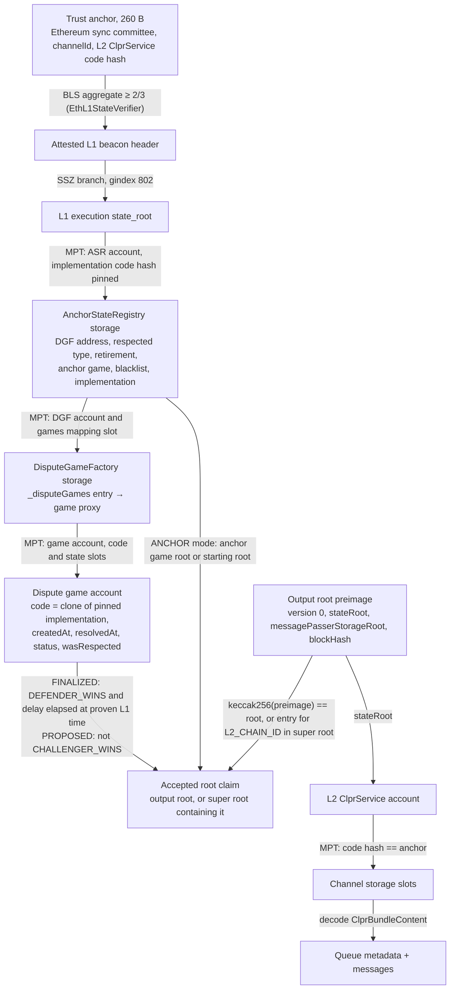
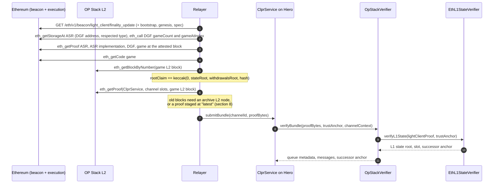

# OP Stack verifiers (`OpStackVerifier`, `OpStackProposedVerifier`)

These verifiers let a CLPR Service on Hiero accept bundles from a CLPR Service on an OP Stack L2 that
settles on Ethereum through fault-proof dispute games (`<L2> → Hiero`). They trust neither the L2
sequencer nor the relayer. Trust comes from Ethereum: the sync committee signs the L1 state, and in that
L1 state the L2's AnchorStateRegistry (ASR) and DisputeGameFactory (DGF) say which L2 output roots are
accepted. From an accepted output root the verifier opens the L2 state root, then proves the peer
`ClprService` account and its channel storage. Two tiers exist: FINALIZED accepts only roots that the
chain's own withdrawals would accept, and PROPOSED also accepts unresolved proposals.

> **Sources**: [OpStackVerifier.sol](./OpStackVerifier.sol) (FINALIZED), [OpStackProposedVerifier.sol](./OpStackProposedVerifier.sol) (PROPOSED), [OpStackVerifierBase.sol](./OpStackVerifierBase.sol), [profiles/XLayerProfile.sol](./profiles/XLayerProfile.sol), [OpStackOutputRootProof.sol](../../../libraries/proof/opstack/OpStackOutputRootProof.sol), [EthL1StateVerifier.sol](../ethereum/EthL1StateVerifier.sol), [EthBeaconLightClient.sol](../../../libraries/proof/beacon/EthBeaconLightClient.sol) ·
> **Interface**: [IClprVerifier.sol](../../../interfaces/IClprVerifier.sol) ·
> **Chain pages**: [docs/chains/README.md](../../../../docs/chains/README.md)

Blast, Mantle and Katana settle through an output oracle instead of dispute games. They are covered by
the sibling output-oracle verifiers (`src/verifiers/evm/opstack/oracle/` on `feat/opadapters-verifier`).

---

## 1. At a glance

| | |
|---|---|
| Chains covered | Base `eip155:8453`, OP Mainnet `eip155:10`, Ink `eip155:57073`, Unichain `eip155:130`, Celo `eip155:42220`, World Chain `eip155:480`, Soneium `eip155:1868`, X Layer `eip155:196`; live data also from Base Sepolia `eip155:84532` |
| Finality source | Ethereum sync committee (≥ 342 of 512) over the attested L1 header, then the L2's ASR and dispute games at that L1 state |
| Trust assumptions | FINALIZED: the sync committee, the L2 fault-proof system and its upgrade keys. PROPOSED: also the proposer. Permissioned chains (World Chain, Soneium, X Layer) also trust their proposer and challenger. |
| Typical bundle | PROPOSED `verifyBundle` on Base Sepolia: 3,910,935 gas, 46,084 B calldata (493/512). FINALIZED full bundle not yet measured on live data. |
| L1 half only (`verifyL2StateRoot`) | Base Sepolia GAME 2,765,246 gas / 32,676 B; X Layer GAME 2,577,100 gas / 26,948 B |
| Rotation | Same L1 sync-committee rotation as `EthMainnetVerifier`: 66,902 B and 4,836,081 gas on Sepolia (not re-measured through `EthL1StateVerifier`) |
| Contract size | `OpStackVerifier` / `OpStackProposedVerifier` 17,884 B runtime; `EthL1StateVerifier` 11,593 B; `EthMainnetVerifier` 19,078 B (EIP-170: 24,576 B) |
| Status | Base Sepolia: live data on anvil, PROPOSED full bundle and FINALIZED to the L2 state root (captured 2026-09-30). X Layer mainnet: live data on anvil, both tiers to the L2 state root (captured 2026-10-01). Other chains: profile probed on L1 on 2026-10-01, no live capture. Not yet run on Hedera. |

## 2. How it works



Walk-through of `OpStackVerifierBase.sol:verifyBundle(proofBytes, trustAnchor, channelContext)`:

1. **L1 light client.** `EthL1StateVerifier.sol:verifyL1State` (a separate deployed contract) checks the
   sync-committee signature over the attested header, the SSZ branch to the L1 execution `state_root`, and
   the optional committee rotation (`EthBeaconLightClient.sol:verifySyncCommitteeSignature`,
   `verifyExecutionStateRoot`, `verifyRotation`). It returns the L1 state root, the attested slot and the
   successor anchor.
2. **Output root.** `OpStackOutputRootProof.sol:outputRoot` hashes the 128-byte preimage and returns the
   L2 `stateRoot`.
3. **Settlement.** `OpStackOutputRootProof.sol:verify` proves, against the L1 state root:
   `_readRegistry` (ASR fields and implementation code hash), then `_verifyAnchor` (ANCHOR mode) or
   `_verifyGame` (GAME mode: `_registeredGame`, `_requireNotBlacklisted`, `_requireCloneOf`, status and
   time checks). `_claimedRoot` handles super roots. The L1 time is
   `L1_GENESIS_TIME + slot × L1_SECONDS_PER_SLOT`; Hiero's `block.timestamp` is never used.
4. **L2 state.** `ClprEvmBundleVerifier.sol:_verifyServiceStorageRoot` proves the peer `ClprService`
   account (address from `channelContext`, code hash from the anchor) against the L2 `stateRoot`, and
   `_verifyChannelStorage` proves the five or six channel slots derived from `channelId`.
5. **Messages.** `_decodeBundleContent` reads `ClprBundleContent`; an optional manifest proof is checked
   by `_verifyEndpointManifest`.

`verifyL2StateRoot(proof, trustAnchor)` runs steps 1 to 3 alone and returns the L2 state root. The live
tests use it where the L2 storage proofs cannot be fetched from public RPCs.

### Checks in GAME mode

| Verifier check | Mirrors (ASR) | Revert |
|---|---|---|
| Claimed `gameType` equals ASR `respectedGameType` | respected type | `GameTypeNotRespected` |
| DGF `_disputeGames[keccak256(abi.encode(gameType, root, extraData))]` is non-zero | `isGameRegistered` | `GameNotRegistered` |
| ASR `disputeGameBlacklist[game] == false` | `isGameBlacklisted` | `GameBlacklisted` |
| Game code hash matches, and the code is the DGF clone of the pinned implementation | `isGameRegistered` | `GameCodeMismatch`, `GameImplementationMismatch` |
| `createdAt > retirementTimestamp` | `isGameRetired` | `GameRetired` |
| `wasRespectedGameTypeWhenCreated` | `isGameRespected` | `GameNotRespectedWhenCreated` |
| `status != CHALLENGER_WINS` | — | `GameChallengerWins` |
| FINALIZED only: `DEFENDER_WINS`, `resolvedAt != 0`, `l1Time − resolvedAt > DISPUTE_GAME_FINALITY_DELAY_SECONDS` | `isGameResolved`, `isGameFinalized` | `GameNotResolved`, `GameNotFinalized` |

In ANCHOR mode the root must be the ASR anchor root. If an anchor game is set, the root must be that
game's root claim, proven through the DGF registration `(respectedGameType, root, extraData) → anchorGame`,
and the anchor game must not be blacklisted. Otherwise the root must be the stored `startingAnchorRoot`.

## 3. Bundle lifecycle



## 4. Trust model

The tier is fixed per deployed contract, so a Channel's pinned verifier also fixes its trust model.
`FINALITY()` returns it.

| | FINALIZED (`OpStackVerifier`) | PROPOSED (`OpStackProposedVerifier`) |
|---|---|---|
| Accepts | The ASR anchor root, or the root claim of a game for which `isGameClaimValid` holds at the proven L1 state | Also any registered game of the respected type that is `IN_PROGRESS` or `DEFENDER_WINS` |
| Trusts | Ethereum's sync committee (2/3); the L2 fault-proof system (game implementation, guardian powers); the ASR upgrade key | All of FINALIZED, **plus the proposer**: a bad proposal is accepted until a challenge wins, and a delivered message cannot be undone |
| Latency | Withdrawal finality: about 3.5 days plus the game clock on OP Mainnet and X Layer; 5 days on Base Sepolia | One proposal interval plus L1 inclusion |

Trusted in both tiers:

- **The Ethereum sync committee** (2/3 of 512), on the L1 header it signs.
- **The ASR upgrade key.** Whoever can upgrade the ASR proxy can point it at an implementation that
  rewrites `disputeGameFactory` or `anchorGame`, then point it back. The pinned implementation code hash
  then passes over forged storage. On most chains this key is the Superchain upgrade multisig.
- **The guardian.** It can pause, blacklist and retire games and change the respected type. Blacklist,
  retirement and type changes make verification fail closed. **`AnchorStateRegistry.paused()` is not
  checked**: the pause lives in SystemConfig/SuperchainConfig and is not proven.
- **Permissioned games.** On World Chain (type 1), Soneium (type 5) and X Layer (type 42 with an access
  manager) the proposer and challenger are permissioned, so FINALIZED also trusts them.
- **Proof systems.** Base's AggregateVerifier trusts its TEE and ZK provers; Celo and X Layer trust SP1
  (OP Succinct Lite) and the gateway owner.

Not trusted: the L2 sequencer, the relayer, and the RPC providers. Every slot is derived from the profile
or from `channelId`, never read from the proof.

To forge a bundle an attacker must control 2/3 of an Ethereum sync committee, or the L2's upgrade key, or
(on PROPOSED) the proposer, or (on permissioned FINALIZED chains) the proposer while the challengers stay
silent.

### X Layer specifics

X Layer (chain 196) has two links to Ethereum, and only one holds provable state:

| L1 contract | What it stores | Provable L2 state? |
|---|---|---|
| OP Stack fault proofs: OptimismPortal `0x6405…9993` (5.2.0) → ASR `0x0005…149d` (3.5.0) → DGF `0x9D4c…f675` (1.3.0) → OP Succinct Lite games (type 42) | One game per 3,600 L2 blocks (about 1 h); each `rootClaim` is the v0 output root of its L2 block | **Yes**; this is what `XLayerProfile` proves |
| AggLayer: RollupManager `0x5132…7aB2` rollup 3 → `AggchainECDSAMultisig` `0x2B0e…0507` (1-of-1 signer) | `lastLocalExitRoot` and `lastPessimisticRoot` only | No |

Assets do not move through the OP Stack contracts (the portal holds 0 ETH; bridging uses the AggLayer), so
the games' bonds are nominal (1e10 wei) and their only role is to attest X Layer's state. What FINALIZED
trusts on X Layer, read from mainnet on 2026-10-01, beyond the list above:

- **One permissioned proposer.** The game's `AccessManager` `0x98BA…c17B` allows one proposer, EOA
  `0xE439…394F`. Its `FALLBACK_TIMEOUT` is 31,536,000,000 s (about 1,000 years), so the permissionless
  fallback never triggers.
- **One challenger.** The same AccessManager allows one challenger, EOA `0x736E…2FF6`. A game not
  challenged within `maxChallengeDuration` (3,600 s) resolves `DEFENDER_WINS` without a proof. FINALIZED is
  sound if the proposer is honest, or if the challenger is honest and live.
- **SP1.** A challenged game resolves for the proposer only with an SP1 proof, checked through the
  SP1VerifierGateway `0x397A…a9B`, whose owner (Succinct) can add verifier routes.
- **Upgrade keys with no delay.** The ASR, SystemConfig and OptimismPortal proxies share ProxyAdmin
  `0x313c…fee6`, owned by a 2-of-3 Safe `0xC290…D45A` with no timelock. The DGF and its owner sit behind a
  TimelockController `0xFa3A…52d6` with a 1-hour minimum delay. EOA `0x6eE7…C6aA` is the guardian, the
  SystemConfig owner, the AccessManager owner and one of the Safe's signers.
- **A shared factory.** The DGF also hosts game type 1961 for another L2. The verifier accepts only type
  42 clones of the pinned implementation (live test: `GameTypeNotRespected`).

Latency on X Layer: a game is proposed about 30 min after its L2 block, resolves 1 h after creation if
unchallenged, and is final 3.5 days later, so about 3.6 days in total through FINALIZED. PROPOSED delivers
after about 30 min. X Layer would become trust-minimized if it opened challenging, put an upgrade delay
longer than the finality window on the ASR's ProxyAdmin, and split the guardian and AccessManager roles.
None of this needs a verifier change.

## 5. Proof format

The trust anchor is the 260-byte Ethereum anchor of `EthMainnetVerifier`
(`gvr ‖ forkVersion ‖ channelId ‖ aggregatePubkey ‖ committeeMerkleRoot ‖ codeHash`). Here `codeHash` pins
the **L2** `ClprService`.

### `proofBytes` (RLP list of 6, or 8 with a manifest update)

| # | Field | Type | Meaning |
|---|---|---|---|
| 0 | `lightClientProof` | bytes (RLP string) | Wraps `[attestedHeader, syncAggregate, executionStateRoot, executionBranch, nextCommittee, nextCommitteeBranch, nonSignerProofs]`, as in `EthMainnetVerifier` |
| 1 | `disputeProof` | list of 12 | See below |
| 2 | `outputRootPreimage` | 128 B | `version(0) ‖ stateRoot ‖ messagePasserStorageRoot ‖ blockHash`; since Isthmus the header's `withdrawalsRoot` is the message-passer storage root |
| 3 | `l2AccountProof` | list | MPT proof of the `ClprService` account against the L2 `stateRoot` |
| 4 | `l2StorageProof` | 5 or 6 × `[slot, nodes]` | Channel slots derived from `channelId` |
| 5 | `bundleContent` | bytes | Protobuf `ClprBundleContent` |
| 6, 7 | manifest | optional | Commitment-slot proof and preimage |

### `disputeProof` (RLP list of 12; unused items empty)

| # | Field | Meaning |
|---|---|---|
| 0 | `mode` | 0 ANCHOR, 1 GAME |
| 1, 2 | `gameType`, `extraData` | Game identity for the DGF lookup |
| 3, 4 | `asrAccountProof`, `asrStorageProof` | ASR fields: DGF address, `respectedGameType`/`retirementTimestamp`, EIP-1967 implementation, `anchorGame` or starting root, `disputeGameBlacklist[game]` |
| 5 | `asrImplAccountProof` | Implementation account, for the pinned code hash |
| 6, 7 | `dgfAccountProof`, `dgfStorageProof` | `_disputeGames` entry |
| 8, 9, 10 | `gameAccountProof`, `gameCode`, `gameStorageProof` | Game code (clone check) and state slots |
| 11 | `superRootPreimage` | `0x01 ‖ timestamp(8) ‖ (chainId(32) ‖ outputRoot(32))*` for `SUPER_ROOT_V1` chains |

For `SUPER_ROOT_V1` the claimed root is `keccak256(superRootPreimage)` and the entry for `L2_CHAIN_ID` must
equal the output root (`OutputRootNotInSuperRoot` otherwise).

### Profile (constructor data)

Constructor: `(IEthL1StateVerifier l1StateVerifier, uint64 l1GenesisTime, uint64 l1SecondsPerSlot, Profile profile)`
with `Profile = {rootFormat, l2ChainId, anchorStateRegistry, anchorStateRegistryImplCodeHash,
disputeGameFinalityDelaySeconds, gameImplementation, layout}`. Mainnet uses
`l1GenesisTime = 1606824023`, `l1SecondsPerSlot = 12`. `EthL1StateVerifier` takes the beacon layout
`(802, 9, 87, 6, 8192)` for Electra and Fulu.

Values read from Sourcify, Blockscout and live L1 storage on 2026-10-01:

| `layout` field | ASR 3.x / DGF 1.x (all chains below) |
|---|---|
| `asrDisputeGameFactorySlot`, `asrAnchorGameSlot`, `asrStartingAnchorRootSlot` | 1, 2, 3 |
| `asrBlacklistSlot`, `asrRespectedGameTypeSlot` | 5, 6 |
| `asrRespectedGameTypeOffset`, `asrRetirementTimestampOffset` | 0, 4 |
| `dgfGamesSlot` | 103 |
| `gameStateSlot`, `gameCreatedAtOffset`, `gameResolvedAtOffset`, `gameStatusOffset` | 0, 0, 8, 16 |

| Game implementation (respected type) | `gameWasRespectedSlot`, `gameWasRespectedOffset` |
|---|---|
| Base `AggregateVerifier` 0.2.0 (621) | 0, 18 |
| `SuperFaultDisputeGame` 0.8.0 (9) | 9, 0 |
| `PermissionedDisputeGame` 2.4.0 (1) | 10, 0 |
| `OPSuccinctFaultDisputeGame` 2.0.0 (42) | 9, 0 |
| `SuperPermissionedDisputeGame` 1.1.0 (5) | 0, 17 |

| Chain | Settlement (respected type) | `rootFormat` | Notes |
|---|---|---|---|
| Base Sepolia | AggregateVerifier, TEE+ZK (621), delay 0 | `OUTPUT_ROOT` | ASR `0x2fF5cC82dBf333Ea30D8ee462178ab1707315355` (3.7.0); live-verified |
| Base | AggregateVerifier 0.2.0 (621), ASR 3.7.0, delay 0 | `OUTPUT_ROOT` | Same layout as Base Sepolia |
| OP Mainnet | SuperFaultDisputeGame (9), permissionless, delay 3.5 d | `SUPER_ROOT_V1` | Layout, clone format and `keccak256(0x01 ‖ ts ‖ 10 ‖ outputRoot) == rootClaim` checked on live mainnet games |
| Ink | SuperFaultDisputeGame (9) | `SUPER_ROOT_V1` | |
| Unichain | SuperFaultDisputeGame (9) | `SUPER_ROOT_V1` | |
| World Chain | PermissionedDisputeGame (1) | `OUTPUT_ROOT` | Permissioned proposer and challenger |
| Soneium | SuperPermissionedDisputeGame (5) | `SUPER_ROOT_V1` | Permissioned |
| Celo | OPSuccinctFaultDisputeGame, OP Succinct Lite (42) | `OUTPUT_ROOT` | Trusts SP1 |
| X Layer | OPSuccinctFaultDisputeGame 2.0.0 (42), ASR 3.5.0, DGF 1.3.0, delay 3.5 d (302,400 s) | `OUTPUT_ROOT` | Full profile pinned in [`profiles/XLayerProfile.sol`](./profiles/XLayerProfile.sol) and `XLAYER_MAINNET_PROFILE` in `test/e2e/relay/opstack.ts`; live-verified |

Only Base Sepolia and X Layer have pinned, live-checked profiles. For the other chains, read the ASR
address, implementation code hash and game implementation at deployment with the same probe
(`respectedGameType`, `gameImpls`, Sourcify layouts); the live builder checks them against the chain.

## 6. Sync-committee rotation

The trusted set is Ethereum's sync committee, exactly as in `EthMainnetVerifier`: it rotates every 8,192
L1 slots (about 27 h), the rotation items (next committee and its gindex-87 branch) ride inside
`lightClientProof`, and the successor anchor id is the next period. The L2 has no validator set to follow.
A rotation adds 66,902 B and about 4.84M gas (measured for `EthMainnetVerifier` on a real Sepolia
rotation; not re-measured through `EthL1StateVerifier`). A Channel that misses a full period cannot catch
up and needs a new anchor.

## 7. Gas and calldata

Measured with `eth_estimateGas` on anvil, on live captures (re-run 2026-10-01). Hedera limits: 15M gas and
128 KB calldata.

| Measurement | Fixture | Gas | Calldata |
|---|---|---|---|
| PROPOSED `verifyBundle`, full L2 proofs, 493/512 signers, 19 non-signers | Base Sepolia, captured 2026-09-30 | 3,910,935 | 46,084 B |
| FINALIZED `verifyL2StateRoot`, GAME mode | Base Sepolia | 2,765,246 | 32,676 B |
| FINALIZED `verifyL2StateRoot`, ANCHOR mode | Base Sepolia | 2,473,604 | 27,876 B |
| FINALIZED `verifyL2StateRoot`, ANCHOR mode, 510/512 signers | X Layer mainnet, captured 2026-10-01 | 2,177,016 | 22,148 B |
| FINALIZED `verifyL2StateRoot`, GAME mode | X Layer mainnet | 2,577,100 | 26,948 B |
| PROPOSED `verifyL2StateRoot`, newest game | X Layer mainnet | 2,532,538 | 26,756 B |

Estimates, not measurements:

- A full FINALIZED bundle is about 3.9M gas and 46 KB: the GAME-mode run plus the same L2 proofs as the
  PROPOSED bundle.
- A bundle that also rotates adds about 67 KB and 4.8M gas, about 8.7M gas and 113 KB in total. That
  fits, but a relayer should not add a manifest update to a rotation bundle.

## 8. Limits and known gaps

- **Archive L2 proofs.** FINALIZED needs `eth_getProof` at an L2 block that is days old.
  - Base Sepolia: the anchor game's block is about 5 days old, outside public RPC windows.
  - X Layer: `rpc.xlayer.tech`, `xlayerrpc.okx.com` and thirdweb do not serve `eth_getProof`; Ankr and
    BlockPI need keys; `xlayer.drpc.org` serves it at `"latest"` only.
  - The builder stages a proof at `"latest"` for the block the next game will claim
    (`stageLatestL2Proof.ts`). A refresh after the game finalizes carries a full FINALIZED bundle. Base
    Sepolia has one staged game under `pending/`; X Layer has none yet.
- **No ClprService on these L2s.** The live L2 account is the `L2ToL1MessagePasser` predeploy
  (`0x4200…0016`) with its real code hash; the channel slots are MPT exclusion proofs.
- **Pause not proven** (section 4).
- **DGF and ASR proxy code** are not checked: the ASR address is pinned and the DGF address is read from
  ASR storage; only the ASR implementation and the game implementation are pinned by code hash.
- **Not run on Hedera yet.**
- **Hiero → L2 direction** is not built for any chain in this family. It would deploy the Hiero verifier
  contracts on the L2; whether each L2's EVM provides EIP-2537 was not checked here.

## 9. Upgrades and forks

- **Fail closed on contract upgrades.** The pinned `ANCHOR_STATE_REGISTRY_IMPL_CODE_HASH` fixes the
  finality delay; an ASR upgrade reverts with `AnchorStateRegistryImplMismatch`. The pinned
  `GAME_IMPLEMENTATION` fixes the game's layout and references; games from a new implementation revert
  with `GameImplementationMismatch`. The Channel stalls instead of mis-reading state. Pinning does not
  protect against the upgrade key itself (section 4).
- **Class B (fork-aware verifiers ADR).** Recovery is a redeployment with a new profile, which is pure
  data. The ADR (`ADR/2026-10-01-fork-aware-verifiers.md` in the spec fork, draft PR
  LFDT-CLPR/clpr-spec#1) names the OP Stack fork identity as the hardfork activation timestamp, proven
  through L1, with output root or predeploy layout changes as Class B. Its fork profiles would replace the
  redeployment; they are not implemented here.
- **Class C.** A new proof system (another root format, or a portal without an ASR) needs new code; the
  output-oracle verifiers are an example.
- **L1 forks** affect the L1 light client exactly as in `EthMainnetVerifier`: a new fork version needs an
  anchor update; Gloas needs new code.

## 10. Running it

```sh
# Foundry: synthetic rejection matrix, end-to-end with the real EthL1StateVerifier, X Layer live fixture
forge test --match-path 'test/verifiers/evm/opstack/*'

# Base Sepolia live replay on anvil
forge build
npm run test:e2e:opstack-live
npm run opstack-live:refresh            # re-capture and stage the newest game's L2 proofs

# X Layer mainnet live replay on anvil
npm run test:e2e:opstack-live:xlayer
npm run opstack-live:stage:xlayer       # stage the next game's L2 proof (waits up to about 1 h)
npm run opstack-live:refresh:xlayer     # re-capture; rewrites test/verifiers/evm/opstack/fixtures/xlayer-live.json

# Regenerate the synthetic Foundry fixture (two anvils)
npm run opstack:synthetic-fixture
```

Results on this branch (2026-10-01): Foundry 50 passed, 2 skipped (4 suites; the skips are the X Layer
full-bundle cases that need a staged L2 proof); Base Sepolia replay 13 passed, 1 skipped (full FINALIZED
bundle, pending); X Layer replay 13 passed, 2 skipped (full bundles, no staged proof).

## 11. Files

| File | Purpose |
|---|---|
| `src/verifiers/evm/opstack/OpStackVerifierBase.sol` | Shared logic: `verifyBundle`, `verifyConfig`, `verifyL2StateRoot` |
| `src/verifiers/evm/opstack/OpStackVerifier.sol` | FINALIZED tier |
| `src/verifiers/evm/opstack/OpStackProposedVerifier.sol` | PROPOSED tier |
| `src/verifiers/evm/opstack/profiles/XLayerProfile.sol` | Pinned X Layer profile |
| `src/libraries/proof/opstack/OpStackOutputRootProof.sol` | ASR, DGF and game proofs; output and super roots |
| `src/verifiers/evm/ethereum/EthL1StateVerifier.sol` | Deployed L1 light-client helper |
| `src/libraries/proof/beacon/EthBeaconLightClient.sol` | Sync-committee light client as a library |
| `test/verifiers/evm/opstack/OpStackVerifier.t.sol` | Synthetic rejection matrix, super roots, end-to-end |
| `test/verifiers/evm/opstack/OpStackXLayerLive.t.sol` | X Layer mainnet fixture in Foundry |
| `test/verifiers/evm/opstack/fixtures/` | Foundry fixtures (synthetic, X Layer live) |
| `test/e2e/fixtures/base-sepolia-live/`, `test/e2e/fixtures/xlayer-live/` | Live captures and staged L2 proofs (`pending/`) |
| `test/e2e/relay/buildOpStackLiveProof.ts` | Live capture, refresh and staging |
| `test/e2e/relay/stageLatestL2Proof.ts` | Stages a `"latest"` L2 proof for the next game |
| `test/e2e/relay/opstack.ts` | Encoders and `XLAYER_MAINNET_PROFILE` |
| `test/e2e/relay/buildOpStackSyntheticFixture.ts` | Synthetic fixture generator |
| `test/e2e/tests/verifiers/opstack-live-base-sepolia.spec.ts`, `opstack-live-xlayer.spec.ts` | Live replay specs |

## 12. References

- OP Stack fault proofs and the AnchorStateRegistry: <https://specs.optimism.io/fault-proof/stage-one/anchor-state-registry.html>
- Output root format: <https://specs.optimism.io/protocol/proposals.html>
- Interop super roots: <https://specs.optimism.io/interop/overview.html>
- Superchain registry: <https://github.com/ethereum-optimism/superchain-registry>
- OP Succinct (Lite): <https://github.com/succinctlabs/op-succinct>
- Sourcify verified contracts: <https://sourcify.dev>
- CLPR spec and fork-aware verifiers ADR (draft PR LFDT-CLPR/clpr-spec#1): <https://github.com/LFDT-CLPR/clpr-spec>
