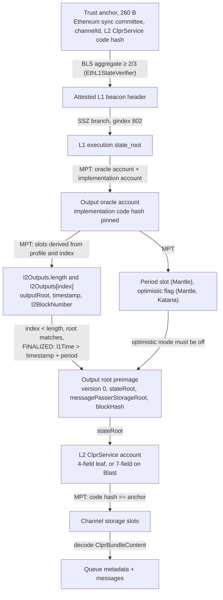
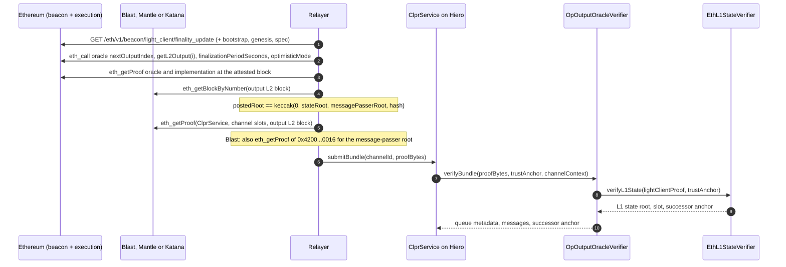

# Output-oracle verifiers: Blast, Mantle, Katana (`OpOutputOracleVerifier`)

These verifiers let a CLPR Service on Hiero accept bundles from OP-derived L2s that settle on Ethereum
through an output oracle instead of dispute games (`<L2> → Hiero`): Blast and Mantle post output roots
into an `L2OutputOracle`-style contract, and Katana's Polygon AggLayer aggchain contract keeps the same
kind of array. All three store an append-only `OutputProposal[] l2Outputs`, each
`{outputRoot, timestamp, l2BlockNumber}`. The verifier proves, under Ethereum's sync committee, that an
output is posted (and, for FINALIZED, past the chain's own finalization period), opens the output root to
the L2 state root, and proves the peer `ClprService` channel storage there. Only this settlement step
differs from the dispute-game family; the L1 light client and the L2 storage steps are shared.

> **Sources**: [OpOutputOracleVerifier.sol](./OpOutputOracleVerifier.sol) (FINALIZED), [OpOutputOracleProposedVerifier.sol](./OpOutputOracleProposedVerifier.sol) (PROPOSED), [OpOutputOracleVerifierBase.sol](./OpOutputOracleVerifierBase.sol), [OpOutputOracleProof.sol](../../../../libraries/proof/opstack/OpOutputOracleProof.sol), [OpStackBundleVerifierBase.sol](../OpStackBundleVerifierBase.sol), [EthL1StateVerifier.sol](../../ethereum/EthL1StateVerifier.sol) ·
> **Interface**: [IClprVerifier.sol](../../../../interfaces/IClprVerifier.sol) ·
> **Sibling**: dispute-game chains in [../README.md](../README.md) ·
> **Chain pages**: [blast.md](../../../../../docs/chains/blast.md), [mantle.md](../../../../../docs/chains/mantle.md), [katana.md](../../../../../docs/chains/katana.md)

---

## 1. At a glance

| | Blast | Mantle | Katana |
|---|---|---|---|
| CAIP-2 | `eip155:81457` | `eip155:5000` | `eip155:747474` |
| Settlement | `L2OutputOracle` 1.6.0 | `OPSuccinctL2OutputOracle` 2.0.1 | `AggchainFEP` 3.0.0 (AggLayer rollup 20) |
| Finality source | Sync committee over L1; output posted and 7 days old | Sync committee over L1; output posted with an SP1 proof and 12 h old | Sync committee over L1; output appended after the AggLayer pessimistic proof |
| Trust (FINALIZED) | Permissioned proposer, unless the challenger deletes within 7 days | SP1 (OP Succinct), its vkeys and owner, and the challenger's veto window | AggLayer pessimistic proof wrapping OP Succinct FEP, the 1-of-1 aggchain signer, AggLayer governance |
| Typical bundle (live) | PROPOSED 3,048,294 gas, 30,884 B | FINALIZED 3,640,599 gas, 37,732 B | FINALIZED 2,634,859 gas, 22,756 B |
| Rotation | L1 sync-committee rotation: 66,902 B and about 4.84M gas (Ethereum figure) | same | same |
| Status | PROPOSED full bundle and FINALIZED L1 half on mainnet data (anvil) | FINALIZED and PROPOSED full bundles on mainnet data (anvil) | FINALIZED full bundle on mainnet data (anvil) |

Common: one capture at Ethereum mainnet slot 15,333,427 (Fulu, 510/512 signers), taken 2026-10-01.
Contract size: `OpOutputOracleVerifier` / `OpOutputOracleProposedVerifier` 15,947 B runtime, plus the
shared `EthL1StateVerifier` (11,593 B). Hedera limits (15M gas, 128 KB calldata) hold for every bundle.
Not yet run on Hedera.

## 2. How it works



Walk-through of `OpStackBundleVerifierBase.sol:verifyBundle(proofBytes, trustAnchor, channelContext)` for
the oracle family:

1. **L1 light client.** `EthL1StateVerifier.sol:verifyL1State` returns the L1 state root, the attested slot
   and the successor anchor after a rotation.
2. **Output root.** The 128-byte preimage is hashed to the output root and yields the L2 `stateRoot`.
3. **Settlement.** `OpOutputOracleVerifierBase.sol:_verifyOutputRoot` calls
   `OpOutputOracleProof.sol:verify`. It proves the oracle account and its EIP-1967 implementation code
   hash, derives the slots with `slotsFor(profile, index)`, and checks length, root, the optimistic flag
   and (FINALIZED) the period. `l1Time = L1_GENESIS_TIME + slot × 12`; Hiero's `block.timestamp` is never
   used.
4. **L2 state.** `OpOutputOracleVerifierBase.sol:_verifyL2ServiceStorageRoot` proves the peer
   `ClprService` account with the profile's account format (Blast's 7-field leaf), then
   `_verifyChannelStorage` proves the channel slots derived from `channelId`.
5. **Messages.** `_decodeBundleContent` reads `ClprBundleContent`; an optional manifest proof is checked.

`verifyOutput(oracleProof, l1StateRoot, l1Time, outputRoot)` runs step 3 alone for relayers and monitors.
It takes the L1 state root as an argument, so it does not replace `verifyBundle`.

## 3. Bundle lifecycle



## 4. Trust model

The tier is fixed per deployed contract; `FINALITY()` returns it. All tiers trust Ethereum's sync
committee (2/3) on the attested L1 head.

| | FINALIZED | PROPOSED |
|---|---|---|
| **Blast** | The proposer, unless the challenger deletes a bad output within 7 days (no fault proofs: permissioned-challenger model) | **The proposer alone** until the challenger deletes |
| **Mantle** | SP1 (OP Succinct range and aggregation programs, verifier `0x3B60…185e`), the vkeys and `rollupConfigHash`, their owner, and the challenger's veto window | The same SP1 proof, inside the 12 h window in which the challenger can still delete |
| **Katana** | The AggLayer pessimistic proof wrapping the FEP (OP Succinct) proof under the AggLayerGateway default vkeys, the 1-of-1 aggchain signer, and AggLayer governance (the AgglayerManager is upgradeable) | Identical to FINALIZED: no deletion, period 0 |
| Latency | Blast about 7 d + up to 1 h; Mantle about 12 h + up to 1 h; Katana up to about 1 h | Blast and Mantle: one output interval (about 1 h) + L1 inclusion |

Also trusted:

- **Upgrade keys** of the portals, the oracles and the AgglayerManager. An upgraded AgglayerManager could
  append any output to Katana's `AggchainFEP`.
- **Optimistic mode history.** The flag is read at the proven L1 state. While it is set both tiers stall
  (fail closed), but outputs posted during an earlier optimistic window stay in the array afterwards. A
  Channel that cannot accept this needs an off-chain monitor of `OptimisticModeToggled` /
  `EnableOptimisticMode` events.
- **Mantle's `finalizationPeriodSeconds`** is read from storage at the proven state; if the challenger
  shortens it, FINALIZED follows, as Mantle's portal does.

Not checked: the portal and AgglayerManager code (the oracle address is pinned; the builder checks the
binding at capture time). Not trusted: the relayer, the sequencers, the RPC providers.

To forge a bundle an attacker must control 2/3 of an Ethereum sync committee, or the chain's upgrade
keys, or: on Blast the proposer (with the challenger silent for 7 days, or at once on PROPOSED); on Mantle
SP1 or its vkey owner; on Katana the AggLayer proof system and the aggchain signer.

## 5. Proof format

The trust anchor is the 260-byte Ethereum anchor of `EthMainnetVerifier`; `codeHash` pins the L2
`ClprService`.

### `proofBytes` (shared OP layout, 6 or 8 items)

| # | Field | Meaning |
|---|---|---|
| 0 | `lightClientProof` | Ethereum light-client items, wrapped in an RLP string |
| 1 | `oracleProof` | `[outputIndex, oracleAccountProof, oracleStorageProof, oracleImplAccountProof]` |
| 2 | `outputRootPreimage` | 128 B: `0 ‖ stateRoot ‖ messagePasserStorageRoot ‖ blockHash` |
| 3 | `l2AccountProof` | MPT proof of the `ClprService` account (4 or 7 fields) |
| 4 | `l2StorageProof` | 5 or 6 channel slots derived from `channelId` |
| 5 | `bundleContent` | Protobuf `ClprBundleContent` |
| 6, 7 | manifest | Optional commitment-slot proof and preimage |

The oracle storage proof carries `[slot, nodes]` entries. The verifier derives every slot it needs, and
extra entries are ignored:

1. `l2Outputs.length`, the array base slot.
2. The EIP-1967 implementation slot.
3. The element, `keccak256(outputsSlot) + 2·index`.
4. The next slot, `+1`: `timestamp` (low 128 bits) and `l2BlockNumber` (high 128 bits).
5. The period slot, for STORAGE profiles.
6. The optimistic-flag slot, where the oracle has one.

### Profile (constructor data)

`(IEthL1StateVerifier l1StateVerifier, uint64 l1GenesisTime, uint64 l1SecondsPerSlot, OpOutputOracleProof.Profile profile, L2AccountFormat accountFormat)`
with `Profile = {oracle, oracleImplCodeHash, outputsSlot, periodSource, finalizationPeriodSeconds,
finalizationPeriodSlot, hasOptimisticMode, optimisticModeSlot, optimisticModeOffset}` and
`L2AccountFormat = {fields, storageRootIndex, codeHashIndex}`. Mainnet: `l1GenesisTime = 1606824023`,
`l1SecondsPerSlot = 12`; `EthL1StateVerifier(802, 9, 87, 6, 8192)`.

| | Blast | Mantle | Katana |
|---|---|---|---|
| `oracle` | `0x826D1B0D4111Ad9146Eb8941D7Ca2B6a44215c76` | `0x31d543e7BE1dA6eFDc2206Ef7822879045B9f481` | `0x100d3ca4f97776A40A7D93dB4AbF0FEA34230666` |
| `oracleImplCodeHash` | `0xf0b82e9f910d7f9ec66bc721e163d6cb875a539e6e2161a8bdd286a488c9dc9a` | `0xefcc10a3c3e18892f239c9e297e3db584a584d7da894f4c230b489378c57570f` | `0x1bf6addd3946244bb16ed6f289e604c8ec8bcdc7617a3aee929c6134d300b342` |
| `outputsSlot` | 3 | 3 | 116 |
| `periodSource`, period | IMMUTABLE, 604,800 s | STORAGE, slot 8 (43,200 s at capture) | IMMUTABLE, 0 |
| Optimistic flag | none | slot 16, offset 0 (`false`) | slot 124, offset 0 (`false`) |
| `accountFormat` | `(7, 5, 6)` | `(4, 2, 3)` | `(4, 2, 3)` |

Settlement facts read from Sourcify (exact or full match) and live L1 storage on 2026-10-01:

| | Blast | Mantle | Katana |
|---|---|---|---|
| Implementation | `0x1c90…16eb` | `0x4059…6f50` | `0x9532…c660` |
| Bound by | portal `0x0Ec6…6Cb` 1.10.0 `l2Oracle()` | portal `0xc54c…A8Fb` 1.7.0 `L2_ORACLE()` | AgglayerManager `0x5132…7aB2` `rollupIDToRollupDataV2(20).rollupContract` |
| Who posts | 1 permissioned proposer `0x082b…A821`; outputs not proven | Approved proposers, each post with an SP1 validity proof unless optimistic | The AgglayerManager after the pessimistic proof; the 1-of-1 aggchain signer (trusted sequencer) also signs |
| Who can remove | Challenger `0x4f72…8B05` within the period | Challenger `0x2F44…daC9` within the period | Nobody |
| Output interval (observed) | 1,800 L2 blocks (about 1 h) | ≥ 1,800 L2 blocks (about 1 h) | one AggLayer certificate, about 1 h (outputs #10338 → #10438 took 102.5 h) |
| Message-passer root | From L2 `eth_getProof` of `0x4200…0016` (header `withdrawalsRoot` is empty, pre-Isthmus) | Header `withdrawalsRoot` (Isthmus) | Header `withdrawalsRoot` (Isthmus) |

Re-read every value at deployment with `npm run opadapters-live:refresh`; the builder checks each layout
value against the contract's getters and each slot against the proven storage.

## 6. Sync-committee rotation

The trusted set is Ethereum's sync committee, exactly as in `EthMainnetVerifier`: it rotates every 8,192 L1
slots (about 27 h), the rotation items ride inside `lightClientProof`, and the successor anchor id is the
next period. A rotation adds 66,902 B and about 4.84M gas (the Ethereum measurement on a real Fulu
rotation; not re-measured here). A Channel that misses a full period cannot catch up and needs a new anchor.

## 7. Gas and calldata

`eth_estimateGas` on anvil, live mainnet capture (2026-10-01, slot 15,333,427, 510/512 signers, 2 non-signer
proofs), re-run 2026-10-01:

| Bundle | Output | Gas | Calldata |
|---|---|---|---|
| Mantle FINALIZED `verifyBundle` | #22306 (past 12 h) | 3,640,599 | 37,732 B |
| Mantle PROPOSED `verifyBundle` | #22318 (newest) | 3,672,351 | 38,020 B |
| Blast PROPOSED `verifyBundle` | #22780 | 3,048,294 | 30,884 B |
| Katana FINALIZED `verifyBundle` | #10438 (newest) | 2,634,859 | 22,756 B |

Estimate, not a measurement: Mantle plus a rotation is about 8.5M gas and 105 KB, within both limits; a
relayer should not add a manifest update to a rotation bundle. Bundle size grows with the depth of the L1
and L2 tries and with the number of non-signers.

## 8. Limits and known gaps

- **Blast FINALIZED full bundle.** Blast's public RPC serves `eth_getProof` only 10,000 blocks (about
  5.5 h) back. Each refresh stages the newest output's L2 proofs under `pending/` (now
  `pending/blast-22780.json`); a refresh 7 or more days later carries a full FINALIZED bundle. Until then
  only the L1 half is verified (`verifyOutput` on output #22612).
- **No ClprService on these chains.** The L2 account is the `L2ToL1MessagePasser` with its real code hash;
  the channel slots are MPT exclusion proofs.
- **Optimistic-mode history** (section 4) and **portal binding** are not proven on-chain.
- **Not run on Hedera yet.**
- **Hiero → Blast, Mantle, Katana** is not built; whether their EVMs provide EIP-2537 was not checked.

### X Layer

X Layer (chain 196) is not served by this verifier. Its AggLayer side (rollup 3, `AggchainECDSAMultisig`
v1.0.0 `0x2B0e…0507`, 1-of-1 signer) stores only `lastLocalExitRoot` and `lastPessimisticRoot`: no output
root, state root or block hash of X Layer reaches L1 through it, and the ECDSA aggchain proof is a single
signature. X Layer's provable state is on its **OP Stack fault-proof** path instead (ASR 3.5.0, DGF 1.3.0,
OP Succinct Lite games of type 42), which the dispute-game verifier covers with the pinned `XLayerProfile`
on `feat/xlayer-verifier`. If X Layer moved to `AggchainFEP` as Katana did, this verifier would also serve
it unchanged with Katana's profile and X Layer's oracle address.

## 9. Upgrades and forks

- **Fail closed.** The oracle implementation's code hash is pinned. It fixes the storage layout, Blast's
  `FINALIZATION_PERIOD_SECONDS` immutable, the absence of a delete path in Katana's `AggchainFEP`, and that
  only the AgglayerManager can append. An upgrade reverts with `OracleImplMismatch`.
- **Class B (fork-aware verifiers ADR).** Recovery is a redeployment with a new profile, which is pure
  data. The ADR (`ADR/2026-10-01-fork-aware-verifiers.md` in the spec fork, draft PR LFDT-CLPR/clpr-spec#1)
  would replace the redeployment with dual-controlled fork profiles; not implemented here.
- **Class C.** A move to dispute games (for example Blast or Mantle adopting fault proofs) is served by the
  sibling dispute-game verifiers. When a portal is repointed, the old oracle stops growing and the Channel
  stalls; its outputs remain valid past states.
- **L1 forks** affect the light client as in `EthMainnetVerifier`.

## 10. Running it

```sh
# Foundry: synthetic suite (23) and live suite (16) for the oracle verifiers, plus the OP Stack suites
forge test --match-path 'test/verifiers/evm/opstack/**'

# Live mainnet replay on anvil (real sync-committee signature)
forge build
npm run test:e2e:opadapters-live
npm run opadapters-live:refresh        # re-capture; rewrites test/verifiers/evm/opstack/oracle/fixtures/live.json
npm run opadapters:synthetic-fixture   # regenerate the synthetic Foundry fixture
```

Results on this branch (2026-10-01): Foundry 83 passed (oracle synthetic 23, oracle live 16, OP Stack 44);
live replay 12 passed, 1 skipped (Blast full FINALIZED bundle, pending).

The synthetic suite covers the period boundary, a period read from storage, a deleted output still in
storage past `length`, optimistic mode, the Katana layout, an unpinned implementation, another oracle's
proof, slot mismatches, a full `verifyBundle` with a populated channel, wrong code hash, another channel,
another output's preimage, wrong account format, and the constructor guards. The live suite runs the real
mainnet oracle and L2 proofs through the real `EthL1StateVerifier` with a generator committee, including
bad signature, below 2/3, wrong validator set and wrong fork version.

## 11. Files

| File | Purpose |
|---|---|
| `src/verifiers/evm/opstack/oracle/OpOutputOracleVerifierBase.sol` | Settlement step and L2 account format |
| `src/verifiers/evm/opstack/oracle/OpOutputOracleVerifier.sol` | FINALIZED tier |
| `src/verifiers/evm/opstack/oracle/OpOutputOracleProposedVerifier.sol` | PROPOSED tier |
| `src/libraries/proof/opstack/OpOutputOracleProof.sol` | Oracle storage proof, slot derivation, checks |
| `src/verifiers/evm/opstack/OpStackBundleVerifierBase.sol` | Shared bundle shell (L1 light client, L2 storage) |
| `src/verifiers/evm/ethereum/EthL1StateVerifier.sol` | Deployed L1 light-client helper |
| `test/verifiers/evm/opstack/oracle/OpOutputOracleVerifier.t.sol` | Synthetic and live Foundry suites |
| `test/verifiers/evm/opstack/oracle/fixtures/{live,synthetic}.json` | Foundry fixtures |
| `test/e2e/fixtures/opadapters-live/capture.json`, `pending/` | Live mainnet capture and staged Blast proofs |
| `test/e2e/relay/buildOpOracleLiveProof.ts` | Live capture and refresh |
| `test/e2e/relay/buildOpOracleSyntheticFixture.ts` | Synthetic fixture generator |
| `test/e2e/relay/opOracle.ts` | Profiles and encoders |
| `test/e2e/tests/verifiers/opadapters-live-mainnet.spec.ts` | Live replay on anvil |

## 12. References

- OP Stack `L2OutputOracle` and withdrawal finalization: <https://specs.optimism.io/protocol/withdrawals.html>
- OP Succinct (`OPSuccinctL2OutputOracle`, FEP): <https://github.com/succinctlabs/op-succinct>
- Polygon AggLayer contracts (`AggchainFEP`, `AggchainECDSAMultisig`): <https://github.com/agglayer/agglayer-contracts>
- Sourcify verified contracts: <https://sourcify.dev>
- Public L2 RPCs used: `rpc.mantle.xyz` (archive proofs), `katana.drpc.org`, `rpc.blast.io` (10k-block window)
- CLPR spec and fork-aware verifiers ADR (draft PR LFDT-CLPR/clpr-spec#1): <https://github.com/LFDT-CLPR/clpr-spec>
