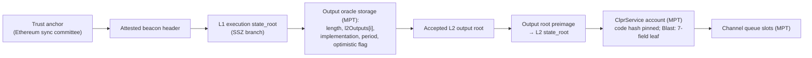

# OP-derived chains without dispute games: Blast, Mantle, Katana (and why not X Layer)

> **Sources**: [OpOutputOracleVerifier.sol](./OpOutputOracleVerifier.sol) (FINALIZED), [OpOutputOracleProposedVerifier.sol](./OpOutputOracleProposedVerifier.sol) (PROPOSED), [OpOutputOracleVerifierBase.sol](./OpOutputOracleVerifierBase.sol), [OpOutputOracleProof.sol](../../../../libraries/proof/opstack/OpOutputOracleProof.sol), [OpStackBundleVerifierBase.sol](../OpStackBundleVerifierBase.sol), [EthL1StateVerifier.sol](../../ethereum/EthL1StateVerifier.sol)
> **Interface**: [IClprVerifier.sol](../../../../interfaces/IClprVerifier.sol)
> **Sibling**: the dispute-game family (Base, OP Mainnet, Ink, Unichain, …) in [../README.md](../README.md)

---

## 1. The big picture

The [OP Stack verifiers](../README.md) cover chains that settle with an AnchorStateRegistry and a DisputeGameFactory. Four OP-derived chains settle differently:

- **Blast** and **Mantle** post output roots into an `L2OutputOracle`-style contract.
- **Katana** settles through the Polygon AggLayer. Its aggchain contract keeps the same kind of output array.
- **X Layer** settles through the AggLayer too, but puts no L2 state commitment on L1 at all (§9).

The first three have the same L1 shape: an append-only `OutputProposal[] l2Outputs` array. Each element is `{outputRoot, timestamp, l2BlockNumber}`, and `timestamp` is the L1 time the output was posted. One verifier covers all three. Only step 2 differs from the dispute-game family; steps 1, 3 and 4 are the shared [OpStackBundleVerifierBase](../OpStackBundleVerifierBase.sol).



Every arrow is checked on-chain. If one link fails, the call reverts.

---

## 2. The chains: settlement facts, verified on 2026-10-01

All addresses are on Ethereum mainnet. The facts were read from the verified implementation sources (Sourcify, exact or full match) and from live L1 storage at the captured block (§7). For each chain, the output root of a live output was recomputed from the L2 header as `keccak256(0 ‖ stateRoot ‖ messagePasserStorageRoot ‖ blockHash)` and matched the posted root.

| | **Blast** (chain 81457) | **Mantle** (chain 5000) | **Katana** (chain 747474) |
|---|---|---|---|
| Settlement contract | `L2OutputOracle` 1.6.0, proxy `0x826D1B0D4111Ad9146Eb8941D7Ca2B6a44215c76` | `OPSuccinctL2OutputOracle` 2.0.1, proxy `0x31d543e7BE1dA6eFDc2206Ef7822879045B9f481` | `AggchainFEP` 3.0.0, proxy `0x100d3ca4f97776A40A7D93dB4AbF0FEA34230666` |
| Implementation (code hash pinned) | `0x1c90…16eb` (`0xf0b82e9f…c9dc9a`) | `0x4059…6f50` (`0xefcc10a3…c57570f`) | `0x9532…c660` (`0x1bf6addd…d300b342`) |
| Bound by | portal `0x0Ec6…6Cb` 1.10.0 `l2Oracle()` | portal `0xc54c…A8Fb` 1.7.0 `L2_ORACLE()` (immutable) | AgglayerManager `0x5132…7aB2` `rollupIDToRollupDataV2(20).rollupContract` |
| Who posts | 1 permissioned proposer `0x082b…A821`. Outputs are **not proven**. | Approved proposers. Each post carries an **SP1 validity proof** (OP Succinct aggregation), unless the oracle is in optimistic mode. | The AgglayerManager, after it verifies the **pessimistic proof**. That proof wraps the chain's OP Succinct FEP proof. The 1-of-1 aggchain signer (the trusted sequencer) must also sign. |
| Who can remove | Challenger `0x4f72…8B05`: `deleteL2Outputs` within the period | Challenger `0x2F44…daC9`: `deleteL2Outputs` within the period | Nobody: no delete function |
| Finalization rule (portal) | `block.timestamp > timestamp + 604800` (7 days, an implementation **immutable**) | `block.timestamp > timestamp + finalizationPeriodSeconds` (43,200 s = 12 h, **storage slot 8**, which the challenger can change: ≥ 1 h, or ≥ 7 d in optimistic mode) | Final when appended (period **0**) |
| Optimistic mode | — | `optimisticMode` slot 16 (offset 0) is `false` | `optimisticMode` slot 124 (offset 0) is `false`. `optimisticModeManager` is packed at offset 1. |
| `l2Outputs` slot | 3 | 3 | 116 |
| Output interval (observed) | 1,800 L2 blocks (~1 h) | ≥ 1,800 L2 blocks (~1 h) | one AggLayer certificate, ~1 h (outputs #10338 → #10438 took 102.5 h) |
| L2 account leaf | **7 fields** `[nonce, flags, fixed, shares, remainder, storageRoot, codeHash]` (blast-geth `types.StateAccount`, which carries the yield shares) | Ethereum 4 fields | Ethereum 4 fields |
| `messagePasserStorageRoot` | From L2 `eth_getProof` of `0x4200…0016`. The header's `withdrawalsRoot` is the empty root (pre-Isthmus). | The L2 header's `withdrawalsRoot` (Isthmus) | The L2 header's `withdrawalsRoot` (Isthmus) |

---

## 3. Tiers and trust

The tier is fixed per deployed contract, so a channel's pinned verifier code hash also fixes its trust model. `FINALITY()` returns the tier.

**What each tier accepts, at the proven L1 state (`OpOutputOracleProof.verify`).**

Both tiers require all of the following:

| Check | Revert |
|---|---|
| The oracle's EIP-1967 implementation has the pinned code hash | `OracleImplMismatch` |
| `index < l2Outputs.length`. `deleteL2Outputs` only truncates the length and leaves the old elements in storage, so the length is what tells a deleted output apart. | `OutputNotPosted` |
| `l2Outputs[index].outputRoot` equals the output root of the bundle's preimage | `OutputRootMismatch` |
| The optimistic-mode flag is clear, where the oracle has one | `OptimisticModeEnabled` |

FINALIZED also requires `l1Time > l2Outputs[index].timestamp + period`. This is `OptimismPortal._isFinalizationPeriodElapsed`, the rule the chain's own withdrawals use, and its revert is `OutputNotFinalized`.

`l1Time` is `L1_GENESIS_TIME + attestedSlot × 12`. The slot is authenticated by the sync-committee signature. `block.timestamp` on Hiero is never used.

**What each tier trusts, per chain.**

All tiers trust Ethereum's sync committee (2/3).

| | FINALIZED | PROPOSED |
|---|---|---|
| **Blast** | The proposer, *unless* the challenger deletes a bad output within 7 days. This is Blast's own withdrawal security: there are no fault proofs, so it is a permissioned-challenger model. | **The proposer alone.** A wrong output is accepted until the challenger deletes it, and CLPR cannot undo a message delivered against it. |
| **Mantle** | SP1 (OP Succinct range + aggregation programs, verifier `0x3B60…185e`), the vkeys and `rollupConfigHash`, and the owner who sets them. Also the challenger's veto window. | The same SP1 proof, but inside the 12 h window in which the challenger can still delete the output. The proposer cannot post an unproven output while optimistic mode is off. |
| **Katana** | The AggLayer pessimistic proof, which wraps the FEP (OP Succinct) proof under the AggLayerGateway default vkeys (`useDefaultVkeys = true`). Also the 1-of-1 aggchain signer and Polygon AggLayer governance (the AgglayerManager can be upgraded). | Identical to FINALIZED: there is no deletion and the period is 0. |
| Latency (L2 block → deliverable) | Blast ~7 d + up to 1 h. Mantle ~12 h + up to 1 h. Katana up to ~1 h (one certificate). | Blast and Mantle: one output interval (~1 h) plus L1 inclusion |

**Optimistic mode is a residual risk.** It is read at the proven L1 state, not per output. While the flag is set, both tiers stall, which is fail-closed. The flag cannot tell which outputs were *posted* during an earlier optimistic window. In optimistic mode, Mantle requires a period of at least 7 days and Katana accepts sequencer-signed outputs with no state-transition proof. Such outputs stay in the array after the mode is switched off. A channel that cannot accept this needs an off-chain monitor of `OptimisticModeToggled` / `EnableOptimisticMode` events.

### What is not checked

- **The portal and AgglayerManager code.** The oracle address is pinned directly. The relayer's builder checks the binding at capture time (§7), and the verifier does not re-prove it.
  - If a portal is repointed to a new oracle, as in a migration to fault proofs, the old oracle stops growing and the channel stalls. Its outputs remain valid past states.
  - Upgrade powers over these contracts (the proxy admins of the portals, the oracles and the AgglayerManager) are trusted, as for every L2 verifier. An upgraded AgglayerManager could append any output to Katana's AggchainFEP.
- **Mantle's `finalizationPeriodSeconds`.** It is read from storage at the proven state. If the challenger shortens it to 1 h, FINALIZED follows, exactly as Mantle's portal does.

---

## 4. Upgrades fail closed

The oracle's implementation code hash is pinned. That pin fixes everything the verifier assumes:
- the storage layout (`l2Outputs`, period and flag slots);
- Blast's `FINALIZATION_PERIOD_SECONDS` immutable;
- that Katana's AggchainFEP has no delete path;
- that only the AgglayerManager (an immutable of the implementation) can append.

An upgrade makes verification revert with `OracleImplMismatch` instead of mis-reading state. Recovery means redeploying with a new profile, which is pure data. This is the "Class B" path of the fork-aware-verifier ADR. A move to dispute games is Class C, and is served by the sibling [OP Stack verifiers](../README.md).

---

## 5. Proof layout

The bundle is the shared layout (see [OpStackBundleVerifierBase](../OpStackBundleVerifierBase.sol)): `[lightClientProof, oracleProof, outputRootPreimage, l2AccountProof, l2StorageProof, bundleContent (, manifestStorageProof, manifestPreimage)]`.

**Oracle proof.** It is an RLP list with 4 items: `[outputIndex, oracleAccountProof, oracleStorageProof, oracleImplAccountProof]`.

The storage proof carries `[slot, proofNodes]` entries. The verifier derives the slots it needs from the profile, and the proof never names its own:

1. `l2Outputs.length`, the array base slot.
2. The EIP-1967 implementation slot.
3. The element: `keccak256(outputsSlot) + 2·index`.
4. The next slot, `+1`, which holds `timestamp` (low 128 bits) and `l2BlockNumber` (high 128 bits).
5. The period slot, for STORAGE profiles.
6. The optimistic-flag slot, where the oracle has one.

Extra entries are ignored.

`verifyOutput(oracleProof, l1StateRoot, l1Time, outputRoot)` runs step 2 alone and returns `{index, l1Timestamp, l2BlockNumber}`. It is meant for relayers and monitoring. It takes the L1 state root as an argument, so it is not a substitute for `verifyBundle`.

---

## 6. Profiles (constructor data)

The constructor is `(IEthL1StateVerifier l1StateVerifier, uint64 l1GenesisTime, uint64 l1SecondsPerSlot, OpOutputOracleProof.Profile profile, L2AccountFormat accountFormat)`, with:
- `Profile = {oracle, oracleImplCodeHash, outputsSlot, periodSource, finalizationPeriodSeconds, finalizationPeriodSlot, hasOptimisticMode, optimisticModeSlot, optimisticModeOffset}`;
- `L2AccountFormat = {fields, storageRootIndex, codeHashIndex}`.

For mainnet, `l1GenesisTime = 1606824023` and `l1SecondsPerSlot = 12`. `EthL1StateVerifier` takes `(802, 9, 87, 6, 8192)`.

| | Blast | Mantle | Katana |
|---|---|---|---|
| `oracle` | `0x826D1B0D4111Ad9146Eb8941D7Ca2B6a44215c76` | `0x31d543e7BE1dA6eFDc2206Ef7822879045B9f481` | `0x100d3ca4f97776A40A7D93dB4AbF0FEA34230666` |
| `oracleImplCodeHash` | `0xf0b82e9f910d7f9ec66bc721e163d6cb875a539e6e2161a8bdd286a488c9dc9a` | `0xefcc10a3c3e18892f239c9e297e3db584a584d7da894f4c230b489378c57570f` | `0x1bf6addd3946244bb16ed6f289e604c8ec8bcdc7617a3aee929c6134d300b342` |
| `outputsSlot` | 3 | 3 | 116 |
| `periodSource`, period | IMMUTABLE, 604800 | STORAGE, slot 8 | IMMUTABLE, 0 |
| optimistic flag | none | slot 16, offset 0 | slot 124, offset 0 |
| `accountFormat` | `(7, 5, 6)` | `(4, 2, 3)` | `(4, 2, 3)` |

Re-read every value at deployment time with `npm run opadapters-live:refresh`. The builder checks every layout value against the contract's getters, and every slot against the proven storage.

---

## 7. Live data: Ethereum mainnet

[`buildOpOracleLiveProof.ts`](../../../../../test/e2e/relay/buildOpOracleLiveProof.ts) writes [`test/e2e/fixtures/opadapters-live/capture.json`](../../../../../test/e2e/fixtures/opadapters-live/). The capture is taken at **one** attested mainnet block: slot 15,333,427, Fulu, with 510/512 signers. It holds:
- the `finality_update` and the committee it needs;
- for each chain, `eth_getProof` at that block of the oracle and its implementation;
- the newest output and the latest finalized output;
- the L2 header of each output's block, and L2 `eth_getProof` of the L2ToL1MessagePasser there.

The L2 account stands in for a ClprService (there is none on these chains yet). Its real code hash is pinned, and the channel slots are genuine exclusion proofs.

The builder checks every link off-chain:
- the settlement entry point names the oracle (portal `l2Oracle()` / `L2_ORACLE()`, AgglayerManager rollup 20);
- the proven slots match `nextOutputIndex()`, `getL2Output(i)`, `finalizationPeriodSeconds()` and `optimisticMode()`;
- the posted root equals the recomputed output root;
- the message-passer storage root equals the header's `withdrawalsRoot` (Mantle, Katana).

The vitest spec deploys the unmodified verifiers on anvil and replays the real mainnet signature:

```sh
forge build
npm run test:e2e:opadapters-live      # replay the fixture on anvil
npm run opadapters-live:refresh       # re-capture; also rewrites the Forge export fixtures/live.json
npm run opadapters:synthetic-fixture  # regenerate the Forge synthetic fixture
```

| What runs on real data | Result |
|---|---|
| Mantle FINALIZED: full `verifyBundle` on output #22306 (past 12 h) | ✅ |
| Katana FINALIZED (= PROPOSED): full `verifyBundle` on the newest output #10438 | ✅ |
| Blast PROPOSED: full `verifyBundle` on output #22780, through the 7-field account leaf | ✅ |
| Mantle PROPOSED: full `verifyBundle` on the newest output #22318. FINALIZED rejects it, and Blast's newest, with `OutputNotFinalized`. | ✅ |
| Blast FINALIZED: output #22612 (7 days old) on the light-client-proven L1 state root (`verifyOutput`) | ✅ L1 half only |
| Blast FINALIZED, full bundle | ⏳ Blast's public RPC serves `eth_getProof` only 10,000 blocks (~5.5 h) back. Every refresh stages the newest output's L2 proofs under `pending/`. A refresh ≥ 7 days later carries a full FINALIZED bundle, and the spec then runs it instead of skipping. |
| Negative cases | Unposted index on all three chains, wrong account format, unpinned implementation, wrong pinned L2 code hash, wrong fork version, wrong GVR |

Public L2 RPCs used: `rpc.mantle.xyz` (serves archive proofs, so a full FINALIZED bundle works), `katana.drpc.org` (`rpc.katana.network` serves recent blocks only) and `rpc.blast.io` (10k-block window). The L1 RPC is `ethereum-rpc.publicnode.com`, used inside the ~128-block non-archive window. The beacon APIs are publicnode and ChainSafe Lodestar.

---

## 8. Gas and size

Hedera limits are 15M gas and 128 KB per transaction. The figures below are `eth_estimateGas` on live mainnet data, with the real 510/512 committee and 2 non-signer proofs:

| Bundle | Gas | Calldata |
|---|---|---|
| Mantle FINALIZED `verifyBundle` | 3,640,599 | 37,732 B |
| Mantle PROPOSED `verifyBundle` | 3,672,351 | 38,020 B |
| Blast PROPOSED `verifyBundle` | 3,048,294 | 30,884 B |
| Katana FINALIZED `verifyBundle` | 2,634,859 | 22,756 B |

- **A sync-committee rotation** adds the same L1 items as for every Ethereum-anchored verifier: 66,902 B and about 4.84M gas (see the [EthMainnetVerifier README](../../ethereum/README.md), measured on a real Fulu rotation). The worst case here, Mantle plus rotation, is about **8.5M gas and 105 KB**. That is within both limits, but a relayer should not put a manifest update into the same bundle as a rotation.
- **Bundle size** grows with the depth of the L1 and L2 state and storage tries the proofs walk.
- **Non-signers** add one Merkle entry each plus the complement aggregation; see the EthMainnetVerifier README.

| Contract | Runtime (EIP-170: 24,576 B) |
|---|---|
| `OpOutputOracleVerifier` / `OpOutputOracleProposedVerifier` | 15,947 B |
| `EthL1StateVerifier` (shared, unchanged) | 11,593 B |
| `OpStackVerifier` (after the shell refactor, unchanged) | 17,883 B |

---

## 9. X Layer (chain 196): no verifiable path from L1 storage to its L2 state root

X Layer runs OP Stack: its L2 has the `L2ToL1MessagePasser` predeploy, and its headers carry a non-empty `withdrawalsRoot`. It settles through the AggLayer as rollup **3** of AgglayerManager `0x5132A183E9F3CB7C848b0AAC5Ae0c4f0491B7aB2`. Its rollup contract is `0x2B0ee28D4D51bC9aDde5E58E295873F61F4a0507`, an **`AggchainECDSAMultisig` v1.0.0** (implementation `0x0d49…0f21`, rollup type 14, verifier type `ALGateway`). Katana is the same AggLayer setup with `AggchainFEP` (rollup type 13).

**What L1 holds for X Layer**, all verified on mainnet on 2026-10-01:

| Item | Where | Commits to |
|---|---|---|
| `lastLocalExitRoot` | AgglayerManager `_rollupIDToRollupData[3]` | X Layer's bridge exit tree: outgoing LxLy bridge leaves only |
| `lastPessimisticRoot` | same | the pessimistic-proof state (token balances, nullifiers) |
| rollup exit root, GER | AgglayerManager / GlobalExitRootManager | the exit roots of all rollups |
| `aggchainSigners = [0x610D…c102]`, `threshold = 1` | `AggchainECDSAMultisig` | the single signer, which is X Layer's trusted sequencer |

**What is missing:**

1. **No L2 state or output root on L1.**
   - `AggchainECDSAMultisig.getVKeyAndAggchainParams` requires empty `aggchainData` and returns `(0, 0)`.
   - `onVerifyPessimistic` only emits `OnVerifyPessimisticECDSAMultisig()` and stores nothing.
   - So no output root, state root or block hash of X Layer reaches L1 storage, and no proof ties one to anything stored on L1.
2. **No state-transition proof.** The pessimistic proof checks the bridge accounting (no chain withdraws more than it holds). It does not check X Layer's execution. The ECDSA aggchain proof is a signature by one key.

**What would close the gap.**

- **Preferred.** X Layer moves to `AggchainFEP`, as Katana did. `AggchainFEP.initializeFromECDSAMultisig` exists for that path. Its `l2Outputs` would then be served by **this verifier unchanged**, using Katana's profile with X Layer's oracle address (§6).
- **Alternative, not built.** Carry CLPR bundle commitments in X Layer's local exit tree, as `bridgeMessage` leaves, and prove them from `lastLocalExitRoot` in AgglayerManager storage.
  - That is a different CLPR transport (exit-tree inclusion, not queue storage proofs).
  - Its trust would be X Layer's 1-of-1 sequencer key, because the pessimistic proof does not prove that a message leaf came from L2 execution.
  - It gives no trust gain over a signer-replay verifier of that key.

---

## 10. Tests

- [`test/verifiers/evm/opstack/oracle/OpOutputOracleVerifier.t.sol`](../../../../../test/verifiers/evm/opstack/oracle/OpOutputOracleVerifier.t.sol) holds two suites.
  - **Synthetic** (23 tests). The L1 and L2 state comes from anvil with real MPT proofs ([`buildOpOracleSyntheticFixture.ts`](../../../../../test/e2e/relay/buildOpOracleSyntheticFixture.ts)), and the L1 light client is mocked. It covers:
    - the finalized output, inside the period (FINALIZED rejects, PROPOSED accepts) and the exact period boundary;
    - a period read from storage, not from the profile;
    - a **deleted output still in storage past `length`**, rejected by both tiers;
    - a root not at the index, and **optimistic mode** (both tiers);
    - the Katana layout (period 0, flag with a packed non-zero neighbour);
    - an unpinned implementation, a proof of another oracle, a missing period slot, an index/slot mismatch and bad shapes;
    - a full `verifyBundle` with a **populated channel**, the PROPOSED-vs-FINALIZED split, wrong code hash, another channel, another output's preimage, wrong account format, and the constructor guards.
  - **Live** (16 tests). The real mainnet oracle and L2 proofs go through the **real** `EthL1StateVerifier`, with a generator committee signing a header that commits the real mainnet state root at the real slot. It covers:
    - full bundles for all three chains, both tiers;
    - **bad signature, below 2/3, wrong validator set and wrong fork version**;
    - an unposted index, another chain's output, an unpinned implementation, wrong code hash, and the per-chain account format.
- [`test/e2e/tests/verifiers/opadapters-live-mainnet.spec.ts`](../../../../../test/e2e/tests/verifiers/opadapters-live-mainnet.spec.ts) replays the live capture with the **real** mainnet sync-committee signature (§7).
