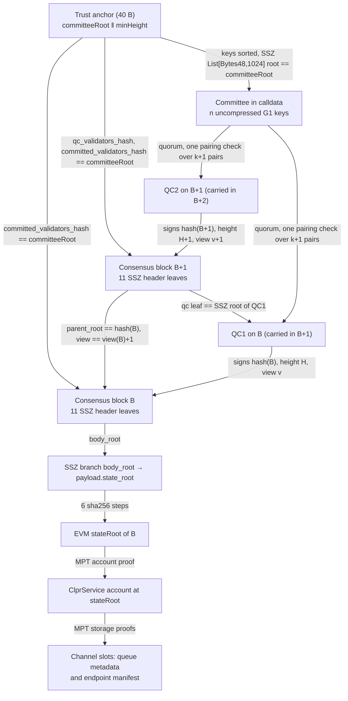
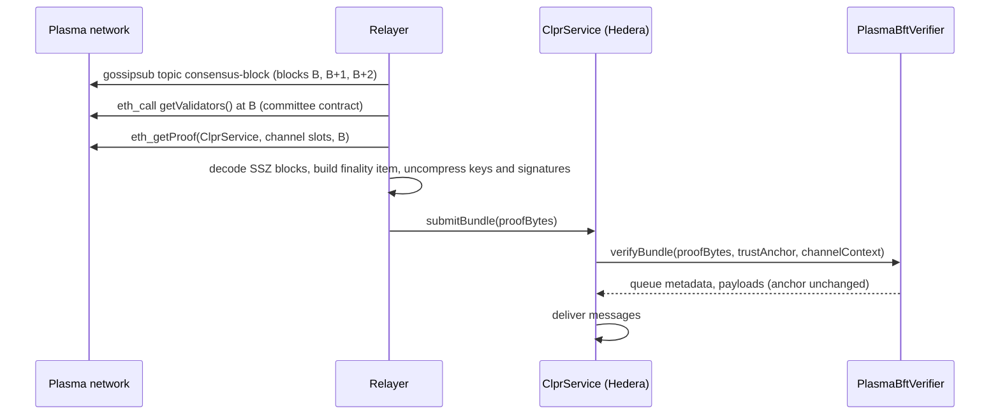

# Plasma verifier (PlasmaBFT)

`PlasmaBftVerifier` is a **Plasma → Hiero** verifier. Plasma (chain id 9745) is a stablecoin L1
with a reth execution layer and **PlasmaBFT**, a Rust implementation of Fast HotStuff. PlasmaBFT
finalizes a block with a two-chain commit: block B is final once B has a quorum certificate (QC)
and its direct child B+1 also has a QC. The verifier checks both QCs (BLS12-381 aggregate
signatures from a quorum of a pinned committee), opens the EVM `stateRoot` of B from B's SSZ
consensus block, and proves the ClprService queue values with Merkle-Patricia proofs against it.

PlasmaBFT's consensus client (`plasma-consensus`) is closed source and its wire formats are not
documented. The block, QC and vote formats here were derived from the public `plasma-consensus`
1.1.0 release and checked against live mainnet gossip: every captured block re-hashes to the hash
its gossip envelope carries, and every QC verifies with the formula below. Plasma's public docs
confirm the parts that are documented (Fast HotStuff, two-chain commit, `n ≥ 3f + 1`, quorum
`2f + 1`, BLS committee keys).

## 2. At a glance

| | |
|---|---|
| Chains | Plasma mainnet, chain id 9745 (`eip155:9745`) |
| Direction | Plasma → Hiero |
| Finality source | Two consecutive PlasmaBFT QCs (on B and on B+1, views v and v+1), BLS12-381 min-pk aggregate |
| Trust (one line) | Honest quorum (`n − ⌊(n−1)/3⌋`) of one committee pinned at deploy by its SSZ root; a committee change halts the channel |
| Typical bundle | **3,320,812 gas**, **9,316 B** calldata (10-member committee, 7 + 7 votes) |
| Rotation | Not supported: the committee is pinned (section 7) |
| Contract size | 18,584 B runtime (EIP-170 margin 5,992 B) |
| Status | Live-verified on Plasma mainnet, height 33,898,400 (2026-10-01) |

## 3. How it works



1. Decode the anchor `(committeeRoot, minHeight)` (`PlasmaBftVerifier.sol:verifyBundle`).
2. Committee: the relayer sends uncompressed G1 keys (EIP-2537, 128 B each). The verifier
   compresses each key, requires strictly ascending compressed bytes (PlasmaBFT indexes voters in
   the pubkey-sorted committee), and hashes the list as SSZ `List[Bytes48, 1024]`. The root must
   equal the anchor (`_committee`).
3. Headers B and B+1 are given as their 11 SSZ header leaves. Block hash =
   `sha256(merkleize(leaves) ‖ le256(1))` (ConsensusBlock V1) (`_leaves`, `_blockHash`). Leaves
   used: 0 `view`, 2 `parent_root`, 6 `qc`, 8 `body_root`, 9 `qc_validators_hash`,
   10 `committed_validators_hash`. B and B+1 must both name the anchor committee (`_verifyFinality`).
4. `body_root = sha256(graffiti ‖ payload_root)`. The execution payload has 18 fields (32-leaf
   tree) and `state_root` is field 2; a 6-node branch opens it (`_openStateRoot`).
5. B+1's `parent_root` is `hash(B)` and its view is `view(B) + 1` (`_verifyFinality`).
6. QC1 is the QC on B. Its SSZ root `sha256(merkleize([view, proposer, block_hash, height,
   votes, agg_sig]) ‖ le256(1))` must equal B+1's `qc` leaf (`_qcRoot`). QC2 (from B+2) has height
   H+1 and certifies `hash(B+1)` at view v+1.
7. Each QC: voter indices strictly ascending and below n, at least `n − ⌊(n−1)/3⌋` voters, and one
   EIP-2537 pairing check `Π e(pk_i, H(m_i)) · e(−G1, sig) == 1` with
   `m_i = pubkey_i (48) ‖ block_hash (32) ‖ le64(height) ‖ le64(voter_index) ‖ le64(view)`
   (104 B), hashed to G2 with DST `BLS_SIG_BLS12381G2_XMD:SHA-256_SSWU_RO_POP_`
   (`_verifyQc`, `ClprBeaconBls.hashToG2Message`).
8. The QC's 96-byte compressed signature (in the QC root) and the 256-byte EIP-2537 point (in the
   pairing) must have the same x coordinate, the compression flag set and the infinity flag clear
   (`_checkSigEncoding`).
9. ClprService: account proof, channel slots and the optional endpoint manifest against the
   `stateRoot` of B (`ClprEvmBundleVerifier.sol:_verifyServiceStorageRoot`, `_verifyChannelStorage`,
   `_verifyEndpointManifest`).

## 4. Bundle lifecycle



PlasmaBFT has no public consensus RPC. Consensus blocks with their QCs are only on libp2p gossip.
The relayer joins as a passive gossipsub listener on the public mainnet observer bootnodes
(`test/e2e/relay/plasma-tap`), or runs its own non-validator node.

## 5. Trust model

Trusted:
- An honest quorum of the pinned committee: at least `n − ⌊(n−1)/3⌋` members (7 of 10 today).
- The bootstrap committee root and height fixed at deployment, used by `verifyConfig`.
- The pinned committee for every later bundle. A new committee is never adopted (section 7).
- The Hedera-side upgrade keys of the deployed contracts, as for every CLPR verifier.
- That the derived PlasmaBFT formats match the deployed `plasma-consensus` version. If they did not,
  verification fails closed (no QC would verify); it cannot accept an unsigned block.

Not trusted: the relayer, gossip peers, RPC providers, and the committee keys, headers, QCs and
proofs in calldata. All of them are checked against hashes or signatures.

To forge a bundle an attacker must control a quorum of the pinned committee's BLS keys.

## 6. Proof format

Trust anchor (40 B): `committeeRoot (32) ‖ minHeight (u64 BE)`.

`verifyBundle` proof bytes: `RLP([finality, serviceAccountProof, storageProof, bundleContent
(, manifestStorageProof, manifestPreimage)])`.

| Field | Type | Meaning |
|---|---|---|
| `finality` | RLP list | `[committee, headerB, stateBranch, headerB1, qc1, qc2]` |
| `committee` | bytes, n × 128 | Uncompressed G1 keys (EIP-2537), ascending by compressed bytes, n ≤ 1024 |
| `headerB`, `headerB1` | bytes, 11 × 32 | SSZ header leaves of B and B+1 |
| `stateBranch` | bytes, 7 × 32 | `[state_root, field3, H(f0,f1), node(4..7), node(8..15), node(16..31), graffiti]` |
| `qc1`, `qc2` | RLP list | `[proposerIndex, height, [voterIndex…], sig96, sig256]` |
| `sig96` | bytes(96) | Aggregate signature as in the QC (compressed G2) |
| `sig256` | bytes(256) | The same point uncompressed (EIP-2537 G2) |
| `serviceAccountProof`, `storageProof` | MPT proofs | ClprService account and channel slots at the `stateRoot` of B |
| `bundleContent` | bytes | Protobuf with the message payloads |

`verifyConfig`: `RLP([finality, serviceAccountProof, slot25Proof, ledgerConfiguration])` from the
bootstrap checkpoint. It proves ClprService `_config.serviceAddress` at slot 25 and checks the
chain id. It returns the anchor `(BOOTSTRAP_COMMITTEE_ROOT, height of B)`.

Profile (constructor): `chainId`, `bootstrapCommitteeRoot`, `bootstrapHeight`. See
[docs/chains/plasma.md](../../../../docs/chains/plasma.md).

## 7. Validator-set rotation

Committee source. The committee is `getValidators()` (selector `0xb7ab4db5`) on the validator-set contract
`0x6c50b8ca8EeAa1c75dEe5b5EA79772AcAbc92F48` (ERC-1967 proxy), sorted by compressed key. Its SSZ
root equals both header fields `qc_validators_hash` and `committed_validators_hash` in every
captured block. Historical `eth_call` on `rpc.plasma.to` returns an empty list up to block
32,618,985 and the current 10-member list from block 32,618,986 (2026-09-16), with the same value
at 33,000,000 and 33,898,400.

Rotation is not supported yet. B and B+1 must declare `committed_validators_hash` and B+1 `qc_validators_hash`
equal to the anchor root, so a committee change stops the channel (`CommitteeChanged`) instead of
trusting an unproven handoff. `verifyBundle` always returns an empty new anchor.

- How the trusted set would move: the next committee is visible in the validator-set contract's
  storage (MPT-provable against a certified `stateRoot`) and in the header's
  `committed_validators_hash`. How PlasmaBFT hands over between the two hashes at an epoch boundary
  is not documented and was not observed (no change happened during capture), so it is not
  implemented.
- Cost and cadence: not measurable. No rotation occurred between 32,618,986 and 33,898,400 at the
  sampled heights.
- Recovery today: deploy a new verifier with the new committee root and move the channel to it.

## 8. Gas and calldata

Anvil `eth_estimateGas` of the full transaction, live mainnet fixture
`test/e2e/fixtures/plasma-live/mainnet.json` (captured 2026-10-01, height 33,898,400, view
33,901,966), `npm run test:e2e:plasma-live`. Hedera limits: 15,000,000 gas, 131,072 B calldata.

| Case | Committee | Votes (QC1 + QC2) | Gas | Calldata | Fits |
|---|---|---|---|---|---|
| `verifyBundle` | 10 | 7 + 7 | 3,320,812 | 9,316 B | yes |
| Rotation | — | — | not supported | — | — |

The Foundry call `verifyBundle` alone (no intrinsic transaction cost) measures 3.92M gas in
`test_gas_liveBundle`. The BLS work is 14 hash-to-G2 operations (one per vote) and two pairing
checks of 8 pairs each.

## 9. Limits and known gaps

- **No rotation** (section 7). A committee change halts the channel until a new verifier is
  deployed.
- **Closed-source consensus.** Formats were derived from the `plasma-consensus` 1.1.0 release and
  live data, not from source. A consensus release that changes them fails closed.
- **Data sources.** Consensus blocks come only from libp2p gossip; there is no archive of QCs. The
  relayer must listen continuously or run a node. `rpc.plasma.to` serves `eth_getProof` only at the
  head block ("distance to target block exceeds maximum proof window" at head − 5), so the relayer
  needs its own reth node with a proof window, or must take the proof at the head as the fixture
  builder does.
- **No ClprService on Plasma.** The fixture proves the channel slots of the validator-set proxy as a
  stand-in (absent slots, MPT exclusion proofs, zeroed metadata). `verifyConfig` runs end to end and
  stops at slot 25 with `ServiceAddressSlotMismatch`, as expected.
- **Fixture builder needs Go** (`go build` of the gossip listener) and outbound TCP to port 34070.
- **Testnet** (chain id 9746) is not covered by the fixture.
- **Hiero → Plasma** is not part of this verifier.

## 10. Upgrades and forks

- The verifier hashes blocks and QCs as version 1 (SSZ union selector 1), the format of every
  block captured on 2026-10-01. Other versions do not hash to the committed roots and are rejected.
- A change to the block or QC SSZ layout, the payload field order, the vote message or the quorum
  rule breaks verification: bundles fail closed and a new verifier is needed.
- Relation to the fork-aware verifier ADR (`ADR/2026-10-01-fork-aware-verifiers.md` in the spec
  fork, draft PR LFDT-CLPR/clpr-spec#1): this verifier does not implement fork profiles or the ADR's
  typed upgrade reverts yet. Layout changes (header leaves, payload branch) would need a fork
  profile; a semantic change (vote message, quorum rule) needs a new verifier and a
  `ClprChannelSuccession` to it. Until then an unhandled upgrade stalls the channel; it does not
  accept a wrong proof.

## 11. Running it

```bash
forge test --match-path 'test/verifiers/evm/plasma/*'       # 30 Foundry tests, real BLS pairing
forge test --match-contract PlasmaComplianceTest          # 28 compliance tests
forge build && npm run test:e2e:plasma-live                  # 8 anvil replay tests + gas table
npm run plasma-live:refresh                                  # re-record (needs go, ~2 min)
npx tsx test/e2e/relay/exportPlasmaForgeFixture.ts           # re-export the Foundry fixture
```

Coverage. Foundry (30): live bundle with two real QCs, older anchor height, config path; rejects a
QC signature from another QC, a swapped voter, fewer than quorum voters, a duplicate or
out-of-range voter, a compressed signature that is not the pairing point, the infinity flag, a QC1
that is not the one B+1 carries, a QC replayed as QC1, a wrong committee anchor, a committee with a
key missing, an unsorted committee, an empty committee, a tampered state branch, B+2 offered as
B's child, a tampered header B, a bad header length, a stale height, a bad anchor length, a bad
payload shape, a storage proof for another channel or address, a wrong chain id, an empty config
and an invalid profile. The anvil spec checks the fixture off-chain and repeats the main cases
through the production contract.

## 12. Files

| File | What |
|---|---|
| `src/verifiers/evm/plasma/PlasmaBftVerifier.sol` | The verifier |
| `src/libraries/proof/beacon/ClprBeaconBls.sol` | `hashToG2Message`: hash-to-G2 for a message of any length |
| `test/verifiers/evm/plasma/PlasmaBftVerifier.t.sol` | 30 Foundry tests on live data |
| `test/verifiers/evm/plasma/fixtures/plasma-mainnet.json` | Foundry export of the live fixture |
| `test/e2e/fixtures/plasma-live/mainnet.json` | Raw gossip bytes of B, B+1, B+2 and raw RPC JSON |
| `test/e2e/relay/plasma.ts` | SSZ decoding, off-chain QC check, relay encoding |
| `test/e2e/relay/plasma-tap/` | Passive libp2p gossipsub listener (Go) |
| `test/e2e/relay/buildPlasmaLiveFixture.ts` | Live capture with off-chain checks |
| `test/e2e/relay/exportPlasmaForgeFixture.ts` | Foundry fixture export |
| `test/verifiers/compliance/PlasmaComplianceTest.t.sol` | Shared `IClprVerifier` compliance suite (28 cases) on synthetic chain data with real BLS QCs |
| `test/verifiers/compliance/EvmCertifiedStateCompliance.sol` | Compliance-adapter body shared by the Arc and Plasma adapters |
| `test/verifiers/evm/plasma/PlasmaBftVerifierHarness.sol` | Exposes the SSZ helpers to build synthetic blocks and QCs |
| `test/e2e/tests/verifiers/plasma-live.spec.ts` | Anvil replay spec with gas and calldata |

## 13. References

- Plasma docs, PlasmaBFT: https://docs.plasma.to/architecture/consensus/plasmabft
- Plasma docs, consensus overview: https://www.plasma.org/docs/plasma-chain/architecture/consensus
- Non-validator node setup (bootnodes, committee keys): https://www.plasma.org/docs/node-operators/setup-and-configuration/non-validator-node-setup
- PlasmaLaboratories/node-templates (`config/mainnet/non-validator.toml`): https://github.com/PlasmaLaboratories/node-templates
- Plasma mainnet RPC: `https://rpc.plasma.to`
- BLS signatures (min-pk, proof-of-possession DST): draft-irtf-cfrg-bls-signature; hash to curve: RFC 9380
- EIP-2537 (BLS12-381 precompiles)
