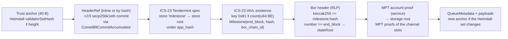

# Polygon PoS verifier (Heimdall v2 milestone → Bor MPT)

> **Source**: [PolygonPosVerifier.sol](./PolygonPosVerifier.sol) ·
> header refs + store proof [CometBftStoreProofBase.sol](../cometbft/CometBftStoreProofBase.sol) ·
> [CometBftCommitAccumulator.sol](../cometbft/CometBftCommitAccumulator.sol) (light client, SECP256K1_ETH) ·
> MPT [ClprEvmBundleVerifier](../common/ClprEvmBundleVerifier.sol)
> **Interface**: [IClprVerifier.sol](../../../interfaces/IClprVerifier.sol)

A "Polygon PoS → Hiero" verifier. Polygon PoS has two layers: **Bor**, the EVM chain where a
ClprService would live, and **Heimdall v2**, a CometBFT chain whose validators (the PoS stakers)
finalize Bor. Bor blocks become final through Heimdall **milestones**: Heimdall validators vote Bor
block hashes in CometBFT vote extensions, and a hash backed by more than 2/3 of their power is
written to Heimdall state. This verifier checks that whole path on Hedera's EVM.

Everything below was checked against live `heimdallv2-137` (CometBFT 0.38.22, Polygon fork) and
Bor mainnet (chain 137) on 2026-10-01, and against the sources in §7.

## 1. Results on live mainnet

`npm run test:e2e:polygon-live` replays `test/e2e/fixtures/polygon-live/polygon.json`. Gas is
`eth_estimateGas` of the whole transaction. It holds three live captures: a
typical Heimdall header `54,594,513` (milestone 14,893,911 → Bor block 94,750,873), a real
validator-set rotation `R = 54,595,178` (signed by the old set; milestone 14,894,242 → Bor
94,751,421) and `B = R + 2` signed by the new set (milestone 14,894,243 → Bor 94,751,423). 104
Heimdall validators; 10 signatures clear 2/3 by power in each.

| Transaction | Sigs | Gas | Calldata | ≤ 15M / 128 KB |
|---|---|---|---|---|
| **Typical bundle** (commit + milestone + Bor header + account + 5 slot proofs, one tx) | 10 | **3,450,850** | 29.6 KB | yes |
| **Rotation bundle at R** (returns the new anchor) | 10 | **3,445,272** | 29.5 KB | yes |
| Bundle at B from the anchor R returned | 10 | 3,450,814 | 29.6 KB | yes |
| Catch-up: hop R inline + bundle at B | 20 | 5,001,483 | 38.7 KB | yes |
| `verifyContractSlots`: WPOL slots 0-2 (name, symbol, decimals) | 10 | 3,089,435 | 24.3 KB | yes |

Roughly 1.5M of a bundle is the Heimdall commit (measured alone in the CometBFT README, §6.1),
the rest is calldata (~30 KB) and the ICS-23, RLP and MPT walks. The earlier estimate of 2.5-3M
was low by the MPT calldata. Rotation costs the same as any bundle.

The "service" is WPOL (`0x0d500b1d…1270`), a real Bor contract: no ClprService is deployed on
Polygon yet, so the channel's five slots are real MPT **exclusion** proofs (zero metadata). The
same path proves WPOL's non-zero slots 0-2 (name, symbol, decimals = 18) through
`verifyContractSlots`.

Contract size: `PolygonPosVerifier` 20,786 B (EIP-170 limit 24,576 B).

## 2. Verification chain



`verifyBundle(proof, anchor, channelContext)`:

1. Anchor = Heimdall `validatorSetHash(32) ‖ height(8, BE)` (the CometBFT family format).
2. Hops, then the Heimdall header, as `HeaderRef`s (`CometBftStoreProofBase`): inline
   `{validator_set, signed_header}` checked by `CometBftCommitAccumulator.checkHeader` (deployed for
   `heimdallv2-137`, `SECP256K1_ETH`), or `{header_hash}` of a header accumulated earlier. The set
   is sorted by power, so 10 of 104 signatures clear 2/3 today (~32k gas each).
3. Multistore proof of store `milestone` against `app_hash` (ABCI proof at `H-1`, header `H`).
4. IAVL **existence** proof of a key `0x81 ‖ count` (exactly 9 bytes). Its value is the protobuf
   `Milestone`; the verifier requires `end_block > 0`, a 32-byte `hash` and
   `bor_chain_id == "137"` (profile). Any stored milestone is final; an older one only yields older
   Bor state, which ClprService's progress checks reject.
5. The Bor header: `keccak256(rlp) == milestone.hash`, at least 15 RLP fields, field 8 (number) ==
   `end_block`; field 3 is the `stateRoot`.
6. MPT account proof of `ctx.remoteServiceAddress` → storage root; MPT storage proofs of the 5
   channel slots (+ the last message's running hash when messages are carried), all derived from
   the channel id (`ClprEvmBundleVerifier`, the same code as Ethereum/QBFT). Optional manifest:
   slot 18 commitment + preimage.
7. New anchor `(next_validators_hash, height + 1)` when the Heimdall set changes.

`verifyConfig` runs the same chain from the deploy-time checkpoint and proves ClprService slot 25
(`_config.serviceAddress`, short-bytes layout `addr ‖ 0…0 ‖ 0x28`) by MPT, as `CometBftVerifier`
does by IAVL. `verifyContractSlots(proof, anchor, account, slots)` returns any Bor contract's slots
at the milestone block.

## 3. Heimdall and Bor layout (verified)

| What | Value | Source |
|---|---|---|
| Milestone store | IAVL store `milestone` | heimdall-v2 `x/milestone/types/keys.go` `StoreKey = ModuleName` |
| Milestones | `collections.Map[uint64, Milestone]`, prefix `0x81`, key `Uint64Key` = 8 B big-endian | `keys.go` `MilestoneMapPrefixKey`, `keeper/keeper.go` `NewMap` |
| Count | `collections.Item[uint64]`, prefix `0x83`, 8 B BE (the relay reads it to find the latest) | `CountPrefixKey`, `Uint64Value` |
| `Milestone` | `{1 proposer, 2 start_block, 3 end_block, 4 hash, 5 bor_chain_id, 6 milestone_id, 7 timestamp, 8 total_difficulty}` | `proto/heimdallv2/milestone/milestone.proto` |
| When written | only in `PreBlocker` when vote extensions carry a >2/3-power majority for a proposition; `Hash` = hash of the last block, `EndBlock` = its number | `app/abci.go` (`GetMajorityMilestoneProposition`, `AddMilestone`) |
| Bor header | go-ethereum `Header`: 15 legacy fields + `rlp:"optional"` BaseFee, WithdrawalsHash, … (live Bor headers carry BaseFee only) | `0xPolygon/bor` `core/types/block.go` |
| Consensus keys | secp256k1eth (65 B, oneof field 3), r‖s‖v over keccak256 | CometBFT README §3.3 |

Live check: the builder requires `eth_getBlockByNumber(end_block).hash == milestone.hash` and that
the re-encoded header RLP hashes to it, for every capture.

## 4. Wire format (protobuf, RLP inside)

```
PolygonPosProof { 1 bundle_content; 2 header: HeaderRef; repeated 3 hop: HeaderRef;
                  4 multistore_proof (ICS-23, store "milestone"); 5 milestone: StorageProofEntry;
                  6 bor_header (RLP); 7 account_proof (RLP list of nodes);
                  8 storage_proof (RLP list of [slot(32), [nodes]]);
                  9 manifest_storage_proof (same, one entry); 10 manifest_preimage;
                  11 ledger_configuration }
HeaderRef, StorageProofEntry: as in ../provenance/README.md §5.
```

`test/e2e/relay/polygon.ts` builds it from public RPC JSON (`/commit`, `/validators`,
`abci_query /store/milestone/key?prove=true` at `H-1`, `eth_getBlockByNumber`, `eth_getProof`).

## 5. Trust assumptions and limits

- **Honest Heimdall supermajority.** Bor block producers are not trusted at all: a Bor block counts
  only once Heimdall validators with >2/3 of the stake voted its hash. Bor's own seal is ignored.
- **Unbonding.** Sequential light client with no trusting period (CometBFT README §5). Heimdall
  stake lives in Polygon's StakeManager on Ethereum; relays must keep each channel's anchor within
  the stake-withdrawal delay by bundling at every Heimdall set change.
- **Rotations are frequent.** The set hash includes voting power, so any stake change is a
  rotation: 2 in the last ~2,000 Heimdall blocks scanned (~40 min). Each costs one ordinary
  bundle at the rotation header (§1); a missed one is one inline hop (~1.5M gas more).
- **Bor state availability.** Public Bor nodes serve `eth_getProof` only for recent blocks (~128;
  1,000 blocks back already fails on publicnode, drpc and 1rpc), and a milestone is final within
  seconds of its Bor block. The relay must read the milestone and fetch the MPT proofs at once, or
  run a Bor archive node. This is why the fixture builder watches for a live rotation instead of
  replaying an old one.
- **Calldata.** ~30 KB per bundle, mostly MPT nodes (9 account nodes, 6-8 per storage slot) and the
  104-leaf validator set (~9.3 KB). The receiving ClprService's `maxSyncBytes` must allow it.
  Well under Hedera's 128 KB.
- **No verifier state** except the shared accumulator (by-hash headers). Replay and staleness as in
  the CometBFT family.

## 6. Tests

- `test/verifiers/evm/polygon/PolygonPosVerifier.t.sol` (29 tests) on a synthetic Heimdall + Bor
  chain (`test/helpers/PolygonSyntheticChain.sol`: real secp256k1eth signatures, real IAVL tree,
  real RLP Bor header, real MPT tries): bundle decode, rotation, manifest, accumulated header by
  hash, inline hop, `verifyConfig`, `verifyContractSlots`; negatives for bad signature, below
  threshold, wrong set, stale header, wrong store key, milestone key outside the map, absent
  milestone, tampered milestone, other Bor chain id, Bor header not the milestone's, Bor number ≠
  end_block, another service's account, another channel's slots, tampered storage root,
  unfinalized header, manifest pair/commitment, missing Bor proof, bad anchor, config slot
  mismatch, config not from bootstrap, bad profile.
- `test/verifiers/compliance/PolygonPosComplianceTest.t.sol`: the shared `IClprVerifier`
  compliance suite (21 cases).
- `test/e2e/tests/verifiers/polygon-live.spec.ts`: the live fixture (table in §1), with negatives
  for a flipped signature, below threshold, wrong set, stale anchor, a foreign Bor header, a
  tampered milestone proof, another service and another channel.

```bash
forge test --match-path 'test/verifiers/evm/polygon/*'
forge build && npm run test:e2e:polygon-live       # CLPR_ANVIL_PORT_A, default 8602
npm run polygon-live:refresh                         # waits ≤ 90 min for a live rotation
POLYGON_ROTATION_WAIT_MIN=0 npm run polygon-live:refresh   # typical bundle only
```

## 7. Sources checked

- 0xPolygon/heimdall-v2 `ae3de38` (2026-09-17): `x/milestone/types/keys.go`,
  `x/milestone/keeper/keeper.go` (`AddMilestone`), `proto/heimdallv2/milestone/milestone.proto`,
  `app/abci.go` (`PreBlocker`).
- 0xPolygon/bor (develop, release v2.10.2): `core/types/block.go` `Header`.
- 0xPolygon/cometbft v0.3.8-polygon (secp256k1eth), as in the CometBFT README §8.
- Live: `https://polygon-heimdall-rpc.publicnode.com` (status, commit, validators, blockchain,
  abci_query), `https://heimdall-api.polygon.technology` (milestones), Bor
  `https://polygon-bor-rpc.publicnode.com` / `polygon.drpc.org` / `1rpc.io/matic`
  (`eth_getBlockByNumber`, `eth_getProof`).
