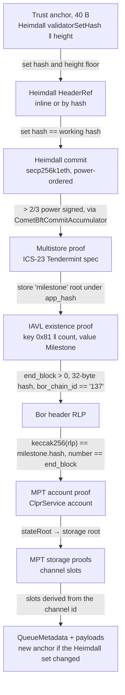
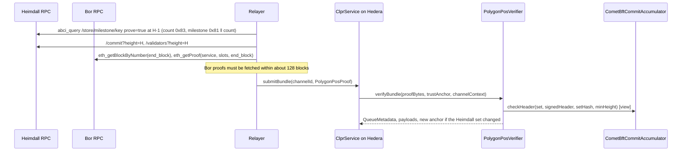

# Polygon PoS verifier (Heimdall v2 milestone → Bor MPT)

A "Polygon PoS → Hiero" verifier. Polygon PoS has two layers: **Bor**, the EVM chain where a
ClprService would live, and **Heimdall v2**, a CometBFT chain whose validators (the PoS stakers)
finalize Bor. Bor blocks become final through Heimdall **milestones**: Heimdall validators vote Bor
block hashes in CometBFT vote extensions, and a hash backed by more than 2/3 of their power is
written to Heimdall state. `PolygonPosVerifier` checks that whole path on Hedera's EVM: a Heimdall
commit, the milestone in Heimdall's IAVL store, the Bor header it names, and the ClprService's
storage in Bor's Merkle-Patricia trie.

## 1. At a glance

| | |
|---|---|
| Direction | `Polygon PoS → Hiero` |
| Chain | Bor mainnet `eip155:137`, finalized by Heimdall v2 `cosmos:heimdallv2-137` (CometBFT 0.38.22, Polygon fork) |
| Finality source | Heimdall milestone: > 2/3 of Heimdall voting power voted the Bor block hash; the Heimdall header that stores it has a > 2/3 secp256k1eth commit |
| Trust (one line) | Honest 2/3 of Heimdall stake for every set the anchor reaches, a bootstrap checkpoint, anchor kept inside the stake-withdrawal delay; Bor producers are not trusted |
| Typical bundle | 3,450,850 gas, 29.6 KB (live) |
| Rotation | 3,445,272 gas, 29.5 KB: an ordinary bundle at the rotation header (live). Missed rotation: 5,001,483 gas, 38.7 KB with one inline hop |
| Contract sizes | `PolygonPosVerifier` 20,786 B; `CometBftCommitAccumulator` 13,104 B |
| Status | Live-verified on Polygon mainnet (Heimdall + Bor) data recorded 2026-10-01, including a real Heimdall validator-set rotation. No ClprService is deployed on Polygon yet |

## 2. How it works



`verifyBundle(proofBytes, trustAnchor, channelContext)`:

1. Decode the Heimdall anchor `validatorSetHash(32) ‖ height(8, big-endian)`
   (`CometBftStoreProofBase.sol:_decodeAnchor`).
2. Resolve hops, then the Heimdall header, as `HeaderRef`s: inline `{validator_set,
   signed_header}` checked by `CometBftCommitAccumulator.sol:checkHeader` (deployed for
   `heimdallv2-137`, `SECP256K1_ETH`), or `{header_hash}` of a header accumulated earlier
   (`CometBftStoreProofBase.sol:_resolveHeader`). The set is sorted by power, so 10 of 104
   signatures clear 2/3 today.
3. Verify the multistore proof of store `milestone` against `app_hash` (ABCI proof at `H-1`,
   header `H`) (`CometBftStoreProofBase.sol:_verifiedStoreRoot`).
4. Verify an IAVL **existence** proof of a 9-byte key `0x81 ‖ count`. Its value is the protobuf
   `Milestone`; the verifier requires `end_block > 0`, a 32-byte `hash` and `bor_chain_id == "137"`
   (`PolygonPosVerifier.sol:_proveMilestone`, `_decodeMilestone`). Any stored milestone is final;
   an older one only yields older Bor state, which ClprService's progress checks reject.
5. Check the Bor header: `keccak256(rlp) == milestone.hash`, at least 15 RLP fields, field 8
   (number) == `end_block`; field 3 is the `stateRoot` (`PolygonPosVerifier.sol:_borStateRoot`,
   called from `_verifiedBorBlock`).
6. MPT account proof of `ctx.remoteServiceAddress` → storage root
   (`ClprEvmBundleVerifier.sol:_verifyServiceStorageRoot`); MPT storage proofs of the five channel
   slots plus the last message's running hash when messages are carried
   (`ClprEvmBundleVerifier.sol:_verifyChannelStorage`), the same code as the Ethereum and QBFT
   verifiers. Optional manifest: slot 18 commitment and preimage (`_verifyEndpointManifest`).
7. Return the new anchor `(next_validators_hash, height + 1)` when the Heimdall set changes
   (`CometBftStoreProofBase.sol:_nextAnchor`).

`verifyConfig` runs the same chain from the deploy-time checkpoint and proves ClprService slot 25
(`_config.serviceAddress`, short-bytes layout `addr ‖ 0…0 ‖ 0x28`) by MPT.
`verifyContractSlots(proof, anchor, account, slots)` returns any Bor contract's slots at the
milestone block.

## 3. Bundle lifecycle



## 4. Trust model

Trusted:
- **Honest Heimdall supermajority.** Heimdall stake lives in Polygon's StakeManager on Ethereum.
  A Bor block counts only once Heimdall validators with more than 2/3 of the stake voted its hash.
- **Bootstrap checkpoint** for `verifyConfig`, chosen by the deployer.
- **Withdrawal delay.** A sequential light client with no trusting period. Relays must keep each
  channel's anchor within the stake-withdrawal delay by bundling at every Heimdall set change.

Not trusted:
- **Bor block producers.** Bor's own seal is ignored.
- The relayer, and callers of the accumulator (as in the [Provenance README §4](../provenance/README.md)).

To forge a bundle an attacker must control more than 2/3 of the voting power of a Heimdall set the
anchor reaches.

Replay and staleness are as in the CometBFT family: headers below the anchor height are rejected,
older milestones yield older Bor state that ClprService's progress checks reject.

## 5. Proof format

Trust anchor: Heimdall `validatorSetHash(32) ‖ height(8, big-endian)`, 40 bytes.

`proofBytes` is a protobuf `PolygonPosProof`:

| Field | Type | Meaning |
|---|---|---|
| 1 `bundle_content` | `ClprBundleContent` | Message payloads |
| 2 `header` | `HeaderRef` | Heimdall header, inline or by hash |
| 3 `hop` (repeated) | `HeaderRef` | Catch-up across Heimdall rotations |
| 4 `multistore_proof` | ICS-23 `CommitmentProof` | Store `milestone` → store root |
| 5 `milestone` | `StorageProofEntry` | Key `0x81 ‖ count`, value `Milestone`, IAVL proof |
| 6 `bor_header` | bytes (RLP) | The Bor block header |
| 7 `account_proof` | RLP list of nodes | MPT proof of the ClprService account |
| 8 `storage_proof` | RLP list of `[slot(32), [nodes]]` | MPT proofs of the channel slots |
| 9 `manifest_storage_proof` | same, one entry | Optional manifest slot |
| 10 `manifest_preimage` | bytes | Optional manifest protobuf |
| 11 `ledger_configuration` | bytes | `verifyConfig` only |

Heimdall and Bor layout (verified against source and live):

| What | Value | Source |
|---|---|---|
| Milestone store | IAVL store `milestone` | heimdall-v2 `x/milestone/types/keys.go` |
| Milestones | `collections.Map[uint64, Milestone]`, prefix `0x81`, 8 B big-endian key | `keys.go`, `keeper/keeper.go` |
| Count | `collections.Item[uint64]`, prefix `0x83` (the relay reads it to find the latest) | `keys.go` |
| `Milestone` | `{1 proposer, 2 start_block, 3 end_block, 4 hash, 5 bor_chain_id, 6 milestone_id, 7 timestamp, 8 total_difficulty}` | `proto/heimdallv2/milestone/milestone.proto` |
| When written | in `PreBlocker`, when vote extensions carry a > 2/3-power majority for a proposition | `app/abci.go` |
| Bor header | go-ethereum `Header`: 15 legacy fields plus optional fields (live Bor headers carry BaseFee only) | `0xPolygon/bor` `core/types/block.go` |
| Consensus keys | secp256k1eth (65 B, oneof field 3), `r‖s‖v` over keccak256 | [CometBFT README §5](../cometbft/README.md) |

Deployment profile:

| Contract | Parameter | Value |
|---|---|---|
| `CometBftCommitAccumulator` | `chainId`, `keyScheme`, `ed25519Verifier` | `heimdallv2-137`, `SECP256K1_ETH`, none |
| `PolygonPosVerifier.Profile` | `accumulator` | the accumulator above |
| | `storeKey` | `milestone` |
| | `borChainId` | `137` |
| | `bootstrapValidatorsHash`, `bootstrapHeight` | a recent Heimdall set hash and height, chosen at deployment |

## 6. Validator-set rotation

The Heimdall set hash includes voting power, so any stake change is a rotation: 2 in the last
~2,000 Heimdall blocks scanned (~40 min). Each costs one ordinary bundle at the rotation header:
3,445,272 gas live. A missed rotation is one inline hop, 5,001,483 gas for hop plus bundle (about
1.5M more), which fits 15M. Heimdall's commit needs only 10 secp256k1eth signatures (~32k gas each),
so the accumulator split is not needed for Polygon.

## 7. Gas and calldata

Live data recorded 2026-10-01 (`test/e2e/fixtures/polygon-live/polygon.json`): a typical Heimdall
header `54,594,513` (milestone 14,893,911 → Bor block 94,750,873), a real rotation
`R = 54,595,178` (milestone 14,894,242 → Bor 94,751,421) and `B = R + 2` (milestone 14,894,243 →
Bor 94,751,423). 104 Heimdall validators, 10 signatures each. Gas is anvil `eth_estimateGas` of the
whole transaction, replayed on this branch on 2026-10-01. Hedera limits: 15,000,000 gas, 131,072 B.

| Transaction | Sigs | Gas | Calldata | ≤ 15M / 128 KB |
|---|---|---|---|---|
| **Typical bundle** (commit + milestone + Bor header + account + 5 slot proofs) | 10 | **3,450,850** | 29.6 KB | yes |
| **Rotation bundle at R** (returns the new anchor) | 10 | **3,445,272** | 29.5 KB | yes |
| Bundle at B from the anchor R returned | 10 | 3,450,814 | 29.6 KB | yes |
| Catch-up: hop R inline + bundle at B | 20 | 5,001,483 | 38.7 KB | yes |
| `verifyContractSlots`: WPOL slots 0–2 (name, symbol, decimals) | 10 | 3,089,435 | 24.3 KB | yes |

About 1.5M of a bundle is the Heimdall commit (1,540,363 measured alone in the CometBFT live spec);
the rest is calldata (~30 KB) and the ICS-23, RLP and MPT walks. The "service" is WPOL
(`0x0d500b1d…1270`), a real Bor contract; the channel's five slots are real MPT exclusion proofs
(zero metadata), and the same path proves WPOL's non-zero slots 0–2.

## 8. Limits and known gaps

- **Bor state availability.** Public Bor nodes serve `eth_getProof` only for recent blocks (about
  128; 1,000 blocks back already fails on publicnode, drpc and 1rpc), and a milestone is final within
  seconds of its Bor block. The relay must read the milestone and fetch the MPT proofs at once, or
  run a Bor archive node. The fixture builder therefore waits for a live rotation instead of
  replaying an old one.
- **Calldata.** About 30 KB per bundle, mostly MPT nodes (9 account nodes, 6–8 per storage slot)
  and the 104-leaf validator set (~9.3 KB). The receiving ClprService's `maxSyncBytes` must allow
  it.
- **No ClprService on Polygon yet**; the bundle proves exclusion of the channel slots on WPOL.
- **Hiero → Polygon** is the EVM-side ClprService direction and is not covered here.

## 9. Upgrades and forks

Two upgrade paths matter, both under the fork-aware verifier ADR
(`ADR/2026-10-01-fork-aware-verifiers.md` in the spec fork, draft PR LFDT-CLPR/clpr-spec#1):

- **Heimdall** (CometBFT family row of Appendix B.1). Class A: header version and validator sets;
  the verifier hashes the version as signed and does not pin it. Class B: a change to the
  `milestone` store name, its `0x81` prefix or the `Milestone` protobuf breaks
  `_proveMilestone`/`_decodeMilestone`. Class C: a consensus key or header-hash change fails the
  commit check.
- **Bor** hard forks. A new optional header field keeps working while the field order is unchanged
  (the verifier reads fields 3 and 8 and requires at least 15). A state-trie change (Verkle or
  binary) is Class C. A Bor upgrade that moved milestone finality elsewhere would also be Class C.

`fork_id` and profile arming from the ADR are not implemented in this family yet.

## 10. Running it

```bash
forge test --match-path 'test/verifiers/evm/polygon/*'                              # 29 tests
forge test --match-path 'test/verifiers/compliance/PolygonPosComplianceTest.t.sol'  # 21 tests, shared suite
forge build && npm run test:e2e:polygon-live        # 9 tests on the live fixture (CLPR_ANVIL_PORT_A, default 8602)
npm run polygon-live:refresh                          # waits up to 90 min for a live rotation
POLYGON_ROTATION_WAIT_MIN=0 npm run polygon-live:refresh   # typical bundle only
```

## 11. Files

| File | What |
|---|---|
| `src/verifiers/evm/polygon/PolygonPosVerifier.sol` | The verifier: milestone, Bor header, MPT |
| `src/verifiers/evm/cometbft/CometBftStoreProofBase.sol` | Header references and IAVL entry proofs (shared with `CosmWasmVerifier`) |
| `src/verifiers/evm/cometbft/CometBftCommitAccumulator.sol` | Heimdall commit check (`SECP256K1_ETH`) |
| `src/verifiers/evm/common/ClprEvmBundleVerifier.sol` | MPT account and channel-slot proofs |
| `test/verifiers/evm/polygon/PolygonPosVerifier.t.sol` | 29 tests on a synthetic Heimdall + Bor chain |
| `test/helpers/PolygonSyntheticChain.sol` | Real secp256k1eth signatures, IAVL tree, RLP header, MPT tries |
| `test/verifiers/compliance/PolygonPosComplianceTest.t.sol` | Shared `IClprVerifier` compliance suite, 21 cases |
| `test/e2e/fixtures/polygon-live/polygon.json` | Live capture: typical, rotation and post-rotation bundles |
| `test/e2e/relay/polygon.ts` | Builds `PolygonPosProof` from RPC JSON |
| `test/e2e/relay/buildPolygonLiveFixture.ts` | Fixture refresh script |
| `test/e2e/tests/verifiers/polygon-live.spec.ts` | Live replay with negatives |
| `docs/chains/polygon-pos.md` | Chain page |

Negative cases in the Foundry suite: bad signature, below threshold, wrong set, stale header, wrong
store key, milestone key outside the map, absent milestone, tampered milestone, other Bor chain id,
Bor header not the milestone's, Bor number ≠ `end_block`, another service's account, another
channel's slots, tampered storage root, unfinalized header, manifest pair and commitment, missing
Bor proof, bad anchor, config slot mismatch, config not from bootstrap, bad profile. The live spec
adds a flipped signature, below threshold, wrong set, stale anchor, a foreign Bor header, a tampered
milestone proof, another service and another channel.

## 12. References

- 0xPolygon/heimdall-v2 `ae3de38` (2026-09-17): `x/milestone/types/keys.go`,
  `x/milestone/keeper/keeper.go` (`AddMilestone`), `proto/heimdallv2/milestone/milestone.proto`,
  `app/abci.go` (`PreBlocker`).
- 0xPolygon/bor (develop, release v2.10.2): `core/types/block.go` `Header`.
- 0xPolygon/cometbft v0.3.8-polygon (secp256k1eth), as in the [CometBFT README §12](../cometbft/README.md).
- Fork-aware verifiers ADR, `ADR/2026-10-01-fork-aware-verifiers.md` (spec fork, draft PR
  LFDT-CLPR/clpr-spec#1).
- Live: `https://polygon-heimdall-rpc.publicnode.com` (status, commit, validators, blockchain,
  abci_query), `https://heimdall-api.polygon.technology` (milestones), Bor
  `https://polygon-bor-rpc.publicnode.com`, `polygon.drpc.org`, `1rpc.io/matic`
  (`eth_getBlockByNumber`, `eth_getProof`).
