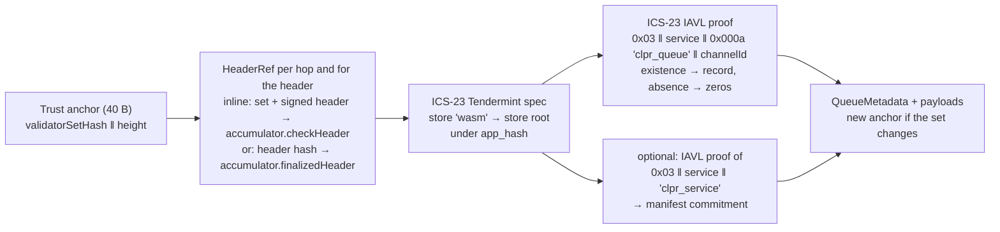

# Provenance verifier (CosmWasm on CometBFT)

> **Source**: [CosmWasmVerifier.sol](./CosmWasmVerifier.sol) ·
> [CometBftCommitAccumulator.sol](../cometbft/CometBftCommitAccumulator.sol) ·
> light client [CometBftLightClient.sol](../cometbft/CometBftLightClient.sol) (shared with
> [CometBftVerifier](../cometbft/README.md)) · Ed25519: [Ed25519Verifier](../sei/Ed25519Verifier.sol)
> **Interface**: [IClprVerifier.sol](../../../interfaces/IClprVerifier.sol)

A "Provenance → Hiero" verifier. It runs on Hedera's EVM and checks (1) CometBFT finality of a
Provenance header (more than 2/3 of the validator set's power signed it) and (2) the peer CLPR
Service's storage in that header's `app_hash`. The CLPR Service on Provenance is a **CosmWasm
contract**, so its storage lives in wasmd's `wasm` IAVL store, not in an EVM store. Nothing here is
Provenance-specific beyond the deploy-time profile: any CometBFT + wasmd chain (THORChain App
Layer, Injective, Neutron, …) uses the same two contracts.

Everything below was checked against live `pio-mainnet-1` (provenanced v1.30.0, CometBFT 0.38.22)
on 2026-10-01 and against the sources listed in §9.

## 1. Results on live mainnet

`npm run test:e2e:provenance-live` replays `test/e2e/fixtures/provenance-live/provenance.json`: a
real validator-set rotation `R = 33,796,997` (signed by the old set) and `B = R + 2` (signed by the
new set), 100 validators, 18 Ed25519 signatures to clear 2/3, plus ABCI proofs from a real
contract: Figure's "Crypto-Backed Loan" pool `pb1msvy4f0…nm5ged` (code 52, cw2
`democratized_prime_pool_v2` 1.0.0). Gas is `eth_estimateGas` of the whole transaction.

| Transaction | Sigs | Gas | Calldata | ≤ 15M |
|---|---|---|---|---|
| **Bundle at R in one tx** (commit + `wasm` multistore + IAVL non-existence of the queue record) → returns the rotation anchor | 18 | **13,120,660** | 8.9 KB | yes |
| Bundle at B in one tx, from the anchor R returned | 18 | 13,113,439 | 8.9 KB | yes |
| `verifyContractEntry`: cw2 `contract_info` Item (existence) | 18 | 12,877,123 | 8.0 KB | yes |
| `verifyContractEntry`: cw-storage-plus Map `sb1[pb1whzz…]` (existence) | 18 | 12,902,008 | 8.2 KB | yes |
| Catch-up across the rotation inline (hop R + header B) | 36 | 25,729,327 | 15.3 KB | **no** |
| Split: `accumulate` R, signatures 1–9 | 9 | 7,005,302 | 5.8 KB | yes |
| Split: `accumulate` R, signatures 10–18 | 9 | 6,864,507 | 5.8 KB | yes |
| Split: `accumulate` B | 18 | 12,726,801 | 6.6 KB | yes |
| Split: bundle at R by header hash (state proof only) | 0 | **520,565** | 2.5 KB | yes |
| Split: catch-up bundle at B, hop R, both by hash | 0 | **536,819** | 2.5 KB | yes |
| THORChain commit (cometbft-live fixture), `accumulate` × 4 | 67 | 11.9M + 11.8M + 11.8M + 11.1M | — | yes, each |

So the commit and the state proof **fit together in one transaction** today, with 1.88M gas to
spare. An Ed25519 signature costs ~640k, so the one-transaction path holds while the smallest
power-ordered signer set that clears 2/3 is **≤ 20 validators** (18 today). Above that, or for a
catch-up across a rotation, the relay splits the commit across transactions with the accumulator
(§3). Contract sizes: `CosmWasmVerifier` 15,419 B, `CometBftCommitAccumulator` 13,104 B (EIP-170
limit 24,576 B).

## 2. Verification chain



`verifyBundle(proof, anchor, channelContext)`:

1. Anchor = `validatorSetHash(32) ‖ height(8, big-endian)`, the same format as `CometBftVerifier`.
2. Each hop, then the bundle header, is a `HeaderRef`:
   - **inline** `{1 validator_set, 2 signed_header}`: the verifier calls
     `accumulator.checkHeader(set, signedHeader, workingSetHash, workingHeight)` (a view call). It
     hashes the set, checks the chain id, `validators_hash`, height floor, rebuilds the header hash
     and verifies signatures in power order until more than 2/3 (the `CometBftVerifier` code, now in
     `CometBftLightClient`);
   - **by hash** `{3 header_hash}`: `accumulator.finalizedHeader(hash)` must exist (>2/3
     accumulated), and its `validators_hash` and height must match the working anchor.
   A hop moves the working anchor to `(next_validators_hash, height + 1)`.
3. The multistore proof must be for store key `wasm` (profile) and verify against `app_hash`.
4. The queue-record entry's key must be exactly `0x03 ‖ ctx.remoteServiceAddress ‖ 0x000a ‖
   "clpr_queue" ‖ ctx.channelId`, so a relay cannot substitute another channel or contract. An
   existence proof yields the 90-byte record (§4); a non-existence proof yields zero metadata.
5. If the bundle carries a manifest, the service item (key `0x03 ‖ service ‖ "clpr_service"`) must
   exist and hold `service ‖ commitment`, and `keccak256(preimage)` must equal the commitment.
6. New anchor when `next_validators_hash` differs from the anchor's set.

`verifyConfig` runs the same chain from the deploy-time checkpoint (`BOOTSTRAP_VALIDATORS_HASH`,
`BOOTSTRAP_HEIGHT`). It proves the service item, which binds the configured service address (the
item's value must start with it) and the initial manifest commitment. A config proof cannot supply
its own validator set.

`verifyContractEntry(proof, anchor, contract, key)` is the same pipeline for **any** contract key:
it returns `(exists, rawValue, height)`. The live test uses it on a cw2 Item and a cw-storage-plus
Map entry, which confirms the key layout below on current Provenance.

## 3. Fitting the commit and the state proof into 15M gas

**One transaction (default).** 13.1M gas with 18 signatures: about 11.5M for the 18 Ed25519
signatures, and the rest for the 100-leaf validator set, the header and the state proof (the state
proof alone is 0.52M, measured in split mode).

**Split across transactions (`CometBftCommitAccumulator`).** Anyone may call
`accumulate(validatorSet, signedHeader)` with any subset of a header's commit signatures. Each call
verifies the signatures not yet counted, adds their power and sets their bits in a per-header
bitmap. Once more than 2/3 is counted, `finalizedHeader(hash)` returns `{validatorsHash,
nextValidatorsHash, appHash, height}`. The bundle then references the header (and any hops) by
hash, and its own transaction carries only the state proof: **~0.52M gas**. Rules that keep this
equivalent to the one-transaction check:

- A record says only "the set with hash S signed header h with >2/3 of S's power". The header hash
  commits to `validators_hash`, so each header has exactly one record and one set. The verifier
  accepts a record only when S is the set its anchor (or a verified hop) names.
- Every batch for a header must carry the same commit round and part-set header
  (`CommitMismatch` otherwise), so precommits from different rounds are never summed.
- A signer already counted is skipped without re-verification. A batch that adds nobody reverts
  (`NoNewSignatures`).
- The accumulator is bound to one chain id and key scheme at deployment; the verifier pins its
  address.

How far the split gets: every transaction holds up to ~20 Ed25519 signatures (≈0.64M each) plus
~0.6–1.1M fixed (set decoding), so **any** commit fits in `ceil(signers / ~18)` transactions. The
total cost stays linear: Provenance 13.9M per header in two batches (7.0M + 6.9M), THORChain 46.6M
in four (11.1–11.9M each), both measured live above. The overhead is one extra transaction per
batch plus storage (the first batch creates a 7-slot record, later ones update the counted power
and the bitmap). In split mode the verifier reads the accumulator's state, so it is no longer
purely stateless; the reads are `view`.

**SNARK (documented, not built).** A Groth16 proof of "signers holding >2/3 of the set with hash S
signed header h" would verify with Hedera's BN254 precompiles (0x06–0x08) in ~0.3–0.4M gas,
independent of the signer count. A bundle would then cost roughly 0.9M in one transaction
(estimate: 0.52M state proof as measured + the Groth16 check), Provenance and THORChain alike. The
costs: an Ed25519 circuit (non-native field arithmetic, so proving is heavy and moves latency
off-chain), a trusted setup, and trust in the circuit and prover. See
[CometBFT README §6.4](../cometbft/README.md). Today's numbers do not need it for Provenance.

**Rotations.** As in `CometBftVerifier`, a rotation is an ordinary bundle at the last header the old
set signs (R above); it returns the new anchor and costs the same as any bundle. A relay that misses
R catches up with hops, which needs the split (25.7M inline). Provenance changes its set often: one
rotation in the 820 blocks scanned (~1 h at ~4.3 s per block), because any change in a validator's
power changes `validators_hash`.

## 4. CosmWasm store layout

Verified on 2026-10-01 against the source pinned by provenance v1.30.0 (§9) and live by
`verifyContractEntry`:

| What | Key in the `wasm` IAVL store | Source |
|---|---|---|
| Any contract storage | `0x03 ‖ contract canonical address ‖ contract key` (no length prefix on the address) | wasmd `x/wasm/types/keys.go` `ContractStorePrefix = 0x03`, `GetContractStorePrefix` |
| cw-storage-plus `Item(ns)` | contract key = `ns` | cw-storage-plus `Item`, `Path::new` |
| cw-storage-plus `Map(ns)[k]` | contract key = `u16be(len ns) ‖ ns ‖ k` | cosmwasm-std 3.0.4 `storage_keys::namespace_with_key` |
| Contract address | 32 B (`BuildContractAddressClassic` = `address.Module("wasm", codeID ‖ instanceID)[:32]`); early Provenance contracts are 20 B | wasmd `x/wasm/keeper/addresses.go`; live, e.g. code 33 |

The live fixture proves `0x03 ‖ dc184aa5…62fed6 ‖ "contract_info"` =
`{"contract":"democratized_prime_pool_v2","version":"1.0.0"}` and
`0x03 ‖ dc184aa5…62fed6 ‖ 0x0003 "sb1" ‖ "pb1whzz…"` = `"450276373808"`, both under the app hash
of header R, and the absence of the CLPR queue key on that contract.

### The layout this verifier requires from a CLPR Service

| Entry | Contract key | Value (written with `deps.storage.set`, raw bytes, not JSON) |
|---|---|---|
| Queue record, one per channel | `0x000a ‖ "clpr_queue" ‖ channelId(32)` (cw-storage-plus `Map("clpr_queue")` key bytes) | 90 B: `0x01 ‖ status u8 ‖ next_message_id u64 ‖ received_message_id u64 ‖ endpoint_manifest_version u64 ‖ sent_running_hash(32) ‖ received_running_hash(32)`, integers big-endian |
| Service item | `"clpr_service"` | own canonical address ‖ manifest commitment (`keccak256` of the protobuf `ClprEndpointManifest`; 32 zero bytes if none) |

One record per channel, as on the Move chains (`ClprMoveBundleVerifier`), means one IAVL proof per
bundle instead of the EVM verifiers' five or six slot proofs. A missing record (channel never
opened on the peer) reads as all-zero metadata, exactly like absent EVM slots.

## 5. Wire format (protobuf)

```
CosmWasmProof     { 1 bundle_content; 2 header: HeaderRef; repeated 3 hop: HeaderRef;
                    4 multistore_proof (ICS-23 CommitmentProof, Tendermint spec);
                    5 entry: StorageProofEntry; 6 service_entry: StorageProofEntry;
                    7 manifest_preimage; 8 ledger_configuration }
HeaderRef         { 1 validator_set; 2 signed_header }  |  { 3 header_hash }
StorageProofEntry { 1 key; 2 value (empty if absent); 3 IAVL CommitmentProof }
```

`verifyBundle` uses 1–7, `verifyConfig` 2–5 and 8 (entry 5 = the service item;
`endpointManifestProofBytes` = the manifest preimage), `verifyContractEntry` 2–5. `ValidatorSet`
and `SignedHeader` are `CometBftVerifier`'s (its README §4). `test/e2e/relay/cosmwasm.ts` builds
every message from public RPC JSON; the ABCI proofs are `abci_query /store/wasm/key?prove=true` at
`H-1`, verified against header `H`.

## 6. Trust assumptions and limits

- **Honest supermajority** and the **unbonding period** exactly as in `CometBftVerifier` (README
  §5): a sequential light client with no trusting period. Provenance's unbonding time is 21 days
  (`1814400s`, live staking params); relays must bundle at every rotation within that window.
- **Bootstrap** trusts the deploy-time checkpoint.
- **Accumulator records** are permissionless but carry no trust on their own (§3).
- **Peer contract upgrades.** A CosmWasm contract with an admin can be migrated to new code
  (`MsgMigrateContract`). The verifier pins the address and the storage layout, not the code. The
  CLPR Service should be instantiated with no admin or with governance as admin. Pinning a code id
  is possible later by also proving `ContractInfo` (`0x02 ‖ address` in the same store).
- **Replay and staleness**: headers below the anchor height are rejected; older headers at or above
  it are caught by ClprService's progress and replay checks, as for `CometBftVerifier`.
- **ICS-23**: `Ics23Lib` (shared with Sei and CometBftVerifier): leaf/inner spec checks and
  neighbour checks for non-existence; batch and compressed proofs are rejected.
- **No Ed25519 precompile on Hedera.** Ed25519 dominates the cost (§3). An EIP-665-style precompile
  (proposed at 2,000 gas per signature) would bring a one-transaction bundle to roughly 1–1.5M
  (estimate).

## 7. Tests

- `test/verifiers/evm/provenance/CosmWasmVerifier.t.sol`: 29 tests on a synthetic chain with real
  secp256k1 signatures and real two-leaf IAVL trees: record decode, absent record, rotation, inline
  and accumulated hops, two-batch accumulation, manifest update, `verifyConfig`,
  `verifyContractEntry`; negatives for bad signature, below threshold, wrong set, stale header
  (inline and accumulated), header from another set, not-finalized header, replayed batch, mixed
  rounds, another chain id, tampered value, another channel's key, wrong store key, bad record,
  manifest mismatch, config service mismatch, config not from the bootstrap set, bad anchor and
  address length, malformed HeaderRef.
- `test/verifiers/compliance/CosmWasmComplianceTest.t.sol`: the shared `IClprVerifier` compliance
  suite (21 cases, including the no-Panic sweeps over single-byte and truncated proofs).
- `test/e2e/tests/verifiers/provenance-live.spec.ts`: 13 tests on the live fixture (table in §1),
  with negatives for a flipped signature byte, below threshold, wrong set, stale header, tampered
  IAVL proof, another channel, and another chain id.

```bash
forge test --match-path 'test/verifiers/evm/provenance/*'
forge build && npm run test:e2e:provenance-live      # CLPR_ANVIL_PORT_A, default 8598
npm run provenance-live:refresh                       # re-record from https://rpc.provenance.io
```

## 8. Sketch: a CosmWasm CLPR Service on Provenance (not built, not deployed)

What the peer contract needs so that this verifier (Provenance → Hiero) works, and what the other
direction needs.

**Upload and instantiate permissions (live, 2026-10-01).**

| Item | Value | Source |
|---|---|---|
| `code_upload_access` | `ACCESS_TYPE_EVERYBODY` | `abci_query /cosmwasm.wasm.v1.Query/Params` → `0a02 0803` |
| `instantiate_default_permission` | `ACCESS_TYPE_EVERYBODY` | same (`10 03`); an uploader can restrict a code (e.g. code 57 is `AnyOfAddresses`) |
| `MsgStoreCode` fee | 6,666.67 HASH = **$100** flat (`flatfees` module, at 15 musd per HASH) | `/provenance/flatfees/v1/msgfee?msg_type_url=/cosmwasm.wasm.v1.MsgStoreCode` |
| `MsgInstantiateContract(2)` fee | 33.33 HASH = $0.50 | same endpoint |
| `MsgExecuteContract` fee | 10 HASH = $0.15 | same endpoint |
| Per-tx gas limit | **4,000,000**, except txs of only gov messages or only `MsgStoreCode` | `internal/antewrapper/utils.go` `TxGasLimit`, `txGasLimitShouldApply` |

So no governance proposal is needed: anyone can store the code (a store-only transaction is exempt
from the 4M limit) and instantiate it. Instantiate with `--no-admin` or with the gov module as
admin (§6).

**Contract state and messages.**
- Channel state per `channelId`: status, next/acked/received message ids, sent and received running
  hashes, peer config, peer manifest version, and the outbound queue
  (`Map<(channelId, messageId), payload>`). The running hash is the Solidity one:
  `h' = sha256(h ‖ sha256(payload))` (`BundleLib`), with the `sha2` crate.
- After **every** execute that changes a channel's queue state (enqueue, bundle receipt, status
  change), rewrite the 90-byte queue record (§4) with `deps.storage.set`. The verifier only sees
  that record.
- Keep `clpr_service` = own address ‖ `keccak256(manifest protobuf)` (the `sha3` crate; CosmWasm has
  no keccak host function). Update it with the manifest.
- Execute messages mirror ClprService: `open_channel`, `send_message` (`MsgExecuteContract` from
  apps or other contracts), `submit_bundle` (from relayers), `update_manifest`, admin pauses.
  Payload delivery to app contracts uses `WasmMsg::Execute` submessages with replies, so a failing
  app does not roll back the bundle.
- Provenance specifics: RWA value sits in `x/marker` restricted markers and `x/metadata` scopes.
  Apps that move marker tokens through CLPR call the marker module through Provenance's wasm
  bindings (`provwasm` / Stargate messages); the CLPR Service itself needs none of that.

**Hiero → Provenance (the reverse verifier, inside the contract).** Not covered here; it waits on
the Hiero proof source like every Hiero → chain direction. Constraints to plan for: 4M SDK gas per
execute (Provenance limit above), so the Hiero proof must verify within it. CosmWasm 3 exposes
`bls12_381_pairing_equality`, `bls12_381_hash_to_g1/g2`, `ed25519_verify`, `ed25519_batch_verify`,
`secp256k1_verify` and `secp256r1_verify` host functions (cosmwasm-std 3.0.4 `traits.rs`), so
pairing-based checks are host calls rather than wasm arithmetic.

**Relayer.** Watches `/block_results` events (or queries the contract) for queued messages, builds
`CosmWasmProof` from `/commit`, `/validators` and `abci_query /store/wasm/key?prove=true&height=H-1`
on a node that keeps recent versions, and submits to Hedera. When the minimal signer count exceeds
~20, or it must cross a rotation, it first sends `accumulate` transactions.

## 9. Sources checked

- provenance-io/provenance **v1.30.0** (`e5b9507`, the version the public node reports): `go.mod`
  (cosmos-sdk v0.53 fork, wasmd v0.61.10-pio-2, iavl v1.2.6, ics23 v0.11), `internal/antewrapper`
  (tx gas limit, store-code exemption).
- provenance-io/wasmd **v0.61.10-pio-2** (`34d3184`): `x/wasm/types/keys.go`,
  `x/wasm/keeper/keeper.go` (prefix store per contract), `x/wasm/keeper/addresses.go`,
  `proto/cosmwasm/wasm/v1/types.proto` (`AccessType`, `Params`).
- CosmWasm/cosmwasm **v3.0.4** `packages/std/src/storage_keys/length_prefixed.rs`, `traits.rs`;
  CosmWasm/cw-storage-plus (`88e9e2a`) `src/path.rs`, `src/map.rs`.
- CometBFT v0.38 (header hash, canonical vote, simple Merkle), as in the CometBFT README §8.
- Live: `https://rpc.provenance.io` (status, commit, validators, blockchain, abci_query) and
  `https://api.provenance.io` (wasm codes/contracts, contract state, flat fees, staking params).
