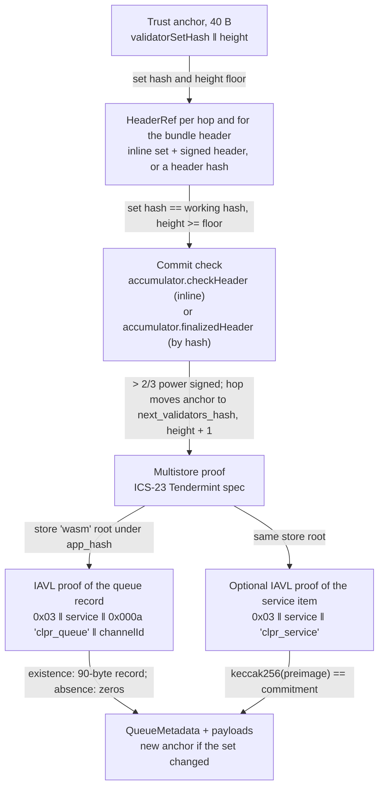
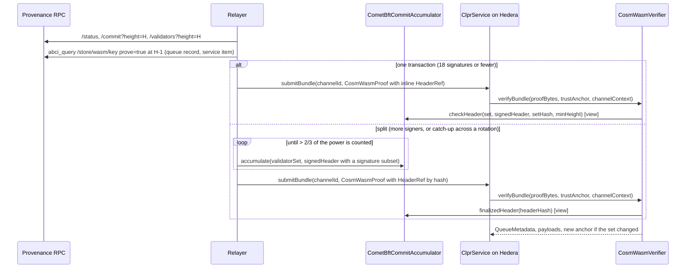

# Provenance verifier (CosmWasm on CometBFT)

A "Provenance → Hiero" verifier. `CosmWasmVerifier` runs on Hedera's EVM and proves (1) CometBFT
finality of a Provenance header, meaning validators holding more than 2/3 of the set's voting power
signed it, and (2) the peer CLPR Service's queue record under that header's `app_hash`. The CLPR
Service on Provenance is a **CosmWasm contract**, so its storage lives in wasmd's `wasm` IAVL
store. Nothing here is Provenance-specific beyond the deploy-time profile: any CometBFT + wasmd
chain uses the same two contracts ([THORChain](../thorchain/README.md) is the second live user).
When a commit is too large for one transaction, `CometBftCommitAccumulator` spreads its signatures
over several.

## 1. At a glance

| | |
|---|---|
| Direction | `Provenance → Hiero` (and any CometBFT + wasmd chain by profile) |
| Chain | Provenance mainnet `cosmos:pio-mainnet-1` (provenanced v1.30.0, CometBFT 0.38.22) |
| Finality source | CometBFT commit, > 2/3 of voting power; 100 validators, 18 power-ordered signatures clear 2/3 |
| Trust (one line) | Honest 2/3 of each set the anchor reaches, a bootstrap checkpoint, anchor kept inside the 21-day unbonding period, the CLPR Service contract's admin (none or governance) |
| Typical bundle | 13,113,627 gas, 8.9 KB, one transaction (live) |
| Rotation | 13,120,821 gas, 8.9 KB: an ordinary bundle at the rotation header (live). Missed rotation: split mode, 0.54M for the bundle plus `accumulate` transactions |
| Contract sizes | `CosmWasmVerifier` 15,306 B; `CometBftCommitAccumulator` 13,104 B; `Ed25519Verifier` 12,206 B |
| Status | Live-verified on `pio-mainnet-1` data recorded 2026-10-01: a real rotation and a real contract's storage. No CosmWasm CLPR Service is deployed yet |

## 2. How it works



`verifyBundle(proofBytes, trustAnchor, channelContext)`:

1. Decode the anchor `validatorSetHash(32) ‖ height(8, big-endian)`, the family format
   (`CometBftStoreProofBase.sol:_decodeAnchor`).
2. Resolve each hop, then the bundle header, as a `HeaderRef`
   (`CometBftStoreProofBase.sol:_verifiedStoreRoot`, `_resolveHeader`):
   - **inline** `{1 validator_set, 2 signed_header}`: `CometBftCommitAccumulator.sol:checkHeader`, a
     view call that hashes the set, checks chain id, `validators_hash` and height floor, rebuilds the
     header hash and verifies signatures in power order until more than 2/3
     (`CometBftLightClient.sol:_verifySignedHeader`);
   - **by hash** `{3 header_hash}`: `CometBftCommitAccumulator.sol:finalizedHeader` must return a
     record with more than 2/3 accumulated, whose `validators_hash` and height match the working
     anchor.
   A hop moves the working anchor to `(next_validators_hash, height + 1)`.
3. Verify the multistore proof for store key `wasm` against `app_hash`
   (`CometBftStoreProofBase.sol:_verifiedStoreRoot`).
4. Prove the queue record. Its key must be exactly `0x03 ‖ ctx.remoteServiceAddress ‖ 0x000a ‖
   "clpr_queue" ‖ ctx.channelId`, so a relay cannot substitute another channel or contract
   (`CosmWasmVerifier.sol:_queueKey`, `CometBftStoreProofBase.sol:_proveEntry`). Existence yields the
   90-byte record (`CosmWasmVerifier.sol:_decodeQueueRecord`); non-existence yields zero metadata.
5. With a manifest, prove the service item `0x03 ‖ service ‖ "clpr_service"` = `service ‖
   commitment` and check `keccak256(preimage) == commitment` (`_proveServiceEntry`,
   `_bindManifest`).
6. Return the new anchor when `next_validators_hash` differs from the anchor's set
   (`CometBftStoreProofBase.sol:_nextAnchor`).

`verifyConfig` runs the same chain from `(BOOTSTRAP_VALIDATORS_HASH, BOOTSTRAP_HEIGHT)` and proves
the service item, which binds the configured service address (the value must start with it) and the
initial manifest commitment. `verifyContractEntry(proof, anchor, contract, key)` is the same
pipeline for any contract key and returns `(exists, rawValue, height)`.

## 3. Bundle lifecycle



## 4. Trust model

Trusted:
- **Honest supermajority** of every Provenance validator set the anchor reaches.
- **Bootstrap checkpoint** for `verifyConfig`, chosen by the deployer. A config proof cannot supply
  its own validator set.
- **Unbonding period.** A sequential light client with no trusting period. Provenance's unbonding
  time is 21 days (`1814400s`, live staking params), so relays must bundle at every rotation within
  that window.
- **The peer contract's admin.** A CosmWasm contract with an admin can be migrated to new code
  (`MsgMigrateContract`). The verifier pins the address and the storage layout, not the code. The
  CLPR Service should be instantiated with no admin or with governance as admin. Pinning a code id
  is possible later by also proving `ContractInfo` (`0x02 ‖ address` in the same store).
- **`Ed25519Verifier`**, the pure-Solidity verifier pinned in the accumulator.

Not trusted:
- The relayer, and whoever calls `accumulate`. A record says only "the set with hash S signed
  header h with more than 2/3 of S's power". The header hash commits to `validators_hash`, so each
  header has one record and one set, and the verifier accepts a record only when S is the set its
  anchor or a verified hop names. Every batch for a header must carry the same round and part-set
  header (`CommitMismatch`), a signer already counted is skipped, and a batch that adds nobody
  reverts (`NoNewSignatures`). The accumulator is bound to one chain id and key scheme.

To forge a bundle an attacker must control more than 2/3 of the voting power of a set the anchor
reaches, or of a set older than the unbonding period that a stale anchor still names.

Replay and staleness: headers below the anchor height are rejected; older headers at or above it
are caught by ClprService's progress and replay checks.

## 5. Proof format

Trust anchor: `validatorSetHash(32) ‖ height(8, big-endian)`, 40 bytes; the anchor id equals the
anchor.

`proofBytes` is a protobuf `CosmWasmProof`:

| Field | Type | Meaning |
|---|---|---|
| 1 `bundle_content` | `ClprBundleContent` | Message payloads (`verifyBundle`) |
| 2 `header` | `HeaderRef` | `{1 validator_set, 2 signed_header}` inline, or `{3 header_hash}` |
| 3 `hop` (repeated) | `HeaderRef` | Catch-up across rotations |
| 4 `multistore_proof` | ICS-23 `CommitmentProof` | Store `wasm` → store root, Tendermint spec |
| 5 `entry` | `StorageProofEntry{1 key, 2 value, 3 IAVL proof}` | Queue record (bundle) or service item (config) or any key (`verifyContractEntry`) |
| 6 `service_entry` | `StorageProofEntry` | Optional service item for a manifest |
| 7 `manifest_preimage` | bytes | Optional manifest protobuf |
| 8 `ledger_configuration` | bytes | `verifyConfig` only |

`ValidatorSet` and `SignedHeader` are `CometBftVerifier`'s ([CometBFT README §5](../cometbft/README.md)).
`test/e2e/relay/cosmwasm.ts` builds every message from public RPC JSON.

Store layout this verifier requires from a CosmWasm CLPR Service (checked against wasmd and
cw-storage-plus sources, and live by `verifyContractEntry`):

| Entry | Key in store `wasm` | Value |
|---|---|---|
| Any contract storage | `0x03 ‖ contract canonical address ‖ contract key` | wasmd `ContractStorePrefix = 0x03` |
| Queue record, one per channel | contract key `0x000a ‖ "clpr_queue" ‖ channelId(32)` (cw-storage-plus `Map("clpr_queue")`) | 90 B raw: `0x01 ‖ status u8 ‖ next_message_id u64 ‖ received_message_id u64 ‖ endpoint_manifest_version u64 ‖ sent_running_hash(32) ‖ received_running_hash(32)`, big-endian |
| Service item | contract key `"clpr_service"` | own canonical address ‖ `keccak256(ClprEndpointManifest)` (32 zero bytes if none) |

Contract addresses are 32 B (`BuildContractAddressClassic`); early Provenance contracts are 20 B,
and both lengths are accepted. One record per channel means one IAVL proof per bundle instead of
the EVM verifiers' five or six slot proofs.

Deployment profile:

| Contract | Parameter | Provenance value |
|---|---|---|
| `CometBftCommitAccumulator` | `chainId`, `keyScheme`, `ed25519Verifier` | `pio-mainnet-1`, `ED25519`, the `Ed25519Verifier` address |
| `CosmWasmVerifier.Profile` | `accumulator` | the accumulator above |
| | `storeKey` | `wasm` |
| | `bootstrapValidatorsHash`, `bootstrapHeight` | a recent set hash and height, chosen at deployment |

## 6. Validator-set rotation

Any change in a validator's power changes `validators_hash`. Provenance rotated once in the 820
blocks scanned (about 1 h at about 4.3 s per block). A rotation is an ordinary bundle at the last
header the old set signs (`R` in the fixture), which returns the new anchor and costs the same as
any bundle: 13,120,821 gas live.

A relay that misses `R` catches up with hops. Inline, hop plus header needs 36 signatures
(25,729,478 gas), which does not fit. The relay therefore accumulates both commits first
(`accumulate` R in two transactions, B in one) and then sends a bundle that references both by
hash: 536,951 gas.

## 7. Gas and calldata

Live `pio-mainnet-1` data recorded 2026-10-01 (`test/e2e/fixtures/provenance-live/provenance.json`):
rotation `R = 33,796,997` signed by the old set, `B = R + 2` signed by the new set, 100 validators,
18 Ed25519 signatures per header, and ABCI proofs from Figure's "Crypto-Backed Loan" pool
`pb1msvy4f0…nm5ged` (code 52, cw2 `democratized_prime_pool_v2` 1.0.0). Gas is anvil
`eth_estimateGas` of the whole transaction (`accumulate`: `gasUsed`), replayed on this branch on
2026-10-01. Hedera limits: 15,000,000 gas, 131,072 B calldata.

| Transaction | Sigs | Gas | Calldata | ≤ 15M |
|---|---|---|---|---|
| **Bundle at R, one tx** (returns the rotation anchor) | 18 | **13,120,821** | 8.9 KB | yes |
| **Bundle at B, one tx**, from the anchor R returned | 18 | **13,113,627** | 8.9 KB | yes |
| `verifyContractEntry`: cw2 `contract_info` Item (existence) | 18 | 12,877,305 | 8.0 KB | yes |
| `verifyContractEntry`: Map `sb1[pb1whzz…]` (existence) | 18 | 12,902,194 | 8.2 KB | yes |
| Catch-up inline (hop R + header B) | 36 | 25,729,478 | 15.3 KB | **no** |
| Split: `accumulate` R, signatures 1–9 | 9 | 7,005,302 | 5.8 KB | yes |
| Split: `accumulate` R, signatures 10–18 | 9 | 6,864,507 | 5.8 KB | yes |
| Split: `accumulate` B | 18 | 12,726,801 | 6.6 KB | yes |
| Split: bundle at R by header hash | 0 | **520,717** | 2.5 KB | yes |
| Split: catch-up bundle at B, hop R, both by hash | 0 | **536,951** | 2.5 KB | yes |
| THORChain commit (cometbft-live fixture), `accumulate` × 4 | 67 | 11,927,896 + 11,756,013 + 11,781,300 + 11,129,506 | — | yes, each |

The one-transaction bundle leaves 1.88M gas of headroom. At about 640k per Ed25519 signature, the
one-transaction path holds while the smallest power-ordered signer set is about 20 or fewer (18
today). Of the 13.1M, about 11.5M is the 18 signatures and 0.52M is the state proof (measured in
split mode); the rest is the 100-leaf set and the header.

In split mode each transaction holds up to about 20 Ed25519 signatures plus 0.6–1.1M fixed (set
decoding), so any commit fits in `ceil(signers / ~18)` transactions; total cost stays linear. The
first batch creates a 7-slot record and later batches update the counted power and the bitmap.

## 8. Limits and known gaps

- **No CosmWasm CLPR Service exists.** The live bundle proves the absence of the queue record on a
  real contract. The service contract is sketched in §12, not built.
- **Ed25519 cost** dominates (§7). A SNARK of the commit (Groth16 over BN254, about 0.3–0.4M gas,
  estimate) would bring a bundle to about 0.9M in one transaction (estimate: 0.52M measured state
  proof plus the Groth16 check). It adds circuit and prover trust and a trusted setup; not built.
- **Split mode is not stateless.** The verifier reads accumulator records through `view` calls.
- **ABCI proof history.** The relay needs a node with versions at `H-1` for every rotation header.
- **Hiero → Provenance** is not built (§12).

## 9. Upgrades and forks

Provenance upgrades by `x/upgrade` plans voted in `x/gov`. Under the fork-aware verifier ADR
(`ADR/2026-10-01-fork-aware-verifiers.md` in the spec fork, draft PR LFDT-CLPR/clpr-spec#1):

- **Class A** (header version, validator sets): the verifier hashes `version.block` and
  `version.app` as signed and does not pin them; sets follow rotation (§6).
- **Class B** (layout): a wasmd change to `ContractStorePrefix`, the store name, or a CLPR Service
  that changes its record encoding breaks every proof (`StorageKeyMismatch`, `InvalidQueueRecord`).
  The record starts with a version byte (`0x01`) and the verifier rejects any other. A new layout
  needs a new deployment.
- **Class C** (semantic): a signature scheme or header-hash change fails closed in the light client
  and needs new code and channel succession.
- A CosmWasm contract migration is not a chain fork but has the same effect on the layout; see the
  admin rule in §4.

`fork_id` and profile arming from the ADR are not implemented in this family yet.

## 10. Running it

```bash
forge test --match-path 'test/verifiers/evm/provenance/*'                         # 29 tests
forge test --match-path 'test/verifiers/compliance/CosmWasmComplianceTest.t.sol'  # 21 tests, shared suite
forge build && npm run test:e2e:provenance-live    # 13 tests on the live fixture (CLPR_ANVIL_PORT_A, default 8598)
npm run provenance-live:refresh                     # re-record from https://rpc.provenance.io
```

## 11. Files

| File | What |
|---|---|
| `src/verifiers/evm/provenance/CosmWasmVerifier.sol` | The verifier: queue record, service item, `verifyContractEntry` |
| `src/verifiers/evm/cometbft/CometBftStoreProofBase.sol` | Header references, anchor codec, multistore and IAVL entry proofs (shared with `PolygonPosVerifier`) |
| `src/verifiers/evm/cometbft/CometBftCommitAccumulator.sol` | `accumulate`, `finalizedHeader`, `checkHeader` |
| `src/verifiers/evm/cometbft/CometBftLightClient.sol` | Shared commit check |
| `test/verifiers/evm/provenance/CosmWasmVerifier.t.sol` | 29 tests on a synthetic chain (real secp256k1 signatures, real IAVL trees) |
| `test/helpers/CosmWasmSyntheticChain.sol` | The synthetic chain |
| `test/verifiers/compliance/CosmWasmComplianceTest.t.sol` | Shared `IClprVerifier` compliance suite, 21 cases |
| `test/e2e/fixtures/provenance-live/provenance.json` | Live capture: rotation R, header B, contract proofs |
| `test/e2e/relay/cosmwasm.ts` | Builds `CosmWasmProof` from RPC JSON |
| `test/e2e/relay/buildProvenanceLiveFixture.ts` | Fixture refresh script |
| `test/e2e/tests/verifiers/provenance-live.spec.ts` | Live replay, 13 tests with negatives |
| `docs/chains/provenance.md` | Chain page |

Negative cases in the Foundry suite: bad signature, below threshold, wrong set, stale header (inline
and accumulated), header from another set, not-finalized header, replayed batch, mixed rounds,
another chain id, tampered value, another channel's key, wrong store key, bad record, manifest
mismatch, config service mismatch, config not from the bootstrap set, bad anchor and address
length, malformed `HeaderRef`. The live spec adds a flipped signature byte, below threshold, wrong
set, stale header, tampered IAVL proof, another channel and another chain id.

## 12. Hiero ↔ Provenance service sketch (not built)

Upload and fees (live, 2026-10-01):

| Item | Value | Source |
|---|---|---|
| `code_upload_access` | `ACCESS_TYPE_EVERYBODY` | `/cosmwasm.wasm.v1.Query/Params` |
| `instantiate_default_permission` | `ACCESS_TYPE_EVERYBODY` | same |
| `MsgStoreCode` fee | 6,666.67 HASH = $100 flat (`flatfees`, at 15 musd per HASH) | `/provenance/flatfees/v1/msgfee` |
| `MsgInstantiateContract(2)` fee | 33.33 HASH = $0.50 | same |
| `MsgExecuteContract` fee | 10 HASH = $0.15 | same |
| Per-tx gas limit | 4,000,000, except txs of only gov messages or only `MsgStoreCode` | `internal/antewrapper/utils.go` |

No governance proposal is needed to deploy: anyone can store the code (a store-only transaction is
exempt from the 4M limit) and instantiate it, with `--no-admin` or the gov module as admin.

The contract keeps per-channel state and an outbound queue, uses the Solidity running hash
`h' = sha256(h ‖ sha256(payload))` (`BundleLib`), rewrites the 90-byte record after every change,
keeps `clpr_service` up to date (`sha3` crate for keccak), and delivers payloads with
`WasmMsg::Execute` submessages and replies so that a failing app does not roll back a bundle.

Hiero → Provenance needs a Hiero proof that verifies within 4M SDK gas per execute. CosmWasm 3
exposes BLS12-381 pairing and hash-to-curve, Ed25519, secp256k1 and secp256r1 host functions
(cosmwasm-std 3.0.4 `traits.rs`). It waits on the Hiero proof source, as every Hiero → chain
direction does.

## 13. References

- provenance-io/provenance v1.30.0 (`e5b9507`): `go.mod` (cosmos-sdk v0.53 fork, wasmd
  v0.61.10-pio-2, iavl v1.2.6, ics23 v0.11), `internal/antewrapper`.
- provenance-io/wasmd v0.61.10-pio-2 (`34d3184`): `x/wasm/types/keys.go`, `x/wasm/keeper/keeper.go`,
  `x/wasm/keeper/addresses.go`, `proto/cosmwasm/wasm/v1/types.proto`.
- CosmWasm/cosmwasm v3.0.4 `packages/std/src/storage_keys/length_prefixed.rs`, `traits.rs`;
  CosmWasm/cw-storage-plus (`88e9e2a`) `src/path.rs`, `src/map.rs`.
- CometBFT v0.38 header hash, canonical vote and simple Merkle, as in the
  [CometBFT README §12](../cometbft/README.md).
- Fork-aware verifiers ADR, `ADR/2026-10-01-fork-aware-verifiers.md` (spec fork, draft PR
  LFDT-CLPR/clpr-spec#1).
- Live: `https://rpc.provenance.io` (status, commit, validators, blockchain, abci_query) and
  `https://api.provenance.io` (wasm codes and contracts, contract state, flat fees, staking params).
