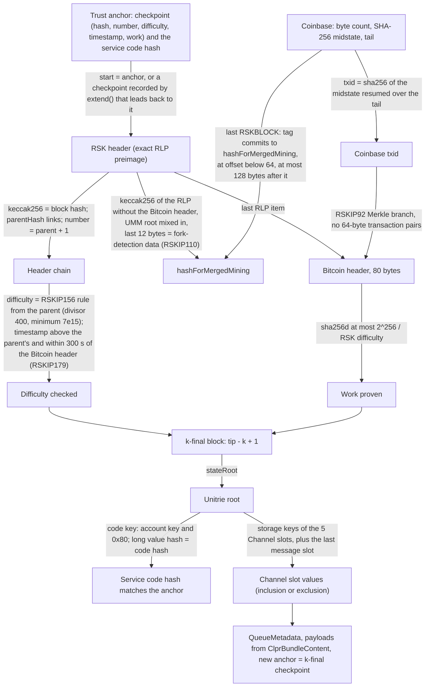
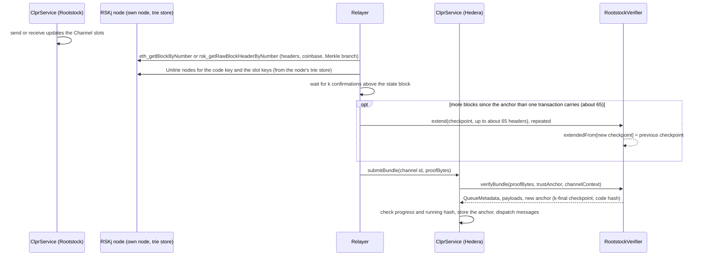

# RootstockVerifier: Rootstock → Hiero

`RootstockVerifier` is an `IClprVerifier` for Hedera's EVM that verifies the CLPR queue state of the unmodified
Solidity `ClprService` deployed on Rootstock (RSK, direction `Rootstock → Hiero`). Rootstock is merge-mined with
Bitcoin: each RSK header carries a Bitcoin header whose proof of work meets the RSK difficulty and whose coinbase
transaction commits to the RSK block. The verifier is a proof-of-work light client: it follows RSK headers from a
checkpoint, checks the difficulty rule and the merged-mining proof of each one, waits for `k` confirmations, and then
proves the `ClprService` storage slots through RSK's Unitrie (not the Ethereum Merkle-Patricia trie).

**Trust rests on merged-mining proof of work**: Bitcoin miners' work at the RSK difficulty, the share of the Bitcoin
hashrate that merge-mines RSK. There is no signer set. The verifier does not use RSK's PowPeg federation.

## At a glance

| Item | Value |
|---|---|
| Chains covered | Rootstock mainnet (`eip155:30`); RSKj regtest (`eip155:33`) for the full bundle. Page: [`docs/chains/rootstock.md`](../../../../docs/chains/rootstock.md) |
| Direction | Rootstock → Hiero |
| Finality source | `k` confirmations of merged-mining proof of work at the RSK difficulty (constructor parameter; tests use `k = 12` on mainnet) |
| Trust (one line) | No RSK reorg deeper than `k`; the deployment checkpoint is canonical. Bitcoin hashrate that merge-mines RSK, no committee |
| Typical bundle | 12 mainnet headers: 2,422,030 gas, 16,932 B (`eth_estimateGas`, live mainnet). Full bundle on a real RSKj regtest chain (4 headers, code + 6 slot proofs): 1,090,059 gas, 14,468 B |
| Rotation | None (no validator set). Catch-up: `extend` with 40 mainnet headers 8,863,051 gas, 56,516 B (real transaction on anvil); about 229,000 gas and 1,414 B per header |
| Contract size | `RootstockVerifier` runtime 21,301 B |
| Status | Live-verified on Rootstock mainnet headers (merged mining, difficulty rule; 40 headers, 2026-10-01) and end to end on a real RSKj 9.0.4 regtest node (Unitrie proofs from its trie store), including the shared IClprVerifier compliance suite with endpoint manifests. No mainnet storage proof: public nodes serve none |

## How it works



1. `RootstockVerifier.sol:verifyBundle` decodes the anchor and the proof. If `start` is set, `requireDescends` walks
   the `extendedFrom` records (at most 256) from `start` back to the anchor checkpoint.
2. `RootstockVerifier.sol:_followChain` checks every header on top of the start checkpoint: parent hash, number,
   timestamps (strictly increasing, and within `maxBtcTimestampDiff` of the Bitcoin header's time per RSKIP179) and
   the difficulty (`RskHeader.sol:expectedDifficulty`, RSKIP156). The state block must have at least `k`
   confirmations; the new checkpoint is the block at `tip − k + 1`.
3. `RskHeader.sol:parse` reads the header from its exact RLP preimage and computes `hashForMergedMining`
   (RSKIP92 form, UMM root, RSKIP110 fork-detection bytes taken from the coinbase).
4. `RskHeader.sol:verifyMergedMining` checks the Bitcoin header's double SHA-256 against the RSK difficulty (not the
   Bitcoin header's own nBits), the `RSKBLOCK:` tag rules, the coinbase txid resumed from the SHA-256 midstate
   (`Sha256Midstate.sol:resume`), and the RSKIP92 Merkle branch (at most 960 bytes, no pair that parses as a 64-byte
   transaction).
5. `RootstockVerifier.sol:_verifyCode` proves the service's code key in the Unitrie (`RskUnitrie.sol:get`) and
   compares the code hash with the anchor's.
6. `RootstockVerifier.sol:_verifyChannelSlots` proves the five `Channel` slots of the channel (and, when messages
   were sent, the last message's running-hash slot), with keys derived from the CLPR storage layout, and builds
   `QueueMetadata` (`ClprEvmBundleVerifier.sol:_buildQueueMetadata`).
7. An optional endpoint manifest is proven through its commitment slot (`_verifyRskManifest`).

### Unitrie proofs

RSK stores accounts, code and storage in one binary trie (RSKIP107 node format, RSKIP126 state root, mainnet from
block 1,591,000). Keys (RSKj `TrieKeyMapper`): account `0x00 ‖ keccak256(addr)[0:10] ‖ addr`; code
`account ‖ 0x80`; storage `account ‖ 0x00 ‖ keccak256(slot)[0:10] ‖ slot without leading zeros`. A node's hash is
keccak256 of its message; children whose message is at most 44 bytes are embedded in the parent
(`MAX_EMBEDDED_NODE_SIZE_IN_BYTES`). A proof is the list of
non-embedded node messages on the path, root first. `RskUnitrie.sol:get` proves inclusion and exclusion (a zero
storage word is absent from the trie).

## Bundle lifecycle



Channel setup: `verifyConfig` follows headers from the deployment checkpoint, reads the service's code hash from the
Unitrie (never from the operator), and returns the anchor at the k-final checkpoint.

## Trust model

Trusted:
- **No RSK reorganisation deeper than `k` blocks.** The verifier follows only the chain the relayer shows and does not
  compare forks. A forger needs `k` consecutive RSK headers on a fork above the anchor checkpoint, each with a Bitcoin
  header that meets the RSK difficulty (which the difficulty rule only lets move by 1/400 per block, never below
  7 × 10^15), and a coinbase that commits to it. That is merged-mining work, not Bitcoin's full difficulty.
- **The deployment checkpoint is on the canonical chain** (constructor `genesis`).
- **The `ClprService` code on Rootstock**, pinned by its code hash at `verifyConfig`.

Not trusted:
- The relayer: every header and slot is proven. A relayer can delay or prove an older state, which `ClprService`
  rejects.
- Callers of `extend`: a record only states that one checkpoint follows from another with valid work. A bundle uses
  records only on a path back to its own anchor.
- The PowPeg federation and RSK's bridge: not involved.

Not checked: transactions, uncles' contents, the gas rules, RSK's minimum gas price. Only the header chain, merged
mining and the state proofs.

## Proof format

Trust anchor, `abi.encode(Anchor)`:

| Field | Type | Meaning |
|---|---|---|
| `checkpoint.blockHash` | `bytes32` | A k-final RSK block |
| `checkpoint.number`, `difficulty`, `timestamp` | `uint256` | What the next header's rules need |
| `checkpoint.work` | `uint256` | Sum of header difficulties since the deployment checkpoint (reported; uncles not counted) |
| `codeHash` | `bytes32` | Pinned `ClprService` runtime code hash |

Trust anchor id: `checkpoint.blockHash`.

Bundle `proof_bytes`, `abi.encode(BundleProof)`:

| Field | Type | Meaning |
|---|---|---|
| `headers[]` | `MinedHeader` | `header` (exact RLP hash preimage), `coinbase` (`bitcoinMergedMiningCoinbaseTransaction`: byte count, midstate, tail), `merkleProof` (`bitcoinMergedMiningMerkleProof`) |
| `stateIndex` | `uint256` | Index of the header whose `stateRoot` is proven; needs `k` confirmations |
| `codeProof` | `bytes[]` | Unitrie nodes for the service's code key |
| `slotProofs` | `bytes[][]` | Unitrie nodes for the 5 Channel slots (+ the last message's running-hash slot) |
| `bundleContent` | `bytes` | `ClprBundleContent` protobuf |
| `manifestPreimage`, `manifestProof` | `bytes`, `bytes[]` | Optional endpoint manifest and the proof of its commitment slot |
| `start` | `Checkpoint` | Zero hash: headers start at the anchor. Otherwise a checkpoint recorded by `extend` that leads back to it |

`extend(Checkpoint from, MinedHeader[] headers)` takes the same headers and records the k-final checkpoint.

Constructor profile (`Params`):

| Parameter | Mainnet | Regtest | Source |
|---|---|---|---|
| `chainId` | `eip155:30` | `eip155:33` | RSKj `Constants` (chain ids 30, 33) |
| `confirmations` (`k`) | Deployment choice; 12 in the tests | 3 | — |
| `minDifficulty` | 7 × 10^15 | 1 | RSKj `Constants.mainnet()` (`FALLBACK_MINING_DIFFICULTY / 2`) |
| `difficultyDivisor` | 400 | 2048 | RSKj `Constants` (`RSKIP156_DIF_BOUND_DIVISOR`) |
| `durationLimit` | 14 s | 10 s | RSKj `Constants` |
| `forkDetectionFrom` | 1,591,000 | 0 | RSKIP110 at `wasabi100` (RSKj `main.conf`) |
| `maxBtcTimestampDiff` | 300 s | 0 (off) | RSKIP179, `DEFAULT_MAX_TIMESTAMPS_DIFF_IN_SECS` |
| `genesis` | A deep mainnet block after `iris300` (3,614,800) | the block before the deploy | Any RSK node |

## Validator-set / committee rotation

There is no validator set. The anchor checkpoint moves forward with each bundle. A transaction carries about 65
headers (about 229,000 gas each), which is about 54 new blocks per transaction at `k = 12`, or about 30 minutes of RSK
time at the 33.8 s average block interval of the mainnet fixture. When a channel has been idle longer, the relayer
first calls `extend` (permissionless, same checks) as often as needed and the bundle starts from the last recorded
checkpoint. One idle day is about 2,560 blocks, about 48 `extend` transactions.

## Gas and calldata

Measured on anvil with the fixtures in `test/e2e/fixtures/rootstock-live/` (mainnet headers captured 2026-10-01 from
`public-node.rsk.co`, RSKj 9.0.3; regtest from RSKj 9.0.4):

| Operation | Gas | Calldata | Fits 15M gas / 128 KB |
|---|---|---|---|
| `verifyHeaders`, 12 mainnet headers (one k window) | 2,422,030 | 16,932 B | yes |
| `verifyHeaders`, 40 mainnet headers | 8,837,780 | 56,516 B | yes |
| `extend`, 40 mainnet headers (receipt) | 8,863,051 | 56,516 B | yes |
| `verifyBundle`, regtest: 4 headers, code + 6 slot proofs | 1,090,059 | 14,468 B | yes |

A mainnet bundle is the 12-header window plus Unitrie proofs. Mainnet proofs are deeper than regtest's (a larger
trie) and were not measured, because no public RSK node serves them; they are keccak-only, so the bundle stays far
below 15M gas. The per-header cost bounds how far one transaction can catch up (see rotation).

## Limits and known gaps

- **No public storage proofs.** RSKj 9.x has no `eth_getProof`, and public nodes do not serve raw headers. A relayer
  needs its own RSKj node and reads Unitrie nodes from its trie store (`UnitrieDump.java` dumps the RocksDB store of a
  stopped node; a production relayer needs a live reader). Mainnet headers are rebuilt from `eth_getBlockByNumber`
  and checked against the block hash.
- **Mainnet bundle not verified end to end**: no `ClprService` runs on Rootstock mainnet and no mainnet Unitrie proofs
  are available. The full path runs on a real regtest node with a contract holding a Channel record at the
  `ClprService` slots.
- **Header-by-header cost.** About 229,000 gas per RSK block; long idle periods need many `extend` transactions.
- **No fork choice.** `k` valid headers above the anchor are enough; the verifier does not compare chains.
- **V0 headers only** (`BlockHeaderV0`, 17 or 18 RLP items). RSKIP351 header versions are not active on mainnet.
- **Testnet not covered**: testnet uses other minimum-difficulty rules (RSKIP290) and a 120-minute timestamp bound.

## Upgrades and forks

| RSK change | Effect here | Handling |
|---|---|---|
| New header version (RSKIP351 and later) | `RskBadHeader` | New verifier or a fork profile |
| Difficulty rule, divisor or minimum | `RskDifficultyMismatch` | New verifier or a fork profile (parameters) |
| Merged-mining rules (tag position, branch length, fork-detection data) | Merged-mining reverts | New verifier |
| Unitrie node format or key mapping | `UnitrieHashMismatch` / wrong keys revert | New verifier |
| `ClprService` storage layout | Slot proofs fail | New verifier, new channel |

All failures revert (fail closed). The fork-aware verifier ADR (`ADR/2026-10-01-fork-aware-verifiers.md` in the spec
fork, draft PR LFDT-CLPR/clpr-spec#1) proposes fork profiles armed by a proven announcement and a timelocked
registration, and `ClprChannelSuccession` to move a channel to a new verifier. This verifier has no profile mechanism
yet; RSK activates network upgrades at fixed heights (`main.conf`), which suits height-indexed profiles. On
2026-10-01 `main.conf` lists `reed810` (which carries RSKIP351 header versions) and `cardamom1000` with no mainnet
height (`-1`); either one needs review before it activates. With no
rotating signers, a stalled channel can always catch up later with `extend`.

## Running it

```bash
# unit and live-fixture tests (forge): 40 mainnet headers, regtest bundle, negative cases, catch-up
forge test --match-path 'test/verifiers/rootstock/*'
# IClprVerifier compliance suite on the regtest compliance fixture
forge test --match-path 'test/verifiers/compliance/RootstockComplianceTest.t.sol'

# anvil replay (mainnet headers, extend as a transaction, regtest verifyConfig/verifyBundle)
forge build && npm run test:e2e:rootstock-live

# refresh the mainnet headers from a public node
npm run rootstock-live:refresh               # = npx tsx test/e2e/relay/buildRootstockProof.ts --refresh-mainnet

# refresh the regtest fixtures from a local RSKj node (needs the rskj-core fat jar and JDK 17+)
RSKJ_JAR=/path/rskj-core-<ver>-all.jar npm run rootstock-live:refresh-regtest
RSKJ_JAR=/path/rskj-core-<ver>-all.jar test/e2e/relay/rootstock/refresh-regtest.sh compliance
```

## Files

| File | Purpose |
|---|---|
| `src/verifiers/evm/rootstock/RootstockVerifier.sol` | The verifier: header chain, merged mining, catch-up records, Unitrie state |
| `src/libraries/proof/rootstock/RskHeader.sol` | Header parsing, difficulty rule, merged-mining proof |
| `src/libraries/proof/rootstock/RskUnitrie.sol` | Unitrie inclusion/exclusion proofs and RSK key mapping |
| `src/libraries/crypto/Sha256Midstate.sol` | SHA-256 resumed from a midstate (the merged-mining coinbase) |
| `src/verifiers/bitcoin/BitcoinLib.sol` | Bitcoin header hashing and byte-order helpers (shared with `BitcoinVerifier`) |
| `script/gen/gen_sha.py` | Generator of the SHA-512/256 and SHA-256 midstate Yul libraries |
| `test/verifiers/rootstock/RootstockVerifier.t.sol` | 23 tests on live mainnet headers and the regtest trie |
| `test/e2e/fixtures/rootstock-live/mainnet.json` | 40 consecutive mainnet headers with merged-mining proofs |
| `test/e2e/fixtures/rootstock-live/regtest.json` | RSKj regtest chain, Channel record and Unitrie proofs |
| `test/e2e/fixtures/rootstock-live/compliance.json` | RSKj regtest chain with six manifest commitments, for the compliance suite |
| `test/verifiers/compliance/RootstockComplianceTest.t.sol` | The shared IClprVerifier compliance suite (21 cases) on real regtest data |
| `test/e2e/relay/buildRootstockProof.ts` | Relayer reference: header preimages, Unitrie proofs from a dump, ABI helpers |
| `test/e2e/relay/rootstock/refresh-regtest.sh`, `UnitrieDump.java` | Regtest capture and trie-store dump |
| `test/e2e/tests/verifiers/rootstock-live.spec.ts` | Anvil replay with gas and calldata checks |

## References

- rsksmart/rskj `8c29c939` (master, 2026-09-30), `rskj-core/src/main/java`:
  - `co/rsk/validators/ProofOfWorkRule.java`, `BlockTimeStampValidationRule.java`: merged-mining and timestamp rules.
  - `org/ethereum/core/BlockHeader.java` (`getEncoded`, `getHashForMergedMining`), `co/rsk/core/DifficultyCalculator.java`.
  - `co/rsk/trie/Trie.java` (`toMessage`, `fromMessageRskip107`), `SharedPathSerializer`, `PathEncoder`.
  - `org/ethereum/db/TrieKeyMapper.java`: account, code and storage keys.
  - `org/ethereum/config/Constants.java`: chain ids, minimum difficulty, divisors, duration limit, timestamp bounds.
  - `rskj-core/src/main/resources/reference.conf`, `config/main.conf`: RSKIP activation heights.
  - `co/rsk/rpc/modules/rsk/RskModuleImpl.java`: `rsk_getRawBlockHeaderByNumber`.
- Live data: `https://public-node.rsk.co` (RSKj 9.0.3 VETIVER), 2026-10-01; RSKj 9.0.4 regtest.
