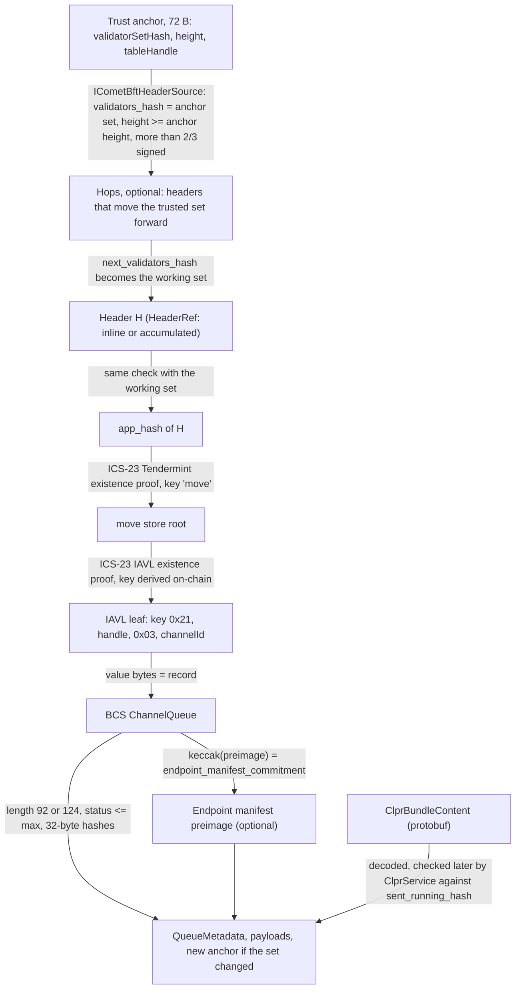
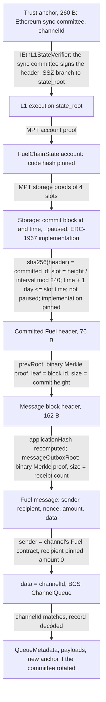
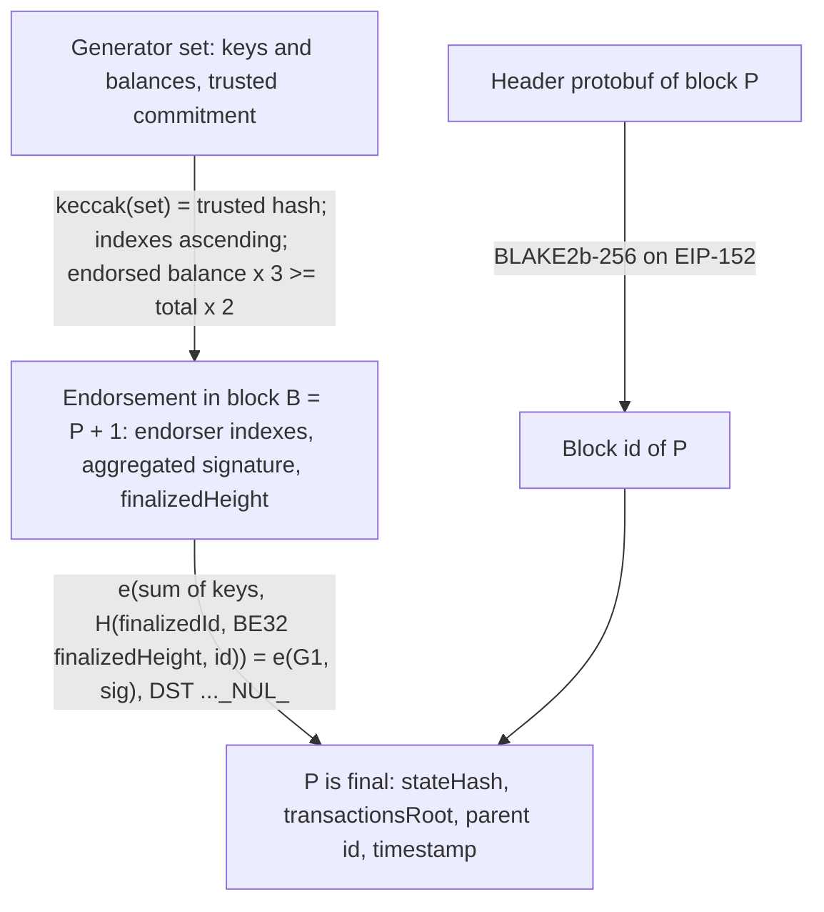
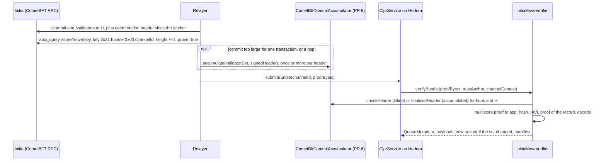
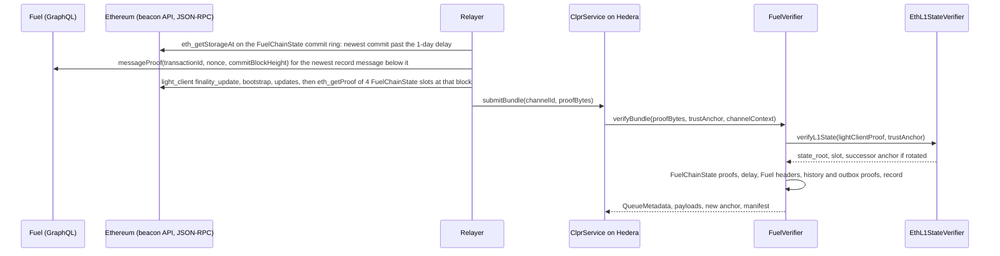
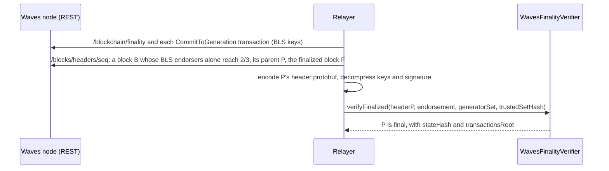

# New-runtime verifiers, batch 3: Initia, Fuel Ignition, Waves

> **Sources**: [InitiaMoveVerifier.sol](./InitiaMoveVerifier.sol) · [FuelVerifier.sol](./FuelVerifier.sol) ·
> [WavesFinalityVerifier.sol](./WavesFinalityVerifier.sol) · [ClprQueueRecordVerifier.sol](./ClprQueueRecordVerifier.sol) ·
> libraries in [`lib/`](./lib)
> **Interface**: [IClprVerifier.sol](../../../interfaces/IClprVerifier.sol)
> **Per-chain pages**: [Initia](../../../../docs/chains/initia.md) · [Fuel Ignition](../../../../docs/chains/fuel-ignition.md) ·
> [Waves](../../../../docs/chains/waves.md)

This family covers three chains (ranks 51 to 100) whose runtimes are neither EVM nor a Move chain with a BFT light
client of its own, in the direction **chain → Hiero**. The contracts run on Hedera's EVM.

* **Initia → Hiero** (`InitiaMoveVerifier`). Initia is a Cosmos SDK chain with CometBFT consensus and a MoveVM. The
  verifier proves the CLPR Service's per-channel queue record, a Move table entry in the `move` IAVL store, under a
  CometBFT header. The header check itself (more than 2/3 of the validators' power signed) is the CometBFT family's
  `CometBftCommitAccumulator` from PR #6; this branch declares its ABI as `ICometBftHeaderSource`.
* **Fuel Ignition → Hiero** (`FuelVerifier`). Fuel posts block ids to Ethereum (`FuelChainState`) without any state
  validation. The verifier proves a Fuel message that carries the queue record, from the Ethereum sync committee
  down to the Fuel block's message outbox. **Weaker trust tier: it trusts the Fuel committer.**
* **Waves → Hiero, finality only** (`WavesFinalityVerifier`). It proves that a Waves block is final under Waves'
  BLS-endorsement finality. It is not an `IClprVerifier`: Waves has no public state proof for a Ride dApp's data
  entries, and the generator set's balances are not provable. Both blockers are stated below.

All three keep the queue record in one byte layout, the Move family's BCS `ChannelQueue`
([ClprQueueRecordVerifier](./ClprQueueRecordVerifier.sol)), so one relay encoder serves them.

## At a glance

| | Initia | Fuel Ignition | Waves |
|---|---|---|---|
| Direction | Initia → Hiero | Fuel Ignition → Hiero | Waves → Hiero (finality half only) |
| Chain id | `cosmos:interwoven-1` (`verifyConfig` requires `cosmos:`) | Fuel chain id 9889; the tests use `fuel:9889` (`verifyConfig` requires `fuel:`) | testnet, chain byte `T` (84) |
| Finality source | CometBFT commit: more than 2/3 of the voting power signed the header (Ed25519, 10 validators) | the Ethereum sync committee signs the header; Fuel block id committed in `FuelChainState`, final after `TIME_TO_FINALIZE` (1 day) | BLS12-381 aggregated endorsements of at least 2/3 of the period's generating balance (feature 25) |
| State commitment | header `app_hash` → `move` store root → IAVL leaf `0x21 ‖ handle ‖ 0x03 ‖ channelId` | committed block → `prevRoot` (block history) → `messageOutboxRoot` → message | block header (`stateHash`, `transactionsRoot`); no state proof (blocked) |
| Trust (one line) | > 2/3 of each Initia validator set the anchor reaches, a bootstrap set, an anchor inside the unbonding period | **the Ethereum sync committee and the Fuel committer key**; `FuelChainState` admins can pause or upgrade (the verifier then stops) | the generator set (BLS keys and balances) is **trusted input** |
| Typical bundle | 3,459,586 gas, 1,508 B header check (PR #6 accumulator, live) + 532,778 gas, 3,460 B store proof (this branch, live) | 1,425,587 gas, 12,932 B (live, full chain) | 244,916 gas, 1,796 B (live, finality only) |
| Rotation | in the same transaction as a bundle at the rotation header; each missed change is one more header check (3,459,586 gas inline, or 3,587,458 gas per `accumulate`) | a sync-committee rotation adds 4,777,762 gas and 66,080 B to the L1 half (live) | trusted set update once per generation period (no on-chain rotation) |
| Contract size (runtime) | InitiaMoveVerifier 15,345 B; needs `CometBftCommitAccumulator` 13,104 B + `Ed25519Verifier` 12,206 B (PR #6) | FuelVerifier 15,576 B; `EthL1StateVerifier` 11,593 B | WavesFinalityVerifier 5,948 B |
| Status | live-verified on Initia mainnet (2026-10-01): state path on-chain, commit signatures off-chain here and on-chain with PR #6 | live-verified on Fuel Ignition + Ethereum mainnet (2026-10-01) | finality live-verified on Waves testnet (2026-10-01); CLPR state path **blocked** |

"Live-verified" means the production contracts ran on real chain data replayed on anvil. No CLPR Service exists on
Initia, Fuel or Waves, so the live tests prove real items of other contracts (Initia: `0x1::dex::ModuleStore` and
its `pairs` table; Fuel: a message from Fuel's bridge). The CLPR record checks in `verifyBundle` run in the Foundry
tests on synthetic data.

## How it works

### Initia



1. **Anchor.** `InitiaMoveVerifier.sol:verifyBundle` reads `validatorSetHash ‖ height ‖ tableHandle`
   (`_decodeBaseAnchor`).
2. **Headers.** `InitiaMoveVerifier.sol:_verifiedStoreRoot` resolves each hop and the state header with
   `_resolveHeader`: a HeaderRef `{1 validator_set, 2 signed_header}` goes to `ICometBftHeaderSource.checkHeader`
   (one transaction), a `{3 header_hash}` to `finalizedHeader` (signatures accumulated earlier), which must name the
   working set and a height at or above the floor. Each hop moves the working set to its `next_validators_hash`.
3. **Store root.** The multistore proof (ICS-23 Tendermint spec, `Ics23Lib.verifyMembershipTendermint`) must have
   key `move` and fold to the header's `app_hash`.
4. **Record.** `InitiaMoveVerifier.sol:tableEntryKey(handle, channelId)` builds the IAVL key; `_proveValue` checks the
   IAVL existence proof (`Ics23Lib.verifyMembershipIavl`) for exactly that key and the supplied record.
5. **Decode.** `ClprQueueRecordVerifier.sol:_decodeQueueRecord` returns the queue metadata and the manifest
   commitment; `ClprEvmBundleVerifier.sol:_decodeBundleContent` the payloads; `_bindManifest` an optional manifest.
6. **New anchor.** If the header's next set differs from the anchor set, the new anchor is
   `nextValidatorsHash ‖ height + 1 ‖ tableHandle`.

`verifyConfig` runs steps 2 and 3 from the deploy-time bootstrap set and proves the `<service>::clpr::Service`
resource (`resourceKey`), whose first field is the channels `Table` (`handle ‖ length`); the handle goes into the
anchor.

The Move storage layout comes from initia-labs/initia `x/move/types/keys.go` (`VMStorePrefix = 0x21`, separators
module 0, checksum 1, resource 2, table entry 3, table info 4) and `x/move/keeper/keeper.go` (`VMStore` is a
`collections.Map` with raw byte keys, so the IAVL key is the prefix followed by the VM key). `StructTag` is BCS
`address ‖ module ‖ name ‖ type_args` (initia-labs/movevm `types/bcs.go`).

### Fuel Ignition



1. **L1.** `FuelVerifier.sol:_verifyMessage` calls `IEthL1StateVerifier.verifyL1State` (the OP Stack family's
   `EthL1StateVerifier`, PR #7): the sync committee signs the header, and an SSZ branch proves the execution
   `state_root`. A rotation in the light-client proof returns the successor anchor.
2. **FuelChainState.** `FuelVerifier.sol:_verifyCommit` proves the account (`_verifyServiceStorageRoot`, code hash
   pinned) and four slots (`chainStateSlots`): the commit's block id and timestamp word, `_paused` and the ERC-1967
   implementation slot. It requires the committed id to equal the commit header's id, `_paused = 0`, the pinned
   implementation, and `timestamp + TIME_TO_FINALIZE ≤ L1_GENESIS_TIME + slot × L1_SECONDS_PER_SLOT`, the same delay
   `FuelMessagePortalV3` enforces through `FuelChainState.finalized`.
3. **Fuel headers.** `FuelBlockProof.sol:consensusHeader` hashes the 76-byte consensus header (the block id);
   `fullHeader` recomputes `applicationHash` from the 118-byte application header, then the block id.
4. **History and outbox.** `FuelBlockProof.sol:verifyInclusion` (RFC 9162 audit path; leaf `sha256(0x00 ‖ data)`,
   node `sha256(0x01 ‖ l ‖ r)`) proves the message block's id at index = its height under the commit header's
   `prevRoot` (tree size = commit height), and the message id `sha256(sender ‖ recipient ‖ nonce ‖ amount ‖ data)`
   under `messageOutboxRoot` (size = `messageReceiptCount`).
5. **Record.** `FuelVerifier.sol:verifyBundle` requires sender = the channel's remote service (the Sway contract id),
   recipient = `MESSAGE_RECIPIENT`, amount 0 and `data = channelId ‖ record`, then decodes as for Initia.

Why messages: Fuel headers carry no state root (fuel-core `crates/types/src/blockchain/header/v1.rs`), and the
transaction `stateRoot` fields hash only the slots a transaction touched (`executor/src/contract_state_hash.rs`). The
message outbox is what a block does commit to and what reaches Ethereum.

### Waves (finality)



1. `WavesFinalityVerifier.sol:verifyFinalized` checks the set against the trusted hash and the signed
   `finalizedHeight` against the set's generation period.
2. It sums the endorsers' balances and aggregates their keys (`WavesBls.sol:addG1`), and requires
   `endorsed × 3 ≥ total × 2` (`FinalizationVoting.isFinalized`).
3. `Blake2b256.sol:hash` gives the block id (`Block.protoHeaderHash`).
4. `WavesBls.sol:verify` checks the pairing over `finalizedId ‖ BE32(finalizedHeight) ‖ blockId`
   (`BlockEndorsement.mkMessage`) with hash-to-G2 under `BLS_SIG_BLS12381G2_XMD:SHA-256_SSWU_RO_NUL_`
   (`BlsUtils.BlsDomainSeparationTag`).
5. `_parseHeader` returns the header's `reference`, `transactions_root`, `state_hash` and `timestamp`.

The block producer counts as an endorser in the node without a BLS signature. The contract never counts it (that
needs a Curve25519 signature check), so it proves only blocks whose BLS endorsers alone reach 2/3.

## Bundle lifecycle

### Initia



### Fuel Ignition



### Waves (finality only)



## Trust model

**Initia**
* Trusted: more than 2/3 of the voting power of every validator set the anchor passes through (Ed25519, checked by
  `CometBftCommitAccumulator`); the deploy-time bootstrap set (`BOOTSTRAP_VALIDATORS_HASH`, `BOOTSTRAP_HEIGHT`); a
  relayer that keeps the anchor inside Initia's unbonding period (an older set could sign a conflicting history
  without slashing risk).
* Not trusted: the relayer, the RPC node, the proofs' contents.
* To forge a bundle an attacker needs more than 2/3 of the voting power of a set the anchor trusts.
* Dependency: the accumulator contract address is immutable in the verifier; it must be the audited PR #6 bytecode
  deployed for chain id `interwoven-1` with Ed25519.

**Fuel Ignition (weaker tier)**
* Trusted: the Ethereum sync committee (the 260-byte anchor, rotating with it); **the holder of `COMMITTER_ROLE` on
  `FuelChainState`**: Ethereum stores whatever block id it posts, and nothing on Ethereum checks Fuel's state
  transition. A committer that posts a forged block id can make the verifier accept any message in it once the
  one-day delay has passed, unless `FuelChainState` is paused (the verifier refuses while `_paused` is set) or the
  slot is re-committed.
* Also trusted to keep it running: the holders of `DEFAULT_ADMIN_ROLE` (UUPS upgrades). The verifier pins the
  implementation, so an upgrade stops it until a new profile is deployed; a pause stops it as well.
* Not trusted: the relayer, Fuel and Ethereum RPC nodes, the proofs' contents.
* To forge a bundle an attacker needs the committer key (or more than 2/3 of the sync committee).

**Waves (finality only)**
* Trusted: the generator set given as `trustedSetHash` (BLS keys and generating balances of the period). Keys are
  public in `CommitToGeneration` transactions, but balances are account state that headers do not commit to in a
  provable form, so the set cannot be checked on-chain.
* Under that set: at least 2/3 of the generating balance signs, verified on-chain.

## Proof format

### InitiaMoveVerifier

Trust anchor (72 bytes): `validatorSetHash (32) ‖ height (8, big-endian) ‖ tableHandle (32)`.

`proofBytes` (RLP list):

| # | Field | Type | Meaning |
|---|---|---|---|
| 0 | hops | list of bytes | HeaderRefs that move the trusted set forward (may be empty) |
| 1 | header | bytes | HeaderRef `{1 validator_set, 2 signed_header}` or `{3 header_hash}` (CometBFT family encoding) |
| 2 | multistoreProof | bytes | ICS-23 CommitmentProof, Tendermint spec, key `move` (`ics23:simple` op of `abci_query`) |
| 3 | entryProof | bytes | ICS-23 CommitmentProof, IAVL spec, existence (`ics23:iavl` op) |
| 4 | record | bytes | BCS `ChannelQueue` (92 or 124 bytes) |
| 5 | bundleContent | bytes | protobuf `ClprBundleContent` |
| 6 | manifestPreimage | bytes, optional | protobuf `ClprEndpointManifest`, keccak equal to the record's commitment |

`configProofBytes` (RLP): `[controlMessage, hops, header, multistoreProof, resourceProof, resourceValue]`;
`endpointManifestProofBytes` is the manifest preimage (bound to the `Service` resource's commitment) or empty.

Deployment profile: `headerSource` (`CometBftCommitAccumulator` for `interwoven-1`, Ed25519), `bootstrapValidatorsHash`,
`bootstrapHeight`. Constants: store `move`, prefix `0x21`, service resource `<service>::clpr::Service`.

### FuelVerifier

Trust anchor (260 bytes): the `EthBeaconLightClient` anchor
`gvr ‖ forkVersion ‖ channelId ‖ aggregate ‖ committeeMerkleRoot ‖ codeHash`; `channelId` must equal the channel's,
`codeHash` must equal `CHAIN_STATE_CODE_HASH` at `verifyConfig`.

`proofBytes` (RLP list):

| # | Field | Type | Meaning |
|---|---|---|---|
| 0 | lightClientProof | bytes | `IEthL1StateVerifier.verifyL1State` proof: `[header, syncAggregate, stateRoot, branch, nextCommittee, nextCommitteeBranch, nonSigners]` |
| 1 | accountProof | list | MPT account proof of `FuelChainState` |
| 2 | storageProof | list of `[slot, nodes]` | the 4 slots of `chainStateSlots(commitHeight / interval)` |
| 3 | commitHeader | bytes (76) | `prevRoot ‖ height(u32) ‖ time(u64) ‖ applicationHash` of the committed block |
| 4 | messageHeader | bytes (162) | `prevRoot ‖ height ‖ time ‖ daHeight(u64) ‖ cpVersion(u32) ‖ stfVersion(u32) ‖ txCount(u16) ‖ msgCount(u32) ‖ txRoot ‖ outboxRoot ‖ eventInboxRoot` |
| 5 | blockProof | `[index, siblings]` | message block id under the commit header's `prevRoot` |
| 6 | messageProof | `[index, siblings]` | message id under `messageOutboxRoot` |
| 7 | message | `[sender, recipient, nonce, amount, data]` | the Fuel message; `data = channelId ‖ ChannelQueue` |
| 8 | bundleContent | bytes | protobuf `ClprBundleContent` |
| 9 | manifestPreimage | bytes, optional | bound to the record's commitment |

`endpointManifestProofBytes` at `verifyConfig` is RLP `[messageProof, manifestPreimage]`: the 8-item proof below of a
service message `MANIFEST_TAG ‖ keccak256(manifest)` (`MANIFEST_TAG = keccak256("clpr.fuel.endpoint-manifest")`),
verified under the genesis anchor; empty means bring-up.

`verifyFuelMessage(proof, anchor)` takes items 0 to 7 and returns the message, block height, commit height and commit
timestamp.

Deployment profile (`FuelVerifier.Profile`, values for Ignition read from Ethereum mainnet on 2026-10-01):

| Field | Ignition value |
|---|---|
| `l1StateVerifier` | an `EthL1StateVerifier(802, 9, 87, 6, 8192)` (Electra/Fulu layout) |
| `l1GenesisTime`, `l1SecondsPerSlot` | 1606824023, 12 |
| `chainState` | `0xf3D20Db1D16A4D0ad2f280A5e594FF3c7790f130` |
| `chainStateCodeHash` | `0xee8a105971995661291a9f284262a87abf2381b3cdc93b2c8fbeffe4cd636dd9` (proxy) |
| `chainStateImplementation` | `0x621850dbb9160b54002b4a25b9fc9b2f26315f7e` |
| `commitSlotsBase`, `pausedSlot` | 301, 51 (OZ v4 upgradeable layout; checked by matching live storage to `CommitSubmitted`) |
| `numCommitSlots`, `blocksPerCommitInterval`, `timeToFinalize` | 240, 10,800, 86,400 s (`eth_call` on the proxy) |
| `messageRecipient` | the deployment's marker address (no Ethereum code needs to run) |

### WavesFinalityVerifier

Generator set: `periodStart(u32) ‖ periodEnd(u32) ‖ n × (uncompressed G1 key (128) ‖ balance (u64))`, in the node's
generator index order; its commitment is `keccak256` of these bytes. Endorsement:
`(finalizedId, finalizedHeight, endorserIndexes ascending, aggregated signature as uncompressed G2 (256))`. Header:
the `waves.Block.Header` protobuf of the endorsed block.

## Validator-set / committee rotation

* **Initia.** A bundle at a header whose `next_validators_hash` differs returns the new anchor in the same
  transaction. An anchor that fell behind needs one hop per set change. Initia's set hash changes often because
  voting power moves: the live capture counted 58 changes in 4,000 headers (06:34 to 09:03 UTC, 2026-10-01), about 23
  per hour. Each hop is a header check: 3,459,586 gas inline, so four header checks (three hops and the state header)
  fit in one transaction with a store proof; or 3,587,458 gas per `accumulate` transaction, after which the bundle
  references the header by hash. A relayer should therefore submit at least every few minutes, or pay roughly 3.6 M
  gas per missed change.
* **Fuel.** Rotation is the Ethereum sync committee's (every 8,192 slots, about 27 hours), carried in the light-client
  proof: +4,777,762 gas and +66,080 B on the live data. Fuel has no validator set in this path.
* **Waves.** The generator set changes every generation period (3,000 blocks on testnet; 10,000 configured for
  mainnet). The contract takes the set hash as input; who may update it is the caller's trust decision.

## Gas and calldata

All live numbers are `eth_estimateGas` on anvil (Osaka rules) with the production contracts, from the fixtures in
`test/e2e/fixtures/*-live/` recorded on 2026-10-01. Hedera limits: 15,000,000 gas and 128 KB calldata per transaction.

| Case | Gas | Calldata | Source |
|---|---|---|---|
| Initia table-entry proof (`verifyMoveValue`, inline header through the mock source) | 532,778 | 3,460 B | `initia-live.spec.ts`, height 22505954 |
| Initia resource proof (same) | 552,517 | 3,204 B | `initia-live.spec.ts` |
| Initia header check, `CometBftCommitAccumulator.checkHeader`, 5 Ed25519 signatures of 10 validators | 3,459,586 | 1,508 B | same fixture on PR #6 (`bab3ae6`), measured separately |
| Initia `accumulate` of the same commit (gas used) | 3,587,458 | – | same, PR #6 |
| Initia inline bundle, estimated as the sum of the two rows above | ≈ 3,992,000 | ≈ 4,968 B | sum of measurements; the store-proof row includes the mock's own header parse, so the sum is an upper estimate |
| Fuel full message proof (`verifyFuelMessage`) | 1,425,587 | 12,932 B | `fuel-live.spec.ts`, 508/512 signers, block-history proof of 24 siblings |
| Fuel L1 half alone (`verifyL1State`) | 445,152 | 2,884 B | `fuel-live.spec.ts` |
| Fuel L1 half with a real sync-committee rotation | 5,222,914 | 68,964 B | `fuel-live.spec.ts` |
| Fuel bundle with a rotation, estimated | ≈ 6,203,349 | ≈ 79,012 B | sum of the full proof and the rotation delta (different execution blocks, so not one call) |
| Waves finality of one block (5 generators, 2 endorsers) | 244,916 | 1,796 B | `waves-live.spec.ts`, testnet height 4284331 |

`verifyBundle` runs the same paths plus the record and bundle-content decode; it is exercised on synthetic data in
the Foundry tests, not on live data (no CLPR Service exists on these chains).

## Limits and known gaps

**Initia**
* The CometBFT light client is not on this branch. `InitiaMoveVerifier` calls `ICometBftHeaderSource`, the ABI of PR
  #6's `CometBftCommitAccumulator`. Here the live spec uses `MockCometBftHeaderSource`, which recomputes the header
  hash and checks the set hash but not the signatures; the signatures are checked off-chain when the fixture is built
  and on-chain on PR #6 (measured above). `CometBftProofCodec.sol` is a byte-identical copy of the PR #6 file.
* No CLPR Move module exists. The `Service` resource and `ChannelQueue` layout are this family's proposal; the live
  test proves real `0x1::dex` items of the same shapes.
* `verifyBundle` needs the record to exist; a channel without a record cannot be proven absent (the Move service
  creates the record when it opens the channel).
* The validator-set change rate makes an idle anchor expensive to catch up (see rotation).

**Fuel Ignition**
* Weaker trust tier (committer key), stated above. It does not become a light client while Fuel posts no validity or
  fault proof to Ethereum.
* `EthBeaconLightClient.sol`, `EthL1StateVerifier.sol` and `IEthL1StateVerifier.sol` are byte-identical copies of the
  OP Stack family's files (PR #7).
* Only `BlockHeaderV1` is supported (Ignition and testnet produce V1). `BlockHeaderV2` adds `tx_id_commitment` to the
  application hash; a V2 network needs a new verifier.
* Latency: a record is provable only after its block is committed (every 10,800 blocks, about 3 hours) and the commit
  is a day old.
* The commit ring holds 240 commits (about 30 days); an older commit is overwritten and can no longer be proven.
* The Sway CLPR contract does not exist; it must send `channelId ‖ record` as a message whenever the record changes
  (one MessageOut receipt per change, paid on Fuel).
* At `verifyConfig` the manifest is proven from a service-level Fuel message `MANIFEST_TAG ‖ keccak256(manifest)`;
  the Sway contract must emit one whenever its manifest changes.
* The live message is from Fuel's bridge (no CLPR contract), so it is checked through `verifyFuelMessage`.

**Waves (blocked for CLPR)**
* **State proofs: blocked.** Waves has no state Merkle tree. The header's `stateHash` (Light Node, feature 22) is a
  hash chain over the block's per-transaction snapshot hashes (`TxStateSnapshotHashBuilder`), each over the sorted
  changed keys, so proving one data entry needs every snapshot of the block, including the block-level initial
  snapshot that the public REST API does not serve (only `/transactions/snapshot/{id}`). There is no public
  data-entry proof endpoint.
* **Generator balances: not provable.** The 2/3 threshold weighs generating balances, which are account state.
* **Mainnet finality is not active**: feature 25 is in voting on mainnet (status `VOTING` on 2026-10-01); only
  testnet has endorsements.
* The block producer's weight is not counted, conflicting endorsers are not subtracted from the total, and the
  fixture encoder does not encode challenged headers or conflict endorsements.
* A weaker possible tier is a transaction-inclusion proof (`transactionsRoot`, served by `/transactions/merkleProof`)
  of a final block, but a transaction proves the call, not the dApp's resulting state; it is not implemented.

## Upgrades and forks

Each verifier pins layout facts that a source-chain upgrade can move. Under the fork-aware verifier ADR
(`ADR/2026-10-01-fork-aware-verifiers.md` in the spec fork, draft PR LFDT-CLPR/clpr-spec#1) these are profile data:

* **Initia.** A change to the `x/move` key layout (prefix `0x21`, separators), to the store name, to ICS-23 specs or to
  CometBFT's header hashing breaks the proof; the CometBFT part is handled by the PR #6 contracts. A Move module
  upgrade that changes `ChannelQueue` or `Service` changes the BCS layout and needs a new configuration.
* **Fuel.** A `FuelChainState` upgrade changes the implementation slot and the verifier stops (by design); a new
  storage layout, interval, ring size or delay needs a new profile. A header version change (V2) or a new message-id
  formula needs a new verifier. Ethereum forks that move the beacon generalized indices need a new
  `EthL1StateVerifier` (constructor data).
* **Waves.** A change to the header protobuf, the endorsement message, the DST or the finality rule breaks the check.
  Activation of feature 25 on mainnet needs no code change, only a mainnet generator set.

## Running it

```sh
# unit tests (Initia 20, Fuel 22, Waves 11) and IClprVerifier compliance (Initia 21, Fuel 22)
forge test --match-path 'test/verifiers/evm/runtimes3/*'
forge test --match-path 'test/verifiers/compliance/{Initia,Fuel}ComplianceTest.t.sol'

# live replays on anvil (forge build first)
forge build
npm run test:e2e:initia-live
npm run test:e2e:fuel-live
npm run test:e2e:waves-live

# refresh the fixtures from public endpoints
npm run initia-live:refresh   # rpc.initia.xyz, rest.initia.xyz
npm run fuel-live:refresh     # mainnet.fuel.network, ethereum-rpc.publicnode.com, mainnet beacon APIs
npm run waves-live:refresh    # nodes-testnet.wavesnodes.com
```

The PR #6 header-check numbers: copy `test/e2e/fixtures/initia-live/initia.json` into a PR #6 checkout, deploy
`Ed25519Verifier` and `CometBftCommitAccumulator("interwoven-1", ED25519, ed25519Verifier)`, and call `checkHeader`
with `encodeValidatorSet` / `encodeSignedHeader` from `relay/cometbft.ts`.

## Files

| File | What it is |
|---|---|
| `src/verifiers/evm/runtimes3/ClprQueueRecordVerifier.sol` | Shared BCS `ChannelQueue` decode, manifest binding, namespace check |
| `src/verifiers/evm/runtimes3/InitiaMoveVerifier.sol` | Initia verifier: headers via `ICometBftHeaderSource`, multistore and IAVL proofs, Move keys |
| `src/verifiers/evm/runtimes3/lib/ICometBftHeaderSource.sol` | ABI of PR #6's `CometBftCommitAccumulator` read functions |
| `src/libraries/proof/cometbft/CometBftProofCodec.sol` | ICS-23 and header protobuf decoders (copy of the PR #6 file) |
| `src/verifiers/evm/runtimes3/FuelVerifier.sol` | Fuel verifier: L1 state, FuelChainState storage, Fuel headers and messages |
| `src/verifiers/evm/runtimes3/lib/FuelBlockProof.sol` | Fuel header hashing, binary Merkle inclusion, message id |
| `src/verifiers/evm/ethereum/EthL1StateVerifier.sol`, `lib/IEthL1StateVerifier.sol`, `src/libraries/proof/beacon/EthBeaconLightClient.sol` | Ethereum light client in L1-state form (copies of the PR #7 files) |
| `src/verifiers/evm/runtimes3/WavesFinalityVerifier.sol` | Waves block finality from BLS endorsements |
| `src/verifiers/evm/runtimes3/lib/WavesBls.sol` | BLS12-381 min-pk verification with Waves' DST on EIP-2537 |
| `src/verifiers/evm/runtimes3/lib/Blake2b256.sol` | BLAKE2b-256 on the EIP-152 precompile |
| `test/verifiers/evm/runtimes3/*.t.sol` | Foundry tests, mocks (`MockCometBftHeaderSource`, `MockEthL1StateVerifier`) and builders |
| `test/e2e/relay/buildInitiaLiveFixture.ts`, `buildFuelLiveFixture.ts`, `buildWavesLiveFixture.ts` | Fixture capture with off-chain checks |
| `test/e2e/relay/cometbft.ts` | CometBFT RPC to proof encoding (copy of the PR #6 file) |
| `test/e2e/relay/anvilHarness.ts` | anvil deploy, call and measure helper |
| `test/e2e/tests/verifiers/{initia,fuel,waves}-live.spec.ts` | Live replays on anvil |
| `test/e2e/fixtures/{initia,fuel,waves}-live/*.json` | Recorded public data |

## References

* Initia: [initia-labs/initia `x/move/types/keys.go`](https://github.com/initia-labs/initia/blob/main/x/move/types/keys.go),
  [`x/move/keeper/keeper.go`](https://github.com/initia-labs/initia/blob/main/x/move/keeper/keeper.go) (commit `4fbd602`);
  [initia-labs/movevm `types/bcs.go`](https://github.com/initia-labs/movevm/blob/main/types/bcs.go) (commit `a15fe49`);
  [ICS-23](https://github.com/cosmos/ics23); CometBFT v0.38 `types/block.go`, `types/canonical.go`.
* Fuel: [FuelLabs/fuel-core `crates/types/src/blockchain/header/v1.rs`, `header/v2.rs`, `header.rs`](https://github.com/FuelLabs/fuel-core/tree/master/crates/types/src/blockchain),
  `crates/services/executor/src/executor.rs`, `contract_state_hash.rs`, `crates/client/assets/schema.sdl` (commit `4294783`);
  [FuelLabs/fuel-bridge `FuelChainState.sol`, `FuelMessagePortal.sol`, `FuelBlockHeader.sol`, `deployments/`](https://github.com/FuelLabs/fuel-bridge/tree/main/packages/solidity-contracts) (commit `d0e0412`);
  [FuelLabs/fuel-merkle-sol `tree/binary`](https://github.com/FuelLabs/fuel-merkle-sol) (commit `e34d807`);
  FuelLabs/fuel-vm `fuel-tx/src/transaction/types/input/message.rs` (`compute_message_id`); RFC 9162 §2.1.3.
* Waves: [wavesplatform/Waves](https://github.com/wavesplatform/Waves) `block/FinalizationVoting.scala`,
  `block/BlockEndorsement.scala`, `state/FinalizationState.scala`, `crypto/bls/BlsUtils.scala`,
  `transaction/CommitToGenerationTransaction.scala`, `state/TxStateSnapshotHashBuilder.scala`, `block/Block.scala`,
  `settings/BlockchainSettings.scala`, `resources/swagger-ui/openapi.yaml` (commit `66faa85`);
  [wavesplatform/protobuf-schemas `waves/block.proto`](https://github.com/wavesplatform/protobuf-schemas) (commit `003f2ce`);
  RFC 9380 (hash to curve); EIP-152; EIP-2537.
