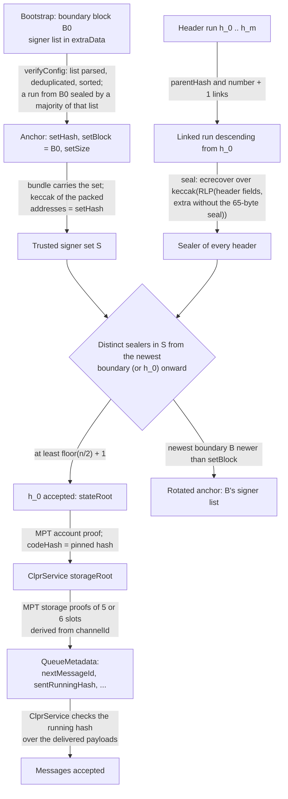
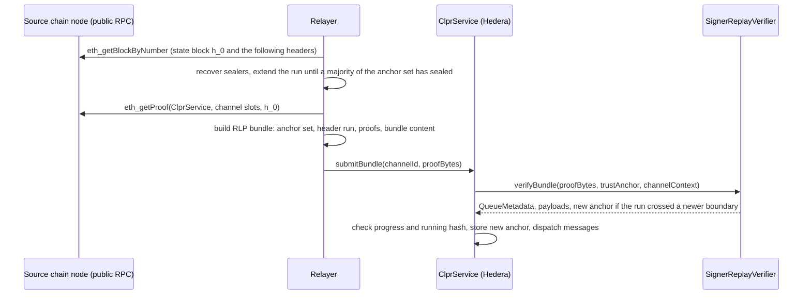

# SignerReplayVerifier: single-seal PoA / PoSA chains → Hiero

`SignerReplayVerifier` is an `IClprVerifier` that runs on Hedera's EVM and verifies CLPR bundles from chains that
seal each block with one ECDSA signature and have no finality gadget: go-ethereum Clique (Immutable zkEVM), HECO
Congress (GRX Chain) and Bitkub's Clique fork in PoS mode (KUB). Direction: `<chain> → Hiero`. The verifier replays
a hash-linked run of real headers and accepts the oldest header's state root once a strict majority of the trusted
signer set has sealed headers in that run. It follows the signer set through the boundary blocks (checkpoints,
epoch blocks, span-commit blocks) that publish it. It then proves the ClprService queue storage against that state
root with the shared Merkle-Patricia code in `ClprEvmBundleVerifier`.

These chains do not have BFT finality. "Accepted" here means "sealed over by a majority of the signers", which is
the strongest statement a light client can make about them. On Immutable zkEVM the signer set is **one key**.

## At a glance

| Item | Value |
|---|---|
| Chains covered | Immutable zkEVM mainnet (`eip155:13371`) and testnet (`eip155:13473`); KUB mainnet (`eip155:96`) and testnet (`eip155:25925`); GRX Chain mainnet (`eip155:1110`). Per-chain pages: [`docs/chains/`](../../../../docs/chains/README.md) |
| Finality source | None on the source chain. The verifier requires seals from ⌊n/2⌋ + 1 distinct signers of the trusted set on a linked run that descends from the proven block |
| Trust (one line) | A majority of the signer set is honest and keeps its keys (Immutable: the single Immutable signer; GRX: 2 of 3 operators; KUB: 4 of 6 or 7 including the Bitkub super node), plus a correct bootstrap boundary block |
| Typical bundle | Live, no rotation: 0.84M-1.54M gas (`eth_estimateGas`), 8.1-18.4 KB calldata, see [Gas and calldata](#gas-and-calldata) |
| Bundle with rotation | Live, 1 boundary in the run: 0.84M-1.54M gas, same calldata (a rotation is one boundary header inside the run) |
| Contract size | `SignerReplayVerifier` runtime 17,313 B (7,263 B under EIP-170) |
| Status | Live-verified on Immutable zkEVM mainnet and testnet, KUB mainnet and testnet, GRX Chain mainnet; fixtures captured 2026-10-01 |

## How it works



1. `SignerReplayVerifier.sol:_decodeAnchor` reads the 74-byte trust anchor. `SignerReplayVerifier.sol:_replay`
   decodes the supplied signer bytes with `ClprSignerReplay.sol:decodeSignerBytes` (strictly ascending) and requires
   their hash and count to match the anchor.
2. `SignerReplayVerifier.sol:_walk` decodes every header with `ClprSignerReplay.sol:decodeHeader`, checks the
   parent-hash and number links with `ClprSignerReplay.sol:requireChild`, and recovers each sealer with
   `ClprSignerReplay.sol:sealSigner` over the profile's seal fields.
3. `_walk` finds the newest boundary block in the run (`(number + boundaryOffset) % epochLength == 0`) and counts
   distinct sealers that are members of the anchor set from that header onward (`ClprSignerReplay.sol:indexOf`). It
   reverts with `InsufficientSigners` below ⌊n/2⌋ + 1.
4. `_replay` checks that `h_0` is not older than `setBlock` (and, if the profile sets `maxAnchorAge`, not too far
   past it) and takes `h_0.stateRoot`.
5. `ClprEvmBundleVerifier.sol:_verifyServiceStorageRoot` checks the account proof and the pinned code hash.
   `ClprEvmBundleVerifier.sol:_verifyChannelStorage` proves the channel slots and builds `QueueMetadata`.
   `ClprEvmBundleVerifier.sol:_decodeBundleContent` returns the message payloads.
6. If the run contains a boundary block newer than `setBlock`, `_replay` parses its list with
   `ClprSignerReplay.sol:parseSigners` and `verifyBundle` returns the new anchor and its id (the boundary number).

## Bundle lifecycle



To rotate, the relayer starts the run at (or before) a boundary block and extends it until a majority of the
anchor set has sealed from the boundary onward. The rotation travels with the state proof; there is no separate
rotation transaction.

## Trust model

Trusted:
- **A strict majority of the trusted signer set is honest** and only seals blocks on the chain it follows. Under that
  assumption a run that a majority sealed is on the canonical chain. Signers outside the set may appear in the run
  (they may be newly added) but do not count.
- **The signers keep their keys after they leave the set.** The anchor set stays usable until a newer boundary is
  replayed. A majority of an old set that sells or leaks its keys can forge a run against a stale anchor
  (long-range attack). `maxAnchorAge` bounds this per deployment; the shipped profiles leave it at 0 (no limit) so
  idle channels can still catch up.
- **The bootstrap boundary block** chosen at `verifyConfig` (weak subjectivity). The config run must be sealed by a
  majority of the published list, which rejects a list that never produced blocks, but the choice of boundary is
  the deployer's.
- **The profile** (epoch, offsets, seal fields, entry layout) is fixed at deployment; a wrong profile only causes
  reverts.

Per chain (live, 2026-10-01):
- Immutable zkEVM: **trusts one key.** Mainnet and testnet checkpoints list a single signer; one valid seal is
  enough. This is the trust of the chain itself, not a weakness added by the verifier.
- GRX Chain: 3 validators, 2 needed.
- KUB: 6 or 7 signers (span schedule addresses plus the Bitkub super node, which may seal any block), 4 needed.

Not trusted: the relayer, the RPC (every header is checked by hash links and seals, every state value by MPT
proofs), the ordering or content of the signer list as supplied (it must hash to the anchor).

To forge a bundle an attacker must hold ⌊n/2⌋ + 1 keys of the anchor set (on Immutable zkEVM: the one key), or get
a channel bootstrapped from a false boundary block.

## Proof format

`proofBytes` is an RLP list:

| # | Field | Type | Meaning |
|---|---|---|---|
| 0 | `signers` | bytes | Anchor set, `n × address20`, strictly ascending; keccak256 must equal `setHash` |
| 1 | `headers` | list of headers | `[h_0, …, h_m]`, each the parent of the next; full RLP headers as the chain encodes them (15-21 fields) |
| 2 | `accountProof` | list of bytes | MPT account proof for the ClprService at `h_0.stateRoot` |
| 3 | `storageProof` | list | 5 or 6 × `[slot32, [nodes]]` for the channelId-derived slots |
| 4 | `bundleContent` | bytes | Protobuf `ClprBundleContent` |
| 5, 6 | `manifestStorageProof`, `manifestPreimage` | optional | Endpoint-manifest update proved under the same storage root |

Trust anchor (74 bytes, packed): `codeHash (32) ‖ setHash (32) ‖ setBlock (uint64) ‖ setSize (uint16)`. The trust
anchor id is `setBlock` as 8 big-endian bytes.

`configProofBytes` is `RLP([ledgerConfiguration, headers, codeHash])`: the CLPR `ClprMessagePayload` control message
carrying the peer's `LedgerConfiguration` (its CAIP-2 id must be `eip155:<chainId>`), a run whose first header is a
boundary block and is the newest boundary in the run, and the ClprService code hash to pin. The config-time
manifest proof is `RLP([signers, headers, accountProof, manifestStorageProof, manifestPreimage])`.

Deployment profile (`SignerReplayVerifier.Profile`, presets in `SignerReplayProfiles.sol`):

| Parameter | Meaning | Immutable zkEVM | KUB | GRX Chain |
|---|---|---|---|---|
| `chainId` | EIP-155 id the CAIP-2 id must match | 13371 / 13473 | 96 / 25925 | 1110 |
| `epochLength` | boundary period in blocks | 30000 | 50 (span) | 200 |
| `boundaryOffset` | boundary iff `(n + offset) % epochLength == 0` | 0 | 1 | 0 |
| `sealFields` | leading header fields under the seal (0 = all) | 0 | 0 | 15 |
| `entrySize` | bytes per list entry, address first | 20 | 40 (address ‖ power) | 20 |
| `trailerSize` | bytes after the list, before the seal | 0 | 60 (3 system addresses) | 0 |
| `trailerSignerOffset` | trailer offset of an extra signer (255 = none) | 255 | 40 (super node) | 255 |
| `maxAnchorAge` | max blocks from `setBlock` to `h_0` (0 = none) | 0 | 0 | 0 |

## Validator-set / committee rotation

- A boundary block publishes the signer list: Clique checkpoints every 30000 blocks (Immutable), Congress epoch
  blocks every 200 blocks (GRX), Bitkub span-commit blocks every 50 blocks (KUB, the block before each span).
- Any bundle whose run contains a boundary newer than `setBlock` rotates; the newest boundary in the run wins. The
  run must carry a majority of the *old* set's seals from that boundary onward, so a rotation needs overlap between
  consecutive sets. If a set is replaced wholesale, rotation through this verifier stops and the channel needs a new
  bootstrap.
- Cost: a rotation is one more header in a run that is needed anyway. Live, rotation and plain bundles differ by
  4K-98K gas.
- Catch-up: the run does not have to start at the anchor. Any recent run that contains a boundary and a majority of
  the anchor set's seals moves the anchor forward in one step, as long as the anchor set still seals.
- Clique and Bitkub can change signers between boundaries (Clique votes take effect at once). The verifier only
  learns of the change at the next boundary; until then a newly added signer does not count and a removed signer
  still counts.

## Gas and calldata

Measured on anvil with `eth_estimateGas` from the live fixtures (captured 2026-10-01), by
`test/e2e/tests/verifiers/signer-kaia-live.spec.ts`:

| Network | Run | Signers (needed) | Rotation bundle | No rotation | Calldata |
|---|---|---|---|---|---|
| Immutable zkEVM mainnet | 1 header | 1 (1) | 1,540,088 gas | 1,536,232 gas | 18,404 B |
| Immutable zkEVM testnet | 1 header | 1 (1) | 839,897 gas | 836,109 gas | 8,068 B |
| KUB mainnet | 6 headers | 6 → 7 (4) | 1,041,365 gas | 942,986 gas | 10,628 B |
| KUB testnet | 3 headers | 5 (3) | 1,420,906 gas | 1,343,512 gas | 17,604 B |
| GRX Chain mainnet | 2 headers | 3 (2) | 1,434,413 gas | 1,427,520 gas | 16,516 B |

Most of the spread comes from the depth of the account and storage proofs, not from the run. **Synthetic** scaling
(`SignerReplayGas.t.sol`, execution gas, 15-field headers, 64-signer set): a 33-header run costs 1,932,126 gas with a
21,641 B proof, a 64-header run 3,609,204 gas with 40,303 B, about 55K gas and 600 B per header. Against Hedera's
limits (15M gas, 128 KB calldata) calldata binds first, at roughly 190 headers per bundle; `MAX_HEADERS` is 256.

## Limits and known gaps

- **No finality.** A majority-sealed run is the best available evidence; a majority of colluding signers can
  produce a competing run. Relayers should also wait for depth on their side before submitting.
- Single-signer chains (Immutable zkEVM) give single-key trust; the verifier cannot improve on the chain's own
  model.
- Rotation needs overlap between consecutive sets (see above). A wholesale replacement needs a new channel bootstrap.
- Mid-epoch signer changes are invisible until the next boundary (Clique votes, Bitkub validator-contract changes).
- KUB public RPCs served `eth_getProof` 100 blocks back but not 1,000 blocks back (2026-10-01); the proof must be
  fetched while `h_0` is recent.
  Immutable and GRX public RPCs serve historical state (checked back 1,000,000 blocks on 2026-10-01).
- `rpc.grxchain.io` served an expired TLS certificate on 2026-10-01; the capture script skips certificate checks for
  that endpoint only. The data is still verified by hash links, seals and MPT proofs, offline and on chain.
- GRX Chain's node source is not public. Its rules (Congress 15-field seal, 20-byte epoch list, system contracts at
  `0x…f000`-`0x…f002`) were derived from live headers and match the HECO Congress engine.
- No ClprService is deployed on these chains; the fixtures prove a real contract's code hash and empty channel
  slots (exclusion proofs). A bundle with messages has not been run on these chains.
- Ontology (`eip155:58`), listed with this group, is **not covered**: its headers are not Ethereum headers (VBFT,
  P-256 bookkeeper multisig) and it has no state trie for EVM storage (`eth_getProof` returns "not supported"). See
  [`docs/chains/ontology.md`](../../../../docs/chains/ontology.md).

## Upgrades and forks

- The seal hash does not include the chain id. Replay across chains is prevented by the anchor set (different
  chains have different keys) and the CAIP-2 check in `verifyConfig`, not by the seal.
- A hard fork that adds header fields is handled when the seal covers all fields (Clique, Bitkub): the verifier
  re-encodes whatever fields the header carries, up to 21. Immutable's seal hash orders `excessBlobGas` before
  `blobGasUsed`; both must be zero there, so the encodings agree. A fork that changes the seal-hash field set
  (Congress' 15-field rule), the `extraData` layout or the boundary period breaks verification.
- Under the fork-aware verifier ADR
  ([`ADR/2026-10-01-fork-aware-verifiers.md`](https://github.com/shayansal/clpr-spec/blob/adr/fork-handling/ADR/2026-10-01-fork-aware-verifiers.md),
  draft PR [LFDT-CLPR/clpr-spec#1](https://github.com/LFDT-CLPR/clpr-spec/pull/1)) a seal-hash or layout change is
  Class B (a LAYOUT fork profile) and a consensus change (for example KUB moving off Clique) is Class C (channel
  succession). Signer-set changes are Class A and follow rotation.
- This verifier is **not fork-aware yet**: the profile is immutable and there are no typed fork reverts.

## Running it

```sh
# Unit, compliance, live-vector and gas tests (Foundry)
forge test --match-contract SignerReplay -vv

# Live fixture replay on anvil (deploys the verifier per network, verifyConfig + verifyBundle on real data)
forge build && npm run test:e2e:signer-kaia-live

# Refresh the live fixtures from public RPCs (all networks, or one with --network <name>), then rebuild vectors
npm run signer-replay-live:refresh
npx tsx test/e2e/relay/buildSignerReplayLiveProof.ts --vectors
```

Test counts on this branch: 26 unit, 28 compliance, 11 live-vector and 2 gas tests (Foundry); 25 anvil tests for
this verifier in `signer-kaia-live.spec.ts`.

## Files

| File | Purpose |
|---|---|
| `src/verifiers/evm/signer/SignerReplayVerifier.sol` | Profile, trust anchor, `verifyBundle`, `verifyConfig`, run walk and rotation |
| `src/verifiers/evm/signer/SignerReplayProfiles.sol` | Profiles for Immutable zkEVM, KUB and GRX Chain |
| `src/libraries/proof/signer/ClprSignerReplay.sol` | Header decoding, seal recovery, signer-list parsing and hashing |
| `src/verifiers/evm/common/ClprEvmBundleVerifier.sol` | Shared MPT account and channel-storage proofs, bundle content decoding |
| `test/verifiers/evm/signer/SignerReplayVerifier.t.sol` | Synthetic unit tests, including negative cases |
| `test/verifiers/evm/signer/SignerReplayLive.t.sol` | Live vectors for all five networks, with negative cases |
| `test/verifiers/evm/signer/SignerReplayGas.t.sol` | Synthetic gas scaling with run length |
| `test/verifiers/compliance/SignerReplayComplianceTest.t.sol` | `IClprVerifier` compliance suite |
| `test/verifiers/compliance/HeaderSetComplianceBase.sol` | Compliance plumbing shared with `KaiaIstanbulVerifier` |
| `test/helpers/SignerReplaySynthetic.sol` | Synthetic sealed headers, bundles and config proofs |
| `test/e2e/fixtures/signer-replay-live/<network>.json` | Raw RPC captures (headers and `eth_getProof`) |
| `test/e2e/fixtures/signer-replay-live/<network>-vectors.json` | Encoded config, anchors and bundles built from the captures |
| `test/e2e/relay/buildSignerReplayLiveProof.ts` | Capture (`--refresh`) and bundle builder (`--vectors`) |
| `test/e2e/relay/liveCommon.ts` | RPC, config and proof helpers shared with the Kaia builder |
| `test/e2e/tests/verifiers/signer-kaia-live.spec.ts` | Anvil replay of the live fixtures |

## References

- go-ethereum Clique as forked by Immutable, `consensus/clique/clique.go` (`encodeSigHeader`, checkpoint signers):
  https://github.com/immutable/immutable-geth (commit `6e91938`)
- Bitkub Chain client, `consensus/clique/clique.go`, `snapshot.go`, `utils/utils.go` (span validator list, super
  node, `verifySealPoS`): https://github.com/kub-chain/bkc (commit `28cb560`)
- Bitkub Chain genesis files (span 50, Chaophraya and Basel blocks): https://github.com/kub-chain/bkc-node
- HECO Congress engine, `consensus/congress/congress.go` (`encodeSigHeader`, 15 fields):
  https://github.com/HuobiGroup/huobi-eco-chain
- GRX Chain: chain id 1110 and the client string `Geth/v1.3.0-unstable` read live from https://rpc.grxchain.io
  (`eth_chainId`, `web3_clientVersion`, 2026-10-01); the node source is not published
- Ontology node, `core/types/header.go` and `http/ethrpc/eth/api.go` (`GetProof` unsupported):
  https://github.com/ontio/ontology (commit `1d2d81e`)
- Fork-aware verifier ADR: https://github.com/shayansal/clpr-spec/blob/adr/fork-handling/ADR/2026-10-01-fork-aware-verifiers.md
